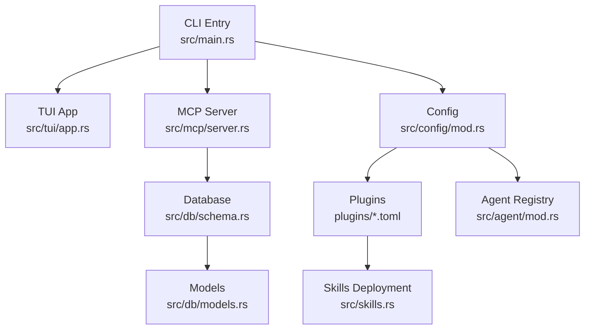
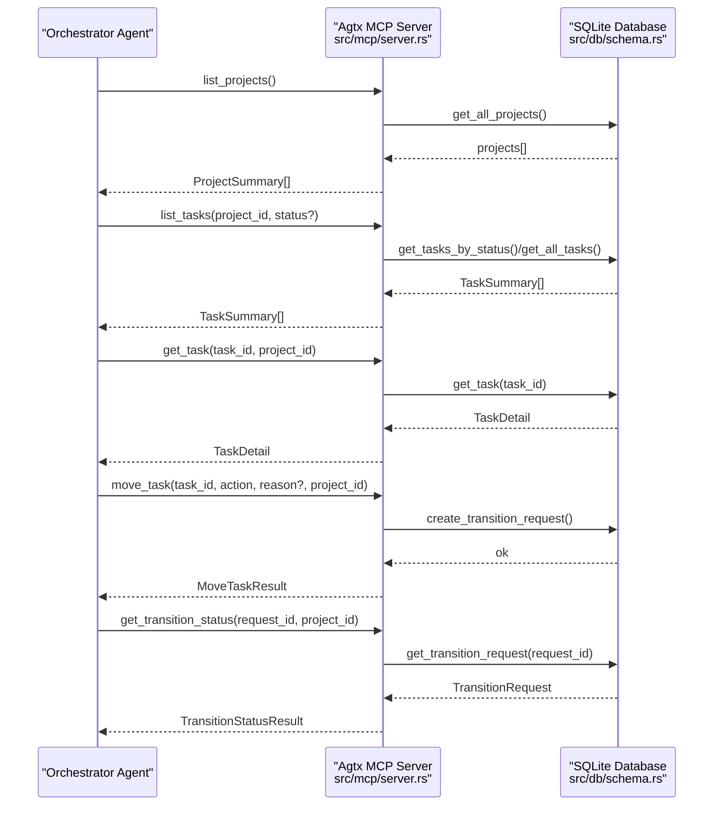
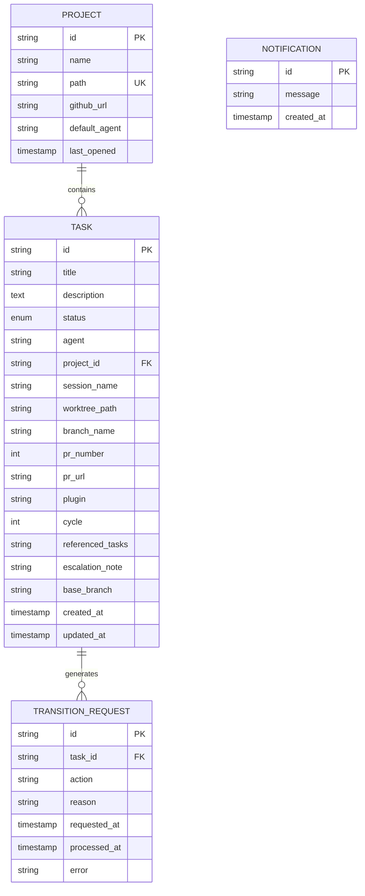
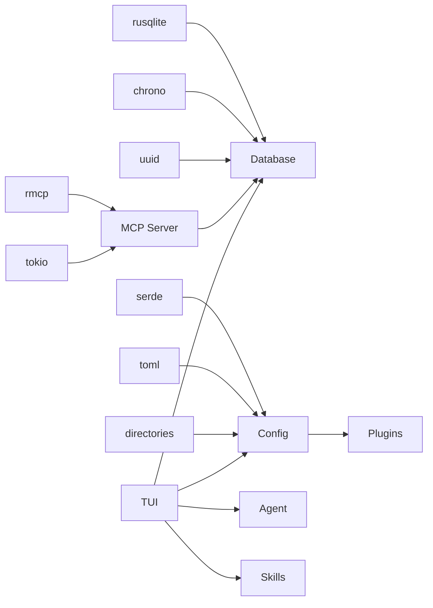

# API Reference

<cite>
**Referenced Files in This Document**
- [README.md](file://README.md)
- [Cargo.toml](file://Cargo.toml)
- [src/lib.rs](file://src/lib.rs)
- [src/main.rs](file://src/main.rs)
- [src/mcp/mod.rs](file://src/mcp/mod.rs)
- [src/mcp/server.rs](file://src/mcp/server.rs)
- [src/config/mod.rs](file://src/config/mod.rs)
- [src/db/mod.rs](file://src/db/mod.rs)
- [src/db/models.rs](file://src/db/models.rs)
- [src/db/schema.rs](file://src/db/schema.rs)
- [src/agent/mod.rs](file://src/agent/mod.rs)
- [src/skills.rs](file://src/skills.rs)
- [plugins/agtx/plugin.toml](file://plugins/agtx/plugin.toml)
- [plugins/void/plugin.toml](file://plugins/void/plugin.toml)
- [AGENTS.md](file://AGENTS.md)
- [CONTRIBUTING.md](file://CONTRIBUTING.md)
</cite>

## Table of Contents
1. [Introduction](#introduction)
2. [Project Structure](#project-structure)
3. [Core Components](#core-components)
4. [Architecture Overview](#architecture-overview)
5. [Detailed Component Analysis](#detailed-component-analysis)
6. [Dependency Analysis](#dependency-analysis)
7. [Performance Considerations](#performance-considerations)
8. [Troubleshooting Guide](#troubleshooting-guide)
9. [Conclusion](#conclusion)
10. [Appendices](#appendices)

## Introduction
This API reference documents the public interfaces and programmatic access points of agtx. It covers:
- MCP server tools for controlling the terminal kanban board
- Configuration options (global, project-specific, agent, plugin)
- CLI command reference and operational modes
- Plugin configuration format and compatibility
- Data model and database schema
- Practical usage patterns, error handling, integration approaches, and versioning/migration guidance

## Project Structure
Agtx is a Rust application with modular components:
- CLI entrypoint and mode routing
- MCP server exposing board tools over stdio
- Configuration subsystem for global and project settings
- Database layer for tasks, projects, notifications, and transition requests
- Agent integration and skill deployment
- Plugin system for workflow customization

**Diagram sources**
- [src/main.rs:16-96](file://src/main.rs#L16-L96)
- [src/mcp/server.rs:1245-1263](file://src/mcp/server.rs#L1245-L1263)
- [src/db/schema.rs:12-67](file://src/db/schema.rs#L12-L67)
- [src/config/mod.rs:1-595](file://src/config/mod.rs#L1-L595)
- [src/agent/mod.rs:1-171](file://src/agent/mod.rs#L1-L171)
- [src/skills.rs:1-409](file://src/skills.rs#L1-L409)
- [src/db/models.rs:1-245](file://src/db/models.rs#L1-L245)

**Section sources**
- [src/lib.rs:10-24](file://src/lib.rs#L10-L24)
- [src/main.rs:16-96](file://src/main.rs#L16-L96)
- [AGENTS.md:18-31](file://AGENTS.md#L18-L31)

## Core Components
- CLI and AppMode routing
- MCP server with tools for listing projects/tasks, task lifecycle control, conflict checks, notifications, pane inspection, and messaging
- Configuration subsystem for global and project settings, agent overrides, and plugin definitions
- Database schema for tasks, projects, transition requests, and notifications
- Agent registry and skill deployment helpers
- Plugin system with TOML-based workflow definitions

**Section sources**
- [src/main.rs:16-96](file://src/main.rs#L16-L96)
- [src/mcp/server.rs:521-1263](file://src/mcp/server.rs#L521-L1263)
- [src/config/mod.rs:1-595](file://src/config/mod.rs#L1-L595)
- [src/db/schema.rs:97-208](file://src/db/schema.rs#L97-L208)
- [src/agent/mod.rs:1-171](file://src/agent/mod.rs#L1-L171)
- [src/skills.rs:1-409](file://src/skills.rs#L1-L409)

## Architecture Overview
Agtx exposes a Model Context Protocol (MCP) server that controls the kanban board. The orchestrator agent can call tools to list projects, manage tasks, and inspect agent panes. The MCP server interacts with a SQLite-backed database to persist state and coordinate transitions.

**Diagram sources**
- [src/mcp/server.rs:521-755](file://src/mcp/server.rs#L521-L755)
- [src/db/schema.rs:478-554](file://src/db/schema.rs#L478-L554)

**Section sources**
- [README.md:573-646](file://README.md#L573-L646)
- [src/mcp/server.rs:1245-1263](file://src/mcp/server.rs#L1245-L1263)

## Detailed Component Analysis

### MCP Server Tools Reference
The MCP server exposes a set of tools for board control and diagnostics. Tools accept parameters and return structured JSON responses.

- Server modes
  - Global mode: serves all projects indexed in the global database; requires project_id for most tools
  - Project-scoped mode: bound to a single project path

- Tools and parameters
  - list_projects
    - Purpose: List all projects indexed by agtx
    - Parameters: none
    - Returns: Array of ProjectSummary objects
    - Errors: Database open failures
  - list_tasks
    - Purpose: List tasks for a project, optionally filtered by status
    - Parameters: status (optional), project_id (required in global mode)
    - Returns: Array of TaskSummary objects
    - Errors: Invalid status, database errors
  - get_task
    - Purpose: Get full details of a specific task including allowed_actions
    - Parameters: task_id, project_id (required in global mode)
    - Returns: TaskDetail object
    - Errors: Task not found, database errors
  - create_task
    - Purpose: Create a single backlog task
    - Parameters: title, description (optional), plugin (optional), referenced_tasks (optional), base_branch (optional), project_id (required in global mode)
    - Returns: CreateTaskResponse
    - Errors: Referenced task not found, database errors
  - create_tasks_batch
    - Purpose: Batch-create tasks with index-based dependencies
    - Parameters: tasks[], project_id (required in global mode)
    - Returns: CreateTasksBatchResponse
    - Constraints: Up to 50 tasks; depends_on indices must be less than current index; no duplicates
    - Errors: Empty tasks array, invalid dependencies, database errors
  - update_task
    - Purpose: Modify a backlog task (title, description, plugin, referenced_tasks, base_branch)
    - Parameters: task_id, fields (optional), project_id (required in global mode)
    - Returns: UpdateTaskResponse
    - Errors: Not a backlog task, referenced task not found, database errors
  - delete_task
    - Purpose: Delete a backlog task
    - Parameters: task_id, project_id (required in global mode)
    - Returns: DeleteTaskResponse
    - Errors: Not a backlog task, database errors
  - move_task
    - Purpose: Queue a task state transition
    - Parameters: task_id, action, reason (optional), project_id (required in global mode)
    - Valid actions: research, move_forward, move_to_planning, move_to_running, move_to_review, move_to_done, resume, escalate_to_user
    - Returns: MoveTaskResult
    - Errors: Invalid action, task not found, unsatisfied dependencies, database errors
  - get_transition_status
    - Purpose: Check status of a queued transition request
    - Parameters: request_id, project_id (required in global mode)
    - Returns: TransitionStatusResult (pending/completed/error)
    - Errors: Request not found, database errors
  - check_conflicts
    - Purpose: Non-destructive merge conflict check against main branch
    - Parameters: task_id (optional), project_id (required in global mode)
    - Returns: CheckConflictsResponse (main_branch, results[])
    - Errors: Main branch detection failure, task not found, database errors
  - get_notifications
    - Purpose: Fetch and consume pending notifications
    - Parameters: project_id (required in global mode)
    - Returns: GetNotificationsResponse (notifications[])
    - Errors: Database errors
  - read_pane_content
    - Purpose: Read last N lines of a task's agent tmux pane
    - Parameters: task_id, lines (optional, default 50), project_id (required in global mode)
    - Returns: ReadPaneResponse
    - Errors: Task not found, no active session, tmux capture failure
  - send_to_task
    - Purpose: Send a message to a task's agent pane (followed by Enter)
    - Parameters: task_id, message, project_id (required in global mode)
    - Returns: SendToTaskResponse
    - Errors: Task not in Planning/Running, no active session, tmux send failure

- Allowed actions computation
  - Depends on task status and plugin rules
  - Backlog: user-managed; no orchestrator actions
  - Planning/Running: move_forward, escalate_to_user
  - Review: move_to_done, resume
  - Forward transitions from Backlog are gated by dependency satisfaction

- Error handling patterns
  - Validation errors return descriptive strings
  - Database errors return formatted messages
  - Global mode requires project_id; missing returns a specific error

**Section sources**
- [src/mcp/server.rs:26-393](file://src/mcp/server.rs#L26-L393)
- [src/mcp/server.rs:521-1263](file://src/mcp/server.rs#L521-L1263)
- [src/db/schema.rs:478-554](file://src/db/schema.rs#L478-L554)

### Configuration Options Reference
- Global configuration (~/.config/agtx/config.toml)
  - default_agent: default agent for new tasks
  - agents: per-phase overrides (research, planning, running, review)
  - worktree: enabled, auto_cleanup, base_branch, worktree_dir
  - theme: color_* fields for UI theming
  - fullscreen_on_enter: attach to tmux session on task open
- Project configuration (.agtx/config.toml)
  - default_agent, agents, base_branch, github_url, worktree_dir, copy_files, init_script, cleanup_script, workflow_plugin
- Merged configuration
  - Project overrides global; phase-specific agent overrides combine
  - Theme and UI preferences are global

- Agent compatibility and plugin configuration
  - WorkflowPlugin loaded from plugin.toml
  - Fields: name, description, init_script, supported_agents, artifacts, commands, prompts, prompt_triggers, copy_dirs, copy_files, cyclic, clear_context_on_advance, copy_back, auto_dismiss
  - Supported agents: empty means all agents supported
  - Commands and prompts support placeholders: {task}, {task_id}, {phase}
  - Cyclic workflows enable Review → Planning transitions
  - Auto-dismiss rules detect pane content and send keystrokes

**Section sources**
- [src/config/mod.rs:1-595](file://src/config/mod.rs#L1-L595)
- [README.md:261-504](file://README.md#L261-L504)
- [plugins/agtx/plugin.toml:1-16](file://plugins/agtx/plugin.toml#L1-L16)
- [plugins/void/plugin.toml:1-4](file://plugins/void/plugin.toml#L1-L4)

### CLI Command Reference
- Modes
  - Default: if in a git repository, project mode; otherwise dashboard
  - -g: dashboard mode
  - . or path: project mode for the given path
  - mcp-serve: start MCP server
    - Global mode: agtx mcp-serve
    - Project-scoped mode: agtx mcp-serve <path>
- Flags
  - --experimental: enable experimental features (orchestrator agent)
- First-run behavior
  - Detects old config location and migrates
  - Prompts for default agent if no config and no database
  - Saves defaults for existing users

**Section sources**
- [src/main.rs:16-96](file://src/main.rs#L16-L96)
- [src/lib.rs:12-24](file://src/lib.rs#L12-L24)
- [README.md:73-98](file://README.md#L73-L98)

### Plugin Configuration Reference
- plugin.toml fields
  - name, description
  - init_script: shell command to run in worktree after creation
  - supported_agents: list of agent names
  - copy_dirs, copy_files: extra files/dirs to copy into worktrees
  - cyclic: enable Review → Planning transitions
  - clear_context_on_advance: send clear-context command before phase skill
  - copy_back: files/dirs to copy back to project root after phase completion
  - auto_dismiss: list of rules to auto-dismiss interactive prompts
  - artifacts: phase-specific artifact file paths (supports {phase})
  - commands: phase commands (canonical format; translated per agent)
  - prompts: phase prompts with placeholders
  - prompt_triggers: text to wait for before sending prompts
- Command translation
  - Claude/Gemini: canonical unchanged
  - OpenCode: colon → hyphen
  - Codex: slash → dollar, colon → hyphen
  - Cursor: colon → hyphen
- Built-in plugins
  - agtx, agtx-terse, gsd, spec-kit, openspec, void, bmad, superpowers, oh-my-claudecode, agent-skills

**Section sources**
- [src/config/mod.rs:410-595](file://src/config/mod.rs#L410-L595)
- [README.md:329-504](file://README.md#L329-L504)
- [plugins/agtx/plugin.toml:1-16](file://plugins/agtx/plugin.toml#L1-L16)
- [plugins/void/plugin.toml:1-4](file://plugins/void/plugin.toml#L1-L4)

### Data Model Reference
- Task
  - Fields: id, title, description, status, agent, project_id, session_name, worktree_path, branch_name, pr_number, pr_url, plugin, cycle, referenced_tasks, escalation_note, base_branch, created_at, updated_at
  - Status: backlog, planning, running, review, done
- Project
  - Fields: id, name, path, github_url, default_agent, last_opened
- TransitionRequest
  - Fields: id, task_id, action, reason, requested_at, processed_at, error
- Notification
  - Fields: id, message, created_at
- Agent and skills
  - Agent: name, command, args, description, co_author
  - Skill deployment helpers for agent-native paths and command transformations

**Diagram sources**
- [src/db/models.rs:58-245](file://src/db/models.rs#L58-L245)
- [src/db/schema.rs:97-208](file://src/db/schema.rs#L97-L208)

**Section sources**
- [src/db/models.rs:1-245](file://src/db/models.rs#L1-L245)
- [src/db/schema.rs:97-208](file://src/db/schema.rs#L97-L208)

### Practical Usage Patterns and Examples
- Using the MCP server
  - Global mode: call list_projects first to obtain project_id, then call list_tasks, get_task, move_task, etc.
  - Project-scoped mode: omit project_id; server operates on the fixed project path
- Creating tasks
  - Single task: create_task with title and optional plugin/base_branch
  - Batch tasks: create_tasks_batch with depends_on indices; resolves to referenced_tasks
- Managing dependencies
  - referenced_tasks (create_task) or depends_on (create_tasks_batch) gate forward transitions from Backlog
- Conflict checks
  - check_conflicts on Review tasks to detect merge conflicts before PR creation
- Diagnostics
  - read_pane_content to inspect agent output when idle
  - send_to_task to answer prompts or nudge stuck agents
- Notifications
  - get_notifications to poll for orchestrator events

**Section sources**
- [src/mcp/server.rs:521-1263](file://src/mcp/server.rs#L521-L1263)
- [README.md:573-646](file://README.md#L573-L646)

### Versioning, Backwards Compatibility, and Migration
- Version and metadata
  - Package metadata in Cargo.toml indicates version and dependencies
- Migration
  - First-run migration of config from legacy directories to ~/.config/agtx/
  - Database schema evolves with ALTER TABLE statements; migrations are additive
- Backwards compatibility
  - Database migrations add columns with default values; existing rows remain valid
  - Plugin fields are optional; missing fields fall back to defaults

**Section sources**
- [Cargo.toml:1-50](file://Cargo.toml#L1-L50)
- [src/main.rs:98-119](file://src/main.rs#L98-L119)
- [src/db/schema.rs:122-179](file://src/db/schema.rs#L122-L179)

### Client Implementation Guidelines
- Register the MCP server
  - Global mode: agtx mcp-serve
  - Project-scoped: agtx mcp-serve <path>
- Use list_projects to discover project_id in global mode
- Implement retry/backoff for get_transition_status
- Respect allowed_actions computed by get_task
- Use read_pane_content and send_to_task for diagnostics and nudging
- Handle notifications for orchestrator-driven events

**Section sources**
- [README.md:573-646](file://README.md#L573-L646)
- [src/mcp/server.rs:1218-1243](file://src/mcp/server.rs#L1218-L1243)

## Dependency Analysis
- External dependencies
  - rmcp for MCP server implementation
  - tokio for async runtime
  - rusqlite for SQLite
  - serde, serde_json, toml for serialization
  - directories for platform-specific paths
  - chrono, uuid for timestamps and identifiers
- Internal module dependencies
  - mcp server depends on config, db, git, tmux
  - tui depends on db, config, agent, skills
  - skills depend on plugin definitions

**Diagram sources**
- [Cargo.toml:12-37](file://Cargo.toml#L12-L37)
- [src/mcp/server.rs:1-15](file://src/mcp/server.rs#L1-L15)
- [src/db/schema.rs:1-6](file://src/db/schema.rs#L1-L6)
- [src/config/mod.rs:1-6](file://src/config/mod.rs#L1-L6)
- [src/agent/mod.rs:1-6](file://src/agent/mod.rs#L1-L6)
- [src/skills.rs:1-6](file://src/skills.rs#L1-L6)

**Section sources**
- [Cargo.toml:12-37](file://Cargo.toml#L12-L37)

## Performance Considerations
- MCP server uses JSON-RPC over stdio; keep payloads minimal
- Batch task creation reduces round-trips
- Use get_transition_status to poll completion rather than busy-waiting
- Pane reads are bounded by lines parameter to limit I/O

[No sources needed since this section provides general guidance]

## Troubleshooting Guide
- MCP server errors
  - Global mode requires project_id; ensure list_projects is called first
  - Invalid status or action strings return descriptive errors
- Task operations
  - Backlog-only updates/deletes enforced; ensure task status is backlog
  - Referenced tasks must exist; dependency validation occurs before creation
- Transition requests
  - Pending transitions can be polled; errors recorded in TransitionRequest
- Notifications
  - Use get_notifications to drain event queue; orchestrator also pushes automatically when idle
- Pane inspection
  - Ensure task has an active session; tmux capture-pane errors return descriptive messages

**Section sources**
- [src/mcp/server.rs:521-1263](file://src/mcp/server.rs#L521-L1263)
- [src/db/schema.rs:478-554](file://src/db/schema.rs#L478-L554)

## Conclusion
Agtx provides a robust MCP-controlled kanban board for managing parallel coding agent sessions. Its configuration system, plugin architecture, and SQLite-backed state enable flexible workflows across agents and projects. The MCP tools offer comprehensive control for automation and integration scenarios.

[No sources needed since this section summarizes without analyzing specific files]

## Appendices

### MCP Tool Parameter and Response Definitions
- list_projects
  - Params: none
  - Returns: ProjectSummary[]
- list_tasks
  - Params: status?, project_id?
  - Returns: TaskSummary[]
- get_task
  - Params: task_id, project_id?
  - Returns: TaskDetail
- create_task
  - Params: title, description?, plugin?, referenced_tasks?, base_branch?, project_id?
  - Returns: CreateTaskResponse
- create_tasks_batch
  - Params: tasks[], project_id?
  - Returns: CreateTasksBatchResponse
- update_task
  - Params: task_id, title?, description?, plugin?, referenced_tasks?, base_branch?, project_id?
  - Returns: UpdateTaskResponse
- delete_task
  - Params: task_id, project_id?
  - Returns: DeleteTaskResponse
- move_task
  - Params: task_id, action, reason?, project_id?
  - Returns: MoveTaskResult
- get_transition_status
  - Params: request_id, project_id?
  - Returns: TransitionStatusResult
- check_conflicts
  - Params: task_id?, project_id?
  - Returns: CheckConflictsResponse
- get_notifications
  - Params: project_id?
  - Returns: GetNotificationsResponse
- read_pane_content
  - Params: task_id, lines?, project_id?
  - Returns: ReadPaneResponse
- send_to_task
  - Params: task_id, message, project_id?
  - Returns: SendToTaskResponse

**Section sources**
- [src/mcp/server.rs:26-393](file://src/mcp/server.rs#L26-L393)