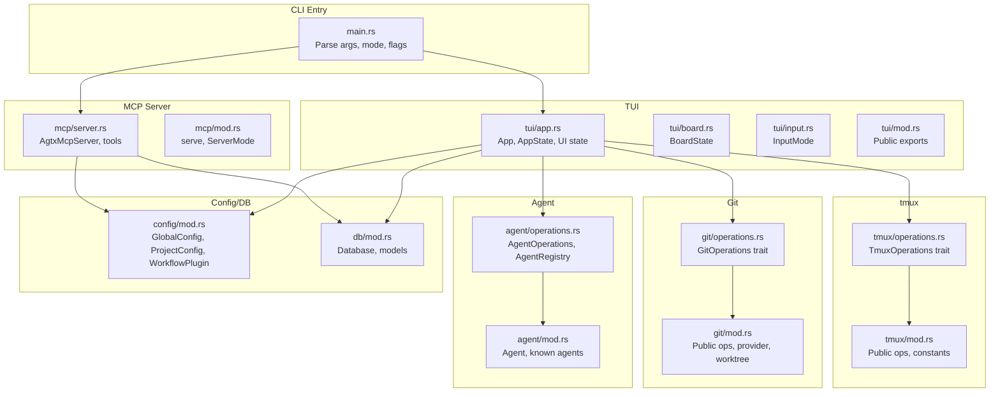
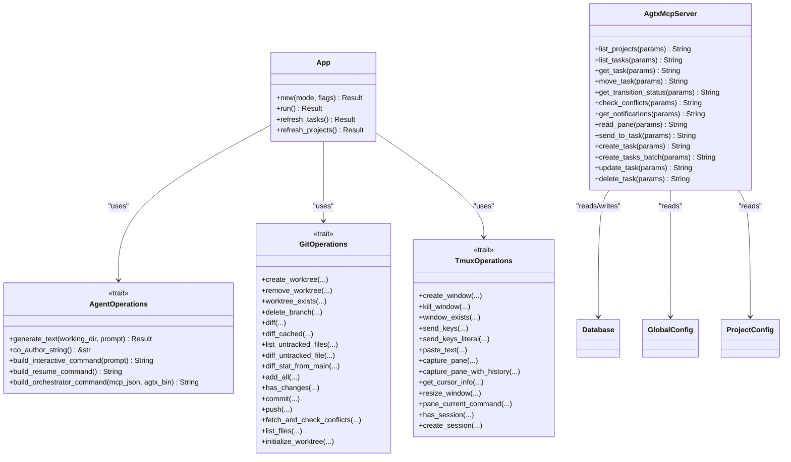
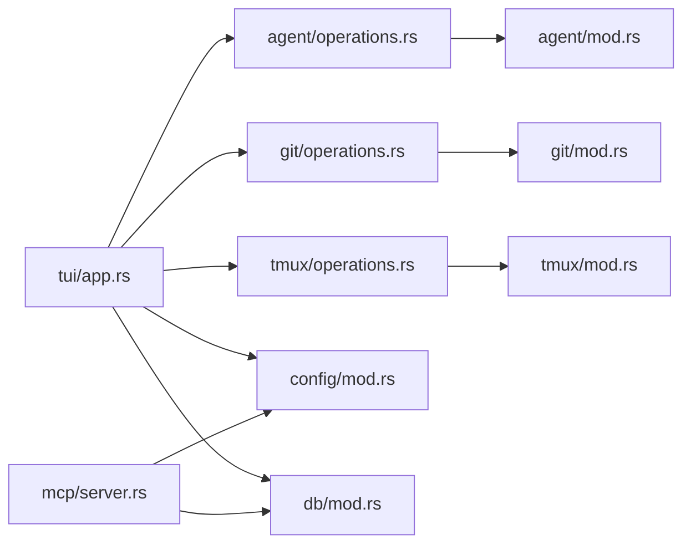

# API Reference

<cite>
**Referenced Files in This Document**
- [lib.rs](file://src/lib.rs)
- [main.rs](file://src/main.rs)
- [mod.rs](file://src/tui/mod.rs)
- [app.rs](file://src/tui/app.rs)
- [board.rs](file://src/tui/board.rs)
- [input.rs](file://src/tui/input.rs)
- [server.rs](file://src/mcp/server.rs)
- [mod.rs](file://src/mcp/mod.rs)
- [mod.rs](file://src/git/mod.rs)
- [operations.rs](file://src/git/operations.rs)
- [mod.rs](file://src/tmux/mod.rs)
- [operations.rs](file://src/tmux/operations.rs)
- [mod.rs](file://src/agent/mod.rs)
- [operations.rs](file://src/agent/operations.rs)
- [mod.rs](file://src/skills.rs)
- [mod.rs](file://src/config/mod.rs)
- [mod.rs](file://src/db/mod.rs)
</cite>

## Table of Contents
1. [Introduction](#introduction)
2. [Project Structure](#project-structure)
3. [Core Components](#core-components)
4. [Architecture Overview](#architecture-overview)
5. [Detailed Component Analysis](#detailed-component-analysis)
6. [Dependency Analysis](#dependency-analysis)
7. [Performance Considerations](#performance-considerations)
8. [Troubleshooting Guide](#troubleshooting-guide)
9. [Conclusion](#conclusion)
10. [Appendices](#appendices)

## Introduction
This document describes the internal and external programmatic interfaces of AGTX, focusing on:
- TUI application API for task management, board operations, and user interaction handling
- MCP server JSON-RPC API for orchestrator control and task lifecycle management
- Agent integration APIs for command transformation, skill deployment, and agent communication
- Git operations API for worktree management, branch operations, and repository manipulation
- tmux integration API for session/window management and agent pane communication

It provides method signatures, parameter specifications, response formats, usage examples, error handling strategies, and security considerations.

## Project Structure
AGTX exposes modular APIs organized by domain:
- TUI: Kanban board, task lifecycle, and user interactions
- MCP: JSON-RPC server for orchestrator control
- Agent: Agent detection, command building, and orchestration
- Git: Worktree and branch operations
- tmux: Session/window management and pane communication
- Config/DB: Configuration and persistence

**Diagram sources**
- [main.rs:16-96](file://src/main.rs#L16-L96)
- [app.rs:539-750](file://src/tui/app.rs#L539-L750)
- [board.rs:1-99](file://src/tui/board.rs#L1-L99)
- [input.rs:1-19](file://src/tui/input.rs#L1-L19)
- [server.rs:395-520](file://src/mcp/server.rs#L395-L520)
- [mod.rs:1-5](file://src/mcp/mod.rs#L1-L5)
- [mod.rs:1-171](file://src/agent/mod.rs#L1-L171)
- [operations.rs:16-163](file://src/agent/operations.rs#L16-L163)
- [mod.rs:1-142](file://src/git/mod.rs#L1-L142)
- [operations.rs:9-75](file://src/git/operations.rs#L9-L75)
- [mod.rs:1-189](file://src/tmux/mod.rs#L1-L189)
- [operations.rs:8-59](file://src/tmux/operations.rs#L8-L59)
- [mod.rs:1-595](file://src/config/mod.rs#L1-L595)
- [mod.rs:1-6](file://src/db/mod.rs#L1-L6)

**Section sources**
- [lib.rs:1-24](file://src/lib.rs#L1-L24)
- [main.rs:16-96](file://src/main.rs#L16-L96)

## Core Components
- TUI App: Central state machine managing board, tasks, user input, agent/tmux/git integrations
- MCP Server: JSON-RPC service exposing task lifecycle tools and notifications
- Agent Registry: Pluggable agent operations with command transformation and orchestration support
- Git Operations: Trait-based worktree and branch management
- tmux Operations: Trait-based session/window/pane control
- Config/DB: Global and project-scoped configuration plus task database

**Section sources**
- [app.rs:539-750](file://src/tui/app.rs#L539-L750)
- [server.rs:395-520](file://src/mcp/server.rs#L395-L520)
- [operations.rs:16-163](file://src/agent/operations.rs#L16-L163)
- [operations.rs:9-75](file://src/git/operations.rs#L9-L75)
- [operations.rs:8-59](file://src/tmux/operations.rs#L8-L59)
- [mod.rs:1-595](file://src/config/mod.rs#L1-L595)
- [mod.rs:1-6](file://src/db/mod.rs#L1-L6)

## Architecture Overview
AGTX integrates a TUI with persistent state, an MCP server for orchestrator control, and OS-level integrations for Git and tmux. The App composes injectable traits for operations, enabling testability and extensibility.

**Diagram sources**
- [app.rs:539-750](file://src/tui/app.rs#L539-L750)
- [server.rs:521-755](file://src/mcp/server.rs#L521-L755)
- [operations.rs:16-163](file://src/agent/operations.rs#L16-L163)
- [operations.rs:9-75](file://src/git/operations.rs#L9-L75)
- [operations.rs:8-59](file://src/tmux/operations.rs#L8-L59)
- [mod.rs:1-6](file://src/db/mod.rs#L1-L6)
- [mod.rs:1-595](file://src/config/mod.rs#L1-L595)

## Detailed Component Analysis

### TUI Application API
Public interfaces:
- App construction and lifecycle
- Board state and selection
- Input modes and UI state
- Integration points with agent, git, tmux, config, and database

Key behaviors:
- App initialization loads global/project config, detects agents, sets up tmux project session, and refreshes tasks/projects
- BoardState manages selection across columns and rows
- InputMode controls keyboard-driven UI flows
- App composes injectable traits for operations to support testing and customization

Usage patterns:
- Construct App with desired mode and feature flags
- Run the TUI loop to handle events and update state
- Use board and input state to drive task actions and UI rendering

Integration points:
- Agent registry for per-phase agent selection
- Git operations for worktree setup and branch management
- tmux operations for pane automation and session management
- Config for theme, defaults, and workflow plugin selection
- Database for task persistence and transition requests

**Section sources**
- [app.rs:539-750](file://src/tui/app.rs#L539-L750)
- [board.rs:1-99](file://src/tui/board.rs#L1-L99)
- [input.rs:1-19](file://src/tui/input.rs#L1-L19)
- [mod.rs:1-8](file://src/tui/mod.rs#L1-L8)

### MCP Server API (JSON-RPC)
ServerMode:
- Project: Binds to a specific project path
- Global: Serves all indexed projects; requires project_id for CRUD tools

Tools and parameters:
- list_projects: {}
- list_tasks: { status?, project_id? }
- get_task: { task_id, project_id? }
- move_task: { task_id, action, reason?, project_id? }
- get_transition_status: { request_id, project_id? }
- check_conflicts: { task_id?, project_id? }
- get_notifications: { project_id? }
- read_pane: { task_id, lines?, project_id? }
- send_to_task: { task_id, message, project_id? }
- create_task: { title, description?, plugin?, referenced_tasks?, base_branch?, project_id? }
- create_tasks_batch: { tasks: [{ title, description?, plugin?, depends_on?, base_branch? }], project_id? }
- update_task: { task_id, title?, description?, plugin?, referenced_tasks?, base_branch?, project_id? }
- delete_task: { task_id, project_id? }

Response formats:
- ProjectSummary: { id, name, path }
- TaskSummary: { id, title, description?, status, agent, branch_name?, pr_url?, plugin?, referenced_tasks?, base_branch?, deps_satisfied }
- TaskDetail: { id, title, description?, status, agent, project_id, session_name?, worktree_path?, branch_name?, pr_number?, pr_url?, plugin?, cycle, referenced_tasks?, base_branch?, escalation_note?, created_at, updated_at, deps_satisfied, blocking_tasks, allowed_actions }
- MoveTaskResult: { request_id, message }
- TransitionStatusResult: { request_id, status, error? }
- CheckConflictsResponse: { main_branch, results: [ConflictCheckResult] }
- GetNotificationsResponse: { notifications: [{ message, created_at }] }
- ReadPaneResponse: { task_id, session_name, content, lines_requested }
- SendToTaskResponse: { task_id, session_name, success, message }
- CreateTaskResponse: { id, title, status }
- CreateTasksBatchResponse: { created: [{ index, id, title }], count }
- UpdateTaskResponse: { id, title, updated_fields }
- DeleteTaskResponse: { id, title, message }

Behavior notes:
- In Global mode, project_id is required for tools that operate on a specific project
- Allowed actions are computed based on task status and plugin rules
- Conflict checks use non-destructive merge-tree checks
- Transition requests queue state changes processed by the TUI

Example usage:
- List projects, then list tasks filtered by status
- Move a task to running, poll get_transition_status until completion
- Read recent pane output for diagnostics
- Send a message to a task’s agent pane

Security and rate limiting:
- No built-in authentication or rate limiting; run locally or behind a trusted proxy
- Treat MCP as an internal IPC mechanism

**Section sources**
- [server.rs:16-24](file://src/mcp/server.rs#L16-L24)
- [server.rs:26-242](file://src/mcp/server.rs#L26-L242)
- [server.rs:244-392](file://src/mcp/server.rs#L244-L392)
- [server.rs:409-471](file://src/mcp/server.rs#L409-L471)
- [server.rs:521-755](file://src/mcp/server.rs#L521-L755)

### Agent Integration APIs
Agent registry and operations:
- Agent: name, command, args, description, co-author
- AgentOperations: generate_text, co-author string, interactive/resume/orchestrator command builders
- AgentRegistry: get agent by name with fallback to default

Command transformation and skill deployment:
- Transform plugin commands to agent-native invocation formats
- Enumerate built-in and agent-native skills
- Convert skill content to Gemini TOML format when needed

Orchestrator agent communication:
- Build orchestrator command with MCP registration for supported agents
- Resume previous sessions for recovery after restarts

**Section sources**
- [mod.rs:10-171](file://src/agent/mod.rs#L10-L171)
- [operations.rs:16-163](file://src/agent/operations.rs#L16-L163)
- [mod.rs:1-409](file://src/skills.rs#L1-L409)

### Git Operations API
Public functions:
- is_git_repo(path)
- repo_root(path)
- current_branch(path)
- diff_stat(path, base, target)
- diff_full(path, base, target)
- merge_branch(path, branch, message)
- check_merge_conflicts(path, base, branch)
- delete_branch(path, branch, force)

Worktree operations (via trait):
- create_worktree, remove_worktree, worktree_exists
- diff, diff_cached, list_untracked_files, diff_untracked_file
- diff_stat_from_main, add_all, has_changes, commit, push
- fetch_and_check_conflicts, list_files, initialize_worktree

Branch operations:
- delete_branch
- merge_branch with conflict detection
- diff between branches

Repository manipulation:
- list tracked/untracked files
- initialize worktree with copy and init scripts

**Section sources**
- [mod.rs:18-142](file://src/git/mod.rs#L18-L142)
- [operations.rs:9-75](file://src/git/operations.rs#L9-L75)

### tmux Integration API
Constants:
- AGENT_SERVER: tmux server name for agent sessions

Session and window management:
- spawn_session(session_name, working_dir, agent_command, args)
- list_sessions() -> Vec<SessionInfo>
- session_exists(session_name) -> bool
- create_window(session, window_name, working_dir, command?, keep_shell_on_exit)
- kill_window(target)
- window_exists(target) -> bool
- create_session(session, working_dir)
- has_session(session) -> bool

Pane monitoring and communication:
- capture_pane(session_name) -> String
- capture_pane_with_history(target, history_lines) -> Vec<u8>
- send_keys(session_name, keys)
- send_keys_literal(target, keys)
- paste_text(target, text)
- get_cursor_info(target) -> Option<(usize, usize)>
- resize_window(target, width, height)
- pane_current_command(target) -> Option<String>

Name sanitization:
- safe_session_name(name) -> String

**Section sources**
- [mod.rs:11-189](file://src/tmux/mod.rs#L11-L189)
- [operations.rs:8-59](file://src/tmux/operations.rs#L8-L59)

## Dependency Analysis
- App depends on AgentOperations, GitOperations, TmuxOperations, Config, and DB
- MCP server depends on DB and Config
- Agent operations depend on Agent metadata
- Git and tmux operations are injected via traits for testability

**Diagram sources**
- [app.rs:539-750](file://src/tui/app.rs#L539-L750)
- [server.rs:521-755](file://src/mcp/server.rs#L521-L755)
- [operations.rs:16-163](file://src/agent/operations.rs#L16-L163)
- [operations.rs:9-75](file://src/git/operations.rs#L9-L75)
- [operations.rs:8-59](file://src/tmux/operations.rs#L8-L59)
- [mod.rs:1-171](file://src/agent/mod.rs#L1-L171)
- [mod.rs:1-142](file://src/git/mod.rs#L1-L142)
- [mod.rs:1-189](file://src/tmux/mod.rs#L1-L189)
- [mod.rs:1-595](file://src/config/mod.rs#L1-L595)
- [mod.rs:1-6](file://src/db/mod.rs#L1-L6)

**Section sources**
- [app.rs:539-750](file://src/tui/app.rs#L539-L750)
- [server.rs:521-755](file://src/mcp/server.rs#L521-L755)

## Performance Considerations
- MCP server uses JSON serialization for tool responses; batch operations reduce round-trips
- Git operations rely on external commands; cache branch and repo root detection where appropriate
- tmux pane captures can be expensive; limit lines and frequency
- TUI refresh and session polling should be throttled to avoid excessive updates

## Troubleshooting Guide
Common issues and strategies:
- MCP server errors: Validate project_id in Global mode; ensure project exists in DB
- Git operations failures: Confirm git availability and repository path; check merge-tree support for conflict checks
- tmux session errors: Verify AGENT_SERVER name and tmux availability; ensure session/target exists before sending keys
- Agent command failures: Check agent availability and command correctness; use resume commands for recovery
- TUI state inconsistencies: Recover tasks by detecting missing windows and recreating sessions

**Section sources**
- [server.rs:409-471](file://src/mcp/server.rs#L409-L471)
- [operations.rs:78-275](file://src/git/operations.rs#L78-L275)
- [operations.rs:64-248](file://src/tmux/operations.rs#L64-L248)
- [mod.rs:124-130](file://src/agent/mod.rs#L124-L130)

## Conclusion
AGTX exposes cohesive, testable APIs across TUI, MCP, agent, Git, and tmux domains. The JSON-RPC MCP server provides a robust control plane for task lifecycle management, while the TUI offers a rich interactive experience. The trait-based design enables customization and testing, and the agent integration supports multiple coding assistants with consistent command transformation and orchestration capabilities.

## Appendices

### Authentication and Security
- No built-in authentication or rate limiting in MCP server
- Run locally or behind a trusted reverse proxy
- Treat MCP as an internal IPC mechanism; restrict access to trusted users

### Migration and Backwards Compatibility
- CLI mode selection: mcp-serve requires a git project directory; otherwise defaults to TUI
- Config migration: Automatic migration from legacy config location to new path
- Feature flags: Experimental features controlled via CLI flags

**Section sources**
- [main.rs:30-59](file://src/main.rs#L30-L59)
- [main.rs:98-119](file://src/main.rs#L98-L119)