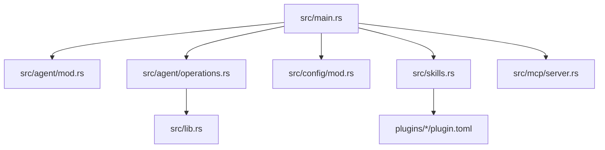
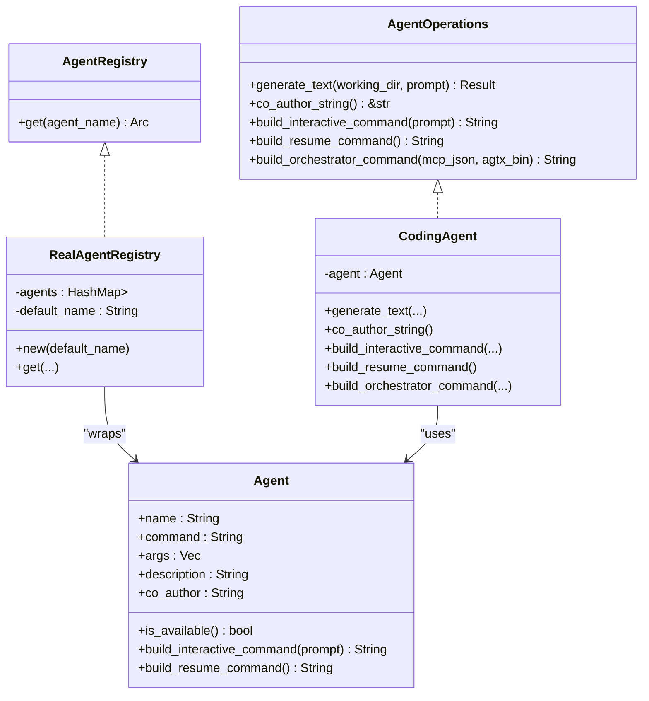
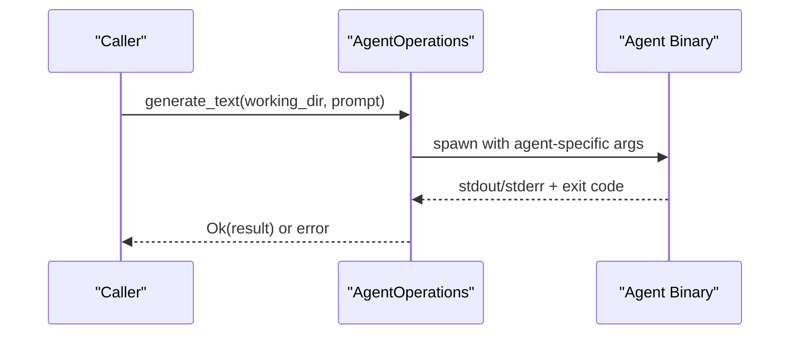
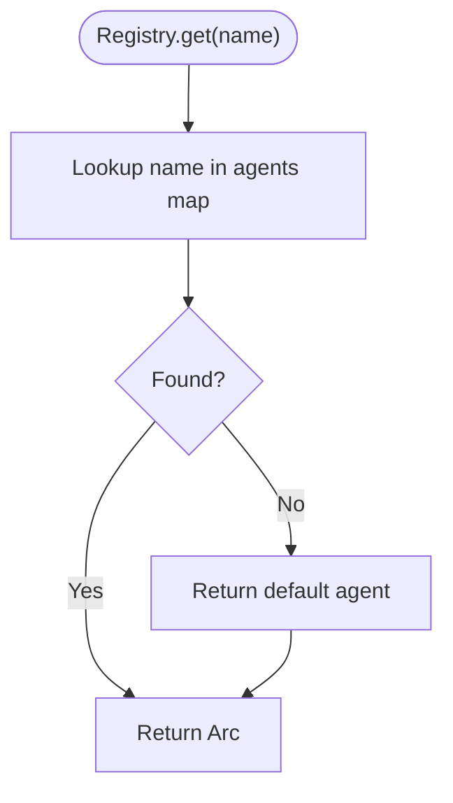
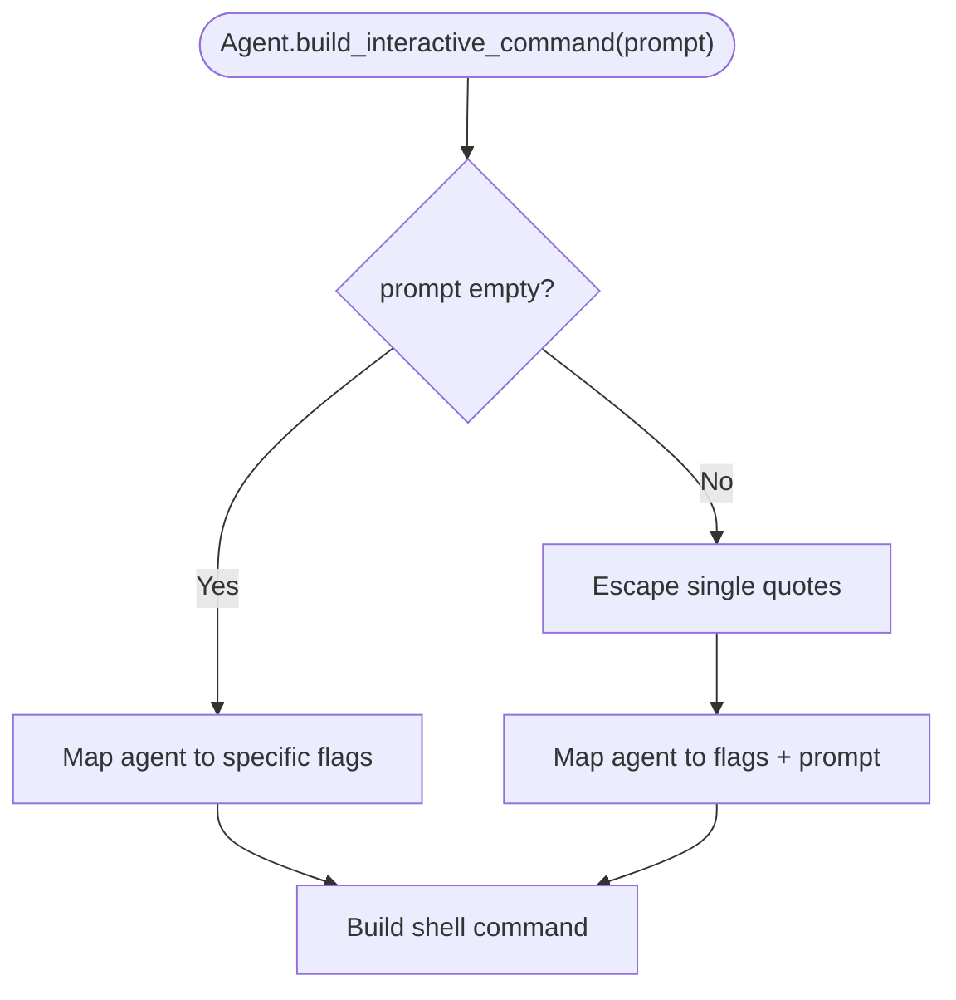
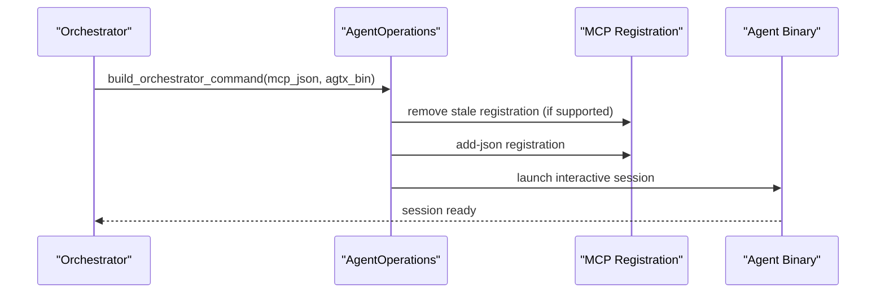
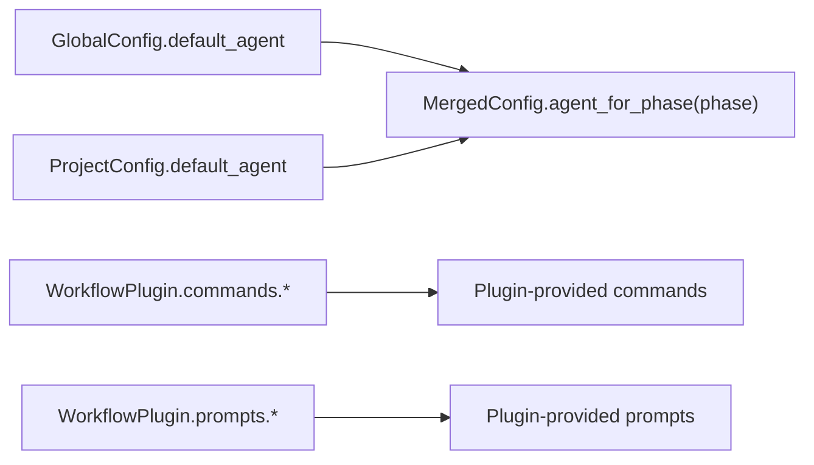
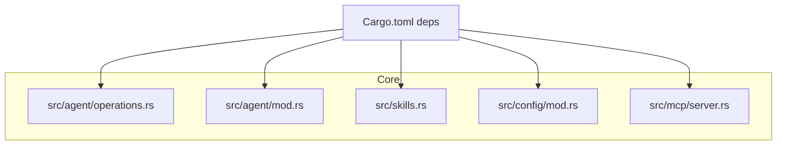

# Agent Integration API

<cite>
**Referenced Files in This Document**
- [src/agent/mod.rs](file://src/agent/mod.rs)
- [src/agent/operations.rs](file://src/agent/operations.rs)
- [src/skills.rs](file://src/skills.rs)
- [src/config/mod.rs](file://src/config/mod.rs)
- [src/mcp/server.rs](file://src/mcp/server.rs)
- [src/lib.rs](file://src/lib.rs)
- [src/main.rs](file://src/main.rs)
- [plugins/agtx/plugin.toml](file://plugins/agtx/plugin.toml)
- [plugins/agent-skills/plugin.toml](file://plugins/agent-skills/plugin.toml)
- [tests/agent_tests.rs](file://tests/agent_tests.rs)
- [tests/mock_infrastructure_tests.rs](file://tests/mock_infrastructure_tests.rs)
- [Cargo.toml](file://Cargo.toml)
</cite>

## Table of Contents
1. [Introduction](#introduction)
2. [Project Structure](#project-structure)
3. [Core Components](#core-components)
4. [Architecture Overview](#architecture-overview)
5. [Detailed Component Analysis](#detailed-component-analysis)
6. [Dependency Analysis](#dependency-analysis)
7. [Performance Considerations](#performance-considerations)
8. [Troubleshooting Guide](#troubleshooting-guide)
9. [Conclusion](#conclusion)
10. [Appendices](#appendices)

## Introduction
This document describes the Agent Integration API that powers AGTX’s multi-agent orchestration. It focuses on:
- The AgentOperations trait and its generic implementation for cross-platform agent command execution
- Agent-specific command transformations for skill invocation
- The skill deployment pipeline that registers and exposes built-in and plugin skills per agent
- The AgentRegistry interface for dynamic agent discovery and selection
- MCP-based orchestration and multi-agent coordination
- Agent-specific configuration, environment setup, and error handling strategies
- Extension patterns for adding new agents and customizing behavior through plugins

## Project Structure
The agent integration spans several modules:
- Agent metadata, detection, and command builders live in the agent module
- AgentOperations defines the contract for agent interactions
- Skills module provides cross-agent skill transformation and discovery
- Config module defines per-phase agent overrides and plugin configuration
- MCP server exposes the board as tools for orchestration
- Tests validate agent selection, command building, and skill transformations



**Diagram sources**
- [src/main.rs:1-228](file://src/main.rs#L1-L228)
- [src/agent/mod.rs:1-171](file://src/agent/mod.rs#L1-L171)
- [src/agent/operations.rs:1-163](file://src/agent/operations.rs#L1-L163)
- [src/config/mod.rs:1-595](file://src/config/mod.rs#L1-L595)
- [src/skills.rs:1-409](file://src/skills.rs#L1-L409)
- [src/mcp/server.rs:1-800](file://src/mcp/server.rs#L1-L800)
- [plugins/agtx/plugin.toml:1-16](file://plugins/agtx/plugin.toml#L1-L16)

**Section sources**
- [src/main.rs:1-228](file://src/main.rs#L1-L228)
- [src/agent/mod.rs:1-171](file://src/agent/mod.rs#L1-L171)
- [src/agent/operations.rs:1-163](file://src/agent/operations.rs#L1-L163)
- [src/config/mod.rs:1-595](file://src/config/mod.rs#L1-L595)
- [src/skills.rs:1-409](file://src/skills.rs#L1-L409)
- [src/mcp/server.rs:1-800](file://src/mcp/server.rs#L1-L800)
- [plugins/agtx/plugin.toml:1-16](file://plugins/agtx/plugin.toml#L1-L16)

## Core Components
- AgentOperations: Defines the cross-platform contract for agent interactions (text generation, interactive/resume command construction, orchestrator command composition).
- CodingAgent: A generic implementation of AgentOperations that shells out to agent binaries with agent-specific argument mappings.
- AgentRegistry: A registry abstraction to select agents by name, with a production implementation (RealAgentRegistry) that builds agents from discovered binaries.
- Skills transformation and deployment: Functions to map internal skill commands to agent-native formats, discover skills from agent-native directories, and expose them to agents.
- Configuration: Per-phase agent overrides, plugin configuration, and workflow commands/prompts.

**Section sources**
- [src/agent/operations.rs:16-163](file://src/agent/operations.rs#L16-L163)
- [src/agent/mod.rs:10-171](file://src/agent/mod.rs#L10-L171)
- [src/skills.rs:31-226](file://src/skills.rs#L31-L226)
- [src/config/mod.rs:151-595](file://src/config/mod.rs#L151-L595)

## Architecture Overview
The agent integration centers on a trait-based design that abstracts agent differences while providing a unified interface for:
- Executing agent-native commands
- Building interactive and resume commands
- Registering MCP-based orchestration for supported agents
- Discovering and invoking skills across agents



**Diagram sources**
- [src/agent/operations.rs:16-163](file://src/agent/operations.rs#L16-L163)
- [src/agent/mod.rs:10-171](file://src/agent/mod.rs#L10-L171)

## Detailed Component Analysis

### AgentOperations and CodingAgent
AgentOperations defines the cross-platform interface for agent interactions:
- generate_text: Executes agent-native non-interactive text generation
- co_author_string: Provides the co-author attribution string for commits
- build_interactive_command: Builds the command to start an agent interactively
- build_resume_command: Builds the command to resume the last session
- build_orchestrator_command: Wraps agent launch with MCP registration for supported agents

CodingAgent implements AgentOperations generically:
- Uses agent-specific argument mappings for each known agent
- Spawns the agent binary with appropriate flags and captures stdout/stderr
- Emits errors when agent commands fail



**Diagram sources**
- [src/agent/operations.rs:55-108](file://src/agent/operations.rs#L55-L108)

**Section sources**
- [src/agent/operations.rs:16-108](file://src/agent/operations.rs#L16-L108)

### AgentRegistry and RealAgentRegistry
AgentRegistry abstracts agent selection by name:
- get returns an Arc-wrapped AgentOperations instance
- RealAgentRegistry builds agents from discovered binaries and ensures a default fallback



**Diagram sources**
- [src/agent/operations.rs:110-163](file://src/agent/operations.rs#L110-L163)

**Section sources**
- [src/agent/operations.rs:110-163](file://src/agent/operations.rs#L110-L163)

### Command Transformation and Skill Deployment
Skills are defined as Markdown files with YAML frontmatter and mapped to agent-native formats. The transformation pipeline includes:
- agent_native_skill_dir: Returns the base directory and namespace for agent-native skills
- skill_name_to_command: Converts internal skill names to canonical command forms
- skill_dir_to_filename: Maps directory names to agent-specific filenames
- transform_plugin_command: Converts canonical plugin commands to agent-specific invocation syntax
- enumerate_available_skills: Lists built-in skills in agent-native invocation format
- scan_agent_skills: Scans agent-native directories for skills and extracts descriptions

```mermaid
flowchart TD
A["Canonical command (/ns:name)"] --> B{"Agent type?"}
B --> |"claude"/"gemini"| C["Unchanged"]
B --> |"opencode"| D["Replace ':' with '-'"]
B --> |"codex"| E["Prefix '/' with '$' and replace ':' with '-'"]
B --> |"cursor"| F["Replace ':' with '-' (keep '/')"]
C --> G["Agent-native command"]
D --> G
E --> G
F --> G
```

**Diagram sources**
- [src/skills.rs:83-115](file://src/skills.rs#L83-L115)

**Section sources**
- [src/skills.rs:31-226](file://src/skills.rs#L31-L226)

### Agent Metadata and Command Builders
The Agent struct encapsulates:
- Name, command, args, description, and co-author attribution
- Availability detection via which::which
- Interactive and resume command builders tailored per agent
- Known agents list and detection helpers



**Diagram sources**
- [src/agent/mod.rs:36-77](file://src/agent/mod.rs#L36-L77)

**Section sources**
- [src/agent/mod.rs:10-171](file://src/agent/mod.rs#L10-L171)

### MCP Orchestration and Agent Launch
The build_orchestrator_command method integrates MCP registration for supported agents:
- For Claude, it removes stale registrations, adds a new JSON registration, and launches the agent interactively
- Other agents fall back to interactive launch



**Diagram sources**
- [src/agent/operations.rs:92-107](file://src/agent/operations.rs#L92-L107)

**Section sources**
- [src/agent/operations.rs:35-107](file://src/agent/operations.rs#L35-L107)

### Configuration and Plugins
Per-phase agent overrides and plugin commands are defined in plugin.toml files:
- plugins/agtx/plugin.toml defines built-in commands and prompts
- plugins/agent-skills/plugin.toml demonstrates external plugin integration for agents



**Diagram sources**
- [src/config/mod.rs:337-408](file://src/config/mod.rs#L337-L408)
- [plugins/agtx/plugin.toml:1-16](file://plugins/agtx/plugin.toml#L1-L16)
- [plugins/agent-skills/plugin.toml:1-19](file://plugins/agent-skills/plugin.toml#L1-L19)

**Section sources**
- [src/config/mod.rs:151-595](file://src/config/mod.rs#L151-L595)
- [plugins/agtx/plugin.toml:1-16](file://plugins/agtx/plugin.toml#L1-L16)
- [plugins/agent-skills/plugin.toml:1-19](file://plugins/agent-skills/plugin.toml#L1-L19)

## Dependency Analysis
The agent integration relies on:
- Standard libraries for process spawning and path handling
- which for agent availability detection
- tokio for async runtime needs elsewhere in the app
- rmcp for MCP server capabilities



**Diagram sources**
- [Cargo.toml:12-38](file://Cargo.toml#L12-L38)
- [src/agent/operations.rs:1-163](file://src/agent/operations.rs#L1-L163)
- [src/agent/mod.rs:1-171](file://src/agent/mod.rs#L1-L171)
- [src/skills.rs:1-409](file://src/skills.rs#L1-L409)
- [src/config/mod.rs:1-595](file://src/config/mod.rs#L1-L595)
- [src/mcp/server.rs:1-800](file://src/mcp/server.rs#L1-L800)

**Section sources**
- [Cargo.toml:12-38](file://Cargo.toml#L12-L38)
- [src/agent/operations.rs:1-163](file://src/agent/operations.rs#L1-L163)
- [src/agent/mod.rs:1-171](file://src/agent/mod.rs#L1-L171)
- [src/skills.rs:1-409](file://src/skills.rs#L1-L409)
- [src/config/mod.rs:1-595](file://src/config/mod.rs#L1-L595)
- [src/mcp/server.rs:1-800](file://src/mcp/server.rs#L1-L800)

## Performance Considerations
- Command spawning overhead: Each agent operation spawns a subprocess; cache or reuse agent sessions where feasible
- Filesystem scans: scan_agent_skills reads directory trees; avoid frequent rescans by caching results
- MCP registration: For Claude, pre-removal and add-json are chained; ensure idempotency and minimal retries
- Configuration merging: Merging global and project configs is O(1) per field; keep plugin lists small

## Troubleshooting Guide
Common issues and strategies:
- Agent not available: Use detect_available_agents and known_agents to verify installation; fallback to default agent via RealAgentRegistry
- Command failures: generate_text returns errors with stderr captured; inspect agent logs and environment
- Skill invocation mismatch: Use transform_plugin_command to map canonical commands to agent-native syntax; fallback to file-path references when unsupported
- MCP registration errors: For Claude, the orchestrator command includes pre-removal of stale registrations; ensure permissions and agent scopes are correct
- Configuration precedence: Verify merged config resolves phase-specific agents correctly; check project vs global overrides

**Section sources**
- [src/agent/mod.rs:124-135](file://src/agent/mod.rs#L124-L135)
- [src/agent/operations.rs:55-78](file://src/agent/operations.rs#L55-L78)
- [src/skills.rs:83-115](file://src/skills.rs#L83-L115)
- [src/agent/operations.rs:92-107](file://src/agent/operations.rs#L92-L107)
- [src/config/mod.rs:355-408](file://src/config/mod.rs#L355-L408)

## Conclusion
The Agent Integration API provides a robust, extensible foundation for multi-agent orchestration in AGTX. By abstracting agent differences behind AgentOperations, transforming skills to agent-native formats, and offering dynamic agent discovery and configuration, it supports diverse AI coding agents while maintaining a consistent developer experience. Extensibility is achieved through plugin-based workflows, MCP orchestration, and straightforward agent registration patterns.

## Appendices

### Example Patterns

- Agent command execution
  - Use AgentOperations.generate_text to invoke agent-native non-interactive text generation
  - Reference: [src/agent/operations.rs:55-78](file://src/agent/operations.rs#L55-L78)

- Skill invocation
  - Transform canonical commands to agent-native syntax using transform_plugin_command
  - Reference: [src/skills.rs:83-115](file://src/skills.rs#L83-L115)

- Multi-agent coordination
  - Build orchestrator command with MCP registration for supported agents
  - Reference: [src/agent/operations.rs:92-107](file://src/agent/operations.rs#L92-L107)

- Dynamic agent selection
  - Use RealAgentRegistry.get to select agents by name with fallback
  - Reference: [src/agent/operations.rs:153-161](file://src/agent/operations.rs#L153-L161)

- Agent-specific configuration
  - Configure per-phase agents and plugins via plugin.toml and merged config
  - References:
    - [plugins/agtx/plugin.toml:1-16](file://plugins/agtx/plugin.toml#L1-L16)
    - [src/config/mod.rs:355-408](file://src/config/mod.rs#L355-L408)

- Environment setup
  - Ensure agent binaries are installed and discoverable via PATH
  - Verify agent-native directories exist for skill discovery
  - Reference: [src/agent/mod.rs:32-34](file://src/agent/mod.rs#L32-L34)

- Error handling
  - Capture stderr from agent processes and propagate errors
  - Use tests to validate command transformations and selection logic
  - References:
    - [src/agent/operations.rs:72-75](file://src/agent/operations.rs#L72-L75)
    - [tests/agent_tests.rs:1-221](file://tests/agent_tests.rs#L1-L221)