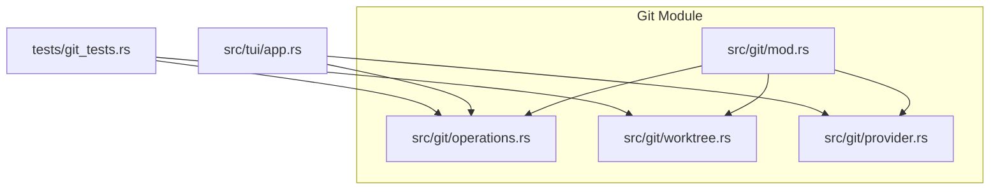
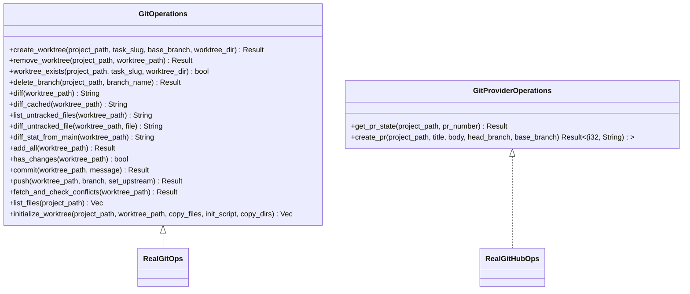
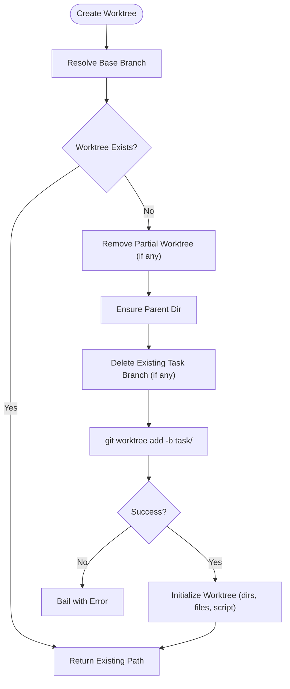
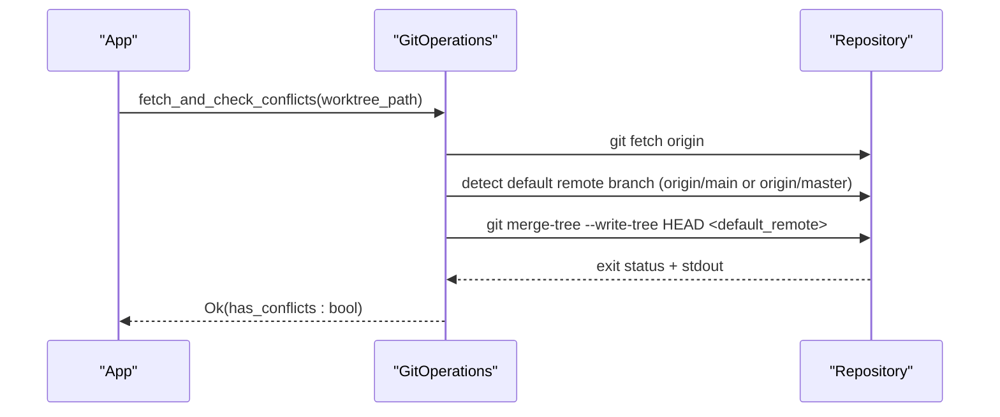
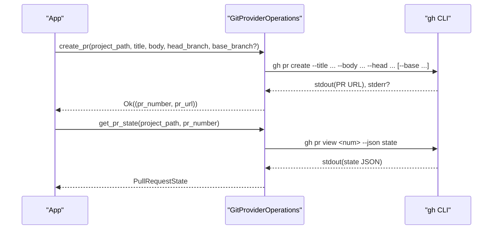
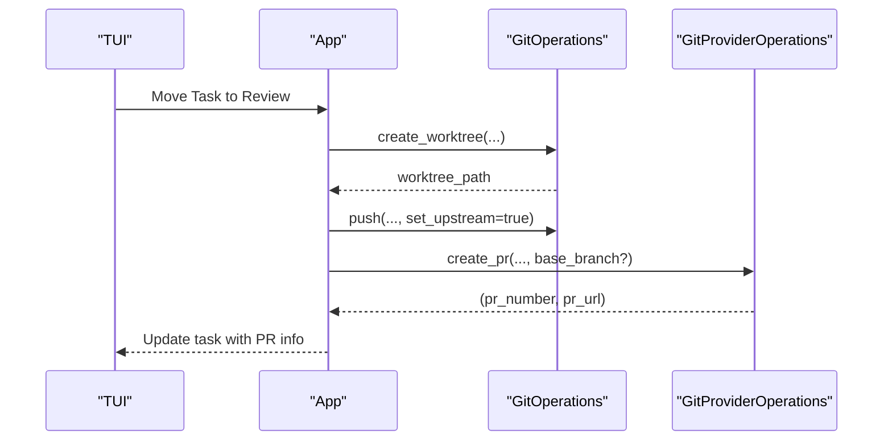
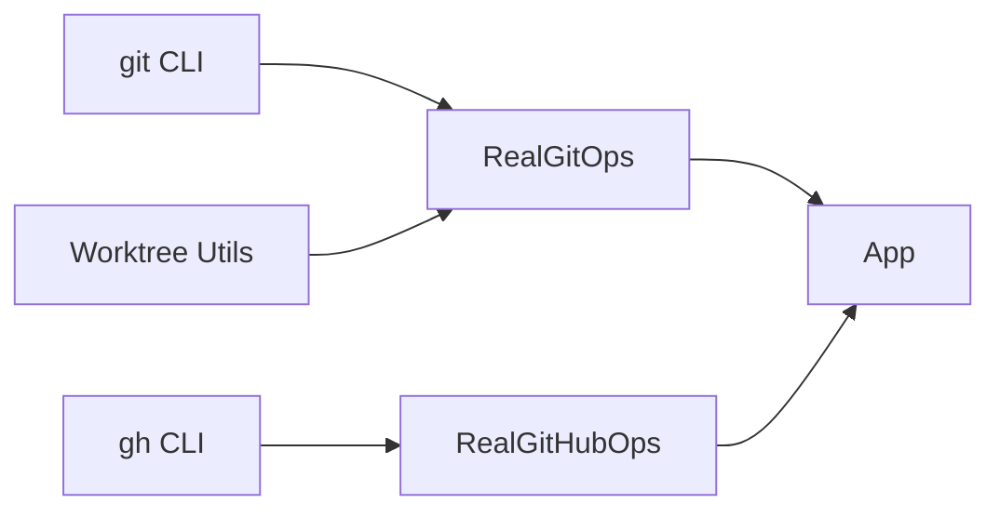

# Git Operations API

<cite>
**Referenced Files in This Document**
- [mod.rs](file://src/git/mod.rs)
- [operations.rs](file://src/git/operations.rs)
- [provider.rs](file://src/git/provider.rs)
- [worktree.rs](file://src/git/worktree.rs)
- [app.rs](file://src/tui/app.rs)
- [git_tests.rs](file://tests/git_tests.rs)
- [Cargo.toml](file://Cargo.toml)
</cite>

## Table of Contents
1. [Introduction](#introduction)
2. [Project Structure](#project-structure)
3. [Core Components](#core-components)
4. [Architecture Overview](#architecture-overview)
5. [Detailed Component Analysis](#detailed-component-analysis)
6. [Dependency Analysis](#dependency-analysis)
7. [Performance Considerations](#performance-considerations)
8. [Troubleshooting Guide](#troubleshooting-guide)
9. [Conclusion](#conclusion)
10. [Appendices](#appendices)

## Introduction
This document describes the Git operations API used by AGTX for managing repositories, worktrees, and provider integrations. It focuses on:
- Worktree management for isolated development environments
- Branch operations for task-specific branching, merging, and conflict detection
- Provider abstractions for GitHub integration (pull request management)
- Error handling, repository state validation, and integration with the task management system

The API is designed around traits for testability and pluggable implementations, enabling both CLI-driven operations and provider-specific workflows.

## Project Structure
The Git-related functionality is organized under the git module with clear separation of concerns:
- Trait definitions and real implementations for Git operations
- Worktree utilities for creation, initialization, and cleanup
- Provider operations for GitHub via the gh CLI
- Integration points within the TUI application and tests

**Diagram sources**
- [mod.rs:1-13](file://src/git/mod.rs#L1-L13)
- [operations.rs:1-276](file://src/git/operations.rs#L1-L276)
- [worktree.rs:1-345](file://src/git/worktree.rs#L1-L345)
- [provider.rs:1-110](file://src/git/provider.rs#L1-L110)
- [app.rs:750-758](file://src/tui/app.rs#L750-L758)

**Section sources**
- [mod.rs:1-13](file://src/git/mod.rs#L1-L13)
- [Cargo.toml:39-41](file://Cargo.toml#L39-L41)

## Core Components
- GitOperations trait: Defines worktree management, diffing, staging, committing, pushing, conflict checks, and file listing.
- RealGitOps: Concrete implementation using git CLI commands.
- Worktree utilities: Functions for creating, initializing, detecting main branch, and removing worktrees.
- GitProviderOperations trait: Defines provider-agnostic operations for pull/merge requests.
- RealGitHubOps: Implementation using the gh CLI for GitHub.

Key capabilities:
- Create and remove worktrees with automatic branch naming and cleanup
- Initialize worktrees with agent config directories, custom files, and optional init scripts
- Detect main branch (main or master) and support custom base branches
- Non-destructive conflict detection using merge-tree
- Fetch and virtual merge checks against default remote branches
- GitHub PR state queries and creation with optional base targeting

**Section sources**
- [operations.rs:10-75](file://src/git/operations.rs#L10-L75)
- [operations.rs:77-276](file://src/git/operations.rs#L77-L276)
- [worktree.rs:8-65](file://src/git/worktree.rs#L8-L65)
- [worktree.rs:125-223](file://src/git/worktree.rs#L125-L223)
- [worktree.rs:241-273](file://src/git/worktree.rs#L241-L273)
- [provider.rs:21-38](file://src/git/provider.rs#L21-L38)
- [provider.rs:40-110](file://src/git/provider.rs#L40-L110)

## Architecture Overview
The system integrates Git operations with the TUI application and tests. The TUI constructs the application with concrete implementations of GitOperations and GitProviderOperations, enabling end-to-end workflows for task management, worktree setup, and PR creation.

**Diagram sources**
- [operations.rs:10-75](file://src/git/operations.rs#L10-L75)
- [operations.rs:77-276](file://src/git/operations.rs#L77-L276)
- [provider.rs:21-38](file://src/git/provider.rs#L21-L38)
- [provider.rs:40-110](file://src/git/provider.rs#L40-L110)

## Detailed Component Analysis

### Worktree Management API
Worktree utilities provide a robust foundation for isolated development environments:
- Creation from default or custom base branches with automatic cleanup of partial attempts
- Detection of main branch (main or master) with fallback to current branch
- Initialization of worktrees with agent configuration directories, optional custom files, and init scripts
- Removal with force and pruning fallback

**Diagram sources**
- [worktree.rs:14-65](file://src/git/worktree.rs#L14-L65)
- [worktree.rs:125-223](file://src/git/worktree.rs#L125-L223)

**Section sources**
- [worktree.rs:8-65](file://src/git/worktree.rs#L8-L65)
- [worktree.rs:125-223](file://src/git/worktree.rs#L125-L223)
- [worktree.rs:241-273](file://src/git/worktree.rs#L241-L273)
- [worktree.rs:275-297](file://src/git/worktree.rs#L275-L297)

### Branch Operations and Conflict Detection
The API supports task-specific branching and non-destructive conflict detection:
- Branch deletion with force option
- Diffing staged and unstaged changes
- Untracked file discovery and diffing against /dev/null
- Conflict detection using merge-tree (Git 2.38+), returning whether conflicts exist and the list of conflicting files
- Fetch and virtual merge checks against default remote branches

**Diagram sources**
- [operations.rs:211-243](file://src/git/operations.rs#L211-L243)

**Section sources**
- [operations.rs:130-141](file://src/git/operations.rs#L130-L141)
- [operations.rs:131-147](file://src/git/operations.rs#L131-L147)
- [operations.rs:62-63](file://src/git/operations.rs#L62-L63)
- [operations.rs:211-243](file://src/git/operations.rs#L211-L243)
- [mod.rs:89-128](file://src/git/mod.rs#L89-L128)

### GitProviderOperations for GitHub Integration
The provider abstraction enables GitHub PR management:
- PR state retrieval (Open, Merged, Closed, Unknown)
- PR creation with optional base branch targeting for stacked PRs
- Parsing PR URLs and extracting PR numbers

**Diagram sources**
- [provider.rs:66-108](file://src/git/provider.rs#L66-L108)
- [provider.rs:44-64](file://src/git/provider.rs#L44-L64)

**Section sources**
- [provider.rs:12-19](file://src/git/provider.rs#L12-L19)
- [provider.rs:21-38](file://src/git/provider.rs#L21-L38)
- [provider.rs:40-110](file://src/git/provider.rs#L40-L110)

### Integration with the Task Management System
The TUI application wires Git operations into the task lifecycle:
- Construction with RealGitOps and RealGitHubOps
- Worktree creation and removal during task transitions
- PR creation and status updates via provider operations

**Diagram sources**
- [app.rs:750-758](file://src/tui/app.rs#L750-L758)
- [app.rs:7063-7063](file://src/tui/app.rs#L7063-L7063)
- [app.rs:6980-6980](file://src/tui/app.rs#L6980-L6980)

**Section sources**
- [app.rs:750-758](file://src/tui/app.rs#L750-L758)
- [app.rs:7063-7063](file://src/tui/app.rs#L7063-L7063)
- [app.rs:6980-6980](file://src/tui/app.rs#L6980-L6980)

## Dependency Analysis
- GitOperations depends on git CLI for all operations
- RealGitHubOps depends on the gh CLI for provider operations
- Worktree utilities depend on git CLI and filesystem operations
- The TUI application composes these implementations into a cohesive workflow

**Diagram sources**
- [operations.rs:77-276](file://src/git/operations.rs#L77-L276)
- [provider.rs:40-110](file://src/git/provider.rs#L40-L110)
- [worktree.rs:1-345](file://src/git/worktree.rs#L1-L345)
- [app.rs:750-758](file://src/tui/app.rs#L750-L758)

**Section sources**
- [operations.rs:77-276](file://src/git/operations.rs#L77-L276)
- [provider.rs:40-110](file://src/git/provider.rs#L40-L110)
- [worktree.rs:1-345](file://src/git/worktree.rs#L1-L345)
- [app.rs:750-758](file://src/tui/app.rs#L750-L758)

## Performance Considerations
- Prefer non-destructive conflict checks using merge-tree to avoid modifying working trees
- Batch filesystem operations in worktree initialization to minimize overhead
- Use porcelain output modes (e.g., --porcelain) for reliable parsing
- Avoid unnecessary fetches by checking remote branch presence before fetching

## Troubleshooting Guide
Common issues and strategies:
- Worktree creation failures: The system cleans up partial worktrees and retries branch creation. Verify base branch existence and permissions.
- Conflict detection: merge-tree requires Git 2.38+. On older versions, consider upgrading or implementing an alternate detection strategy.
- PR creation failures: Ensure the gh CLI is installed and authenticated. Validate PR parameters (title, body, head, base).
- Repository state validation: Use repository root detection and branch detection helpers to confirm environment readiness before operations.
- Error propagation: Many operations return Result types and propagate underlying errors. Catch and log errors appropriately in higher-level flows.

Concrete examples from tests:
- Worktree creation and removal with idempotency and cleanup
- Conflict detection across non-conflicting and conflicting scenarios
- Worktree initialization with agent config directories and custom files
- Repository state helpers (is_git_repo, repo_root, current_branch)

**Section sources**
- [git_tests.rs:137-154](file://tests/git_tests.rs#L137-L154)
- [git_tests.rs:472-506](file://tests/git_tests.rs#L472-L506)
- [git_tests.rs:508-554](file://tests/git_tests.rs#L508-L554)
- [git_tests.rs:318-351](file://tests/git_tests.rs#L318-L351)
- [git_tests.rs:368-394](file://tests/git_tests.rs#L368-L394)
- [mod.rs:18-50](file://src/git/mod.rs#L18-L50)

## Conclusion
The Git Operations API provides a robust, testable foundation for worktree management, branch operations, and GitHub integration. By leveraging traits and CLI-backed implementations, AGTX achieves flexibility and reliability in automated workflows. Proper error handling, repository state validation, and non-destructive conflict detection ensure smooth integration with the task management system.

## Appendices

### API Reference Summary

- GitOperations
  - Worktree management: create_worktree, remove_worktree, worktree_exists, initialize_worktree
  - Branch operations: delete_branch, list_files
  - Change management: diff, diff_cached, list_untracked_files, diff_untracked_file, diff_stat_from_main, add_all, has_changes, commit, push
  - Conflict detection: fetch_and_check_conflicts
- Worktree utilities
  - create_worktree, create_worktree_from_base, remove_worktree, worktree_path, worktree_exists, worktree_exists_with_dir, detect_main_branch, initialize_worktree
- GitProviderOperations
  - get_pr_state, create_pr

**Section sources**
- [operations.rs:10-75](file://src/git/operations.rs#L10-L75)
- [worktree.rs:8-65](file://src/git/worktree.rs#L8-L65)
- [worktree.rs:125-223](file://src/git/worktree.rs#L125-L223)
- [provider.rs:21-38](file://src/git/provider.rs#L21-L38)