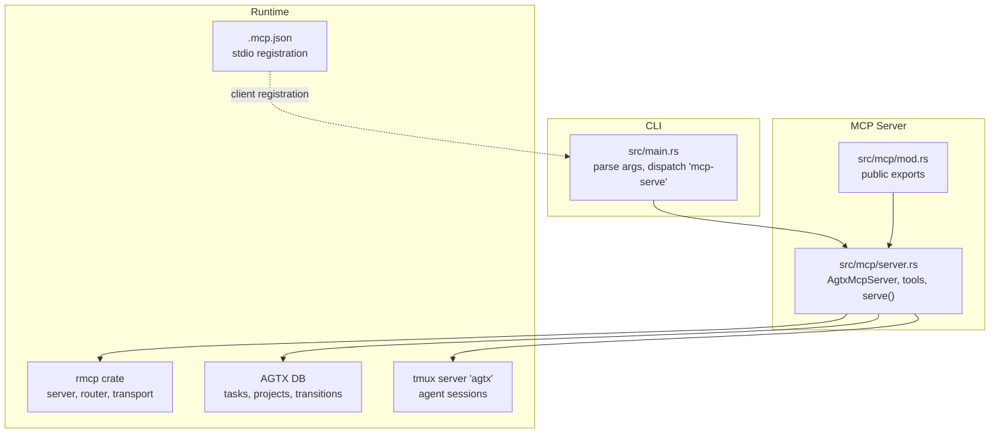
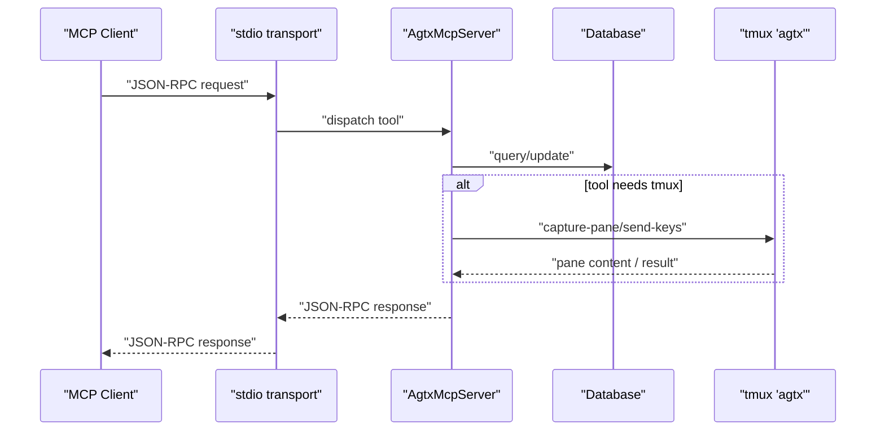
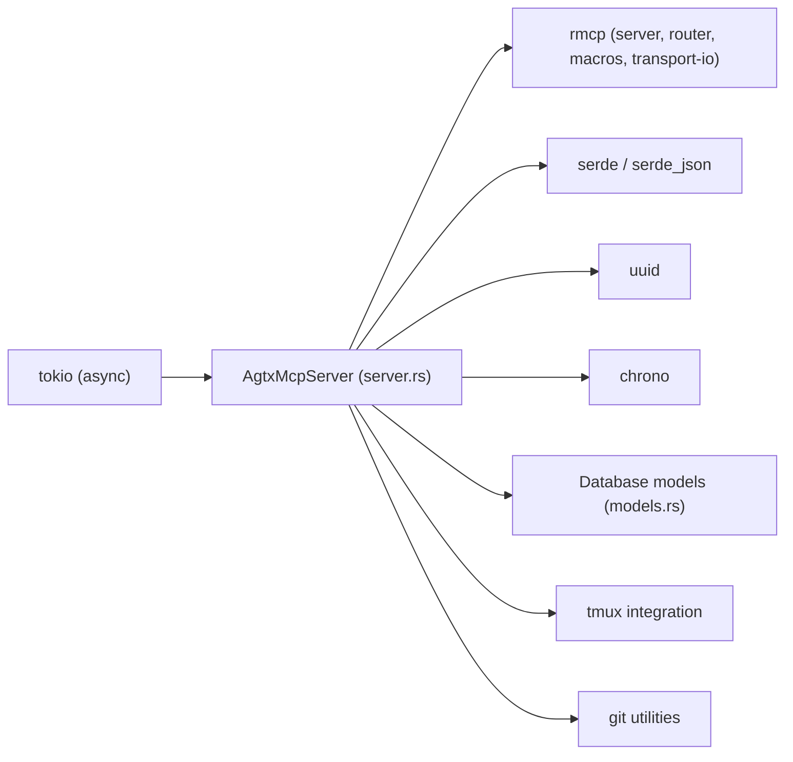

# MCP Server API

<cite>
**Referenced Files in This Document**
- [server.rs](file://src/mcp/server.rs)
- [mod.rs](file://src/mcp/mod.rs)
- [main.rs](file://src/main.rs)
- [.mcp.json](file://.mcp.json)
- [models.rs](file://src/db/models.rs)
- [mcp_tests.rs](file://tests/mcp_tests.rs)
- [Cargo.toml](file://Cargo.toml)
- [README.md](file://README.md)
</cite>

## Table of Contents
1. [Introduction](#introduction)
2. [Project Structure](#project-structure)
3. [Core Components](#core-components)
4. [Architecture Overview](#architecture-overview)
5. [Detailed Component Analysis](#detailed-component-analysis)
6. [Dependency Analysis](#dependency-analysis)
7. [Performance Considerations](#performance-considerations)
8. [Troubleshooting Guide](#troubleshooting-guide)
9. [Conclusion](#conclusion)
10. [Appendices](#appendices)

## Introduction
This document describes the MCP (Model Context Protocol) server interface exposed by AGTX over JSON-RPC via stdio. It covers server initialization, configuration modes, protocol negotiation, and all available MCP tools. It documents request/response lifecycles, parameter specifications, response formats, error handling, and security considerations. It also provides practical integration examples and operational guidance for debugging and monitoring.

## Project Structure
The MCP server is implemented as a Rust module with a thin CLI entrypoint that selects server mode and starts the stdio transport. The server exposes a set of tools backed by AGTX’s database and tmux integration.

**Diagram sources**
- [main.rs:30-46](file://src/main.rs#L30-L46)
- [mod.rs:1-5](file://src/mcp/mod.rs#L1-L5)
- [server.rs:1245-1263](file://src/mcp/server.rs#L1245-L1263)
- [.mcp.json:1-8](file://.mcp.json#L1-L8)

**Section sources**
- [main.rs:16-96](file://src/main.rs#L16-L96)
- [mod.rs:1-5](file://src/mcp/mod.rs#L1-L5)
- [server.rs:1245-1263](file://src/mcp/server.rs#L1245-L1263)
- [.mcp.json:1-8](file://.mcp.json#L1-L8)

## Core Components
- Server mode selection: global vs project-scoped.
- Tool router: a set of JSON-RPC tools exposed to clients.
- Transport: stdio via rmcp transport.
- Protocol negotiation: ServerInfo and capabilities via rmcp ServerHandler.

Key responsibilities:
- Validate mode and open appropriate databases.
- Resolve project context for global mode.
- Enforce status and dependency rules for task transitions.
- Interact with tmux for pane inspection and messaging.
- Serialize responses to JSON.

**Section sources**
- [server.rs:16-24](file://src/mcp/server.rs#L16-L24)
- [server.rs:1218-1243](file://src/mcp/server.rs#L1218-L1243)
- [server.rs:1245-1263](file://src/mcp/server.rs#L1245-L1263)

## Architecture Overview
The MCP server runs as a long-lived stdio process. Clients (e.g., Claude Code, Codex) register the server and invoke tools by name. The server validates parameters, consults the database, and may interact with tmux for agent sessions.

**Diagram sources**
- [server.rs:521-1216](file://src/mcp/server.rs#L521-L1216)
- [server.rs:863-910](file://src/mcp/server.rs#L863-L910)
- [server.rs:915-974](file://src/mcp/server.rs#L915-L974)

## Detailed Component Analysis

### Server Initialization and Configuration
- CLI entrypoint parses arguments and routes to the MCP server when invoked with “mcp-serve”.
- Mode selection:
  - Global mode: no project path; requires project_id for tools that operate on tasks.
  - Project-scoped mode: fixed project path validated at startup.
- Transport: stdio via rmcp transport.
- Protocol info: ServerInfo includes instructions and capabilities indicating tools are enabled.

Operational notes:
- In global mode, all tools that operate on tasks require a project_id parameter.
- The server validates project existence and database accessibility during startup.

**Section sources**
- [main.rs:30-46](file://src/main.rs#L30-L46)
- [server.rs:1245-1263](file://src/mcp/server.rs#L1245-L1263)
- [server.rs:1218-1243](file://src/mcp/server.rs#L1218-L1243)

### Tool Catalog and Request/Response Lifecycle
All tools are declared via the tool macro and routed by the tool router. Each tool accepts a typed parameter struct and returns a JSON string. Responses are serialized with pretty-printing.

Common patterns:
- Parameter structs derive deserialization and JSON schema annotations.
- Many tools accept an optional project_id in global mode.
- Validation occurs early (e.g., action names, status checks, dependency checks).
- Database operations are wrapped with error handling and returned as strings or JSON.

**Section sources**
- [server.rs:28-199](file://src/mcp/server.rs#L28-L199)
- [server.rs:521-1216](file://src/mcp/server.rs#L521-L1216)

### Tool Reference

#### list_projects
- Purpose: Enumerate all projects indexed by AGTX.
- Parameters: none.
- Response: Array of project summaries (id, name, path).
- Notes: Available in both modes; no project_id required.

**Section sources**
- [server.rs:524](file://src/mcp/server.rs#L524)
- [server.rs:528-536](file://src/mcp/server.rs#L528-L536)

#### list_tasks
- Purpose: List tasks for a project, optionally filtered by status.
- Parameters:
  - status: optional; one of backlog, planning, running, review, done.
  - project_id: required in global mode.
- Response: Array of task summaries (id, title, status, agent, branch/pr metadata, plugin, dependencies, base_branch, deps_satisfied).
- Validation: Rejects invalid status values.

**Section sources**
- [server.rs:548](file://src/mcp/server.rs#L548)
- [server.rs:551-556](file://src/mcp/server.rs#L551-L556)
- [server.rs:561-580](file://src/mcp/server.rs#L561-L580)

#### get_task
- Purpose: Retrieve detailed task information including allowed_actions.
- Parameters:
  - task_id: required.
  - project_id: required in global mode.
- Response: Task detail object (id, title, description, status, agent, project_id, session_name, worktree_path, branch_name, pr_number/pr_url, plugin, cycle, referenced_tasks, base_branch, escalation_note, timestamps, deps_satisfied, blocking_tasks, allowed_actions).
- Behavior: Computes allowed_actions based on status and plugin rules; computes blocking_tasks from referenced_tasks.

**Section sources**
- [server.rs:593](file://src/mcp/server.rs#L593)
- [server.rs:597-644](file://src/mcp/server.rs#L597-L644)

#### create_task
- Purpose: Create a backlog task.
- Parameters:
  - title: required.
  - description: optional.
  - plugin: optional (defaults to project/global defaults).
  - referenced_tasks: comma-separated task IDs (validated).
  - base_branch: optional (defaults to project main branch).
  - project_id: required in global mode.
- Response: Created task summary (id, title, status).
- Validation: referenced_tasks existence checked; status guard enforced at DB layer.

**Section sources**
- [server.rs:979](file://src/mcp/server.rs#L979)
- [server.rs:989-998](file://src/mcp/server.rs#L989-L998)
- [server.rs:1006-1015](file://src/mcp/server.rs#L1006-L1015)

#### create_tasks_batch
- Purpose: Create multiple tasks atomically with index-based dependencies.
- Parameters:
  - tasks: array of BatchTask entries (title, description, plugin, depends_on indices, base_branch).
  - project_id: required in global mode.
- Constraints:
  - Maximum 50 tasks per batch.
  - depends_on indices must be less than the index of the task itself (no forward references).
  - Duplicate depends_on indices are rejected.
- Response: Count and created entries (index, id, title).
- Behavior: Index-based dependencies resolved to real task IDs; atomic insertion.

**Section sources**
- [server.rs:1023](file://src/mcp/server.rs#L1023)
- [server.rs:1034-1053](file://src/mcp/server.rs#L1034-L1053)
- [server.rs:1074-1083](file://src/mcp/server.rs#L1074-L1083)
- [server.rs:1085-1104](file://src/mcp/server.rs#L1085-L1104)

#### update_task
- Purpose: Modify fields of a backlog task.
- Parameters:
  - task_id: required.
  - title, description, plugin, referenced_tasks, base_branch: optional.
  - project_id: required in global mode.
- Validation: Only backlog tasks can be updated; referenced_tasks existence checked; returns error if no fields provided.

**Section sources**
- [server.rs:1111](file://src/mcp/server.rs#L1111)
- [server.rs:1117-1129](file://src/mcp/server.rs#L1117-L1129)
- [server.rs:1146-1153](file://src/mcp/server.rs#L1146-L1153)
- [server.rs:1162-1164](file://src/mcp/server.rs#L1162-L1164)

#### delete_task
- Purpose: Delete a backlog task.
- Parameters:
  - task_id: required.
  - project_id: required in global mode.
- Validation: Only backlog tasks can be deleted.

**Section sources**
- [server.rs:1183](file://src/mcp/server.rs#L1183)
- [server.rs:1189-1201](file://src/mcp/server.rs#L1189-L1201)

#### move_task
- Purpose: Queue a task state transition; the TUI processes it and performs side effects.
- Parameters:
  - task_id: required.
  - action: one of research, move_forward, move_to_planning, move_to_running, move_to_review, move_to_done, resume, escalate_to_user.
  - reason: optional (used with escalate_to_user).
  - project_id: required in global mode.
- Validation: Action name checked; forward transitions from Backlog gated by dependency satisfaction; task existence verified.

**Section sources**
- [server.rs:658](file://src/mcp/server.rs#L658)
- [server.rs:659-675](file://src/mcp/server.rs#L659-L675)
- [server.rs:677-698](file://src/mcp/server.rs#L677-L698)

#### get_transition_status
- Purpose: Check the status of a queued transition request.
- Parameters:
  - request_id: required.
  - project_id: required in global mode.
- Response: request_id, status ("pending", "completed", "error"), and optional error message.

**Section sources**
- [server.rs:726](file://src/mcp/server.rs#L726)
- [server.rs:731-754](file://src/mcp/server.rs#L731-L754)

#### check_conflicts
- Purpose: Non-destructively check merge conflicts between task branches and the main branch.
- Parameters:
  - task_id: optional (if omitted, checks all Review tasks).
  - project_id: required in global mode.
- Response: main_branch and results array (task_id, title, branch_name, has_conflicts, conflicting_files, error).

**Section sources**
- [server.rs:760](file://src/mcp/server.rs#L760)
- [server.rs:761-768](file://src/mcp/server.rs#L761-L768)
- [server.rs:770-786](file://src/mcp/server.rs#L770-L786)
- [server.rs:788-832](file://src/mcp/server.rs#L788-L832)

#### get_notifications
- Purpose: Fetch and consume pending notifications (e.g., phase completions).
- Parameters:
  - project_id: required in global mode.
- Response: Array of notifications (message, created_at).

**Section sources**
- [server.rs:837](file://src/mcp/server.rs#L837)
- [server.rs:839-857](file://src/mcp/server.rs#L839-L857)

#### read_pane_content
- Purpose: Read the last N lines of a task’s tmux pane.
- Parameters:
  - task_id: required.
  - lines: optional (default 50).
  - project_id: required in global mode.
- Response: task_id, session_name, content, lines_requested.
- Behavior: Calls tmux capture-pane; returns error if session missing or tmux fails.

**Section sources**
- [server.rs:863](file://src/mcp/server.rs#L863)
- [server.rs:869-878](file://src/mcp/server.rs#L869-L878)
- [server.rs:896-909](file://src/mcp/server.rs#L896-L909)

#### send_to_task
- Purpose: Send a message to a task’s agent pane (followed by Enter).
- Parameters:
  - task_id: required.
  - message: required.
  - project_id: required in global mode.
- Validation: Only works for Planning or Running tasks; requires active session.
- Response: task_id, session_name, success, message.

**Section sources**
- [server.rs:915](file://src/mcp/server.rs#L915)
- [server.rs:921-933](file://src/mcp/server.rs#L921-L933)
- [server.rs:940-973](file://src/mcp/server.rs#L940-L973)

### Data Models and Status Semantics
- TaskStatus: backlog, planning, running, review, done.
- Task: includes identifiers, status, agent, project_id, session_name, worktree/branch metadata, plugin, cycle, referenced_tasks, escalation_note, base_branch, timestamps.
- TransitionRequest: queued state change requests with id, task_id, action, reason, timestamps, processed_at, error.

Allowed actions computation:
- Depends on task status and plugin rules; blocks forward transitions from Backlog when dependencies are unsatisfied.

**Section sources**
- [models.rs:6-56](file://src/db/models.rs#L6-L56)
- [models.rs:59-79](file://src/db/models.rs#L59-L79)
- [models.rs:162-184](file://src/db/models.rs#L162-L184)
- [server.rs:474-518](file://src/mcp/server.rs#L474-L518)

### Request/Response Lifecycle and Error Handling
- Parameter validation: Early rejection for invalid actions, statuses, missing project_id in global mode, missing referenced tasks, and invalid dependency indices.
- Database errors: Returned as formatted strings.
- JSON serialization: Pretty-printed JSON responses; errors are also returned as strings when serialization fails.
- Asynchronous processing: Transition requests are enqueued; clients poll get_transition_status to observe completion.

**Section sources**
- [server.rs:659-675](file://src/mcp/server.rs#L659-L675)
- [server.rs:687-698](file://src/mcp/server.rs#L687-L698)
- [server.rs:1034-1053](file://src/mcp/server.rs#L1034-L1053)
- [server.rs:729-754](file://src/mcp/server.rs#L729-L754)

### Authentication, Rate Limiting, and Security
- Authentication: No authentication mechanism is implemented in the MCP server; clients are expected to trust the local stdio channel.
- Authorization: Tools enforce internal rules (e.g., only backlog tasks can be updated/deleted, only Planning/Running tasks can receive pane messages).
- Rate limiting: Not implemented; consider client-side throttling if invoking frequently.
- Security best practices:
  - Run the MCP server only on trusted hosts.
  - Avoid exposing the stdio server to untrusted networks.
  - Use project-scoped mode when integrating with external tools to limit scope.
  - Monitor tmux and database access patterns for anomalies.

**Section sources**
- [server.rs:1218-1243](file://src/mcp/server.rs#L1218-L1243)
- [server.rs:927-933](file://src/mcp/server.rs#L927-L933)

### Integration Scenarios and Examples

#### Scenario 1: Global Mode with Sweep/Brainstorm
- Register the MCP server in a client (e.g., Claude Code):
  - Use the stdio registration described in the project configuration.
- Steps:
  - Call list_projects to discover project_id.
  - Call list_tasks with project_id to enumerate tasks.
  - Optionally call get_task to inspect allowed_actions and dependencies.
  - Use create_task or create_tasks_batch to add new tasks.
  - Use move_task to advance tasks; poll get_transition_status to observe completion.

**Section sources**
- [.mcp.json:1-8](file://.mcp.json#L1-L8)
- [server.rs:524](file://src/mcp/server.rs#L524)
- [server.rs:548](file://src/mcp/server.rs#L548)
- [server.rs:593](file://src/mcp/server.rs#L593)
- [server.rs:979](file://src/mcp/server.rs#L979)
- [server.rs:1023](file://src/mcp/server.rs#L1023)
- [server.rs:658](file://src/mcp/server.rs#L658)
- [server.rs:726](file://src/mcp/server.rs#L726)

#### Scenario 2: Project-Scoped Mode with Orchestrator
- Start the MCP server bound to a specific project:
  - Invoke the CLI with a project path.
- The orchestrator can:
  - Call get_task to compute allowed_actions.
  - Call move_task to advance tasks.
  - Use read_pane_content and send_to_task to diagnose and nudge stuck agents.
  - Use get_notifications to react to phase completions.

**Section sources**
- [main.rs:30-46](file://src/main.rs#L30-L46)
- [server.rs:837](file://src/mcp/server.rs#L837)
- [server.rs:863](file://src/mcp/server.rs#L863)
- [server.rs:915](file://src/mcp/server.rs#L915)

## Dependency Analysis
- External crates:
  - rmcp: provides server, router, macros, and stdio transport.
  - tokio: async runtime for server serving.
  - serde/serde_json: serialization/deserialization.
  - uuid, chrono: identifiers and timestamps.
- Internal dependencies:
  - Database models and operations.
  - tmux integration for pane inspection and messaging.
  - Git utilities for branch detection and conflict checks.

**Diagram sources**
- [Cargo.toml:12-37](file://Cargo.toml#L12-L37)
- [server.rs:1-15](file://src/mcp/server.rs#L1-L15)
- [models.rs:1-4](file://src/db/models.rs#L1-L4)

**Section sources**
- [Cargo.toml:12-37](file://Cargo.toml#L12-L37)
- [server.rs:1-15](file://src/mcp/server.rs#L1-L15)
- [models.rs:1-4](file://src/db/models.rs#L1-L4)

## Performance Considerations
- Database access: All tools query the database; ensure indexes exist for task/project lookups.
- Batch operations: create_tasks_batch performs atomic inserts; prefer batching for many tasks.
- tmux calls: read_pane_content and send_to_task spawn tmux; avoid excessive polling.
- Transition queuing: move_task is asynchronous; poll get_transition_status periodically rather than continuously.

[No sources needed since this section provides general guidance]

## Troubleshooting Guide
Common issues and remedies:
- Invalid action or status: Ensure action is one of the allowed values and status filters are valid.
- Missing project_id in global mode: Always call list_projects first and pass project_id to tools that operate on tasks.
- Referenced tasks not found: Verify referenced_tasks IDs exist before creating/updating tasks.
- Dependency violations: Forward transitions from Backlog are blocked until dependencies are in Review/Done; use get_task to inspect blocking_tasks.
- Transition not completing: Use get_transition_status to check for errors; ensure the TUI is running to process requests.
- tmux session issues: Tasks must have an active session; read_pane_content and send_to_task require a session_name.

Validation and error handling patterns are implemented across tools with descriptive error messages.

**Section sources**
- [server.rs:659-675](file://src/mcp/server.rs#L659-L675)
- [server.rs:687-698](file://src/mcp/server.rs#L687-L698)
- [server.rs:989-998](file://src/mcp/server.rs#L989-L998)
- [server.rs:1146-1153](file://src/mcp/server.rs#L1146-L1153)
- [server.rs:729-754](file://src/mcp/server.rs#L729-L754)
- [server.rs:869-878](file://src/mcp/server.rs#L869-L878)
- [server.rs:927-933](file://src/mcp/server.rs#L927-L933)

## Conclusion
The AGTX MCP server provides a robust, JSON-RPC-over-stdio interface for external tools to integrate with the AGTX kanban board. It supports global and project-scoped modes, comprehensive task lifecycle operations, conflict checks, notifications, and tmux pane introspection. The server enforces internal rules and returns clear error messages, enabling reliable automation and orchestration.

[No sources needed since this section summarizes without analyzing specific files]

## Appendices

### Appendix A: Server Startup and Registration
- CLI invocation: agtx mcp-serve [project-path].
- Registration: Use the stdio configuration to register the server with clients.

**Section sources**
- [main.rs:30-46](file://src/main.rs#L30-L46)
- [.mcp.json:1-8](file://.mcp.json#L1-L8)

### Appendix B: Example Workflows
- Global mode workflow:
  - list_projects → list_tasks → get_task → create_tasks_batch → move_task → get_transition_status
- Project-scoped workflow:
  - list_tasks → get_task → move_task → read_pane_content → send_to_task

**Section sources**
- [server.rs:524](file://src/mcp/server.rs#L524)
- [server.rs:548](file://src/mcp/server.rs#L548)
- [server.rs:593](file://src/mcp/server.rs#L593)
- [server.rs:1023](file://src/mcp/server.rs#L1023)
- [server.rs:658](file://src/mcp/server.rs#L658)
- [server.rs:726](file://src/mcp/server.rs#L726)
- [server.rs:863](file://src/mcp/server.rs#L863)
- [server.rs:915](file://src/mcp/server.rs#L915)

### Appendix C: Test Coverage Highlights
- TransitionRequest lifecycle: creation, pending retrieval, marking processed, cleanup.
- Task CRUD: creation, batch creation with dependency resolution, updates, deletions.
- Notifications: peek/consume semantics.
- Project management: upsert and retrieval.

**Section sources**
- [mcp_tests.rs:5-150](file://tests/mcp_tests.rs#L5-L150)
- [mcp_tests.rs:154-356](file://tests/mcp_tests.rs#L154-L356)
- [mcp_tests.rs:358-472](file://tests/mcp_tests.rs#L358-L472)