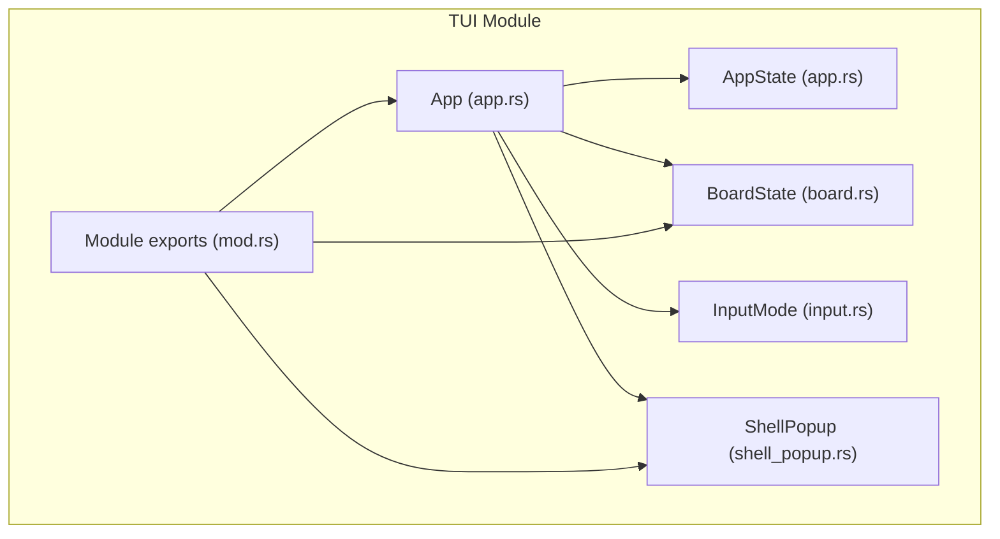
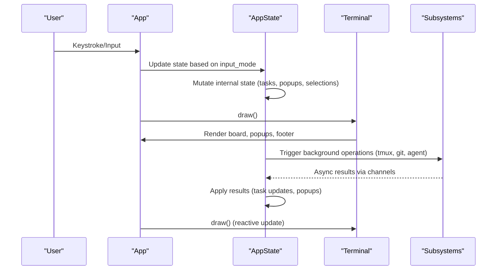
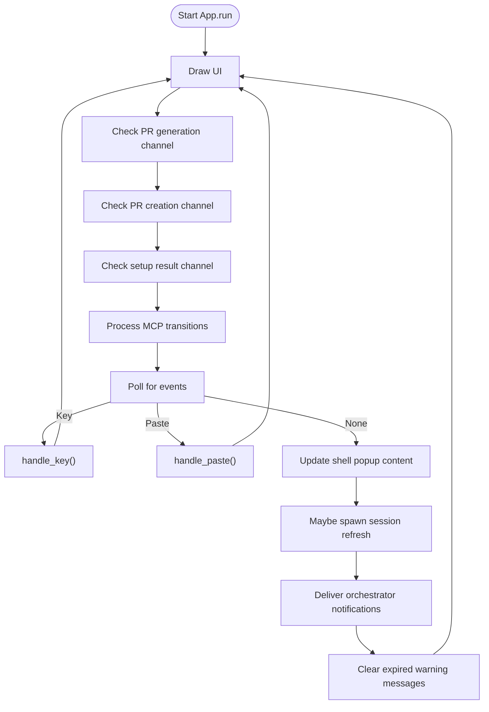
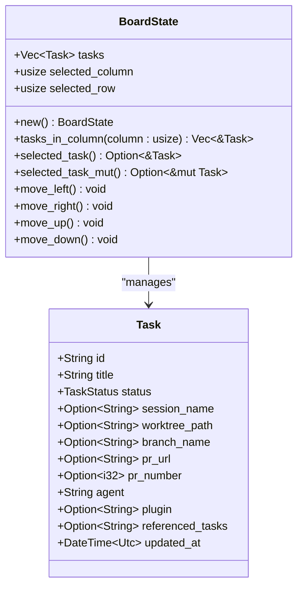
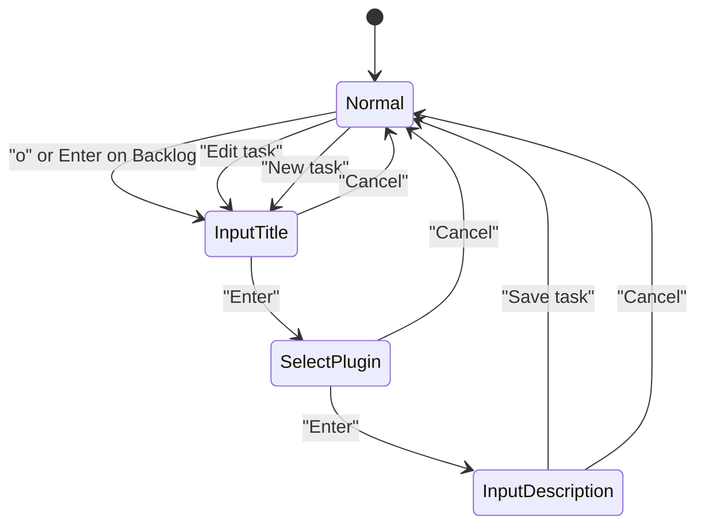
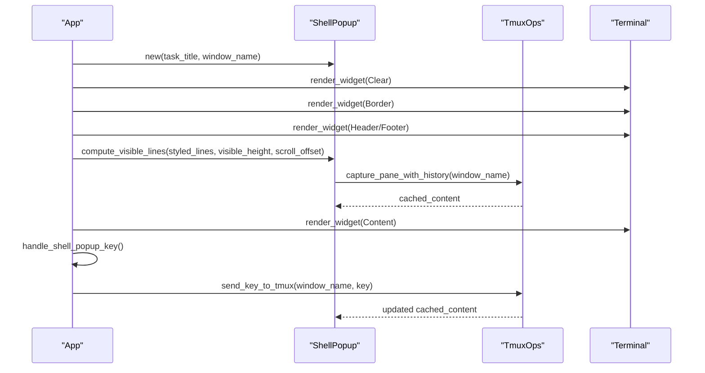
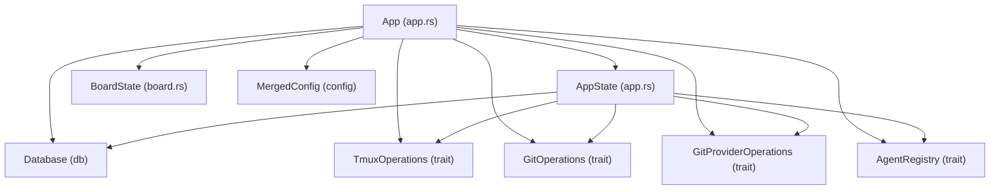

# TUI Application API

<cite>
**Referenced Files in This Document**
- [app.rs](file://src/tui/app.rs)
- [board.rs](file://src/tui/board.rs)
- [input.rs](file://src/tui/input.rs)
- [shell_popup.rs](file://src/tui/shell_popup.rs)
- [mod.rs](file://src/tui/mod.rs)
</cite>

## Table of Contents
1. [Introduction](#introduction)
2. [Project Structure](#project-structure)
3. [Core Components](#core-components)
4. [Architecture Overview](#architecture-overview)
5. [Detailed Component Analysis](#detailed-component-analysis)
6. [Dependency Analysis](#dependency-analysis)
7. [Performance Considerations](#performance-considerations)
8. [Troubleshooting Guide](#troubleshooting-guide)
9. [Conclusion](#conclusion)

## Introduction
This document provides comprehensive API documentation for AGTX's TUI (Text User Interface) application. It focuses on the public methods and state management patterns for the terminal user interface, covering the App struct constructors, AppState structure, Backend abstraction, popup states, and modal dialogs. The documentation explains reactive state management, event handling mechanisms, and integration with underlying subsystems such as tmux, Git, and the agent registry.

## Project Structure
The TUI module is organized into focused components that handle rendering, state, input, and popups:

**Diagram sources**
- [app.rs:615-769](file://src/tui/app.rs#L615-L769)
- [board.rs:3-9](file://src/tui/board.rs#L3-L9)
- [input.rs:1-19](file://src/tui/input.rs#L1-L19)
- [shell_popup.rs:4-18](file://src/tui/shell_popup.rs#L4-L18)
- [mod.rs:1-8](file://src/tui/mod.rs#L1-L8)

**Section sources**
- [mod.rs:1-8](file://src/tui/mod.rs#L1-L8)

## Core Components

### App Struct and Constructors
The App struct serves as the main TUI controller, managing terminal lifecycle, state, and rendering. It provides two primary constructors:

- `new(mode, flags)`: Creates an App with default injected operations (tmux, Git, GitHub, agent registry).
- `with_ops(mode, flags, tmux_ops, git_ops, git_provider_ops, agent_registry)`: Allows injecting custom implementations for testing or specialized environments.

Both constructors initialize terminal modes, load configurations, set up project contexts, and prepare the initial AppState.

Key responsibilities:
- Terminal setup and cleanup (raw mode, alternate screen, mouse capture)
- State initialization with board, input mode, search dropdowns, and popup states
- Background threads for task setup, PR generation, and session refresh
- Event loop for rendering and input handling

**Section sources**
- [app.rs:771-781](file://src/tui/app.rs#L771-L781)
- [app.rs:783-790](file://src/tui/app.rs#L783-L790)
- [app.rs:800-986](file://src/tui/app.rs#L800-L986)

### AppState Structure and Public Methods
AppState encapsulates all application state separate from the terminal for borrow-checker friendliness. It includes:

- UI state: mode, input_mode, input_buffer, cursor position, sidebar visibility/focus
- Kanban board: BoardState with selected column/row and task collection
- Wizard state: pending_task_title, editing_task_id, plugin selection, referenced task IDs
- Subsystem integrations: tmux_ops, git_ops, git_provider_ops, agent_registry
- Project metadata: project_path, project_name, tmux_project_name, available_agents
- Popups and overlays: shell_popup, task_search, file_search, skill_search, task_ref_search, diff_popup, PR popups
- Background channels: PR generation, PR creation, setup results, session refresh
- Reactive tracking: phase_status_cache, spinner_frame, pane_content_hashes, merge conflict checks, stuck task notifications
- UI helpers: click_regions, footer_nav_active/footer_nav_index, footer_items

Public methods for state updates and UI interactions:
- `refresh_tasks()`: Reloads tasks and updates dependency caches
- `refresh_projects()`: Loads projects from global database and sorts them
- `open_selected_task()`: Opens the selected task in a shell popup or fullscreen
- `attach_to_tmux_fullscreen(window_name)`: Suspends TUI and attaches to a tmux window
- `toggle_orchestrator()`: Manages the experimental orchestrator agent popup
- `deliver_orchestrator_notifications()`: Delivers queued notifications when orchestrator is idle
- `maybe_spawn_session_refresh()`: Spawns background thread to poll phase statuses
- `apply_session_refresh(result)`: Applies background refresh results to state

**Section sources**
- [app.rs:448-560](file://src/tui/app.rs#L448-L560)
- [app.rs:6131-6145](file://src/tui/app.rs#L6131-L6145)
- [app.rs:6147-6178](file://src/tui/app.rs#L6147-L6178)
- [app.rs:5981-6043](file://src/tui/app.rs#L5981-L6043)
- [app.rs:6047-6119](file://src/tui/app.rs#L6047-L6119)
- [app.rs:5818-5979](file://src/tui/app.rs#L5818-L5979)
- [app.rs:6182-6254](file://src/tui/app.rs#L6182-L6254)
- [app.rs:6258-6441](file://src/tui/app.rs#L6258-L6441)
- [app.rs:6444-6628](file://src/tui/app.rs#L6444-L6628)

### Backend Abstraction
The AppBackend enum abstracts terminal rendering and input processing, supporting both production (Crossterm) and test (TestBackend) modes:

- Production backend: CrosstermBackend wrapping stdout
- Test backend: ratatui TestBackend for unit testing
- Implements ratatui::backend::Backend trait with draw, cursor control, size queries, and flush operations

This abstraction enables testability while maintaining consistent terminal behavior.

**Section sources**
- [app.rs:299-414](file://src/tui/app.rs#L299-L414)

### Popup States and Modal Dialogs
The TUI supports numerous modal dialogs and overlays:

- Task creation wizard: InputTitle, SelectPlugin, InputDescription steps with dropdowns for file search, skill search, and task references
- Task search popup: Interactive fuzzy search with keyboard navigation
- PR creation flow: Confirmation popup with title/body editing and status popup for creation progress
- Git diff popup: Syntax-highlighted diff viewer with scrolling controls
- Delete confirmation popup: Safety confirmation for task deletion
- Review confirmation popup: Choice to create PR or move without PR
- Plugin selection popup: Choose workflow plugin for tasks
- Shell popup: Detached tmux window overlay with history, scrolling, and fullscreen attachment

Each popup maintains its own state and rendering logic, integrated into the main draw loop.

**Section sources**
- [app.rs:448-560](file://src/tui/app.rs#L448-L560)
- [app.rs:676-757](file://src/tui/app.rs#L676-L757)
- [app.rs:1864-2384](file://src/tui/app.rs#L1864-L2384)
- [app.rs:2391-2410](file://src/tui/app.rs#L2391-L2410)

## Architecture Overview
The TUI follows a reactive, event-driven architecture with explicit state separation:

**Diagram sources**
- [app.rs:1100-1220](file://src/tui/app.rs#L1100-L1220)
- [app.rs:1222-1250](file://src/tui/app.rs#L1222-L1250)

**Section sources**
- [app.rs:1100-1220](file://src/tui/app.rs#L1100-L1220)
- [app.rs:1222-1250](file://src/tui/app.rs#L1222-L1250)

## Detailed Component Analysis

### App Lifecycle and Event Loop
The App manages a continuous event loop that alternates between drawing, processing asynchronous results, handling user input, and refreshing background state:

**Diagram sources**
- [app.rs:1100-1220](file://src/tui/app.rs#L1100-L1220)
- [app.rs:1167-1217](file://src/tui/app.rs#L1167-L1217)

**Section sources**
- [app.rs:1100-1220](file://src/tui/app.rs#L1100-L1220)

### Task Management and Board Operations
BoardState provides navigation and selection over tasks arranged by status columns:

**Diagram sources**
- [board.rs:3-9](file://src/tui/board.rs#L3-L9)
- [board.rs:11-92](file://src/tui/board.rs#L11-L92)

**Section sources**
- [board.rs:3-99](file://src/tui/board.rs#L3-L99)

### Input Mode and Wizard Flow
InputMode governs the input state machine for task creation and editing:

**Diagram sources**
- [input.rs:1-19](file://src/tui/input.rs#L1-L19)
- [app.rs:3719-4441](file://src/tui/app.rs#L3719-L4441)

**Section sources**
- [input.rs:1-19](file://src/tui/input.rs#L1-L19)
- [app.rs:3719-4441](file://src/tui/app.rs#L3719-L4441)

### Shell Popup Rendering and Interaction
The shell popup provides a detached tmux window overlay with history and scrolling:

**Diagram sources**
- [app.rs:2391-2410](file://src/tui/app.rs#L2391-L2410)
- [app.rs:3362-3441](file://src/tui/app.rs#L3362-L3441)
- [shell_popup.rs:69-116](file://src/tui/shell_popup.rs#L69-L116)

**Section sources**
- [app.rs:2391-2410](file://src/tui/app.rs#L2391-L2410)
- [app.rs:3362-3441](file://src/tui/app.rs#L3362-L3441)
- [shell_popup.rs:69-116](file://src/tui/shell_popup.rs#L69-L116)

### Example API Usage Patterns

#### Task Creation Workflow
- Start: `input_mode = InputTitle`, `pending_task_title = ""`
- Enter title: `input_mode = SelectPlugin` or `input_mode = InputDescription`
- Select plugin: `wizard_selected_plugin` determines workflow plugin
- Enter description: supports file search (`#`), skill search (`/`), and task references (`!`)
- Save: `save_task()` persists to database and refreshes tasks

#### Board Navigation and Task Actions
- Navigate: `board.move_left/right/up/down` updates selection
- Open task: `open_selected_task()` or `attach_to_tmux_fullscreen()` for fullscreen
- Move task: `move_task_right()` advances task status with phase validation
- Delete task: `delete_selected_task()` followed by `perform_delete_task()`
- Show diff: `show_task_diff()` opens Git diff popup

#### State Updates and Background Processing
- Refresh tasks: `refresh_tasks()` reloads from database and updates dependency caches
- Background setup: `transition_to_planning()` spawns setup thread and updates state on completion
- Session refresh: `maybe_spawn_session_refresh()` polls phase statuses and applies results via `apply_session_refresh()`

**Section sources**
- [app.rs:3719-4441](file://src/tui/app.rs#L3719-L4441)
- [app.rs:4498-4567](file://src/tui/app.rs#L4498-L4567)
- [app.rs:4608-5183](file://src/tui/app.rs#L4608-L5183)
- [app.rs:6131-6145](file://src/tui/app.rs#L6131-L6145)
- [app.rs:6258-6441](file://src/tui/app.rs#L6258-L6441)

## Dependency Analysis
The TUI integrates with multiple subsystems through injected traits, enabling testability and modular design:

**Diagram sources**
- [app.rs:766-769](file://src/tui/app.rs#L766-L769)
- [app.rs:448-560](file://src/tui/app.rs#L448-L560)

**Section sources**
- [app.rs:766-769](file://src/tui/app.rs#L766-L769)
- [app.rs:448-560](file://src/tui/app.rs#L448-L560)

## Performance Considerations
- Asynchronous background processing: Setup, PR generation, and session refresh use channels to avoid blocking the UI thread
- Efficient rendering: Footer items and click regions are rebuilt each frame; shell popup content is cached and trimmed to reduce redraw costs
- Idle detection: Phase status polling uses TTL caching and content hash comparisons to minimize unnecessary work
- Memory management: State uses compact collections and clears caches on project switches to prevent memory bloat

## Troubleshooting Guide
Common issues and resolution strategies:

- Terminal cleanup failures: The App implements Drop to restore terminal state; ensure proper shutdown to avoid leaving raw mode enabled
- Background thread panics: Panic hook disables mouse capture and raw mode; check logs for thread panics
- Session recovery: Lost tmux sessions are recovered automatically; verify agent registry and project paths
- Warning messages: Transient warnings auto-clear after 5 seconds; check for persistent dependency or phase validation errors
- Orchestrator notifications: Delivery gated by readiness and idle detection; ensure orchestrator is ready and content is stable

**Section sources**
- [app.rs:620-627](file://src/tui/app.rs#L620-L627)
- [app.rs:794-797](file://src/tui/app.rs#L794-L797)
- [app.rs:6182-6254](file://src/tui/app.rs#L6182-L6254)

## Conclusion
AGTX's TUI provides a robust, reactive interface for managing AI-assisted development workflows. Its architecture cleanly separates state from rendering, supports extensive modal interactions, and integrates deeply with tmux, Git, and agent systems. The documented APIs enable both practical usage and reliable testing, with clear patterns for state updates, event handling, and background processing.