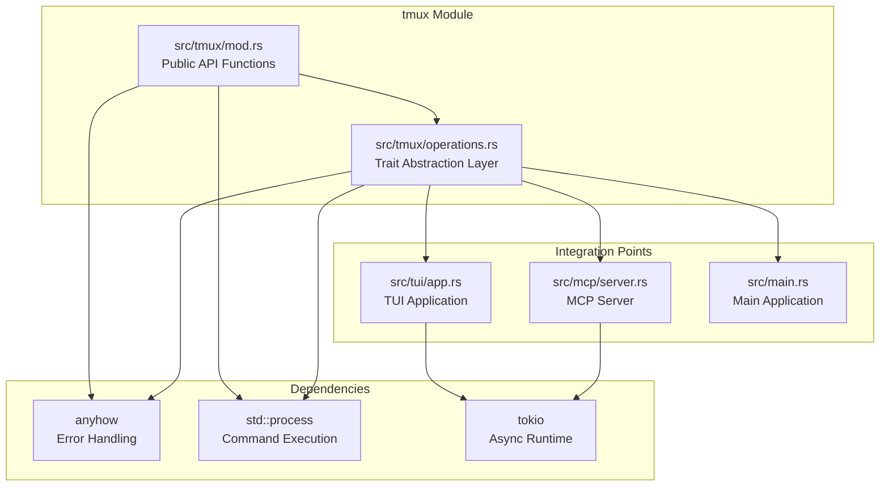
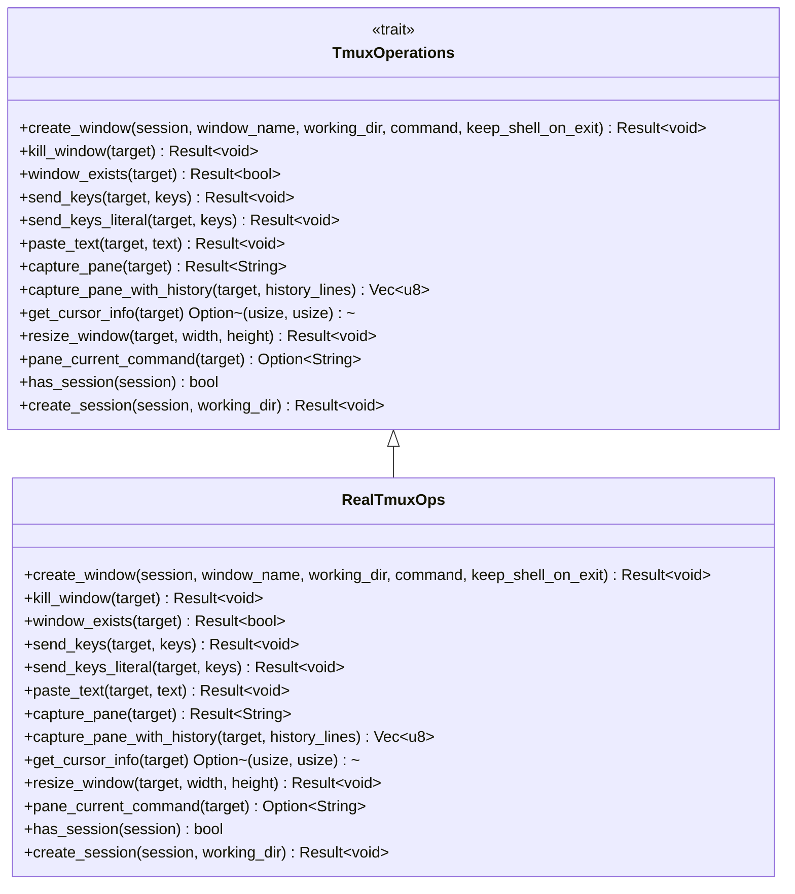
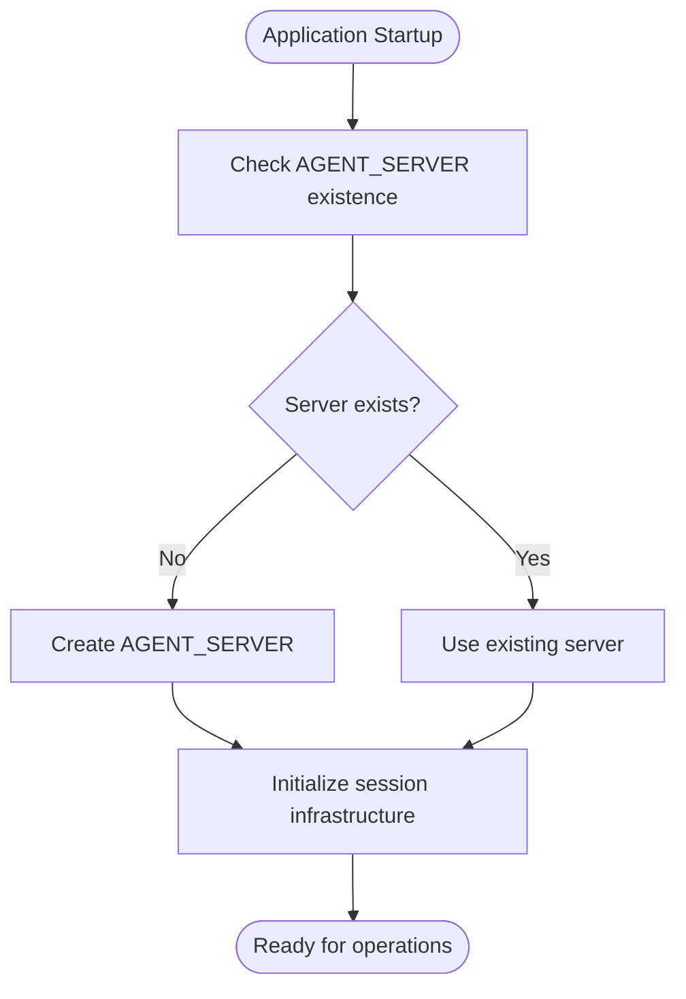
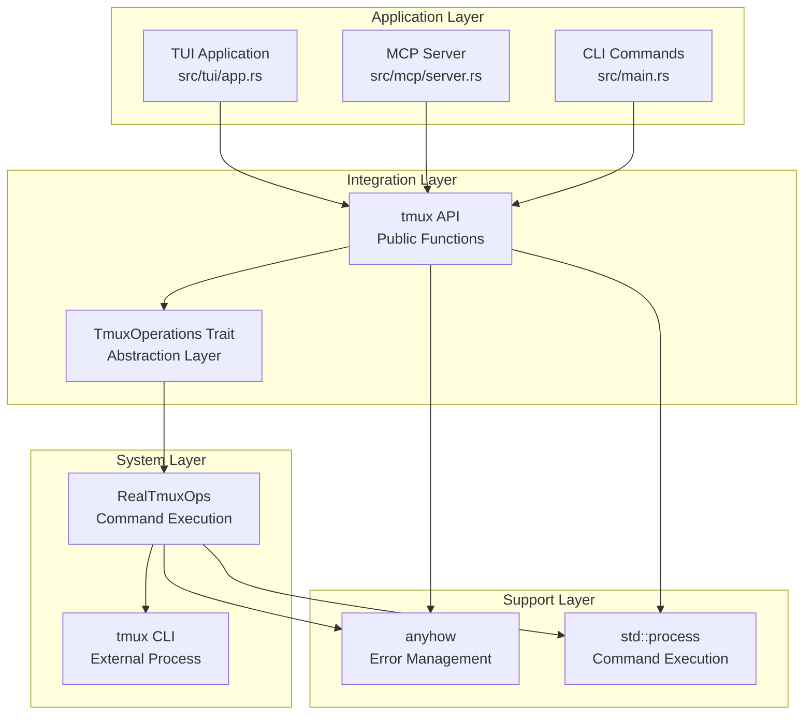
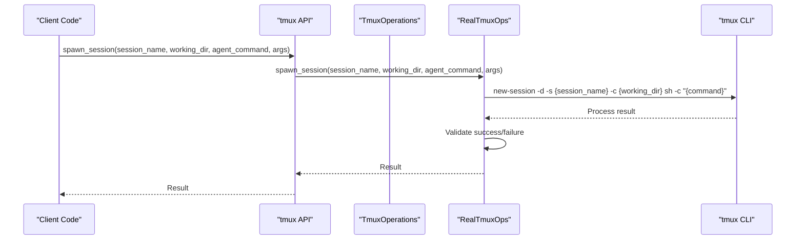
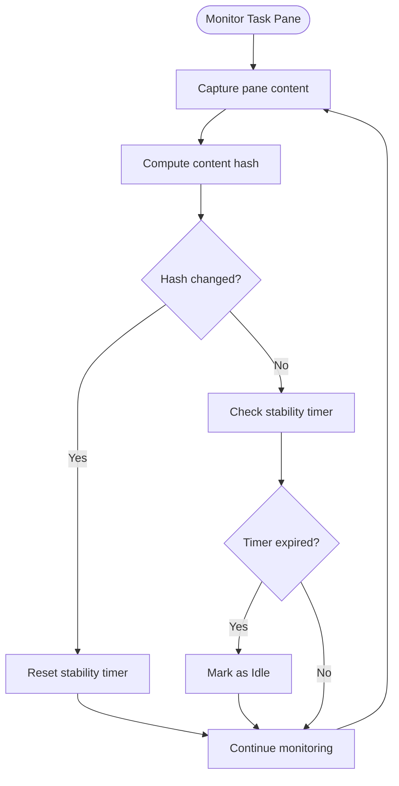
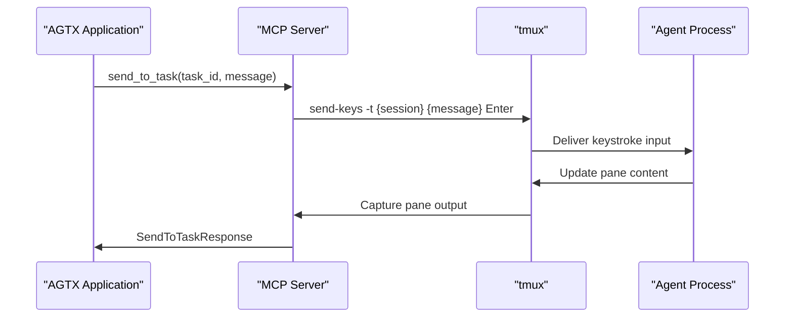
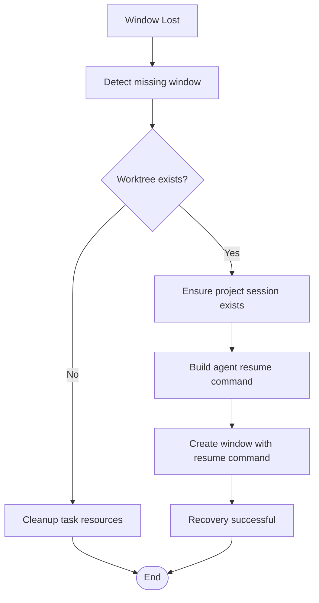
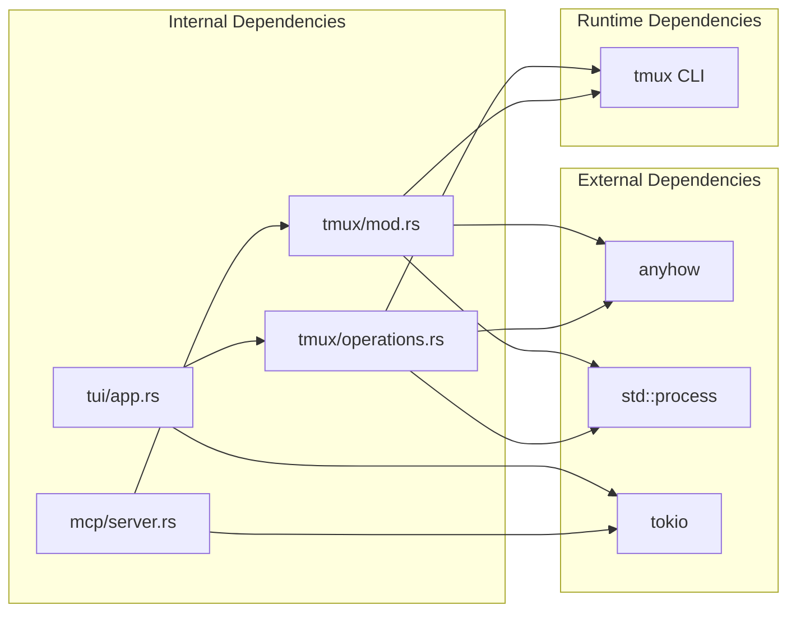

# tmux Integration API

<cite>
**Referenced Files in This Document**
- [mod.rs](file://src/tmux/mod.rs)
- [operations.rs](file://src/tmux/operations.rs)
- [app.rs](file://src/tui/app.rs)
- [server.rs](file://src/mcp/server.rs)
- [Cargo.toml](file://Cargo.toml)
</cite>

## Table of Contents
1. [Introduction](#introduction)
2. [Project Structure](#project-structure)
3. [Core Components](#core-components)
4. [Architecture Overview](#architecture-overview)
5. [Detailed Component Analysis](#detailed-component-analysis)
6. [Dependency Analysis](#dependency-analysis)
7. [Performance Considerations](#performance-considerations)
8. [Troubleshooting Guide](#troubleshooting-guide)
9. [Conclusion](#conclusion)

## Introduction

AGTX's tmux integration provides a comprehensive API for managing coding agent sessions within tmux environments. This system enables task execution orchestration, agent coordination, and real-time pane monitoring through a clean abstraction layer. The integration supports multiple coding agents (Claude, Codex, Copilot, Gemini, Cursor, OpenCode) with specialized handling for each agent's unique characteristics and command structures.

The tmux integration operates on a dedicated server named "agtx" to isolate agent sessions from other tmux usage. This separation ensures predictable session management and prevents interference with user tmux sessions. The system provides both high-level convenience functions for basic operations and a trait-based abstraction layer for advanced use cases and testing scenarios.

## Project Structure

The tmux integration is organized into two primary modules within the AGTX codebase:

**Diagram sources**
- [mod.rs:1-189](file://src/tmux/mod.rs#L1-L189)
- [operations.rs:1-249](file://src/tmux/operations.rs#L1-L249)
- [app.rs:1-100](file://src/tui/app.rs#L1-L100)

The module structure follows Rust conventions with public API functions in the main module and internal trait abstractions in a separate file. This separation enables both simple usage patterns and advanced mocking capabilities for testing.

**Section sources**
- [mod.rs:1-189](file://src/tmux/mod.rs#L1-L189)
- [operations.rs:1-249](file://src/tmux/operations.rs#L1-L249)

## Core Components

### TmuxOperations Trait

The `TmuxOperations` trait defines the complete interface for tmux session management and agent coordination. This trait-based approach enables dependency injection, testing with mocks, and flexible implementations.

**Diagram sources**
- [operations.rs:9-59](file://src/tmux/operations.rs#L9-L59)
- [operations.rs:61-248](file://src/tmux/operations.rs#L61-L248)

The trait provides comprehensive tmux functionality including window management, pane operations, session control, and agent-specific features. The `RealTmuxOps` implementation wraps actual tmux command execution with robust error handling and result processing.

**Section sources**
- [operations.rs:9-59](file://src/tmux/operations.rs#L9-L59)
- [operations.rs:61-248](file://src/tmux/operations.rs#L61-L248)

### Public API Functions

The public API module exposes convenient functions for common tmux operations without requiring trait implementations. These functions wrap the underlying trait methods with simplified signatures.

Key functions include:
- Session management: `spawn_session`, `list_sessions`, `session_exists`, `kill_session`, `attach_session`
- Pane operations: `capture_pane`, `send_keys`
- Name sanitization: `safe_session_name`

**Section sources**
- [mod.rs:14-166](file://src/tmux/mod.rs#L14-L166)

### Session Management Infrastructure

The tmux integration maintains a dedicated server named "agtx" to isolate agent sessions. This server operates independently of user tmux sessions, ensuring predictable behavior and preventing conflicts.

**Diagram sources**
- [mod.rs:11-12](file://src/tmux/mod.rs#L11-L12)
- [operations.rs:231-238](file://src/tmux/operations.rs#L231-L238)

**Section sources**
- [mod.rs:11-12](file://src/tmux/mod.rs#L11-L12)
- [operations.rs:231-238](file://src/tmux/operations.rs#L231-L238)

## Architecture Overview

The tmux integration architecture follows a layered approach with clear separation of concerns:

**Diagram sources**
- [app.rs:26-27](file://src/tui/app.rs#L26-L27)
- [server.rs:1-15](file://src/mcp/server.rs#L1-L15)
- [mod.rs:8-9](file://src/tmux/mod.rs#L8-L9)
- [operations.rs:61-64](file://src/tmux/operations.rs#L61-L64)

The architecture supports multiple integration points while maintaining a consistent interface. The trait-based design enables easy testing and mocking, while the public API provides convenient access for simple use cases.

**Section sources**
- [app.rs:26-27](file://src/tui/app.rs#L26-L27)
- [server.rs:1-15](file://src/mcp/server.rs#L1-L15)
- [mod.rs:8-9](file://src/tmux/mod.rs#L8-L9)
- [operations.rs:61-64](file://src/tmux/operations.rs#L61-L64)

## Detailed Component Analysis

### Session Management API

The session management component provides comprehensive control over tmux sessions for agent coordination:

**Diagram sources**
- [mod.rs:15-47](file://src/tmux/mod.rs#L15-L47)
- [operations.rs:64-109](file://src/tmux/operations.rs#L64-L109)

The session management system supports:
- **Session Creation**: Detached sessions with working directory specification
- **Session Discovery**: Listing and existence checking with structured data
- **Session Control**: Killing sessions and attaching for debugging
- **Name Sanitization**: Safe conversion of project names to tmux-compatible identifiers

**Section sources**
- [mod.rs:15-166](file://src/tmux/mod.rs#L15-L166)
- [operations.rs:64-109](file://src/tmux/operations.rs#L64-L109)

### Pane Monitoring and Agent Coordination

The pane monitoring system provides sophisticated agent activity tracking and idle detection:

**Diagram sources**
- [app.rs:6521-6534](file://src/tui/app.rs#L6521-L6534)

The monitoring system tracks agent activity through multiple mechanisms:
- **Content Hashing**: Detects changes in pane output
- **Command Detection**: Identifies agent processes via `pane_current_command`
- **UI Indicator Detection**: Recognizes agent-specific interface patterns
- **Idle Timeout**: Implements 15-second stability threshold for idle detection

**Section sources**
- [app.rs:6521-6534](file://src/tui/app.rs#L6521-L6534)
- [app.rs:8553-8577](file://src/tui/app.rs#L8553-L8577)

### Agent Communication Protocols

The agent communication system provides bidirectional messaging between the application and agent panes:

**Diagram sources**
- [server.rs:878-915](file://src/mcp/server.rs#L878-L915)
- [server.rs:124-136](file://src/mcp/server.rs#L124-L136)

The communication protocol supports:
- **Command Delivery**: Sending messages to specific task panes
- **Output Capture**: Reading recent pane content for monitoring
- **Session Targeting**: Precise targeting of tmux windows and panes
- **Error Handling**: Robust error propagation and recovery

**Section sources**
- [server.rs:878-915](file://src/mcp/server.rs#L878-L915)
- [server.rs:124-136](file://src/mcp/server.rs#L124-L136)

### Session Recovery Mechanisms

The system implements comprehensive session recovery to handle tmux server restarts and manual interventions:

**Diagram sources**
- [app.rs:6842-6877](file://src/tui/app.rs#L6842-L6877)

The recovery mechanism preserves task continuity by:
- **Worktree Validation**: Ensuring project files still exist
- **Session Recreation**: Rebuilding tmux session structure
- **Agent Resumption**: Restarting agents with previous context
- **State Preservation**: Maintaining task metadata and progress

**Section sources**
- [app.rs:6842-6877](file://src/tui/app.rs#L6842-L6877)

## Dependency Analysis

The tmux integration has minimal external dependencies while providing comprehensive functionality:

**Diagram sources**
- [Cargo.toml:29-34](file://Cargo.toml#L29-L34)
- [mod.rs:8-9](file://src/tmux/mod.rs#L8-L9)
- [operations.rs:3-4](file://src/tmux/operations.rs#L3-L4)

The dependency structure emphasizes:
- **Minimal External Coupling**: Only tmux CLI and standard library dependencies
- **Internal Cohesion**: Clear separation between API and implementation
- **Testing Support**: Feature flag for mockall integration
- **Error Handling**: Consistent use of anyhow for error propagation

**Section sources**
- [Cargo.toml:29-34](file://Cargo.toml#L29-L34)
- [mod.rs:8-9](file://src/tmux/mod.rs#L8-L9)
- [operations.rs:3-4](file://src/tmux/operations.rs#L3-L4)

## Performance Considerations

The tmux integration implements several performance optimizations:

### Caching Strategies
- **Session Refresh Throttling**: 2-second TTL for session status updates
- **Content Hash Caching**: Efficient idle detection using hash comparisons
- **Phase Status Caching**: Reduced tmux queries through intelligent caching

### Asynchronous Operations
- **Background Monitoring**: Non-blocking session refresh threads
- **Concurrent Processing**: Parallel task status checking
- **Efficient Polling**: Strategic timing to minimize tmux overhead

### Resource Management
- **Lazy Initialization**: Sessions created only when needed
- **Window Reuse**: Existing windows preserved when possible
- **Cleanup Automation**: Automatic resource cleanup on task completion

## Troubleshooting Guide

### Common Issues and Solutions

**Session Creation Failures**
- Verify tmux is installed and accessible in PATH
- Check permissions for tmux server "agtx"
- Ensure working directory exists and is accessible
- Review error messages for specific failure reasons

**Agent Detection Problems**
- Confirm agent binaries are installed and executable
- Verify agent-specific command recognition patterns
- Check for agent updates that may change command structure
- Validate agent configuration and authentication

**Pane Monitoring Issues**
- Ensure pane capture permissions are available
- Check for agent-specific UI patterns that may affect detection
- Verify tmux version compatibility
- Monitor for long-running processes that may interfere with detection

**Session Recovery Failures**
- Confirm worktree directories still exist
- Verify agent resume commands are available
- Check for permission issues accessing project files
- Validate tmux server connectivity

### Debugging Techniques

**Manual tmux Interaction**
- Use `tmux -L agtx list-sessions` to inspect session state
- Attach to problematic sessions for direct debugging
- Monitor session activity and agent processes
- Verify pane content and cursor positions

**Logging and Monitoring**
- Enable verbose logging for tmux operations
- Monitor tmux server logs for errors
- Track agent process status and health
- Observe session lifecycle events

**Performance Diagnostics**
- Measure tmux command execution times
- Monitor memory usage during extended sessions
- Track concurrent session limits
- Analyze error rates and recovery patterns

## Conclusion

AGTX's tmux integration provides a robust foundation for agent-based task execution with comprehensive session management, sophisticated pane monitoring, and reliable agent communication protocols. The architecture balances simplicity for common use cases with flexibility for advanced scenarios through its trait-based design.

Key strengths of the integration include:
- **Reliable Session Management**: Comprehensive control over tmux sessions and windows
- **Intelligent Agent Coordination**: Specialized handling for multiple coding agents
- **Advanced Monitoring**: Sophisticated idle detection and activity tracking
- **Resilient Recovery**: Automatic session restoration after disruptions
- **Flexible Architecture**: Clean abstractions supporting testing and customization

The system demonstrates best practices in error handling, performance optimization, and maintainable code organization, making it an excellent foundation for agent-based development workflows.