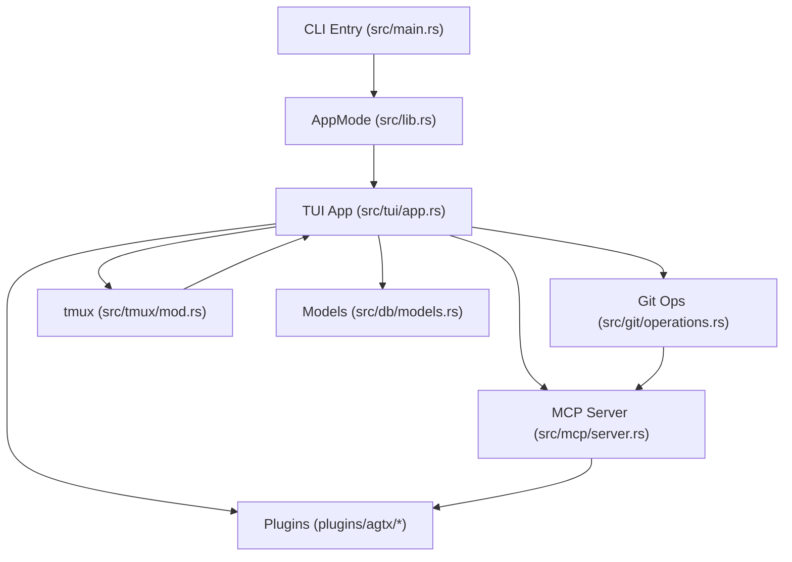
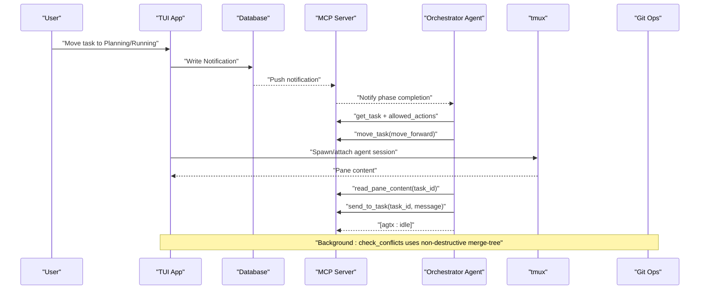
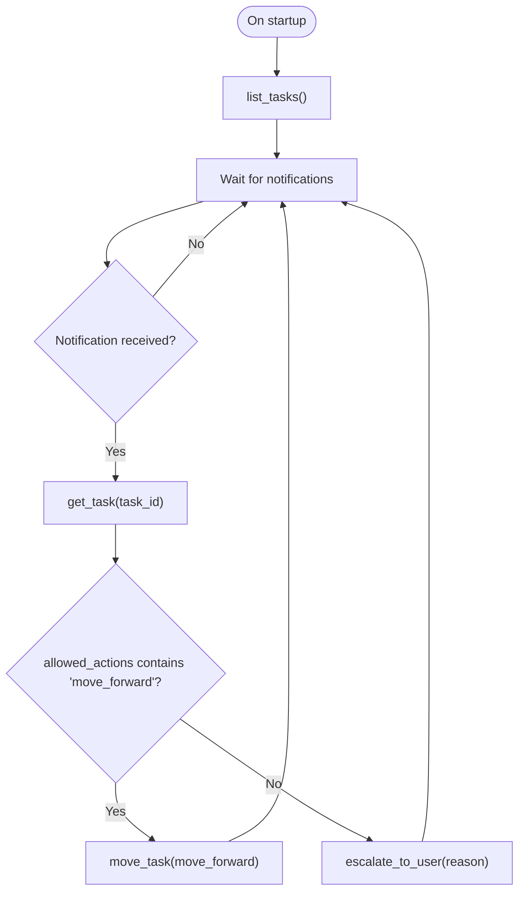
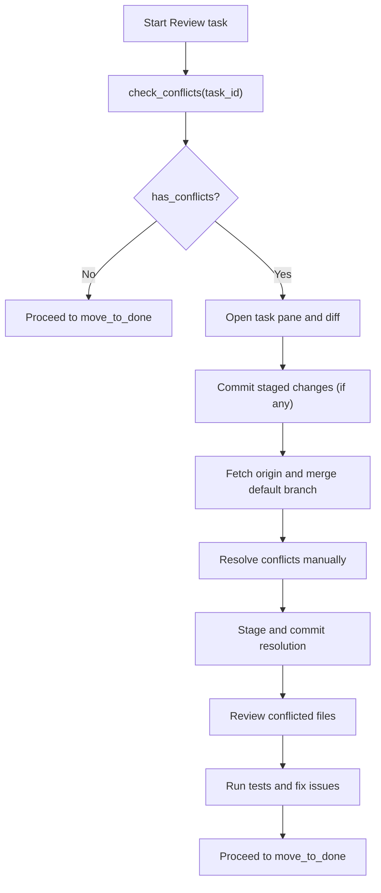
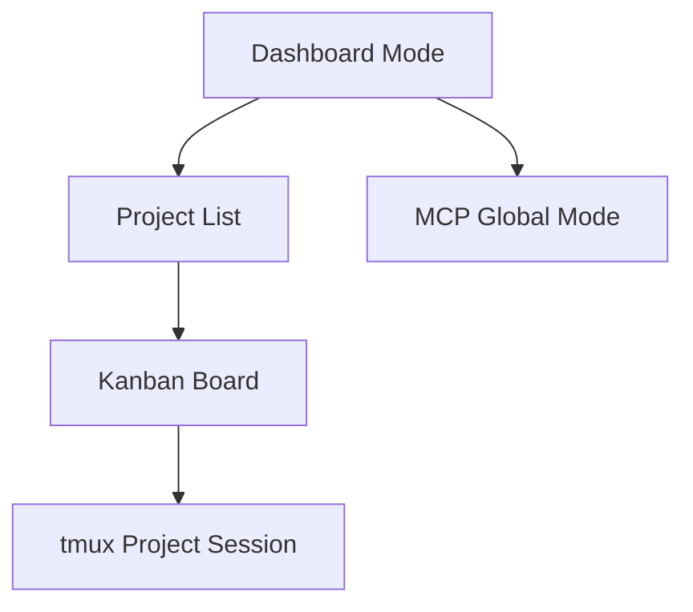
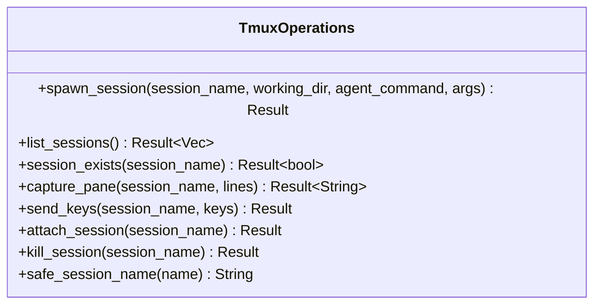
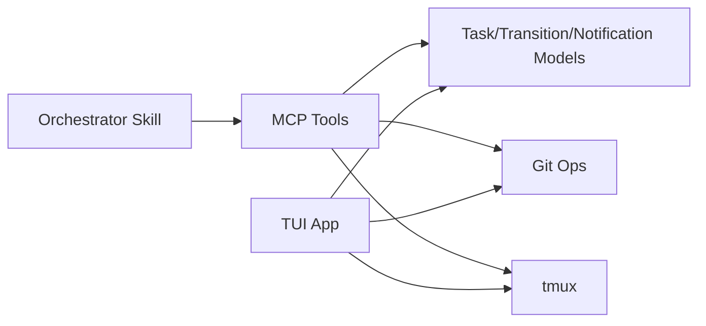

# Advanced Features

<cite>
**Referenced Files in This Document**
- [src/main.rs](file://src/main.rs)
- [src/lib.rs](file://src/lib.rs)
- [src/tui/app.rs](file://src/tui/app.rs)
- [src/tui/board.rs](file://src/tui/board.rs)
- [src/mcp/server.rs](file://src/mcp/server.rs)
- [src/git/operations.rs](file://src/git/operations.rs)
- [src/git/mod.rs](file://src/git/mod.rs)
- [src/tmux/mod.rs](file://src/tmux/mod.rs)
- [src/db/models.rs](file://src/db/models.rs)
- [plugins/agtx/plugin.toml](file://plugins/agtx/plugin.toml)
- [plugins/agtx/skills/orchestrate.md](file://plugins/agtx/skills/orchestrate.md)
- [plugins/agtx/skills/merge-conflicts.md](file://plugins/agtx/skills/merge-conflicts.md)
- [plugins/agent-skills/plugin.toml](file://plugins/agent-skills/plugin.toml)
- [CLAUDE.md](file://CLAUDE.md)
</cite>

## Table of Contents
1. [Introduction](#introduction)
2. [Project Structure](#project-structure)
3. [Core Components](#core-components)
4. [Architecture Overview](#architecture-overview)
5. [Detailed Component Analysis](#detailed-component-analysis)
6. [Dependency Analysis](#dependency-analysis)
7. [Performance Considerations](#performance-considerations)
8. [Troubleshooting Guide](#troubleshooting-guide)
9. [Conclusion](#conclusion)
10. [Appendices](#appendices)

## Introduction
This document focuses on AGTX’s advanced features for power users and complex workflows. It covers:
- The experimental orchestrator agent that autonomously manages the kanban board, monitors progress, advances phases, and handles stuck tasks.
- The merge conflict detection and resolution system using non-destructive virtual merges.
- Dashboard mode for managing multiple projects simultaneously.
- Advanced tmux integration for agent sessions and pane management.
- Practical examples of multi-milestone cycles, custom plugin configurations, and advanced agent coordination patterns.
- Performance optimization techniques for many concurrent tasks and agents.
- Troubleshooting strategies for orchestrator debugging, MCP server issues, and complex Git conflict resolution.
- Guidance for extending AGTX through custom plugins and agent integrations.

## Project Structure
AGTX organizes functionality into cohesive modules:
- CLI entrypoint and modes (dashboard vs project).
- TUI for kanban board, sidebar, and project dashboards.
- MCP server for orchestrator tooling and cross-project operations.
- Git operations for worktrees, diffs, and non-destructive conflict checks.
- tmux integration for agent sessions and pane capture/send.
- Database models for tasks, transitions, and notifications.
- Plugins for built-in skills and external agent skills.

**Diagram sources**
- [src/main.rs:16-96](file://src/main.rs#L16-L96)
- [src/lib.rs:12-24](file://src/lib.rs#L12-L24)
- [src/tui/app.rs:539-750](file://src/tui/app.rs#L539-L750)
- [src/mcp/server.rs:395-520](file://src/mcp/server.rs#L395-L520)
- [src/git/operations.rs:10-75](file://src/git/operations.rs#L10-L75)
- [src/tmux/mod.rs:11-189](file://src/tmux/mod.rs#L11-L189)
- [src/db/models.rs:58-133](file://src/db/models.rs#L58-L133)
- [plugins/agtx/plugin.toml:1-16](file://plugins/agtx/plugin.toml#L1-L16)

**Section sources**
- [src/main.rs:16-96](file://src/main.rs#L16-L96)
- [src/lib.rs:12-24](file://src/lib.rs#L12-L24)
- [src/tui/app.rs:539-750](file://src/tui/app.rs#L539-L750)
- [src/mcp/server.rs:395-520](file://src/mcp/server.rs#L395-L520)
- [src/git/operations.rs:10-75](file://src/git/operations.rs#L10-L75)
- [src/tmux/mod.rs:11-189](file://src/tmux/mod.rs#L11-L189)
- [src/db/models.rs:58-133](file://src/db/models.rs#L58-L133)
- [plugins/agtx/plugin.toml:1-16](file://plugins/agtx/plugin.toml#L1-L16)

## Core Components
- AppMode and FeatureFlags: Control CLI mode and enable experimental features like the orchestrator agent.
- TUI App: Renders the kanban board, dashboard, and manages tmux sessions, Git operations, and orchestrator integration.
- MCP Server: Provides tools for listing/listening to tasks, moving tasks, checking conflicts, and orchestrator notifications.
- Git Operations: Worktree management and non-destructive conflict checks using virtual merges.
- tmux Integration: Spawning, capturing panes, sending keys, attaching sessions, and session lifecycle.
- Database Models: Task lifecycle, transition requests, notifications, and agent session tracking.

**Section sources**
- [src/lib.rs:12-24](file://src/lib.rs#L12-L24)
- [src/tui/app.rs:539-750](file://src/tui/app.rs#L539-L750)
- [src/mcp/server.rs:395-520](file://src/mcp/server.rs#L395-L520)
- [src/git/operations.rs:10-75](file://src/git/operations.rs#L10-L75)
- [src/tmux/mod.rs:11-189](file://src/tmux/mod.rs#L11-L189)
- [src/db/models.rs:58-133](file://src/db/models.rs#L58-L133)

## Architecture Overview
The orchestrator agent operates as a push-notification-driven MCP client integrated with the TUI. The TUI detects task phase changes and writes notifications to the database. The orchestrator reads these notifications via MCP tools and advances tasks accordingly. tmux captures pane content to diagnose stuck agents, and Git operations support non-destructive conflict checks.

**Diagram sources**
- [src/tui/app.rs:677-1032](file://src/tui/app.rs#L677-L1032)
- [src/mcp/server.rs:521-755](file://src/mcp/server.rs#L521-L755)
- [src/git/operations.rs:211-243](file://src/git/operations.rs#L211-L243)
- [src/tmux/mod.rs:97-118](file://src/tmux/mod.rs#L97-L118)
- [plugins/agtx/skills/orchestrate.md:30-90](file://plugins/agtx/skills/orchestrate.md#L30-L90)

## Detailed Component Analysis

### Experimental Orchestrator Agent
The orchestrator agent skill defines a push-notification-driven workflow:
- Receives notifications when tasks complete a phase.
- Queries task details and allowed actions.
- Advances tasks using move_task with move_forward.
- Handles stuck tasks by reading pane content and sending targeted inputs or escalating to the user.

**Diagram sources**
- [plugins/agtx/skills/orchestrate.md:57-90](file://plugins/agtx/skills/orchestrate.md#L57-L90)
- [src/mcp/server.rs:590-653](file://src/mcp/server.rs#L590-L653)
- [src/mcp/server.rs:655-721](file://src/mcp/server.rs#L655-L721)

**Section sources**
- [plugins/agtx/skills/orchestrate.md:6-90](file://plugins/agtx/skills/orchestrate.md#L6-L90)
- [src/mcp/server.rs:521-755](file://src/mcp/server.rs#L521-L755)
- [src/tui/app.rs:677-1032](file://src/tui/app.rs#L677-L1032)

### Merge Conflict Detection and Resolution
AGTX performs non-destructive conflict checks using virtual merges:
- fetch_and_check_conflicts runs a virtual merge and reports conflicts without modifying the working tree.
- MCP tool check_conflicts integrates with the TUI to scan Review tasks for conflicts.
- The merge-conflicts skill provides a deterministic, safe resolution recipe.

**Diagram sources**
- [src/git/operations.rs:211-243](file://src/git/operations.rs#L211-L243)
- [src/mcp/server.rs:757-827](file://src/mcp/server.rs#L757-L827)
- [plugins/agtx/skills/merge-conflicts.md:10-53](file://plugins/agtx/skills/merge-conflicts.md#L10-L53)

**Section sources**
- [src/git/operations.rs:211-243](file://src/git/operations.rs#L211-L243)
- [src/mcp/server.rs:757-827](file://src/mcp/server.rs#L757-L827)
- [plugins/agtx/skills/merge-conflicts.md:6-53](file://plugins/agtx/skills/merge-conflicts.md#L6-L53)

### Dashboard Mode for Multi-Project Management
Dashboard mode allows switching between projects and viewing multiple kanban boards:
- AppMode::Dashboard enables project switching and global project indexing.
- The TUI renders a compact dashboard layout and project list.
- tmux sessions are scoped per project for isolation.

**Diagram sources**
- [src/lib.rs:12-24](file://src/lib.rs#L12-L24)
- [src/tui/app.rs:990-1032](file://src/tui/app.rs#L990-L1032)
- [CLAUDE.md:162-182](file://CLAUDE.md#L162-L182)

**Section sources**
- [src/lib.rs:12-24](file://src/lib.rs#L12-L24)
- [src/tui/app.rs:990-1032](file://src/tui/app.rs#L990-L1032)
- [CLAUDE.md:162-182](file://CLAUDE.md#L162-L182)

### Advanced tmux Integration
tmux integration supports:
- Spawning agent sessions with sanitized names.
- Capturing pane content for idle detection and stuck-task diagnosis.
- Sending keys to agent panes to resolve prompts.
- Attaching to sessions for interactive debugging.
- Session lifecycle management and recovery.

**Diagram sources**
- [src/tmux/mod.rs:14-189](file://src/tmux/mod.rs#L14-L189)

**Section sources**
- [src/tmux/mod.rs:14-189](file://src/tmux/mod.rs#L14-L189)
- [src/tui/app.rs:677-1032](file://src/tui/app.rs#L677-L1032)

### Practical Examples

#### Multi-Milestone Cycles
- Use referenced_tasks to chain tasks across milestones.
- Configure a workflow plugin to enforce milestone gating and allowed_actions.
- The orchestrator advances tasks only when dependencies are satisfied.

**Section sources**
- [src/mcp/server.rs:473-518](file://src/mcp/server.rs#L473-L518)
- [src/db/models.rs:58-133](file://src/db/models.rs#L58-L133)

#### Custom Plugin Configurations
- Define plugin commands and artifacts in plugin.toml.
- Use bundled plugins like agent-skills for production-grade skills.

**Section sources**
- [plugins/agtx/plugin.toml:1-16](file://plugins/agtx/plugin.toml#L1-L16)
- [plugins/agent-skills/plugin.toml:1-19](file://plugins/agent-skills/plugin.toml#L1-L19)

#### Advanced Agent Coordination Patterns
- Use MCP tools to coordinate multiple agents across Planning and Running.
- Employ read_pane_content and send_to_task to resolve interactive prompts.
- Use escalate_to_user for domain decisions requiring human judgment.

**Section sources**
- [plugins/agtx/skills/orchestrate.md:14-100](file://plugins/agtx/skills/orchestrate.md#L14-L100)
- [src/mcp/server.rs:590-653](file://src/mcp/server.rs#L590-L653)

## Dependency Analysis
The orchestrator relies on:
- MCP tools for task state queries and transitions.
- tmux for agent pane inspection and input injection.
- Git operations for non-destructive conflict checks.
- Database models for notifications and transition requests.

**Diagram sources**
- [src/mcp/server.rs:521-755](file://src/mcp/server.rs#L521-L755)
- [src/db/models.rs:58-133](file://src/db/models.rs#L58-L133)
- [src/git/operations.rs:10-75](file://src/git/operations.rs#L10-L75)
- [src/tmux/mod.rs:11-189](file://src/tmux/mod.rs#L11-L189)

**Section sources**
- [src/mcp/server.rs:521-755](file://src/mcp/server.rs#L521-L755)
- [src/db/models.rs:58-133](file://src/db/models.rs#L58-L133)
- [src/git/operations.rs:10-75](file://src/git/operations.rs#L10-L75)
- [src/tmux/mod.rs:11-189](file://src/tmux/mod.rs#L11-L189)

## Performance Considerations
- Non-blocking background refresh: The TUI uses a background thread to poll tmux pane content and task status, updating caches on the main thread to avoid blocking.
- Efficient conflict checks: Virtual merges (merge-tree) avoid writing to disk and are suitable for frequent checks.
- Minimal TUI redraws: Footer and click-region caching reduce layout overhead.
- tmux pane capture limits: Limit captured lines to reduce I/O overhead.

[No sources needed since this section provides general guidance]

## Troubleshooting Guide

### Orchestrator Debugging
- Ensure the orchestrator session is detected and ready before sending notifications.
- Use read_pane_content to diagnose stuck agents and send_to_task to resolve prompts.
- Confirm allowed_actions align with task status and plugin rules.

**Section sources**
- [src/tui/app.rs:677-1032](file://src/tui/app.rs#L677-L1032)
- [src/mcp/server.rs:590-653](file://src/mcp/server.rs#L590-L653)
- [plugins/agtx/skills/orchestrate.md:108-200](file://plugins/agtx/skills/orchestrate.md#L108-L200)

### MCP Server Issues
- Verify project_id resolution in global mode.
- Check tool parameter validation and error messages.
- Ensure the MCP server is reachable and configured for the intended mode (project/global).

**Section sources**
- [src/mcp/server.rs:409-444](file://src/mcp/server.rs#L409-L444)
- [src/mcp/server.rs:521-755](file://src/mcp/server.rs#L521-L755)

### Complex Git Conflict Resolution
- Use non-destructive merge-tree checks to identify conflicting files.
- Follow the merge-conflicts skill steps to safely resolve and test changes.
- If conflicts persist, escalate to the user with a concise reason.

**Section sources**
- [src/git/operations.rs:211-243](file://src/git/operations.rs#L211-L243)
- [src/mcp/server.rs:757-827](file://src/mcp/server.rs#L757-L827)
- [plugins/agtx/skills/merge-conflicts.md:10-53](file://plugins/agtx/skills/merge-conflicts.md#L10-L53)

## Conclusion
AGTX’s advanced features enable sophisticated, autonomous workflows:
- The orchestrator agent streamlines task progression with push-based notifications and intelligent stuck-task handling.
- Non-destructive Git conflict checks and a structured resolution skill ensure safe merges.
- Dashboard mode and tmux integration provide powerful multi-project and multi-agent orchestration.
- Extensive MCP tooling and plugin systems allow customization and extension for complex, evolving needs.

[No sources needed since this section summarizes without analyzing specific files]

## Appendices

### CLI Modes and Flags
- --experimental enables experimental features (e.g., orchestrator agent).
- -g selects dashboard mode.
- "." or path selects project mode.

**Section sources**
- [src/main.rs:21-59](file://src/main.rs#L21-L59)
- [src/lib.rs:12-24](file://src/lib.rs#L12-L24)