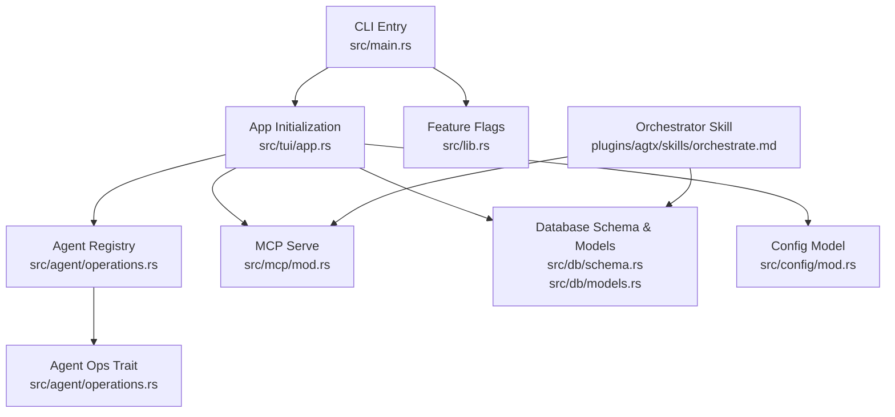
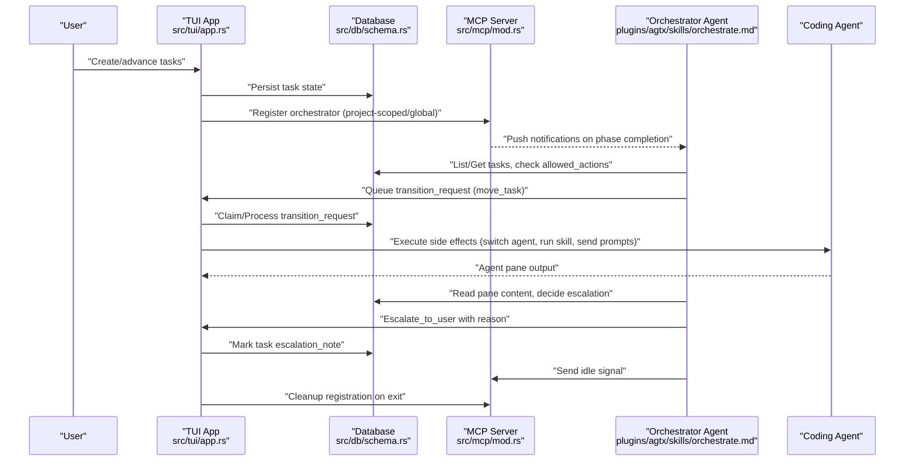
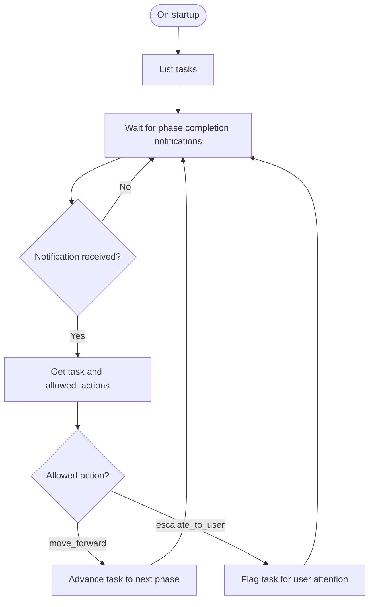
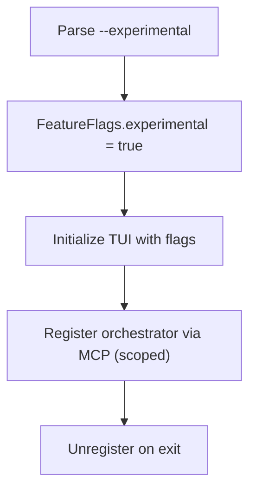
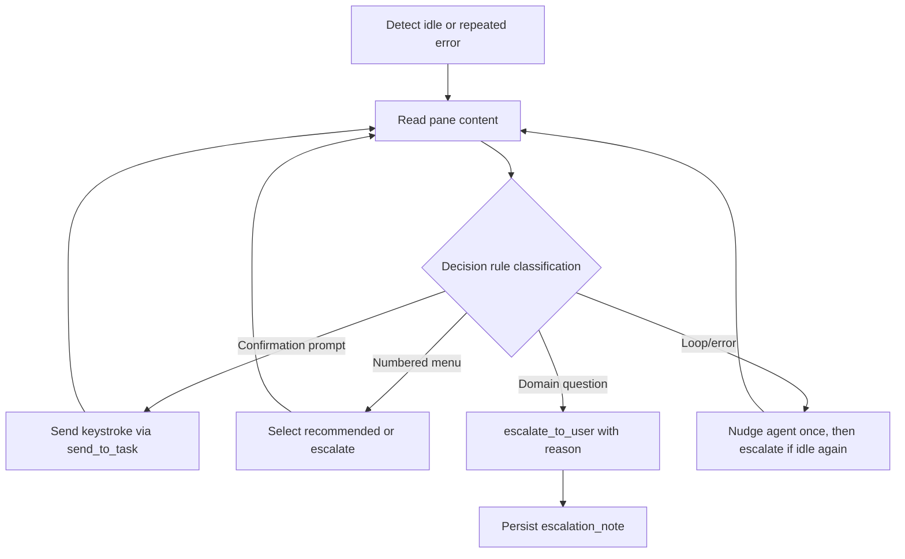
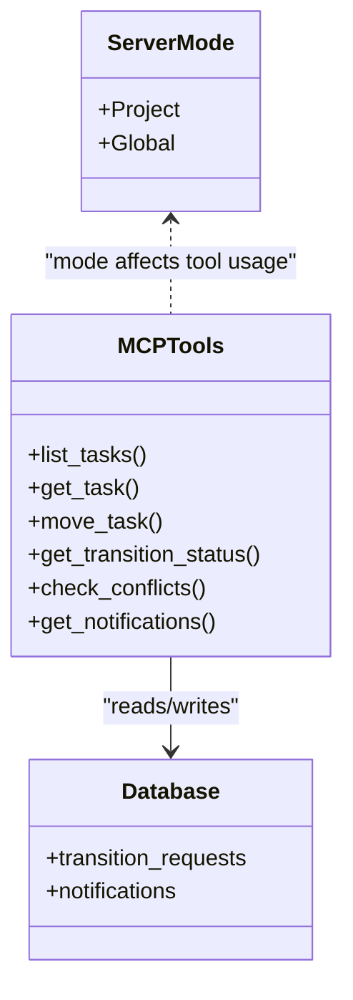
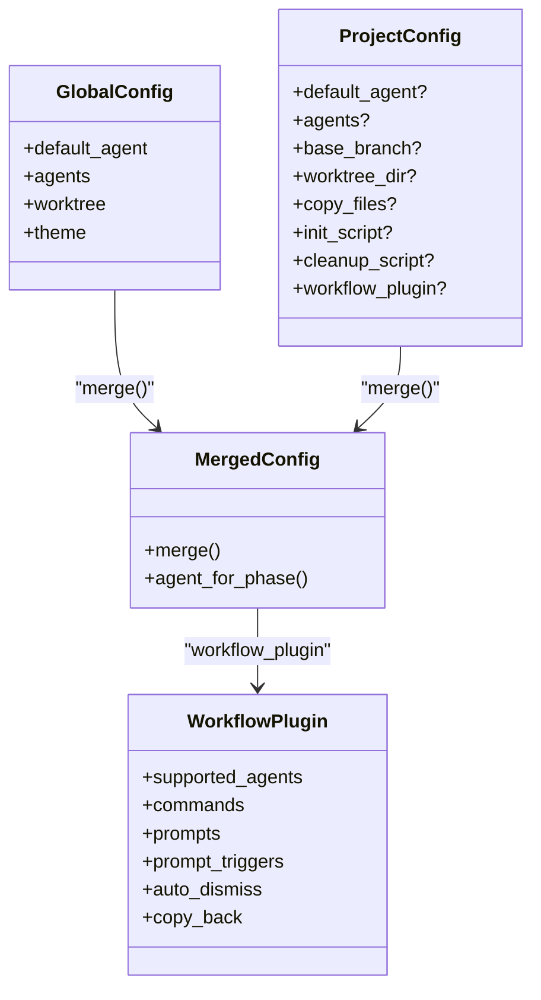
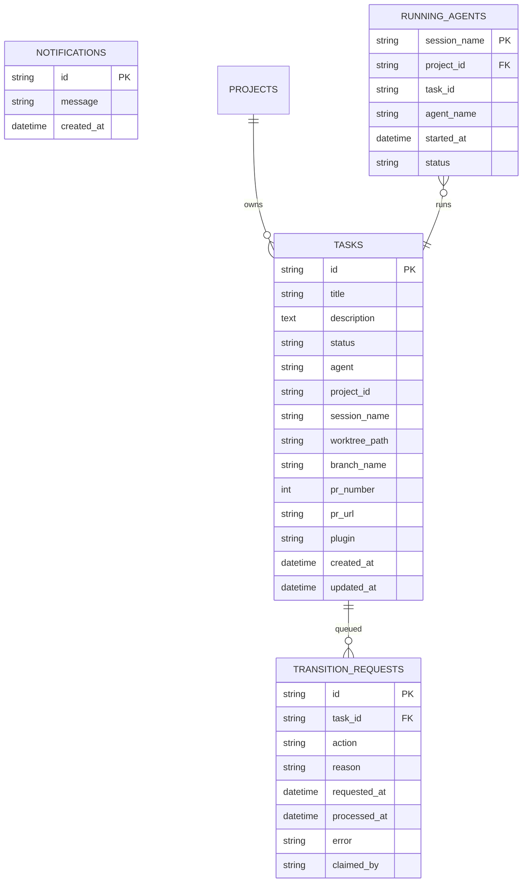
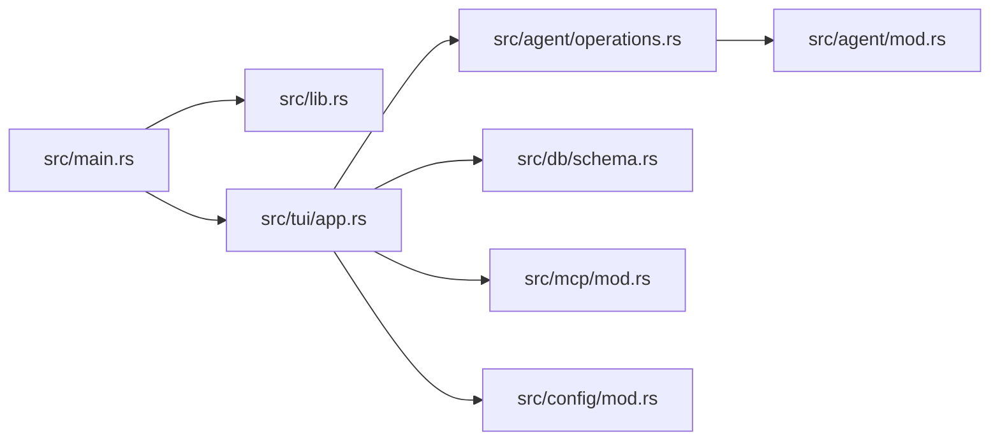

# Advanced Features

<cite>
**Referenced Files in This Document**
- [src/main.rs](file://src/main.rs)
- [src/lib.rs](file://src/lib.rs)
- [src/agent/mod.rs](file://src/agent/mod.rs)
- [src/agent/operations.rs](file://src/agent/operations.rs)
- [plugins/agtx/skills/orchestrate.md](file://plugins/agtx/skills/orchestrate.md)
- [src/config/mod.rs](file://src/config/mod.rs)
- [src/db/mod.rs](file://src/db/mod.rs)
- [src/db/models.rs](file://src/db/models.rs)
- [src/db/schema.rs](file://src/db/schema.rs)
- [src/mcp/mod.rs](file://src/mcp/mod.rs)
- [src/tui/app.rs](file://src/tui/app.rs)
- [src/tui/board.rs](file://src/tui/board.rs)
- [README.md](file://README.md)
- [CLAUDE.md](file://CLAUDE.md)
- [tests/db_tests.rs](file://tests/db_tests.rs)
</cite>

## Table of Contents
1. [Introduction](#introduction)
2. [Project Structure](#project-structure)
3. [Core Components](#core-components)
4. [Architecture Overview](#architecture-overview)
5. [Detailed Component Analysis](#detailed-component-analysis)
6. [Dependency Analysis](#dependency-analysis)
7. [Performance Considerations](#performance-considerations)
8. [Troubleshooting Guide](#troubleshooting-guide)
9. [Conclusion](#conclusion)
10. [Appendices](#appendices)

## Introduction
This document focuses on advanced features and expert-level usage patterns in the system. It covers the orchestrator agent’s automated task advancement, conflict detection, and intelligent escalation to human intervention. It documents experimental mode configuration, safety considerations for automated workflows, performance optimization techniques, advanced troubleshooting methodologies, extensibility points for custom integrations, expert-level configuration scenarios, security hardening, enterprise deployment considerations, and monitoring/observability features for production environments.

## Project Structure
At a high level, the system is organized around:
- CLI entrypoint and feature flags
- Agent abstraction and orchestrator command building
- MCP server and TUI orchestration
- Database-backed state for tasks, transitions, and notifications
- Configuration model supporting per-phase agent overrides and workflow plugins
- Plugins for specialized workflows and agent skills

**Diagram sources**
- [src/main.rs:16-96](file://src/main.rs#L16-L96)
- [src/lib.rs:12-23](file://src/lib.rs#L12-L23)
- [src/agent/operations.rs:110-163](file://src/agent/operations.rs#L110-L163)
- [src/mcp/mod.rs:1-5](file://src/mcp/mod.rs#L1-L5)
- [src/db/schema.rs:97-208](file://src/db/schema.rs#L97-L208)
- [src/db/models.rs:58-133](file://src/db/models.rs#L58-L133)
- [src/config/mod.rs:337-408](file://src/config/mod.rs#L337-L408)
- [plugins/agtx/skills/orchestrate.md:1-200](file://plugins/agtx/skills/orchestrate.md#L1-L200)

**Section sources**
- [src/main.rs:16-96](file://src/main.rs#L16-L96)
- [src/lib.rs:12-23](file://src/lib.rs#L12-L23)
- [src/agent/operations.rs:110-163](file://src/agent/operations.rs#L110-L163)
- [src/mcp/mod.rs:1-5](file://src/mcp/mod.rs#L1-L5)
- [src/db/schema.rs:97-208](file://src/db/schema.rs#L97-L208)
- [src/db/models.rs:58-133](file://src/db/models.rs#L58-L133)
- [src/config/mod.rs:337-408](file://src/config/mod.rs#L337-L408)
- [plugins/agtx/skills/orchestrate.md:1-200](file://plugins/agtx/skills/orchestrate.md#L1-L200)

## Core Components
- Experimental mode: toggled via CLI flag and propagated as a feature flag to the TUI and downstream components.
- Agent orchestration: builds agent-specific orchestrator commands and integrates with MCP for registration and lifecycle cleanup.
- MCP server: project-scoped and global modes; orchestrator communicates via notifications and transition requests.
- Database: centralizes task state, transition requests, and notifications with atomic operations for concurrency.
- Configuration: merges global and project-level settings, supports per-phase agent overrides and workflow plugins.

**Section sources**
- [src/main.rs:21-61](file://src/main.rs#L21-L61)
- [src/lib.rs:18-23](file://src/lib.rs#L18-L23)
- [src/agent/operations.rs:92-107](file://src/agent/operations.rs#L92-L107)
- [src/mcp/mod.rs:1-5](file://src/mcp/mod.rs#L1-L5)
- [src/db/schema.rs:478-554](file://src/db/schema.rs#L478-L554)
- [src/config/mod.rs:355-408](file://src/config/mod.rs#L355-L408)

## Architecture Overview
The orchestrator agent operates as a coordinator between the TUI and agent sessions. It advances tasks through Planning and Running phases, monitors completion, escalates when needed, and coordinates multiple agents in parallel. MCP provides a bidirectional communication channel with the orchestrator agent, and the TUI persists state in a centralized database.

**Diagram sources**
- [src/tui/app.rs:545-559](file://src/tui/app.rs#L545-L559)
- [src/db/schema.rs:478-554](file://src/db/schema.rs#L478-L554)
- [src/mcp/mod.rs:1-5](file://src/mcp/mod.rs#L1-L5)
- [plugins/agtx/skills/orchestrate.md:30-90](file://plugins/agtx/skills/orchestrate.md#L30-L90)
- [src/agent/operations.rs:92-107](file://src/agent/operations.rs#L92-L107)

**Section sources**
- [src/tui/app.rs:545-559](file://src/tui/app.rs#L545-L559)
- [src/db/schema.rs:478-554](file://src/db/schema.rs#L478-L554)
- [src/mcp/mod.rs:1-5](file://src/mcp/mod.rs#L1-L5)
- [plugins/agtx/skills/orchestrate.md:30-90](file://plugins/agtx/skills/orchestrate.md#L30-L90)
- [src/agent/operations.rs:92-107](file://src/agent/operations.rs#L92-L107)

## Detailed Component Analysis

### Orchestrator Agent Functionality
The orchestrator skill defines the operational contract for automated task advancement:
- Receives push notifications when a phase completes.
- Queries task details and allowed actions before advancing.
- Moves tasks forward from Planning to Running, and from Running to Review.
- Handles stuck tasks by reading pane content, applying decision rules, and escalating to the user when appropriate.
- Emits an idle marker to receive the next notification.

**Diagram sources**
- [plugins/agtx/skills/orchestrate.md:57-90](file://plugins/agtx/skills/orchestrate.md#L57-L90)
- [plugins/agtx/skills/orchestrate.md:91-200](file://plugins/agtx/skills/orchestrate.md#L91-L200)

**Section sources**
- [plugins/agtx/skills/orchestrate.md:57-90](file://plugins/agtx/skills/orchestrate.md#L57-L90)
- [plugins/agtx/skills/orchestrate.md:91-200](file://plugins/agtx/skills/orchestrate.md#L91-L200)

### Experimental Mode Configuration and Safety
- Experimental mode is enabled via a CLI flag and stored in feature flags. It is propagated to the TUI initialization and can gate advanced behaviors.
- Safety considerations:
  - MCP registration is scoped locally and cleaned up on exit to avoid lingering registrations.
  - The orchestrator only advances tasks based on allowed_actions and does not inspect agent output.
  - Escalation to user is explicit with a reason captured in the task record.

**Diagram sources**
- [src/main.rs:21-61](file://src/main.rs#L21-L61)
- [src/agent/operations.rs:92-107](file://src/agent/operations.rs#L92-L107)
- [plugins/agtx/skills/orchestrate.md:80-90](file://plugins/agtx/skills/orchestrate.md#L80-L90)

**Section sources**
- [src/main.rs:21-61](file://src/main.rs#L21-L61)
- [src/agent/operations.rs:92-107](file://src/agent/operations.rs#L92-L107)
- [plugins/agtx/skills/orchestrate.md:80-90](file://plugins/agtx/skills/orchestrate.md#L80-L90)

### Conflict Detection and Intelligent Escalation
- Conflict detection is integrated into the MCP tools and database-backed state:
  - The TUI tracks task dependencies and ensures prerequisites are met before allowing transitions.
  - The orchestrator reads pane content to detect repeated errors or loops and escalates after a second idle notification.
  - Escalation reasons are persisted on the task record for visibility in the UI.

**Diagram sources**
- [plugins/agtx/skills/orchestrate.md:91-200](file://plugins/agtx/skills/orchestrate.md#L91-L200)
- [src/db/schema.rs:387-400](file://src/db/schema.rs#L387-L400)

**Section sources**
- [plugins/agtx/skills/orchestrate.md:91-200](file://plugins/agtx/skills/orchestrate.md#L91-L200)
- [src/db/schema.rs:387-400](file://src/db/schema.rs#L387-L400)

### MCP Server Modes and Communication
- Two MCP server modes:
  - Project-scoped: bound to a specific project path.
  - Global: used for ad-hoc sessions and skills.
- Communication channels:
  - Orchestrator → TUI: transition_requests table for commands.
  - TUI → Orchestrator: notifications table, pushed via agent pane when idle.
- Registration/cleanup:
  - Local MCP registration with cleanup on exit.

**Diagram sources**
- [CLAUDE.md:215-226](file://CLAUDE.md#L215-L226)
- [src/db/schema.rs:478-654](file://src/db/schema.rs#L478-L654)

**Section sources**
- [CLAUDE.md:215-226](file://CLAUDE.md#L215-L226)
- [src/db/schema.rs:478-654](file://src/db/schema.rs#L478-L654)

### Configuration and Extensibility
- Merged configuration supports:
  - Per-phase agent overrides.
  - Worktree settings and scripts.
  - Theme and UI preferences.
  - Workflow plugin configuration with commands, prompts, prompt triggers, auto-dismiss rules, and copy-back artifacts.
- Extensibility points:
  - Add new agents via the agent registry and agent operations trait.
  - Extend MCP tools and skills through plugins and workflow definitions.
  - Customize per-phase agent selection and lifecycle behaviors.

**Diagram sources**
- [src/config/mod.rs:337-408](file://src/config/mod.rs#L337-L408)
- [src/config/mod.rs:410-594](file://src/config/mod.rs#L410-L594)

**Section sources**
- [src/config/mod.rs:337-408](file://src/config/mod.rs#L337-L408)
- [src/config/mod.rs:410-594](file://src/config/mod.rs#L410-L594)

### Database Design and Concurrency
- Centralized state:
  - Tasks, projects, running agents, transition requests, and notifications.
  - Indexes on status and project for efficient queries.
- Atomic operations:
  - Pending transition request claiming with optimistic concurrency.
  - Atomic notification consumption via RETURNING to prevent duplicates under concurrent consumers.

**Diagram sources**
- [src/db/schema.rs:97-208](file://src/db/schema.rs#L97-L208)
- [src/db/schema.rs:478-654](file://src/db/schema.rs#L478-L654)
- [src/db/models.rs:58-245](file://src/db/models.rs#L58-L245)

**Section sources**
- [src/db/schema.rs:97-208](file://src/db/schema.rs#L97-L208)
- [src/db/schema.rs:478-654](file://src/db/schema.rs#L478-L654)
- [src/db/models.rs:58-245](file://src/db/models.rs#L58-L245)

## Dependency Analysis
- CLI depends on feature flags and initializes the TUI.
- TUI depends on agent registry, database, MCP server, and configuration.
- Agent operations depend on agent metadata and build orchestrator commands.
- MCP server interacts with the database for notifications and transition requests.

**Diagram sources**
- [src/main.rs:16-96](file://src/main.rs#L16-L96)
- [src/lib.rs:12-23](file://src/lib.rs#L12-L23)
- [src/tui/app.rs:744-759](file://src/tui/app.rs#L744-L759)
- [src/agent/operations.rs:110-163](file://src/agent/operations.rs#L110-L163)
- [src/db/schema.rs:97-208](file://src/db/schema.rs#L97-L208)
- [src/mcp/mod.rs:1-5](file://src/mcp/mod.rs#L1-L5)
- [src/config/mod.rs:337-408](file://src/config/mod.rs#L337-L408)
- [src/agent/mod.rs:10-171](file://src/agent/mod.rs#L10-L171)

**Section sources**
- [src/main.rs:16-96](file://src/main.rs#L16-L96)
- [src/lib.rs:12-23](file://src/lib.rs#L12-L23)
- [src/tui/app.rs:744-759](file://src/tui/app.rs#L744-L759)
- [src/agent/operations.rs:110-163](file://src/agent/operations.rs#L110-L163)
- [src/db/schema.rs:97-208](file://src/db/schema.rs#L97-L208)
- [src/mcp/mod.rs:1-5](file://src/mcp/mod.rs#L1-L5)
- [src/config/mod.rs:337-408](file://src/config/mod.rs#L337-L408)
- [src/agent/mod.rs:10-171](file://src/agent/mod.rs#L10-L171)

## Performance Considerations
- Memory management
  - Use batched writes for tasks to reduce transaction overhead.
  - Limit pane content reads to necessary intervals; cache pane hashes to detect changes efficiently.
- Concurrent operation tuning
  - Atomic claim and consume operations ensure single-winner semantics for transition requests and notifications.
  - Background refresh threads offload phase status polling; main thread processes results and escalations.
- Resource utilization strategies
  - Tune tmux pane sizes and terminal dimensions to minimize redraw costs.
  - Use indexes on frequently queried columns (status, project_id) to speed up filtering and updates.
  - Scope MCP registrations locally to avoid cross-session contention.

[No sources needed since this section provides general guidance]

## Troubleshooting Guide
- Debugging agent interactions
  - Inspect agent pane content via MCP tools and send targeted keystrokes to resolve prompts.
  - Verify agent availability and resume commands for recovery after restarts.
- Resolving complex workflow conflicts
  - Confirm dependency satisfaction before transitions; address unresolved references.
  - Use escalation notes to track reasons for user intervention.
- Optimizing large-scale multi-project operations
  - Prefer project-scoped MCP mode for isolated environments.
  - Monitor pending transition requests and cleanup old entries to prevent backlog growth.
  - Validate auto-dismiss rules to reduce manual intervention.

**Section sources**
- [src/agent/mod.rs:124-171](file://src/agent/mod.rs#L124-L171)
- [src/db/schema.rs:387-400](file://src/db/schema.rs#L387-L400)
- [src/db/schema.rs:545-554](file://src/db/schema.rs#L545-L554)
- [CLAUDE.md:215-226](file://CLAUDE.md#L215-L226)

## Conclusion
The advanced features center on a robust orchestrator agent that automates task advancement, detects conflicts, and escalates intelligently. Experimental mode unlocks cutting-edge automation with careful safety mechanisms. The MCP/TUI/database integration provides reliable state coordination, while configuration and plugin extensibility enable expert-level customization. Performance and troubleshooting strategies ensure scalable, observable operations in production.

[No sources needed since this section summarizes without analyzing specific files]

## Appendices

### Expert-Level Configuration Scenarios
- Multi-agent workflows: configure per-phase agents to route tasks to specialized agents for planning, running, and review.
- Workflow plugins: define commands, prompts, and auto-dismiss rules tailored to domain-specific tasks.
- Security hardening: restrict MCP scope to local, enforce cleanup on exit, and limit agent permissions where applicable.
- Enterprise deployment: centralize configuration, enforce project-scoped MCP modes, and integrate with external monitoring systems.

[No sources needed since this section provides general guidance]

### Monitoring and Observability
- Internal metrics
  - Track pending transition requests and notification throughput.
  - Observe orchestrator idle cycles and escalation rates.
- External integration
  - Export database snapshots or logs to external monitoring systems.
  - Use MCP server logs and orchestrator pane content for alerting on stuck tasks.

[No sources needed since this section provides general guidance]