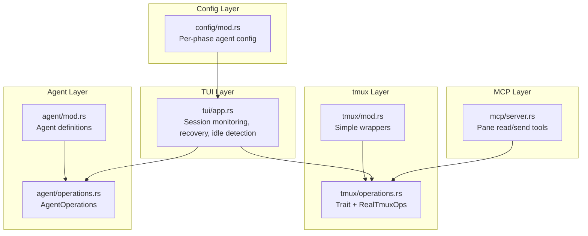
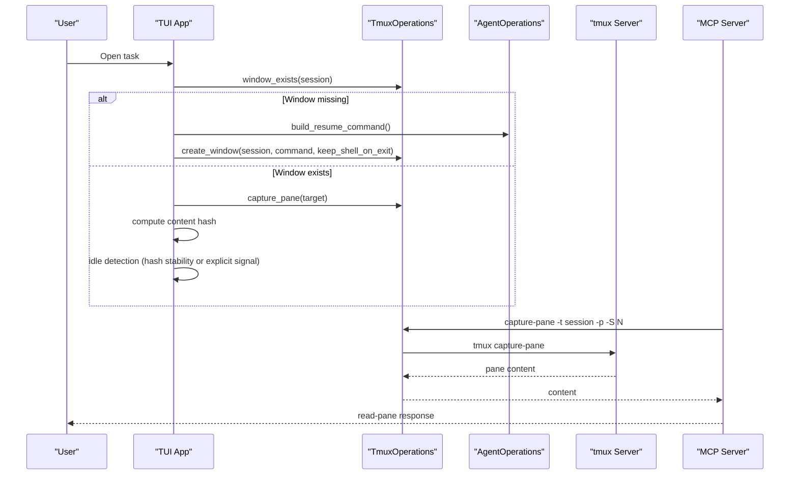
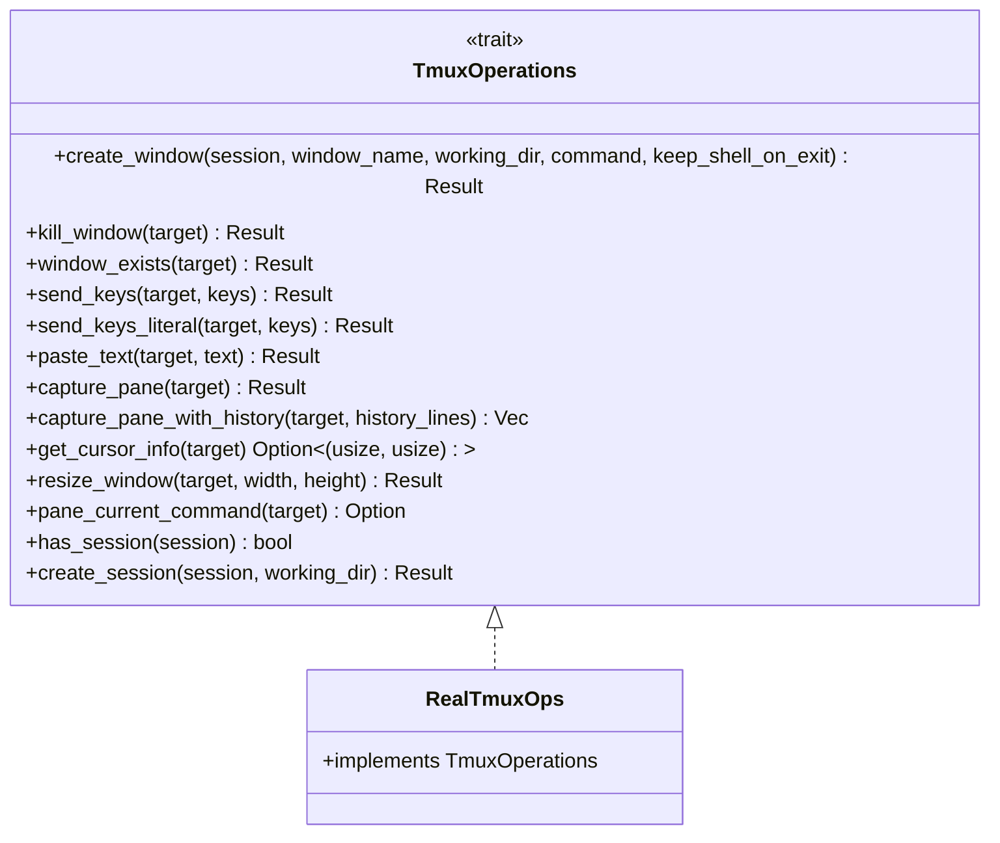
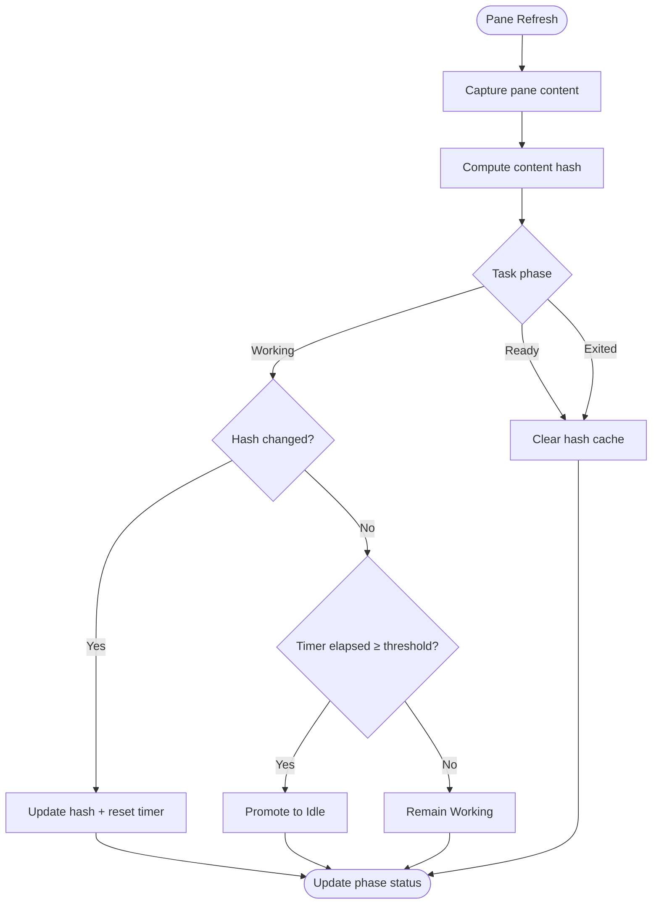
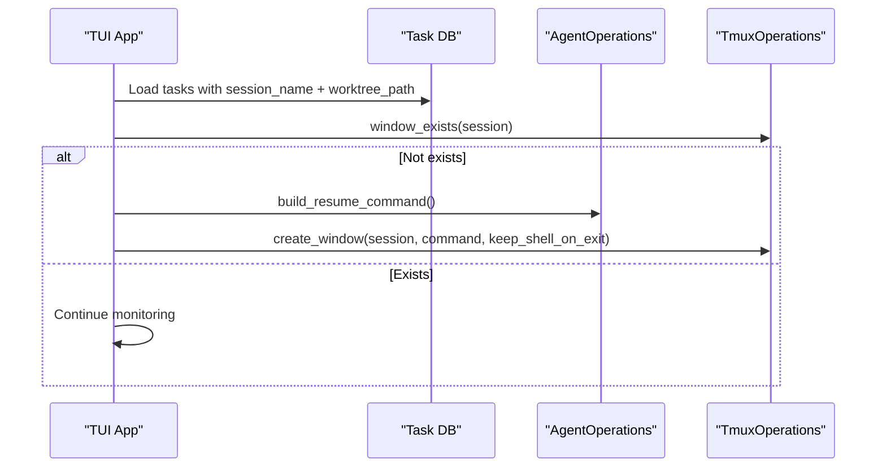
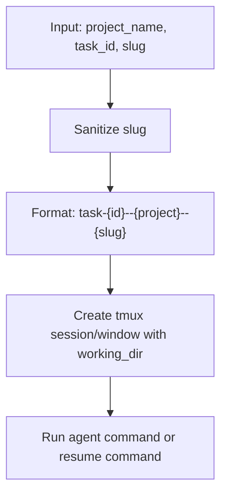
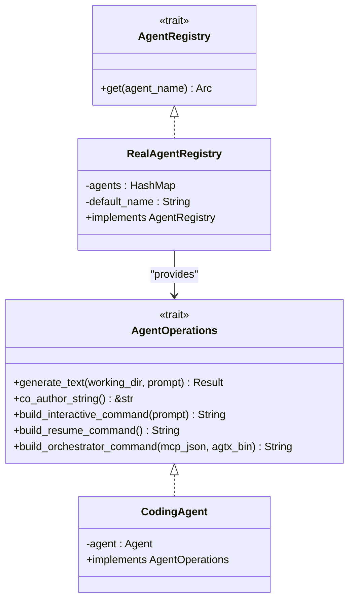
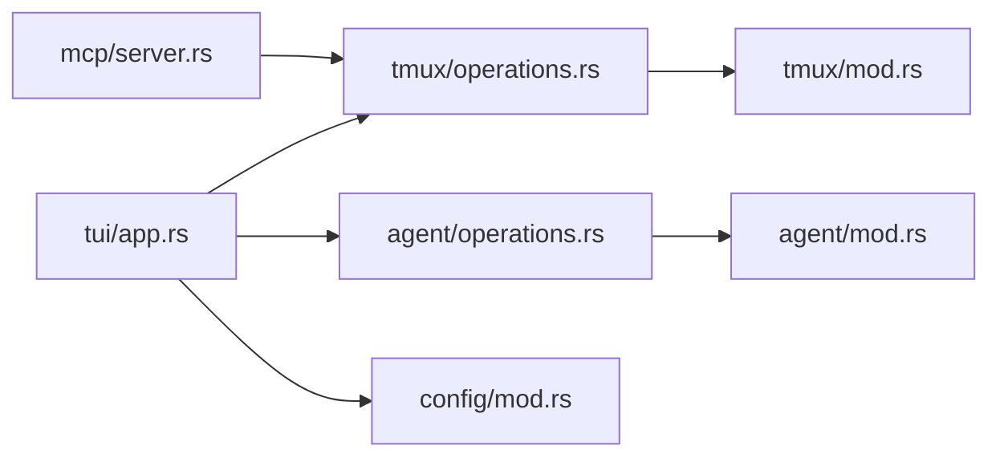

# Advanced tmux Integration

<cite>
**Referenced Files in This Document**
- [src/tmux/mod.rs](file://src/tmux/mod.rs)
- [src/tmux/operations.rs](file://src/tmux/operations.rs)
- [src/agent/mod.rs](file://src/agent/mod.rs)
- [src/agent/operations.rs](file://src/agent/operations.rs)
- [src/tui/app.rs](file://src/tui/app.rs)
- [src/mcp/server.rs](file://src/mcp/server.rs)
- [src/config/mod.rs](file://src/config/mod.rs)
- [src/lib.rs](file://src/lib.rs)
- [src/main.rs](file://src/main.rs)
</cite>

## Table of Contents
1. [Introduction](#introduction)
2. [Project Structure](#project-structure)
3. [Core Components](#core-components)
4. [Architecture Overview](#architecture-overview)
5. [Detailed Component Analysis](#detailed-component-analysis)
6. [Dependency Analysis](#dependency-analysis)
7. [Performance Considerations](#performance-considerations)
8. [Troubleshooting Guide](#troubleshooting-guide)
9. [Conclusion](#conclusion)
10. [Appendices](#appendices)

## Introduction
This document explains advanced tmux integration features in the AGTX system, focusing on sophisticated pane monitoring, idle detection, automatic session recovery, and coordinated agent operations. It covers the tmux command execution pipeline, session naming conventions, window and pane management, and integration with external tools such as the MCP server. Practical guidance is provided for debugging, custom pane layouts, and optimizing tmux configurations for reliable multi-agent workflows.

## Project Structure
The tmux integration spans several modules:
- tmux abstraction and operations
- agent orchestration and resume commands
- TUI-driven session monitoring and recovery
- MCP server integration for pane inspection and task control
- Configuration for per-phase agent selection and UI behavior

**Diagram sources**
- [src/tmux/mod.rs:1-189](file://src/tmux/mod.rs#L1-L189)
- [src/tmux/operations.rs:1-249](file://src/tmux/operations.rs#L1-L249)
- [src/agent/mod.rs:1-171](file://src/agent/mod.rs#L1-L171)
- [src/agent/operations.rs:1-163](file://src/agent/operations.rs#L1-L163)
- [src/tui/app.rs:1-200](file://src/tui/app.rs#L1-L200)
- [src/mcp/server.rs:1-200](file://src/mcp/server.rs#L1-L200)
- [src/config/mod.rs:1-595](file://src/config/mod.rs#L1-L595)

**Section sources**
- [src/lib.rs:1-24](file://src/lib.rs#L1-L24)
- [src/main.rs:16-96](file://src/main.rs#L16-L96)

## Core Components
- tmux server naming and session management: centralized under a dedicated server name for agent sessions.
- Window and pane operations: create windows, send keys, paste text, capture pane content, resize windows, and query pane metadata.
- Agent integration: resume commands, orchestrator command building, and per-agent CLI customization.
- TUI-driven monitoring: pane content hashing, idle detection, and automatic session recovery.
- MCP integration: read pane content and send messages to task panes.

**Section sources**
- [src/tmux/mod.rs:11-189](file://src/tmux/mod.rs#L11-L189)
- [src/tmux/operations.rs:8-249](file://src/tmux/operations.rs#L8-L249)
- [src/agent/mod.rs:36-77](file://src/agent/mod.rs#L36-L77)
- [src/agent/operations.rs:35-108](file://src/agent/operations.rs#L35-L108)
- [src/tui/app.rs:6514-6822](file://src/tui/app.rs#L6514-L6822)
- [src/mcp/server.rs:878-915](file://src/mcp/server.rs#L878-L915)

## Architecture Overview
The system uses a dedicated tmux server for agent sessions, with a trait-based abstraction for tmux operations to support testing and mocking. The TUI periodically captures pane content, computes a content hash, and applies idle detection heuristics. When tmux windows are missing (e.g., after a server restart), the TUI recovers tasks by recreating windows with agent resume commands.

**Diagram sources**
- [src/tui/app.rs:905-940](file://src/tui/app.rs#L905-L940)
- [src/tui/app.rs:6514-6822](file://src/tui/app.rs#L6514-L6822)
- [src/tmux/operations.rs:64-248](file://src/tmux/operations.rs#L64-L248)
- [src/agent/operations.rs:88-108](file://src/agent/operations.rs#L88-L108)
- [src/mcp/server.rs:878-915](file://src/mcp/server.rs#L878-L915)

## Detailed Component Analysis

### tmux Abstraction and Operations
The tmux layer provides both simple functions and a trait-based abstraction:
- Simple wrappers encapsulate tmux invocations with the dedicated server flag.
- The TmuxOperations trait defines a contract for window/pane/session operations, enabling mock implementations for tests.
- RealTmuxOps implements the trait using direct tmux commands, including:
  - Creating windows with optional commands and shell-on-exit behavior.
  - Capturing pane content with and without history.
  - Pasting text via load-buffer + paste-buffer for bracketed paste.
  - Resizing windows and querying pane metadata such as current command.
  - Managing sessions and existence checks.

**Diagram sources**
- [src/tmux/operations.rs:8-59](file://src/tmux/operations.rs#L8-L59)
- [src/tmux/operations.rs:61-248](file://src/tmux/operations.rs#L61-L248)

**Section sources**
- [src/tmux/mod.rs:11-189](file://src/tmux/mod.rs#L11-L189)
- [src/tmux/operations.rs:8-249](file://src/tmux/operations.rs#L8-L249)

### Pane Monitoring, Content Hash Tracking, and Idle Detection
The TUI implements robust pane monitoring:
- Periodic pane capture and content hashing to detect stability.
- Idle detection with two modes:
  - Explicit signal: content contains a specific marker indicating readiness.
  - Stability fallback: content unchanged for a configurable duration.
- State tracking for each task’s pane content hash and stable timestamps.
- Automatic clearing of hash entries on Ready/Exited transitions.

**Diagram sources**
- [src/tui/app.rs:6514-6822](file://src/tui/app.rs#L6514-L6822)

**Section sources**
- [src/tui/app.rs:6514-6822](file://src/tui/app.rs#L6514-L6822)

### Automatic Session Recovery Mechanisms
When tmux windows are missing (e.g., after a server restart), the TUI recovers tasks:
- Identify tasks with missing windows but valid worktree/session metadata.
- Build agent resume commands and recreate windows with appropriate shell behavior.
- Ensure project-level tmux sessions exist before creating task windows.

**Diagram sources**
- [src/tui/app.rs:905-940](file://src/tui/app.rs#L905-L940)
- [src/tui/app.rs:6842-6844](file://src/tui/app.rs#L6842-L6844)
- [src/agent/operations.rs:88-108](file://src/agent/operations.rs#L88-L108)

**Section sources**
- [src/tui/app.rs:905-940](file://src/tui/app.rs#L905-L940)
- [src/tui/app.rs:6842-6844](file://src/tui/app.rs#L6842-L6844)
- [src/agent/operations.rs:88-108](file://src/agent/operations.rs#L88-L108)

### tmux Command Execution Pipeline and Session Naming Conventions
- Dedicated tmux server name ensures agent sessions are isolated from user sessions.
- Session naming convention encodes task identity, project, and a sanitized slug for readability.
- Window naming follows project context; pane metadata queries help detect agent state.
- Safe session name sanitization prevents invalid characters and collapses separators.

**Diagram sources**
- [src/tmux/mod.rs:144-166](file://src/tmux/mod.rs#L144-L166)
- [src/db/models.rs:118](file://src/db/models.rs#L118)
- [src/db/models.rs:130](file://src/db/models.rs#L130)

**Section sources**
- [src/tmux/mod.rs:11-189](file://src/tmux/mod.rs#L11-L189)
- [src/db/models.rs:118](file://src/db/models.rs#L118)
- [src/db/models.rs:130](file://src/db/models.rs#L130)

### Integration with Agent Operations for Coordinated Task Execution
- Per-phase agent selection is configured globally and per-project.
- Agent registry resolves the appropriate agent for each phase and provides:
  - Interactive command construction
  - Resume command for recovery scenarios
  - Orchestrator command composition for MCP-aware agents
- The TUI uses these commands to create or recover tmux windows with the correct agent context.

**Diagram sources**
- [src/agent/operations.rs:16-163](file://src/agent/operations.rs#L16-L163)
- [src/agent/mod.rs:36-77](file://src/agent/mod.rs#L36-L77)
- [src/config/mod.rs:390-408](file://src/config/mod.rs#L390-L408)

**Section sources**
- [src/agent/operations.rs:16-163](file://src/agent/operations.rs#L16-L163)
- [src/agent/mod.rs:36-77](file://src/agent/mod.rs#L36-L77)
- [src/config/mod.rs:390-408](file://src/config/mod.rs#L390-L408)

### Advanced tmux Features: Window Resizing and Pane Splitting
- Window resizing is exposed via the tmux operation trait, allowing dynamic layout adjustments based on UI needs.
- Pane splitting and multi-agent workflows can be achieved by creating multiple windows or panes within a window, then assigning different agents to each pane.
- Custom tmux configurations should be tuned for AGTX performance, including:
  - Bracketed paste support for reliable text insertion
  - Sufficient scrollback buffer for pane capture
  - Minimal status line updates to reduce overhead

**Section sources**
- [src/tmux/operations.rs:48-53](file://src/tmux/operations.rs#L48-L53)
- [src/tmux/operations.rs:203-211](file://src/tmux/operations.rs#L203-L211)

### tmux Server Management, Session Persistence, and Connectivity
- The system uses a dedicated tmux server name to isolate agent sessions.
- Project-level sessions are ensured to exist before creating task windows.
- Recovery logic reconstructs missing windows using persisted task metadata and agent resume commands.
- For tmux connectivity issues:
  - Verify the dedicated server is running and accessible.
  - Confirm tmux version compatibility and required options for pane capture.
  - Check permissions and PATH resolution for agent binaries invoked from tmux.

**Section sources**
- [src/tmux/mod.rs:11-12](file://src/tmux/mod.rs#L11-L12)
- [src/tui/app.rs:6832-6840](file://src/tui/app.rs#L6832-L6840)
- [src/tui/app.rs:905-940](file://src/tui/app.rs#L905-L940)

### Integration with External tmux Tools (MCP Server)
- The MCP server exposes tools to read pane content and send messages to task panes.
- These tools leverage tmux capture-pane and send-keys to integrate with the AGTX workflow.
- This enables external automation and tooling to observe and influence agent activities.

**Section sources**
- [src/mcp/server.rs:878-915](file://src/mcp/server.rs#L878-L915)

## Dependency Analysis
The tmux integration relies on a layered design:
- The TUI depends on TmuxOperations and AgentOperations abstractions.
- TmuxOperations is implemented by RealTmuxOps, which executes tmux commands against the dedicated server.
- AgentOperations is implemented by CodingAgent, which builds agent-specific commands.
- Configuration influences which agent runs in which phase, guiding session creation and recovery.

**Diagram sources**
- [src/tui/app.rs:1-200](file://src/tui/app.rs#L1-L200)
- [src/tmux/operations.rs:61-248](file://src/tmux/operations.rs#L61-L248)
- [src/tmux/mod.rs:11-189](file://src/tmux/mod.rs#L11-L189)
- [src/agent/operations.rs:55-108](file://src/agent/operations.rs#L55-L108)
- [src/agent/mod.rs:36-77](file://src/agent/mod.rs#L36-L77)
- [src/config/mod.rs:390-408](file://src/config/mod.rs#L390-L408)
- [src/mcp/server.rs:878-915](file://src/mcp/server.rs#L878-L915)

**Section sources**
- [src/tui/app.rs:1-200](file://src/tui/app.rs#L1-L200)
- [src/tmux/operations.rs:61-248](file://src/tmux/operations.rs#L61-L248)
- [src/agent/operations.rs:55-108](file://src/agent/operations.rs#L55-L108)
- [src/config/mod.rs:390-408](file://src/config/mod.rs#L390-L408)

## Performance Considerations
- Minimize frequent pane captures by batching refresh cycles in the TUI.
- Use targeted pane capture with history limits to avoid excessive memory usage.
- Prefer explicit idle signals over long fallback timers to reduce latency in notifications.
- Ensure tmux server is configured with adequate resources for concurrent sessions and panes.

## Troubleshooting Guide
Common issues and resolutions:
- tmux new-session fails: verify tmux installation, server accessibility, and working directory permissions.
- Pane capture returns empty: confirm pane exists, has sufficient scrollback, and is not obscured.
- Agent not resuming: check agent availability and resume command correctness; ensure worktree path is valid.
- Idle detection not triggering: ensure content includes the explicit idle marker or stabilize for the fallback duration.
- MCP read-pane errors: validate session name format and tmux capture-pane options.

**Section sources**
- [src/tmux/mod.rs:42-47](file://src/tmux/mod.rs#L42-L47)
- [src/mcp/server.rs:896-910](file://src/mcp/server.rs#L896-L910)

## Conclusion
AGTX’s tmux integration provides a robust foundation for multi-agent workflows through:
- Isolated tmux server management
- Precise window and pane operations
- Intelligent pane monitoring and idle detection
- Automatic session recovery leveraging agent resume commands
- Seamless integration with external tools like the MCP server

These capabilities enable scalable, resilient, and observable agent-driven development sessions.

## Appendices

### Practical Examples
- Debugging tmux sessions: use the dedicated server name to list sessions and inspect activity.
- Custom pane layouts: create multiple windows or panes and assign different agents per pane; use resize operations to fit content.
- Integration with external tools: leverage MCP tools to read pane content and send messages to task panes.

**Section sources**
- [src/tmux/mod.rs:50-84](file://src/tmux/mod.rs#L50-L84)
- [src/mcp/server.rs:878-915](file://src/mcp/server.rs#L878-L915)