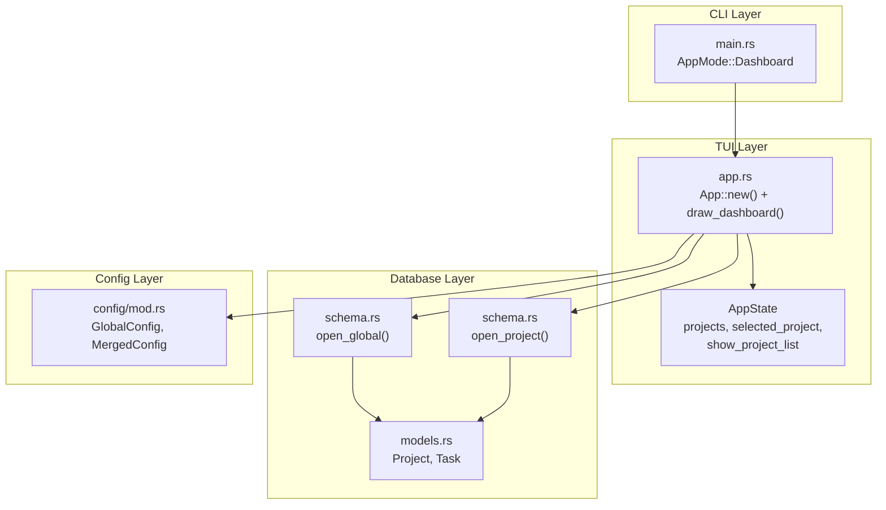
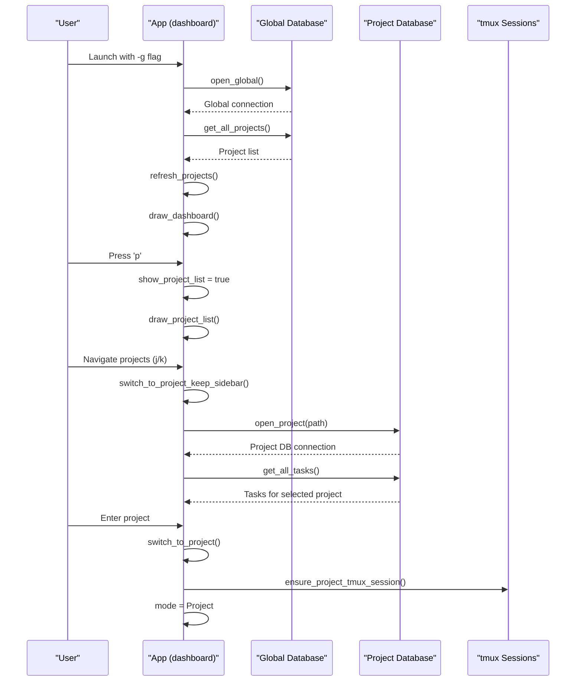
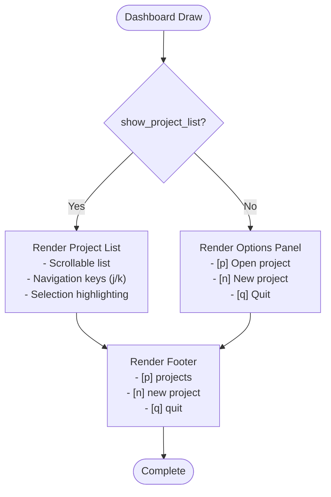
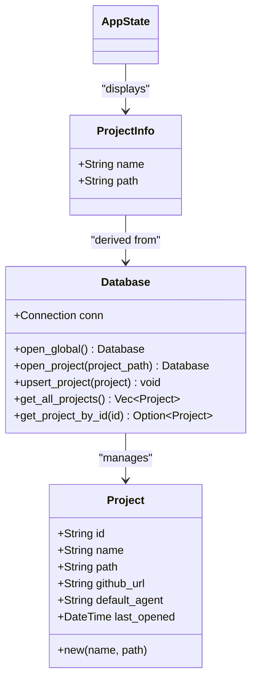
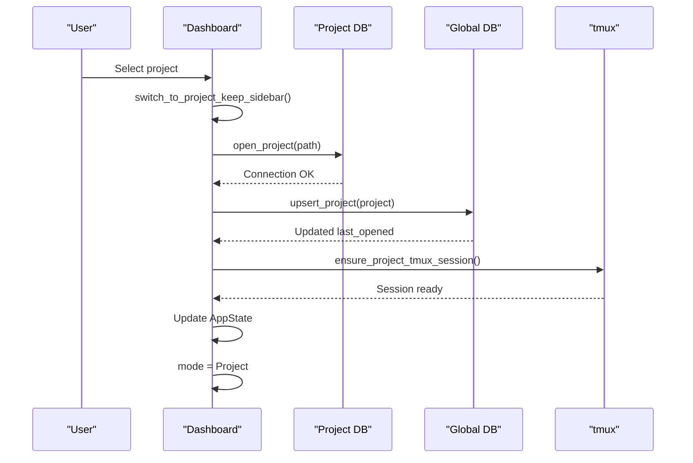
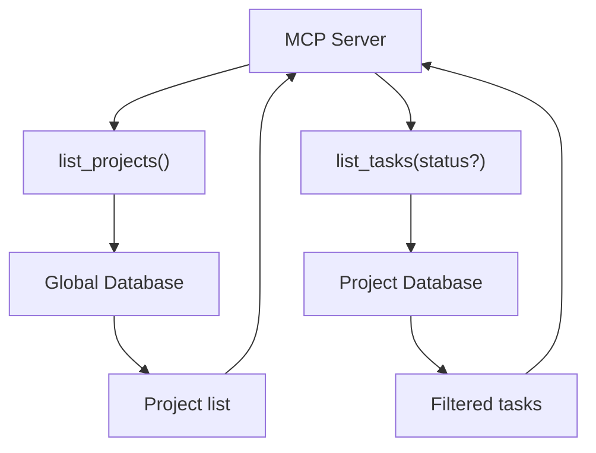
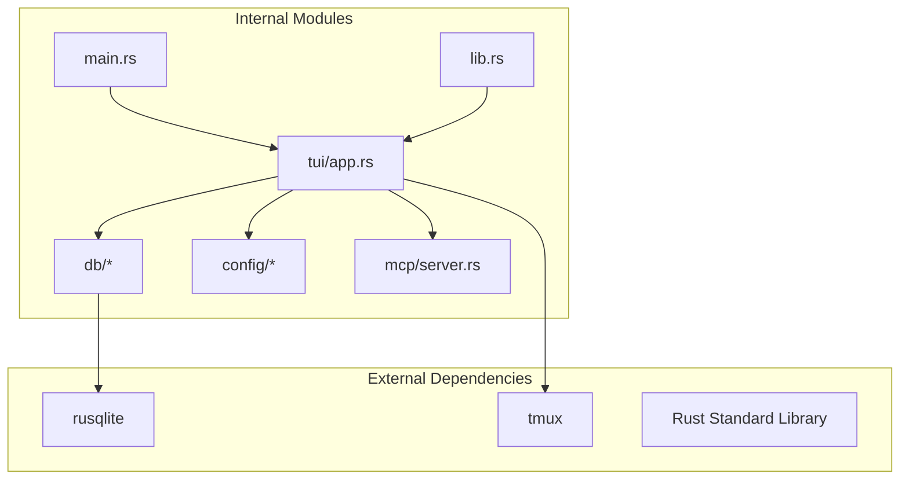

# Dashboard Mode

<cite>
**Referenced Files in This Document**
- [main.rs](file://src/main.rs)
- [lib.rs](file://src/lib.rs)
- [app.rs](file://src/tui/app.rs)
- [models.rs](file://src/db/models.rs)
- [schema.rs](file://src/db/schema.rs)
- [mod.rs](file://src/db/mod.rs)
- [mod.rs](file://src/config/mod.rs)
- [server.rs](file://src/mcp/server.rs)
</cite>

## Table of Contents
1. [Introduction](#introduction)
2. [Project Structure](#project-structure)
3. [Core Components](#core-components)
4. [Architecture Overview](#architecture-overview)
5. [Detailed Component Analysis](#detailed-component-analysis)
6. [Dependency Analysis](#dependency-analysis)
7. [Performance Considerations](#performance-considerations)
8. [Troubleshooting Guide](#troubleshooting-guide)
9. [Conclusion](#conclusion)

## Introduction
Dashboard Mode provides a unified, multi-project management interface that consolidates tasks across all tracked projects into a single view. It enables seamless navigation between workspaces, project discovery, and consolidated task filtering. The dashboard aggregates project metadata from a global index database and presents a streamlined project list with quick-switch capabilities. Users can filter tasks globally across projects and seamlessly transition into individual project contexts for detailed work.

## Project Structure
Dashboard Mode is implemented within the TUI application framework and leverages a dual-database architecture:
- Global index database: Tracks project metadata and relationships
- Project-specific databases: Store task data per project
- Configuration system: Manages theme, agents, and workflow plugins
- MCP integration: Provides global task listing and project discovery for external clients

**Diagram sources**
- [main.rs:47](file://src/main.rs#L47)
- [app.rs:749](file://src/tui/app.rs#L749)
- [schema.rs:51](file://src/db/schema.rs#L51)
- [schema.rs:14](file://src/db/schema.rs#L14)
- [models.rs](file://src/db/models.rs#L136)

**Section sources**
- [main.rs:47](file://src/main.rs#L47)
- [app.rs:749](file://src/tui/app.rs#L749)
- [schema.rs:51](file://src/db/schema.rs#L51)
- [schema.rs:14](file://src/db/schema.rs#L14)

## Core Components
Dashboard Mode consists of several interconnected components that work together to provide a cohesive multi-project experience:

### AppMode and CLI Integration
The application determines mode based on command-line arguments and current directory context. Dashboard mode is explicitly selected with the `-g` flag or when no git repository is detected in the current directory.

### AppState and Project Management
The AppState maintains project discovery state, including:
- `projects`: Vector of ProjectInfo structs containing project name and path
- `selected_project`: Index of currently selected project
- `show_project_list`: Boolean flag controlling project list visibility
- `sidebar_visible`: Controls sidebar presence in dashboard mode

### Database Architecture
Two distinct database instances operate concurrently:
- Global database: Stores project metadata and running agent sessions
- Project database: Contains task data for individual projects

**Section sources**
- [lib.rs:12](file://src/lib.rs#L12)
- [app.rs:448](file://src/tui/app.rs#L448)
- [app.rs:481](file://src/tui/app.rs#L481)
- [schema.rs:51](file://src/db/schema.rs#L51)
- [schema.rs:14](file://src/db/schema.rs#L14)

## Architecture Overview
Dashboard Mode implements a hybrid rendering approach with separate UI flows for dashboard and project contexts:

**Diagram sources**
- [main.rs:47](file://src/main.rs#L47)
- [app.rs:6218](file://src/tui/app.rs#L6218)
- [app.rs:6699](file://src/tui/app.rs#L6699)
- [app.rs:2635](file://src/tui/app.rs#L2635)

The architecture supports seamless transitions between dashboard and project modes while maintaining state consistency across multiple project databases.

## Detailed Component Analysis

### Dashboard Rendering Engine
The dashboard employs a three-section layout with ASCII art branding, project selection interface, and footer controls:

**Diagram sources**
- [app.rs:2635](file://src/tui/app.rs#L2635)
- [app.rs:2685](file://src/tui/app.rs#L2685)

### Project Discovery and Management
Project discovery operates through the global database, which tracks all previously opened projects with timestamps:

**Diagram sources**
- [models.rs:136](file://src/db/models.rs#L136)
- [schema.rs:404](file://src/db/schema.rs#L404)
- [app.rs:672](file://src/tui/app.rs#L672)

### Project Switching Workflow
The project switching mechanism ensures smooth transitions between work contexts:

**Diagram sources**
- [app.rs:6708](file://src/tui/app.rs#L6708)
- [app.rs:6723](file://src/tui/app.rs#L6723)
- [app.rs:6732](file://src/tui/app.rs#L6732)

### Task Filtering Across Multiple Databases
Dashboard Mode provides two primary filtering approaches:

#### Global Task Aggregation
The MCP server enables cross-project task queries through the global database:

**Diagram sources**
- [server.rs:525](file://src/mcp/server.rs#L525)
- [server.rs:548](file://src/mcp/server.rs#L548)

#### Local Task Filtering Within Projects
Within project mode, the application filters tasks by status and displays them in Kanban columns with dependency awareness.

**Section sources**
- [app.rs:2635](file://src/tui/app.rs#L2635)
- [app.rs:6699](file://src/tui/app.rs#L6699)
- [server.rs:525](file://src/mcp/server.rs#L525)
- [server.rs:548](file://src/mcp/server.rs#L548)

### Dashboard-Specific UI Elements
The dashboard interface includes specialized elements for multi-project management:

#### Project List Interface
- Scrollable project list with navigation keys (j/k)
- Visual indicators for current project
- Keyboard shortcuts for quick actions
- Responsive layout adapting to terminal size

#### Options Panel
- Project creation from current directory
- Existing project opening
- Quit application

#### Footer Controls
- Consistent keyboard navigation
- Quick access to project management
- Status indicators for application state

**Section sources**
- [app.rs:2685](file://src/tui/app.rs#L2685)
- [app.rs:2709](file://src/tui/app.rs#L2709)
- [app.rs:2722](file://src/tui/app.rs#L2722)

## Dependency Analysis
Dashboard Mode exhibits well-defined dependencies between components:

**Diagram sources**
- [main.rs:1](file://src/main.rs#L1)
- [app.rs:20](file://src/tui/app.rs#L20)
- [schema.rs:2](file://src/db/schema.rs#L2)

The dependency structure maintains clear separation of concerns:
- Main module handles CLI parsing and mode selection
- TUI module manages rendering and user interaction
- Database module provides persistence abstraction
- Config module handles application settings
- MCP module enables external integrations

**Section sources**
- [main.rs:1](file://src/main.rs#L1)
- [app.rs:20](file://src/tui/app.rs#L20)
- [schema.rs:2](file://src/db/schema.rs#L2)

## Performance Considerations
Dashboard Mode implements several optimizations for managing multiple concurrent projects:

### Database Connection Management
- Separate database connections for global and project contexts
- Lazy loading of project databases on demand
- Efficient indexing on project path and task status

### Memory Optimization
- Project list caching to avoid repeated database queries
- Incremental task loading for active projects
- State consolidation to minimize memory footprint

### Rendering Efficiency
- Conditional rendering based on state changes
- Minimal redraw operations
- Optimized layout calculations

### Concurrency Patterns
- Non-blocking background operations for task refresh
- Asynchronous database operations
- Event-driven UI updates

**Section sources**
- [schema.rs:51](file://src/db/schema.rs#L51)
- [schema.rs:14](file://src/db/schema.rs#L14)
- [app.rs:1190](file://src/tui/app.rs#L1190)

## Troubleshooting Guide
Common issues and solutions when using Dashboard Mode:

### Project Not Appearing in Dashboard
**Symptoms**: Project missing from project list
**Causes**: 
- Project path no longer exists
- Database corruption
- Permission issues

**Solutions**:
- Verify project directory accessibility
- Check global database integrity
- Re-add project through normal project mode

### Slow Project Switching
**Symptoms**: Delayed transitions between projects
**Causes**:
- Large project databases
- Network-mounted project directories
- tmux session initialization delays

**Solutions**:
- Optimize project database size
- Move projects to local storage
- Verify tmux server responsiveness

### Task Filtering Issues
**Symptoms**: Incorrect task filtering results
**Causes**:
- Database query errors
- Cache inconsistencies
- Plugin configuration conflicts

**Solutions**:
- Clear application cache
- Rebuild database indices
- Validate plugin configurations

**Section sources**
- [app.rs:6711](file://src/tui/app.rs#L6711)
- [schema.rs:404](file://src/db/schema.rs#L404)

## Conclusion
Dashboard Mode provides a comprehensive solution for multi-project management by combining efficient database architecture with intuitive user interface design. The dual-database approach ensures scalability while maintaining responsive user interactions. Key strengths include seamless project switching, consolidated task management, and robust state consistency across multiple project contexts. The implementation demonstrates careful consideration of performance, usability, and extensibility, making it suitable for developers managing numerous concurrent projects.