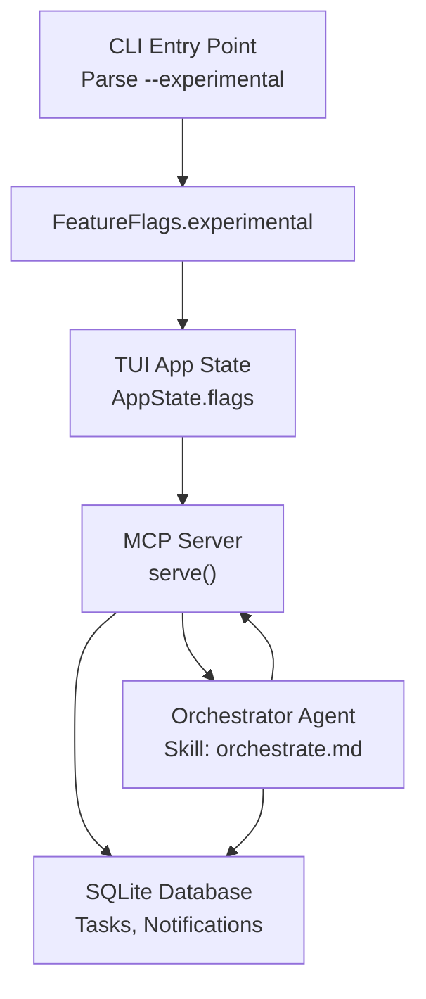
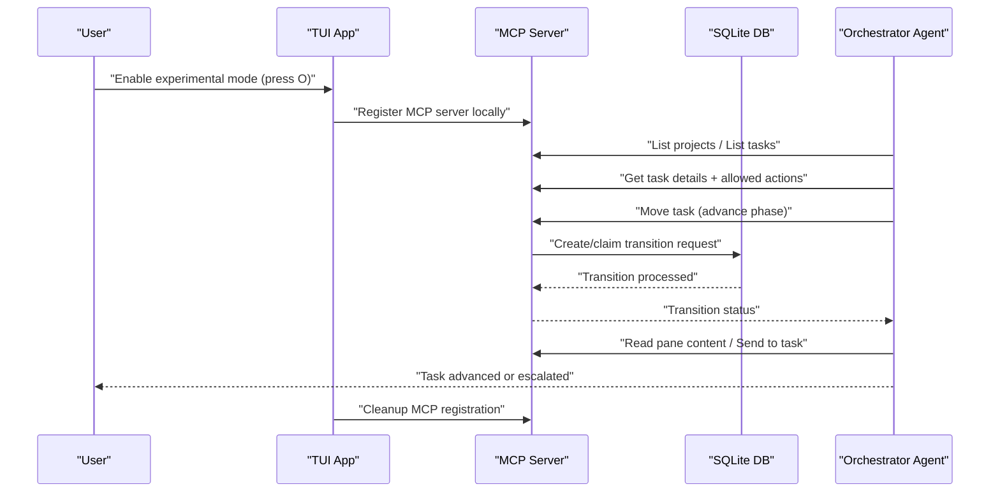
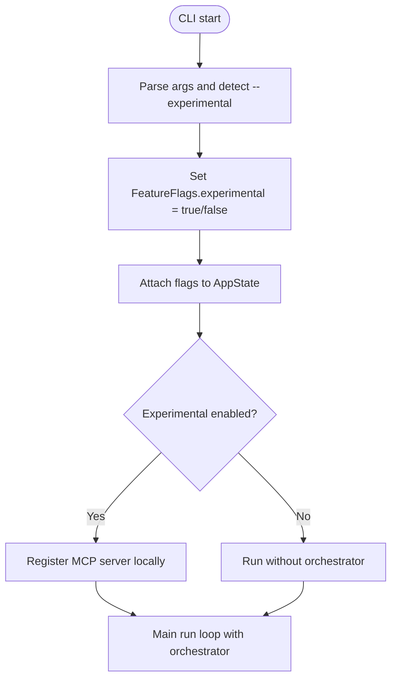
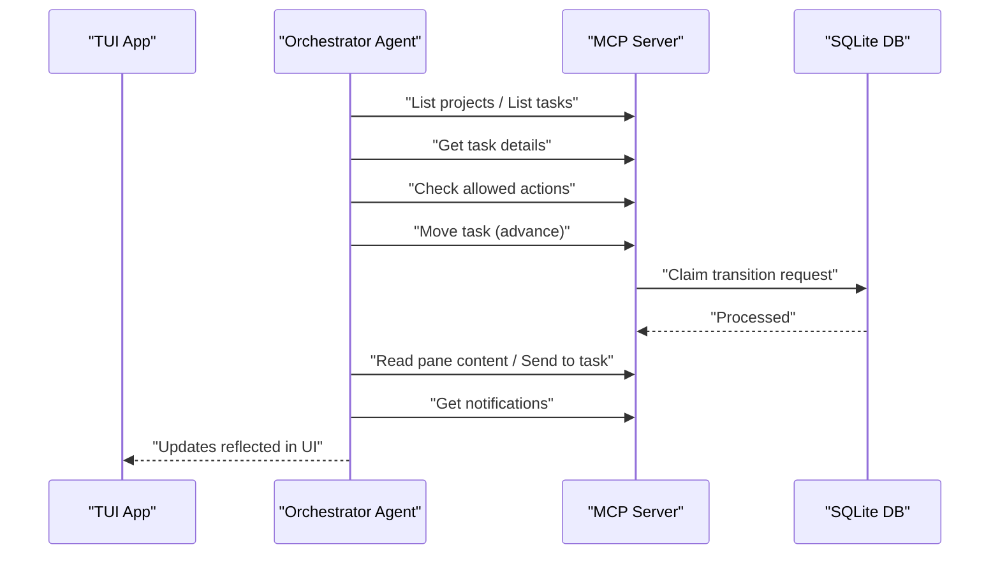
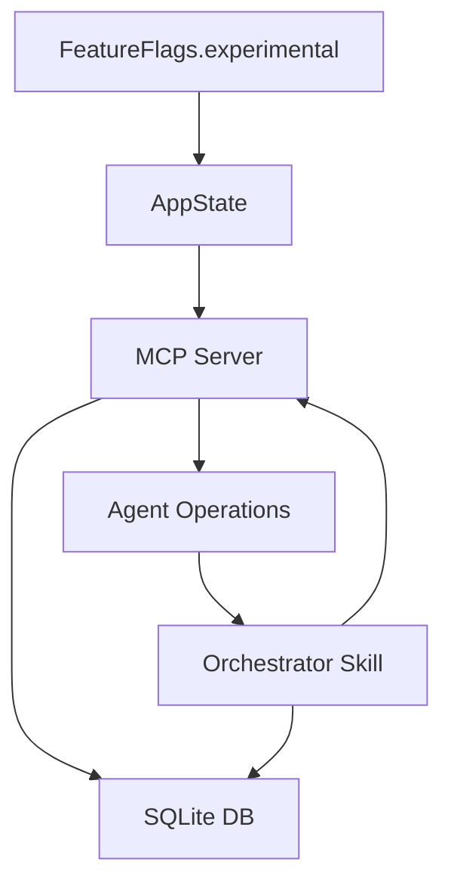

# Experimental Mode

<cite>
**Referenced Files in This Document**
- [lib.rs](file://src/lib.rs)
- [main.rs](file://src/main.rs)
- [app.rs](file://src/tui/app.rs)
- [config/mod.rs](file://src/config/mod.rs)
- [README.md](file://README.md)
- [plugin.toml](file://plugins/agtx/plugin.toml)
- [orchestrate.md](file://plugins/agtx/skills/orchestrate.md)
- [server.rs](file://src/mcp/server.rs)
- [models.rs](file://src/db/models.rs)
- [schema.rs](file://src/db/schema.rs)
- [agent/operations.rs](file://src/agent/operations.rs)
- [db_tests.rs](file://tests/db_tests.rs)
- [agent_tests.rs](file://tests/agent_tests.rs)
</cite>

## Table of Contents
1. [Introduction](#introduction)
2. [Project Structure](#project-structure)
3. [Core Components](#core-components)
4. [Architecture Overview](#architecture-overview)
5. [Detailed Component Analysis](#detailed-component-analysis)
6. [Dependency Analysis](#dependency-analysis)
7. [Performance Considerations](#performance-considerations)
8. [Troubleshooting Guide](#troubleshooting-guide)
9. [Conclusion](#conclusion)
10. [Appendices](#appendices)

## Introduction
This document explains experimental mode in the application, focusing on the orchestrator agent and related advanced automation features. It details how the feature flag is parsed and propagated, how the orchestrator integrates with the Model Context Protocol (MCP), and how it interacts with the task lifecycle and database. It also provides safety considerations, risk mitigation strategies, configuration options, stability implications, and operational guidance for enabling, testing, and disabling experimental features.

## Project Structure
Experimental mode is controlled by a single command-line flag and is integrated across the CLI entry point, TUI application state, MCP server, and orchestrator skill pipeline. The orchestrator relies on the MCP server to expose board tools and uses the database to track task transitions and notifications.

**Diagram sources**
- [main.rs:21-22](file://src/main.rs#L21-L22)
- [lib.rs:20-23](file://src/lib.rs#L20-L23)
- [app.rs:448-451](file://src/tui/app.rs#L448-L451)
- [server.rs:409-436](file://src/mcp/server.rs#L409-L436)
- [models.rs:214-231](file://src/db/models.rs#L214-L231)
- [orchestrate.md:39-75](file://plugins/agtx/skills/orchestrate.md#L39-L75)

**Section sources**
- [main.rs:16-96](file://src/main.rs#L16-L96)
- [lib.rs:18-23](file://src/lib.rs#L18-L23)
- [app.rs:448-451](file://src/tui/app.rs#L448-L451)
- [README.md:604-646](file://README.md#L604-L646)

## Core Components
- Feature flag parsing: The CLI extracts the --experimental flag from any position in the argument vector and constructs FeatureFlags.
- Application state propagation: FeatureFlags is stored in AppState and influences orchestrator registration and behavior.
- MCP server: Provides board tools (list_tasks, get_task, move_task, get_notifications, etc.) used by the orchestrator.
- Orchestrator skill: Implements the orchestrator agent's logic for task advancement and escalation.
- Database: Stores tasks, transition requests, and notifications used by the orchestrator.

**Section sources**
- [main.rs:21-22](file://src/main.rs#L21-L22)
- [lib.rs:20-23](file://src/lib.rs#L20-L23)
- [app.rs:448-451](file://src/tui/app.rs#L448-L451)
- [server.rs:409-436](file://src/mcp/server.rs#L409-L436)
- [orchestrate.md:39-75](file://plugins/agtx/skills/orchestrate.md#L39-L75)
- [models.rs:214-231](file://src/db/models.rs#L214-L231)

## Architecture Overview
The orchestrator agent operates by registering the MCP server locally, listening for idle notifications, and invoking board tools to advance tasks. The TUI coordinates agent sessions, tmux windows, and database updates.

**Diagram sources**
- [README.md:604-646](file://README.md#L604-L646)
- [server.rs:409-436](file://src/mcp/server.rs#L409-L436)
- [models.rs:214-231](file://src/db/models.rs#L214-L231)
- [app.rs:6774-6822](file://src/tui/app.rs#L6774-L6822)

## Detailed Component Analysis

### Feature Flag System
- CLI parsing: The --experimental flag is detected anywhere in the argument vector and passed to the application as FeatureFlags.experimental.
- Propagation: FeatureFlags is attached to AppState and influences orchestrator registration and behavior.
- Current usage: The orchestrator agent is gated behind the experimental flag and uses MCP to communicate with the board.

**Diagram sources**
- [main.rs:21-22](file://src/main.rs#L21-L22)
- [lib.rs:20-23](file://src/lib.rs#L20-L23)
- [app.rs:448-451](file://src/tui/app.rs#L448-L451)

**Section sources**
- [main.rs:21-22](file://src/main.rs#L21-L22)
- [lib.rs:20-23](file://src/lib.rs#L20-L23)
- [app.rs:448-451](file://src/tui/app.rs#L448-L451)

### Orchestrator Agent Integration
- MCP registration: The orchestrator registers the MCP server locally using agent-specific commands and cleans up upon exit.
- Idle detection: The orchestrator determines readiness by detecting an explicit idle signal or a fallback timer.
- Task advancement: The orchestrator queries allowed actions, advances tasks, and escalates when human intervention is required.

**Diagram sources**
- [agent/operations.rs:92-107](file://src/agent/operations.rs#L92-L107)
- [app.rs:6774-6822](file://src/tui/app.rs#L6774-L6822)
- [server.rs:409-436](file://src/mcp/server.rs#L409-L436)
- [models.rs:214-231](file://src/db/models.rs#L214-L231)

**Section sources**
- [agent/operations.rs:92-107](file://src/agent/operations.rs#L92-L107)
- [app.rs:6774-6822](file://src/tui/app.rs#L6774-L6822)
- [server.rs:409-436](file://src/mcp/server.rs#L409-L436)
- [models.rs:214-231](file://src/db/models.rs#L214-L231)

### Configuration Options in Experimental Mode
- Global configuration: Stored in ~/.config/agtx/config.toml; includes theme, worktree settings, and agent overrides.
- Project configuration: Stored in .agtx/config.toml; includes base branch, worktree directory, copy files/scripts, and workflow plugin.
- Plugin configuration: Defines commands, prompts, artifacts, and copy-back behavior used by the orchestrator.
- Feature flag: Controls whether the orchestrator is enabled; no additional experimental toggles are exposed in code.

**Section sources**
- [config/mod.rs:6-38](file://src/config/mod.rs#L6-L38)
- [config/mod.rs:160-189](file://src/config/mod.rs#L160-L189)
- [config/mod.rs:199-228](file://src/config/mod.rs#L199-L228)
- [config/mod.rs:410-451](file://src/config/mod.rs#L410-L451)
- [plugin.toml:1-16](file://plugins/agtx/plugin.toml#L1-L16)

### Safety Considerations and Risk Mitigation
- Controlled activation: Experimental features are behind a single flag and do not alter persistent state until explicitly invoked.
- Idempotent registration: The orchestrator removes stale MCP registrations before adding new ones to avoid conflicts.
- Atomic operations: Transition requests are claimed atomically to prevent race conditions and ensure deterministic state progression.
- Escalation mechanism: When stuck tasks are detected, the orchestrator escalates to the user with a reason, preventing blind automation.
- Cleanup: MCP registration is removed when the orchestrator stops, minimizing lingering side effects.

**Section sources**
- [agent/operations.rs:92-107](file://src/agent/operations.rs#L92-L107)
- [tests/db_tests.rs:394-475](file://tests/db_tests.rs#L394-L475)
- [app.rs:6774-6822](file://src/tui/app.rs#L6774-L6822)

### Stability Implications
- Experimental designation: The orchestrator is labeled experimental in the documentation and is gated by the --experimental flag.
- Backward compatibility: Global and project configuration schemas remain stable; experimental features do not modify these structures.
- Deterministic behavior: The orchestrator respects allowed actions and phase gating, reducing unintended state changes.

**Section sources**
- [README.md:604-622](file://README.md#L604-L622)
- [config/mod.rs:6-38](file://src/config/mod.rs#L6-L38)
- [config/mod.rs:199-228](file://src/config/mod.rs#L199-L228)

### Testing Guidance and Rollback Procedures
- Testing in development: Enable experimental mode with --experimental and use the orchestrator to advance tasks. Monitor logs and tmux panes for behavior.
- Safe disabling: Press the orchestrator toggle in the UI to stop the orchestrator; the MCP registration is cleaned up automatically.
- Data persistence: Tasks and notifications persist in the database; stopping the orchestrator does not erase data.
- Rollback: If issues arise, disable experimental mode, revert to manual triage, and inspect the database for any in-flight transition requests.

**Section sources**
- [README.md:87-89](file://README.md#L87-L89)
- [README.md:604-646](file://README.md#L604-L646)
- [app.rs:6774-6822](file://src/tui/app.rs#L6774-L6822)

## Dependency Analysis
The orchestrator depends on the MCP server and database for task state and tool execution. The TUI coordinates agent sessions and tmux windows. The orchestrator skill defines the automation logic.

**Diagram sources**
- [lib.rs:20-23](file://src/lib.rs#L20-L23)
- [app.rs:448-451](file://src/tui/app.rs#L448-L451)
- [server.rs:409-436](file://src/mcp/server.rs#L409-L436)
- [models.rs:214-231](file://src/db/models.rs#L214-L231)
- [agent/operations.rs:92-107](file://src/agent/operations.rs#L92-L107)

**Section sources**
- [lib.rs:20-23](file://src/lib.rs#L20-L23)
- [app.rs:448-451](file://src/tui/app.rs#L448-L451)
- [server.rs:409-436](file://src/mcp/server.rs#L409-L436)
- [models.rs:214-231](file://src/db/models.rs#L214-L231)
- [agent/operations.rs:92-107](file://src/agent/operations.rs#L92-L107)

## Performance Considerations
- Idle detection: The orchestrator uses an explicit idle signal and a fallback timer to avoid excessive polling.
- Background refresh: The TUI periodically refreshes session status to minimize UI staleness.
- Concurrency: Transition claiming is atomic under concurrent consumers to prevent duplicate processing.

**Section sources**
- [app.rs:6774-6822](file://src/tui/app.rs#L6774-L6822)
- [tests/db_tests.rs:426-475](file://tests/db_tests.rs#L426-L475)

## Troubleshooting Guide
- Orchestrator not advancing tasks: Verify MCP registration and that the agent has idle signals. Check allowed actions and phase gating.
- Stuck tasks: The orchestrator escalates with a reason; inspect the tmux pane content and address prompts or errors.
- Race conditions: Ensure atomic transition claiming; verify that only one claimant succeeds.
- Cleanup failures: Confirm that MCP registration is removed and tmux windows are killed.

**Section sources**
- [app.rs:6774-6822](file://src/tui/app.rs#L6774-L6822)
- [tests/db_tests.rs:394-475](file://tests/db_tests.rs#L394-L475)
- [agent_tests.rs:159-166](file://tests/agent_tests.rs#L159-L166)

## Conclusion
Experimental mode in this application centers on the orchestrator agent, which leverages MCP to automate task advancement while maintaining safety through explicit idle detection, escalation, and atomic state transitions. The --experimental flag provides a controlled way to enable these features, and the TUI, MCP server, and database work together to ensure predictable behavior. For best results, use experimental mode in development, monitor logs and tmux panes, and disable the feature when issues arise.

## Appendices
- Configuration reference: Global and project config schemas, plugin definitions, and agent overrides.
- MCP tools: list_projects, list_tasks, get_task, move_task, get_transition_status, check_conflicts, get_notifications, read_pane_content, send_to_task.
- Orchestrator skill: Defines lifecycle, strategy, and escalation rules.

**Section sources**
- [config/mod.rs:6-38](file://src/config/mod.rs#L6-L38)
- [config/mod.rs:160-189](file://src/config/mod.rs#L160-L189)
- [config/mod.rs:199-228](file://src/config/mod.rs#L199-L228)
- [config/mod.rs:410-451](file://src/config/mod.rs#L410-L451)
- [README.md:586-603](file://README.md#L586-L603)
- [orchestrate.md:39-190](file://plugins/agtx/skills/orchestrate.md#L39-L190)