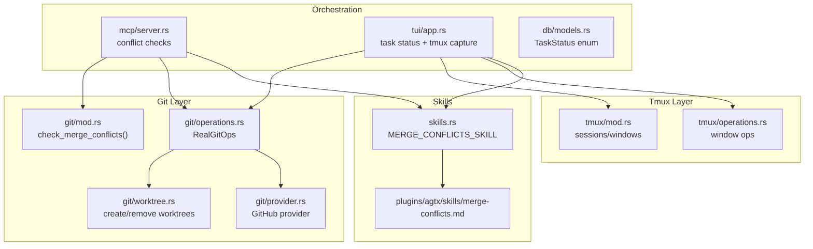
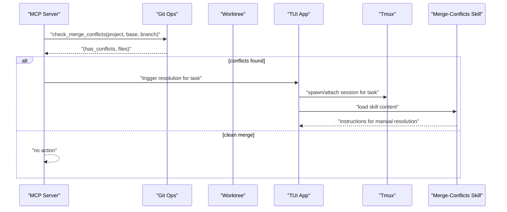
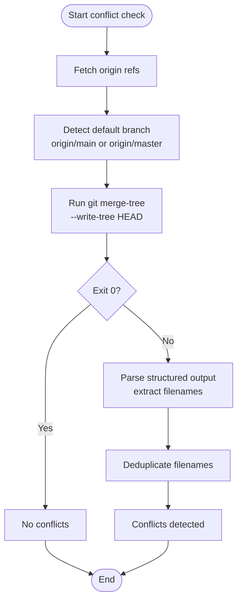
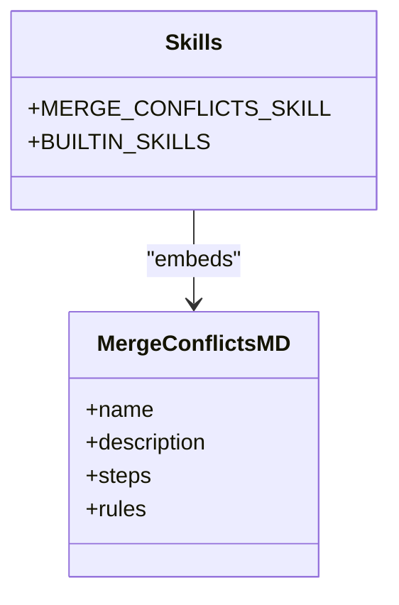
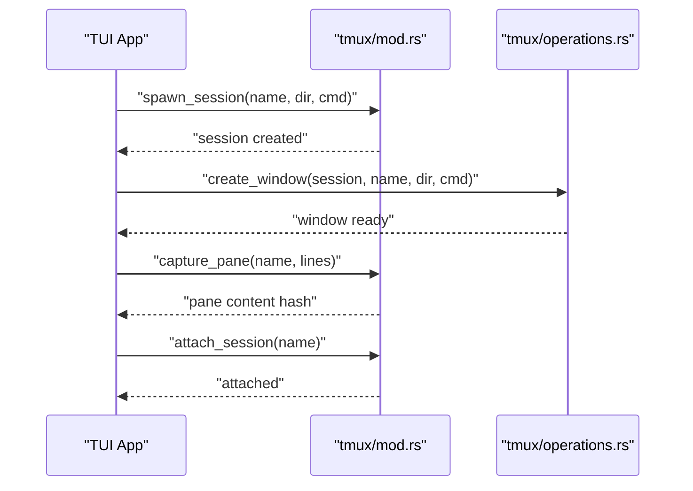
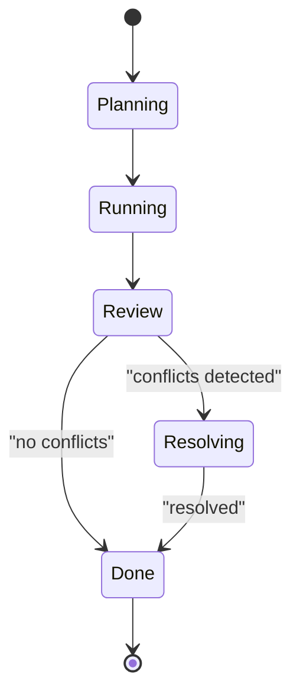
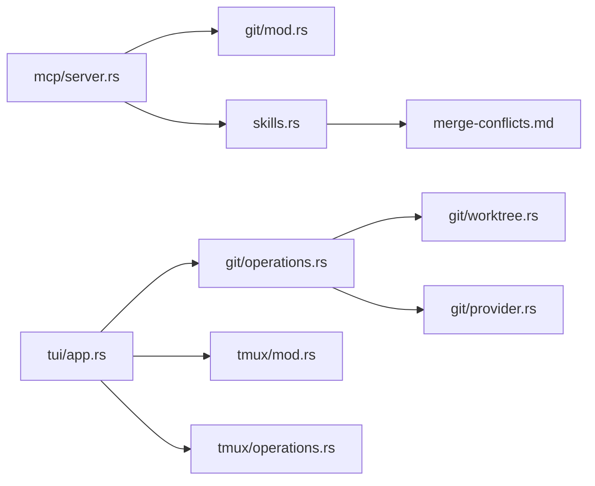

# Merge Conflict Resolution

<cite>
**Referenced Files in This Document**
- [merge-conflicts.md](file://plugins/agtx/skills/merge-conflicts.md)
- [mod.rs (git)](file://src/git/mod.rs)
- [operations.rs (git)](file://src/git/operations.rs)
- [worktree.rs (git)](file://src/git/worktree.rs)
- [provider.rs (git)](file://src/git/provider.rs)
- [mod.rs (tmux)](file://src/tmux/mod.rs)
- [operations.rs (tmux)](file://src/tmux/operations.rs)
- [skills.rs](file://src/skills.rs)
- [server.rs (mcp)](file://src/mcp/server.rs)
- [app.rs (tui)](file://src/tui/app.rs)
- [models.rs (db)](file://src/db/models.rs)
- [README.md](file://README.md)
- [CLAUDE.md](file://CLAUDE.md)
</cite>

## Table of Contents
1. [Introduction](#introduction)
2. [Project Structure](#project-structure)
3. [Core Components](#core-components)
4. [Architecture Overview](#architecture-overview)
5. [Detailed Component Analysis](#detailed-component-analysis)
6. [Dependency Analysis](#dependency-analysis)
7. [Performance Considerations](#performance-considerations)
8. [Troubleshooting Guide](#troubleshooting-guide)
9. [Conclusion](#conclusion)

## Introduction
This document describes the automated merge conflict detection and resolution system. It explains the non-destructive virtual merge approach that analyzes git conflicts without modifying working files, the conflict detection algorithm, the guard system preventing duplicate conflict checks, and the merge-conflicts skill that transforms detected conflicts into actionable tasks. It also covers integration with tmux sessions for conflict visualization, the relationship between conflict detection and task status updates, practical examples, and performance optimization for large repositories.

## Project Structure
The merge conflict system spans several modules:
- Git operations: virtual merge, worktree management, and provider abstractions
- Tmux integration: session management and pane capture for visualization
- Skills: the merge-conflicts skill definition embedded at compile time
- MCP/TUI: orchestration of conflict checks and task status updates
- Database models: task status used to drive automation

**Diagram sources**
- [mod.rs (git):89-128](file://src/git/mod.rs#L89-L128)
- [operations.rs (git):57-243](file://src/git/operations.rs#L57-L243)
- [worktree.rs (git):8-65](file://src/git/worktree.rs#L8-L65)
- [provider.rs (git):21-109](file://src/git/provider.rs#L21-L109)
- [mod.rs (tmux):11-189](file://src/tmux/mod.rs#L11-L189)
- [operations.rs (tmux):8-249](file://src/tmux/operations.rs#L8-L249)
- [skills.rs:10-21](file://src/skills.rs#L10-L21)
- [merge-conflicts.md:1-53](file://plugins/agtx/skills/merge-conflicts.md#L1-L53)
- [server.rs (mcp):788-827](file://src/mcp/server.rs#L788-L827)
- [app.rs (tui):6476-6509](file://src/tui/app.rs#L6476-L6509)
- [models.rs (db):6-48](file://src/db/models.rs#L6-L48)

**Section sources**
- [mod.rs (git):1-142](file://src/git/mod.rs#L1-L142)
- [operations.rs (git):1-276](file://src/git/operations.rs#L1-L276)
- [worktree.rs (git):1-345](file://src/git/worktree.rs#L1-L345)
- [provider.rs (git):1-110](file://src/git/provider.rs#L1-L110)
- [mod.rs (tmux):1-189](file://src/tmux/mod.rs#L1-L189)
- [operations.rs (tmux):1-249](file://src/tmux/operations.rs#L1-L249)
- [skills.rs:1-409](file://src/skills.rs#L1-L409)
- [merge-conflicts.md:1-53](file://plugins/agtx/skills/merge-conflicts.md#L1-L53)
- [server.rs (mcp):763-827](file://src/mcp/server.rs#L763-L827)
- [app.rs (tui):6476-6509](file://src/tui/app.rs#L6476-L6509)
- [models.rs (db):1-48](file://src/db/models.rs#L1-L48)

## Core Components
- Non-destructive virtual merge: Implemented via git merge-tree to detect conflicts without touching working files. Two variants exist:
  - A project-level function that parses structured output to extract conflicting filenames
  - A worktree-level method that fetches and compares HEAD against the default remote branch
- Worktree management: Creates isolated worktrees per task, initializes agent configs, and cleans up on completion
- Conflict detection orchestration: MCP and TUI trigger conflict checks on tasks in review or idle states
- Merge-conflicts skill: A compiled-in skill that provides step-by-step guidance for resolving conflicts
- Tmux integration: Spawns agent sessions, captures pane content for idle detection, and supports interactive visualization
- Guard system: Prevents redundant conflict checks by tracking which tasks were already evaluated during a cycle

**Section sources**
- [mod.rs (git):89-128](file://src/git/mod.rs#L89-L128)
- [operations.rs (git):57-243](file://src/git/operations.rs#L57-L243)
- [worktree.rs (git):8-65](file://src/git/worktree.rs#L8-L65)
- [skills.rs:10-21](file://src/skills.rs#L10-L21)
- [mod.rs (tmux):11-189](file://src/tmux/mod.rs#L11-L189)
- [app.rs (tui):6476-6509](file://src/tui/app.rs#L6476-L6509)

## Architecture Overview
The system performs non-destructive conflict checks and triggers resolution when needed. The flow below maps to actual code paths.

**Diagram sources**
- [server.rs (mcp):788-827](file://src/mcp/server.rs#L788-L827)
- [mod.rs (git):89-128](file://src/git/mod.rs#L89-L128)
- [operations.rs (git):57-243](file://src/git/operations.rs#L57-L243)
- [mod.rs (tmux):15-48](file://src/tmux/mod.rs#L15-L48)
- [skills.rs:10-21](file://src/skills.rs#L10-L21)

## Detailed Component Analysis

### Non-Destructive Virtual Merge
Two complementary mechanisms detect conflicts without modifying the working tree:

- Project-level virtual merge
  - Uses git merge-tree with --write-tree to compute a merge index and report conflicts
  - Parses structured output lines to collect unique conflicting filenames
  - Returns a boolean plus a deduplicated list of affected files

- Worktree-level virtual merge
  - Fetches origin, detects default branch (origin/main or origin/master)
  - Runs git merge-tree against HEAD and the default branch
  - Returns a boolean indicating conflicts

**Diagram sources**
- [operations.rs (git):211-243](file://src/git/operations.rs#L211-L243)
- [mod.rs (git):89-128](file://src/git/mod.rs#L89-L128)

**Section sources**
- [mod.rs (git):89-128](file://src/git/mod.rs#L89-L128)
- [operations.rs (git):211-243](file://src/git/operations.rs#L211-L243)

### Conflict Detection Algorithm
- Content hash comparison: Not used in the current implementation; conflicts are determined by git merge-tree exit status and structured output parsing
- Worktree path analysis: The worktree path is derived from the project root and task slug; the system creates or reuses worktrees per task
- Guard system preventing duplicate conflict checks: The TUI maintains a per-cycle guard to avoid re-checking the same task multiple times during a single pass

Practical example scenarios:
- No conflict: A feature branch diverges without overlapping changes; virtual merge succeeds
- With conflict: Overlapping changes in README.md on both branches; virtual merge reports the file as conflicting
- Nonexistent branch: Attempting to merge a branch that does not exist yields an error or treated as having conflicts

**Section sources**
- [worktree.rs (git):8-65](file://src/git/worktree.rs#L8-L65)
- [app.rs (tui):6476-6509](file://src/tui/app.rs#L6476-L6509)
- [tests (git_tests):472-569](file://tests/git_tests.rs#L472-L569)

### Merge-Conflicts Skill Implementation
The merge-conflicts skill is embedded at compile time and exposed as a built-in skill. It provides:
- Step-by-step instructions for committing current changes, merging the default branch, resolving conflicts, reviewing diffs, and running tests
- Rules to guide safe merges (avoid rebasing, avoid squashing, avoid force pushing)

Integration points:
- MCP server can trigger the skill when conflicts are detected
- TUI can present the skill content to the user within a tmux session

**Diagram sources**
- [skills.rs:10-21](file://src/skills.rs#L10-L21)
- [merge-conflicts.md:1-53](file://plugins/agtx/skills/merge-conflicts.md#L1-L53)

**Section sources**
- [skills.rs:10-21](file://src/skills.rs#L10-L21)
- [merge-conflicts.md:1-53](file://plugins/agtx/skills/merge-conflicts.md#L1-L53)

### Tmux Integration for Conflict Visualization
The system spawns tmux sessions for tasks and can:
- Create windows with agent commands
- Capture pane content for idle detection
- Attach to sessions for interactive inspection
- Manage session lifecycle and cleanup

**Diagram sources**
- [mod.rs (tmux):15-48](file://src/tmux/mod.rs#L15-L48)
- [operations.rs (tmux):64-110](file://src/tmux/operations.rs#L64-L110)
- [app.rs (tui):6476-6509](file://src/tui/app.rs#L6476-L6509)

**Section sources**
- [mod.rs (tmux):15-48](file://src/tmux/mod.rs#L15-L48)
- [operations.rs (tmux):64-110](file://src/tmux/operations.rs#L64-L110)
- [app.rs (tui):6476-6509](file://src/tui/app.rs#L6476-L6509)

### Relationship Between Conflict Detection and Task Status Updates
- Task status: The system tracks task phases and statuses (e.g., running, review, done)
- Idle detection: The TUI captures pane content hashes to infer when a task is idle
- Automation trigger: When a task enters review or becomes idle, the system runs conflict checks and may dispatch the merge-conflicts skill

**Diagram sources**
- [models.rs (db):6-48](file://src/db/models.rs#L6-L48)
- [app.rs (tui):6476-6509](file://src/tui/app.rs#L6476-L6509)

**Section sources**
- [models.rs (db):6-48](file://src/db/models.rs#L6-L48)
- [app.rs (tui):6476-6509](file://src/tui/app.rs#L6476-L6509)

## Dependency Analysis
The following diagram shows key dependencies among components involved in conflict detection and resolution.

**Diagram sources**
- [server.rs (mcp):788-827](file://src/mcp/server.rs#L788-L827)
- [mod.rs (git):89-128](file://src/git/mod.rs#L89-L128)
- [operations.rs (git):57-243](file://src/git/operations.rs#L57-L243)
- [worktree.rs (git):8-65](file://src/git/worktree.rs#L8-L65)
- [provider.rs (git):21-109](file://src/git/provider.rs#L21-L109)
- [mod.rs (tmux):15-48](file://src/tmux/mod.rs#L15-L48)
- [operations.rs (tmux):64-110](file://src/tmux/operations.rs#L64-L110)
- [skills.rs:10-21](file://src/skills.rs#L10-L21)
- [merge-conflicts.md:1-53](file://plugins/agtx/skills/merge-conflicts.md#L1-L53)

**Section sources**
- [server.rs (mcp):788-827](file://src/mcp/server.rs#L788-L827)
- [operations.rs (git):57-243](file://src/git/operations.rs#L57-L243)
- [mod.rs (tmux):15-48](file://src/tmux/mod.rs#L15-L48)
- [skills.rs:10-21](file://src/skills.rs#L10-L21)

## Performance Considerations
- Prefer virtual merges: Using git merge-tree avoids writing to disk and reduces I/O overhead compared to staging and committing changes
- Limit repeated checks: The guard system prevents redundant conflict checks during a single cycle, reducing repeated git operations
- Worktree isolation: Per-task worktrees reduce contention and allow parallel checks across tasks
- Pane capture hashing: Capturing pane content for idle detection is lightweight but should be throttled to avoid excessive polling
- Large repositories: For very large repos, consider limiting the set of tasks checked per cycle and focusing on recently active or review-phase tasks

[No sources needed since this section provides general guidance]

## Troubleshooting Guide
Common issues and resolutions:
- Virtual merge fails on non-existent branch: The system treats this as a conflict scenario; ensure the branch name is correct and reachable
- Conflicts not detected: Verify that the default branch detection resolves to a valid remote ref; confirm that fetch succeeded before running the virtual merge
- Tmux session creation failures: Ensure tmux is installed and accessible; verify session names are sanitized and unique
- Idle detection false positives/negatives: Adjust capture frequency and consider content hash thresholds to improve accuracy
- Skill not triggered: Confirm that the task is in review or idle state and that the guard allows the check to proceed

**Section sources**
- [tests (git_tests):556-562](file://tests/git_tests.rs#L556-L562)
- [operations.rs (git):211-243](file://src/git/operations.rs#L211-L243)
- [mod.rs (tmux):15-48](file://src/tmux/mod.rs#L15-L48)
- [app.rs (tui):6476-6509](file://src/tui/app.rs#L6476-L6509)

## Conclusion
The system provides a robust, non-destructive approach to detecting and resolving merge conflicts. By leveraging git merge-tree, per-task worktrees, and tmux integration, it enables safe, repeatable conflict checks and guided resolution through the merge-conflicts skill. The guard system and task status monitoring help minimize redundant work and maintain responsiveness in large or busy repositories.