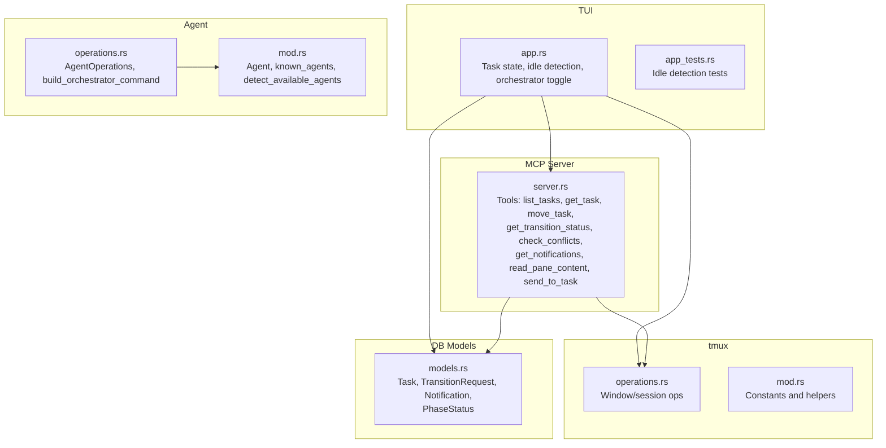
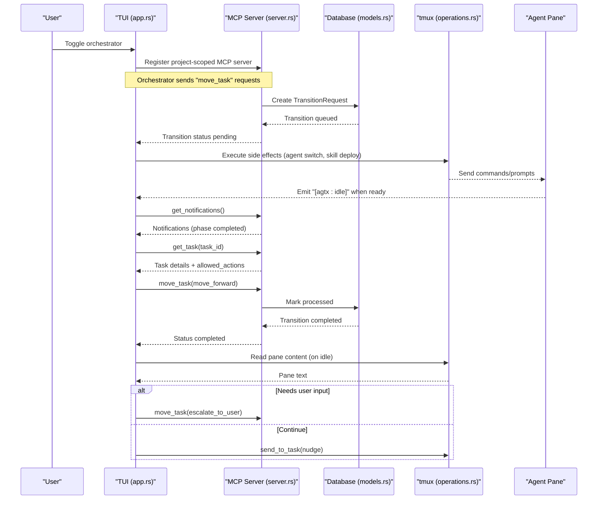
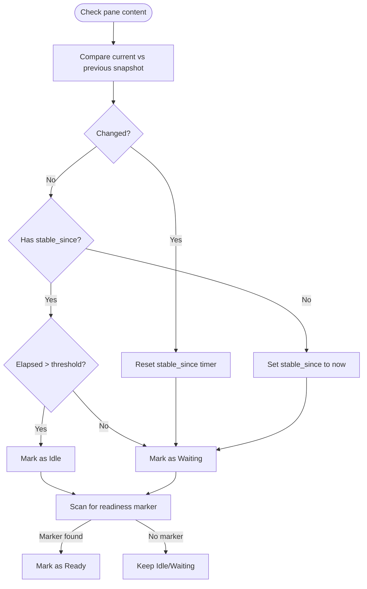
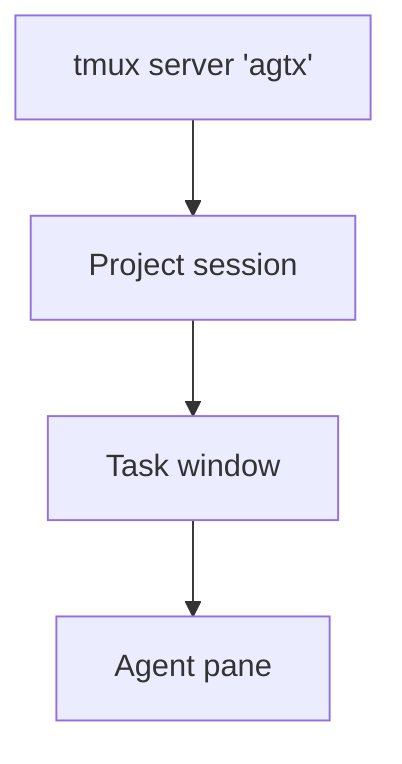
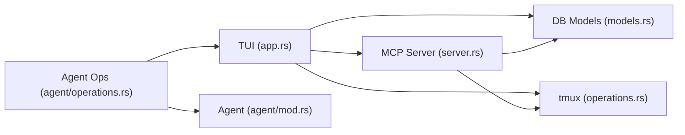

# Orchestrator Agent

<cite>
**Referenced Files in This Document**
- [README.md](file://README.md)
- [orchestrate.md](file://plugins/agtx/skills/orchestrate.md)
- [app.rs](file://src/tui/app.rs)
- [app_tests.rs](file://src/tui/app_tests.rs)
- [models.rs](file://src/db/models.rs)
- [server.rs](file://src/mcp/server.rs)
- [operations.rs](file://src/tmux/operations.rs)
- [mod.rs (tmux)](file://src/tmux/mod.rs)
- [operations.rs (agent)](file://src/agent/operations.rs)
- [mod.rs (agent)](file://src/agent/mod.rs)
</cite>

## Table of Contents
1. [Introduction](#introduction)
2. [Project Structure](#project-structure)
3. [Core Components](#core-components)
4. [Architecture Overview](#architecture-overview)
5. [Detailed Component Analysis](#detailed-component-analysis)
6. [Dependency Analysis](#dependency-analysis)
7. [Performance Considerations](#performance-considerations)
8. [Troubleshooting Guide](#troubleshooting-guide)
9. [Conclusion](#conclusion)

## Introduction
This document explains the orchestrator agent functionality that provides autonomous task management. It covers how the orchestrator monitors task progress across phases, advances tasks when conditions are met, detects idle/stuck tasks, and escalates appropriately. It also documents the experimental orchestrator implementation, including session management, content hash monitoring for idle detection, ready-state gating, tmux integration, and the atomic boolean flag system for readiness detection. Practical configuration guidance, interpretation of idle task warnings, and troubleshooting connectivity issues are included.

## Project Structure
The orchestrator spans several subsystems:
- TUI and state machine for task lifecycle and idle detection
- MCP server exposing board tools to the orchestrator agent
- tmux integration for agent sessions and pane interactions
- Database models for tasks, transitions, and notifications
- Agent registry and orchestrator command construction

**Diagram sources**
- [app.rs:6241-6770](file://src/tui/app.rs#L6241-L6770)
- [server.rs:521-755](file://src/mcp/server.rs#L521-L755)
- [operations.rs:64-248](file://src/tmux/operations.rs#L64-L248)
- [mod.rs (tmux):11-189](file://src/tmux/mod.rs#L11-L189)
- [models.rs:58-245](file://src/db/models.rs#L58-L245)
- [operations.rs (agent):18-108](file://src/agent/operations.rs#L18-L108)
- [mod.rs (agent):10-122](file://src/agent/mod.rs#L10-L122)

**Section sources**
- [README.md:604-646](file://README.md#L604-L646)
- [app.rs:6241-6770](file://src/tui/app.rs#L6241-L6770)
- [server.rs:521-755](file://src/mcp/server.rs#L521-L755)
- [operations.rs:64-248](file://src/tmux/operations.rs#L64-L248)
- [mod.rs (tmux):11-189](file://src/tmux/mod.rs#L11-L189)
- [models.rs:58-245](file://src/db/models.rs#L58-L245)
- [operations.rs (agent):18-108](file://src/agent/operations.rs#L18-L108)
- [mod.rs (agent):10-122](file://src/agent/mod.rs#L10-L122)

## Core Components
- Task lifecycle and state transitions: Tasks move through Backlog, Planning, Running, Review, Done. Allowed actions are computed based on plugin rules and dependency satisfaction.
- MCP server: Provides tools for listing tasks, fetching details, queuing transitions, checking conflicts, reading pane content, sending messages, and retrieving notifications.
- tmux integration: Manages sessions/windows, captures pane content, sends keys, and attaches to agent panes.
- Database models: Persist tasks, transition requests, notifications, and runtime-only phase status.
- Agent orchestration: Builds orchestrator launch commands (including MCP registration) and supports resume/interactive modes.

**Section sources**
- [models.rs:58-245](file://src/db/models.rs#L58-L245)
- [server.rs:473-518](file://src/mcp/server.rs#L473-L518)
- [operations.rs (agent):92-107](file://src/agent/operations.rs#L92-L107)
- [mod.rs (agent):10-122](file://src/agent/mod.rs#L10-L122)
- [operations.rs:64-248](file://src/tmux/operations.rs#L64-L248)
- [mod.rs (tmux):11-189](file://src/tmux/mod.rs#L11-L189)

## Architecture Overview
The orchestrator agent operates by registering with the MCP server and receiving push-based notifications when tasks complete phases. It queries the board state, validates allowed actions, and queues transitions. When tasks become idle, it reads pane content and either nudges the agent or escalates to the user.

**Diagram sources**
- [README.md:623-646](file://README.md#L623-L646)
- [server.rs:593-721](file://src/mcp/server.rs#L593-L721)
- [models.rs:162-184](file://src/db/models.rs#L162-L184)
- [operations.rs:166-172](file://src/tmux/operations.rs#L166-L172)
- [app.rs:6241-6770](file://src/tui/app.rs#L6241-L6770)

## Detailed Component Analysis

### Idle Detection and Ready-State Gating
The orchestrator uses a hybrid idle detection mechanism:
- Content change detection: Compares pane content snapshots to detect progress.
- Timer-based fallback: If content remains unchanged beyond a threshold, marks the pane as idle.
- Explicit idle signal: If the pane output ends with a specific marker, the orchestrator treats it as ready regardless of content changes.

Key constants and logic:
- Threshold: A fixed number of seconds after which unchanging output is considered idle.
- Stable timer: Starts when content first stops changing; if it exceeds the threshold, the pane is idle.
- Priority signal: Presence of a readiness marker in the latest output overrides content-change state.

**Diagram sources**
- [app.rs:6751-6770](file://src/tui/app.rs#L6751-L6770)
- [app_tests.rs:4818-4874](file://src/tui/app_tests.rs#L4818-L4874)
- [app_tests.rs:6807-6846](file://src/tui/app_tests.rs#L6807-L6846)

**Section sources**
- [app.rs:6741-6770](file://src/tui/app.rs#L6741-L6770)
- [app_tests.rs:4818-4874](file://src/tui/app_tests.rs#L4818-L4874)
- [app_tests.rs:6807-6846](file://src/tui/app_tests.rs#L6807-L6846)

### Session Management and tmux Integration
- tmux server: Dedicated server for agent sessions.
- Session naming: Derived from project and task identifiers for uniqueness and readability.
- Window management: Creates windows per task, supports sending keys/paste, capturing pane content, resizing, and attaching.
- Agent sessions: Each task runs in its own window; the orchestrator can read panes and send inputs to resolve interactive prompts.

**Diagram sources**
- [mod.rs (tmux):11-189](file://src/tmux/mod.rs#L11-L189)
- [operations.rs:64-248](file://src/tmux/operations.rs#L64-L248)

**Section sources**
- [mod.rs (tmux):11-189](file://src/tmux/mod.rs#L11-L189)
- [operations.rs:64-248](file://src/tmux/operations.rs#L64-L248)

### Atomic Boolean Flag System for Readiness Detection
The orchestrator relies on a readiness marker emitted by agent panes to indicate they are idle and ready for the next instruction. The TUI interprets this marker and treats the pane as ready even if content has not changed. This avoids busy-wait loops and reduces unnecessary MCP calls.

- Marker emission: Agents output a specific marker when they are waiting for user input.
- TUI detection: The TUI scans pane content for the marker and sets readiness accordingly.
- Behavior: On readiness, the orchestrator proceeds with transitions; on idle without readiness, it reads the pane to diagnose and act.

**Section sources**
- [README.md:632-644](file://README.md#L632-L644)
- [orchestrate.md:30-75](file://plugins/agtx/skills/orchestrate.md#L30-L75)

### MCP Integration and Transition Gating
The orchestrator communicates with the board via MCP tools:
- list_tasks: Discover tasks in Planning or Running.
- get_task: Retrieve task details and allowed_actions.
- move_task: Queue a transition; the TUI executes side effects and updates state.
- get_transition_status: Poll for completion/error.
- check_conflicts: Non-destructive conflict check for Review tasks.
- get_notifications: Pull push-based notifications about phase completions.
- read_pane_content: Read pane content to diagnose stuck tasks.
- send_to_task: Send keystrokes or messages to resolve interactive prompts.

Allowed actions are computed based on plugin rules and dependency satisfaction, ensuring the orchestrator respects workflow constraints.

**Section sources**
- [server.rs:521-755](file://src/mcp/server.rs#L521-L755)
- [server.rs:473-518](file://src/mcp/server.rs#L473-L518)
- [models.rs:162-184](file://src/db/models.rs#L162-L184)

### Experimental Orchestrator Implementation Details
- Agent orchestration command: The agent registry builds a command that registers the MCP server locally, runs the agent, and cleans up the registration on exit.
- Session management: The TUI ensures the project tmux session exists and clears per-task caches when switching projects.
- Idle handling: When idle notifications arrive, the orchestrator reads pane content and either nudges the agent or escalates to the user.

**Section sources**
- [operations.rs (agent):92-107](file://src/agent/operations.rs#L92-L107)
- [app.rs:6693-6709](file://src/tui/app.rs#L6693-L6709)
- [README.md:623-646](file://README.md#L623-L646)

## Dependency Analysis
The orchestrator’s behavior emerges from interactions among the TUI, MCP server, tmux, and database models. The TUI orchestrates state transitions and idle detection, the MCP server mediates with the board, tmux provides agent session control, and the database persists state and notifications.

**Diagram sources**
- [app.rs:6241-6770](file://src/tui/app.rs#L6241-L6770)
- [server.rs:521-755](file://src/mcp/server.rs#L521-L755)
- [models.rs:58-245](file://src/db/models.rs#L58-L245)
- [operations.rs:64-248](file://src/tmux/operations.rs#L64-L248)
- [operations.rs (agent):18-108](file://src/agent/operations.rs#L18-L108)
- [mod.rs (agent):10-122](file://src/agent/mod.rs#L10-L122)

**Section sources**
- [app.rs:6241-6770](file://src/tui/app.rs#L6241-L6770)
- [server.rs:521-755](file://src/mcp/server.rs#L521-L755)
- [models.rs:58-245](file://src/db/models.rs#L58-L245)
- [operations.rs:64-248](file://src/tmux/operations.rs#L64-L248)
- [operations.rs (agent):18-108](file://src/agent/operations.rs#L18-L108)
- [mod.rs (agent):10-122](file://src/agent/mod.rs#L10-L122)

## Performance Considerations
- Background thread architecture: The orchestrator initializes within the TUI’s main loop and uses non-blocking MCP calls and tmux operations. This avoids heavy polling and leverages push-based notifications.
- Monitoring many concurrent tasks: The TUI maintains per-task caches and clears them when switching projects to prevent stale state. Idle detection uses a fixed threshold to minimize frequent pane reads.
- Efficient pane reads: The MCP server’s read_pane_content tool limits the number of lines captured, reducing overhead.
- Transition batching: The orchestrator advances tasks only when conditions are met, avoiding redundant transitions.

[No sources needed since this section provides general guidance]

## Troubleshooting Guide
Common issues and resolutions:
- Orchestrator not receiving notifications:
  - Ensure the MCP server is registered and reachable. The agent orchestrator command includes registration and cleanup steps.
  - Verify tmux server is running and sessions exist for the project.
- Stuck tasks:
  - Confirm the agent pane emits the readiness marker when idle.
  - Use read_pane_content to inspect the pane and send targeted inputs via send_to_task.
  - If repeated nudges fail, escalate to the user with a reason.
- Merge conflicts in Review:
  - Use check_conflicts to detect conflicts without modifying files, then resolve and re-run the review phase.
- Idle task warnings:
  - The TUI flags tasks that have been idle for a period without artifacts. Opening the task popup shows the reason and allows dismissal.

**Section sources**
- [operations.rs (agent):92-107](file://src/agent/operations.rs#L92-L107)
- [server.rs:757-800](file://src/mcp/server.rs#L757-L800)
- [app.rs:6241-6770](file://src/tui/app.rs#L6241-L6770)

## Conclusion
The orchestrator agent automates task progression by monitoring pane activity, respecting plugin-defined gating rules, and escalating when human intervention is required. Its tmux-backed session management, MCP-driven coordination, and robust idle detection enable reliable autonomous operation across many concurrent tasks.