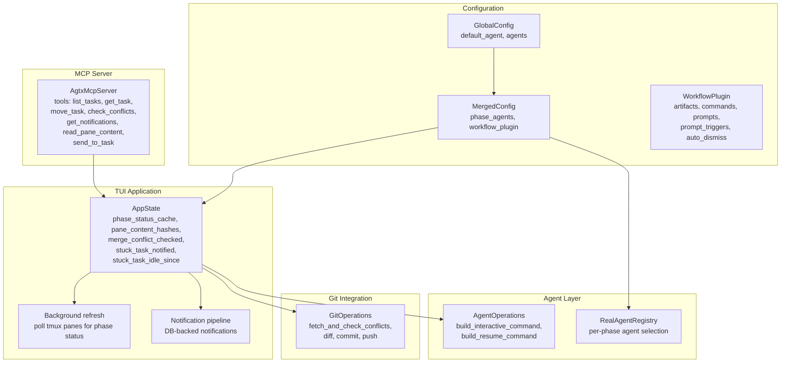
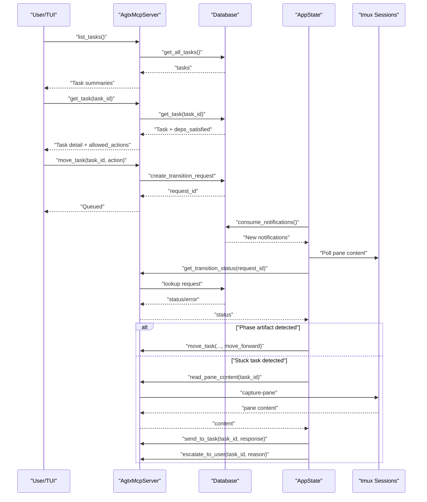
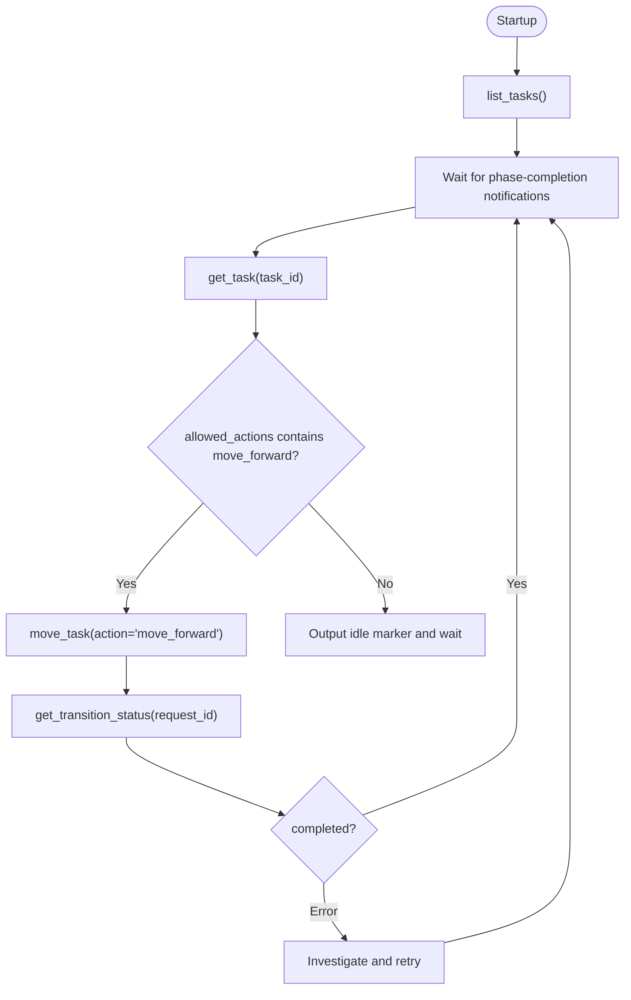
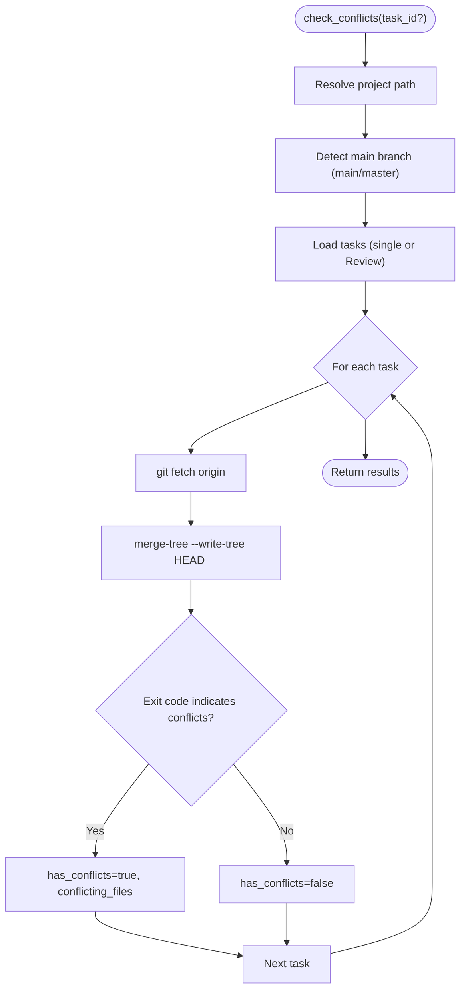
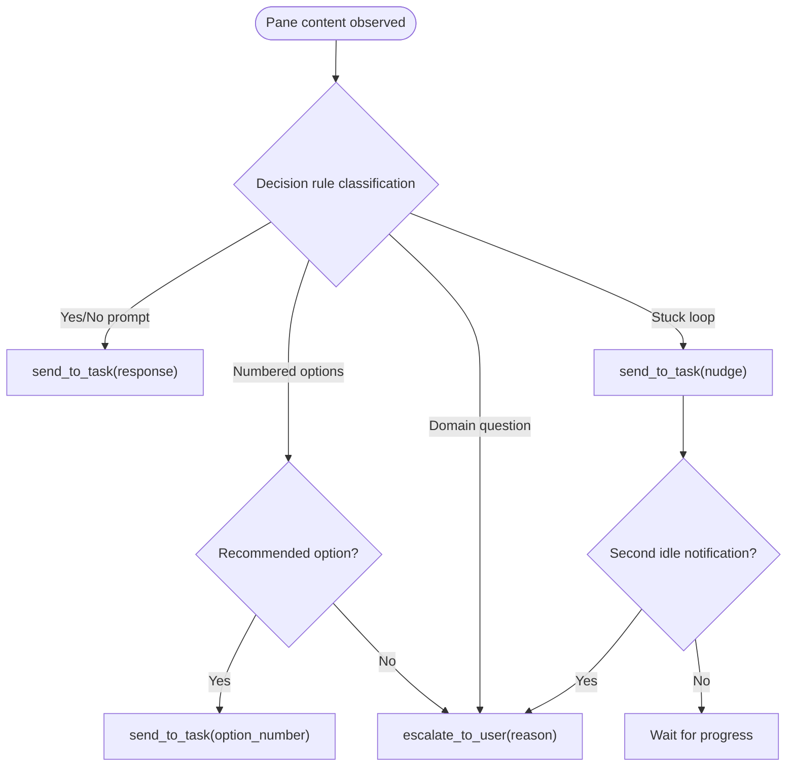
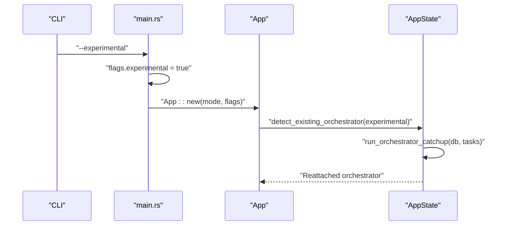
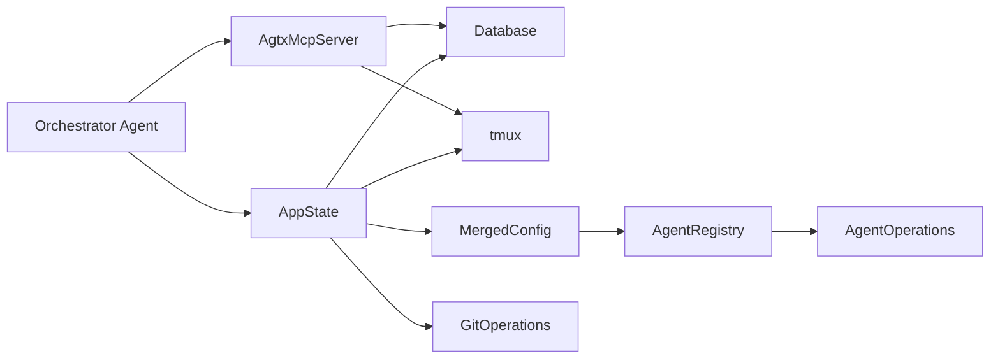

# Orchestrator Agent

<cite>
**Referenced Files in This Document**
- [orchestrate.md](file://plugins/agtx/skills/orchestrate.md)
- [merge-conflicts.md](file://plugins/agtx/skills/merge-conflicts.md)
- [server.rs](file://src/mcp/server.rs)
- [app.rs](file://src/tui/app.rs)
- [models.rs](file://src/db/models.rs)
- [operations.rs](file://src/agent/operations.rs)
- [mod.rs](file://src/config/mod.rs)
- [main.rs](file://src/main.rs)
- [operations.rs](file://src/git/operations.rs)
</cite>

## Table of Contents
1. [Introduction](#introduction)
2. [Project Structure](#project-structure)
3. [Core Components](#core-components)
4. [Architecture Overview](#architecture-overview)
5. [Detailed Component Analysis](#detailed-component-analysis)
6. [Dependency Analysis](#dependency-analysis)
7. [Performance Considerations](#performance-considerations)
8. [Troubleshooting Guide](#troubleshooting-guide)
9. [Conclusion](#conclusion)

## Introduction
This document explains the orchestrator agent functionality that automatically advances tasks through workflow phases, detects conflicts and bottlenecks, escalates when human judgment is required, and provides safety mechanisms to prevent destructive automation. It covers configuration options, threshold settings, and override mechanisms for manual control, along with practical workflows and troubleshooting scenarios.

## Project Structure
The orchestrator integrates three primary subsystems:
- MCP server exposing task lifecycle tools to the orchestrator agent
- TUI application managing tmux sessions, phase detection, and notifications
- Configuration system controlling agent selection, workflow plugins, and safety thresholds

**Diagram sources**
- [server.rs:395-520](file://src/mcp/server.rs#L395-L520)
- [app.rs:447-560](file://src/tui/app.rs#L447-L560)
- [mod.rs:337-408](file://src/config/mod.rs#L337-L408)
- [operations.rs:110-163](file://src/agent/operations.rs#L110-L163)
- [operations.rs:1-163](file://src/git/operations.rs#L1-L163)

**Section sources**
- [server.rs:395-520](file://src/mcp/server.rs#L395-L520)
- [app.rs:447-560](file://src/tui/app.rs#L447-L560)
- [mod.rs:337-408](file://src/config/mod.rs#L337-L408)
- [operations.rs:110-163](file://src/agent/operations.rs#L110-L163)
- [operations.rs:1-163](file://src/git/operations.rs#L1-L163)

## Core Components
- Orchestrator skill definition: defines lifecycle, strategy, stuck-task handling, and escalation rules.
- MCP server tools: list tasks, get task details, move tasks, check conflicts, read pane content, send messages, and manage notifications.
- TUI orchestrator runtime: tracks phase status, detects idle/stuck tasks, and triggers notifications.
- Configuration: per-phase agent selection, workflow plugin settings, and safety thresholds.
- Git conflict detection: read-only merge conflict checks without modifying working trees.

**Section sources**
- [orchestrate.md:6-200](file://plugins/agtx/skills/orchestrate.md#L6-L200)
- [server.rs:521-1216](file://src/mcp/server.rs#L521-L1216)
- [app.rs:447-560](file://src/tui/app.rs#L447-L560)
- [mod.rs:337-408](file://src/config/mod.rs#L337-L408)
- [operations.rs:211-244](file://src/db/models.rs#L211-L244)
- [operations.rs:57-61](file://src/git/operations.rs#L57-L61)

## Architecture Overview
The orchestrator agent operates as a pull-based MCP client that receives notifications when a phase completes. It queries task details, validates allowed actions, and advances tasks automatically while escalating on ambiguity or bottlenecks.

**Diagram sources**
- [server.rs:548-721](file://src/mcp/server.rs#L548-L721)
- [server.rs:837-974](file://src/mcp/server.rs#L837-L974)
- [app.rs:521-532](file://src/tui/app.rs#L521-L532)

**Section sources**
- [server.rs:548-721](file://src/mcp/server.rs#L548-L721)
- [server.rs:837-974](file://src/mcp/server.rs#L837-L974)
- [app.rs:521-532](file://src/tui/app.rs#L521-L532)

## Detailed Component Analysis

### Automatic Task Advancement System
- Lifecycle: Backlog → Research → Planning → Running → Review. The orchestrator manages Planning and Running phases.
- Strategy: On startup, list tasks; when notified a phase completes, read task details, check allowed actions, and move forward.
- Concurrency: The orchestrator does not coordinate parallelism—multiple tasks can be active; it advances what is present.
- Error handling: If transition status indicates an error, investigate and retry with a different approach.
- Idle signaling: After processing, output a specific idle marker to receive push notifications.

**Diagram sources**
- [orchestrate.md:57-90](file://plugins/agtx/skills/orchestrate.md#L57-L90)
- [server.rs:655-721](file://src/mcp/server.rs#L655-L721)
- [server.rs:726-755](file://src/mcp/server.rs#L726-L755)

**Section sources**
- [orchestrate.md:57-90](file://plugins/agtx/skills/orchestrate.md#L57-L90)
- [server.rs:655-721](file://src/mcp/server.rs#L655-L721)
- [server.rs:726-755](file://src/mcp/server.rs#L726-L755)

### Intelligent Conflict Detection Mechanism
- Read-only merge conflict checks: The MCP tool fetches the project’s default branch and performs a virtual merge check without modifying the working tree.
- Scope: Can check a single task or all tasks in Review status.
- Results: Reports whether conflicts exist, lists conflicting files, and surfaces errors.

**Diagram sources**
- [server.rs:757-832](file://src/mcp/server.rs#L757-L832)
- [operations.rs:211-243](file://src/git/operations.rs#L211-L243)

**Section sources**
- [server.rs:757-832](file://src/mcp/server.rs#L757-L832)
- [operations.rs:211-243](file://src/git/operations.rs#L211-L243)

### Escalation Protocols and Human Oversight
Escalation occurs when:
- Interactive prompts require user decisions (e.g., yes/no, numbered options without a recommended choice).
- Domain questions arise that require project knowledge or architectural judgment.
- Agents are stuck in loops or repeating errors despite nudging.

Escalation actions:
- `escalate_to_user`: Flags the task for user attention with a concise reason. The TUI displays a visible banner with the reason.
- `send_to_task`: Sends a response to the agent pane to answer prompts or provide guidance.

**Diagram sources**
- [orchestrate.md:108-200](file://plugins/agtx/skills/orchestrate.md#L108-L200)
- [server.rs:912-974](file://src/mcp/server.rs#L912-L974)

**Section sources**
- [orchestrate.md:108-200](file://plugins/agtx/skills/orchestrate.md#L108-L200)
- [server.rs:912-974](file://src/mcp/server.rs#L912-L974)

### Experimental Mode Activation and Safety Mechanisms
- Experimental flag: Passed via command-line argument to enable advanced features (e.g., orchestrator reattach).
- Safety safeguards:
  - Agent switching uses graceful exit commands per agent type, with fallbacks (Ctrl+C/Ctrl+D).
  - Content stability thresholds prevent premature input to agents mid-render.
  - Orchestrator idle detection uses both content hashing and fallback timing to avoid false positives.
  - Catch-up replay of completed-phase notifications ensures continuity after restarts.

**Diagram sources**
- [main.rs:16-62](file://src/main.rs#L16-L62)
- [app.rs:8475-8551](file://src/tui/app.rs#L8475-L8551)

**Section sources**
- [main.rs:16-62](file://src/main.rs#L16-L62)
- [app.rs:8475-8551](file://src/tui/app.rs#L8475-L8551)

### Configuration Options and Threshold Settings
- Per-phase agent selection:
  - Configure different agents for research, planning, running, and review.
  - Falls back to default agent if no phase-specific override is set.
- Workflow plugin:
  - Controls artifacts, commands, prompts, prompt triggers, and auto-dismiss rules.
  - Supports cyclic workflows and context clearing on phase advance for compatible agents.
- Thresholds and timeouts:
  - Phase idle detection uses content hashing and stability thresholds.
  - Orchestrator idle fallback uses a configurable timeout.
  - Prompt-trigger waiting has bounded retries to avoid indefinite blocking.

**Section sources**
- [mod.rs:390-408](file://src/config/mod.rs#L390-L408)
- [mod.rs:410-594](file://src/config/mod.rs#L410-L594)
- [app.rs:521-532](file://src/tui/app.rs#L521-L532)

### Override Mechanisms for Manual Control
- Allowed actions: The MCP server computes valid transitions based on task status and plugin rules, preventing invalid forward moves from Backlog when dependencies are unsatisfied.
- Direct intervention:
  - `send_to_task`: Provide answers to prompts or guide stuck agents.
  - `escalate_to_user`: Request human review for ambiguous or judgment-required situations.
  - `move_task`: Force transitions when appropriate (e.g., move_to_done in Review).

**Section sources**
- [server.rs:473-518](file://src/mcp/server.rs#L473-L518)
- [server.rs:655-721](file://src/mcp/server.rs#L655-L721)
- [server.rs:912-974](file://src/mcp/server.rs#L912-L974)

## Dependency Analysis
The orchestrator relies on:
- MCP server for task state transitions and diagnostics
- TUI for tmux session management, phase detection, and notifications
- Configuration system for agent selection and workflow customization
- Git integration for conflict detection and repository operations

**Diagram sources**
- [server.rs:395-520](file://src/mcp/server.rs#L395-L520)
- [app.rs:447-560](file://src/tui/app.rs#L447-L560)
- [mod.rs:337-408](file://src/config/mod.rs#L337-L408)
- [operations.rs:110-163](file://src/agent/operations.rs#L110-L163)
- [operations.rs:1-163](file://src/git/operations.rs#L1-L163)

**Section sources**
- [server.rs:395-520](file://src/mcp/server.rs#L395-L520)
- [app.rs:447-560](file://src/tui/app.rs#L447-L560)
- [mod.rs:337-408](file://src/config/mod.rs#L337-L408)
- [operations.rs:110-163](file://src/agent/operations.rs#L110-L163)
- [operations.rs:1-163](file://src/git/operations.rs#L1-L163)

## Performance Considerations
- Asynchronous background refresh: The TUI polls tmux panes in the background to avoid blocking the UI.
- Content hashing and stability thresholds: Reduce unnecessary transitions and minimize false positives for idle detection.
- Bounded waits: Prompt-trigger and agent-ready waits cap retries to prevent indefinite stalls.
- Read-only conflict checks: Virtual merge avoids heavy operations and preserves working tree integrity.

[No sources needed since this section provides general guidance]

## Troubleshooting Guide
Common scenarios and resolutions:
- Task stuck on a yes/no prompt:
  - Use `read_pane_content` to confirm the prompt, then `send_to_task` with the appropriate response.
- Ambiguous numbered options without a recommended choice:
  - Escalate to the user with a concise reason summarizing the decision point.
- Domain question requiring architectural judgment:
  - Escalate to the user; do not answer on their behalf.
- Repeated error or spinning agent:
  - Send a targeted nudge via `send_to_task`; if a second idle notification arrives, escalate.
- Merge conflicts in Review:
  - Use the conflict-check tool to identify conflicts; resolve using the merge conflict resolution skill.
- Agent not responding:
  - Switch agents gracefully using the built-in switching logic; ensure the pane stabilizes before sending prompts.

**Section sources**
- [orchestrate.md:108-200](file://plugins/agtx/skills/orchestrate.md#L108-L200)
- [server.rs:757-832](file://src/mcp/server.rs#L757-L832)
- [merge-conflicts.md:1-53](file://plugins/agtx/skills/merge-conflicts.md#L1-L53)
- [app.rs:8604-8735](file://src/tui/app.rs#L8604-L8735)

## Conclusion
The orchestrator agent automates task progression through Planning and Running phases, escalates on ambiguity or bottlenecks, and integrates with conflict detection and tmux session management. Its configuration system enables per-phase agent selection and workflow customization, while safety mechanisms prevent destructive automation. By combining MCP tools, TUI runtime logic, and robust escalation protocols, the system provides a reliable foundation for autonomous task orchestration with human oversight when needed.