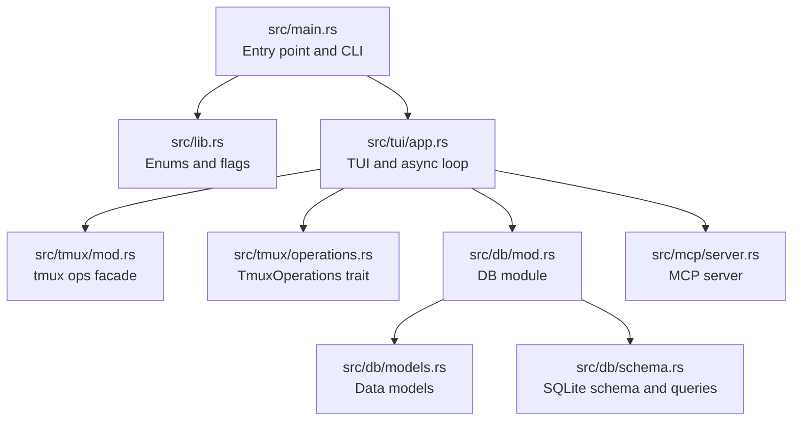
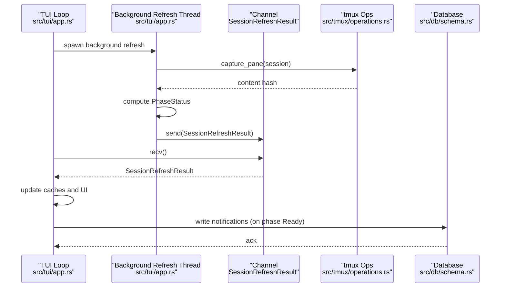
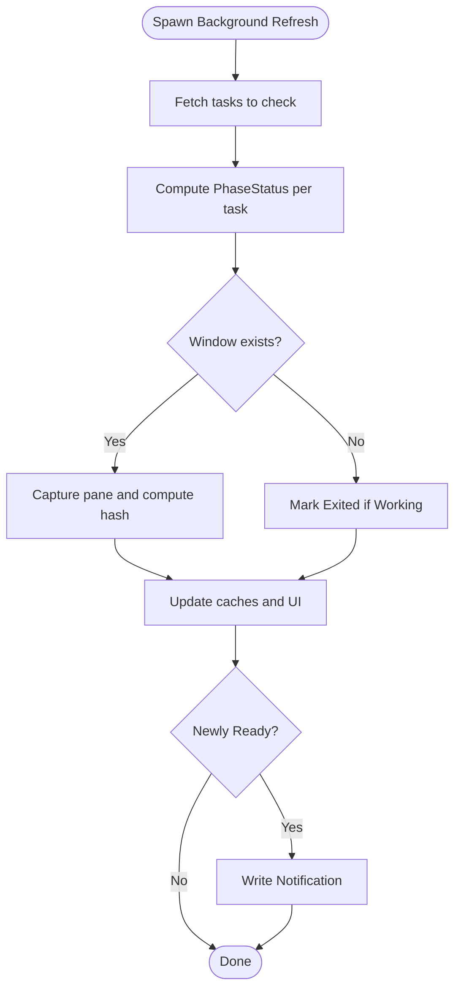
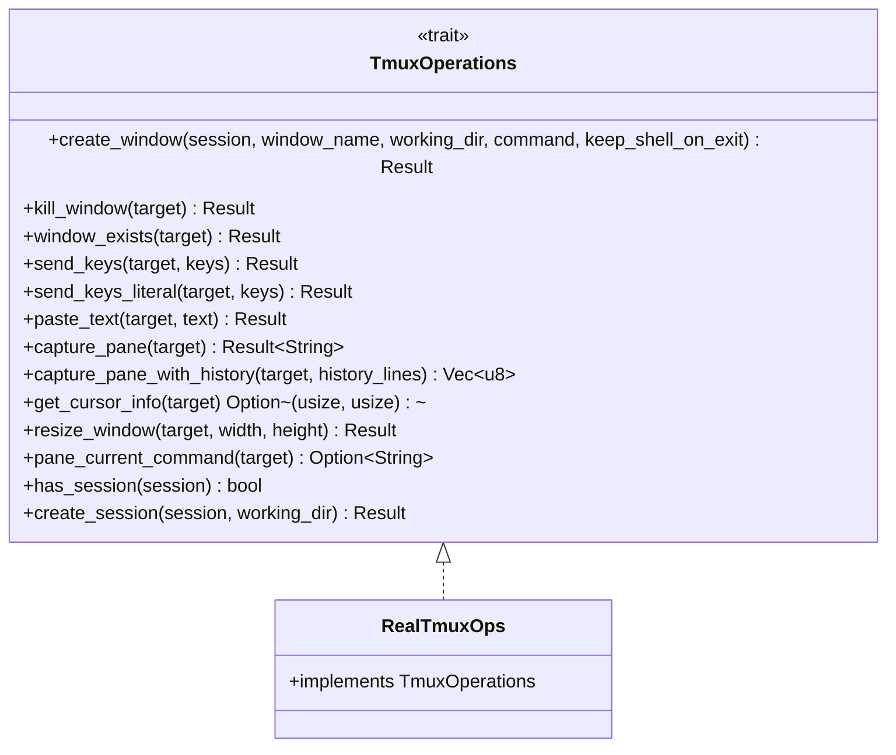
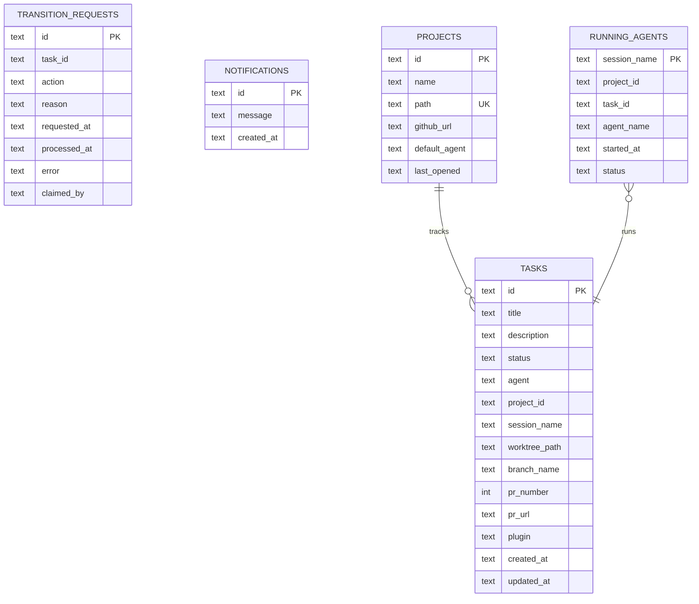
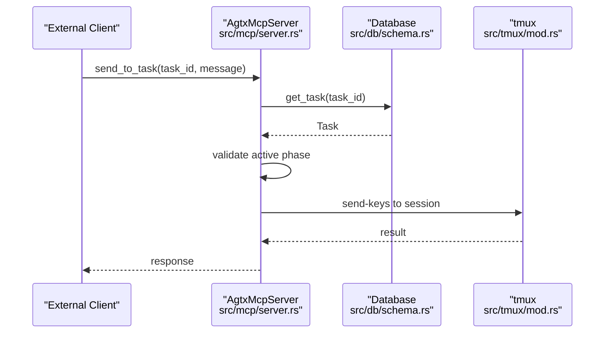
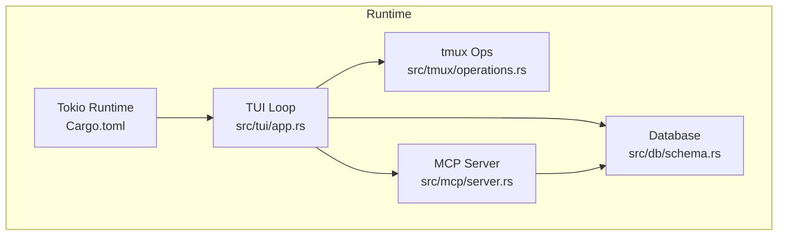

# Performance Optimization

<cite>
**Referenced Files in This Document**
- [Cargo.toml](file://Cargo.toml)
- [src/main.rs](file://src/main.rs)
- [src/lib.rs](file://src/lib.rs)
- [src/tmux/mod.rs](file://src/tmux/mod.rs)
- [src/tmux/operations.rs](file://src/tmux/operations.rs)
- [src/db/mod.rs](file://src/db/mod.rs)
- [src/db/models.rs](file://src/db/models.rs)
- [src/db/schema.rs](file://src/db/schema.rs)
- [src/tui/app.rs](file://src/tui/app.rs)
- [src/mcp/server.rs](file://src/mcp/server.rs)
</cite>

## Table of Contents
1. [Introduction](#introduction)
2. [Project Structure](#project-structure)
3. [Core Components](#core-components)
4. [Architecture Overview](#architecture-overview)
5. [Detailed Component Analysis](#detailed-component-analysis)
6. [Dependency Analysis](#dependency-analysis)
7. [Performance Considerations](#performance-considerations)
8. [Troubleshooting Guide](#troubleshooting-guide)
9. [Conclusion](#conclusion)
10. [Appendices](#appendices)

## Introduction
This document focuses on performance optimization techniques and best practices for large-scale AGTX deployments. It explains the background thread architecture for session refresh, the channel-based communication system, and asynchronous task processing. It also covers memory management strategies, database query optimization, and caching mechanisms for task status and project information. Additional guidance is provided for tmux session optimization, including pane content hashing for idle detection and the performance impact of monitoring many concurrent sessions. Practical examples demonstrate scaling AGTX for teams, optimizing database queries, and managing resource-intensive operations. Finally, it outlines profiling techniques, bottleneck identification, performance monitoring approaches, and system requirements for enterprise-scale usage.

## Project Structure
AGTX is a terminal-native kanban board for managing coding agents. The runtime is event-driven with a TUI and integrates tmux for agent sessions. Data is persisted in SQLite databases (global and per-project). Asynchronous processing is handled via background threads and channels, with a dedicated session refresh pipeline and MCP server for external orchestration.

**Diagram sources**
- [src/main.rs:1-96](file://src/main.rs#L1-L96)
- [src/lib.rs:12-24](file://src/lib.rs#L12-L24)
- [src/tui/app.rs:744-760](file://src/tui/app.rs#L744-L760)
- [src/tmux/mod.rs:1-189](file://src/tmux/mod.rs#L1-L189)
- [src/tmux/operations.rs:1-249](file://src/tmux/operations.rs#L1-L249)
- [src/db/mod.rs:1-6](file://src/db/mod.rs#L1-L6)
- [src/db/models.rs:1-245](file://src/db/models.rs#L1-L245)
- [src/db/schema.rs:1-656](file://src/db/schema.rs#L1-L656)
- [src/mcp/server.rs:394-952](file://src/mcp/server.rs#L394-L952)

**Section sources**
- [src/main.rs:16-96](file://src/main.rs#L16-L96)
- [src/lib.rs:12-24](file://src/lib.rs#L12-L24)
- [src/tui/app.rs:744-760](file://src/tui/app.rs#L744-L760)
- [src/tmux/mod.rs:11-189](file://src/tmux/mod.rs#L11-L189)
- [src/tmux/operations.rs:1-249](file://src/tmux/operations.rs#L1-L249)
- [src/db/mod.rs:1-6](file://src/db/mod.rs#L1-L6)
- [src/db/models.rs:58-133](file://src/db/models.rs#L58-L133)
- [src/db/schema.rs:97-208](file://src/db/schema.rs#L97-L208)
- [src/mcp/server.rs:394-952](file://src/mcp/server.rs#L394-L952)

## Core Components
- TUI and async loop: Drives the UI, processes events, and manages background tasks. It maintains caches for phase status and pane content hashes, and coordinates session refresh via a background thread and channel.
- tmux integration: Provides a trait-based abstraction for tmux operations, enabling deterministic testing and efficient pane capture for idle detection.
- Database layer: Centralized SQLite schema with indexes and batch operations to optimize reads/writes for tasks, projects, transition requests, and notifications.
- MCP server: Serves as an external orchestration interface, exposing task and pane operations and acting as a bridge for notifications.

Key performance-relevant elements:
- Background session refresh thread with a bounded channel for non-blocking updates.
- Pane content hashing for idle detection to reduce unnecessary processing.
- Indexes on frequently queried columns (task status, project_id, running_agents).
- Batch insertions for tasks to minimize transaction overhead.

**Section sources**
- [src/tui/app.rs:448-560](file://src/tui/app.rs#L448-L560)
- [src/tui/app.rs:6400-6600](file://src/tui/app.rs#L6400-L6600)
- [src/tui/app.rs:6514-6544](file://src/tui/app.rs#L6514-L6544)
- [src/tmux/operations.rs:10-59](file://src/tmux/operations.rs#L10-L59)
- [src/db/schema.rs:117-118](file://src/db/schema.rs#L117-L118)
- [src/db/schema.rs:204](file://src/db/schema.rs#L204)
- [src/db/schema.rs:242-274](file://src/db/schema.rs#L242-L274)

## Architecture Overview
The runtime combines a TUI with background processing and persistent storage. The session refresh pipeline runs asynchronously, periodically capturing pane content and computing phase status, then sending results back to the main thread via a channel. The MCP server exposes APIs for external clients to interact with tasks and panes.

**Diagram sources**
- [src/tui/app.rs:6400-6512](file://src/tui/app.rs#L6400-L6512)
- [src/tui/app.rs:6514-6544](file://src/tui/app.rs#L6514-L6544)
- [src/tmux/operations.rs:166-172](file://src/tmux/operations.rs#L166-L172)
- [src/db/schema.rs:598-654](file://src/db/schema.rs#L598-L654)

**Section sources**
- [src/tui/app.rs:6400-6512](file://src/tui/app.rs#L6400-L6512)
- [src/tui/app.rs:6514-6544](file://src/tui/app.rs#L6514-L6544)
- [src/tmux/operations.rs:166-172](file://src/tmux/operations.rs#L166-L172)
- [src/db/schema.rs:598-654](file://src/db/schema.rs#L598-L654)

## Detailed Component Analysis

### Background Session Refresh Pipeline
The session refresh pipeline runs in a background thread and periodically evaluates task phase status by capturing pane content and detecting artifacts. It uses a channel to deliver results to the main thread, avoiding blocking the UI.

Key behaviors:
- Computes PhaseStatus (Working, Idle, Ready, Exited) per task.
- Captures pane content and computes a hash for idle detection.
- Updates caches: phase_status_cache and pane_content_hashes.
- On newly Ready tasks, writes notifications for the orchestrator.

**Diagram sources**
- [src/tui/app.rs:6400-6512](file://src/tui/app.rs#L6400-L6512)
- [src/tui/app.rs:6514-6544](file://src/tui/app.rs#L6514-L6544)
- [src/db/schema.rs:598-654](file://src/db/schema.rs#L598-L654)

**Section sources**
- [src/tui/app.rs:6400-6512](file://src/tui/app.rs#L6400-L6512)
- [src/tui/app.rs:6514-6544](file://src/tui/app.rs#L6514-L6544)
- [src/db/schema.rs:598-654](file://src/db/schema.rs#L598-L654)

### tmux Integration and Idle Detection
tmux operations are abstracted behind a trait to support deterministic testing and efficient pane capture. Idle detection relies on pane content hashing with a 15-second stability threshold for Working tasks. The orchestrator uses a similar fallback mechanism with an explicit idle signal.

Highlights:
- RealTmuxOps implements window existence checks, pane capture, and cursor info retrieval.
- Pane content hashing enables stable idle detection without parsing complex ANSI sequences.
- Orchestrator idle detection supports both explicit signals and fallback timing.

**Diagram sources**
- [src/tmux/operations.rs:10-59](file://src/tmux/operations.rs#L10-L59)
- [src/tmux/operations.rs:64-248](file://src/tmux/operations.rs#L64-L248)

**Section sources**
- [src/tmux/operations.rs:10-59](file://src/tmux/operations.rs#L10-L59)
- [src/tmux/operations.rs:64-248](file://src/tmux/operations.rs#L64-L248)
- [src/tmux/mod.rs:168-188](file://src/tmux/mod.rs#L168-L188)

### Database Layer and Query Optimization
The database layer uses SQLite with targeted indexes and batch operations to improve throughput. It separates concerns between global and project-scoped data.

Key optimizations:
- Indexes on tasks(status) and tasks(project_id) to accelerate filtering and joins.
- Batch insertion for tasks to reduce transaction overhead.
- Atomic operations for notifications and transition requests to prevent duplication under concurrency.
- Stable per-project database filenames derived from hashed project paths.

**Diagram sources**
- [src/db/schema.rs:97-208](file://src/db/schema.rs#L97-L208)
- [src/db/schema.rs:117-118](file://src/db/schema.rs#L117-L118)
- [src/db/schema.rs:204](file://src/db/schema.rs#L204)

**Section sources**
- [src/db/schema.rs:97-208](file://src/db/schema.rs#L97-L208)
- [src/db/schema.rs:117-118](file://src/db/schema.rs#L117-L118)
- [src/db/schema.rs:204](file://src/db/schema.rs#L204)
- [src/db/schema.rs:242-274](file://src/db/schema.rs#L242-L274)
- [src/db/schema.rs:478-554](file://src/db/schema.rs#L478-L554)
- [src/db/schema.rs:598-654](file://src/db/schema.rs#L598-L654)

### MCP Server and External Orchestration
The MCP server exposes endpoints for task and pane operations, enabling external clients to drive AGTX. It integrates with the database to enforce constraints and route actions.

Highlights:
- Validates task phase before allowing message injection.
- Uses tmux commands to send keys to active sessions.
- Manages a transition request queue with atomic claiming and cleanup.

**Diagram sources**
- [src/mcp/server.rs:915-952](file://src/mcp/server.rs#L915-L952)
- [src/db/schema.rs:353-359](file://src/db/schema.rs#L353-L359)
- [src/tmux/mod.rs:109-118](file://src/tmux/mod.rs#L109-L118)

**Section sources**
- [src/mcp/server.rs:915-952](file://src/mcp/server.rs#L915-L952)
- [src/db/schema.rs:353-359](file://src/db/schema.rs#L353-L359)
- [src/tmux/mod.rs:109-118](file://src/tmux/mod.rs#L109-L118)

## Dependency Analysis
The application’s performance depends on several subsystems and their interactions. The following diagram highlights key dependencies and their impact on scalability.

**Diagram sources**
- [Cargo.toml:17-18](file://Cargo.toml#L17-L18)
- [src/tui/app.rs:744-760](file://src/tui/app.rs#L744-L760)
- [src/db/schema.rs:1-10](file://src/db/schema.rs#L1-L10)
- [src/tmux/operations.rs:64-248](file://src/tmux/operations.rs#L64-L248)
- [src/mcp/server.rs:394-399](file://src/mcp/server.rs#L394-L399)

**Section sources**
- [Cargo.toml:17-18](file://Cargo.toml#L17-L18)
- [src/tui/app.rs:744-760](file://src/tui/app.rs#L744-L760)
- [src/db/schema.rs:1-10](file://src/db/schema.rs#L1-L10)
- [src/tmux/operations.rs:64-248](file://src/tmux/operations.rs#L64-L248)
- [src/mcp/server.rs:394-399](file://src/mcp/server.rs#L394-L399)

## Performance Considerations
- Concurrency model
  - Use a single background thread per refresh cycle to avoid contention. Limit the number of simultaneous pane captures to balance responsiveness and CPU usage.
  - Employ a bounded channel for session refresh results to prevent unbounded memory growth. Tune buffer sizes based on peak concurrent tasks.

- Memory management
  - Keep pane content hashes in a HashMap keyed by task_id. Clear entries on Ready or Exited to bound memory growth.
  - Cache phase status per task to avoid repeated computation and DB reads.

- Database optimization
  - Prefer batch inserts for tasks to reduce transaction overhead.
  - Use indexes on status and project_id to speed up filtering and joins.
  - Clean up old transition requests and notifications periodically to maintain small working sets.

- tmux session optimization
  - Avoid capturing panes for non-existent windows to prevent errors and wasted cycles.
  - Use pane_current_command to gate operations when the pane is idle or uninitialized.
  - For large-scale deployments, consider staggering refresh intervals to distribute load.

- Scaling AGTX for teams
  - Separate global and project databases to isolate workloads and enable independent maintenance.
  - Use MCP endpoints to offload heavy operations to external workers while keeping the TUI responsive.
  - Monitor orchestrator idle detection to avoid overwhelming agents with notifications.

- Resource allocation and capacity planning
  - Provision CPU cores proportional to the number of concurrent tasks and background refresh cycles.
  - Allocate disk I/O headroom for SQLite writes and tmux pane captures.
  - Plan memory budgets for pane content hashes and UI state caches.

[No sources needed since this section provides general guidance]

## Troubleshooting Guide
Common performance issues and remedies:
- UI stalls during refresh
  - Cause: Too many simultaneous pane captures or long-running tasks.
  - Remedy: Reduce concurrent refreshes, increase refresh interval, or cap the number of tasks polled per cycle.

- Excessive memory usage
  - Cause: Uncleared pane content hashes or phase status caches.
  - Remedy: Ensure caches are cleared on Ready and Exited transitions; monitor cache sizes.

- Slow database writes
  - Cause: Frequent single-row inserts.
  - Remedy: Use batch insertions for tasks; consolidate writes.

- MCP latency
  - Cause: tmux send-keys delays or busy panes.
  - Remedy: Validate task phase before sending messages; use orchestrator idle detection to avoid noisy notifications.

**Section sources**
- [src/tui/app.rs:6514-6544](file://src/tui/app.rs#L6514-L6544)
- [src/db/schema.rs:242-274](file://src/db/schema.rs#L242-L274)
- [src/mcp/server.rs:915-952](file://src/mcp/server.rs#L915-L952)

## Conclusion
AGTX achieves scalable performance through a combination of background processing, channel-based communication, tmux pane hashing for idle detection, and SQLite optimizations. By tuning concurrency, managing caches, and leveraging MCP for external orchestration, teams can operate efficiently at enterprise scale. Regular profiling and capacity planning will ensure sustained performance as task volumes grow.

[No sources needed since this section summarizes without analyzing specific files]

## Appendices

### Practical Examples
- Scaling for teams
  - Use MCP to enqueue transition requests and process them atomically with claim semantics to avoid duplicates.
  - Separate global and project databases to isolate workloads and simplify backups.

- Optimizing database queries
  - Filter tasks by status and project_id using indexed columns.
  - Batch-create tasks to reduce transaction overhead.

- Managing resource-intensive operations
  - Stagger pane captures and artifact detection to limit CPU usage.
  - Use orchestrator idle detection to gate notifications and reduce agent churn.

**Section sources**
- [src/db/schema.rs:478-554](file://src/db/schema.rs#L478-L554)
- [src/db/schema.rs:117-118](file://src/db/schema.rs#L117-L118)
- [src/db/schema.rs:242-274](file://src/db/schema.rs#L242-L274)
- [src/tui/app.rs:6400-6512](file://src/tui/app.rs#L6400-L6512)
- [src/mcp/server.rs:915-952](file://src/mcp/server.rs#L915-L952)