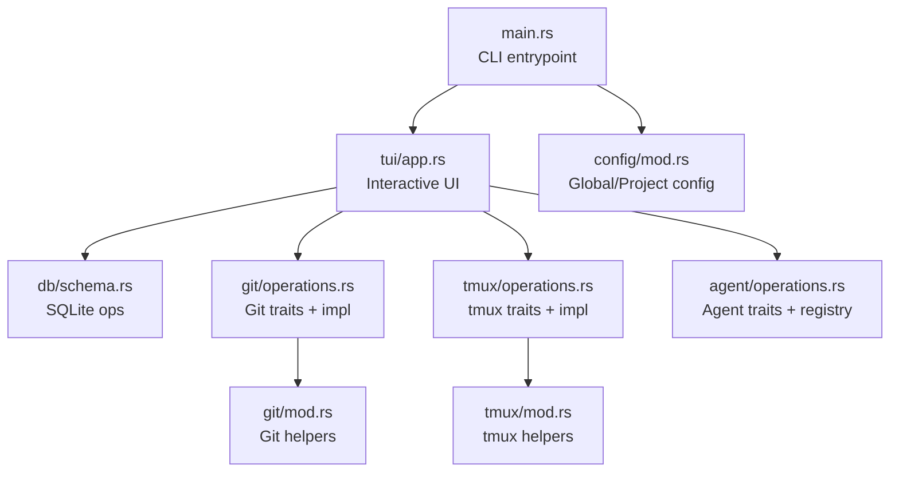
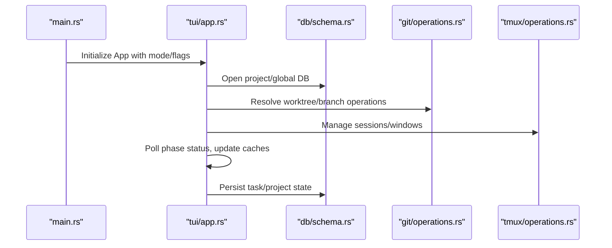
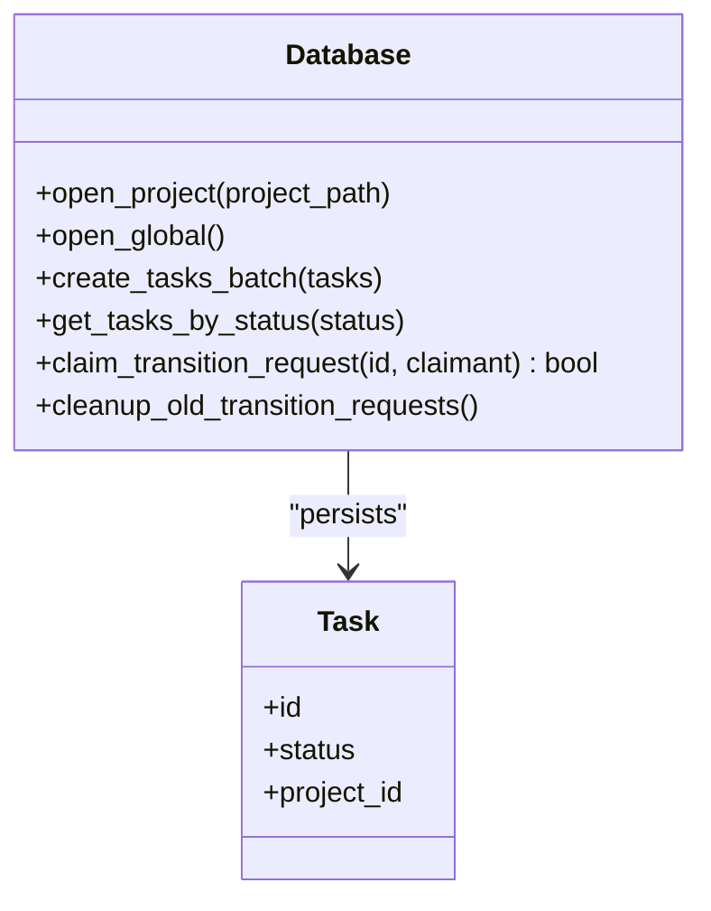
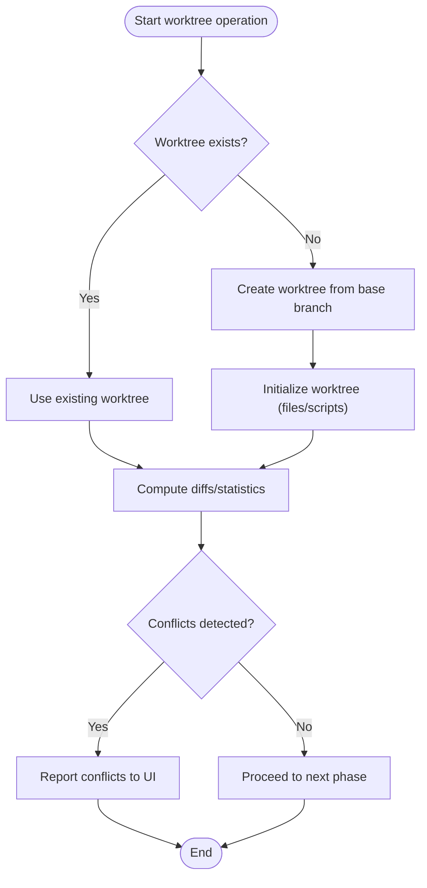
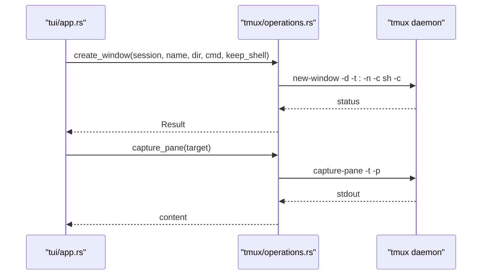
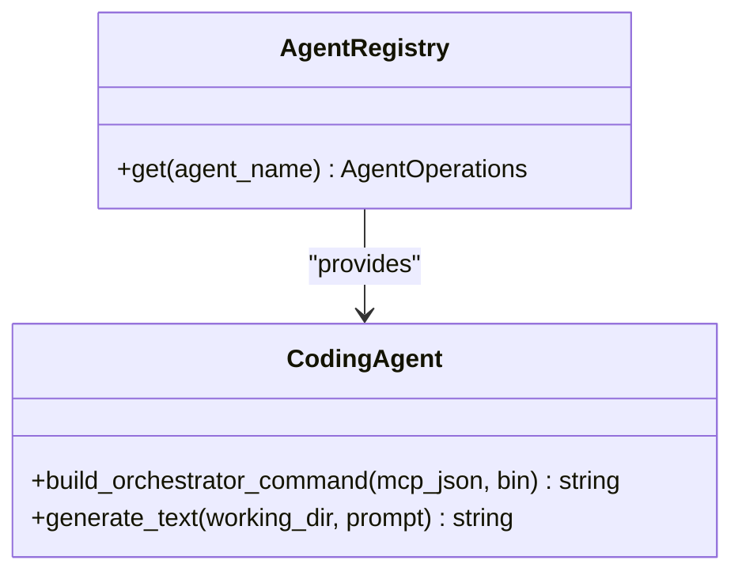
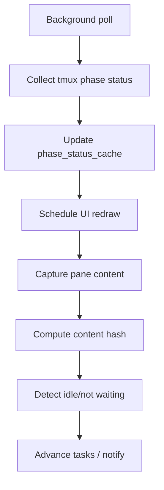
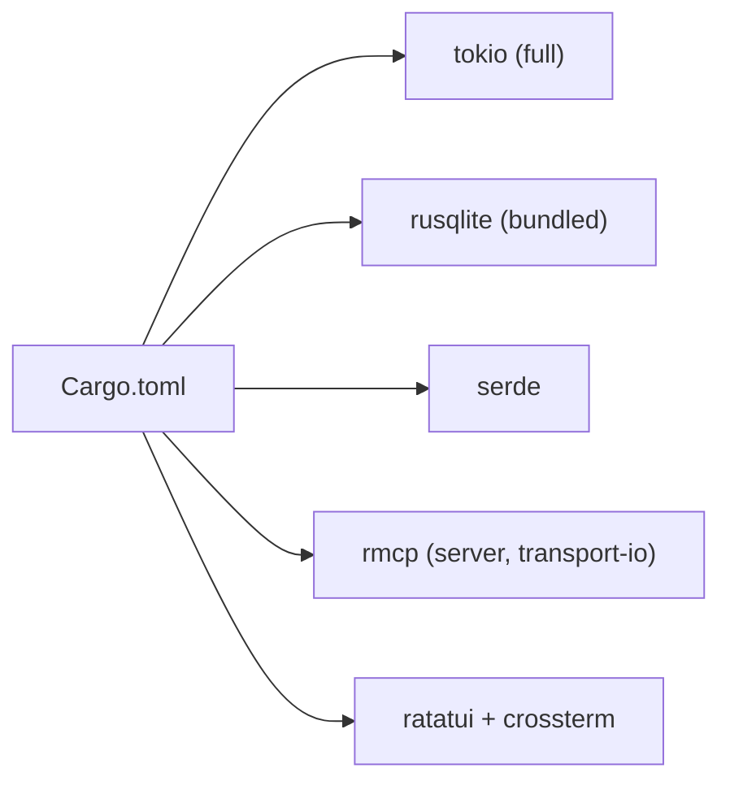

# Performance Optimization

<cite>
**Referenced Files in This Document**
- [Cargo.toml](file://Cargo.toml)
- [src/lib.rs](file://src/lib.rs)
- [src/main.rs](file://src/main.rs)
- [src/db/mod.rs](file://src/db/mod.rs)
- [src/db/schema.rs](file://src/db/schema.rs)
- [src/db/models.rs](file://src/db/models.rs)
- [src/git/mod.rs](file://src/git/mod.rs)
- [src/git/operations.rs](file://src/git/operations.rs)
- [src/tmux/mod.rs](file://src/tmux/mod.rs)
- [src/tmux/operations.rs](file://src/tmux/operations.rs)
- [src/agent/operations.rs](file://src/agent/operations.rs)
- [src/tui/app.rs](file://src/tui/app.rs)
- [src/config/mod.rs](file://src/config/mod.rs)
- [tests/db_tests.rs](file://tests/db_tests.rs)
</cite>

## Table of Contents
1. [Introduction](#introduction)
2. [Project Structure](#project-structure)
3. [Core Components](#core-components)
4. [Architecture Overview](#architecture-overview)
5. [Detailed Component Analysis](#detailed-component-analysis)
6. [Dependency Analysis](#dependency-analysis)
7. [Performance Considerations](#performance-considerations)
8. [Troubleshooting Guide](#troubleshooting-guide)
9. [Conclusion](#conclusion)

## Introduction
This document focuses on performance optimization and resource management strategies across the application’s major subsystems: database operations, Git workflows, tmux session orchestration, and the TUI event loop. It synthesizes the repository’s implementation to provide actionable guidance for memory management, concurrency, query optimization, caching, and profiling techniques tailored to multi-agent, multi-project environments.

## Project Structure
The project is organized around modular crates:
- Application entrypoint and CLI parsing
- Database layer for task/project state
- Git operations for worktrees and branch management
- tmux integration for agent sessions
- Agent orchestration and registry
- TUI for interactive control and state management

**Diagram sources**
- [src/main.rs:16-96](file://src/main.rs#L16-L96)
- [src/tui/app.rs:793-800](file://src/tui/app.rs#L793-L800)
- [src/db/schema.rs:8-10](file://src/db/schema.rs#L8-L10)
- [src/git/operations.rs:10-75](file://src/git/operations.rs#L10-L75)
- [src/tmux/operations.rs:8-59](file://src/tmux/operations.rs#L8-L59)
- [src/agent/operations.rs:16-42](file://src/agent/operations.rs#L16-L42)
- [src/git/mod.rs:14-26](file://src/git/mod.rs#L14-L26)
- [src/tmux/mod.rs:8-12](file://src/tmux/mod.rs#L8-L12)

**Section sources**
- [src/lib.rs:1-24](file://src/lib.rs#L1-L24)
- [src/main.rs:16-96](file://src/main.rs#L16-L96)

## Core Components
- Database: Centralized SQLite-backed storage with transaction batching and indexes for frequent queries.
- Git: Abstraction over worktrees and branch operations, enabling isolated task execution and conflict checks.
- tmux: Session/window lifecycle management for agent processes, with pane capture and paste support.
- Agents: Pluggable agent registry and orchestrator command building for multi-phase workflows.
- TUI: Interactive board with background refresh, idle detection, and state caches to minimize redraw overhead.

**Section sources**
- [src/db/schema.rs:97-208](file://src/db/schema.rs#L97-L208)
- [src/git/operations.rs:10-75](file://src/git/operations.rs#L10-L75)
- [src/tmux/operations.rs:8-59](file://src/tmux/operations.rs#L8-L59)
- [src/agent/operations.rs:16-42](file://src/agent/operations.rs#L16-L42)
- [src/tui/app.rs:496-610](file://src/tui/app.rs#L496-L610)

## Architecture Overview
The application runs an async main entrypoint and delegates to a TUI loop that periodically polls external systems (tmux, git) and updates internal state. State is persisted to SQLite databases for both project and global scopes.

**Diagram sources**
- [src/main.rs:92-93](file://src/main.rs#L92-L93)
- [src/tui/app.rs:793-800](file://src/tui/app.rs#L793-L800)
- [src/db/schema.rs:14-67](file://src/db/schema.rs#L14-L67)
- [src/git/operations.rs:80-276](file://src/git/operations.rs#L80-L276)
- [src/tmux/operations.rs:64-249](file://src/tmux/operations.rs#L64-L249)

## Detailed Component Analysis

### Database Layer: Memory Management, Transactions, and Indexing
- Connection model: Each Database instance holds a rusqlite Connection. Project DBs are stored under a hashed path derived from the project path to avoid filesystem collisions and enable stable filenames.
- Transaction batching: Bulk inserts use a transaction to reduce WAL overhead and improve throughput.
- Indexes: Status and project_id indexes optimize filtering and joins commonly used in task queries.
- Cleanup: Pending transition requests are cleaned up after a time threshold to prevent backlog growth.
- Concurrency: Tests demonstrate atomic claim semantics and SELECT-then-DELETE consumption patterns for reliable queue processing.

**Diagram sources**
- [src/db/schema.rs:14-67](file://src/db/schema.rs#L14-L67)
- [src/db/schema.rs:242-274](file://src/db/schema.rs#L242-L274)
- [src/db/schema.rs:511-554](file://src/db/schema.rs#L511-L554)
- [src/db/models.rs:58-79](file://src/db/models.rs#L58-L79)

**Section sources**
- [src/db/schema.rs:14-67](file://src/db/schema.rs#L14-L67)
- [src/db/schema.rs:97-180](file://src/db/schema.rs#L97-L180)
- [src/db/schema.rs:242-274](file://src/db/schema.rs#L242-L274)
- [src/db/schema.rs:511-554](file://src/db/schema.rs#L511-L554)
- [tests/db_tests.rs:394-422](file://tests/db_tests.rs#L394-L422)

### Git Operations: Worktree Efficiency and Branch Management
- Worktree lifecycle: Creation, existence checks, and removal are exposed via a trait to support mocking and consistent behavior.
- Conflict detection: Uses non-destructive merge-tree checks to detect conflicts without altering working trees.
- Diff operations: Provides staged/unstaged diffs and statistics to inform task progress and reduce unnecessary commits.
- Network minimization: Fetch is invoked before conflict checks to keep local refs fresh.

**Diagram sources**
- [src/git/operations.rs:80-276](file://src/git/operations.rs#L80-L276)
- [src/git/mod.rs:18-142](file://src/git/mod.rs#L18-L142)

**Section sources**
- [src/git/operations.rs:10-75](file://src/git/operations.rs#L10-L75)
- [src/git/operations.rs:211-243](file://src/git/operations.rs#L211-L243)
- [src/git/mod.rs:18-142](file://src/git/mod.rs#L18-L142)

### tmux Integration: Session and Pane Management
- Session management: Dedicated server name isolates agent sessions. Functions wrap tmux commands for spawning, listing, attaching, capturing panes, and killing sessions.
- Window management: Create windows with optional shell retention on exit, paste text via load-buffer/paste-buffer, and capture pane content with or without history.
- Safety: Argument quoting and sanitization for session names to avoid shell injection.

**Diagram sources**
- [src/tmux/operations.rs:64-249](file://src/tmux/operations.rs#L64-L249)
- [src/tmux/mod.rs:11-189](file://src/tmux/mod.rs#L11-L189)

**Section sources**
- [src/tmux/operations.rs:8-59](file://src/tmux/operations.rs#L8-L59)
- [src/tmux/operations.rs:148-164](file://src/tmux/operations.rs#L148-L164)
- [src/tmux/operations.rs:166-182](file://src/tmux/operations.rs#L166-L182)
- [src/tmux/mod.rs:144-166](file://src/tmux/mod.rs#L144-L166)

### Agent Orchestration: Multi-Agent Workflows
- Agent registry: Dynamically selects agents per phase, with a fallback to the default agent.
- Orchestrator command building: Generates agent-specific commands for MCP registration and cleanup, ensuring robust restart/resume behavior.

**Diagram sources**
- [src/agent/operations.rs:112-163](file://src/agent/operations.rs#L112-L163)
- [src/agent/operations.rs:55-108](file://src/agent/operations.rs#L55-L108)

**Section sources**
- [src/agent/operations.rs:16-42](file://src/agent/operations.rs#L16-L42)
- [src/agent/operations.rs:112-163](file://src/agent/operations.rs#L112-L163)

### TUI: Event Loop, Caching, and Idle Detection
- State caches: Phase status cache, pane content hashes, dependency satisfaction cache, and orchestrator idle tracking reduce repeated IO and computation.
- Background refresh: Non-blocking session refresh channels decouple UI updates from long-running operations.
- Rendering: Efficient footer item construction and click-region hit-testing minimize layout churn.

**Diagram sources**
- [src/tui/app.rs:571-580](file://src/tui/app.rs#L571-L580)
- [src/tui/app.rs:656-677](file://src/tui/app.rs#L656-L677)

**Section sources**
- [src/tui/app.rs:496-610](file://src/tui/app.rs#L496-L610)
- [src/tui/app.rs:656-677](file://src/tui/app.rs#L656-L677)

## Dependency Analysis
- Runtime: Tokio full features enable async I/O and task spawning.
- Serialization: Serde for configuration and data interchange.
- Database: rusqlite with bundled feature for embedded SQLite.
- UI: Ratatui + Crossterm for terminal rendering and input.
- MCP: rmcp for server and transport features.

**Diagram sources**
- [Cargo.toml:12-38](file://Cargo.toml#L12-L38)

**Section sources**
- [Cargo.toml:12-38](file://Cargo.toml#L12-L38)

## Performance Considerations

### Memory Management Best Practices
- Database connections: Keep a small number of long-lived Connection instances per project/global scope. Use transaction batching for bulk writes to reduce WAL sync frequency.
- Caching: Leverage in-memory caches (phase status, pane content hashes, dependency satisfaction) to avoid repeated disk and process calls. Invalidate caches on state changes.
- TUI rendering: Minimize redraws by updating only changed regions and deferring expensive computations to background threads.

### Concurrent Operation Optimization
- Asynchronous I/O: Use Tokio tasks for Git and tmux operations to avoid blocking the UI thread. Channel results back to the main thread for state updates.
- Atomic queues: Use database UPDATE with WHERE clause to atomically claim transition requests and SELECT-then-DELETE patterns for reliable consumption.
- Background refresh: Offload periodic tmux pane captures and status polling to background workers to keep the UI responsive.

### Database Performance Tuning
- Indexes: Maintain status and project_id indexes for fast filtering. Add indexes for frequently queried columns (e.g., task_id in transition_requests).
- Queries: Prefer prepared statements and parameterized queries to reduce parsing overhead.
- Cleanup: Periodically prune old transition requests to maintain query performance and storage efficiency.
- Transactions: Batch related writes (e.g., create_tasks_batch) to reduce transaction overhead.

### Git Operation Performance Improvements
- Worktree reuse: Reuse existing worktrees when possible to avoid redundant clone/copy operations.
- Conflict checks: Run non-destructive merge-tree checks before risky operations to fail fast.
- Diff granularity: Use diff-stat for quick summaries and full diffs only when needed to reduce output processing.

### tmux Session Performance Considerations
- Pane capture: Limit history capture to recent lines when possible to reduce memory usage.
- Session persistence: Use a dedicated server name to avoid interference and simplify cleanup.
- Resource allocation: Size panes and windows according to terminal dimensions to prevent excessive scrolling and redraw overhead.

### Profiling and Monitoring
- Metrics: Track phase status transitions, tmux pane capture durations, and background refresh intervals.
- Logging: Use tracing to instrument slow paths and correlate events across components.
- Bottleneck identification: Focus on longest-running operations (Git fetch/merge, tmux pane capture, database writes) and optimize iteratively.

[No sources needed since this section provides general guidance]

## Troubleshooting Guide
- Database contention: If concurrent claims or consumes fail, verify atomic UPDATE/SELECT patterns and ensure cleanup jobs are running.
- Git failures: Inspect fetch and merge-tree exit codes; ensure remote refs are reachable and local working trees are clean.
- tmux errors: Validate session names and target identifiers; ensure the dedicated server is running and accessible.
- TUI responsiveness: Reduce background work or increase batching to lower UI latency.

**Section sources**
- [src/db/schema.rs:535-543](file://src/db/schema.rs#L535-L543)
- [src/db/schema.rs:631-654](file://src/db/schema.rs#L631-L654)
- [src/git/operations.rs:211-243](file://src/git/operations.rs#L211-L243)
- [src/tmux/operations.rs:112-118](file://src/tmux/operations.rs#L112-L118)

## Conclusion
By combining efficient database transactions, targeted indexing, asynchronous background processing, and pragmatic caching, the system achieves responsive multi-agent workflows across multiple projects. Prioritize minimizing blocking operations, leveraging atomic DB patterns, and optimizing hot paths (Git fetch/merge, tmux pane capture, and UI redraws) to sustain performance at scale.