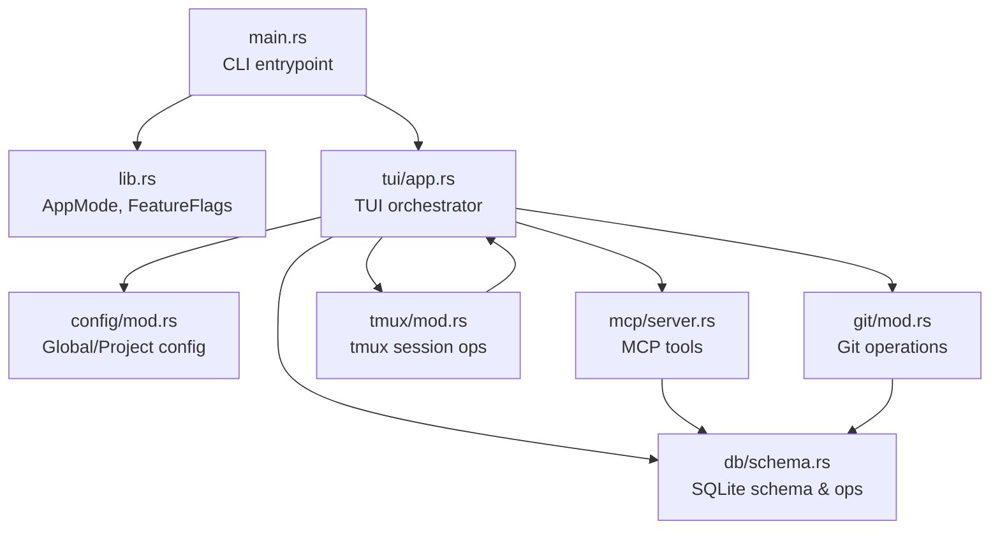
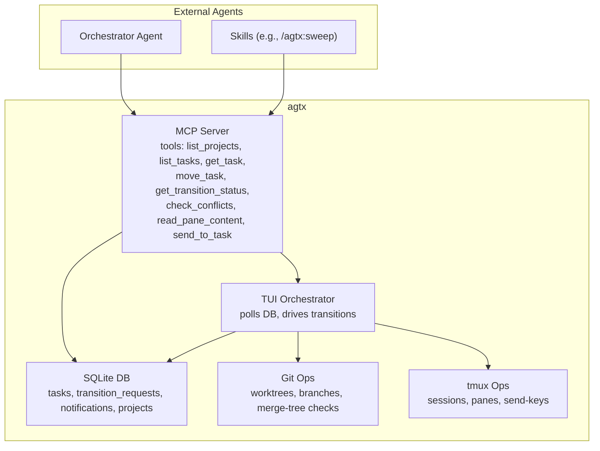
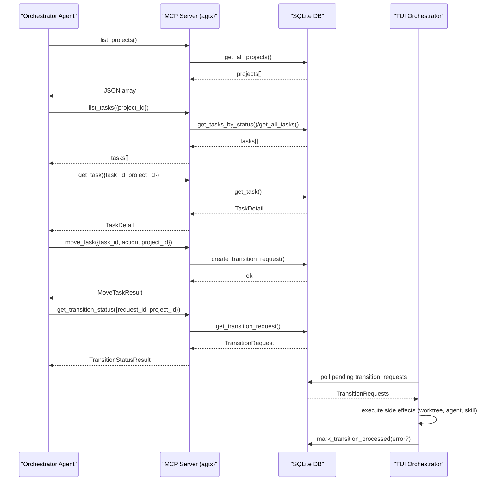
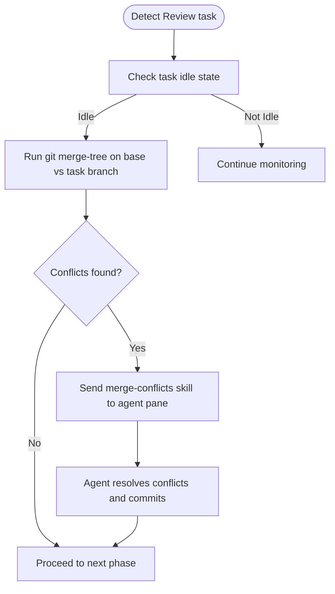
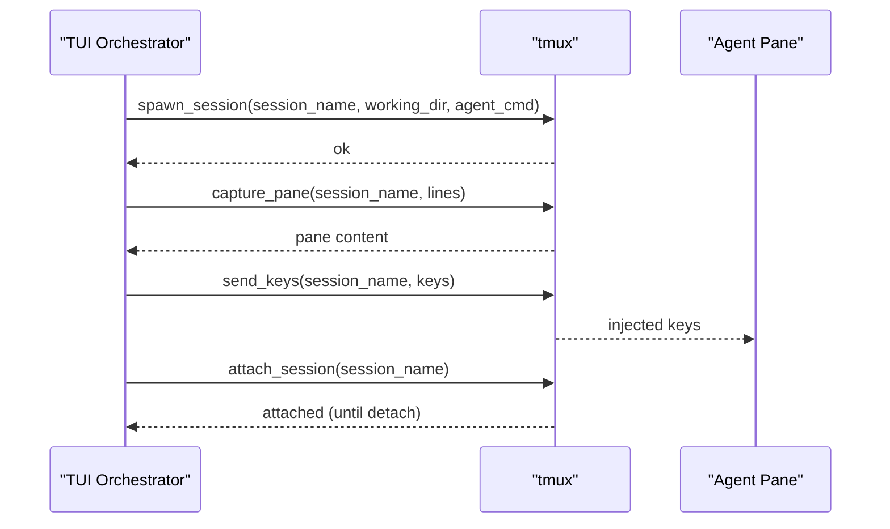
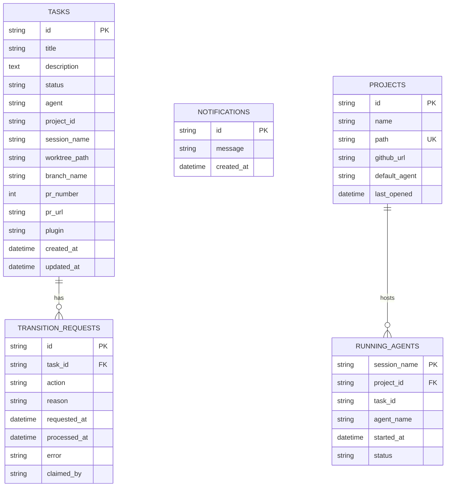
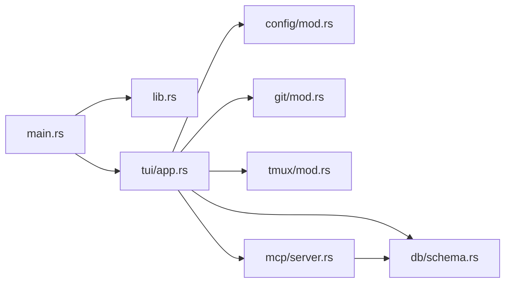

# Troubleshooting and Debugging

<cite>
**Referenced Files in This Document**
- [main.rs](file://src/main.rs)
- [lib.rs](file://src/lib.rs)
- [Cargo.toml](file://Cargo.toml)
- [README.md](file://README.md)
- [config/mod.rs](file://src/config/mod.rs)
- [db/mod.rs](file://src/db/mod.rs)
- [db/models.rs](file://src/db/models.rs)
- [db/schema.rs](file://src/db/schema.rs)
- [git/mod.rs](file://src/git/mod.rs)
- [mcp/mod.rs](file://src/mcp/mod.rs)
- [mcp/server.rs](file://src/mcp/server.rs)
- [tmux/mod.rs](file://src/tmux/mod.rs)
- [tui/app.rs](file://src/tui/app.rs)
</cite>

## Table of Contents
1. [Introduction](#introduction)
2. [Project Structure](#project-structure)
3. [Core Components](#core-components)
4. [Architecture Overview](#architecture-overview)
5. [Detailed Component Analysis](#detailed-component-analysis)
6. [Dependency Analysis](#dependency-analysis)
7. [Performance Considerations](#performance-considerations)
8. [Troubleshooting Guide](#troubleshooting-guide)
9. [Conclusion](#conclusion)
10. [Appendices](#appendices)

## Introduction
This document provides a comprehensive troubleshooting and debugging guide for advanced users and system administrators working with agtx. It focuses on:
- Systematic approaches to debugging agent interactions, including log analysis, state inspection, and communication flow tracing
- Conflict resolution methodologies for complex workflow scenarios (merge conflicts, agent coordination failures, database consistency issues)
- Diagnostic procedures for performance bottlenecks, memory leaks, and resource exhaustion
- Debugging techniques for MCP server communications, Git integration, and tmux session problems
- Step-by-step troubleshooting for multi-project coordination failures, persistent session corruption, and external integration issues
- Logging configuration options, debug mode activation, and diagnostic tool usage for system health monitoring

## Project Structure
Agtx is a Rust application with modular components:
- Entry point initializes modes and flags, then launches the TUI
- Configuration management for global and project-level settings
- Database layer for task state, transition requests, and notifications
- Git integration for worktrees, branches, and merge conflict detection
- MCP server exposing board tools to external agents
- tmux integration for agent sessions
- TUI orchestrating state transitions and diagnostics

**Diagram sources**
- [main.rs:16-96](file://src/main.rs#L16-L96)
- [lib.rs:12-24](file://src/lib.rs#L12-L24)
- [tui/app.rs:793-800](file://src/tui/app.rs#L793-L800)
- [config/mod.rs:230-274](file://src/config/mod.rs#L230-L274)
- [db/schema.rs:12-67](file://src/db/schema.rs#L12-L67)
- [git/mod.rs:18-26](file://src/git/mod.rs#L18-L26)
- [tmux/mod.rs:11-12](file://src/tmux/mod.rs#L11-L12)
- [mcp/server.rs:395-407](file://src/mcp/server.rs#L395-L407)

**Section sources**
- [main.rs:16-96](file://src/main.rs#L16-L96)
- [lib.rs:12-24](file://src/lib.rs#L12-L24)
- [README.md:506-547](file://README.md#L506-L547)

## Core Components
- CLI and Modes: Determines AppMode (Dashboard vs Project) and feature flags; delegates to MCP server mode when requested
- Configuration: Global and project-level TOML-backed configuration with merged defaults and theme options
- Database: Centralized SQLite storage for tasks, transition requests, notifications, and project metadata
- Git: Worktree management, branch operations, and non-destructive merge conflict detection
- MCP Server: JSON-RPC over stdio exposing board tools to orchestrator agents and skills
- tmux: Session lifecycle, pane capture, and key injection for agent interaction
- TUI: Orchestrator of state transitions, idle detection, conflict checks, and diagnostics

**Section sources**
- [main.rs:30-59](file://src/main.rs#L30-L59)
- [config/mod.rs:230-408](file://src/config/mod.rs#L230-L408)
- [db/schema.rs:12-67](file://src/db/schema.rs#L12-L67)
- [git/mod.rs:89-128](file://src/git/mod.rs#L89-L128)
- [mcp/server.rs:395-519](file://src/mcp/server.rs#L395-L519)
- [tmux/mod.rs:11-131](file://src/tmux/mod.rs#L11-L131)
- [tui/app.rs:496-609](file://src/tui/app.rs#L496-L609)

## Architecture Overview
The system integrates external agents via MCP, manages agent sessions via tmux, and tracks state in a SQLite database. The TUI polls for transition requests and orchestrates side effects (worktree creation, agent spawning, skill deployment, pane interaction).

**Diagram sources**
- [mcp/server.rs:521-755](file://src/mcp/server.rs#L521-L755)
- [db/schema.rs:97-208](file://src/db/schema.rs#L97-L208)
- [git/mod.rs:89-128](file://src/git/mod.rs#L89-L128)
- [tmux/mod.rs:11-131](file://src/tmux/mod.rs#L11-L131)
- [tui/app.rs:496-609](file://src/tui/app.rs#L496-L609)

## Detailed Component Analysis

### MCP Server Communication Flow
This sequence illustrates how an orchestrator agent interacts with agtx via MCP tools.

**Diagram sources**
- [mcp/server.rs:521-755](file://src/mcp/server.rs#L521-L755)
- [db/schema.rs:478-554](file://src/db/schema.rs#L478-L554)
- [tui/app.rs:496-609](file://src/tui/app.rs#L496-L609)

**Section sources**
- [mcp/server.rs:521-755](file://src/mcp/server.rs#L521-L755)
- [db/schema.rs:478-554](file://src/db/schema.rs#L478-L554)
- [tui/app.rs:496-609](file://src/tui/app.rs#L496-L609)

### Git Integration and Merge Conflict Resolution
Non-destructive conflict detection uses git merge-tree to identify conflicting files without modifying working trees. The TUI can trigger merge-conflict resolution skills when tasks reach Review and are idle.

**Diagram sources**
- [git/mod.rs:89-128](file://src/git/mod.rs#L89-L128)
- [tui/app.rs:571-581](file://src/tui/app.rs#L571-L581)

**Section sources**
- [git/mod.rs:89-128](file://src/git/mod.rs#L89-L128)
- [tui/app.rs:571-581](file://src/tui/app.rs#L571-L581)

### tmux Session Lifecycle and Diagnostics
tmux operations encapsulate session creation, listing, pane capture, and key injection. The TUI uses these to monitor agent activity and inject corrective input when needed.

**Diagram sources**
- [tmux/mod.rs:15-131](file://src/tmux/mod.rs#L15-L131)
- [tui/app.rs:656-677](file://src/tui/app.rs#L656-L677)

**Section sources**
- [tmux/mod.rs:15-131](file://src/tmux/mod.rs#L15-L131)
- [tui/app.rs:656-677](file://src/tui/app.rs#L656-L677)

### Database Schema and Consistency
The database maintains tasks, transition requests, notifications, and project metadata. It supports:
- Pending transition requests with atomic claiming and cleanup
- Project indexing for multi-project dashboards
- Timestamped state for diagnostics

**Diagram sources**
- [db/schema.rs:97-208](file://src/db/schema.rs#L97-L208)
- [db/models.rs:58-244](file://src/db/models.rs#L58-L244)

**Section sources**
- [db/schema.rs:97-208](file://src/db/schema.rs#L97-L208)
- [db/models.rs:58-244](file://src/db/models.rs#L58-L244)

## Dependency Analysis
- External libraries: tokio (async), rmcp (MCP server), rusqlite (SQLite), serde (serialization), directories (paths), chrono (timestamps), uuid (IDs)
- Internal modules: config, db, git, mcp, tmux, tui
- Coupling: TUI depends on config, db, git, tmux; MCP server depends on db; Git and tmux are leaf integrations

**Diagram sources**
- [main.rs:16-96](file://src/main.rs#L16-L96)
- [lib.rs:12-24](file://src/lib.rs#L12-L24)
- [tui/app.rs:793-800](file://src/tui/app.rs#L793-L800)
- [mcp/server.rs:395-407](file://src/mcp/server.rs#L395-L407)

**Section sources**
- [Cargo.toml:12-38](file://Cargo.toml#L12-L38)
- [main.rs:16-96](file://src/main.rs#L16-L96)
- [lib.rs:12-24](file://src/lib.rs#L12-L24)

## Performance Considerations
- Asynchronous operations: Tokio runtime powers MCP server and TUI event loops
- Database I/O: Batch operations (e.g., batch task creation) reduce transaction overhead
- Idle detection: Periodic pane capture and content hashing prevent excessive polling
- Resource limits: tmux server isolation prevents runaway agent sessions from consuming host resources

[No sources needed since this section provides general guidance]

## Troubleshooting Guide

### 1) Log Analysis and Debug Mode Activation
- Enable verbose logging by running agtx with the MCP server mode and inspecting stderr/stdout streams for JSON-RPC traffic and errors
- Use the MCP server’s stdio transport to capture tool invocations and responses
- For TUI diagnostics, rely on the internal state caches and periodic logs exposed by the application (no explicit debug flag is defined in the code)

**Section sources**
- [mcp/server.rs:395-407](file://src/mcp/server.rs#L395-L407)
- [tui/app.rs:496-609](file://src/tui/app.rs#L496-L609)

### 2) State Inspection and Database Diagnostics
- Locate the global index database and per-project databases under the config directory
- Inspect tasks, transition requests, and notifications to identify stalled transitions or inconsistent states
- Use the pending transition request table to verify claims and cleanup logic

**Section sources**
- [db/schema.rs:12-67](file://src/db/schema.rs#L12-L67)
- [db/schema.rs:478-554](file://src/db/schema.rs#L478-L554)

### 3) Communication Flow Tracing (MCP)
- Confirm MCP registration and tool availability by invoking list_projects and list_tasks
- Trace move_task requests by retrieving get_transition_status and verifying processed timestamps
- Validate project scoping: global vs project-scoped modes require correct project_id usage

**Section sources**
- [mcp/server.rs:521-755](file://src/mcp/server.rs#L521-L755)
- [README.md:573-603](file://README.md#L573-L603)

### 4) Conflict Resolution Methodologies
- Merge conflicts: Use git merge-tree to detect conflicts; when Review tasks are idle, dispatch the merge-conflicts skill and re-check
- Agent coordination failures: If a task stalls, read the pane content via MCP, then send targeted input via send_to_task
- Database consistency: After manual intervention, ensure transition_requests are marked processed and tasks reflect correct status

**Section sources**
- [git/mod.rs:89-128](file://src/git/mod.rs#L89-L128)
- [mcp/server.rs:757-800](file://src/mcp/server.rs#L757-L800)
- [tui/app.rs:571-581](file://src/tui/app.rs#L571-L581)

### 5) Performance Bottlenecks and Resource Exhaustion
- Monitor tmux sessions for orphaned or stuck panes; periodically list sessions and kill stale ones
- Reduce pane capture frequency if terminal rendering becomes sluggish
- Limit concurrent tasks to avoid overwhelming tmux and Git operations

**Section sources**
- [tmux/mod.rs:51-95](file://src/tmux/mod.rs#L51-L95)
- [tui/app.rs:656-677](file://src/tui/app.rs#L656-L677)

### 6) Git Integration Issues
- Verify repository detection and branch operations
- Use non-destructive merge conflict checks before attempting merges
- Clean up worktrees and branches after task completion if auto-cleanup is disabled

**Section sources**
- [git/mod.rs:18-26](file://src/git/mod.rs#L18-L26)
- [git/mod.rs:74-87](file://src/git/mod.rs#L74-L87)
- [config/mod.rs:160-189](file://src/config/mod.rs#L160-L189)

### 7) tmux Session Problems
- Validate tmux server name and session naming conventions
- Use attach_session to troubleshoot agent panes; use send_keys to inject corrective input
- Capture pane content to diagnose agent prompts and stalls

**Section sources**
- [tmux/mod.rs:11-131](file://src/tmux/mod.rs#L11-L131)
- [tui/app.rs:656-677](file://src/tui/app.rs#L656-L677)

### 8) Multi-Project Coordination Failures
- Ensure global mode MCP server is used when coordinating across projects; always pass project_id
- Verify project indexing in the global database and correct project path hashing
- Use list_projects to resolve project IDs before invoking per-project tools

**Section sources**
- [mcp/server.rs:413-429](file://src/mcp/server.rs#L413-L429)
- [db/schema.rs:402-476](file://src/db/schema.rs#L402-L476)

### 9) Persistent Session Corruption
- Identify orphaned sessions via list_sessions and kill stale sessions
- Rebuild task session names using the safe slug generator
- Clear stuck transition requests if cleanup logic fails

**Section sources**
- [tmux/mod.rs:51-95](file://src/tmux/mod.rs#L51-L95)
- [tmux/mod.rs:144-166](file://src/tmux/mod.rs#L144-L166)
- [db/schema.rs:545-554](file://src/db/schema.rs#L545-L554)

### 10) External Integration Problems
- Confirm agent skill compatibility and command translation per agent
- Validate plugin configuration and artifact detection timing
- Use MCP read_pane_content to diagnose agent prompts and auto-dismiss rules

**Section sources**
- [README.md:348-368](file://README.md#L348-L368)
- [config/mod.rs:410-451](file://src/config/mod.rs#L410-L451)
- [mcp/server.rs:99-136](file://src/mcp/server.rs#L99-L136)

## Conclusion
This guide outlined systematic approaches to diagnosing and resolving issues across agent interactions, MCP communications, Git operations, tmux sessions, and database consistency. By leveraging MCP tooling, tmux diagnostics, Git conflict checks, and database inspection, advanced users and system administrators can effectively troubleshoot complex workflows and maintain system health.

[No sources needed since this section summarizes without analyzing specific files]

## Appendices

### A) Logging and Debugging Options
- MCP stdio transport: Capture JSON-RPC messages for end-to-end tracing
- tmux operations: Use list/capture/send/attach to inspect and recover agent sessions
- Database queries: Inspect tasks, transition_requests, and notifications for state consistency

**Section sources**
- [mcp/server.rs:521-755](file://src/mcp/server.rs#L521-L755)
- [tmux/mod.rs:51-131](file://src/tmux/mod.rs#L51-L131)
- [db/schema.rs:97-208](file://src/db/schema.rs#L97-L208)

### B) Configuration Reference
- Global and project-level TOML configuration with theme, agent overrides, and worktree settings
- Merge defaults and validation logic for first-run actions

**Section sources**
- [config/mod.rs:230-408](file://src/config/mod.rs#L230-L408)
- [main.rs:63-89](file://src/main.rs#L63-L89)

### C) MCP Tools Quick Reference
- list_projects, list_tasks, get_task, move_task, get_transition_status, check_conflicts, get_notifications, read_pane_content, send_to_task

**Section sources**
- [mcp/server.rs:521-755](file://src/mcp/server.rs#L521-L755)
- [README.md:586-603](file://README.md#L586-L603)