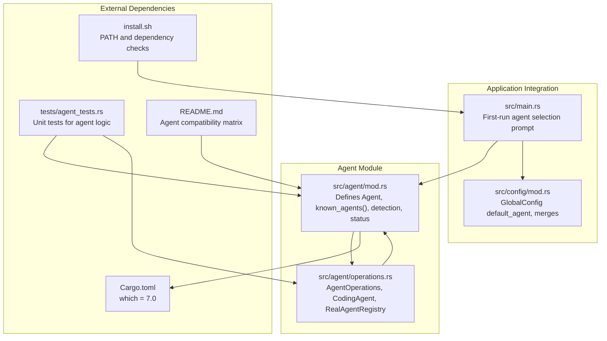
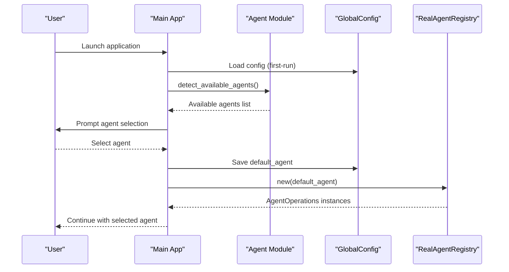
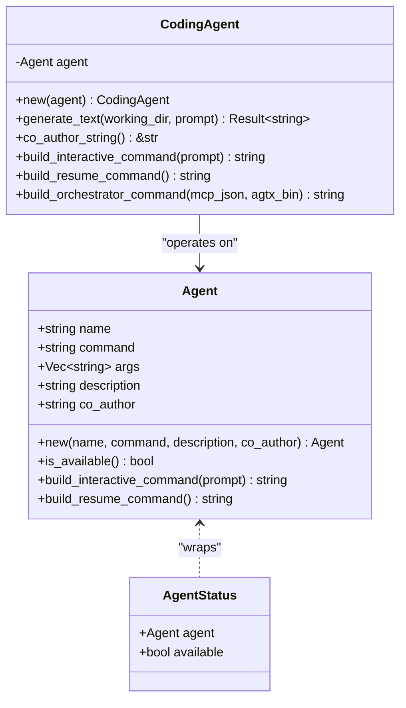
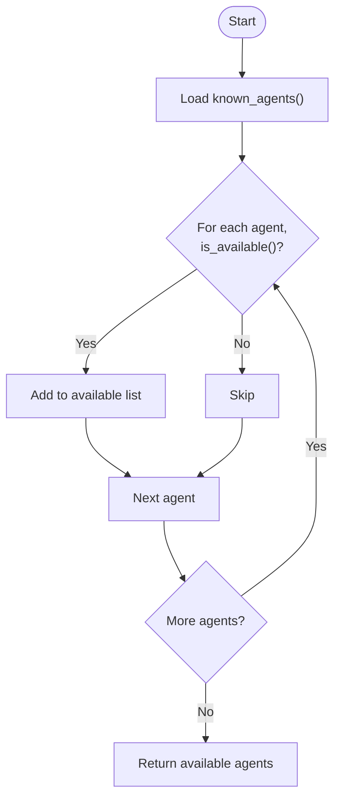
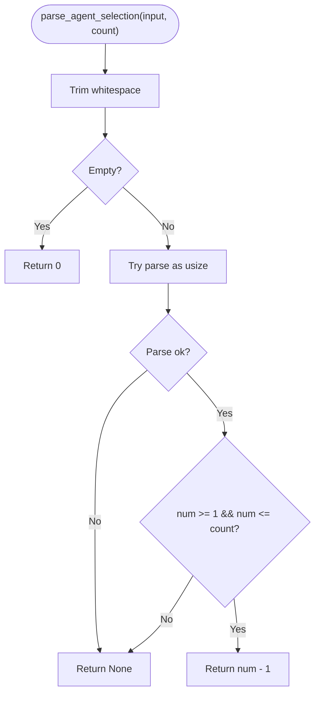
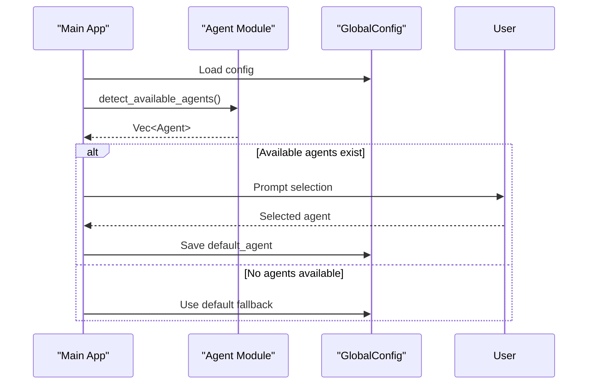
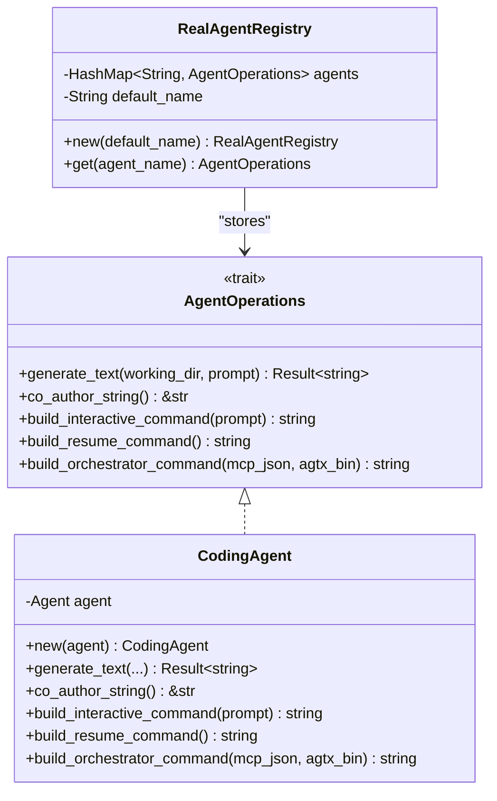
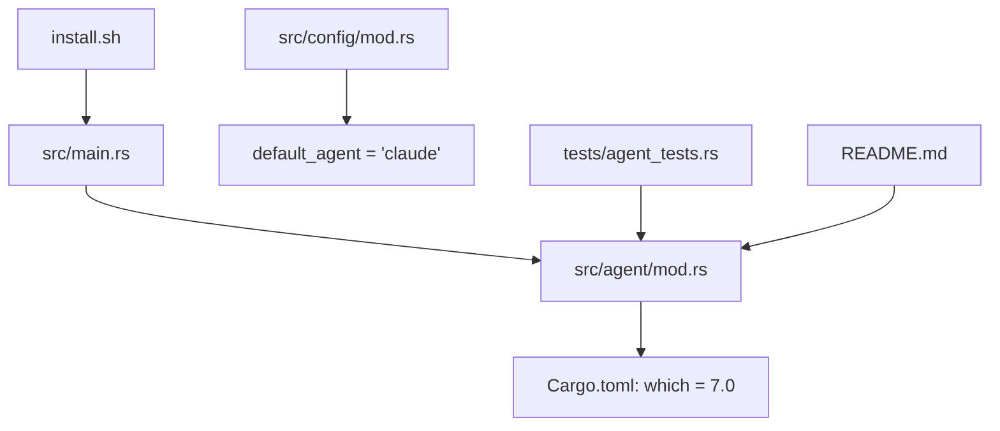

# Agent Detection and Compatibility

<cite>
**Referenced Files in This Document**
- [src/agent/mod.rs](file://src/agent/mod.rs)
- [src/agent/operations.rs](file://src/agent/operations.rs)
- [src/main.rs](file://src/main.rs)
- [src/config/mod.rs](file://src/config/mod.rs)
- [tests/agent_tests.rs](file://tests/agent_tests.rs)
- [install.sh](file://install.sh)
- [README.md](file://README.md)
- [Cargo.toml](file://Cargo.toml)
</cite>

## Table of Contents
1. [Introduction](#introduction)
2. [Project Structure](#project-structure)
3. [Core Components](#core-components)
4. [Architecture Overview](#architecture-overview)
5. [Detailed Component Analysis](#detailed-component-analysis)
6. [Dependency Analysis](#dependency-analysis)
7. [Performance Considerations](#performance-considerations)
8. [Troubleshooting Guide](#troubleshooting-guide)
9. [Conclusion](#conclusion)

## Introduction
This document explains the agent detection and compatibility system used by the application to automatically discover available AI coding platforms on the system. It covers how the system identifies agents using the `which::which` utility, defines supported agents, validates availability, displays status, parses user selections, and integrates with the broader application architecture.

## Project Structure
The agent detection and compatibility logic is primarily implemented in the agent module and its operations, with integration points in the main application and configuration system.

**Diagram sources**
- [src/agent/mod.rs:1-171](file://src/agent/mod.rs#L1-L171)
- [src/agent/operations.rs:1-163](file://src/agent/operations.rs#L1-L163)
- [src/main.rs:1-228](file://src/main.rs#L1-L228)
- [src/config/mod.rs:1-595](file://src/config/mod.rs#L1-L595)
- [Cargo.toml:31](file://Cargo.toml#L31)
- [tests/agent_tests.rs:1-221](file://tests/agent_tests.rs#L1-L221)
- [install.sh:145-173](file://install.sh#L145-L173)
- [README.md:348-368](file://README.md#L348-L368)

**Section sources**
- [src/agent/mod.rs:1-171](file://src/agent/mod.rs#L1-L171)
- [src/agent/operations.rs:1-163](file://src/agent/operations.rs#L1-L163)
- [src/main.rs:80-89](file://src/main.rs#L80-L89)
- [src/config/mod.rs:147-149](file://src/config/mod.rs#L147-L149)
- [Cargo.toml:31](file://Cargo.toml#L31)
- [tests/agent_tests.rs:1-221](file://tests/agent_tests.rs#L1-L221)
- [install.sh:145-173](file://install.sh#L145-L173)
- [README.md:348-368](file://README.md#L348-L368)

## Core Components
- Agent model: Defines agent metadata (name, command, args, description, co-author) and provides availability checks and command builders.
- Known agents: Centralized list of supported agents with their command-line interfaces and descriptions.
- Availability detection: Uses `which::which` to check if an agent’s command is available on the system.
- Status reporting: Enumerates all known agents and reports whether each is available.
- Selection parsing: Validates user input for agent selection, with sensible defaults.
- Registry: Maps agent names to operational implementations, with fallback to a default agent.

**Section sources**
- [src/agent/mod.rs:10-171](file://src/agent/mod.rs#L10-L171)
- [src/agent/operations.rs:16-163](file://src/agent/operations.rs#L16-L163)
- [src/main.rs:80-89](file://src/main.rs#L80-L89)
- [src/config/mod.rs:147-149](file://src/config/mod.rs#L147-L149)

## Architecture Overview
The agent detection system integrates with the application’s first-run flow and configuration. During first-run, the application detects available agents, prompts the user to select a default, and saves it to configuration. The registry then provides operational implementations for the chosen agents.

**Diagram sources**
- [src/main.rs:80-89](file://src/main.rs#L80-L89)
- [src/agent/mod.rs:124-130](file://src/agent/mod.rs#L124-L130)
- [src/config/mod.rs:230-256](file://src/config/mod.rs#L230-L256)
- [src/agent/operations.rs:119-151](file://src/agent/operations.rs#L119-L151)

## Detailed Component Analysis

### Agent Model and Known Agents
The Agent struct encapsulates agent identity and behavior. The known_agents() function defines supported agents and their metadata, including command names and descriptions. Availability is determined by checking if the command is resolvable via the system PATH.

**Diagram sources**
- [src/agent/mod.rs:10-77](file://src/agent/mod.rs#L10-L77)
- [src/agent/mod.rs:137-153](file://src/agent/mod.rs#L137-L153)
- [src/agent/operations.rs:44-108](file://src/agent/operations.rs#L44-L108)

Key behaviors:
- Availability check: Uses `which::which` to verify the agent command exists on PATH.
- Interactive command building: Generates agent-specific command lines with appropriate flags.
- Resume command building: Produces commands to continue the most recent session.
- Known agents: Includes Claude Code, Codex, Copilot, Gemini CLI, OpenCode, and Cursor Agent.

**Section sources**
- [src/agent/mod.rs:10-122](file://src/agent/mod.rs#L10-L122)
- [src/agent/mod.rs:31-77](file://src/agent/mod.rs#L31-L77)
- [src/agent/mod.rs:124-130](file://src/agent/mod.rs#L124-L130)
- [src/agent/mod.rs:137-153](file://src/agent/mod.rs#L137-L153)

### Agent Availability Detection and Status Reporting
The system provides two primary functions for availability assessment:
- detect_available_agents(): Filters known agents to those whose commands are resolvable.
- all_agent_status(): Returns a list of AgentStatus items indicating availability for each known agent.

**Diagram sources**
- [src/agent/mod.rs:124-130](file://src/agent/mod.rs#L124-L130)
- [src/agent/mod.rs:144-153](file://src/agent/mod.rs#L144-L153)

**Section sources**
- [src/agent/mod.rs:124-130](file://src/agent/mod.rs#L124-L130)
- [src/agent/mod.rs:144-153](file://src/agent/mod.rs#L144-L153)

### Agent Selection Parsing Logic
The parse_agent_selection() function handles user input for selecting an agent:
- Empty input defaults to the first agent (index 0).
- Numeric input is validated against the total number of known agents.
- Returns the 0-based index if valid, otherwise None.

**Diagram sources**
- [src/agent/mod.rs:155-169](file://src/agent/mod.rs#L155-L169)

**Section sources**
- [src/agent/mod.rs:155-169](file://src/agent/mod.rs#L155-L169)

### Integration with Application Startup and Configuration
During first-run, the application:
- Detects available agents.
- Prompts the user to select a default agent if any are available.
- Saves the selection to GlobalConfig.default_agent.

**Diagram sources**
- [src/main.rs:80-89](file://src/main.rs#L80-L89)
- [src/agent/mod.rs:124-130](file://src/agent/mod.rs#L124-L130)
- [src/config/mod.rs:230-256](file://src/config/mod.rs#L230-L256)

**Section sources**
- [src/main.rs:80-89](file://src/main.rs#L80-L89)
- [src/config/mod.rs:147-149](file://src/config/mod.rs#L147-L149)

### Agent Operations and Registry
The AgentOperations trait abstracts agent interactions, while CodingAgent provides a generic implementation. RealAgentRegistry builds a map of available agents keyed by name, with a configurable default fallback.

**Diagram sources**
- [src/agent/operations.rs:16-108](file://src/agent/operations.rs#L16-L108)
- [src/agent/operations.rs:119-162](file://src/agent/operations.rs#L119-L162)

**Section sources**
- [src/agent/operations.rs:16-108](file://src/agent/operations.rs#L16-L108)
- [src/agent/operations.rs:119-162](file://src/agent/operations.rs#L119-L162)

## Dependency Analysis
The agent detection system relies on the `which` crate to resolve executables on PATH. The main application integrates detection into first-run logic, and the configuration system stores the default agent choice.

**Diagram sources**
- [src/agent/mod.rs:33](file://src/agent/mod.rs#L33)
- [Cargo.toml:31](file://Cargo.toml#L31)
- [src/main.rs:80-89](file://src/main.rs#L80-L89)
- [src/config/mod.rs:147-149](file://src/config/mod.rs#L147-L149)
- [tests/agent_tests.rs:1-221](file://tests/agent_tests.rs#L1-L221)
- [install.sh:145-173](file://install.sh#L145-L173)
- [README.md:348-368](file://README.md#L348-L368)

**Section sources**
- [Cargo.toml:31](file://Cargo.toml#L31)
- [src/agent/mod.rs:33](file://src/agent/mod.rs#L33)
- [src/main.rs:80-89](file://src/main.rs#L80-L89)
- [src/config/mod.rs:147-149](file://src/config/mod.rs#L147-L149)
- [tests/agent_tests.rs:1-221](file://tests/agent_tests.rs#L1-L221)
- [install.sh:145-173](file://install.sh#L145-L173)
- [README.md:348-368](file://README.md#L348-L368)

## Performance Considerations
- Availability checks: Each agent’s availability is checked via a single PATH lookup using `which::which`. With six known agents, overhead is minimal.
- Command construction: Interactive and resume command builders are constant-time string operations.
- Registry population: Populating the registry iterates over known agents and filters by availability, which is linear in the number of known agents.

[No sources needed since this section provides general guidance]

## Troubleshooting Guide

Common agent detection issues and resolutions:
- PATH configuration problems
  - Symptom: Agents not detected despite being installed.
  - Resolution: Ensure the agent binaries are in a directory listed in PATH. The installer script warns if the installation directory is not in PATH and provides examples for bash and zsh.
  - Reference: [install.sh:120-132](file://install.sh#L120-L132)

- Missing executables
  - Symptom: Agent appears as unavailable.
  - Resolution: Verify the agent command resolves on PATH. The availability check uses `which::which` internally.
  - Reference: [src/agent/mod.rs:31-34](file://src/agent/mod.rs#L31-L34)

- Permission-related failures
  - Symptom: Command resolves but fails to execute.
  - Resolution: Ensure the agent binary is executable. On Unix-like systems, set executable permissions for the binary.
  - Reference: [install.sh:117-118](file://install.sh#L117-L118)

- Agent selection validation errors
  - Symptom: Invalid selection input leads to no agent being chosen.
  - Resolution: Use numeric input within the valid range or leave empty to select the first agent by default.
  - Reference: [src/agent/mod.rs:155-169](file://src/agent/mod.rs#L155-L169)

Compatibility requirements and installation verification:
- The README provides an agent compatibility matrix and installation steps for each supported agent.
- The installer script checks for required dependencies and optionally warns about missing optional tools.
- Reference: [README.md:348-368](file://README.md#L348-L368), [install.sh:145-173](file://install.sh#L145-L173)

**Section sources**
- [install.sh:120-132](file://install.sh#L120-L132)
- [src/agent/mod.rs:31-34](file://src/agent/mod.rs#L31-L34)
- [src/agent/mod.rs:155-169](file://src/agent/mod.rs#L155-L169)
- [README.md:348-368](file://README.md#L348-L368)
- [install.sh:145-173](file://install.sh#L145-L173)

## Conclusion
The agent detection and compatibility system centers on a small set of focused functions that leverage the `which` crate to resolve executables on PATH, combined with a clear registry and configuration integration. The design is extensible—adding a new agent involves updating the known agents list and command builders—and robust—providing sensible defaults and validation for user selection. The included tests and installer guidance support reliable operation across environments.