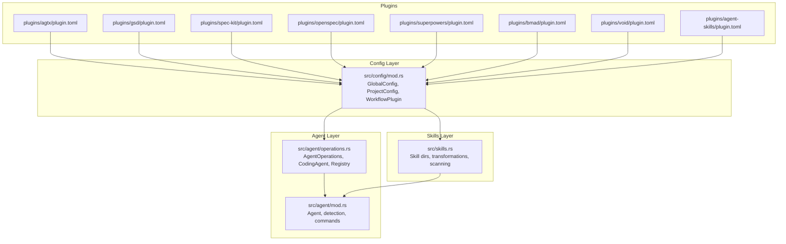
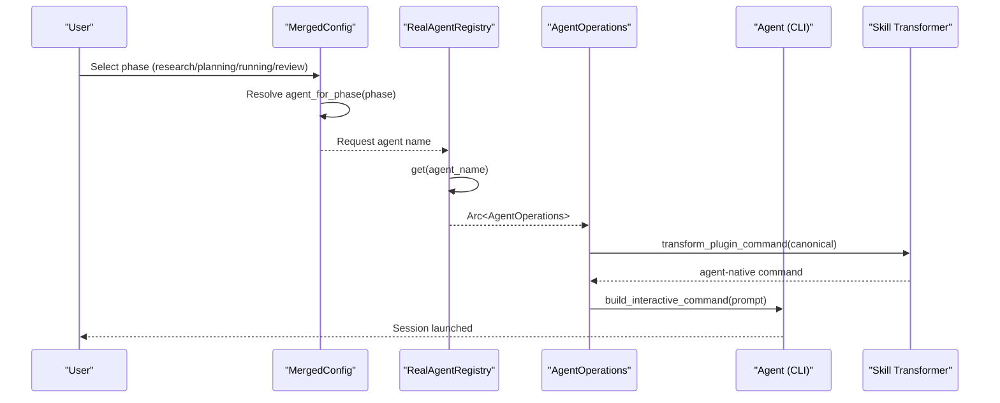
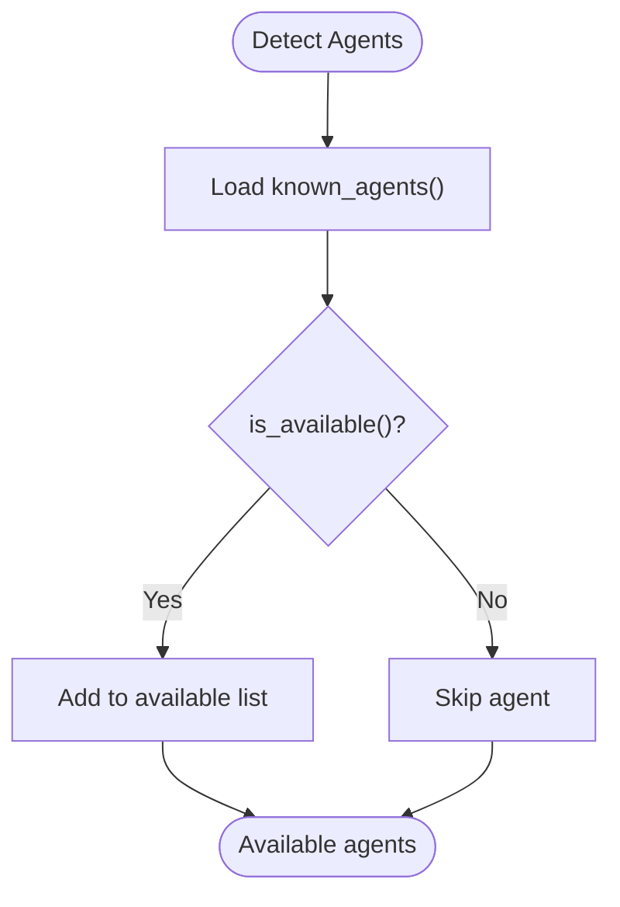
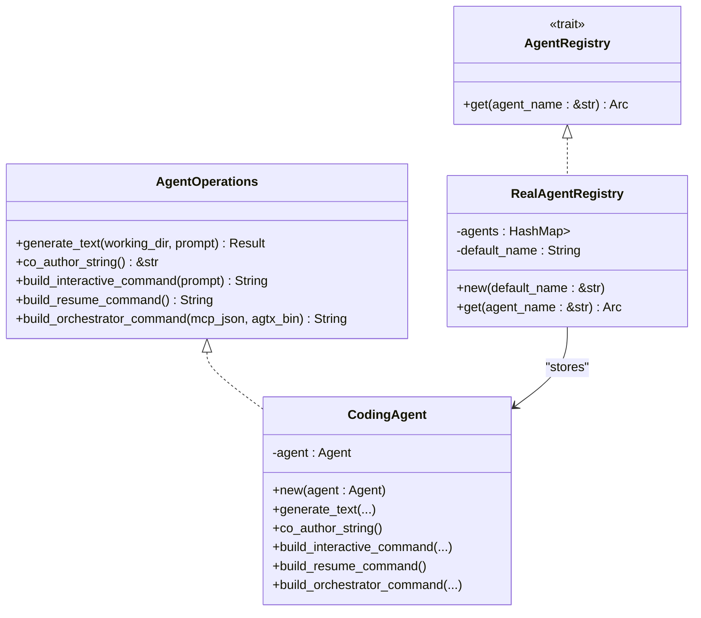
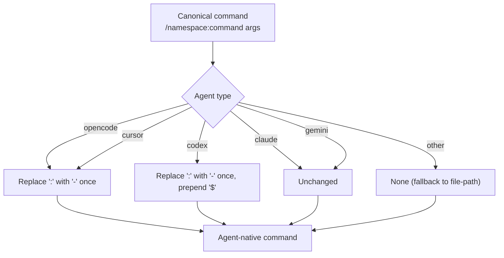
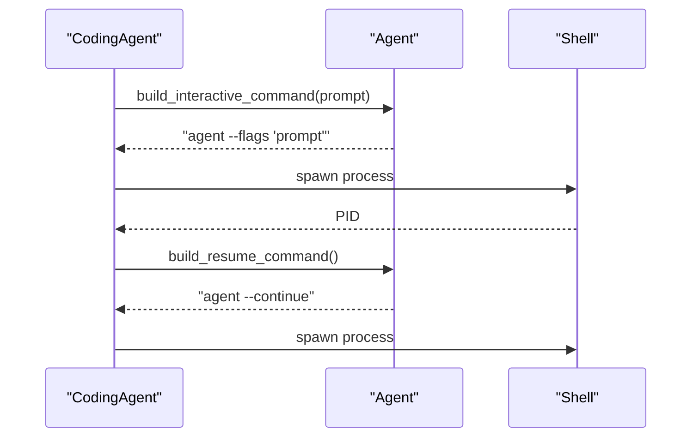
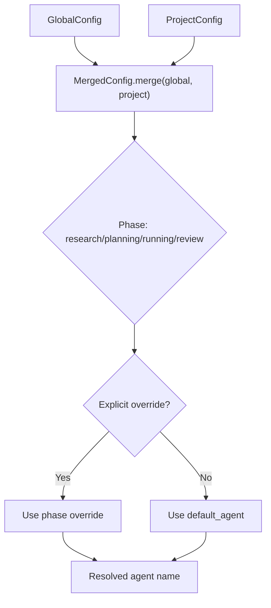
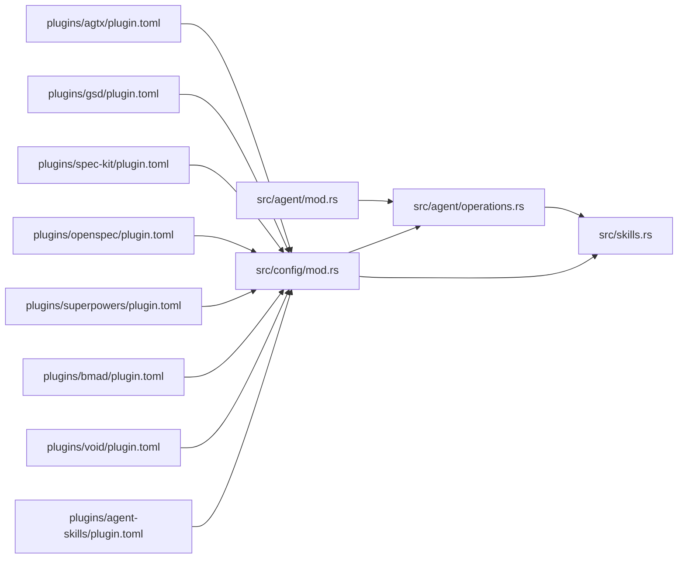

# Agent Integration

<cite>
**Referenced Files in This Document**
- [AGENTS.md](file://AGENTS.md)
- [CLAUDE.md](file://CLAUDE.md)
- [src/agent/mod.rs](file://src/agent/mod.rs)
- [src/agent/operations.rs](file://src/agent/operations.rs)
- [src/config/mod.rs](file://src/config/mod.rs)
- [src/skills.rs](file://src/skills.rs)
- [plugins/agtx/plugin.toml](file://plugins/agtx/plugin.toml)
- [plugins/agent-skills/plugin.toml](file://plugins/agent-skills/plugin.toml)
- [plugins/gsd/plugin.toml](file://plugins/gsd/plugin.toml)
- [plugins/spec-kit/plugin.toml](file://plugins/spec-kit/plugin.toml)
- [plugins/openspec/plugin.toml](file://plugins/openspec/plugin.toml)
- [plugins/superpowers/plugin.toml](file://plugins/superpowers/plugin.toml)
- [plugins/bmad/plugin.toml](file://plugins/bmad/plugin.toml)
- [plugins/void/plugin.toml](file://plugins/void/plugin.toml)
</cite>

## Table of Contents
1. [Introduction](#introduction)
2. [Project Structure](#project-structure)
3. [Core Components](#core-components)
4. [Architecture Overview](#architecture-overview)
5. [Detailed Component Analysis](#detailed-component-analysis)
6. [Dependency Analysis](#dependency-analysis)
7. [Performance Considerations](#performance-considerations)
8. [Troubleshooting Guide](#troubleshooting-guide)
9. [Conclusion](#conclusion)
10. [Appendices](#appendices)

## Introduction
This document explains how agtx integrates with AI coding agents and manages skill transformations across platforms. It covers:
- Agent detection and configuration for Claude Code, Codex, Gemini CLI, OpenCode, Cursor, and Copilot
- The skill transformation system that maps canonical commands into agent-specific invocation formats
- Multi-agent workflow configuration with per-phase agent selection and automatic session switching
- The agent registry and command construction patterns
- Compatibility matrices and limitations for plugins and agents
- Troubleshooting guidance for agent-specific issues, skill deployment, and session management
- Best practices for optimal performance across platforms

## Project Structure
The agent integration spans several modules:
- Agent detection and command building live in the agent module
- The agent registry resolves the appropriate agent per workflow phase
- Skill transformation utilities convert canonical commands to agent-native forms
- Plugin configurations define supported agents, commands, prompts, and artifact lifecycles

**Diagram sources**
- [src/agent/mod.rs:1-171](file://src/agent/mod.rs#L1-L171)
- [src/agent/operations.rs:1-163](file://src/agent/operations.rs#L1-L163)
- [src/config/mod.rs:1-595](file://src/config/mod.rs#L1-L595)
- [src/skills.rs:1-409](file://src/skills.rs#L1-L409)
- [plugins/agtx/plugin.toml:1-16](file://plugins/agtx/plugin.toml#L1-L16)
- [plugins/gsd/plugin.toml:1-34](file://plugins/gsd/plugin.toml#L1-L34)
- [plugins/spec-kit/plugin.toml:1-21](file://plugins/spec-kit/plugin.toml#L1-L21)
- [plugins/openspec/plugin.toml:1-21](file://plugins/openspec/plugin.toml#L1-L21)
- [plugins/superpowers/plugin.toml:1-16](file://plugins/superpowers/plugin.toml#L1-L16)
- [plugins/bmad/plugin.toml:1-22](file://plugins/bmad/plugin.toml#L1-L22)
- [plugins/void/plugin.toml:1-4](file://plugins/void/plugin.toml#L1-L4)
- [plugins/agent-skills/plugin.toml:1-19](file://plugins/agent-skills/plugin.toml#L1-L19)

**Section sources**
- [AGENTS.md:1-61](file://AGENTS.md#L1-L61)
- [CLAUDE.md](file://CLAUDE.md)

## Core Components
- Agent detection and availability: Known agents are defined and filtered by system presence. Detection builds a list of available agents.
- Agent command construction: Interactive and resume commands are tailored per agent, including platform-specific flags and modes.
- Agent registry: A registry maps agent names to implementations of AgentOperations, with a default fallback.
- Multi-phase agent selection: Global and project configurations support per-phase agent overrides.
- Skill transformation: Canonical commands are transformed into agent-native invocation formats.
- Plugin compatibility: Plugins declare supported agents and define commands/prompts/artifacts.

**Section sources**
- [src/agent/mod.rs:10-171](file://src/agent/mod.rs#L10-L171)
- [src/agent/operations.rs:17-163](file://src/agent/operations.rs#L17-L163)
- [src/config/mod.rs:5-595](file://src/config/mod.rs#L5-L595)
- [src/skills.rs:31-115](file://src/skills.rs#L31-L115)
- [plugins/gsd/plugin.toml:4](file://plugins/gsd/plugin.toml#L4)
- [plugins/superpowers/plugin.toml:3](file://plugins/superpowers/plugin.toml#L3)

## Architecture Overview
The agent integration architecture connects configuration, agent detection, registry resolution, and skill transformation to orchestrate multi-agent workflows.

**Diagram sources**
- [src/config/mod.rs:390-408](file://src/config/mod.rs#L390-L408)
- [src/agent/operations.rs:113-162](file://src/agent/operations.rs#L113-L162)
- [src/skills.rs:83-115](file://src/skills.rs#L83-L115)
- [src/agent/mod.rs:36-77](file://src/agent/mod.rs#L36-L77)

## Detailed Component Analysis

### Agent Detection and Configuration
- Known agents include Claude, Codex, Copilot, Gemini, OpenCode, and Cursor. Availability is checked via system PATH.
- Resume and interactive command builders tailor flags per agent (e.g., permissions, approval modes, continue/resume).
- Agent selection parsing supports default-first selection and numeric indices.

**Diagram sources**
- [src/agent/mod.rs:80-130](file://src/agent/mod.rs#L80-L130)

**Section sources**
- [src/agent/mod.rs:10-171](file://src/agent/mod.rs#L10-L171)

### Agent Registry and Multi-Agent Workflow
- RealAgentRegistry builds a map of available agents and ensures a default fallback exists even if not detected.
- Per-phase agent selection is resolved via merged configuration, falling back to default_agent when not overridden.

**Diagram sources**
- [src/agent/operations.rs:17-162](file://src/agent/operations.rs#L17-L162)

**Section sources**
- [src/agent/operations.rs:110-162](file://src/agent/operations.rs#L110-L162)
- [src/config/mod.rs:390-408](file://src/config/mod.rs#L390-L408)

### Skill Transformation System
- Canonical commands are in the form /namespace:command args.
- Transformations per agent:
  - Claude/Gemini: unchanged
  - OpenCode: replace first colon with hyphen
  - Codex: replace first colon with hyphen, prepend dollar sign
  - Cursor: replace first colon with hyphen (keep slash)
- Agent-native skill directories and filenames vary by agent; scanning enumerates available skills and descriptions.

**Diagram sources**
- [src/skills.rs:83-115](file://src/skills.rs#L83-L115)

**Section sources**
- [src/skills.rs:31-115](file://src/skills.rs#L31-L115)

### Command Construction Patterns and Agent-Specific Flags
- Interactive command construction includes agent-specific flags and optional initial prompts.
- Resume command construction recovers sessions after restarts using agent-specific resume/continue flags.

**Diagram sources**
- [src/agent/mod.rs:36-77](file://src/agent/mod.rs#L36-L77)
- [src/agent/operations.rs:55-108](file://src/agent/operations.rs#L55-L108)

**Section sources**
- [src/agent/mod.rs:36-77](file://src/agent/mod.rs#L36-L77)
- [src/agent/operations.rs:55-108](file://src/agent/operations.rs#L55-L108)

### Plugin Compatibility and Command Mapping
- Plugins define supported agents and map canonical commands to agent-native invocation formats.
- Built-in plugin “agtx” uses canonical commands with namespace “agtx”.

Examples of plugin command mappings:
- agtx plugin: /agtx:research, /agtx:plan, /agtx:execute, /agtx:review
- gsd plugin: /gsd:new-project, /gsd:discuss-phase {phase}, /gsd:plan-phase {phase}, /gsd:execute-phase {phase}, /gsd:verify-work {phase}
- spec-kit plugin: /speckit.specify, /speckit.plan, /speckit.implement, /speckit.analyze
- openspec plugin: /opsx:propose {task}, /opsx:apply, /opsx:verify
- superpowers plugin: /superpowers commands (Claude-only)
- bmad plugin: /bmad:* commands
- agent-skills plugin: /spec, /plan, /build, /review

Supported agents per plugin:
- gsd: ["claude", "codex", "gemini", "opencode"]
- superpowers: ["claude"]
- agent-skills: depends on agent-specific installation steps

**Section sources**
- [plugins/agtx/plugin.toml:11-16](file://plugins/agtx/plugin.toml#L11-L16)
- [plugins/gsd/plugin.toml:15-21](file://plugins/gsd/plugin.toml#L15-L21)
- [plugins/spec-kit/plugin.toml:14-18](file://plugins/spec-kit/plugin.toml#L14-L18)
- [plugins/openspec/plugin.toml:11-14](file://plugins/openspec/plugin.toml#L11-L14)
- [plugins/superpowers/plugin.toml:1-16](file://plugins/superpowers/plugin.toml#L1-16)
- [plugins/bmad/plugin.toml:10-13](file://plugins/bmad/plugin.toml#L10-L13)
- [plugins/agent-skills/plugin.toml:14-18](file://plugins/agent-skills/plugin.toml#L14-L18)
- [plugins/gsd/plugin.toml:4](file://plugins/gsd/plugin.toml#L4)
- [plugins/superpowers/plugin.toml:3](file://plugins/superpowers/plugin.toml#L3)

### Multi-Agent Workflow Configuration
- GlobalConfig supports default_agent and per-phase overrides (research, planning, running, review).
- ProjectConfig mirrors these settings and merges with GlobalConfig to produce MergedConfig.
- MergedConfig.agent_for_phase resolves the effective agent for a given phase, with explicit overrides taking precedence.

**Diagram sources**
- [src/config/mod.rs:357-408](file://src/config/mod.rs#L357-L408)

**Section sources**
- [src/config/mod.rs:5-228](file://src/config/mod.rs#L5-L228)
- [src/config/mod.rs:357-408](file://src/config/mod.rs#L357-L408)

### Agent-Native Skill Discovery and Deployment
- Agent-native directories differ by agent:
  - Claude/Copilot: .claude/commands/<namespace>/... or .github/agents/<namespace>/...
  - Gemini: .gemini/commands/<namespace>.toml
  - Codex: .codex/skills/<skill>/SKILL.md
  - Cursor: .cursor/skills/<skill>/SKILL.md
  - OpenCode: .config/opencode/command/<command>.md
- Scanning enumerates commands and descriptions from agent-native locations.
- Skill transformation utilities convert canonical skill names to agent-native filenames and command names.

**Section sources**
- [src/skills.rs:31-81](file://src/skills.rs#L31-L81)
- [src/skills.rs:259-408](file://src/skills.rs#L259-L408)

## Dependency Analysis
The following diagram shows key dependencies among modules and plugins:

**Diagram sources**
- [src/agent/mod.rs:1-171](file://src/agent/mod.rs#L1-L171)
- [src/agent/operations.rs:1-163](file://src/agent/operations.rs#L1-L163)
- [src/config/mod.rs:1-595](file://src/config/mod.rs#L1-L595)
- [src/skills.rs:1-409](file://src/skills.rs#L1-L409)
- [plugins/agtx/plugin.toml:1-16](file://plugins/agtx/plugin.toml#L1-L16)
- [plugins/gsd/plugin.toml:1-34](file://plugins/gsd/plugin.toml#L1-L34)
- [plugins/spec-kit/plugin.toml:1-21](file://plugins/spec-kit/plugin.toml#L1-L21)
- [plugins/openspec/plugin.toml:1-21](file://plugins/openspec/plugin.toml#L1-L21)
- [plugins/superpowers/plugin.toml:1-16](file://plugins/superpowers/plugin.toml#L1-L16)
- [plugins/bmad/plugin.toml:1-22](file://plugins/bmad/plugin.toml#L1-L22)
- [plugins/void/plugin.toml:1-4](file://plugins/void/plugin.toml#L1-L4)
- [plugins/agent-skills/plugin.toml:1-19](file://plugins/agent-skills/plugin.toml#L1-L19)

**Section sources**
- [src/agent/mod.rs:1-171](file://src/agent/mod.rs#L1-L171)
- [src/agent/operations.rs:1-163](file://src/agent/operations.rs#L1-L163)
- [src/config/mod.rs:1-595](file://src/config/mod.rs#L1-L595)
- [src/skills.rs:1-409](file://src/skills.rs#L1-L409)

## Performance Considerations
- Prefer detecting agents once at startup and caching availability to avoid repeated PATH checks.
- Use per-phase agent selection judiciously; avoid frequent switching between agents to minimize session overhead.
- For plugins with prompt triggers, tune polling intervals to reduce unnecessary tmux pane queries.
- When using orchestrator mode, ensure MCP registration cleanup does not block interactive sessions.

## Troubleshooting Guide
Common issues and resolutions:

- Agent not detected
  - Ensure the agent’s CLI is installed and on PATH. The detection logic checks command availability.
  - Verify the agent’s interactive and resume commands are supported on your platform.

- Skill deployment fails
  - Confirm agent-native directories exist and are writable.
  - For Gemini, ensure TOML command files are properly formatted with description and prompt fields.
  - For Codex/Cursor, ensure SKILL.md exists in the expected skill directory.

- Session management failures
  - Use the resume command builder to recover sessions after restarts.
  - For Claude orchestrator mode, ensure MCP registration is cleaned up before re-registration.

- Plugin compatibility errors
  - Check plugin.supported_agents for allowed agents.
  - If a plugin requires initialization scripts, ensure they are executed before invoking plugin commands.

- Command transformation mismatches
  - Verify canonical commands match the agent’s expected invocation format.
  - For OpenCode/Cursor, confirm the first colon is replaced with a hyphen; for Codex, also prepend a dollar sign.

**Section sources**
- [src/agent/mod.rs:32-48](file://src/agent/mod.rs#L32-L48)
- [src/agent/operations.rs:92-107](file://src/agent/operations.rs#L92-L107)
- [src/skills.rs:128-139](file://src/skills.rs#L128-L139)
- [plugins/gsd/plugin.toml:4](file://plugins/gsd/plugin.toml#L4)
- [plugins/superpowers/plugin.toml:3](file://plugins/superpowers/plugin.toml#L3)

## Conclusion
Agtx provides a robust foundation for multi-agent AI coding workflows by:
- Detecting and configuring agents with platform-specific command flags
- Resolving per-phase agents via global and project configuration
- Transforming canonical commands into agent-native invocation formats
- Supporting plugin-defined commands, prompts, and artifacts with explicit compatibility declarations

Adopting the best practices and troubleshooting guidance in this document will help you achieve reliable, efficient, and portable agent integrations across Claude Code, Codex, Gemini CLI, OpenCode, Cursor, and Copilot.

## Appendices

### Compatibility Matrix
- gsd plugin: compatible with Claude, Codex, Gemini, OpenCode
- superpowers plugin: compatible with Claude
- agent-skills plugin: depends on agent-specific installation steps
- spec-kit, openspec, bmad, void: no explicit supported_agents; consult plugin documentation for agent-specific notes

**Section sources**
- [plugins/gsd/plugin.toml:4](file://plugins/gsd/plugin.toml#L4)
- [plugins/superpowers/plugin.toml:3](file://plugins/superpowers/plugin.toml#L3)
- [plugins/agent-skills/plugin.toml:1-19](file://plugins/agent-skills/plugin.toml#L1-L19)
- [plugins/spec-kit/plugin.toml:1-21](file://plugins/spec-kit/plugin.toml#L1-L21)
- [plugins/openspec/plugin.toml:1-21](file://plugins/openspec/plugin.toml#L1-L21)
- [plugins/bmad/plugin.toml:1-22](file://plugins/bmad/plugin.toml#L1-L22)
- [plugins/void/plugin.toml:1-4](file://plugins/void/plugin.toml#L1-L4)