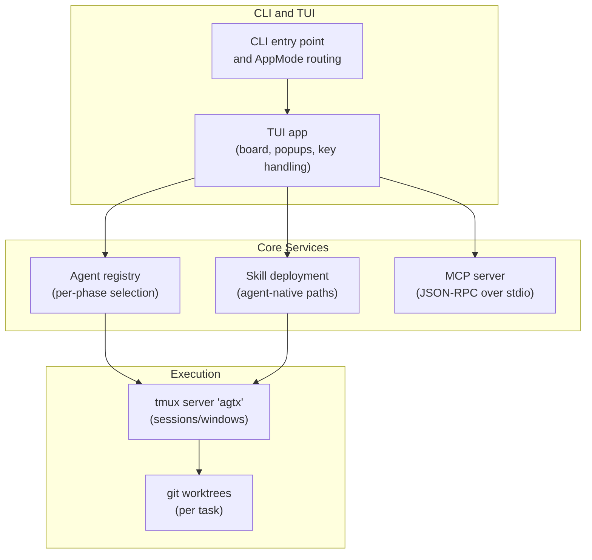
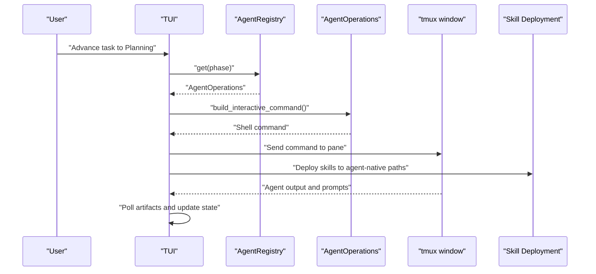
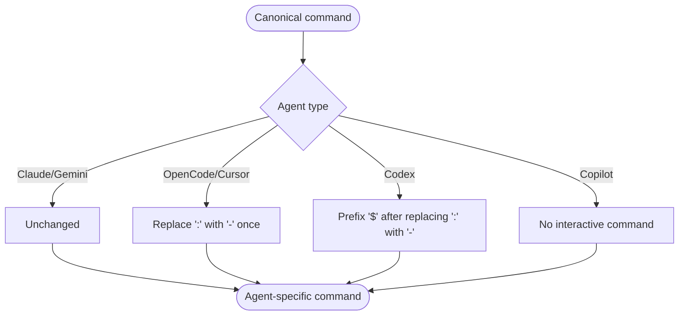
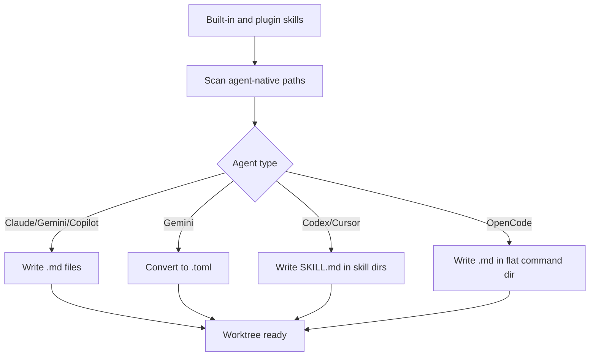
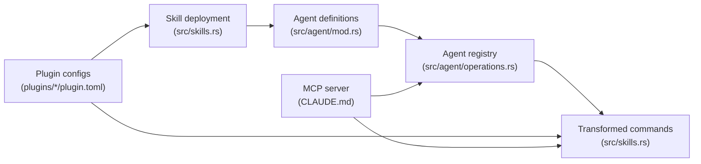

# Agent Integration

<cite>
**Referenced Files in This Document**
- [README.md](file://README.md)
- [AGENTS.md](file://AGENTS.md)
- [CLAUDE.md](file://CLAUDE.md)
- [src/agent/mod.rs](file://src/agent/mod.rs)
- [src/agent/operations.rs](file://src/agent/operations.rs)
- [src/skills.rs](file://src/skills.rs)
- [plugins/agtx/plugin.toml](file://plugins/agtx/plugin.toml)
- [plugins/agent-skills/plugin.toml](file://plugins/agent-skills/plugin.toml)
- [plugins/gsd/plugin.toml](file://plugins/gsd/plugin.toml)
- [plugins/openspec/plugin.toml](file://plugins/openspec/plugin.toml)
- [plugins/bmad/plugin.toml](file://plugins/bmad/plugin.toml)
- [plugins/superpowers/plugin.toml](file://plugins/superpowers/plugin.toml)
</cite>

## Table of Contents
1. [Introduction](#introduction)
2. [Project Structure](#project-structure)
3. [Core Components](#core-components)
4. [Architecture Overview](#architecture-overview)
5. [Detailed Component Analysis](#detailed-component-analysis)
6. [Dependency Analysis](#dependency-analysis)
7. [Performance Considerations](#performance-considerations)
8. [Troubleshooting Guide](#troubleshooting-guide)
9. [Conclusion](#conclusion)
10. [Appendices](#appendices)

## Introduction
This document explains how AGTX coordinates multiple AI coding agents in parallel. It covers supported agents, the agent command transformation system, per-phase agent configuration, practical multi-agent workflows, agent-specific considerations, troubleshooting, and the agent skill deployment system.

## Project Structure
At a high level, AGTX orchestrates tasks across phases (Backlog → Planning → Running → Review → Done), each running in its own tmux window and git worktree. Plugins define commands, prompts, and artifacts per phase. Skills are deployed to agent-native discovery paths and commands are transformed per agent.

**Diagram sources**
- [CLAUDE.md: Architecture:23-92](file://CLAUDE.md#L23-L92)
- [README.md: Architecture:506-547](file://README.md#L506-L547)

**Section sources**
- [CLAUDE.md: Architecture:23-92](file://CLAUDE.md#L23-L92)
- [README.md: Architecture:506-547](file://README.md#L506-L547)

## Core Components
- Agent detection and spawning: Known agents are defined and detected; interactive/resume commands are constructed per agent.
- Agent registry: Provides per-phase agent selection with a default fallback.
- Command transformation: Canonical commands are transformed to agent-specific formats.
- Skill deployment: Built-in and plugin skills are deployed to agent-native discovery paths.
- Plugins: Define commands, prompts, artifacts, and gating per phase.

**Section sources**
- [src/agent/mod.rs: Known agents and command builders:10-122](file://src/agent/mod.rs#L10-L122)
- [src/agent/operations.rs: Agent registry and orchestrator command:110-162](file://src/agent/operations.rs#L110-L162)
- [src/skills.rs: Command transformation and skill deployment:31-115](file://src/skills.rs#L31-L115)

## Architecture Overview
AGTX integrates agents by:
- Detecting available agents and constructing appropriate interactive/resume commands.
- Deploying skills to agent-native discovery locations in each worktree.
- Transforming canonical commands into agent-specific invocations.
- Managing tmux windows per task and git worktrees per phase.
- Using MCP to expose board tools to agents (for orchestrator and skills).

**Diagram sources**
- [src/agent/operations.rs: Agent registry and commands:110-162](file://src/agent/operations.rs#L110-L162)
- [src/skills.rs: Skill deployment and transformations:31-115](file://src/skills.rs#L31-L115)
- [CLAUDE.md: Session persistence and tmux:148-190](file://CLAUDE.md#L148-L190)

**Section sources**
- [src/agent/operations.rs: Agent registry and orchestrator command:110-162](file://src/agent/operations.rs#L110-L162)
- [src/skills.rs: Skill deployment and transformations:31-115](file://src/skills.rs#L31-L115)
- [CLAUDE.md: Session persistence and tmux:148-190](file://CLAUDE.md#L148-L190)

## Detailed Component Analysis

### Supported Agents
AGTX supports the following agents: Claude Code, Codex, Gemini CLI, Cursor Agent, Copilot, and OpenCode. Each agent’s interactive/resume command and capability are defined in the agent module.

- Interactive command construction and resume command construction are implemented per agent.
- Availability detection uses the system PATH for each agent binary.

Capabilities and limitations:
- Claude and Gemini support agent-native skills and interactive commands.
- Codex uses a dollar-prefixed skill invocation format and SKILL.md files in skill directories.
- Cursor uses SKILL.md files in a skills directory and invokes skills with a leading slash.
- Copilot does not support interactive skill invocation; prompts are handled without commands.
- OpenCode uses a flat command directory and a dash-based naming convention.

**Section sources**
- [src/agent/mod.rs: Known agents and command builders:10-122](file://src/agent/mod.rs#L10-L122)
- [src/agent/mod.rs: Interactive and resume command builders:36-76](file://src/agent/mod.rs#L36-L76)
- [src/skills.rs: Agent-native skill directories and command formats:31-81](file://src/skills.rs#L31-L81)

### Agent Command Transformation System
Canonical commands are written once in plugin TOML using a namespace and command format. AGTX transforms them per agent:
- Claude/Gemini: Unchanged.
- OpenCode/Cursor: Colon replaced with a hyphen.
- Codex: Slash replaced with a dollar sign, and colon replaced with a hyphen.
- Copilot: No interactive skill invocation (prompt only).

**Diagram sources**
- [src/skills.rs: transform_plugin_command:93-115](file://src/skills.rs#L93-L115)

**Section sources**
- [src/skills.rs: transform_plugin_command:93-115](file://src/skills.rs#L93-L115)
- [README.md: Agent compatibility table:348-368](file://README.md#L348-L368)

### Per-Phase Agent Configuration
AGTX allows assigning different agents to different workflow phases. Configuration is global and project-scoped:
- Global default agent and per-phase overrides in the global config.
- Project-level overrides in the project config take precedence over global settings.
- The agent registry resolves the appropriate AgentOperations per phase.

Example configuration patterns:
- Global config sets default agent and per-phase agents.
- Project config overrides specific phases.

**Section sources**
- [README.md: Per-phase agent configuration:308-327](file://README.md#L308-L327)
- [src/agent/operations.rs: Agent registry resolution:153-162](file://src/agent/operations.rs#L153-L162)

### Practical Multi-Agent Workflows
A common pattern assigns agents to distinct phases:
- Research: Gemini (research-focused).
- Planning: Claude (structured planning).
- Implementation: Cursor (editing and execution).
- Review: Codex (code review and quality checks).

Workflow steps:
- Configure per-phase agents in the global or project config.
- Create tasks; AGTX deploys skills and sends the agent-specific command for each phase.
- Artifacts signal readiness; AGTX advances the task automatically or via orchestrator.

**Section sources**
- [README.md: Multi-agent task lifecycle:62-63](file://README.md#L62-L63)
- [README.md: Per-phase agent configuration:308-327](file://README.md#L308-L327)

### Agent-Specific Considerations
- Authentication and setup:
  - Claude: Register MCP server and install plugin; use continue/resume flags.
  - Codex: Add MCP server and configure marketplace; skills deployed under .codex/skills.
  - Gemini: Add MCP server and copy skill context.
  - Cursor: Add MCP server and copy skills to .cursor/skills.
  - Copilot: No interactive skill invocation; rely on prompts.
  - OpenCode: Add MCP server and deploy commands to .config/opencode/command.
- API limits and performance:
  - Each agent has distinct rate limits and latency characteristics.
  - Use per-phase configuration to balance load and leverage agent strengths.
- Session persistence:
  - tmux windows persist across phases; resume commands reconnect to existing sessions.

**Section sources**
- [README.md: Agent installation and setup:186-256](file://README.md#L186-L256)
- [src/agent/mod.rs: Resume and interactive commands:36-76](file://src/agent/mod.rs#L36-L76)
- [CLAUDE.md: Session persistence and tmux:148-190](file://CLAUDE.md#L148-L190)

### Troubleshooting Guide
Common issues and resolutions:
- Agent not detected:
  - Verify the agent binary is installed and on PATH.
  - Confirm availability via agent status checks.
- Command execution problems:
  - Ensure the agent-specific command transformation matches the agent’s expected format.
  - Check prompt triggers and auto-dismiss rules for interactive prompts.
- Skill deployment failures:
  - Confirm agent-native skill directories exist and are writable.
  - Validate skill filenames and frontmatter for each agent.
- MCP connectivity:
  - Re-register the MCP server for the agent.
  - Use project-scoped mode when the orchestrator is bound to a specific project.

**Section sources**
- [src/agent/mod.rs: Agent availability and detection:31-34](file://src/agent/mod.rs#L31-L34)
- [src/skills.rs: Skill deployment and scanning:259-408](file://src/skills.rs#L259-L408)
- [README.md: MCP server modes and tools:573-602](file://README.md#L573-L602)

### Agent Skill Deployment System
Skills are deployed to agent-native discovery paths:
- Claude: .claude/commands/<namespace>/<command>.md
- Gemini: .gemini/commands/<namespace>/<command>.toml (converted from SKILL.md)
- Codex: .codex/skills/<skill-dir>/SKILL.md
- Cursor: .cursor/skills/<skill-dir>/SKILL.md
- OpenCode: .opencode/command/<command>.md
- Copilot: .github/agents/<namespace>/<command>.md

AGTX:
- Scans built-in and plugin skills.
- Converts SKILL.md content to agent-specific formats (e.g., TOML for Gemini).
- Writes files to the appropriate agent-native paths in each worktree.

**Diagram sources**
- [src/skills.rs: agent_native_skill_dir and helpers:31-81](file://src/skills.rs#L31-L81)
- [src/skills.rs: scan_agent_skills:259-408](file://src/skills.rs#L259-L408)

**Section sources**
- [src/skills.rs: agent_native_skill_dir and helpers:31-81](file://src/skills.rs#L31-L81)
- [src/skills.rs: scan_agent_skills:259-408](file://src/skills.rs#L259-L408)
- [CLAUDE.md: Skill system and canonical paths:131-147](file://CLAUDE.md#L131-L147)

## Dependency Analysis
The agent integration relies on:
- Agent definitions and command builders.
- Agent registry for per-phase selection.
- Skill deployment to agent-native paths.
- Plugin configuration for commands, prompts, and artifacts.
- MCP server for orchestrator and skills.

**Diagram sources**
- [src/agent/mod.rs: Known agents:80-122](file://src/agent/mod.rs#L80-L122)
- [src/agent/operations.rs: Agent registry:119-162](file://src/agent/operations.rs#L119-L162)
- [src/skills.rs: Transform and deployment:31-115](file://src/skills.rs#L31-L115)
- [CLAUDE.md: MCP server:50-54](file://CLAUDE.md#L50-L54)

**Section sources**
- [src/agent/mod.rs: Known agents:80-122](file://src/agent/mod.rs#L80-L122)
- [src/agent/operations.rs: Agent registry:119-162](file://src/agent/operations.rs#L119-L162)
- [src/skills.rs: Transform and deployment:31-115](file://src/skills.rs#L31-L115)
- [CLAUDE.md: MCP server:50-54](file://CLAUDE.md#L50-L54)

## Performance Considerations
- Parallelism: Each task runs in its own tmux window and git worktree, enabling multiple agents to operate concurrently.
- Artifact-driven gating: Phase advancement is artifact-based, reducing unnecessary retries.
- Prompt triggers and auto-dismiss: Reduce idle time by waiting for interactive prompts and dismissing them automatically.
- Orchestrator mode: Reduces manual intervention by advancing tasks when artifacts are ready.

[No sources needed since this section provides general guidance]

## Troubleshooting Guide
- Connectivity:
  - Re-add MCP server registrations for agents.
  - Verify project-scoped vs global MCP modes.
- Command execution:
  - Confirm canonical-to-agent transformation is correct.
  - Check prompt triggers and auto-dismiss rules.
- Skills:
  - Ensure agent-native directories exist and are writable.
  - Validate skill filenames and frontmatter.
- Session recovery:
  - Use resume commands to reconnect to existing tmux sessions.

**Section sources**
- [README.md: MCP server modes and tools:573-602](file://README.md#L573-L602)
- [src/skills.rs: scan_agent_skills:259-408](file://src/skills.rs#L259-L408)
- [src/agent/mod.rs: Resume and interactive commands:36-76](file://src/agent/mod.rs#L36-L76)

## Conclusion
AGTX provides a robust framework for coordinating multiple AI coding agents in parallel. Its per-phase agent configuration, canonical-to-agent command transformation, and agent-native skill deployment enable flexible, scalable workflows. With MCP support and artifact-driven gating, AGTX streamlines multi-agent collaboration across research, planning, implementation, and review.

[No sources needed since this section summarizes without analyzing specific files]

## Appendices

### Agent Compatibility Matrix
- Claude, Gemini, Codex, OpenCode, Cursor support interactive skills and commands.
- Copilot supports prompts but not interactive skill invocation.
- Agent-specific command formats are applied automatically.

**Section sources**
- [README.md: Agent compatibility table:348-368](file://README.md#L348-L368)

### Example Plugin Configurations
- agtx: Built-in workflow with skills and prompts.
- agent-skills: Production-grade skills with agent-specific setup.
- gsd: Structured spec-driven development with preresearch and cyclic phases.
- openspec: Lightweight specification framework with copy-back artifacts.
- bmad: AI-driven agile development with planning and implementation artifacts.
- superpowers: Brainstorming, plans, TDD, and subagent-driven development.

**Section sources**
- [plugins/agtx/plugin.toml:1-16](file://plugins/agtx/plugin.toml#L1-L16)
- [plugins/agent-skills/plugin.toml:1-19](file://plugins/agent-skills/plugin.toml#L1-L19)
- [plugins/gsd/plugin.toml:1-34](file://plugins/gsd/plugin.toml#L1-L34)
- [plugins/openspec/plugin.toml:1-21](file://plugins/openspec/plugin.toml#L1-L21)
- [plugins/bmad/plugin.toml:1-22](file://plugins/bmad/plugin.toml#L1-L22)
- [plugins/superpowers/plugin.toml:1-16](file://plugins/superpowers/plugin.toml#L1-L16)