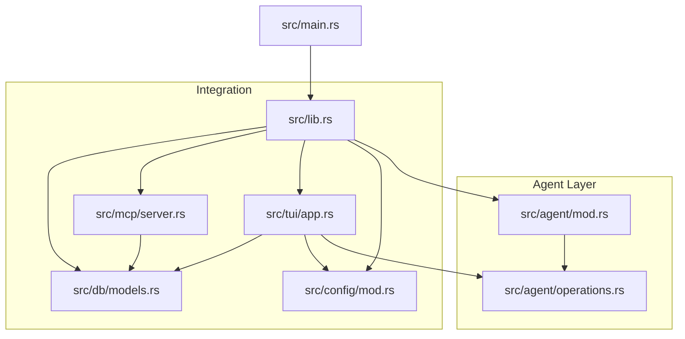
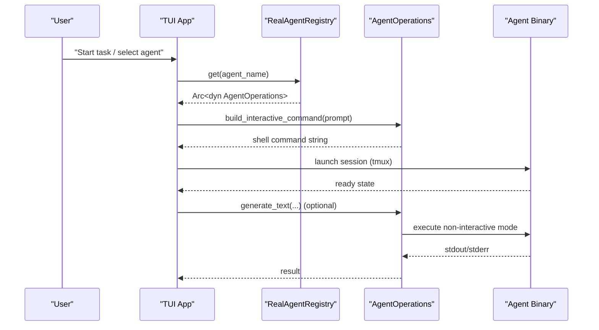
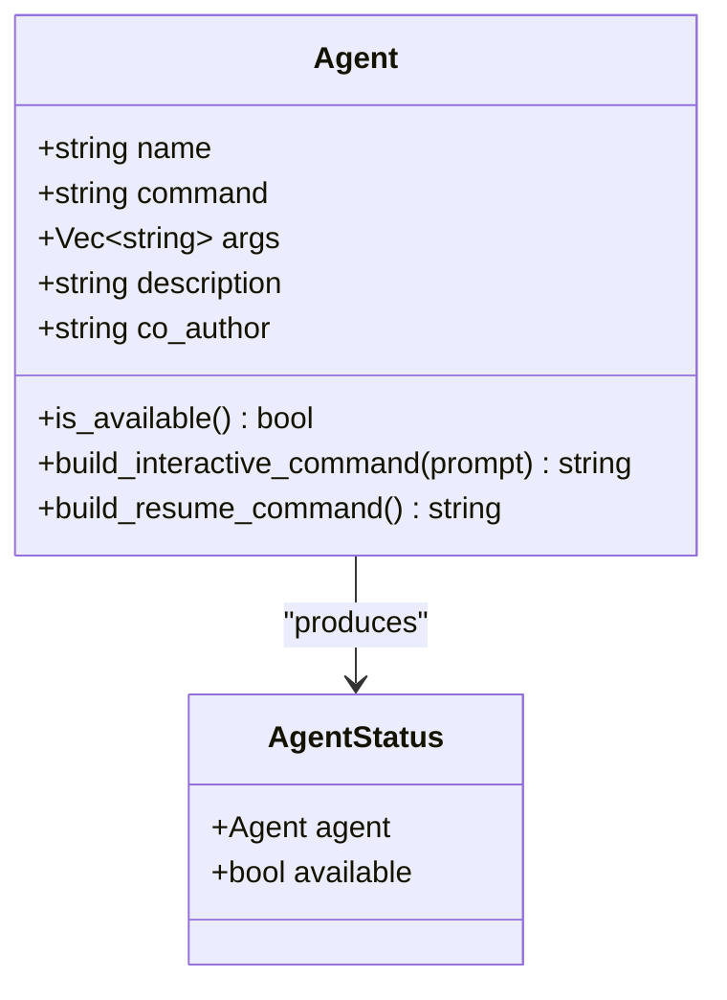
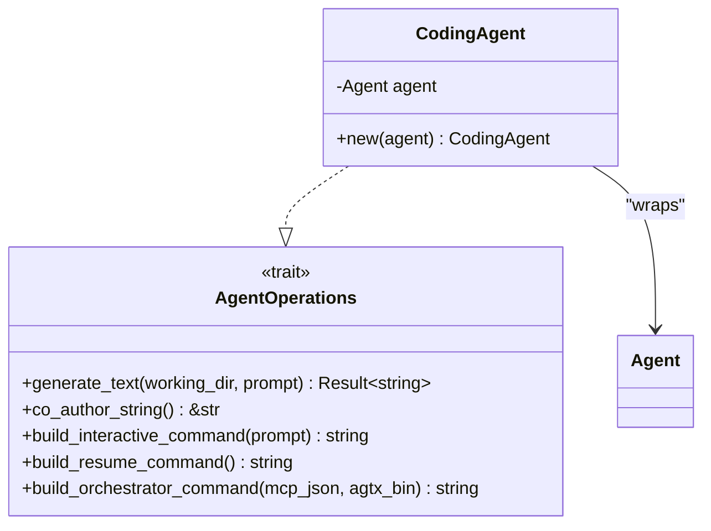
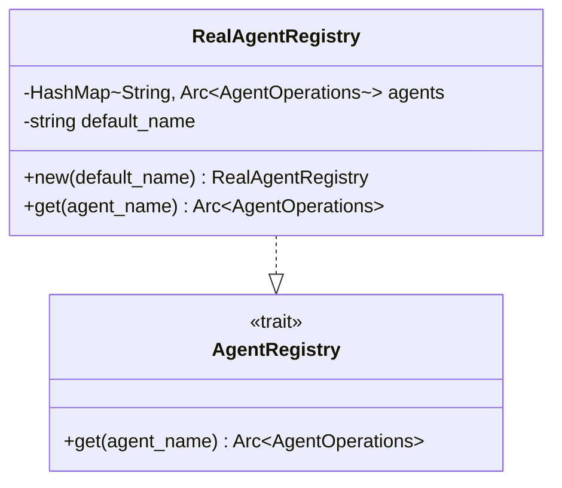
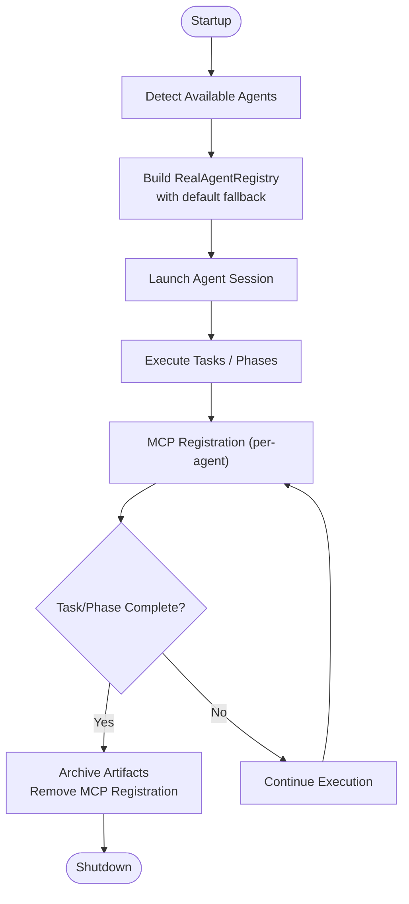
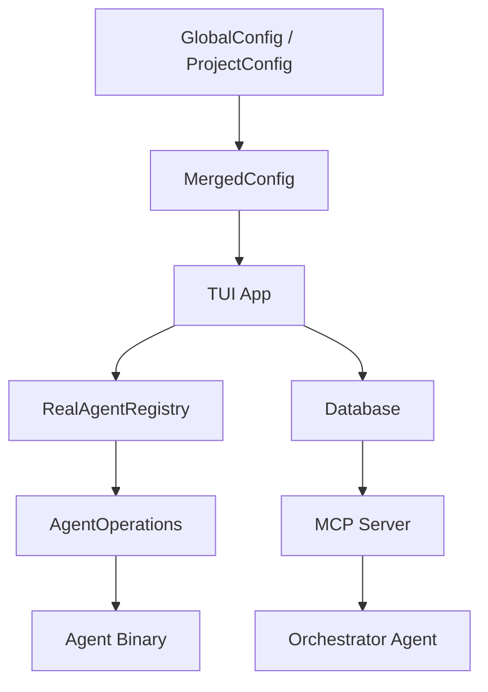
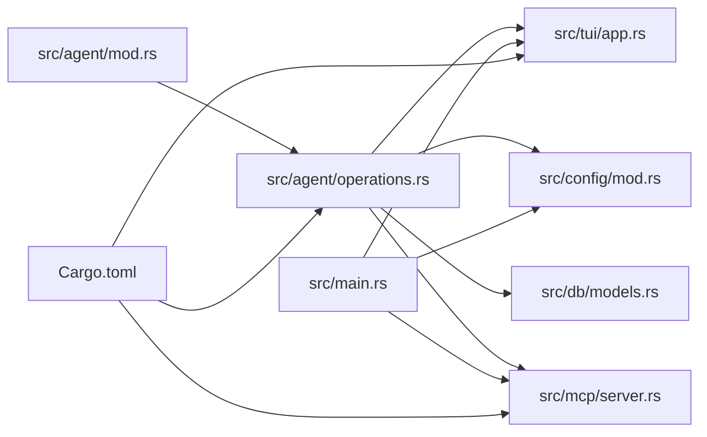

# Agent Registry and Management

<cite>
**Referenced Files in This Document**
- [src/agent/mod.rs](file://src/agent/mod.rs)
- [src/agent/operations.rs](file://src/agent/operations.rs)
- [src/main.rs](file://src/main.rs)
- [src/lib.rs](file://src/lib.rs)
- [src/config/mod.rs](file://src/config/mod.rs)
- [src/db/models.rs](file://src/db/models.rs)
- [src/tui/app.rs](file://src/tui/app.rs)
- [src/mcp/server.rs](file://src/mcp/server.rs)
- [AGENTS.md](file://AGENTS.md)
- [README.md](file://README.md)
- [Cargo.toml](file://Cargo.toml)
- [tests/agent_tests.rs](file://tests/agent_tests.rs)
- [tests/mock_infrastructure_tests.rs](file://tests/mock_infrastructure_tests.rs)
</cite>

## Table of Contents
1. [Introduction](#introduction)
2. [Project Structure](#project-structure)
3. [Core Components](#core-components)
4. [Architecture Overview](#architecture-overview)
5. [Detailed Component Analysis](#detailed-component-analysis)
6. [Dependency Analysis](#dependency-analysis)
7. [Performance Considerations](#performance-considerations)
8. [Troubleshooting Guide](#troubleshooting-guide)
9. [Conclusion](#conclusion)
10. [Appendices](#appendices)

## Introduction
This document explains AGTX’s agent registry system and agent management capabilities. It covers how agents are discovered, registered, selected, and executed; how the default agent fallback mechanism ensures resilience; and how the broader AGTX ecosystem integrates agent orchestration with the Model Context Protocol (MCP). It also provides guidance on extending the registry with custom agents, implementing health monitoring, and managing agent lifecycles, resources, and concurrency.

## Project Structure
The agent registry and management logic is primarily implemented under the agent module, with integration points across configuration, TUI, MCP server, and database models. The top-level library module re-exports agent-related types for public consumption.

**Diagram sources**
- [src/agent/mod.rs:1-171](file://src/agent/mod.rs#L1-L171)
- [src/agent/operations.rs:1-163](file://src/agent/operations.rs#L1-L163)
- [src/lib.rs:1-24](file://src/lib.rs#L1-L24)
- [src/main.rs:1-228](file://src/main.rs#L1-L228)
- [src/config/mod.rs:1-595](file://src/config/mod.rs#L1-L595)
- [src/db/models.rs:170-219](file://src/db/models.rs#L170-L219)
- [src/tui/app.rs:1-200](file://src/tui/app.rs#L1-L200)
- [src/mcp/server.rs:1-200](file://src/mcp/server.rs#L1-L200)

**Section sources**
- [src/lib.rs:1-24](file://src/lib.rs#L1-L24)
- [src/main.rs:1-228](file://src/main.rs#L1-L228)
- [AGENTS.md:1-61](file://AGENTS.md#L1-L61)

## Core Components
- Agent data model and discovery:
  - Agent struct defines agent metadata and provides availability checks and command builders.
  - Known agents and detection utilities enumerate and filter available agents.
- Agent operations abstraction:
  - AgentOperations trait defines the contract for agent interactions (text generation, co-author string, interactive/resume command building).
  - CodingAgent wraps a concrete Agent into the AgentOperations interface.
- Agent registry:
  - AgentRegistry trait abstracts agent lookup by name with fallback to a default agent.
  - RealAgentRegistry builds a registry from detected agents and guarantees the default agent is present.

Key responsibilities:
- Discovery: Detect available agents at runtime.
- Registration: Populate the registry with detected agents and ensure default fallback.
- Selection: Resolve agent by name with graceful fallback.
- Execution: Provide command construction for interactive and orchestrator modes.

**Section sources**
- [src/agent/mod.rs:10-171](file://src/agent/mod.rs#L10-L171)
- [src/agent/operations.rs:16-163](file://src/agent/operations.rs#L16-L163)

## Architecture Overview
The agent registry sits at the center of agent orchestration. The TUI and MCP server coordinate task lifecycle transitions, while the registry supplies the appropriate AgentOperations implementation for each phase and action.

**Diagram sources**
- [src/agent/operations.rs:113-162](file://src/agent/operations.rs#L113-L162)
- [src/agent/operations.rs:44-108](file://src/agent/operations.rs#L44-L108)
- [src/tui/app.rs:5647-5680](file://src/tui/app.rs#L5647-L5680)

## Detailed Component Analysis

### Agent Data Model and Availability Detection
- Agent struct encapsulates name, command, args, description, and co-author identity.
- Availability is determined by checking the presence of the agent command on PATH.
- Command builders support interactive and resume modes tailored per agent.

**Diagram sources**
- [src/agent/mod.rs:10-77](file://src/agent/mod.rs#L10-L77)
- [src/agent/mod.rs:137-153](file://src/agent/mod.rs#L137-L153)

**Section sources**
- [src/agent/mod.rs:10-171](file://src/agent/mod.rs#L10-L171)

### Agent Operations Abstraction
- AgentOperations defines the interface for agent interactions:
  - Non-interactive text generation.
  - Co-author string for commit attribution.
  - Interactive and resume command construction.
  - Orchestrator command composition (MCP-aware for supported agents).
- CodingAgent implements AgentOperations for any Agent, mapping agent-specific commands to concrete invocations.

**Diagram sources**
- [src/agent/operations.rs:16-42](file://src/agent/operations.rs#L16-L42)
- [src/agent/operations.rs:44-108](file://src/agent/operations.rs#L44-L108)

**Section sources**
- [src/agent/operations.rs:16-108](file://src/agent/operations.rs#L16-L108)

### Agent Registry and Default Fallback
- AgentRegistry trait:
  - Provides get(agent_name) returning Arc<dyn AgentOperations>.
  - Implements fallback to a configured default agent when the requested agent is unknown or unavailable.
- RealAgentRegistry:
  - Populates agents from detected known agents.
  - Ensures the default agent is present even if not detected as available.
  - Returns the default agent when lookup fails.

**Diagram sources**
- [src/agent/operations.rs:113-162](file://src/agent/operations.rs#L113-L162)

**Section sources**
- [src/agent/operations.rs:113-162](file://src/agent/operations.rs#L113-L162)

### Programmatic Registration and Dynamic Management
- At startup, the application detects available agents and may prompt the user to select a default agent if none is configured.
- The registry is constructed with the chosen default, ensuring fallback availability even if the agent binary is missing at runtime.
- Tests demonstrate mocking the registry for deterministic behavior and verifying fallback semantics.

Practical steps:
- Construct a RealAgentRegistry with a desired default agent name.
- Use the registry’s get method to obtain an AgentOperations instance for a given task or phase.
- If an agent becomes unavailable later, the registry transparently falls back to the default.

**Section sources**
- [src/main.rs:80-89](file://src/main.rs#L80-L89)
- [src/agent/operations.rs:126-150](file://src/agent/operations.rs#L126-L150)
- [tests/mock_infrastructure_tests.rs:205-219](file://tests/mock_infrastructure_tests.rs#L205-L219)

### Agent Lifecycle Management
- Startup:
  - Detect available agents and initialize the registry with the default agent.
  - Build interactive commands to launch agent sessions (tmux panes).
- Execution:
  - For non-interactive tasks, invoke generate_text to produce output.
  - For orchestrator mode, construct MCP-aware commands and register/unregister tools locally.
- Shutdown and Cleanup:
  - Clean up MCP registrations upon agent termination.
  - Archive artifacts and remove worktrees as part of task lifecycle cleanup.

**Diagram sources**
- [src/agent/operations.rs:92-107](file://src/agent/operations.rs#L92-L107)
- [src/tui/app.rs:6991-7022](file://src/tui/app.rs#L6991-L7022)

**Section sources**
- [src/agent/operations.rs:92-107](file://src/agent/operations.rs#L92-L107)
- [src/tui/app.rs:6991-7022](file://src/tui/app.rs#L6991-L7022)

### Agent Resource Management and Concurrency Limits
- Resource management:
  - Each task uses isolated git worktrees and tmux windows/sessions.
  - Artifacts are archived before worktree removal to preserve evidence.
- Concurrency:
  - The orchestrator advances tasks based on notifications and allowed actions; it does not enforce strict concurrency limits.
  - Users control which tasks enter Planning/Running concurrently; the system advances completed phases without polling.

Guidance:
- Limit simultaneous agent sessions by controlling how many tasks are moved into Planning/Running.
- Use MCP idle signaling to avoid busy-waiting; rely on push notifications to drive progress.

**Section sources**
- [src/tui/app.rs:5647-5680](file://src/tui/app.rs#L5647-L5680)
- [README.md:621-646](file://README.md#L621-L646)

### Extending the Agent Registry with Custom Agents
- Add a new agent definition to the known agents list with name, command, description, and co-author.
- Ensure the agent binary is available on PATH for detection.
- If the agent is not detected, the registry still exposes it via the default fallback.
- For orchestrator support, extend the orchestrator command builder to handle MCP registration for the new agent.

Implementation pointers:
- Extend the known agents enumeration and availability checks.
- Implement or reuse AgentOperations for the new agent.
- Optionally add a dedicated match arm in the orchestrator command builder.

**Section sources**
- [src/agent/mod.rs:80-122](file://src/agent/mod.rs#L80-L122)
- [src/agent/operations.rs:126-150](file://src/agent/operations.rs#L126-L150)
- [src/agent/operations.rs:92-107](file://src/agent/operations.rs#L92-L107)

### Agent Health Monitoring and Availability Detection
- Availability detection:
  - The system checks PATH for each known agent command.
  - Status queries return availability per agent.
- Health monitoring:
  - The TUI tracks RunningAgent status and transitions.
  - Notifications and MCP idle signals indicate agent readiness and progress.
  - For stuck agents, the orchestrator can send nudges or escalate to the user.

**Section sources**
- [src/agent/mod.rs:124-153](file://src/agent/mod.rs#L124-L153)
- [src/db/models.rs:186-212](file://src/db/models.rs#L186-L212)
- [src/mcp/server.rs:16-24](file://src/mcp/server.rs#L16-L24)

### Integration with the Broader AGTX Ecosystem
- Configuration:
  - Global and project-level configuration define default agents and per-phase agent overrides.
  - Merged configuration resolves agent selection for each phase.
- TUI:
  - Builds interactive commands and coordinates task lifecycle transitions.
  - Manages tmux sessions and agent pane readiness.
- MCP:
  - Exposes board tools to orchestrator agents.
  - Supports project-scoped and global server modes.
  - Orchestrator agents use MCP to advance tasks and receive notifications.

**Diagram sources**
- [src/config/mod.rs:337-408](file://src/config/mod.rs#L337-L408)
- [src/tui/app.rs:5647-5680](file://src/tui/app.rs#L5647-L5680)
- [src/mcp/server.rs:16-24](file://src/mcp/server.rs#L16-L24)

**Section sources**
- [src/config/mod.rs:337-408](file://src/config/mod.rs#L337-L408)
- [src/tui/app.rs:5647-5680](file://src/tui/app.rs#L5647-L5680)
- [src/mcp/server.rs:16-24](file://src/mcp/server.rs#L16-L24)
- [README.md:621-646](file://README.md#L621-L646)

## Dependency Analysis
- Internal dependencies:
  - Agent operations depend on the Agent data model and command builders.
  - RealAgentRegistry depends on known agents and availability detection.
  - TUI and MCP server depend on AgentOperations and configuration.
- External dependencies:
  - which for PATH-based availability checks.
  - tokio for async runtime.
  - rmcp for MCP server capabilities.

**Diagram sources**
- [src/agent/mod.rs:1-171](file://src/agent/mod.rs#L1-L171)
- [src/agent/operations.rs:1-163](file://src/agent/operations.rs#L1-L163)
- [src/main.rs:1-228](file://src/main.rs#L1-L228)
- [Cargo.toml:1-50](file://Cargo.toml#L1-L50)

**Section sources**
- [Cargo.toml:1-50](file://Cargo.toml#L1-L50)
- [src/agent/operations.rs:1-163](file://src/agent/operations.rs#L1-L163)
- [src/main.rs:1-228](file://src/main.rs#L1-L228)

## Performance Considerations
- Avoid repeated PATH scans by caching availability at registry initialization.
- Use non-blocking MCP idle signaling to prevent polling loops.
- Keep agent command construction lightweight; defer heavy work to agent binaries.
- Limit concurrent agent sessions to align with system resources and user intent.

## Troubleshooting Guide
Common scenarios and resolutions:
- Agent not detected:
  - Verify the agent binary is installed and on PATH.
  - Confirm the default agent is configured; the registry will expose it even if not detected.
- Orchestrator MCP registration failures:
  - Ensure local MCP registration is cleaned up on exit.
  - Re-add the registration if stale entries persist.
- Agent stuck or idle:
  - Use MCP notifications to detect idle periods and send nudges.
  - Escalate to the user when repeated nudges fail to make progress.

**Section sources**
- [src/agent/operations.rs:92-107](file://src/agent/operations.rs#L92-L107)
- [src/tui/app.rs:5647-5680](file://src/tui/app.rs#L5647-L5680)
- [plugins/agtx/skills/orchestrate.md:180-200](file://plugins/agtx/skills/orchestrate.md#L180-L200)

## Conclusion
AGTX’s agent registry system provides a robust, extensible foundation for agent discovery, selection, and execution. The RealAgentRegistry ensures resilient operation through a configurable default fallback, while integration with configuration, TUI, and MCP enables seamless orchestration. By following the extension and monitoring guidance herein, teams can integrate new agents, maintain system health, and scale agent usage safely.

## Appendices

### Example: Programmatic Agent Registration and Selection
- Construct a RealAgentRegistry with a default agent name.
- Retrieve an AgentOperations instance for a specific task or phase.
- Use the returned instance to build interactive commands and execute tasks.

**Section sources**
- [src/agent/operations.rs:126-162](file://src/agent/operations.rs#L126-L162)

### Example: Testing Agent Registry Behavior
- Use mock registries to simulate agent availability and fallback behavior.
- Validate that unknown agent names return the default agent.

**Section sources**
- [tests/mock_infrastructure_tests.rs:205-219](file://tests/mock_infrastructure_tests.rs#L205-L219)
- [tests/agent_tests.rs:1-40](file://tests/agent_tests.rs#L1-L40)