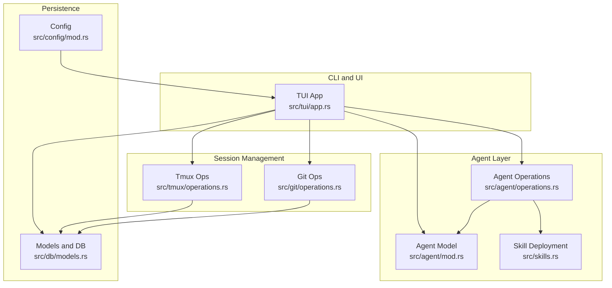
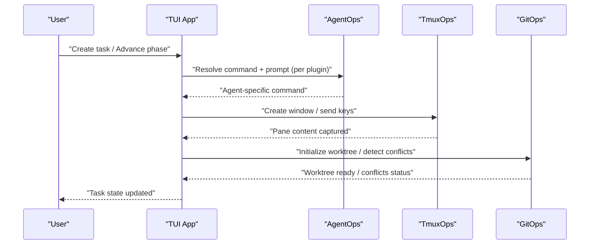
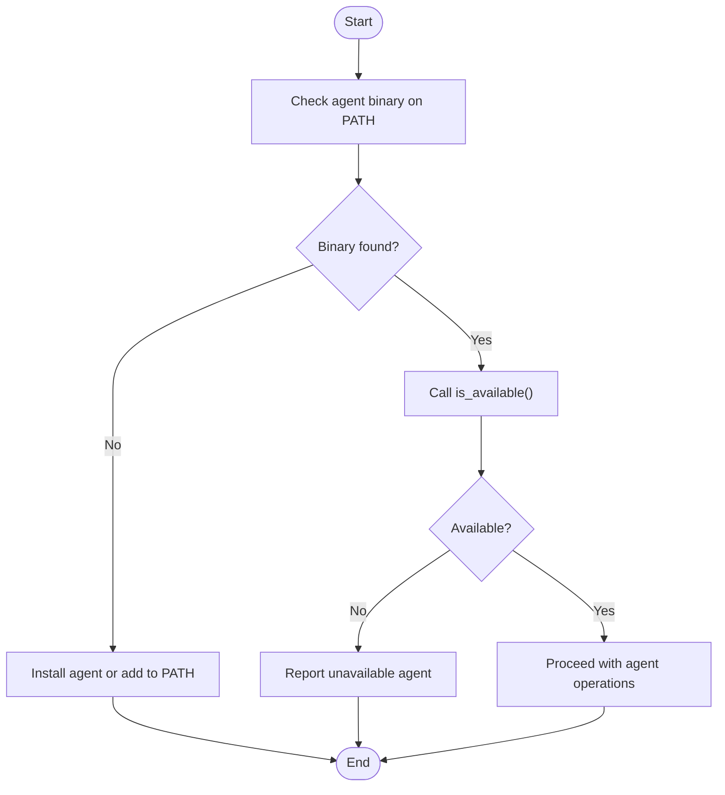
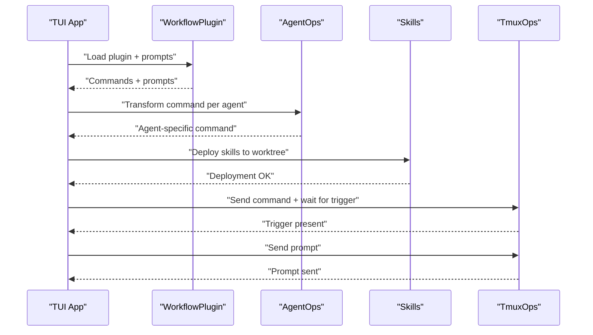
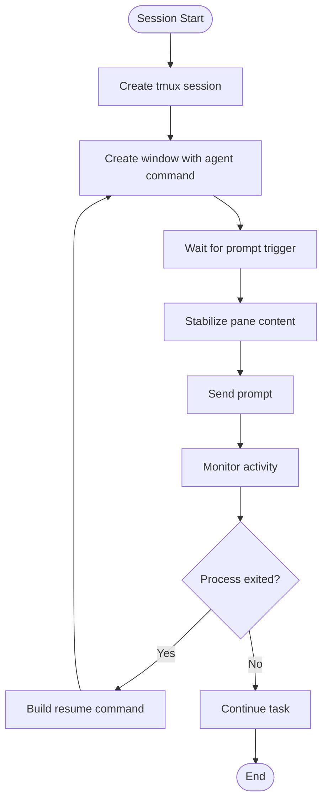
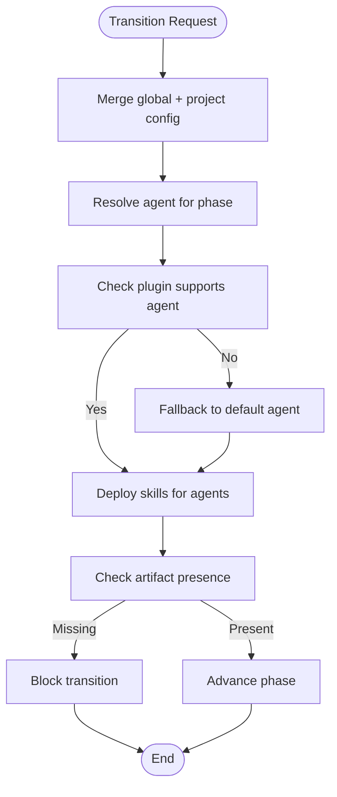
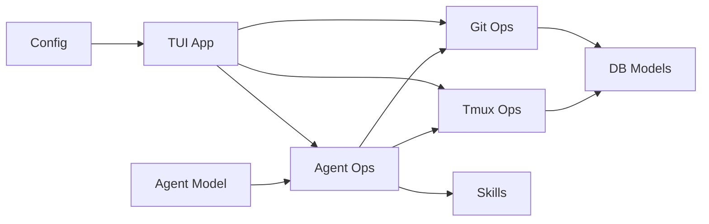

# Agent Troubleshooting and Best Practices

<cite>
**Referenced Files in This Document**
- [src/agent/mod.rs](file://src/agent/mod.rs)
- [src/agent/operations.rs](file://src/agent/operations.rs)
- [src/config/mod.rs](file://src/config/mod.rs)
- [src/tmux/operations.rs](file://src/tmux/operations.rs)
- [src/git/operations.rs](file://src/git/operations.rs)
- [src/db/models.rs](file://src/db/models.rs)
- [src/skills.rs](file://src/skills.rs)
- [src/tui/app.rs](file://src/tui/app.rs)
- [install.sh](file://install.sh)
- [README.md](file://README.md)
- [AGENTS.md](file://AGENTS.md)
- [tests/agent_tests.rs](file://tests/agent_tests.rs)
- [plugins/agtx/plugin.toml](file://plugins/agtx/plugin.toml)
- [plugins/agent-skills/plugin.toml](file://plugins/agent-skills/plugin.toml)
</cite>

## Table of Contents
1. [Introduction](#introduction)
2. [Project Structure](#project-structure)
3. [Core Components](#core-components)
4. [Architecture Overview](#architecture-overview)
5. [Detailed Component Analysis](#detailed-component-analysis)
6. [Dependency Analysis](#dependency-analysis)
7. [Performance Considerations](#performance-considerations)
8. [Troubleshooting Guide](#troubleshooting-guide)
9. [Best Practices](#best-practices)
10. [Platform-Specific Considerations](#platform-specific-considerations)
11. [Security Considerations](#security-considerations)
12. [Version Compatibility and Updates](#version-compatibility-and-updates)
13. [Monitoring and Logging](#monitoring-and-logging)
14. [Frequently Asked Questions](#frequently-asked-questions)
15. [Conclusion](#conclusion)

## Introduction
This guide provides a comprehensive troubleshooting and best practices manual for integrating AI coding agents with the agtx system. It focuses on diagnosing and resolving common issues around agent detection, command execution, session management, skill transformation, agent switching, and session recovery. It also covers configuration, performance optimization, platform-specific considerations, security, version compatibility, monitoring, and frequently asked questions.

## Project Structure
Agtx orchestrates tasks across tmux sessions, git worktrees, and agent CLIs. The key integration points are:
- Agent detection and command building
- Tmux session/window management
- Git worktree lifecycle and conflict detection
- Plugin-driven skill deployment and agent-specific command transformation
- Configuration for global and per-project agent selection

**Diagram sources**
- [src/tui/app.rs](file://src/tui/app.rs)
- [src/agent/mod.rs](file://src/agent/mod.rs)
- [src/agent/operations.rs](file://src/agent/operations.rs)
- [src/skills.rs](file://src/skills.rs)
- [src/tmux/operations.rs](file://src/tmux/operations.rs)
- [src/git/operations.rs](file://src/git/operations.rs)
- [src/db/models.rs](file://src/db/models.rs)
- [src/config/mod.rs](file://src/config/mod.rs)

**Section sources**
- [AGENTS.md](file://AGENTS.md)
- [README.md](file://README.md)

## Core Components
- Agent model and detection: Determines available agents, builds interactive/resume commands, and resolves agent selection.
- Agent operations: Executes non-interactive generation, orchestrator command composition, and agent-specific command transformations.
- Configuration: Global and project-level agent selection per phase, theme, and worktree settings.
- Tmux operations: Creates/destroys windows, sends keys/pastes, captures pane content, and checks session state.
- Git operations: Manages worktrees, diffs, commits, pushes, and conflict detection.
- Models and DB: Task lifecycle, transition requests, notifications, and orchestrator status.
- Skills: Deploys canonical skills to agent-native discovery paths and transforms commands per agent.

**Section sources**
- [src/agent/mod.rs:10-171](file://src/agent/mod.rs#L10-L171)
- [src/agent/operations.rs:16-163](file://src/agent/operations.rs#L16-L163)
- [src/config/mod.rs:5-595](file://src/config/mod.rs#L5-L595)
- [src/tmux/operations.rs:8-249](file://src/tmux/operations.rs#L8-L249)
- [src/git/operations.rs:9-276](file://src/git/operations.rs#L9-L276)
- [src/db/models.rs:58-245](file://src/db/models.rs#L58-L245)
- [src/skills.rs:57-81](file://src/skills.rs#L57-L81)

## Architecture Overview
Agtx coordinates agent sessions within tmux windows and git worktrees. Plugins define commands and prompts per phase, which are transformed to agent-specific forms and sent to the agent via tmux. The orchestrator leverages MCP to advance tasks automatically and escalate when idle.

**Diagram sources**
- [src/tui/app.rs](file://src/tui/app.rs)
- [src/agent/operations.rs:55-108](file://src/agent/operations.rs#L55-L108)
- [src/tmux/operations.rs:64-248](file://src/tmux/operations.rs#L64-L248)
- [src/git/operations.rs:80-276](file://src/git/operations.rs#L80-L276)

## Detailed Component Analysis

### Agent Detection and Availability
Common issues:
- Agent not detected due to PATH or missing binary
- Incorrect agent name or alias
- Platform-specific installation differences

Diagnostic steps:
- Verify agent binaries are installed and on PATH
- Confirm agent detection logic recognizes the agent
- Check agent availability status display

**Diagram sources**
- [src/agent/mod.rs:32-34](file://src/agent/mod.rs#L32-L34)
- [src/agent/mod.rs:124-130](file://src/agent/mod.rs#L124-L130)

**Section sources**
- [src/agent/mod.rs:32-34](file://src/agent/mod.rs#L32-L34)
- [src/agent/mod.rs:124-130](file://src/agent/mod.rs#L124-L130)
- [tests/agent_tests.rs:49-66](file://tests/agent_tests.rs#L49-L66)

### Command Execution and Skill Transformation
Common issues:
- Agent-specific command transformation errors
- Skill deployment failures
- Prompt not sent due to missing trigger or timing

Diagnostic steps:
- Validate plugin command mapping per agent
- Confirm skill files deployed to agent-native paths
- Check prompt trigger presence and pane stabilization

**Diagram sources**
- [src/tui/app.rs](file://src/tui/app.rs)
- [src/agent/operations.rs:55-108](file://src/agent/operations.rs#L55-L108)
- [src/skills.rs:57-81](file://src/skills.rs#L57-L81)

**Section sources**
- [src/agent/operations.rs:55-108](file://src/agent/operations.rs#L55-L108)
- [src/skills.rs:57-81](file://src/skills.rs#L57-L81)
- [src/tui/app.rs:7985-8006](file://src/tui/app.rs#L7985-L8006)
- [plugins/agtx/plugin.toml:11-16](file://plugins/agtx/plugin.toml#L11-L16)

### Session Management and Recovery
Common issues:
- tmux session/window not created
- Pane content not captured or stabilized
- Agent process exits unexpectedly

Diagnostic steps:
- Verify tmux server and session existence
- Check window creation and pane current command
- Capture pane content with history and stabilize before sending prompts
- On restarts, use resume commands to reconnect to previous sessions

**Diagram sources**
- [src/tmux/operations.rs:64-248](file://src/tmux/operations.rs#L64-L248)
- [src/agent/mod.rs:36-48](file://src/agent/mod.rs#L36-L48)
- [src/tui/app.rs:8908-8947](file://src/tui/app.rs#L8908-L8947)

**Section sources**
- [src/tmux/operations.rs:64-248](file://src/tmux/operations.rs#L64-L248)
- [src/agent/mod.rs:36-48](file://src/agent/mod.rs#L36-L48)
- [src/tui/app.rs:8908-8947](file://src/tui/app.rs#L8908-L8947)

### Agent Switching and Phase Transitions
Common issues:
- Agent switching not applied
- Plugin not compatible with selected agent
- Missing artifacts preventing advancement

Diagnostic steps:
- Merge global and project configuration to resolve per-phase agent
- Validate plugin supports the agent
- Ensure artifacts exist before advancing phases

**Diagram sources**
- [src/config/mod.rs:355-408](file://src/config/mod.rs#L355-L408)
- [src/tui/app.rs:8949-8968](file://src/tui/app.rs#L8949-L8968)
- [plugins/agent-skills/plugin.toml:1-19](file://plugins/agent-skills/plugin.toml#L1-L19)

**Section sources**
- [src/config/mod.rs:355-408](file://src/config/mod.rs#L355-L408)
- [src/tui/app.rs:8949-8968](file://src/tui/app.rs#L8949-L8968)
- [plugins/agent-skills/plugin.toml:1-19](file://plugins/agent-skills/plugin.toml#L1-L19)

## Dependency Analysis
Key dependencies and integration points:
- Agent detection relies on PATH and external binaries
- Tmux operations depend on tmux server and session names
- Git operations rely on git worktree and branch management
- MCP server integration for orchestrator agent communication
- Plugin system for skill deployment and command transformation

**Diagram sources**
- [src/agent/mod.rs:10-171](file://src/agent/mod.rs#L10-L171)
- [src/agent/operations.rs:16-163](file://src/agent/operations.rs#L16-L163)
- [src/tmux/operations.rs:8-249](file://src/tmux/operations.rs#L8-L249)
- [src/git/operations.rs:9-276](file://src/git/operations.rs#L9-L276)
- [src/db/models.rs:58-245](file://src/db/models.rs#L58-L245)
- [src/config/mod.rs:5-595](file://src/config/mod.rs#L5-L595)

**Section sources**
- [src/agent/mod.rs:10-171](file://src/agent/mod.rs#L10-L171)
- [src/agent/operations.rs:16-163](file://src/agent/operations.rs#L16-L163)
- [src/tmux/operations.rs:8-249](file://src/tmux/operations.rs#L8-L249)
- [src/git/operations.rs:9-276](file://src/git/operations.rs#L9-L276)
- [src/db/models.rs:58-245](file://src/db/models.rs#L58-L245)
- [src/config/mod.rs:5-595](file://src/config/mod.rs#L5-L595)

## Performance Considerations
- Minimize repeated skill deployments by caching canonical skills and deploying once per worktree
- Use pane stabilization to avoid premature prompt sending, reducing retries and wasted cycles
- Prefer worktree reuse and resume commands to avoid reinitializing sessions
- Limit MCP polling frequency and use targeted queries to reduce overhead
- Optimize plugin artifact detection to avoid continuous scanning

[No sources needed since this section provides general guidance]

## Troubleshooting Guide

### Agent Detection Failures
Symptoms:
- Agents not listed as available
- Selection menu does not reflect installed agents

Steps:
- Confirm agent binaries are installed and accessible on PATH
- Use detection logic to verify availability
- Reinstall or adjust PATH if detection fails

**Section sources**
- [src/agent/mod.rs:32-34](file://src/agent/mod.rs#L32-L34)
- [src/agent/mod.rs:124-130](file://src/agent/mod.rs#L124-L130)

### Command Execution Errors
Symptoms:
- Commands not recognized by agent
- Skill files not deployed

Steps:
- Validate plugin command mapping per agent
- Confirm skill deployment to agent-native paths
- Check agent-specific command transformations

**Section sources**
- [src/agent/operations.rs:55-108](file://src/agent/operations.rs#L55-L108)
- [src/skills.rs:57-81](file://src/skills.rs#L57-L81)
- [tests/agent_tests.rs:188-221](file://tests/agent_tests.rs#L188-L221)

### Session Management Issues
Symptoms:
- tmux session not created
- Pane content not captured
- Agent process exits unexpectedly

Steps:
- Verify tmux server and session existence
- Check window creation and pane current command
- Capture pane content with history and stabilize before sending prompts
- Use resume commands to reconnect after restarts

**Section sources**
- [src/tmux/operations.rs:64-248](file://src/tmux/operations.rs#L64-L248)
- [src/agent/mod.rs:36-48](file://src/agent/mod.rs#L36-L48)
- [src/tui/app.rs:8908-8947](file://src/tui/app.rs#L8908-L8947)

### Skill Transformation Errors
Symptoms:
- Commands not transformed correctly per agent
- Agent-specific prompts not applied

Steps:
- Review plugin command mappings
- Validate agent-specific transformations
- Ensure skill files are deployed to correct agent-native paths

**Section sources**
- [src/agent/operations.rs:55-108](file://src/agent/operations.rs#L55-L108)
- [src/skills.rs:57-81](file://src/skills.rs#L57-L81)
- [tests/agent_tests.rs:188-221](file://tests/agent_tests.rs#L188-L221)

### Agent Switching Problems
Symptoms:
- Agent not switched between phases
- Plugin not compatible with selected agent

Steps:
- Merge global and project configuration to resolve per-phase agent
- Validate plugin supports the agent
- Ensure skills are deployed for all agents in use

**Section sources**
- [src/config/mod.rs:355-408](file://src/config/mod.rs#L355-L408)
- [src/tui/app.rs:8949-8968](file://src/tui/app.rs#L8949-L8968)

### Session Recovery Failures
Symptoms:
- Cannot reconnect to previous session
- Resume command not recognized

Steps:
- Use agent-specific resume commands
- Verify session and window names
- Recreate session if necessary

**Section sources**
- [src/agent/mod.rs:36-48](file://src/agent/mod.rs#L36-L48)
- [src/tmux/operations.rs:231-247](file://src/tmux/operations.rs#L231-L247)

## Best Practices
- Configure per-phase agents globally and per project to maintain consistency
- Use worktree settings to isolate tasks and simplify cleanup
- Keep skills canonical and deploy once per worktree
- Use plugin artifacts to gate phase transitions reliably
- Leverage resume commands to minimize reinitialization costs
- Monitor orchestrator idle states and escalate appropriately

**Section sources**
- [src/config/mod.rs:355-408](file://src/config/mod.rs#L355-L408)
- [src/git/operations.rs:65-74](file://src/git/operations.rs#L65-L74)
- [src/tui/app.rs:8949-8968](file://src/tui/app.rs#L8949-L8968)

## Platform-Specific Considerations
- PATH configuration: Ensure agent binaries are discoverable across shells and login types
- tmux server: Use dedicated server and session naming conventions
- Git worktrees: Verify git version and capabilities for conflict detection
- Installer checks: Confirm required tools (tmux, git, gh) are present

**Section sources**
- [install.sh:146-175](file://install.sh#L146-L175)
- [README.md:100-104](file://README.md#L100-L104)

## Security Considerations
- Agent permissions: Some agents require explicit permission flags for interactive use
- MCP registration: Clean up stale registrations to prevent unauthorized access
- Credential management: Store credentials securely and avoid embedding secrets in scripts
- Access control: Limit who can register MCP servers and access tmux sessions

**Section sources**
- [src/agent/operations.rs:92-107](file://src/agent/operations.rs#L92-L107)
- [src/tmux/operations.rs:64-110](file://src/tmux/operations.rs#L64-L110)

## Version Compatibility and Updates
- Agent compatibility matrix: Verify plugin support per agent
- Update procedures: Follow plugin distribution channels and reinstall as needed
- Rollback strategies: Keep previous versions of skills and plugin configurations

**Section sources**
- [README.md:348-368](file://README.md#L348-L368)
- [plugins/agent-skills/plugin.toml:1-19](file://plugins/agent-skills/plugin.toml#L1-L19)

## Monitoring and Logging
- Track orchestrator idle states and escalate when necessary
- Use pane content capture to diagnose stuck agents
- Monitor transition requests and errors in the database
- Log MCP tool invocations and responses for debugging

**Section sources**
- [src/db/models.rs:159-184](file://src/db/models.rs#L159-L184)
- [src/tui/app.rs:8908-8947](file://src/tui/app.rs#L8908-L8947)

## Frequently Asked Questions
- How do I check which agents are available?
  - Use agent detection logic to list available agents.
- Why is my agent not being used for a phase?
  - Check merged configuration for per-phase agent overrides and plugin compatibility.
- How do I recover a session after a restart?
  - Use agent-specific resume commands to reconnect to the previous session.
- How do I troubleshoot skill deployment issues?
  - Verify skill files are deployed to agent-native paths and plugin mappings are correct.
- How do I handle agent-specific command transformations?
  - Review plugin command mappings and agent-specific transformations.

**Section sources**
- [src/agent/mod.rs:124-130](file://src/agent/mod.rs#L124-L130)
- [src/config/mod.rs:355-408](file://src/config/mod.rs#L355-L408)
- [src/agent/mod.rs:36-48](file://src/agent/mod.rs#L36-L48)
- [src/skills.rs:57-81](file://src/skills.rs#L57-L81)
- [tests/agent_tests.rs:188-221](file://tests/agent_tests.rs#L188-L221)

## Conclusion
By understanding agent detection, command execution, session management, and plugin-driven skill deployment, you can effectively troubleshoot and optimize agent integrations in agtx. Apply the best practices, monitor key metrics, and follow platform-specific and security guidelines to maintain reliable and secure agent workflows.