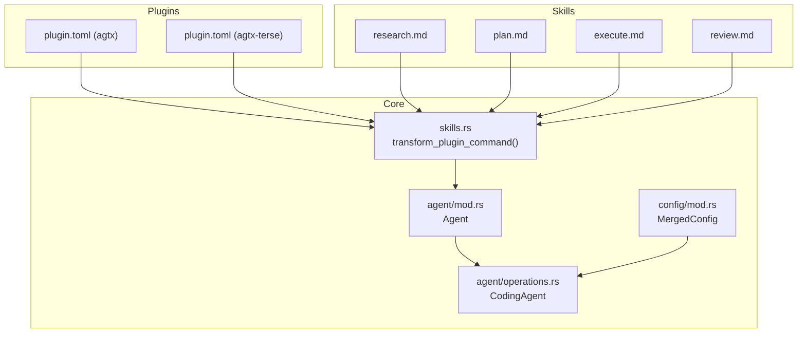
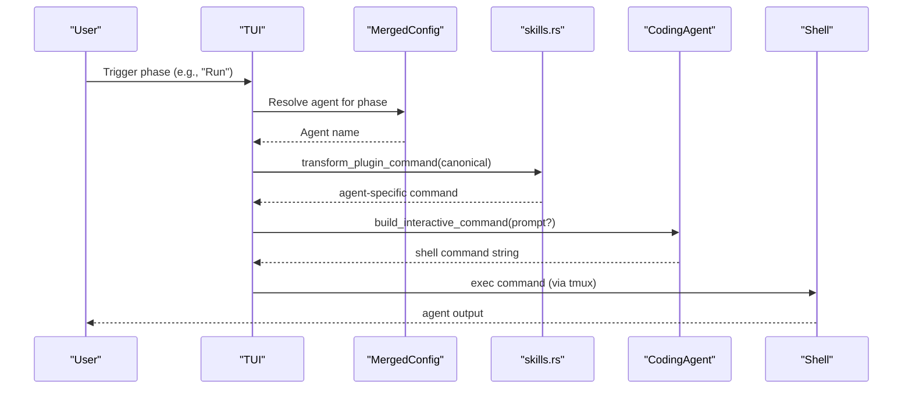
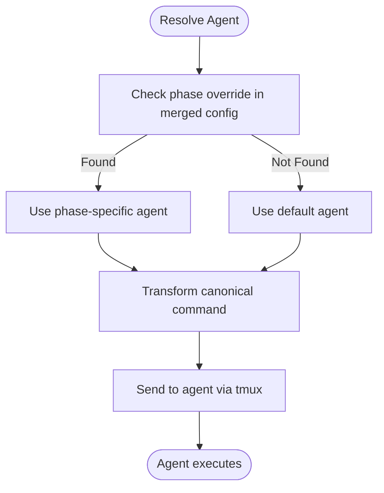
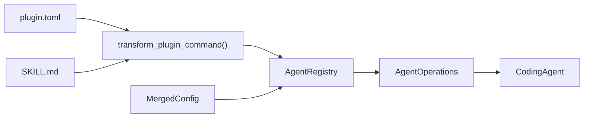

# Command Transformation

<cite>
**Referenced Files in This Document**
- [main.rs](file://src/main.rs)
- [lib.rs](file://src/lib.rs)
- [AGENTS.md](file://AGENTS.md)
- [plugin.toml (agtx)](file://plugins/agtx/plugin.toml)
- [plugin.toml (agtx-terse)](file://plugins/agtx-terse/plugin.toml)
- [mod.rs (agent)](file://src/agent/mod.rs)
- [operations.rs (agent)](file://src/agent/operations.rs)
- [mod.rs (config)](file://src/config/mod.rs)
- [skills.rs](file://src/skills.rs)
- [plan.md (agtx)](file://plugins/agtx/skills/plan.md)
- [execute.md (agtx)](file://plugins/agtx/skills/execute.md)
- [research.md (agtx)](file://plugins/agtx/skills/research.md)
- [review.md (agtx)](file://plugins/agtx/skills/review.md)
- [app.rs (tui)](file://src/tui/app.rs)
</cite>

## Table of Contents
1. [Introduction](#introduction)
2. [Project Structure](#project-structure)
3. [Core Components](#core-components)
4. [Architecture Overview](#architecture-overview)
5. [Detailed Component Analysis](#detailed-component-analysis)
6. [Dependency Analysis](#dependency-analysis)
7. [Performance Considerations](#performance-considerations)
8. [Troubleshooting Guide](#troubleshooting-guide)
9. [Conclusion](#conclusion)

## Introduction
This document explains AGTX’s agent command transformation system. It focuses on how canonical commands such as /agtx:plan, /agtx:execute, /agtx:research, and /agtx:review are converted into agent-specific command formats and routed to the appropriate agent. It also documents transformation rules per agent, parameter mapping, fallback mechanisms, and debugging strategies.

## Project Structure
The command transformation pipeline spans several modules:
- Plugins define canonical commands and artifacts.
- Skills provide the content and metadata for each phase.
- The skills module transforms canonical commands into agent-specific forms.
- The agent module defines agent capabilities and command construction.
- The TUI integrates these transformations to route commands to the correct agent.

**Diagram sources**
- [plugin.toml (agtx):11-16](file://plugins/agtx/plugin.toml#L11-L16)
- [plugin.toml (agtx-terse):11-16](file://plugins/agtx-terse/plugin.toml#L11-L16)
- [plan.md (agtx):1-43](file://plugins/agtx/skills/plan.md#L1-L43)
- [execute.md (agtx):1-39](file://plugins/agtx/skills/execute.md#L1-L39)
- [research.md (agtx):1-45](file://plugins/agtx/skills/research.md#L1-L45)
- [review.md (agtx):1-36](file://plugins/agtx/skills/review.md#L1-L36)
- [skills.rs:83-115](file://src/skills.rs#L83-L115)
- [mod.rs (agent):10-18](file://src/agent/mod.rs#L10-L18)
- [operations.rs (agent):44-108](file://src/agent/operations.rs#L44-L108)
- [mod.rs (config):337-408](file://src/config/mod.rs#L337-L408)

**Section sources**
- [AGENTS.md:16-31](file://AGENTS.md#L16-L31)
- [plugin.toml (agtx):11-16](file://plugins/agtx/plugin.toml#L11-L16)
- [plugin.toml (agtx-terse):11-16](file://plugins/agtx-terse/plugin.toml#L11-L16)
- [skills.rs:83-115](file://src/skills.rs#L83-L115)
- [mod.rs (agent):10-18](file://src/agent/mod.rs#L10-L18)
- [operations.rs (agent):44-108](file://src/agent/operations.rs#L44-L108)
- [mod.rs (config):337-408](file://src/config/mod.rs#L337-L408)

## Core Components
- Canonical commands: Defined in plugin.toml files for each workflow plugin. Examples include /agtx:research {task}, /agtx:plan {task}, /agtx:execute {task}, and /agtx:review.
- Skills: Markdown files with YAML frontmatter that define the behavior and output locations for each phase.
- Transformation engine: The skills module converts canonical commands into agent-specific formats.
- Agent registry: Resolves the correct agent for a given phase and falls back to the default agent when needed.
- TUI integration: The TUI uses merged configuration to select the agent for each phase and sends the transformed command to the agent.

**Section sources**
- [plugin.toml (agtx):11-16](file://plugins/agtx/plugin.toml#L11-L16)
- [plugin.toml (agtx-terse):11-16](file://plugins/agtx-terse/plugin.toml#L11-L16)
- [plan.md (agtx):1-43](file://plugins/agtx/skills/plan.md#L1-L43)
- [execute.md (agtx):1-39](file://plugins/agtx/skills/execute.md#L1-L39)
- [research.md (agtx):1-45](file://plugins/agtx/skills/research.md#L1-L45)
- [review.md (agtx):1-36](file://plugins/agtx/skills/review.md#L1-L36)
- [skills.rs:83-115](file://src/skills.rs#L83-L115)
- [mod.rs (config):337-408](file://src/config/mod.rs#L337-L408)

## Architecture Overview
The command transformation and routing architecture is as follows:
- Plugins define canonical commands and prompts.
- The skills module transforms canonical commands into agent-specific forms.
- The configuration module merges global and project settings to determine which agent runs each phase.
- The agent module constructs the proper command invocation for the chosen agent.
- The TUI sends the transformed command to the agent via tmux.

**Diagram sources**
- [mod.rs (config):390-408](file://src/config/mod.rs#L390-L408)
- [skills.rs:83-115](file://src/skills.rs#L83-L115)
- [operations.rs (agent):84-90](file://src/agent/operations.rs#L84-L90)
- [app.rs (tui):66-178](file://src/tui/app.rs#L66-L178)

## Detailed Component Analysis

### Canonical Commands and Artifacts
- Plugins define canonical commands for each phase. For example, the agtx plugin defines:
  - research: /agtx:research {task}
  - planning: /agtx:plan {task}
  - running: /agtx:execute {task}
  - review: /agtx:review
- These commands are stored in plugin.toml and are used as the basis for transformation.

**Section sources**
- [plugin.toml (agtx):11-16](file://plugins/agtx/plugin.toml#L11-L16)
- [plugin.toml (agtx-terse):11-16](file://plugins/agtx-terse/plugin.toml#L11-L16)

### Agent-Specific Command Transformation Rules
The skills module transforms canonical commands into agent-specific formats. The rules are:
- Claude and Gemini: Canonical form is preserved.
- OpenCode: Colon after the namespace is replaced with a hyphen (e.g., /agtx:plan → /agtx-plan).
- Codex: Namespace colon is replaced with a hyphen, and the leading slash is replaced with a dollar sign (e.g., /agtx:plan → $agtx-plan).
- Cursor: Colon after the namespace is replaced with a hyphen (e.g., /agtx:plan → /agtx-plan).
- Unsupported agents: Transformation returns None, indicating fallback behavior.

Examples:
- /agtx:plan → remains /agtx:plan for Claude
- /agtx:plan → remains /agtx:plan for Gemini
- /agtx:plan → /agtx-plan for OpenCode
- /agtx:plan → $agtx-plan for Codex
- /agtx:plan → /agtx-plan for Cursor

Notes:
- The transformation operates on the first colon after the namespace.
- Codex uses a dollar-sign prefix for skill invocation in its native format.

**Section sources**
- [skills.rs:83-115](file://src/skills.rs#L83-L115)

### Parameter Mapping Between Canonical and Agent-Specific Formats
- The canonical commands embed a placeholder for task context (e.g., {task}). This placeholder is preserved during transformation and is intended to be filled by the caller (e.g., the TUI) before sending the command to the agent.
- The skills module does not alter placeholders; it only transforms the command syntax according to agent-specific rules.

Implications:
- When invoking a transformed command, ensure the {task} placeholder is replaced with the actual task content.
- Agents that require additional parameters (e.g., flags or options) are handled by the agent-specific command construction logic.

**Section sources**
- [plugin.toml (agtx):11-16](file://plugins/agtx/plugin.toml#L11-L16)
- [plugin.toml (agtx-terse):11-16](file://plugins/agtx-terse/plugin.toml#L11-L16)
- [skills.rs:83-115](file://src/skills.rs#L83-L115)

### Command Routing Mechanism
- The TUI resolves the agent for each phase using merged configuration. The merged configuration selects the agent based on:
  - Explicit phase overrides (research/planning/running/review).
  - Global default agent if no override is set.
- Once the agent is resolved, the TUI transforms the canonical command and sends it to the agent.

**Diagram sources**
- [mod.rs (config):390-408](file://src/config/mod.rs#L390-L408)
- [skills.rs:83-115](file://src/skills.rs#L83-L115)

**Section sources**
- [mod.rs (config):390-408](file://src/config/mod.rs#L390-L408)
- [app.rs (tui):66-178](file://src/tui/app.rs#L66-L178)

### Agent-Specific Command Syntax Variations and Invocation
- Claude and Gemini: Commands remain in canonical form (/namespace:command).
- OpenCode: Commands use a hyphen after the namespace (/namespace-command).
- Codex: Commands use a dollar-sign prefix and a hyphen after the namespace ($namespace-command).
- Cursor: Commands use a hyphen after the namespace (/namespace-command).
- Unsupported agents: Transformation returns None, and the TUI falls back to alternative invocation strategies (e.g., file-path references).

These differences reflect agent-native command formats and are applied consistently by the transformation function.

**Section sources**
- [skills.rs:83-115](file://src/skills.rs#L83-L115)

### Complex Command Transformations and Examples
- Example 1: /agtx:plan {task}
  - Claude/Gemini: /agtx:plan {task}
  - OpenCode: /agtx-plan {task}
  - Codex: $agtx-plan {task}
  - Cursor: /agtx-plan {task}
- Example 2: /agtx:execute {task}
  - Claude/Gemini: /agtx:execute {task}
  - OpenCode: /agtx-execute {task}
  - Codex: $agtx-execute {task}
  - Cursor: /agtx-execute {task}
- Example 3: /agtx:research {task}
  - Claude/Gemini: /agtx:research {task}
  - OpenCode: /agtx-research {task}
  - Codex: $agtx-research {task}
  - Cursor: /agtx-research {task}
- Example 4: /agtx:review
  - Claude/Gemini: /agtx:review
  - OpenCode: /agtx-review
  - Codex: $agtx-review
  - Cursor: /agtx-review

Notes:
- Placeholders like {task} are preserved and intended to be substituted by the caller.
- Codex uses a dollar-sign prefix in its native command format.

**Section sources**
- [plugin.toml (agtx):11-16](file://plugins/agtx/plugin.toml#L11-L16)
- [plugin.toml (agtx-terse):11-16](file://plugins/agtx-terse/plugin.toml#L11-L16)
- [skills.rs:83-115](file://src/skills.rs#L83-L115)

### Fallback Mechanisms
- When transformation returns None (unsupported agent), the system falls back to alternative invocation strategies. The skills module enumerates available skills and extracts descriptions, allowing the TUI to present options or use file-path references when native command invocation is not supported.
- The agent registry ensures a fallback to the default agent if the requested agent is unavailable.

**Section sources**
- [skills.rs:211-226](file://src/skills.rs#L211-L226)
- [operations.rs (agent):153-162](file://src/agent/operations.rs#L153-L162)

### Debugging Transformation Issues
- Verify canonical commands in plugin.toml for the active workflow plugin.
- Confirm the agent name used by the TUI matches the agent-specific transformation rules.
- Ensure placeholders like {task} are properly substituted before sending the command.
- If transformation returns None, confirm the agent is supported and consider using file-path references or adjusting agent configuration.

**Section sources**
- [plugin.toml (agtx):11-16](file://plugins/agtx/plugin.toml#L11-L16)
- [plugin.toml (agtx-terse):11-16](file://plugins/agtx-terse/plugin.toml#L11-L16)
- [skills.rs:83-115](file://src/skills.rs#L83-L115)

## Dependency Analysis
The command transformation system depends on:
- Plugin definitions for canonical commands and prompts.
- Skills content for phase behavior and artifact locations.
- Agent definitions and command construction logic.
- Configuration merging to resolve per-phase agents.

**Diagram sources**
- [plugin.toml (agtx):11-16](file://plugins/agtx/plugin.toml#L11-L16)
- [plugin.toml (agtx-terse):11-16](file://plugins/agtx-terse/plugin.toml#L11-L16)
- [skills.rs:83-115](file://src/skills.rs#L83-L115)
- [operations.rs (agent):110-162](file://src/agent/operations.rs#L110-L162)
- [mod.rs (config):337-408](file://src/config/mod.rs#L337-L408)

**Section sources**
- [plugin.toml (agtx):11-16](file://plugins/agtx/plugin.toml#L11-L16)
- [plugin.toml (agtx-terse):11-16](file://plugins/agtx-terse/plugin.toml#L11-L16)
- [skills.rs:83-115](file://src/skills.rs#L83-L115)
- [operations.rs (agent):110-162](file://src/agent/operations.rs#L110-L162)
- [mod.rs (config):337-408](file://src/config/mod.rs#L337-L408)

## Performance Considerations
- Command transformation is a lightweight string manipulation operation and has negligible overhead.
- The primary cost lies in agent process startup and interaction; ensure the correct agent is selected early to avoid retries.

## Troubleshooting Guide
Common issues and resolutions:
- Command not recognized by agent:
  - Verify the agent-specific transformation matches the agent’s native command format.
  - Confirm the placeholder {task} is replaced before sending.
- Agent not available:
  - The registry falls back to the default agent; check configuration and installation.
- Unexpected command syntax:
  - Review the transformation rules for the target agent and adjust invocations accordingly.

**Section sources**
- [skills.rs:83-115](file://src/skills.rs#L83-L115)
- [operations.rs (agent):153-162](file://src/agent/operations.rs#L153-L162)
- [mod.rs (config):390-408](file://src/config/mod.rs#L390-L408)

## Conclusion
AGTX’s command transformation system converts canonical commands into agent-specific formats using a small set of deterministic rules. The TUI resolves the appropriate agent per phase using merged configuration and sends the transformed command to the agent. When transformation is unsupported, the system falls back to alternative invocation strategies. Understanding these rules and the routing mechanism helps ensure reliable command execution across agents.