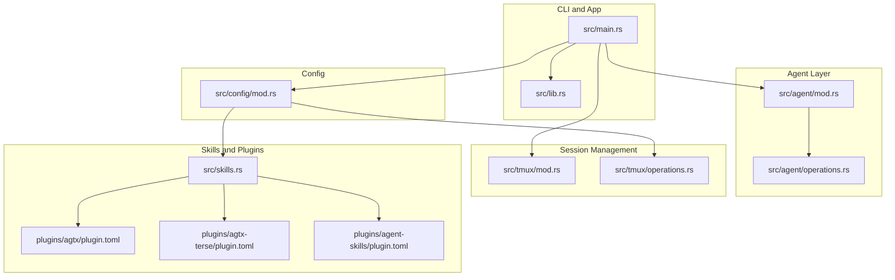
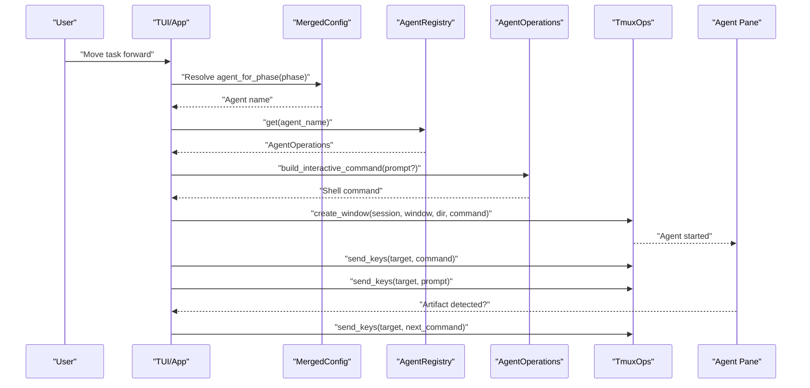
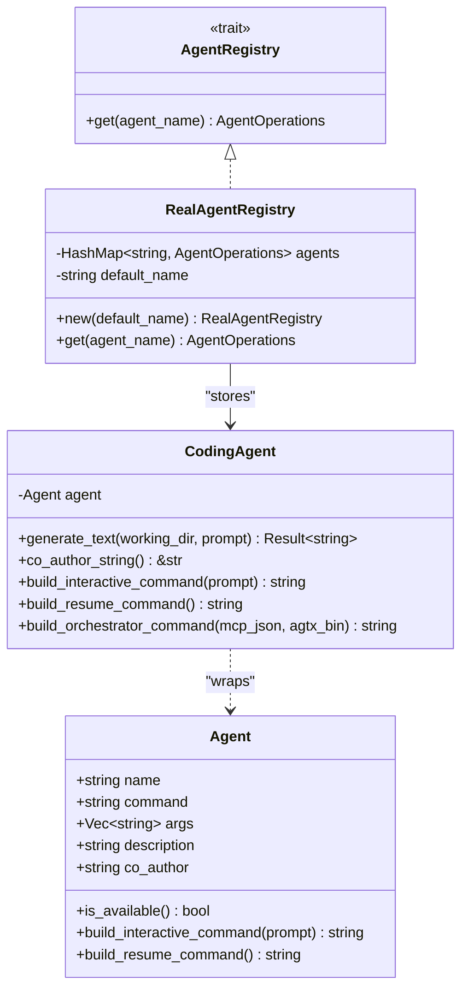
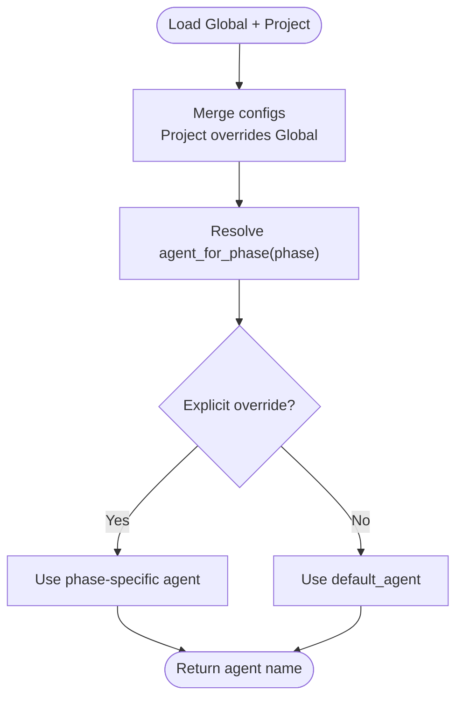
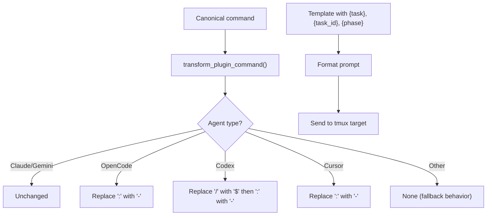
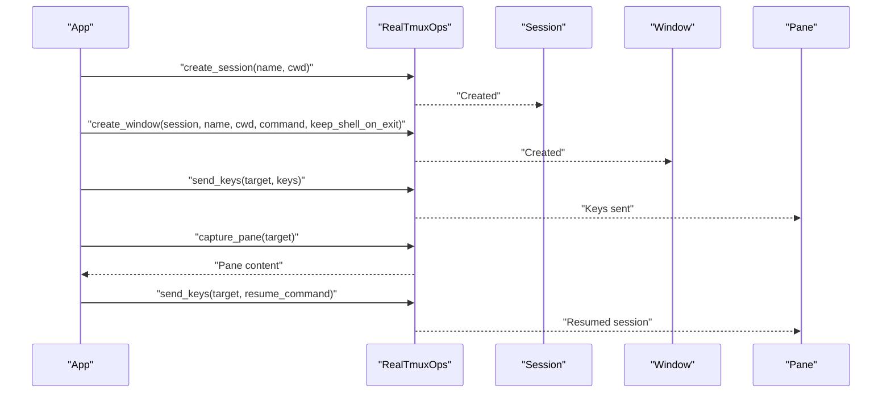
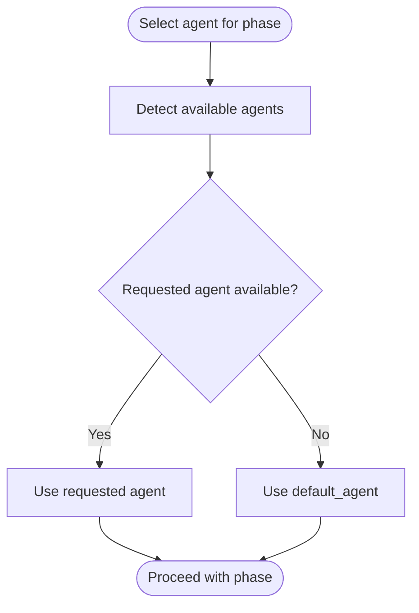
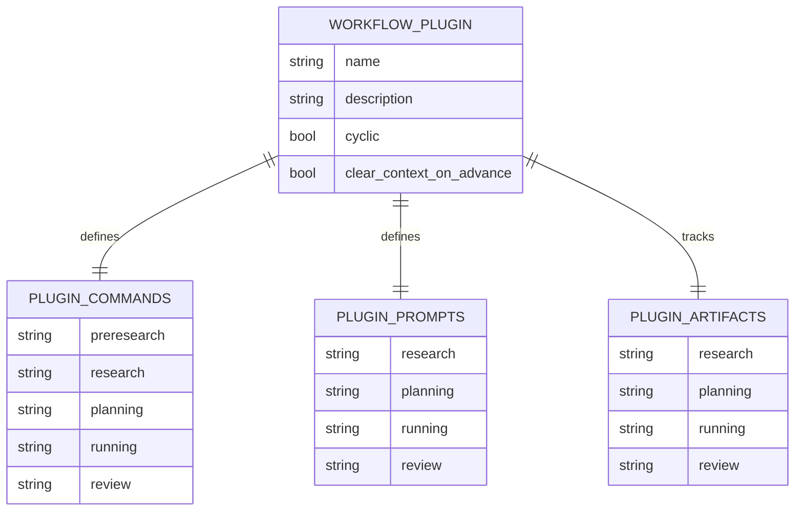
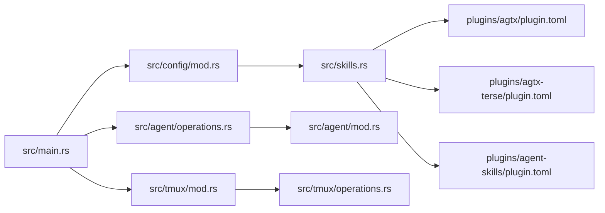

# Multi-Agent Workflow Configuration

<cite>
**Referenced Files in This Document**
- [src/main.rs](file://src/main.rs)
- [src/lib.rs](file://src/lib.rs)
- [src/agent/mod.rs](file://src/agent/mod.rs)
- [src/agent/operations.rs](file://src/agent/operations.rs)
- [src/config/mod.rs](file://src/config/mod.rs)
- [src/tmux/mod.rs](file://src/tmux/mod.rs)
- [src/tmux/operations.rs](file://src/tmux/operations.rs)
- [src/skills.rs](file://src/skills.rs)
- [plugins/agtx/plugin.toml](file://plugins/agtx/plugin.toml)
- [plugins/agtx-terse/plugin.toml](file://plugins/agtx-terse/plugin.toml)
- [plugins/agent-skills/plugin.toml](file://plugins/agent-skills/plugin.toml)
- [README.md](file://README.md)
- [AGENTS.md](file://AGENTS.md)
</cite>

## Table of Contents
1. [Introduction](#introduction)
2. [Project Structure](#project-structure)
3. [Core Components](#core-components)
4. [Architecture Overview](#architecture-overview)
5. [Detailed Component Analysis](#detailed-component-analysis)
6. [Dependency Analysis](#dependency-analysis)
7. [Performance Considerations](#performance-considerations)
8. [Troubleshooting Guide](#troubleshooting-guide)
9. [Conclusion](#conclusion)
10. [Appendices](#appendices)

## Introduction
This document explains how agtx orchestrates multi-agent workflows across distinct phases (Research, Planning, Execution, Review) with automatic agent switching, persistent sessions, and robust fallbacks. It covers the agent registry, per-phase agent configuration, command construction patterns, prompt formatting, session lifecycle management, and best practices for selecting agents based on task complexity and methodology.

## Project Structure
Agtx organizes multi-agent orchestration around:
- Agent detection and command construction
- Global and project-level configuration with per-phase agent overrides
- Tmux-based session management for persistent agent contexts
- Plugin-driven workflows that define commands, prompts, and artifacts per phase
- Built-in skills and cross-agent command translation

**Diagram sources**
- [src/main.rs:1-96](file://src/main.rs#L1-L96)
- [src/lib.rs:10-24](file://src/lib.rs#L10-L24)
- [src/agent/mod.rs:1-171](file://src/agent/mod.rs#L1-L171)
- [src/agent/operations.rs:1-163](file://src/agent/operations.rs#L1-L163)
- [src/config/mod.rs:1-595](file://src/config/mod.rs#L1-L595)
- [src/tmux/mod.rs:1-189](file://src/tmux/mod.rs#L1-L189)
- [src/tmux/operations.rs:1-249](file://src/tmux/operations.rs#L1-L249)
- [src/skills.rs:1-409](file://src/skills.rs#L1-L409)
- [plugins/agtx/plugin.toml:1-16](file://plugins/agtx/plugin.toml#L1-L16)
- [plugins/agtx-terse/plugin.toml:1-16](file://plugins/agtx-terse/plugin.toml#L1-L16)
- [plugins/agent-skills/plugin.toml:1-19](file://plugins/agent-skills/plugin.toml#L1-L19)

**Section sources**
- [src/main.rs:16-96](file://src/main.rs#L16-L96)
- [src/lib.rs:10-24](file://src/lib.rs#L10-L24)
- [AGENTS.md:16-42](file://AGENTS.md#L16-L42)

## Core Components
- Agent registry and per-phase selection: Agents are detected, registered, and retrieved by name with fallback to a default agent when unavailable.
- Configuration merging: Global and project-level settings are merged, allowing per-phase overrides (research, planning, running, review).
- Tmux session lifecycle: Persistent tmux sessions per project and windows per task; commands and prompts are sent via tmux; sessions can be resumed after restarts.
- Plugin-driven workflows: Commands, prompts, and artifacts are defined per phase; cross-agent command translation ensures compatibility.
- Skills and prompts: Built-in skills are deployed to agent-native locations; prompts are formatted with placeholders for task, task ID, and phase.

**Section sources**
- [src/agent/mod.rs:10-171](file://src/agent/mod.rs#L10-L171)
- [src/agent/operations.rs:110-163](file://src/agent/operations.rs#L110-L163)
- [src/config/mod.rs:337-408](file://src/config/mod.rs#L337-L408)
- [src/tmux/mod.rs:11-189](file://src/tmux/mod.rs#L11-L189)
- [src/tmux/operations.rs:8-59](file://src/tmux/operations.rs#L8-L59)
- [src/skills.rs:31-115](file://src/skills.rs#L31-L115)
- [plugins/agtx/plugin.toml:1-16](file://plugins/agtx/plugin.toml#L1-L16)

## Architecture Overview
Agtx coordinates a multi-agent workflow across Research, Planning, Execution, and Review phases. Each task is isolated in a tmux window with a dedicated agent session. Plugins define canonical commands and prompts; agtx translates them per agent and sends them to the appropriate tmux target. The orchestrator can advance tasks automatically, and sessions persist across restarts.

**Diagram sources**
- [src/config/mod.rs:390-408](file://src/config/mod.rs#L390-L408)
- [src/agent/operations.rs:110-163](file://src/agent/operations.rs#L110-L163)
- [src/tmux/operations.rs:64-110](file://src/tmux/operations.rs#L64-L110)
- [src/skills.rs:83-115](file://src/skills.rs#L83-L115)

## Detailed Component Analysis

### Agent Registry and Automatic Switching
- Agent detection: Known agents are enumerated; availability is checked via system PATH.
- Registry: A registry maps agent names to AgentOperations instances, falling back to the default agent if the requested agent is unavailable.
- Per-phase selection: Merged configuration resolves the agent for each phase, with explicit overrides taking precedence over global defaults.

**Diagram sources**
- [src/agent/mod.rs:10-171](file://src/agent/mod.rs#L10-L171)
- [src/agent/operations.rs:16-108](file://src/agent/operations.rs#L16-L108)
- [src/agent/operations.rs:110-163](file://src/agent/operations.rs#L110-L163)

**Section sources**
- [src/agent/mod.rs:124-130](file://src/agent/mod.rs#L124-L130)
- [src/agent/operations.rs:119-163](file://src/agent/operations.rs#L119-L163)
- [src/config/mod.rs:390-408](file://src/config/mod.rs#L390-L408)

### Configuration and Per-Phase Agent Overrides
- Global configuration: Default agent and per-phase overrides are stored in the global config.
- Project configuration: Project-level overrides can refine defaults and add worktree settings.
- Merging: Project-level settings override global ones; per-phase overrides are merged per phase.
- Resolution: The merged config exposes agent_for_phase and explicit_agent_for_phase helpers.

**Diagram sources**
- [src/config/mod.rs:355-408](file://src/config/mod.rs#L355-L408)

**Section sources**
- [src/config/mod.rs:5-27](file://src/config/mod.rs#L5-L27)
- [src/config/mod.rs:199-228](file://src/config/mod.rs#L199-L228)
- [src/config/mod.rs:355-408](file://src/config/mod.rs#L355-L408)
- [README.md:308-327](file://README.md#L308-L327)

### Command Construction Patterns and Prompt Formatting
- Canonical commands: Plugins define commands in a canonical format (e.g., /namespace:command).
- Cross-agent translation: agtx transforms canonical commands to agent-specific forms (e.g., colon-to-hyphen, slash-to-dollar).
- Prompt injection: Prompts are formatted with placeholders for task, task_id, and phase; optional prompt triggers delay prompt sending until the pane reaches a specific state.
- Skills deployment: Built-in skills are deployed to agent-native directories; agent-native filenames differ per agent.

**Diagram sources**
- [src/skills.rs:83-115](file://src/skills.rs#L83-L115)
- [src/skills.rs:31-81](file://src/skills.rs#L31-L81)
- [src/config/mod.rs:501-510](file://src/config/mod.rs#L501-L510)

**Section sources**
- [src/skills.rs:83-115](file://src/skills.rs#L83-L115)
- [src/skills.rs:31-81](file://src/skills.rs#L31-L81)
- [src/config/mod.rs:410-510](file://src/config/mod.rs#L410-L510)
- [plugins/agtx/plugin.toml:11-16](file://plugins/agtx/plugin.toml#L11-L16)

### Session Lifecycle Management (Persistent tmux Sessions)
- Server and sessions: Agtx uses a dedicated tmux server named "agtx", with per-project sessions and per-task windows.
- Session creation: Windows are created with optional commands; when a command exits, the window can drop to a shell for task panes.
- Pane operations: Keys and text can be sent, pane content captured, and cursor info queried.
- Recovery: Agents expose a resume command to reconnect to the most recent session after tmux or server restarts.

**Diagram sources**
- [src/tmux/operations.rs:64-110](file://src/tmux/operations.rs#L64-L110)
- [src/tmux/mod.rs:11-189](file://src/tmux/mod.rs#L11-L189)
- [src/agent/mod.rs:36-48](file://src/agent/mod.rs#L36-L48)

**Section sources**
- [src/tmux/mod.rs:11-189](file://src/tmux/mod.rs#L11-L189)
- [src/tmux/operations.rs:64-249](file://src/tmux/operations.rs#L64-L249)
- [src/agent/mod.rs:36-48](file://src/agent/mod.rs#L36-L48)

### Agent Availability Monitoring and Fallback Mechanisms
- Availability detection: Agents are checked for presence on PATH; unavailable agents are not included in the registry.
- Fallback behavior: If a requested agent is missing, the registry falls back to the default agent.
- First-run selection: On first run, the user can select a default agent; otherwise, the default is used.

**Diagram sources**
- [src/agent/mod.rs:124-130](file://src/agent/mod.rs#L124-L130)
- [src/agent/operations.rs:139-161](file://src/agent/operations.rs#L139-L161)
- [src/main.rs:80-89](file://src/main.rs#L80-L89)

**Section sources**
- [src/agent/mod.rs:124-130](file://src/agent/mod.rs#L124-L130)
- [src/agent/operations.rs:139-161](file://src/agent/operations.rs#L139-L161)
- [src/main.rs:80-89](file://src/main.rs#L80-L89)

### Plugin System and Workflow Phases
- Built-in plugins: agtx and agtx-terse define artifacts and commands for each phase.
- Custom plugins: Plugins can specify commands, prompts, artifacts, prompt triggers, copy-back rules, and auto-dismiss behavior.
- Phase gating: Plugins determine whether a phase can be entered directly from Backlog based on whether commands/prompts include task placeholders.

**Diagram sources**
- [src/config/mod.rs:410-510](file://src/config/mod.rs#L410-L510)
- [plugins/agtx/plugin.toml:1-16](file://plugins/agtx/plugin.toml#L1-L16)
- [plugins/agtx-terse/plugin.toml:1-16](file://plugins/agtx-terse/plugin.toml#L1-L16)

**Section sources**
- [src/config/mod.rs:410-510](file://src/config/mod.rs#L410-L510)
- [plugins/agtx/plugin.toml:1-16](file://plugins/agtx/plugin.toml#L1-L16)
- [plugins/agtx-terse/plugin.toml:1-16](file://plugins/agtx-terse/plugin.toml#L1-L16)

### Best Practices for Agent Selection
- Research: Prefer agents with strong summarization and exploration capabilities.
- Planning: Choose agents capable of structured reasoning and iterative refinement.
- Execution: Favor agents with reliable code generation and good editor integration.
- Review: Select agents that can assess quality, suggest improvements, and coordinate merges.
- Complexity: For complex tasks, pair a research agent with a planning agent, then an execution agent, followed by a review agent.
- Methodology: Align agent selection with the chosen plugin’s strengths (e.g., GSD, Spec-Kit, OpenSpec, BMAD, Superpowers).

**Section sources**
- [README.md:348-367](file://README.md#L348-L367)
- [README.md:308-327](file://README.md#L308-L327)

## Dependency Analysis
Agtx composes modular components:
- CLI initializes the app, detects agents, and routes modes.
- Configuration merges global and project settings and exposes per-phase agent resolution.
- Agent layer provides command construction and orchestrator setup.
- Tmux layer encapsulates session/window/pane operations.
- Skills and plugins define cross-agent compatibility and workflow semantics.

**Diagram sources**
- [src/main.rs:16-96](file://src/main.rs#L16-L96)
- [src/config/mod.rs:337-408](file://src/config/mod.rs#L337-L408)
- [src/agent/operations.rs:110-163](file://src/agent/operations.rs#L110-L163)
- [src/tmux/mod.rs:11-189](file://src/tmux/mod.rs#L11-L189)
- [src/skills.rs:141-194](file://src/skills.rs#L141-L194)
- [plugins/agtx/plugin.toml:1-16](file://plugins/agtx/plugin.toml#L1-16)
- [plugins/agtx-terse/plugin.toml:1-16](file://plugins/agtx-terse/plugin.toml#L1-16)
- [plugins/agent-skills/plugin.toml:1-19](file://plugins/agent-skills/plugin.toml#L1-19)

**Section sources**
- [src/main.rs:16-96](file://src/main.rs#L16-L96)
- [src/config/mod.rs:337-408](file://src/config/mod.rs#L337-L408)
- [src/agent/operations.rs:110-163](file://src/agent/operations.rs#L110-L163)
- [src/tmux/mod.rs:11-189](file://src/tmux/mod.rs#L11-L189)
- [src/skills.rs:141-194](file://src/skills.rs#L141-L194)

## Performance Considerations
- Minimize tmux round-trips by batching pane captures and avoiding excessive polling.
- Use prompt triggers to reduce unnecessary prompt sends and improve throughput.
- Prefer shorter resume commands to speed up recovery after restarts.
- Limit concurrent agent sessions to available CPU/memory resources; consider cycling agents for long-running tasks.

## Troubleshooting Guide
- Agent switching issues:
  - Verify agent availability on PATH; unavailable agents fall back to the default.
  - Confirm per-phase overrides in configuration are valid and applied.
- Session conflicts:
  - Check for existing tmux sessions/windows with conflicting names; sanitize names if needed.
  - Ensure the dedicated tmux server is running and accessible.
- Resource allocation problems:
  - Reduce concurrent sessions or limit plugin complexity.
  - Use shorter prompt triggers and fewer auto-dismiss rules to decrease pane churn.
- Prompt timing:
  - If prompts arrive before the agent is ready, configure prompt_triggers to wait for specific output.
- Recovery after restarts:
  - Use agent-specific resume commands to reconnect to previous sessions.

**Section sources**
- [src/agent/mod.rs:36-48](file://src/agent/mod.rs#L36-L48)
- [src/tmux/mod.rs:144-166](file://src/tmux/mod.rs#L144-L166)
- [src/config/mod.rs:501-510](file://src/config/mod.rs#L501-L510)

## Conclusion
Agtx provides a robust, extensible framework for multi-agent workflows. Its agent registry, per-phase configuration, cross-agent command translation, and persistent tmux sessions enable seamless automation across Research, Planning, Execution, and Review. By aligning agent capabilities with workflow phases and leveraging plugins, teams can achieve efficient, scalable AI-assisted development.

## Appendices

### Configuration Examples
- Global per-phase agent overrides:
  - [README.md:312-321](file://README.md#L312-L321)
- Project-level overrides:
  - [README.md:323-327](file://README.md#L323-L327)
- Plugin commands and prompts:
  - [plugins/agtx/plugin.toml:11-16](file://plugins/agtx/plugin.toml#L11-L16)
  - [plugins/agent-skills/plugin.toml:8-19](file://plugins/agent-skills/plugin.toml#L8-L19)

### Agent Compatibility Matrix
- Supported agents and skill/command compatibility:
  - [README.md:356-367](file://README.md#L356-L367)