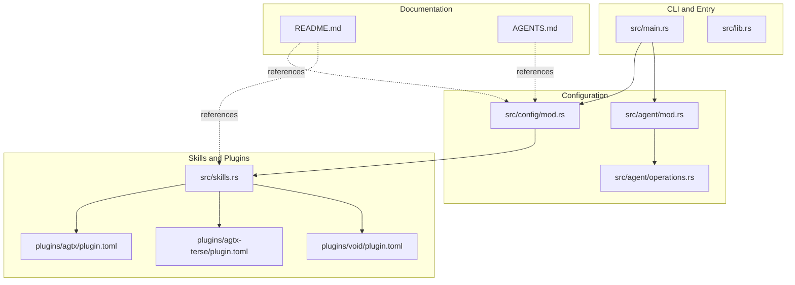
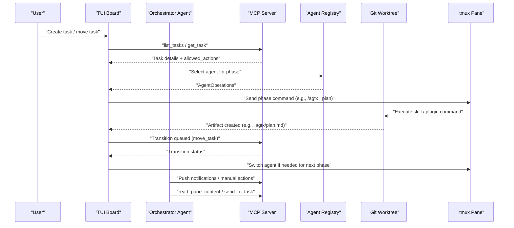
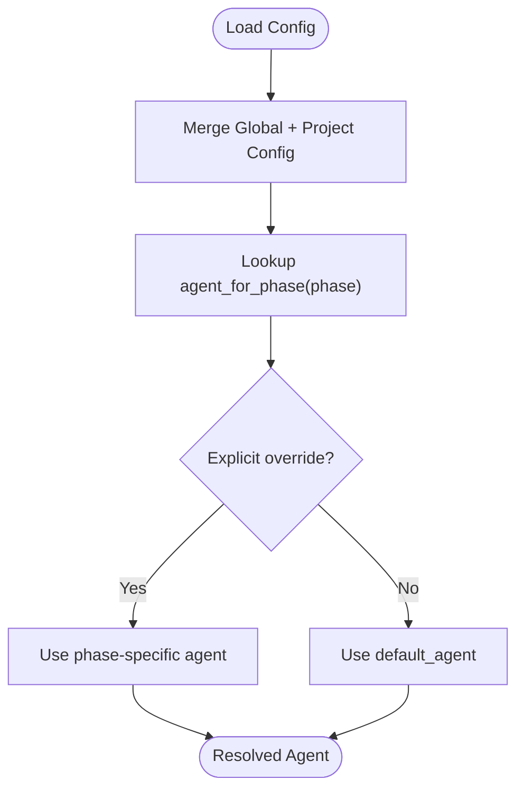
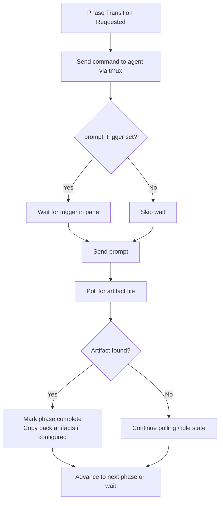
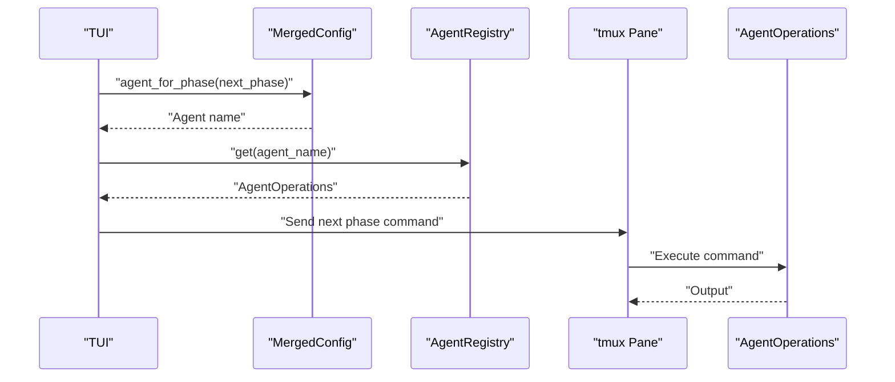
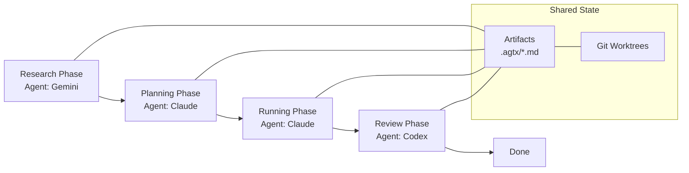
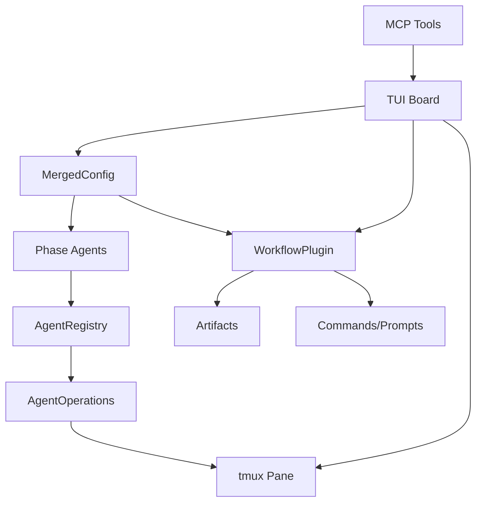

# Multi-Agent Workflows

<cite>
**Referenced Files in This Document**
- [README.md](file://README.md)
- [AGENTS.md](file://AGENTS.md)
- [src/lib.rs](file://src/lib.rs)
- [src/main.rs](file://src/main.rs)
- [src/config/mod.rs](file://src/config/mod.rs)
- [src/agent/mod.rs](file://src/agent/mod.rs)
- [src/agent/operations.rs](file://src/agent/operations.rs)
- [src/skills.rs](file://src/skills.rs)
- [plugins/agtx/plugin.toml](file://plugins/agtx/plugin.toml)
- [plugins/agtx-terse/plugin.toml](file://plugins/agtx-terse/plugin.toml)
- [plugins/void/plugin.toml](file://plugins/void/plugin.toml)
- [plugins/agtx/skills/orchestrate.md](file://plugins/agtx/skills/orchestrate.md)
- [plugins/agtx/skills/plan.md](file://plugins/agtx/skills/plan.md)
- [plugins/agtx/skills/review.md](file://plugins/agtx/skills/review.md)
</cite>

## Table of Contents
1. [Introduction](#introduction)
2. [Project Structure](#project-structure)
3. [Core Components](#core-components)
4. [Architecture Overview](#architecture-overview)
5. [Detailed Component Analysis](#detailed-component-analysis)
6. [Dependency Analysis](#dependency-analysis)
7. [Performance Considerations](#performance-considerations)
8. [Troubleshooting Guide](#troubleshooting-guide)
9. [Conclusion](#conclusion)
10. [Appendices](#appendices)

## Introduction
This document explains how to configure and manage multi-agent workflows in AGTX. It focuses on the per-phase agent assignment system, where different agents can be assigned to different workflow phases (Backlog, Planning, Running, Review, Done). You will learn how to set up complex workflows such as using Gemini for research, Claude for implementation, and Codex for code review, along with the agent switching mechanism during task transitions. It also covers agent coordination patterns, shared state management, conflict resolution, best practices for agent selection, and troubleshooting guidance.

## Project Structure
AGTX organizes multi-agent workflows around:
- A TUI board that tracks tasks across phases
- Per-phase agent configuration (global and project overrides)
- Plugins that define commands, prompts, and artifacts per phase
- Agent registry and operations for launching and coordinating agents
- Built-in skills and MCP integration for orchestration

**Diagram sources**
- [src/main.rs:1-228](file://src/main.rs#L1-L228)
- [src/lib.rs:1-24](file://src/lib.rs#L1-L24)
- [src/config/mod.rs:1-595](file://src/config/mod.rs#L1-L595)
- [src/agent/mod.rs:1-171](file://src/agent/mod.rs#L1-L171)
- [src/agent/operations.rs:1-163](file://src/agent/operations.rs#L1-L163)
- [src/skills.rs:1-409](file://src/skills.rs#L1-L409)
- [plugins/agtx/plugin.toml:1-16](file://plugins/agtx/plugin.toml#L1-L16)
- [plugins/agtx-terse/plugin.toml:1-16](file://plugins/agtx-terse/plugin.toml#L1-L16)
- [plugins/void/plugin.toml:1-4](file://plugins/void/plugin.toml#L1-L4)
- [README.md:1-685](file://README.md#L1-L685)
- [AGENTS.md:1-61](file://AGENTS.md#L1-L61)

**Section sources**
- [README.md:261-328](file://README.md#L261-L328)
- [AGENTS.md:35-42](file://AGENTS.md#L35-L42)
- [src/config/mod.rs:337-408](file://src/config/mod.rs#L337-L408)

## Core Components
- Per-phase agent configuration: Global and project-level overrides allow assigning different agents to research, planning, running, and review.
- Plugin-driven phases: Plugins define commands, prompts, and artifacts per phase, enabling deterministic transitions and artifact-based gating.
- Agent registry and operations: A registry maps agent names to operations, supporting interactive launch, resume, and orchestrator setup.
- Skills and MCP: Built-in skills and MCP tools enable orchestration, notifications, and agent handoffs.

**Section sources**
- [src/config/mod.rs:151-158](file://src/config/mod.rs#L151-L158)
- [src/config/mod.rs:390-408](file://src/config/mod.rs#L390-L408)
- [src/agent/operations.rs:110-162](file://src/agent/operations.rs#L110-L162)
- [src/skills.rs:12-21](file://src/skills.rs#L12-L21)
- [README.md:573-603](file://README.md#L573-L603)

## Architecture Overview
The multi-agent workflow architecture coordinates agents across phases with deterministic transitions and shared state via worktrees and artifacts.

**Diagram sources**
- [README.md:506-547](file://README.md#L506-L547)
- [README.md:604-646](file://README.md#L604-L646)
- [src/config/mod.rs:410-594](file://src/config/mod.rs#L410-L594)
- [src/agent/operations.rs:110-162](file://src/agent/operations.rs#L110-L162)
- [src/skills.rs:83-115](file://src/skills.rs#L83-L115)

## Detailed Component Analysis

### Per-Phase Agent Assignment
AGTX supports:
- Global default agent and per-phase overrides
- Project-level overrides that take precedence over global settings
- Deterministic agent selection per phase via merged configuration

**Diagram sources**
- [src/config/mod.rs:355-408](file://src/config/mod.rs#L355-L408)

**Section sources**
- [README.md:308-327](file://README.md#L308-L327)
- [src/config/mod.rs:355-408](file://src/config/mod.rs#L355-L408)

### Plugin Commands, Prompts, and Artifacts
Plugins define:
- Commands per phase (e.g., “/agtx:plan”)
- Prompts per phase (e.g., task content)
- Artifacts that gate transitions (e.g., “.agtx/plan.md”)
- Optional prompt triggers and copy-back behavior

**Diagram sources**
- [README.md:476-489](file://README.md#L476-L489)
- [src/config/mod.rs:410-594](file://src/config/mod.rs#L410-L594)

**Section sources**
- [README.md:370-504](file://README.md#L370-L504)
- [plugins/agtx/plugin.toml:1-16](file://plugins/agtx/plugin.toml#L1-L16)
- [plugins/agtx-terse/plugin.toml:1-16](file://plugins/agtx-terse/plugin.toml#L1-L16)

### Agent Switching During Transitions
Agent switching occurs when:
- The plugin defines commands/parts of speech per phase
- The merged configuration selects a different agent for the next phase
- The TUI sends the appropriate command to the new agent’s tmux pane

**Diagram sources**
- [src/config/mod.rs:390-408](file://src/config/mod.rs#L390-L408)
- [src/agent/operations.rs:110-162](file://src/agent/operations.rs#L110-L162)
- [src/skills.rs:83-115](file://src/skills.rs#L83-L115)

**Section sources**
- [src/config/mod.rs:390-408](file://src/config/mod.rs#L390-L408)
- [src/agent/operations.rs:110-162](file://src/agent/operations.rs#L110-L162)
- [src/skills.rs:83-115](file://src/skills.rs#L83-L115)

### Agent Coordination Patterns and Shared State
- Persistent context: Agents maintain conversation history across phases.
- Shared artifacts: Plugins define artifact files that signal completion and enable cross-worktree sharing.
- Conflict detection: Automatic merge conflict checks and a dedicated merge conflicts skill.
- Orchestrator: MCP-based orchestration that advances tasks, monitors progress, and escalates when needed.

**Diagram sources**
- [README.md:10-13](file://README.md#L10-L13)
- [README.md:156-165](file://README.md#L156-L165)
- [plugins/agtx/plugin.toml:5-9](file://plugins/agtx/plugin.toml#L5-L9)

**Section sources**
- [README.md:10-13](file://README.md#L10-L13)
- [README.md:156-165](file://README.md#L156-L165)
- [plugins/agtx/plugin.toml:1-16](file://plugins/agtx/plugin.toml#L1-L16)

### Practical Examples of Workflow Configurations
- Example 1: Research with Gemini, Implementation with Claude, Review with Codex
  - Configure global per-phase agents and choose the built-in “agtx” plugin.
  - The plugin’s commands and artifacts drive deterministic transitions.
- Example 2: Token-efficient workflow
  - Use the “agtx-terse” plugin to reduce token usage while preserving the same phase structure.
- Example 3: Plain sessions without skills
  - Use the “void” plugin to run tasks with full human control.

**Section sources**
- [README.md:308-327](file://README.md#L308-L327)
- [plugins/agtx/plugin.toml:1-16](file://plugins/agtx/plugin.toml#L1-L16)
- [plugins/agtx-terse/plugin.toml:1-16](file://plugins/agtx-terse/plugin.toml#L1-L16)
- [plugins/void/plugin.toml:1-4](file://plugins/void/plugin.toml#L1-L4)

### Agent Selection Best Practices
- Match agent capabilities to phase requirements:
  - Research: Prefer agents with strong reasoning and summarization (e.g., Gemini).
  - Planning: Choose agents capable of structured output and artifact generation (e.g., Claude).
  - Running: Select agents with reliable code generation and editing (e.g., Claude).
  - Review: Pick agents with strong critical analysis and attention to detail (e.g., Codex).
- Consider performance and cost: Use “agtx-terse” for lower token usage when acceptable.
- Validate compatibility: Confirm agent support for plugin commands and skills.

**Section sources**
- [README.md:348-367](file://README.md#L348-L367)
- [README.md:308-327](file://README.md#L308-L327)

### Conflict Resolution and Handoff
- Merge conflict detection: Non-destructive virtual merge against the default branch.
- Automated resolution: If conflicts are found, the agent is sent the merge conflicts skill to resolve and re-commit.
- Handoff safety: Clear context on phase advance is supported by plugins to minimize cross-contamination.

**Section sources**
- [README.md:164-165](file://README.md#L164-L165)
- [src/config/mod.rs:438-442](file://src/config/mod.rs#L438-L442)

## Dependency Analysis
The multi-agent workflow depends on:
- Configuration merging for agent selection
- Plugin definitions for commands, prompts, and artifacts
- Agent registry for launching and resuming sessions
- MCP tools for orchestration and diagnostics

**Diagram sources**
- [src/config/mod.rs:355-408](file://src/config/mod.rs#L355-L408)
- [src/agent/operations.rs:110-162](file://src/agent/operations.rs#L110-L162)
- [src/config/mod.rs:410-594](file://src/config/mod.rs#L410-L594)
- [README.md:573-603](file://README.md#L573-L603)

**Section sources**
- [src/config/mod.rs:355-408](file://src/config/mod.rs#L355-L408)
- [src/agent/operations.rs:110-162](file://src/agent/operations.rs#L110-L162)
- [src/config/mod.rs:410-594](file://src/config/mod.rs#L410-L594)

## Performance Considerations
- Use the “agtx-terse” plugin to reduce token usage when task complexity permits.
- Prefer agents with strong artifact generation to minimize retries and re-runs.
- Limit unnecessary agent switching—keep the same agent for consecutive compatible phases when feasible.

[No sources needed since this section provides general guidance]

## Troubleshooting Guide
Common issues and resolutions:
- Agent not available
  - Verify agent installation and availability; the registry falls back to the default agent if a named agent is missing.
- Stuck tasks
  - Use MCP tools to read pane content and send targeted messages to answer prompts or proceed with selections.
  - Escalate to the user when domain decisions are required.
- Phase gating failures
  - Ensure the plugin’s command or prompt for the phase contains the task context; otherwise, the phase is gated until prerequisite artifacts exist.
- Merge conflicts
  - Allow the system to detect and resolve conflicts automatically using the merge conflicts skill.

**Section sources**
- [src/agent/operations.rs:153-162](file://src/agent/operations.rs#L153-L162)
- [README.md:604-646](file://README.md#L604-L646)
- [README.md:476-489](file://README.md#L476-L489)
- [README.md:164-165](file://README.md#L164-L165)

## Conclusion
AGTX enables robust multi-agent workflows by combining per-phase agent assignment, plugin-driven phase transitions, persistent worktrees, and MCP-based orchestration. By configuring agents per phase, selecting appropriate plugins, and leveraging shared artifacts and conflict resolution, teams can achieve efficient, coordinated, and scalable AI-assisted development.

[No sources needed since this section summarizes without analyzing specific files]

## Appendices

### Appendix A: Agent Capability Matrix
- “agtx”, “gsd”, “spec-kit”, “openspec”, “bmad”: Fully supported across agents
- “superpowers”, “oh-my-claudecode”: Specialized workflows with agent-specific support
- “void”: Plain sessions with broad agent compatibility

**Section sources**
- [README.md:348-367](file://README.md#L348-L367)

### Appendix B: Orchestrator Skill Reference
- The orchestrator skill outlines MCP tools, lifecycle, and escalation rules for handling stuck tasks.

**Section sources**
- [plugins/agtx/skills/orchestrate.md:1-200](file://plugins/agtx/skills/orchestrate.md#L1-L200)