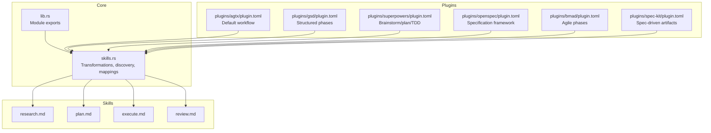
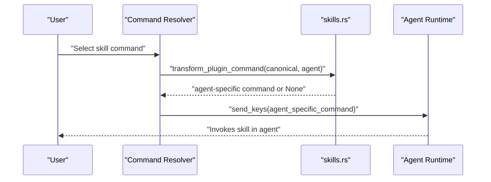
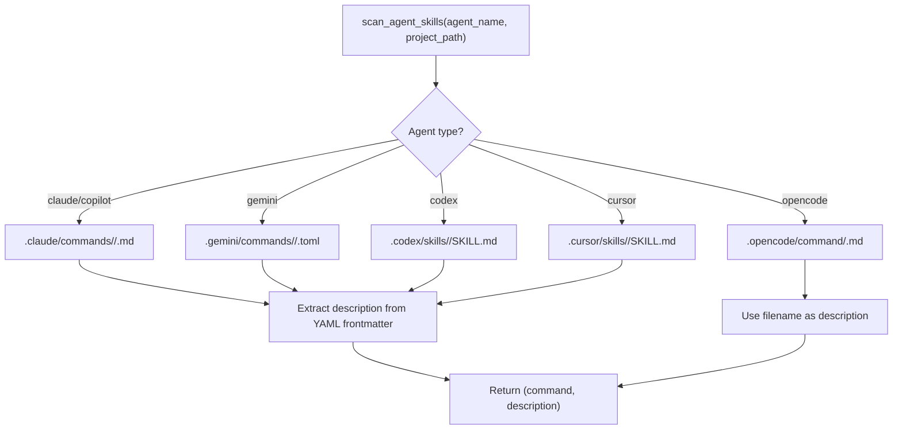
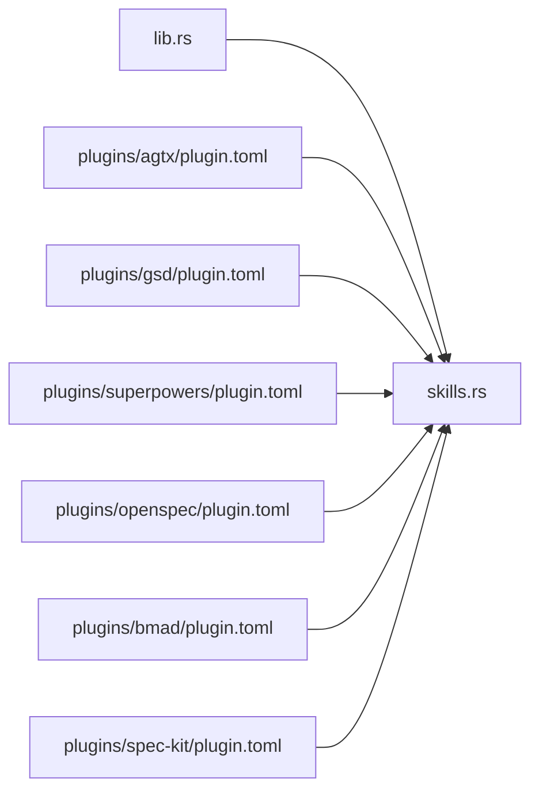

# Skill Transformation System

<cite>
**Referenced Files in This Document**
- [src/skills.rs](file://src/skills.rs)
- [src/lib.rs](file://src/lib.rs)
- [CLAUDE.md](file://CLAUDE.md)
- [AGENTS.md](file://AGENTS.md)
- [plugins/agtx/plugin.toml](file://plugins/agtx/plugin.toml)
- [plugins/gsd/plugin.toml](file://plugins/gsd/plugin.toml)
- [plugins/superpowers/plugin.toml](file://plugins/superpowers/plugin.toml)
- [plugins/openspec/plugin.toml](file://plugins/openspec/plugin.toml)
- [plugins/bmad/plugin.toml](file://plugins/bmad/plugin.toml)
- [plugins/spec-kit/plugin.toml](file://plugins/spec-kit/plugin.toml)
- [plugins/agtx/skills/research.md](file://plugins/agtx/skills/research.md)
- [plugins/agtx/skills/plan.md](file://plugins/agtx/skills/plan.md)
- [plugins/agtx/skills/execute.md](file://plugins/agtx/skills/execute.md)
- [plugins/agtx/skills/review.md](file://plugins/agtx/skills/review.md)
</cite>

## Table of Contents
1. [Introduction](#introduction)
2. [Project Structure](#project-structure)
3. [Core Components](#core-components)
4. [Architecture Overview](#architecture-overview)
5. [Detailed Component Analysis](#detailed-component-analysis)
6. [Dependency Analysis](#dependency-analysis)
7. [Performance Considerations](#performance-considerations)
8. [Troubleshooting Guide](#troubleshooting-guide)
9. [Conclusion](#conclusion)
10. [Appendices](#appendices)

## Introduction
This document explains the skill transformation system that enables cross-agent compatibility in agtx. It focuses on how canonical skill commands are converted into agent-specific formats, how skills are discovered and loaded, and how agent-specific mappings and compatibility are enforced. It also documents transformation rules for Claude/Gemini-style commands and provides compatibility matrices, validation and error handling guidance, performance considerations, and troubleshooting steps.

## Project Structure
The skill transformation system centers around a small set of modules and plugin configurations:
- Canonical skill definitions and transformations live in the skills module.
- Built-in plugins define commands and prompts that are transformed per agent.
- Agent-specific discovery and invocation formats are defined in the skills module and documented in the architecture guide.



**Diagram sources**
- [src/skills.rs:1-409](file://src/skills.rs#L1-L409)
- [src/lib.rs:1-24](file://src/lib.rs#L1-L24)
- [plugins/agtx/plugin.toml:1-16](file://plugins/agtx/plugin.toml#L1-L16)
- [plugins/gsd/plugin.toml:1-34](file://plugins/gsd/plugin.toml#L1-L34)
- [plugins/superpowers/plugin.toml:1-16](file://plugins/superpowers/plugin.toml#L1-L16)
- [plugins/openspec/plugin.toml:1-21](file://plugins/openspec/plugin.toml#L1-L21)
- [plugins/bmad/plugin.toml:1-22](file://plugins/bmad/plugin.toml#L1-L22)
- [plugins/spec-kit/plugin.toml:1-21](file://plugins/spec-kit/plugin.toml#L1-L21)
- [plugins/agtx/skills/research.md:1-45](file://plugins/agtx/skills/research.md#L1-L45)
- [plugins/agtx/skills/plan.md:1-43](file://plugins/agtx/skills/plan.md#L1-L43)
- [plugins/agtx/skills/execute.md:1-39](file://plugins/agtx/skills/execute.md#L1-L39)
- [plugins/agtx/skills/review.md:1-36](file://plugins/agtx/skills/review.md#L1-L36)

**Section sources**
- [src/skills.rs:1-409](file://src/skills.rs#L1-L409)
- [src/lib.rs:1-24](file://src/lib.rs#L1-L24)
- [CLAUDE.md:131-147](file://CLAUDE.md#L131-L147)

## Core Components
- Canonical command format: commands are defined once in canonical form using a namespace and command separated by a colon, prefixed with a leading slash. Example: /agtx:research.
- Agent-native discovery paths: each agent has a specific directory layout and file format for skills.
- Transformation rules: canonical commands are translated per agent according to agent-specific rules.
- Built-in skills: compile-time embedded skill content for research, planning, execution, review, orchestration, and merge-conflicts.
- Discovery and enumeration: built-in skills are enumerated with descriptions; agent-native skills are scanned from disk when present.

Key responsibilities:
- Transform canonical commands into agent-specific formats.
- Map internal skill directory names to agent-native filenames.
- Discover agent-native skills from the project’s worktree.
- Convert skill content to agent-native formats (e.g., Gemini TOML).

**Section sources**
- [src/skills.rs:47-115](file://src/skills.rs#L47-L115)
- [src/skills.rs:141-194](file://src/skills.rs#L141-L194)
- [src/skills.rs:211-226](file://src/skills.rs#L211-L226)
- [src/skills.rs:259-408](file://src/skills.rs#L259-L408)
- [CLAUDE.md:131-147](file://CLAUDE.md#L131-L147)

## Architecture Overview
The skill transformation pipeline converts canonical commands and skill content into agent-specific forms. The canonical command format is transformed based on agent capabilities and syntax expectations. Agent-native discovery paths are scanned to augment the command list with skills defined in the project.



**Diagram sources**
- [src/skills.rs:85-115](file://src/skills.rs#L85-L115)

**Section sources**
- [src/skills.rs:85-115](file://src/skills.rs#L85-L115)
- [CLAUDE.md:142-146](file://CLAUDE.md#L142-L146)

## Detailed Component Analysis

### Canonical Command Transformation
The transform_plugin_command() function converts a canonical command into the agent-specific format. The canonical form is a slash-prefixed namespace-colon-command pattern. The transformation rules are:
- Claude/Gemini: unchanged.
- OpenCode/Cursor: replace the first colon with a hyphen.
- Codex: replace the leading slash with a dollar sign and replace the first colon with a hyphen.
- Unknown agents: return None (fallback to file-path invocation).

```mermaid
flowchart TD
Start(["Input: canonical_cmd, agent_name"]) --> CheckAgent{"agent_name"}
CheckAgent --> |"claude"|"GeminiLike["Return canonical_cmd"]
CheckAgent --> |"gemini"|GeminiLike
CheckAgent --> |"opencode"|Opencode["Replace first ':' with '-'"]
CheckAgent --> |"cursor"|Cursor["Replace first ':' with '-'"]
CheckAgent --> |"codex"|Codex["Replace '/' with '$'<br/>then replace first ':' with '-'"]
CheckAgent --> |Other|Fallback["Return None"]
GeminiLike --> End(["Output: agent-specific command"])
Opencode --> End
Cursor --> End
Codex --> End
Fallback --> End
```

**Diagram sources**
- [src/skills.rs:93-115](file://src/skills.rs#L93-L115)

**Section sources**
- [src/skills.rs:85-115](file://src/skills.rs#L85-L115)
- [CLAUDE.md:142-146](file://CLAUDE.md#L142-L146)

### Agent-Native Skill Discovery and Enumeration
The system enumerates skills in two ways:
- Built-in skills: compile-time embedded content is used to generate agent-native commands and descriptions.
- Agent-native skills: the system scans the active agent’s native command directory for skills defined in the project.

Discovery rules by agent:
- Claude/Copilot: namespaced directories with .md files.
- Gemini: namespaced directories with .toml files.
- Codex: flat skill directories with SKILL.md.
- Cursor: flat skill directories with SKILL.md.
- OpenCode: flat directory with .md files.

Descriptions are extracted from YAML frontmatter when available; otherwise, a fallback description is constructed from the filename.



**Diagram sources**
- [src/skills.rs:259-408](file://src/skills.rs#L259-L408)

**Section sources**
- [src/skills.rs:259-408](file://src/skills.rs#L259-L408)
- [CLAUDE.md:131-139](file://CLAUDE.md#L131-L139)

### Skill Name to Command Conversion
Internal skill directory names (e.g., agtx-plan) are converted to canonical commands by replacing the first hyphen with a colon. This produces a namespace:command pattern suitable for agent-native invocation.

**Section sources**
- [src/skills.rs:47-55](file://src/skills.rs#L47-L55)

### Skill Directory to Filename Mapping
Agent-native filenames are derived from internal skill directory names:
- Gemini: strips the agtx- prefix and appends .toml.
- OpenCode: keeps the full name and appends .md.
- Others: strips the agtx- prefix and appends .md.

**Section sources**
- [src/skills.rs:62-81](file://src/skills.rs#L62-L81)

### Built-in Skills and Content Embedding
Built-in skills are embedded at compile time and include research, plan, execute, review, orchestrate, and merge-conflicts. These are enumerated as agent-native commands with descriptions.

**Section sources**
- [src/skills.rs:5-21](file://src/skills.rs#L5-L21)
- [src/skills.rs:211-226](file://src/skills.rs#L211-L226)

### Plugin Command Definitions and Compatibility
Plugins define commands in canonical form. The system resolves these commands per agent using transform_plugin_command(). Some plugins declare supported_agents to limit compatibility.

Examples:
- agtx plugin: defines /agtx:research, /agtx:plan, /agtx:execute, /agtx:review.
- gsd plugin: defines /gsd:* commands with supported_agents including claude, codex, gemini, opencode.
- superpowers plugin: defines /superpowers:* commands with supported_agents = claude.
- openspec plugin: defines /opsx:* commands.
- bmad plugin: defines /bmad:* commands.
- spec-kit plugin: defines /speckit.* commands.

**Section sources**
- [plugins/agtx/plugin.toml:11-16](file://plugins/agtx/plugin.toml#L11-L16)
- [plugins/gsd/plugin.toml:4-21](file://plugins/gsd/plugin.toml#L4-L21)
- [plugins/superpowers/plugin.toml:3-4](file://plugins/superpowers/plugin.toml#L3-L4)
- [plugins/openspec/plugin.toml:12-14](file://plugins/openspec/plugin.toml#L12-L14)
- [plugins/bmad/plugin.toml:10-13](file://plugins/bmad/plugin.toml#L10-L13)
- [plugins/spec-kit/plugin.toml:14-18](file://plugins/spec-kit/plugin.toml#L14-L18)

### Skill Content Conversion for Gemini
Gemini expects TOML command files with description and prompt fields. The system converts skill markdown content (with YAML frontmatter) into a TOML representation, escaping special characters for multi-line strings.

**Section sources**
- [src/skills.rs:128-139](file://src/skills.rs#L128-L139)

### Examples of Transformation Patterns
Common skills and their transformation patterns:
- Research: canonical /agtx:research remains unchanged for Claude/Gemini; becomes /agtx-research for OpenCode/Cursor; becomes $agtx-research for Codex.
- Planning: canonical /agtx:plan remains unchanged for Claude/Gemini; becomes /agtx-research for OpenCode/Cursor; becomes $agtx-research for Codex.
- Execution: canonical /agtx:execute remains unchanged for Claude/Gemini; becomes /agtx-execute for OpenCode/Cursor; becomes $agtx-execute for Codex.
- Review: canonical /agtx:review remains unchanged for Claude/Gemini; becomes /agtx-review for OpenCode/Cursor; becomes $agtx-review for Codex.

These patterns apply uniformly across plugins that use the agtx namespace.

**Section sources**
- [plugins/agtx/plugin.toml:12-15](file://plugins/agtx/plugin.toml#L12-L15)
- [src/skills.rs:93-115](file://src/skills.rs#L93-L115)
- [CLAUDE.md:142-146](file://CLAUDE.md#L142-L146)

## Dependency Analysis
The skills module is the central dependency hub for transformation and discovery. Plugins depend on the skills module for command resolution and content embedding. The library module re-exports the skills module for consumers.



**Diagram sources**
- [src/lib.rs:1-24](file://src/lib.rs#L1-L24)
- [src/skills.rs:141-194](file://src/skills.rs#L141-L194)
- [plugins/agtx/plugin.toml:1-16](file://plugins/agtx/plugin.toml#L1-L16)
- [plugins/gsd/plugin.toml:1-34](file://plugins/gsd/plugin.toml#L1-L34)
- [plugins/superpowers/plugin.toml:1-16](file://plugins/superpowers/plugin.toml#L1-L16)
- [plugins/openspec/plugin.toml:1-21](file://plugins/openspec/plugin.toml#L1-L21)
- [plugins/bmad/plugin.toml:1-22](file://plugins/bmad/plugin.toml#L1-L22)
- [plugins/spec-kit/plugin.toml:1-21](file://plugins/spec-kit/plugin.toml#L1-L21)

**Section sources**
- [src/lib.rs:1-24](file://src/lib.rs#L1-L24)
- [src/skills.rs:141-194](file://src/skills.rs#L141-L194)

## Performance Considerations
- Compile-time embedding: Built-in skills and plugin configurations are embedded at compile time, eliminating runtime IO for core assets.
- Minimal filesystem scanning: Agent-native discovery reads only the necessary directories and files; scanning is scoped to agent-native paths.
- Caching: Plugin instances are cached per task to avoid repeated disk reads.
- Background refresh: Phase status polling uses a background thread with a cache TTL to reduce overhead.
- Memory efficiency: Descriptions are extracted from frontmatter buffers and returned as owned strings; TOML conversion escapes characters efficiently.

Recommendations:
- Prefer built-in skills and embedded plugins for predictable performance.
- Keep agent-native directories minimal to reduce scan time.
- Use supported_agents in plugin TOML to avoid unnecessary compatibility checks.

**Section sources**
- [src/skills.rs:141-194](file://src/skills.rs#L141-L194)
- [src/skills.rs:259-408](file://src/skills.rs#L259-L408)
- [CLAUDE.md:335-343](file://CLAUDE.md#L335-L343)

## Troubleshooting Guide
Common issues and resolutions:
- Unsupported agent: transform_plugin_command() returns None for unknown agents. The system falls back to file-path invocation. Verify agent_name matches known agents.
- Missing agent-native skills: scan_agent_skills() returns an empty list if the native directory is absent or unreadable. Ensure the agent’s native directory exists and contains the expected files.
- Incorrect command format: ensure commands are defined in canonical form (/namespace:command) and rely on transform_plugin_command() for agent-specific variants.
- Frontmatter parsing: descriptions are extracted from YAML frontmatter. If missing, a fallback description is used. Ensure SKILL.md includes proper frontmatter.
- Gemini TOML conversion: skill_to_gemini_toml() escapes characters for TOML. If a command does not appear, verify the skill content and frontmatter.
- Plugin compatibility: some plugins specify supported_agents. If a plugin is incompatible with the agent, adjust the active plugin or agent selection.

Validation checklist:
- Confirm canonical commands are defined in plugin TOML.
- Verify transform_plugin_command() produces the expected agent-specific command.
- Confirm agent-native discovery finds skills in the correct directories and formats.
- Ensure skill content includes YAML frontmatter for descriptions.

**Section sources**
- [src/skills.rs:93-115](file://src/skills.rs#L93-L115)
- [src/skills.rs:259-408](file://src/skills.rs#L259-L408)
- [src/skills.rs:196-209](file://src/skills.rs#L196-L209)
- [src/skills.rs:128-139](file://src/skills.rs#L128-L139)
- [plugins/gsd/plugin.toml](file://plugins/gsd/plugin.toml#L4)

## Conclusion
The skill transformation system provides a robust, extensible mechanism for cross-agent compatibility. By defining commands once in canonical form and applying precise transformation rules per agent, agtx ensures consistent behavior across Claude, Gemini, Codex, Copilot, OpenCode, and Cursor. Built-in skills and plugin configurations are embedded for reliability, while agent-native discovery augments the command set with project-specific skills. The compatibility matrix and validation procedures outlined here enable predictable operation and efficient troubleshooting.

## Appendices

### Compatibility Matrix
Agents and their command transformation behavior:
- Claude: canonical commands unchanged.
- Gemini: canonical commands unchanged; skills stored as .toml.
- Codex: canonical commands transformed to $namespace-command.
- OpenCode: canonical commands transformed to namespace-command.
- Cursor: canonical commands transformed to namespace-command.
- Copilot: no interactive skill invocation; commands sent via prompts.

**Section sources**
- [src/skills.rs:93-115](file://src/skills.rs#L93-L115)
- [src/skills.rs:62-81](file://src/skills.rs#L62-L81)
- [CLAUDE.md:131-147](file://CLAUDE.md#L131-L147)

### Agent-Native Skill Locations
- Claude: .claude/commands/<namespace>/<command>.md
- Gemini: .gemini/commands/<namespace>/<command>.toml
- Codex: .codex/skills/<skill>/SKILL.md
- Cursor: .cursor/skills/<skill>/SKILL.md
- OpenCode: .opencode/command/<command>.md
- Copilot: .github/agents/<namespace>/<command>.md

**Section sources**
- [src/skills.rs:35-44](file://src/skills.rs#L35-L44)
- [CLAUDE.md:131-139](file://CLAUDE.md#L131-L139)

### Built-in Skills Reference
- research.md: canonical name agtx-research
- plan.md: canonical name agtx-plan
- execute.md: canonical name agtx-execute
- review.md: canonical name agtx-review

**Section sources**
- [plugins/agtx/skills/research.md:1-45](file://plugins/agtx/skills/research.md#L1-L45)
- [plugins/agtx/skills/plan.md:1-43](file://plugins/agtx/skills/plan.md#L1-L43)
- [plugins/agtx/skills/execute.md:1-39](file://plugins/agtx/skills/execute.md#L1-L39)
- [plugins/agtx/skills/review.md:1-36](file://plugins/agtx/skills/review.md#L1-L36)