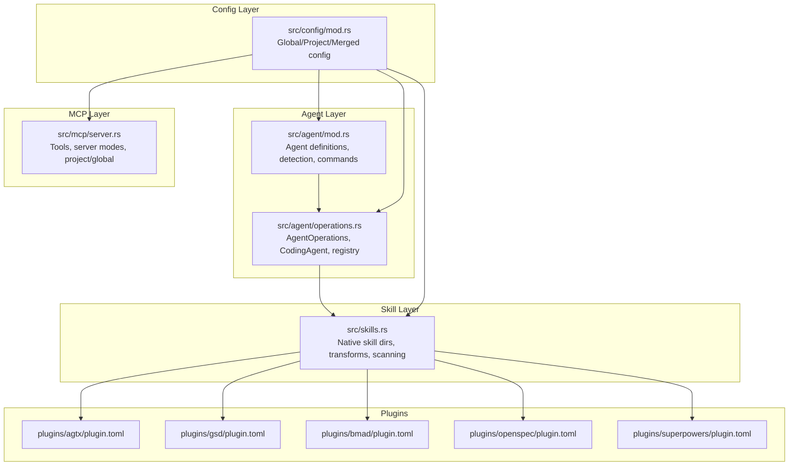
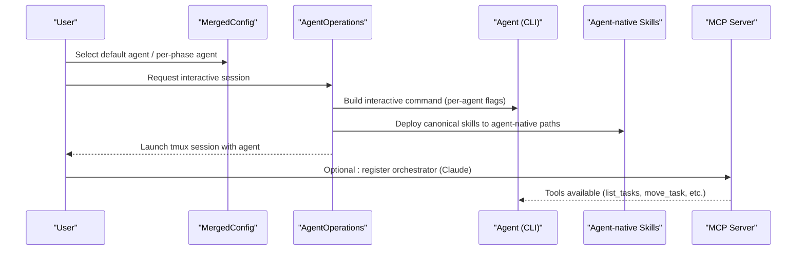
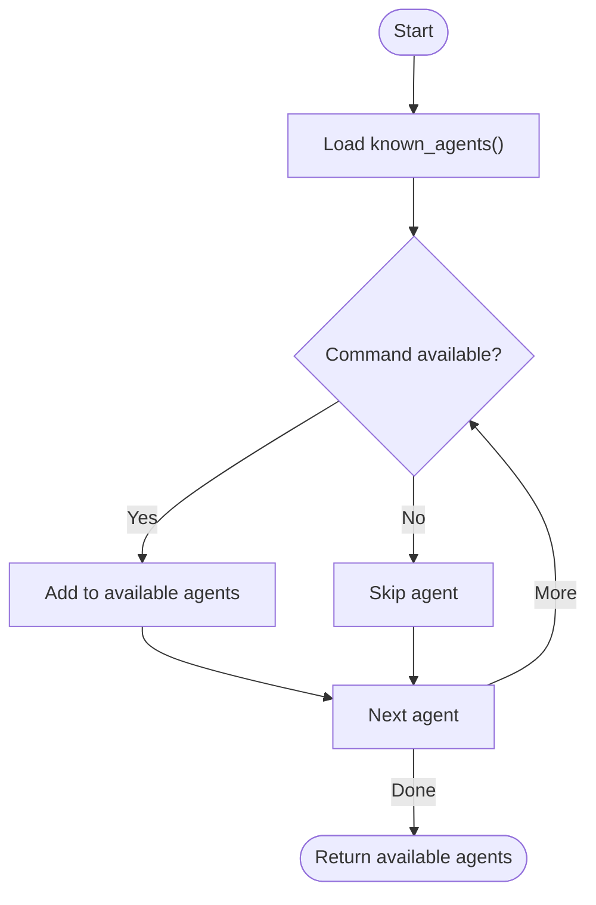
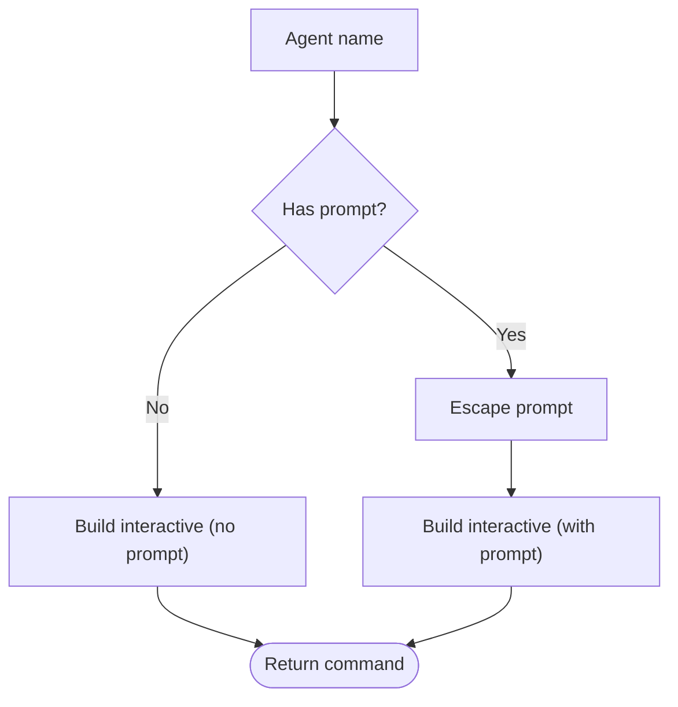
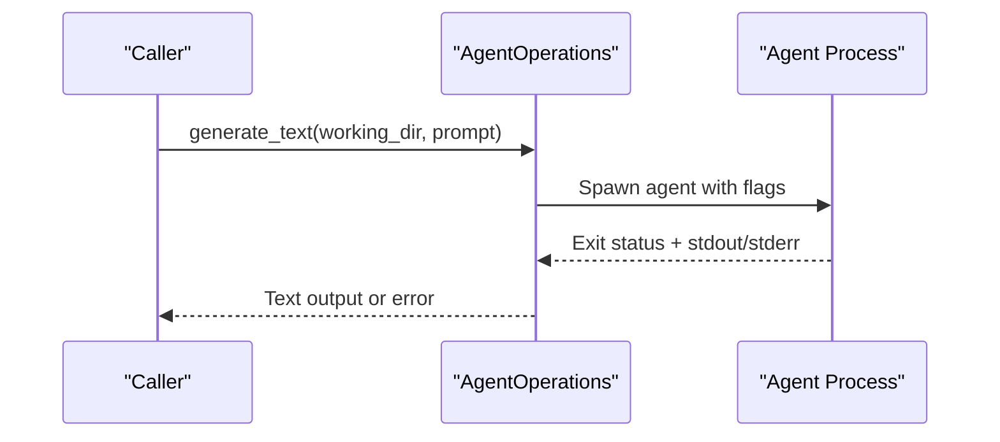
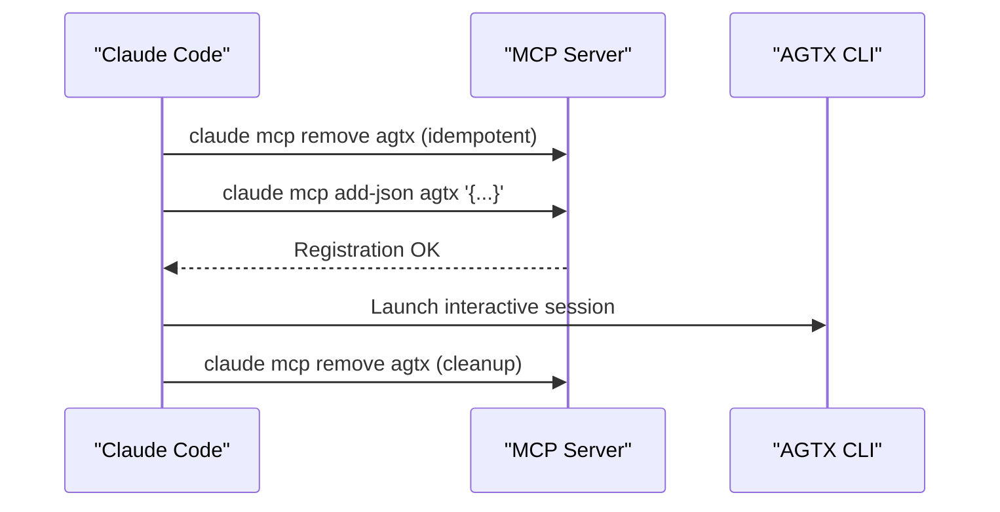
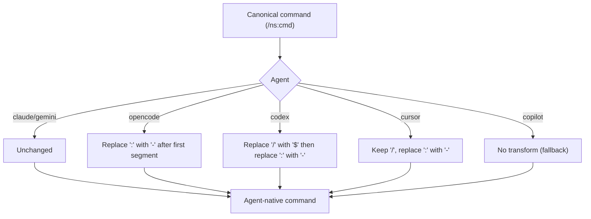
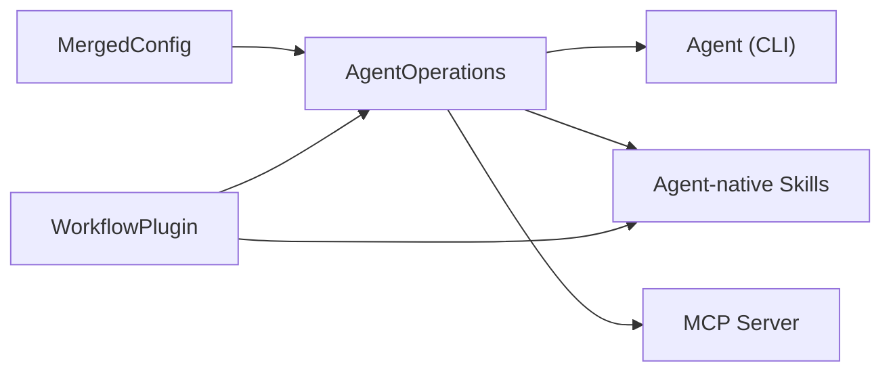

# Supported Agents

<cite>
**Referenced Files in This Document**
- [AGENTS.md](file://AGENTS.md)
- [CLAUDE.md](file://CLAUDE.md)
- [src/agent/mod.rs](file://src/agent/mod.rs)
- [src/agent/operations.rs](file://src/agent/operations.rs)
- [src/skills.rs](file://src/skills.rs)
- [src/config/mod.rs](file://src/config/mod.rs)
- [src/mcp/server.rs](file://src/mcp/server.rs)
- [plugins/agtx/plugin.toml](file://plugins/agtx/plugin.toml)
- [plugins/gsd/plugin.toml](file://plugins/gsd/plugin.toml)
- [plugins/bmad/plugin.toml](file://plugins/bmad/plugin.toml)
- [plugins/openspec/plugin.toml](file://plugins/openspec/plugin.toml)
- [plugins/superpowers/plugin.toml](file://plugins/superpowers/plugin.toml)
- [tests/agent_tests.rs](file://tests/agent_tests.rs)
</cite>

## Table of Contents
1. [Introduction](#introduction)
2. [Project Structure](#project-structure)
3. [Core Components](#core-components)
4. [Architecture Overview](#architecture-overview)
5. [Detailed Component Analysis](#detailed-component-analysis)
6. [Dependency Analysis](#dependency-analysis)
7. [Performance Considerations](#performance-considerations)
8. [Troubleshooting Guide](#troubleshooting-guide)
9. [Conclusion](#conclusion)
10. [Appendices](#appendices)

## Introduction
This document explains the AI coding agents supported by AGTX and how the system integrates them. It covers agent detection, command-line interfaces, interactive and non-interactive modes, skill invocation, MCP orchestration, compatibility matrices, and practical setup and troubleshooting guidance. The goal is to help users configure and operate Claude Code, Codex, Gemini CLI, Cursor Agent, Copilot, and OpenCode within AGTX’s terminal-native kanban workflow.

## Project Structure
AGTX organizes agent-related logic across several modules:
- Agent detection and spawning: src/agent/mod.rs and src/agent/operations.rs
- Skill deployment and command transformation: src/skills.rs
- Configuration and defaults: src/config/mod.rs
- MCP server for orchestration: src/mcp/server.rs
- Plugin workflows and compatibility: plugins/*/plugin.toml
- Documentation and examples: AGENTS.md and CLAUDE.md

**Diagram sources**
- [src/agent/mod.rs:1-171](file://src/agent/mod.rs#L1-L171)
- [src/agent/operations.rs:1-163](file://src/agent/operations.rs#L1-L163)
- [src/skills.rs:1-409](file://src/skills.rs#L1-L409)
- [src/config/mod.rs:1-595](file://src/config/mod.rs#L1-L595)
- [src/mcp/server.rs:1-800](file://src/mcp/server.rs#L1-L800)
- [plugins/agtx/plugin.toml:1-16](file://plugins/agtx/plugin.toml#L1-L16)
- [plugins/gsd/plugin.toml:1-34](file://plugins/gsd/plugin.toml#L1-L34)
- [plugins/bmad/plugin.toml:1-22](file://plugins/bmad/plugin.toml#L1-L22)
- [plugins/openspec/plugin.toml:1-21](file://plugins/openspec/plugin.toml#L1-L21)
- [plugins/superpowers/plugin.toml:1-16](file://plugins/superpowers/plugin.toml#L1-L16)

**Section sources**
- [AGENTS.md:1-61](file://AGENTS.md#L1-L61)
- [CLAUDE.md:21-92](file://CLAUDE.md#L21-L92)

## Core Components
- Agent detection and availability: AGTX detects installed agents by name and reports availability. Detection is deterministic and ordered.
- Interactive and resume commands: Each agent has a tailored interactive launch command and a resume command for recovery after restarts.
- Non-interactive text generation: Agents support a non-interactive mode for tasks like PR description generation.
- MCP orchestration: Claude Code supports registering an MCP service for orchestration; other agents currently launch interactively.
- Skill system: Canonical skills are translated per-agent into native command formats and discovered in agent-specific directories.

**Section sources**
- [src/agent/mod.rs:31-77](file://src/agent/mod.rs#L31-L77)
- [src/agent/mod.rs:124-130](file://src/agent/mod.rs#L124-L130)
- [src/agent/operations.rs:55-108](file://src/agent/operations.rs#L55-L108)
- [src/skills.rs:31-115](file://src/skills.rs#L31-L115)

## Architecture Overview
The agent integration pipeline:
- Configuration determines default agent and per-phase overrides.
- Plugins define commands, prompts, and artifacts per phase.
- AGTX resolves the agent for each phase, transforms plugin commands into agent-native forms, and deploys skills to agent-native locations.
- Interactive sessions are launched into tmux windows; non-interactive generation uses agent-specific flags.
- MCP server exposes tools for orchestration (currently Claude Code).

**Diagram sources**
- [src/config/mod.rs:355-408](file://src/config/mod.rs#L355-L408)
- [src/agent/operations.rs:55-108](file://src/agent/operations.rs#L55-L108)
- [src/skills.rs:31-115](file://src/skills.rs#L31-L115)
- [src/mcp/server.rs:521-520](file://src/mcp/server.rs#L521-L520)

## Detailed Component Analysis

### Agent Availability and Detection
- AGTX maintains a known list of agents and checks availability by command presence.
- Detected agents are presented in order of preference; unknown agents fall back gracefully.

**Diagram sources**
- [src/agent/mod.rs:80-130](file://src/agent/mod.rs#L80-L130)

**Section sources**
- [src/agent/mod.rs:124-130](file://src/agent/mod.rs#L124-L130)
- [tests/agent_tests.rs:49-66](file://tests/agent_tests.rs#L49-L66)

### Interactive and Resume Commands
- Interactive command construction varies by agent and supports optional initial prompt injection.
- Resume command constructs a “continue” or “--resume” variant for recovery scenarios.

**Diagram sources**
- [src/agent/mod.rs:50-76](file://src/agent/mod.rs#L50-L76)

**Section sources**
- [src/agent/mod.rs:36-76](file://src/agent/mod.rs#L36-L76)
- [tests/agent_tests.rs:68-114](file://tests/agent_tests.rs#L68-L114)
- [tests/agent_tests.rs:120-149](file://tests/agent_tests.rs#L120-L149)

### Non-Interactive Text Generation
- Each agent supports a non-interactive mode for generating text (e.g., PR descriptions).
- The implementation shells out with agent-specific flags and captures stdout.

**Diagram sources**
- [src/agent/operations.rs:55-78](file://src/agent/operations.rs#L55-L78)

**Section sources**
- [src/agent/operations.rs:55-78](file://src/agent/operations.rs#L55-L78)

### MCP Orchestration (Claude Code)
- Claude Code can register an MCP service scoped to the local session and clean up on exit.
- Other agents launch interactively without MCP registration.

**Diagram sources**
- [src/agent/operations.rs:92-107](file://src/agent/operations.rs#L92-L107)

**Section sources**
- [src/agent/operations.rs:92-107](file://src/agent/operations.rs#L92-L107)

### Skill Deployment and Command Transformation
- Canonical skills are deployed to agent-native discovery paths.
- Plugin commands are transformed per-agent:
  - Claude/Gemini: unchanged
  - OpenCode: colon → hyphen
  - Codex: slash → dollar + colon → hyphen
  - Cursor: slash kept, colon → hyphen
  - Copilot: no interactive command transform (fallback to file-path reference)

**Diagram sources**
- [src/skills.rs:83-115](file://src/skills.rs#L83-L115)

**Section sources**
- [src/skills.rs:31-115](file://src/skills.rs#L31-L115)
- [tests/agent_tests.rs:188-220](file://tests/agent_tests.rs#L188-L220)

### Agent-Specific Capabilities and Command Formats
- Claude Code CLI
  - Interactive flags: skip permissions
  - Resume: continue
  - MCP orchestration supported
- Codex CLI
  - Interactive flags: full-auto
  - Resume: resume --last
  - Non-interactive exec with full-auto
- Copilot CLI
  - Interactive flags: allow all tools
  - Resume: continue
  - No interactive skill invocation (prompt-only)
- Gemini CLI
  - Interactive flags: approval-mode yolo
  - Resume: resume
  - Non-interactive prompt via -p/-i
- OpenCode
  - Interactive: no extra flags
  - Resume: --continue
  - Command format: slash → hyphen
- Cursor Agent
  - Interactive flags: --yolo
  - Resume: --continue
  - Command format: slash kept, colon → hyphen

**Section sources**
- [src/agent/mod.rs:50-76](file://src/agent/mod.rs#L50-L76)
- [src/agent/mod.rs:36-48](file://src/agent/mod.rs#L36-L48)
- [src/agent/operations.rs:55-108](file://src/agent/operations.rs#L55-L108)
- [tests/agent_tests.rs:68-149](file://tests/agent_tests.rs#L68-L149)

### Authentication and Environment
- AGTX does not inject or manage credentials. Agents are launched as installed CLIs; ensure your environment has the agent binaries and any required authentication configured in the agent itself.
- Configuration files:
  - Global config: ~/.config/agtx/config.toml
  - Project config: .agtx/config.toml (in project root)
- Environment variables are not explicitly required by AGTX; however, agents may require their own environment variables or configuration files.

**Section sources**
- [src/config/mod.rs:230-274](file://src/config/mod.rs#L230-L274)
- [src/config/mod.rs:276-303](file://src/config/mod.rs#L276-L303)

### Compatibility Matrices
- Plugins can declare supported agents via supported_agents. If empty, all agents are assumed compatible.
- Example compatibility:
  - GSD: ["claude", "codex", "gemini", "opencode"]
  - Superpowers: ["claude"]
  - OpenSpec: no explicit restriction (assumed all agents)
  - BMAD: no explicit restriction (assumed all agents)

**Section sources**
- [plugins/gsd/plugin.toml:4](file://plugins/gsd/plugin.toml#L4)
- [plugins/superpowers/plugin.toml:3](file://plugins/superpowers/plugin.toml#L3)
- [plugins/openspec/plugin.toml:1-21](file://plugins/openspec/plugin.toml#L1-L21)
- [plugins/bmad/plugin.toml:1-22](file://plugins/bmad/plugin.toml#L1-L22)
- [src/config/mod.rs:539-543](file://src/config/mod.rs#L539-L543)

### Setup Instructions
- Install the agent CLI(s) on your system.
- Configure default agent and per-phase overrides in global or project config.
- Ensure tmux is available for session management.
- For Copilot, confirm interactive skill invocation is not applicable; use prompt-only flows.

**Section sources**
- [src/config/mod.rs:355-408](file://src/config/mod.rs#L355-L408)
- [CLAUDE.md:228-247](file://CLAUDE.md#L228-L247)

## Dependency Analysis
Agent integration depends on:
- Configuration for default and per-phase agent selection
- Plugin definitions for commands, prompts, and artifacts
- Skill transformation and deployment to agent-native directories
- MCP server for orchestration (Claude Code)

**Diagram sources**
- [src/config/mod.rs:355-408](file://src/config/mod.rs#L355-L408)
- [src/agent/operations.rs:55-108](file://src/agent/operations.rs#L55-L108)
- [src/skills.rs:31-115](file://src/skills.rs#L31-L115)
- [src/mcp/server.rs:521-520](file://src/mcp/server.rs#L521-L520)

**Section sources**
- [src/config/mod.rs:410-595](file://src/config/mod.rs#L410-L595)
- [src/skills.rs:141-194](file://src/skills.rs#L141-L194)

## Performance Considerations
- Command construction and escaping are lightweight string operations.
- Non-interactive generation shells out to agents; overhead is proportional to agent runtime.
- MCP server adds minimal latency; orchestration is JSON-RPC over stdio.
- Skill scanning enumerates directories; ensure agent-native directories are organized to minimize IO.

[No sources needed since this section provides general guidance]

## Troubleshooting Guide
Common issues and resolutions:
- Agent not detected
  - Ensure the agent binary is installed and on PATH.
  - Confirm availability via detection logic.
- Interactive session fails to start
  - Verify agent-specific flags and resume variants.
  - Check tmux server availability and permissions.
- Copilot skill invocation not working
  - Copilot does not support interactive skill commands; use prompt-only flows.
- Plugin command not recognized
  - Confirm command transformation for the agent.
  - Ensure skills are deployed to agent-native paths.
- MCP registration conflicts
  - For Claude Code, the orchestrator command removes stale registrations before adding new ones.

**Section sources**
- [src/agent/mod.rs:124-130](file://src/agent/mod.rs#L124-L130)
- [src/agent/operations.rs:92-107](file://src/agent/operations.rs#L92-L107)
- [src/skills.rs:83-115](file://src/skills.rs#L83-L115)
- [tests/agent_tests.rs:161-182](file://tests/agent_tests.rs#L161-L182)

## Conclusion
AGTX provides a unified, terminal-native workflow for multiple AI coding agents. By detecting installed agents, translating canonical commands into agent-native forms, deploying skills to agent-native directories, and offering optional MCP orchestration for Claude Code, AGTX streamlines multi-agent development. Configuration and plugin systems enable flexible compatibility and per-phase customization across Claude Code, Codex, Copilot, Gemini CLI, OpenCode, and Cursor Agent.

[No sources needed since this section summarizes without analyzing specific files]

## Appendices

### Practical Examples of Agent-Specific Commands
- Claude Code
  - Interactive: claude --dangerously-skip-permissions
  - Resume: claude --dangerously-skip-permissions --continue
- Codex
  - Interactive: codex --full-auto
  - Resume: codex resume --last
  - Non-interactive: codex exec --full-auto "<prompt>"
- Copilot
  - Interactive: copilot --allow-all-tools
  - Resume: copilot --allow-all-tools --continue
  - No interactive skill invocation
- Gemini
  - Interactive: gemini --approval-mode yolo
  - Resume: gemini --approval-mode yolo --resume
  - Non-interactive: gemini -p "<prompt>" or gemini -i "<prompt>"
- OpenCode
  - Interactive: opencode
  - Resume: opencode --continue
  - Command format: /ns-plan-phase (colon → hyphen)
- Cursor Agent
  - Interactive: agent --yolo
  - Resume: agent --yolo --continue
  - Command format: /ns-plan (slash kept, colon → hyphen)

**Section sources**
- [src/agent/mod.rs:50-76](file://src/agent/mod.rs#L50-L76)
- [src/agent/mod.rs:36-48](file://src/agent/mod.rs#L36-L48)
- [src/agent/operations.rs:55-78](file://src/agent/operations.rs#L55-L78)
- [src/skills.rs:83-115](file://src/skills.rs#L83-L115)

### Configuration Options
- Global config (~/.config/agtx/config.toml)
  - default_agent: default agent for new tasks
  - agents: per-phase agent overrides
  - worktree: isolation settings
  - theme: UI color configuration
  - fullscreen_on_enter: attach behavior
- Project config (.agtx/config.toml)
  - default_agent, agents, base_branch, github_url, worktree_dir, copy_files, init_script, cleanup_script, workflow_plugin

**Section sources**
- [src/config/mod.rs:6-27](file://src/config/mod.rs#L6-L27)
- [src/config/mod.rs:199-228](file://src/config/mod.rs#L199-L228)
- [src/config/mod.rs:230-303](file://src/config/mod.rs#L230-L303)