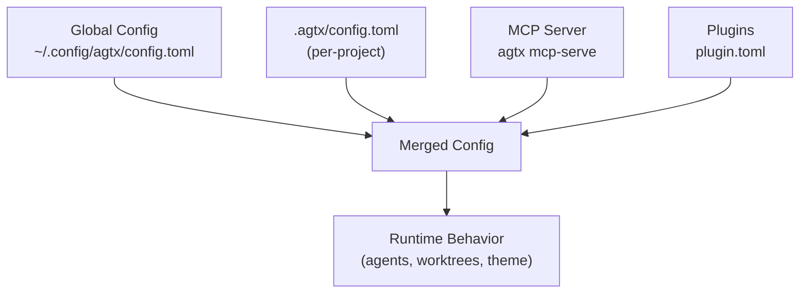
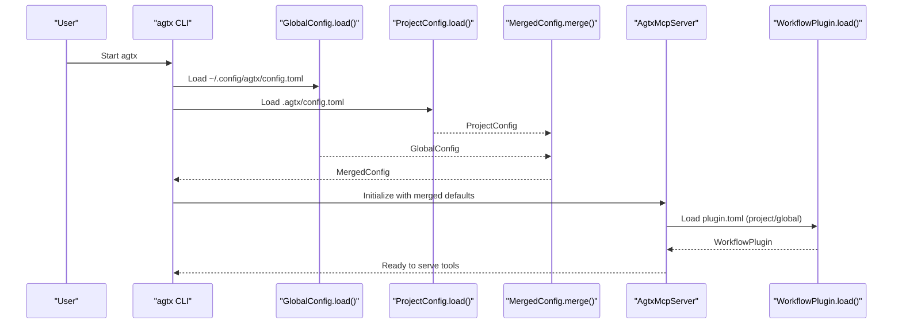
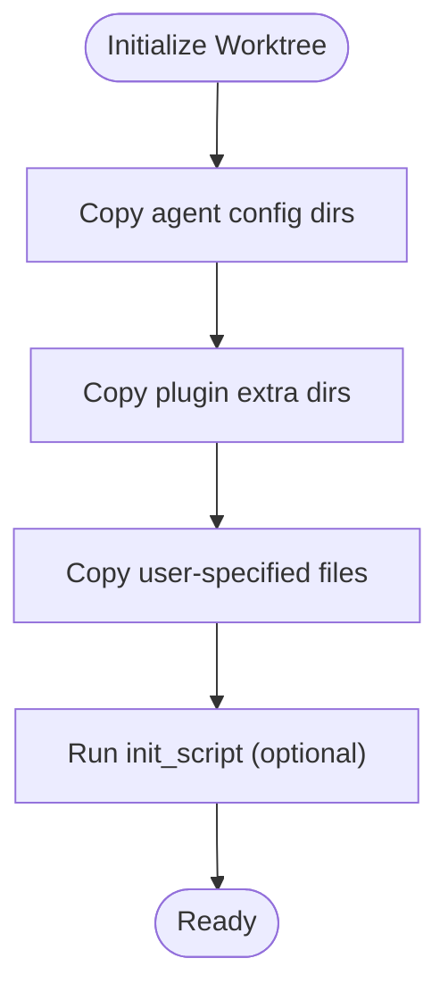
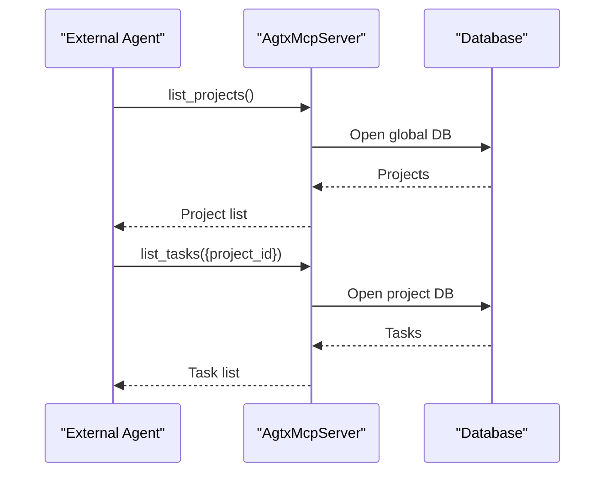
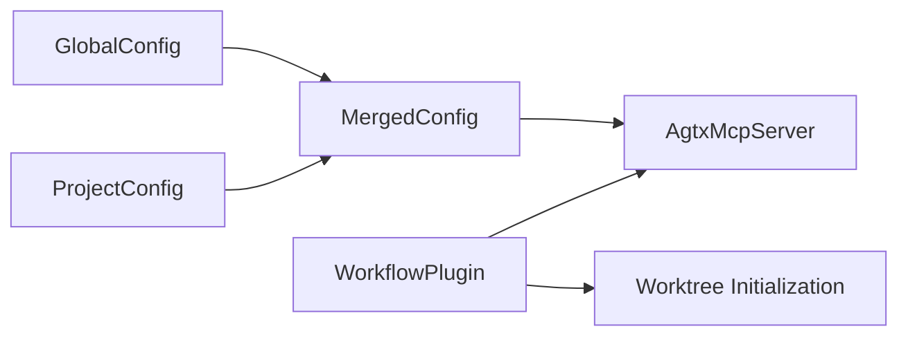

# Configuration Management

<cite>
**Referenced Files in This Document**
- [src/config/mod.rs](file://src/config/mod.rs)
- [src/main.rs](file://src/main.rs)
- [src/mcp/server.rs](file://src/mcp/server.rs)
- [src/git/worktree.rs](file://src/git/worktree.rs)
- [tests/config_tests.rs](file://tests/config_tests.rs)
- [tests/mcp_tests.rs](file://tests/mcp_tests.rs)
- [.mcp.json](file://.mcp.json)
- [README.md](file://README.md)
- [plugins/agtx/plugin.toml](file://plugins/agtx/plugin.toml)
- [plugins/gsd/plugin.toml](file://plugins/gsd/plugin.toml)
- [plugins/spec-kit/plugin.toml](file://plugins/spec-kit/plugin.toml)
- [plugins/void/plugin.toml](file://plugins/void/plugin.toml)
</cite>

## Table of Contents
1. [Introduction](#introduction)
2. [Project Structure](#project-structure)
3. [Core Components](#core-components)
4. [Architecture Overview](#architecture-overview)
5. [Detailed Component Analysis](#detailed-component-analysis)
6. [Dependency Analysis](#dependency-analysis)
7. [Performance Considerations](#performance-considerations)
8. [Troubleshooting Guide](#troubleshooting-guide)
9. [Conclusion](#conclusion)
10. [Appendices](#appendices)

## Introduction
This document explains agtx configuration management with a focus on the hierarchical settings system and customization options. It covers:
- Global configuration stored under the user’s home directory
- Project-specific configuration under each repository
- Per-phase agent configuration across phases
- Theme and appearance customization
- MCP server configuration and external integrations
- Configuration validation, migration, and troubleshooting
- Practical examples for team-wide and project-specific setups
- Security considerations and best practices

## Project Structure
Agtx organizes configuration in two primary locations:
- Global configuration: ~/.config/agtx/config.toml
- Project configuration: .agtx/config.toml within each repository

The configuration system merges global and project settings, with project-level keys overriding global defaults. Plugins and MCP server integrate with configuration to drive agent behavior and external tooling.

**Diagram sources**
- [src/config/mod.rs:232-274](file://src/config/mod.rs#L232-L274)
- [src/config/mod.rs:276-303](file://src/config/mod.rs#L276-L303)
- [src/config/mod.rs:355-408](file://src/config/mod.rs#L355-L408)
- [src/mcp/server.rs:401-471](file://src/mcp/server.rs#L401-L471)

**Section sources**
- [src/config/mod.rs:232-274](file://src/config/mod.rs#L232-L274)
- [src/config/mod.rs:276-303](file://src/config/mod.rs#L276-L303)
- [src/config/mod.rs:355-408](file://src/config/mod.rs#L355-L408)
- [README.md:261-327](file://README.md#L261-L327)

## Core Components
- GlobalConfig: Defines default agent, per-phase agent overrides, worktree defaults, theme, and fullscreen behavior.
- ProjectConfig: Overrides global defaults for a specific repository, including base branch, worktree directory, copy files, init/cleanup scripts, and workflow plugin.
- MergedConfig: Produces effective runtime configuration by combining global and project settings, with project-level keys taking precedence.
- ThemeConfig: Controls terminal UI colors using hex values.
- WorkflowPlugin: Describes plugin behavior (commands, prompts, artifacts, copy-back, auto-dismiss rules) and loads from project or global plugin directories.

Key behaviors:
- Per-phase agent selection falls back to default_agent if no phase-specific override is set.
- Worktree settings default to global unless overridden at project level.
- Theme colors are validated via hex parsing.

**Section sources**
- [src/config/mod.rs:6-39](file://src/config/mod.rs#L6-L39)
- [src/config/mod.rs:151-158](file://src/config/mod.rs#L151-L158)
- [src/config/mod.rs:160-197](file://src/config/mod.rs#L160-L197)
- [src/config/mod.rs:410-594](file://src/config/mod.rs#L410-L594)
- [src/config/mod.rs:355-408](file://src/config/mod.rs#L355-L408)
- [tests/config_tests.rs:210-296](file://tests/config_tests.rs#L210-L296)

## Architecture Overview
The configuration pipeline integrates with the MCP server and plugin system to deliver a cohesive developer experience.

**Diagram sources**
- [src/main.rs:63-89](file://src/main.rs#L63-L89)
- [src/config/mod.rs:232-274](file://src/config/mod.rs#L232-L274)
- [src/config/mod.rs:276-303](file://src/config/mod.rs#L276-L303)
- [src/config/mod.rs:355-408](file://src/config/mod.rs#L355-L408)
- [src/mcp/server.rs:457-471](file://src/mcp/server.rs#L457-L471)
- [src/config/mod.rs:545-594](file://src/config/mod.rs#L545-L594)

## Detailed Component Analysis

### Global Configuration
- Location: ~/.config/agtx/config.toml
- Fields:
  - default_agent: default AI agent for tasks
  - agents: per-phase agent overrides (research, planning, running, review)
  - worktree: worktree behavior (enabled, auto_cleanup, base_branch, worktree_dir)
  - theme: hex color palette for UI
  - fullscreen_on_enter: attach to tmux session on task popup

Behavior:
- Worktree directory defaults to a constant value if not set.
- Theme color parsing validates hex values and provides defaults.

**Section sources**
- [src/config/mod.rs:6-39](file://src/config/mod.rs#L6-L39)
- [src/config/mod.rs:160-197](file://src/config/mod.rs#L160-L197)
- [src/config/mod.rs:41-95](file://src/config/mod.rs#L41-L95)
- [src/config/mod.rs:191-193](file://src/config/mod.rs#L191-L193)
- [tests/config_tests.rs:8-46](file://tests/config_tests.rs#L8-L46)

### Project-Specific Configuration
- Location: .agtx/config.toml
- Overrides:
  - default_agent
  - agents
  - base_branch
  - worktree_dir
  - github_url
  - copy_files
  - init_script
  - cleanup_script
  - workflow_plugin

Behavior:
- Project-level keys override global defaults in MergedConfig.
- Worktree directory can be set per project.
- Scripts enable pre/post worktree lifecycle automation.

**Section sources**
- [src/config/mod.rs:199-228](file://src/config/mod.rs#L199-L228)
- [src/config/mod.rs:355-388](file://src/config/mod.rs#L355-L388)
- [README.md:283-303](file://README.md#L283-L303)

### Per-Phase Agent Configuration
- Global and project scopes support per-phase agent overrides.
- agent_for_phase returns the effective agent for a phase, falling back to default_agent when no phase-specific override is set.
- explicit_agent_for_phase returns the phase-specific agent or None if unset.

Examples:
- Team-wide default agent plus per-phase overrides in global config.toml
- Project-specific overrides in .agtx/config.toml

**Section sources**
- [src/config/mod.rs:151-158](file://src/config/mod.rs#L151-L158)
- [src/config/mod.rs:390-407](file://src/config/mod.rs#L390-L407)
- [tests/config_tests.rs:212-296](file://tests/config_tests.rs#L212-L296)
- [README.md:308-327](file://README.md#L308-L327)

### Theme and Appearance
- ThemeConfig defines colors for selected, normal, dimmed, text, accent, descriptions, column headers, popup borders, and popup headers.
- Colors are validated via hex parsing; invalid values are rejected.
- Defaults are provided for all theme fields.

**Section sources**
- [src/config/mod.rs:41-95](file://src/config/mod.rs#L41-L95)
- [tests/config_tests.rs:8-46](file://tests/config_tests.rs#L8-L46)

### Worktree Settings and Lifecycle
- WorktreeConfig controls whether worktrees are enabled and cleaned up automatically, base branch detection, and worktree directory.
- ProjectConfig can override base_branch and worktree_dir.
- Worktree initialization copies agent config directories, plugin-specific directories, and user-specified files; it also runs init_script and cleanup_script.

**Diagram sources**
- [src/git/worktree.rs:125-158](file://src/git/worktree.rs#L125-L158)
- [src/config/mod.rs:200-228](file://src/config/mod.rs#L200-L228)

**Section sources**
- [src/config/mod.rs:160-197](file://src/config/mod.rs#L160-L197)
- [src/config/mod.rs:200-228](file://src/config/mod.rs#L200-L228)
- [src/git/worktree.rs:125-158](file://src/git/worktree.rs#L125-L158)

### MCP Server Configuration and External Integration
- MCP server modes:
  - Global: serves all projects; requires project_id for tools
  - Project: bound to a specific project path
- Tools exposed include listing projects/tasks, getting task details, moving tasks, checking conflicts, reading pane content, and sending messages to tasks.
- MCP server resolves project path and opens appropriate databases for global or project scope.
- .mcp.json registers agtx as an MCP server with stdio transport.

**Diagram sources**
- [src/mcp/server.rs:521-588](file://src/mcp/server.rs#L521-L588)
- [src/mcp/server.rs:409-444](file://src/mcp/server.rs#L409-L444)
- [.mcp.json:1-8](file://.mcp.json#L1-L8)

**Section sources**
- [src/mcp/server.rs:16-24](file://src/mcp/server.rs#L16-L24)
- [src/mcp/server.rs:521-588](file://src/mcp/server.rs#L521-L588)
- [src/mcp/server.rs:409-444](file://src/mcp/server.rs#L409-L444)
- [.mcp.json:1-8](file://.mcp.json#L1-L8)

### Plugin Configuration and Workflow Integration
- WorkflowPlugin describes plugin capabilities:
  - supported_agents: restrict agent compatibility
  - commands: per-phase slash commands
  - prompts: per-phase prompt templates
  - artifacts: phase completion indicators
  - copy_back: post-phase artifact sync
  - auto_dismiss: auto-response to interactive prompts
  - copy_dirs and copy_files: extra assets to copy into worktrees
- Plugins can be loaded from project-local or global directories.

**Section sources**
- [src/config/mod.rs:410-594](file://src/config/mod.rs#L410-L594)
- [plugins/agtx/plugin.toml:1-16](file://plugins/agtx/plugin.toml#L1-L16)
- [plugins/gsd/plugin.toml:1-34](file://plugins/gsd/plugin.toml#L1-L34)
- [plugins/spec-kit/plugin.toml:1-21](file://plugins/spec-kit/plugin.toml#L1-L21)
- [plugins/void/plugin.toml:1-4](file://plugins/void/plugin.toml#L1-L4)

## Dependency Analysis
- Configuration loading and merging:
  - GlobalConfig.load() and ProjectConfig.load() feed MergedConfig.merge().
  - MergedConfig determines effective agent per phase and worktree settings.
- MCP server depends on merged defaults for agent and plugin selection.
- Plugin system depends on WorkflowPlugin definitions for command/prompt routing and artifact gating.

**Diagram sources**
- [src/config/mod.rs:232-303](file://src/config/mod.rs#L232-L303)
- [src/config/mod.rs:355-408](file://src/config/mod.rs#L355-L408)
- [src/mcp/server.rs:457-471](file://src/mcp/server.rs#L457-L471)
- [src/config/mod.rs:545-594](file://src/config/mod.rs#L545-L594)

**Section sources**
- [src/config/mod.rs:232-303](file://src/config/mod.rs#L232-L303)
- [src/config/mod.rs:355-408](file://src/config/mod.rs#L355-L408)
- [src/mcp/server.rs:457-471](file://src/mcp/server.rs#L457-L471)

## Performance Considerations
- Configuration parsing is lightweight and occurs at startup; keep configuration files concise.
- Theme color parsing is O(1) per field; avoid excessive customizations to reduce unnecessary validation overhead.
- Worktree initialization copies files and runs scripts; minimize copy_files and init_script complexity for faster task setup.

## Troubleshooting Guide
Common issues and resolutions:
- Invalid theme hex colors:
  - Cause: Non-hex values or malformed hex strings.
  - Resolution: Use six-digit hex values with optional leading hash.
  - Validation: ThemeConfig.parse_hex returns None for invalid inputs.
- Missing or misconfigured worktree directory:
  - Cause: Incorrect worktree_dir path or missing base branch detection.
  - Resolution: Set worktree_dir in .agtx/config.toml; ensure base_branch is set if not auto-detected.
- Agent not selected for a phase:
  - Cause: No phase-specific override and default_agent not set.
  - Resolution: Set default_agent in global config or provide project-level override.
- MCP server errors:
  - Cause: Missing project_id in global mode or invalid project path.
  - Resolution: Use list_projects to obtain project_id; verify project path exists.

**Section sources**
- [tests/config_tests.rs:24-30](file://tests/config_tests.rs#L24-L30)
- [src/config/mod.rs:41-95](file://src/config/mod.rs#L41-L95)
- [src/config/mod.rs:160-197](file://src/config/mod.rs#L160-L197)
- [src/mcp/server.rs:413-428](file://src/mcp/server.rs#L413-L428)

## Conclusion
Agtx provides a robust, hierarchical configuration system that blends global defaults with project-specific overrides. It supports per-phase agent selection, theme customization, worktree lifecycle hooks, and MCP server integration. Proper configuration ensures predictable agent behavior, streamlined workflows, and reliable external integrations.

## Appendices

### Configuration Examples

- Team-wide defaults (global):
  - Set default_agent and per-phase agents in ~/.config/agtx/config.toml
  - Example keys: default_agent, [agents], [worktree], [theme]

- Project-specific overrides:
  - Set base_branch, worktree_dir, copy_files, init_script, cleanup_script in .agtx/config.toml
  - Example keys: base_branch, worktree_dir, copy_files, init_script, cleanup_script

- Agent compatibility configuration:
  - Use supported_agents in plugin.toml to restrict compatible agents
  - Example: supported_agents = ["claude", "codex"]

- MCP server registration:
  - Use .mcp.json to register agtx as an MCP server
  - Example: type = "stdio", command = "agtx", args = ["mcp-serve"]

**Section sources**
- [README.md:261-327](file://README.md#L261-L327)
- [plugins/gsd/plugin.toml:4](file://plugins/gsd/plugin.toml#L4)
- [.mcp.json:1-8](file://.mcp.json#L1-L8)

### Configuration Validation and Migration
- Validation:
  - GlobalConfig.load() and ProjectConfig.load() parse TOML and return errors on parse failures.
  - ThemeConfig.parse_hex validates color values.
- Migration:
  - On first run, the CLI migrates old config from legacy directories to ~/.config/agtx/config.toml if present.

**Section sources**
- [src/config/mod.rs:232-274](file://src/config/mod.rs#L232-L274)
- [src/config/mod.rs:276-303](file://src/config/mod.rs#L276-L303)
- [src/main.rs:98-119](file://src/main.rs#L98-L119)
- [tests/config_tests.rs:158-208](file://tests/config_tests.rs#L158-L208)

### Security Considerations
- Keep sensitive data out of repositories; avoid committing .agtx/config.toml or agent config directories.
- Use init_script and cleanup_script judiciously; avoid executing untrusted commands.
- Restrict plugin access by setting supported_agents to trusted agents only.
- Review MCP server exposure; ensure it is only accessible where intended.

**Section sources**
- [README.md:92](file://README.md#L92)
- [plugins/gsd/plugin.toml:4](file://plugins/gsd/plugin.toml#L4)
- [src/git/worktree.rs:125-158](file://src/git/worktree.rs#L125-L158)