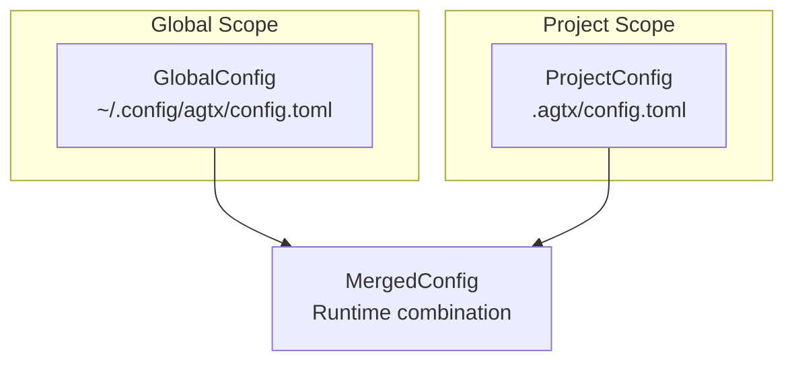
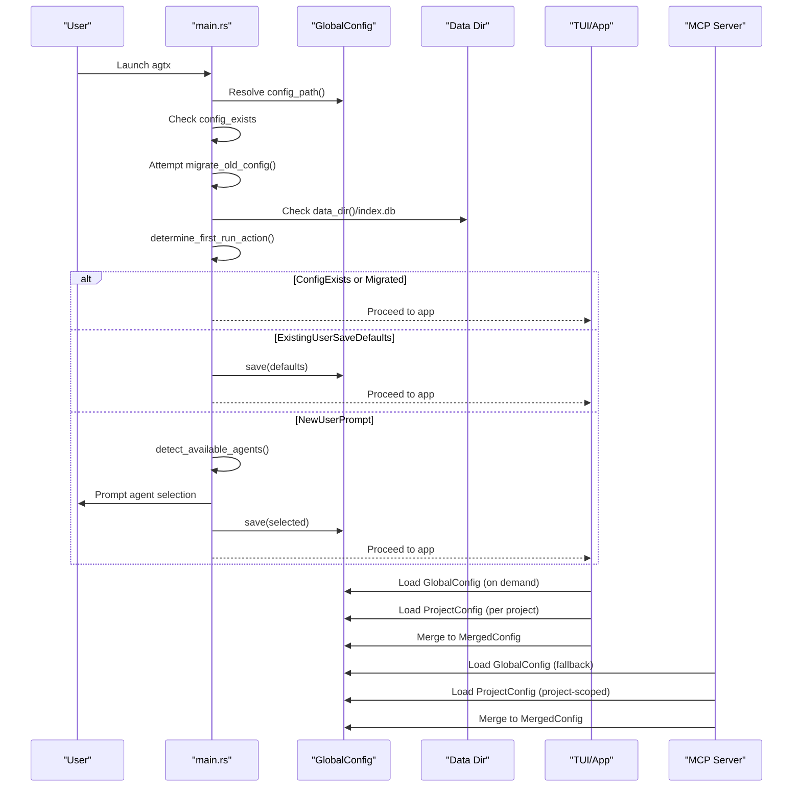
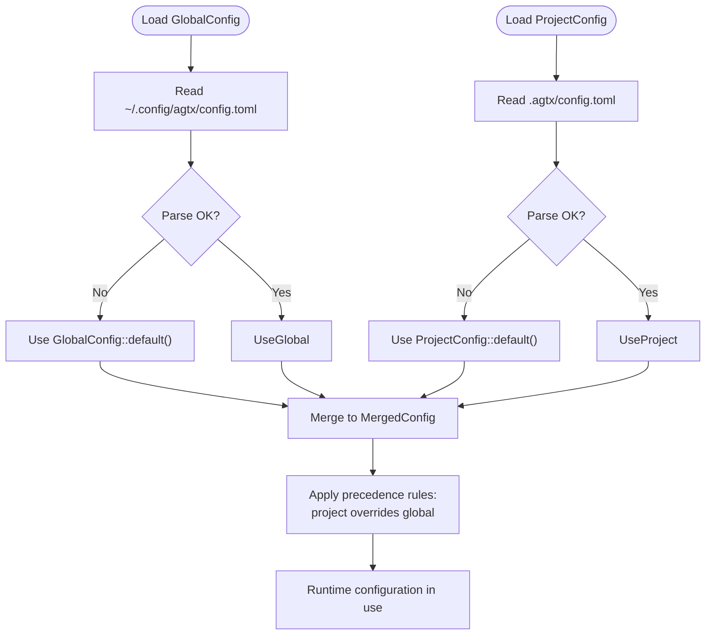
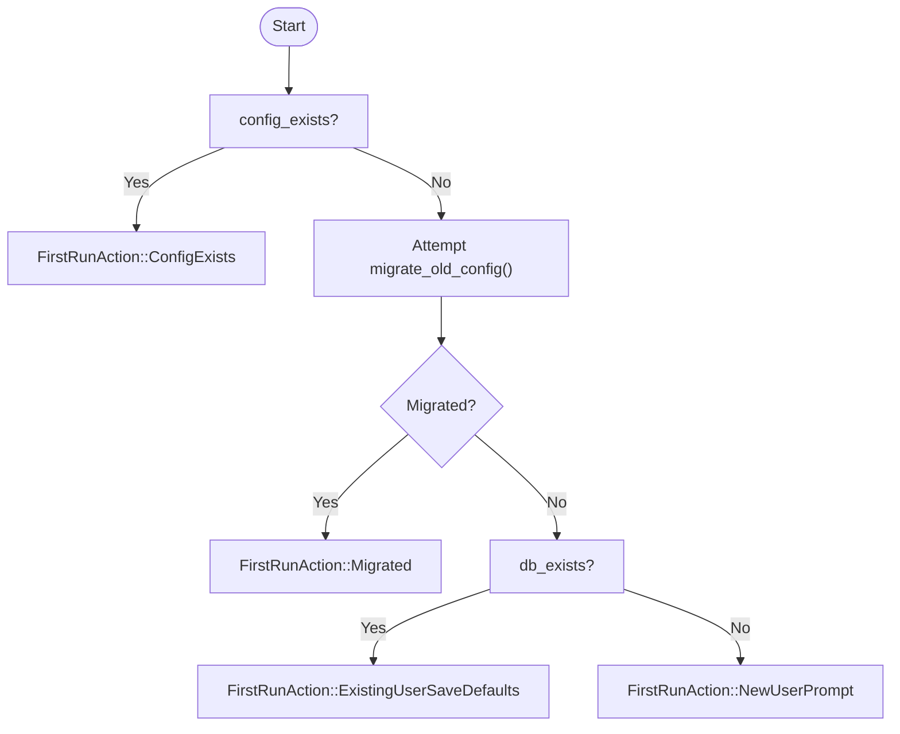
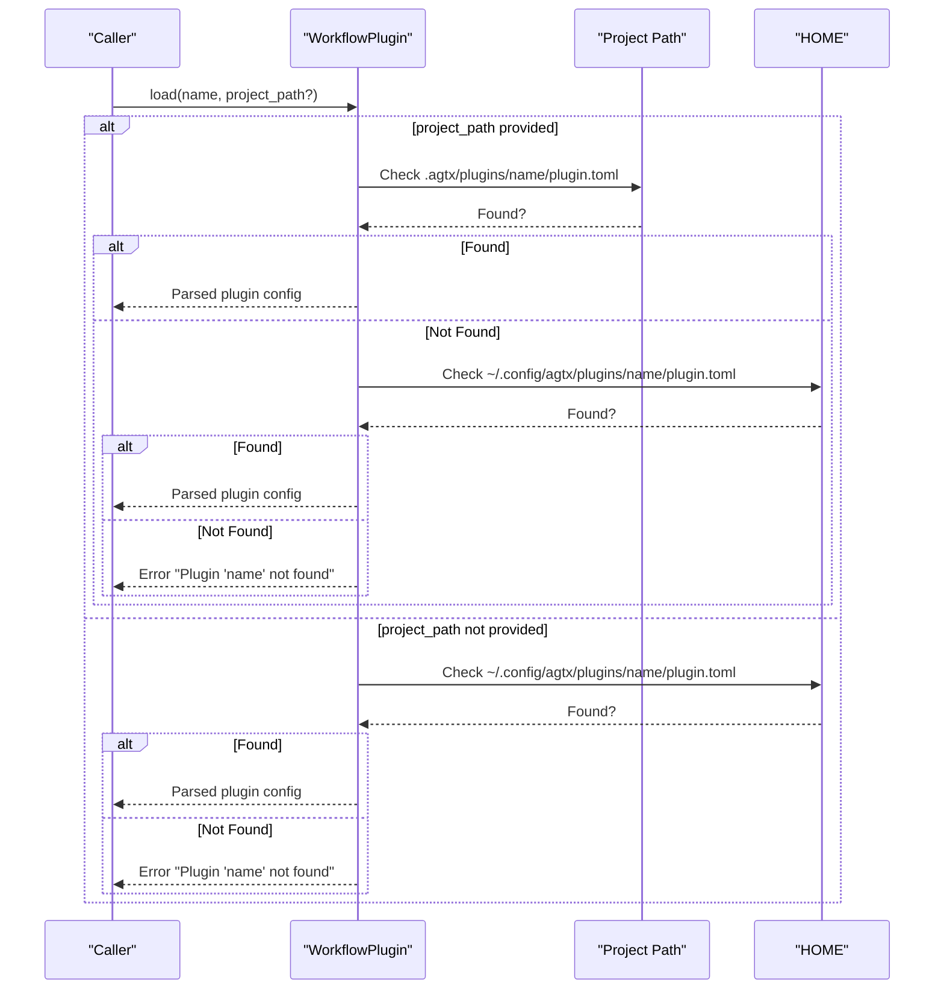
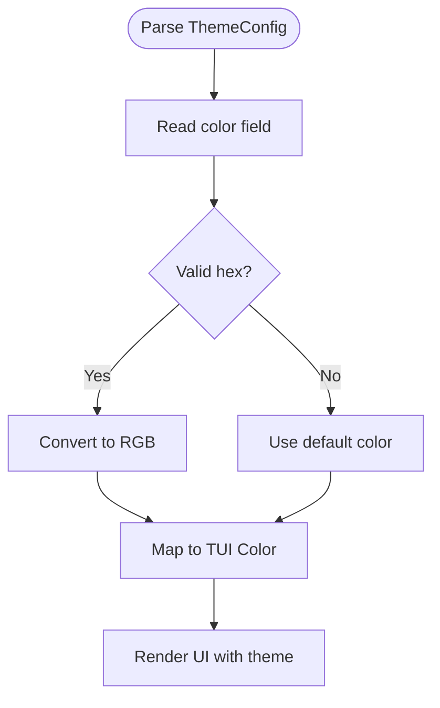
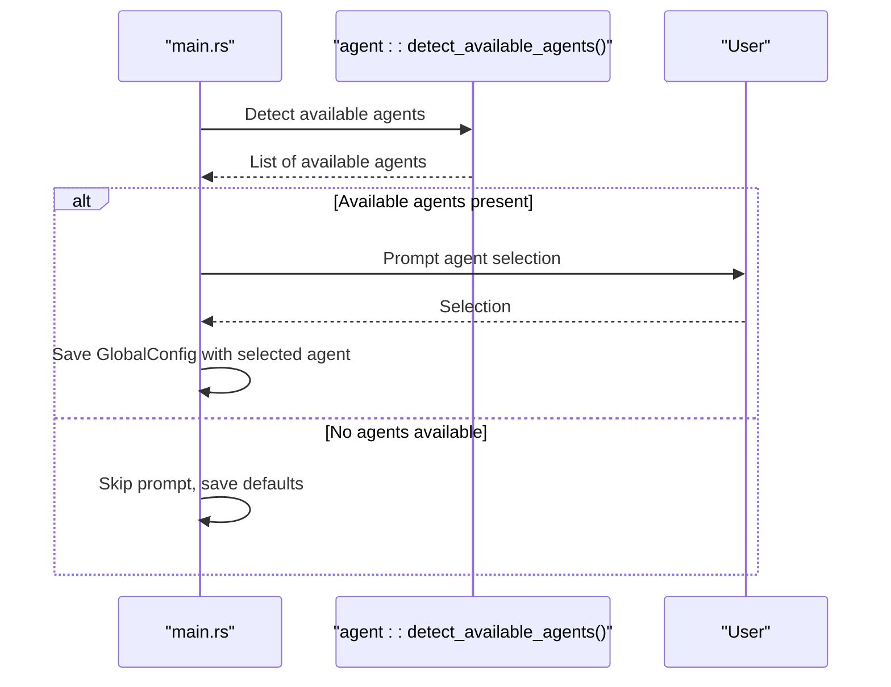
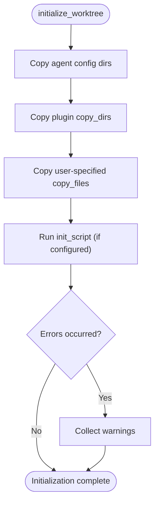
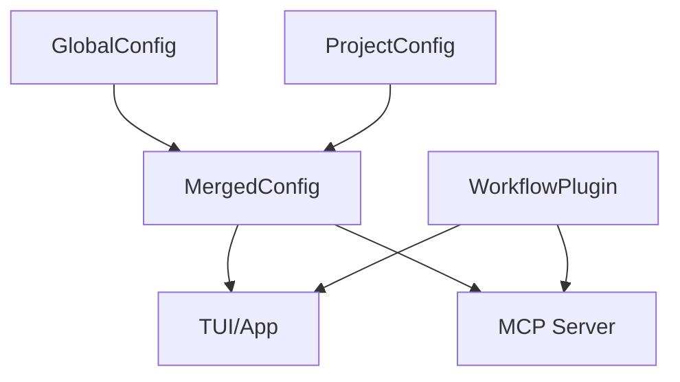
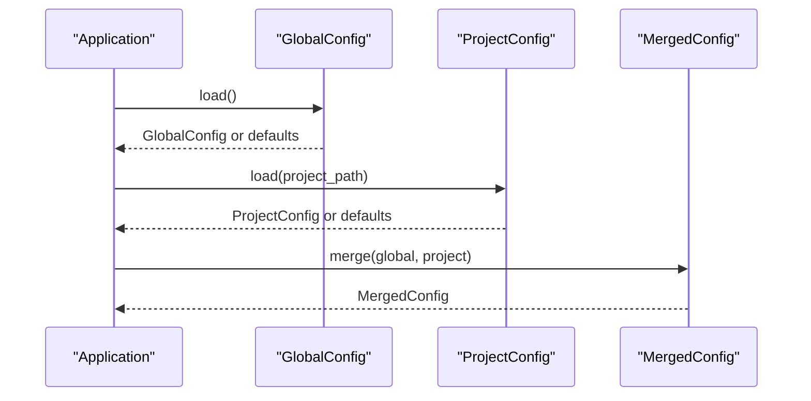

# Configuration Troubleshooting

<cite>
**Referenced Files in This Document**
- [src/config/mod.rs](file://src/config/mod.rs)
- [src/main.rs](file://src/main.rs)
- [src/agent/mod.rs](file://src/agent/mod.rs)
- [src/tui/app.rs](file://src/tui/app.rs)
- [src/mcp/server.rs](file://src/mcp/server.rs)
- [src/git/worktree.rs](file://src/git/worktree.rs)
- [tests/config_tests.rs](file://tests/config_tests.rs)
- [README.md](file://README.md)
</cite>

## Table of Contents
1. [Introduction](#introduction)
2. [Project Structure](#project-structure)
3. [Core Components](#core-components)
4. [Architecture Overview](#architecture-overview)
5. [Detailed Component Analysis](#detailed-component-analysis)
6. [Dependency Analysis](#dependency-analysis)
7. [Performance Considerations](#performance-considerations)
8. [Troubleshooting Guide](#troubleshooting-guide)
9. [Conclusion](#conclusion)
10. [Appendices](#appendices)

## Introduction
This document provides comprehensive troubleshooting guidance for agtx configuration management. It focuses on configuration loading order precedence, validation and parsing errors, file permission issues, path resolution problems, first-run action determination, configuration conflicts between global and project settings, migration issues, and handling of corrupted configuration files. It also covers diagnostics for configuration loading failures, agent detection issues, theme rendering problems, and plugin loading errors, along with recovery procedures and security considerations for sensitive configuration data.

## Project Structure
Agtx organizes configuration in two primary locations:
- Global configuration: stored under the user’s config directory as a TOML file.
- Project-specific configuration: stored under the project’s hidden directory as a TOML file.

The configuration system merges these sources, with project-level settings overriding global defaults where applicable.

**Diagram sources**
- [src/config/mod.rs:230-303](file://src/config/mod.rs#L230-L303)
- [src/config/mod.rs:355-388](file://src/config/mod.rs#L355-L388)

**Section sources**
- [src/config/mod.rs:230-303](file://src/config/mod.rs#L230-L303)
- [src/config/mod.rs:355-388](file://src/config/mod.rs#L355-L388)

## Core Components
- GlobalConfig: Defines global defaults for agents, per-phase agent overrides, worktree settings, theme, and fullscreen behavior. Includes load/save and path resolution utilities.
- ProjectConfig: Defines project-level overrides for agent defaults, per-phase agent overrides, base branch, GitHub URL, worktree directory, and scripts.
- MergedConfig: Produces runtime configuration by merging GlobalConfig and ProjectConfig, applying precedence rules.
- FirstRunAction: Encapsulates first-run logic based on presence of config and data files.
- WorkflowPlugin: Loads plugin configuration from project-local or global directories with a defined precedence.

Key behaviors:
- Project-level overrides take precedence over global defaults for applicable fields.
- Theme color parsing validates hex color strings and falls back to defaults when invalid.
- Plugin loading follows a strict precedence: project-local first, then global.

**Section sources**
- [src/config/mod.rs:6-388](file://src/config/mod.rs#L6-L388)
- [src/config/mod.rs:545-572](file://src/config/mod.rs#L545-L572)

## Architecture Overview
The configuration lifecycle spans initialization, first-run actions, and runtime usage across TUI, MCP server, and worktree initialization.

**Diagram sources**
- [src/main.rs:63-96](file://src/main.rs#L63-L96)
- [src/config/mod.rs:230-303](file://src/config/mod.rs#L230-L303)
- [src/mcp/server.rs:457-471](file://src/mcp/server.rs#L457-L471)

## Detailed Component Analysis

### Configuration Loading Order and Precedence
- Global configuration path: resolved from the user’s home directory.
- Project configuration path: resolved under the project’s hidden directory.
- Merge precedence:
  - default_agent: project-level value overrides global default.
  - agents: project-level per-phase overrides take precedence; otherwise global per-phase values.
  - base_branch: project-level value overrides global base_branch.
  - worktree_dir: project-level value overrides global worktree_dir.
  - theme: project-level values do not override global theme; theme remains global.
  - Other fields: project-level values override global defaults where applicable.

**Diagram sources**
- [src/config/mod.rs:230-303](file://src/config/mod.rs#L230-L303)
- [src/config/mod.rs:355-388](file://src/config/mod.rs#L355-L388)

**Section sources**
- [src/config/mod.rs:230-303](file://src/config/mod.rs#L230-L303)
- [src/config/mod.rs:355-388](file://src/config/mod.rs#L355-L388)
- [tests/config_tests.rs:85-156](file://tests/config_tests.rs#L85-L156)

### First-Run Action Determination Logic
The first-run action is determined purely by state flags:
- ConfigExists: If the new config path exists, no action is taken.
- Migrated: If migration from legacy location succeeds, action is taken.
- ExistingUserSaveDefaults: If no config exists but data directory exists, save defaults silently.
- NewUserPrompt: If no config and no data, prompt for agent selection and save.

**Diagram sources**
- [src/main.rs:63-96](file://src/main.rs#L63-L96)
- [src/config/mod.rs:305-335](file://src/config/mod.rs#L305-L335)

**Section sources**
- [src/main.rs:63-96](file://src/main.rs#L63-L96)
- [src/config/mod.rs:305-335](file://src/config/mod.rs#L305-L335)
- [tests/config_tests.rs:158-208](file://tests/config_tests.rs#L158-L208)

### Plugin Loading Precedence
Plugins are loaded from project-local directories first, then from global directories. If neither location contains a matching plugin, loading fails.

**Diagram sources**
- [src/config/mod.rs:545-572](file://src/config/mod.rs#L545-L572)

**Section sources**
- [src/config/mod.rs:545-572](file://src/config/mod.rs#L545-L572)

### Theme Rendering and Validation
- Hex color parsing validates format and converts to RGB; invalid values are rejected.
- Default theme colors are applied when parsing fails or values are missing.
- TUI consumes theme colors via a conversion helper that maps hex to TUI colors.

**Diagram sources**
- [src/config/mod.rs:133-145](file://src/config/mod.rs#L133-L145)
- [src/tui/app.rs:34-40](file://src/tui/app.rs#L34-L40)

**Section sources**
- [src/config/mod.rs:133-145](file://src/config/mod.rs#L133-L145)
- [src/tui/app.rs:34-40](file://src/tui/app.rs#L34-L40)
- [tests/config_tests.rs:6-46](file://tests/config_tests.rs#L6-L46)

### Agent Detection Issues
- Available agents are detected by checking command availability on PATH.
- If none are available, the first-run prompt is skipped and defaults are saved.
- Agent selection is only prompted when at least one agent is available.

**Diagram sources**
- [src/main.rs:80-88](file://src/main.rs#L80-L88)
- [src/agent/mod.rs:124-130](file://src/agent/mod.rs#L124-L130)

**Section sources**
- [src/main.rs:80-88](file://src/main.rs#L80-L88)
- [src/agent/mod.rs:124-130](file://src/agent/mod.rs#L124-L130)

### Worktree Initialization and Script Execution
- Worktrees are initialized by copying agent config directories and plugin-defined directories.
- User-specified files and scripts are handled during initialization; failures are collected as warnings rather than failing the operation.

**Diagram sources**
- [src/git/worktree.rs:129-158](file://src/git/worktree.rs#L129-L158)

**Section sources**
- [src/git/worktree.rs:129-158](file://src/git/worktree.rs#L129-L158)

## Dependency Analysis
- GlobalConfig and ProjectConfig are foundational and used by TUI and MCP server.
- MergedConfig encapsulates runtime decisions and is consumed by TUI and worktree initialization.
- WorkflowPlugin is used by TUI and MCP server for plugin selection and skill routing.

**Diagram sources**
- [src/config/mod.rs:355-388](file://src/config/mod.rs#L355-L388)
- [src/mcp/server.rs:457-471](file://src/mcp/server.rs#L457-L471)

**Section sources**
- [src/config/mod.rs:355-388](file://src/config/mod.rs#L355-L388)
- [src/mcp/server.rs:457-471](file://src/mcp/server.rs#L457-L471)

## Performance Considerations
- Configuration loading occurs on startup and on-demand; keep configuration files minimal and avoid excessive nested structures.
- Theme parsing is lightweight; avoid malformed hex values to prevent repeated fallbacks.
- Plugin loading is file-based; ensure plugin directories are organized to minimize IO overhead.

## Troubleshooting Guide

### Step 1: Verify Configuration File Locations
- Global config: ~/.config/agtx/config.toml
- Project config: .agtx/config.toml (in project root)
- Data directory: platform-specific application support directory

Diagnostic commands:
- Print global config path: echo "$(agtx --print-config-path)"
- List data directory: agtx --print-data-dir

Recovery:
- If the old config location exists, migration runs automatically during first-run. If migration fails, manually copy the file to the new location and remove the old file.

**Section sources**
- [src/config/mod.rs:260-273](file://src/config/mod.rs#L260-L273)
- [src/main.rs:98-119](file://src/main.rs#L98-L119)

### Step 2: Validate Configuration Syntax
Common validation errors:
- TOML parsing failures due to syntax errors.
- Invalid hex color values in theme configuration.
- Unexpected keys or types in configuration sections.

Diagnostics:
- Use a TOML validator to check syntax.
- Validate theme colors using the parser logic (must be six-digit hex).

Recovery:
- Fix syntax errors in TOML.
- Replace invalid hex values with valid six-digit hex codes.
- Remove unknown keys or adjust types to match expected schema.

**Section sources**
- [src/config/mod.rs:232-242](file://src/config/mod.rs#L232-L242)
- [src/config/mod.rs:278-288](file://src/config/mod.rs#L278-L288)
- [src/config/mod.rs:133-145](file://src/config/mod.rs#L133-L145)
- [tests/config_tests.rs:24-30](file://tests/config_tests.rs#L24-L30)

### Step 3: Resolve Permission Issues
Symptoms:
- Cannot read or write configuration files.
- Plugin loading fails due to inaccessible directories.

Diagnostics:
- Check ownership and permissions of ~/.config/agtx and project .agtx directories.
- Ensure the process has read/write access to the config and plugin directories.

Recovery:
- Adjust file permissions using chmod/chown.
- Run as the user who owns the configuration directories.

**Section sources**
- [src/config/mod.rs:244-256](file://src/config/mod.rs#L244-L256)
- [src/config/mod.rs:290-302](file://src/config/mod.rs#L290-L302)

### Step 4: Address Path Resolution Problems
Symptoms:
- Configuration not loaded from expected location.
- Plugin not found despite being installed.

Diagnostics:
- Confirm HOME environment variable is set correctly.
- Verify project path resolves to a git repository when using project-scoped modes.

Recovery:
- Set HOME appropriately for the environment.
- Use absolute paths when invoking project-scoped modes.

**Section sources**
- [src/config/mod.rs:260-266](file://src/config/mod.rs#L260-L266)
- [src/config/mod.rs:559-567](file://src/config/mod.rs#L559-L567)
- [src/main.rs:30-59](file://src/main.rs#L30-L59)

### Step 5: Investigate First-Run Action Misclassification
Symptoms:
- Unexpected prompt or silent defaults.

Diagnostics:
- Check whether config_exists, migrated, and db_exists flags are accurate.
- Verify the presence of ~/.config/agtx/config.toml and the data directory’s index.db.

Recovery:
- If config_exists is true but should not be, remove the config file and rerun.
- If migrated is true but should not be, prevent migration or handle manually.
- If db_exists is true but should not be, remove the data directory or adjust expectations.

**Section sources**
- [src/main.rs:63-96](file://src/main.rs#L63-L96)
- [src/config/mod.rs:305-335](file://src/config/mod.rs#L305-L335)

### Step 6: Resolve Configuration Conflicts Between Global and Project Settings
Symptoms:
- Project-level settings not taking effect.
- Unexpected agent assignments or worktree behavior.

Diagnostics:
- Compare global and project configurations for overlapping keys.
- Confirm merge precedence: project overrides global for applicable fields.

Recovery:
- Remove conflicting keys from project config if relying on global defaults.
- Explicitly set project-level values to override global behavior.

**Section sources**
- [src/config/mod.rs:355-388](file://src/config/mod.rs#L355-L388)
- [tests/config_tests.rs:103-156](file://tests/config_tests.rs#L103-L156)

### Step 7: Handle Migration Issues from Older Versions
Symptoms:
- Legacy config not recognized.
- Migration fails or leaves stale files.

Diagnostics:
- Check for the old config path and compare with the new path.
- Inspect migration logic for copy/remove operations.

Recovery:
- Manually copy the old config to the new location and remove the old file.
- Ensure proper permissions are set on the new file.

**Section sources**
- [src/main.rs:98-119](file://src/main.rs#L98-L119)

### Step 8: Repair Corrupted Configuration Files
Symptoms:
- Parsing errors or unexpected defaults.
- UI rendering anomalies due to invalid theme values.

Diagnostics:
- Attempt to parse the file with a TOML parser.
- Validate theme hex values.

Recovery:
- Rebuild the file from a known-good template.
- Restore from backup if available.

**Section sources**
- [src/config/mod.rs:232-242](file://src/config/mod.rs#L232-L242)
- [src/config/mod.rs:278-288](file://src/config/mod.rs#L278-L288)
- [tests/config_tests.rs:24-30](file://tests/config_tests.rs#L24-L30)

### Step 9: Diagnose Agent Detection Issues
Symptoms:
- No agent prompt appears.
- Agents not recognized even when installed.

Diagnostics:
- Check PATH for agent commands.
- Verify agent availability using detection logic.

Recovery:
- Install missing agents or update PATH.
- Ensure agent commands are executable.

**Section sources**
- [src/agent/mod.rs:124-130](file://src/agent/mod.rs#L124-L130)
- [src/main.rs:80-88](file://src/main.rs#L80-L88)

### Step 10: Troubleshoot Theme Rendering Problems
Symptoms:
- Incorrect colors or default fallbacks.
- UI looks inconsistent.

Diagnostics:
- Validate hex color values in theme configuration.
- Confirm TUI conversion from hex to RGB.

Recovery:
- Correct invalid hex values to six-digit format.
- Use valid color values aligned with the intended palette.

**Section sources**
- [src/config/mod.rs:133-145](file://src/config/mod.rs#L133-L145)
- [src/tui/app.rs:34-40](file://src/tui/app.rs#L34-L40)
- [tests/config_tests.rs:6-46](file://tests/config_tests.rs#L6-L46)

### Step 11: Debug Plugin Loading Errors
Symptoms:
- Plugin not found or not applied.
- Skills not available in worktrees.

Diagnostics:
- Verify plugin.toml exists in project-local or global plugin directory.
- Confirm plugin name matches configuration.

Recovery:
- Place plugin.toml in the correct directory.
- Use the correct plugin name in configuration.

**Section sources**
- [src/config/mod.rs:545-572](file://src/config/mod.rs#L545-L572)
- [tests/config_tests.rs:9559-9580](file://tests/config_tests.rs#L9559-L9580)

### Step 12: Worktree Initialization Failures
Symptoms:
- Worktree creation fails or scripts do not run.
- Files not copied as expected.

Diagnostics:
- Check copy_files and copy_dirs configuration.
- Verify script paths and permissions.

Recovery:
- Fix copy_files list to valid relative paths.
- Ensure scripts are executable and located at the specified paths.

**Section sources**
- [src/git/worktree.rs:129-158](file://src/git/worktree.rs#L129-L158)

### Step 13: Security Considerations for Sensitive Configuration Data
- Store configuration files with restrictive permissions.
- Avoid committing .agtx directories to version control.
- Use environment-specific configuration overlays when necessary.

Best practices:
- Add .agtx to .gitignore in projects.
- Limit access to ~/.config/agtx to the owning user.
- Audit plugin directories for unintended exposure.

**Section sources**
- [README.md:92](file://README.md#L92)

### Step 14: Backup and Restoration Procedures
Backup:
- Archive ~/.config/agtx/config.toml and project .agtx/config.toml.
- Preserve plugin directories if customized.

Restore:
- Copy backed-up files to their respective locations.
- Re-run the application to apply restored configuration.

**Section sources**
- [src/config/mod.rs:244-256](file://src/config/mod.rs#L244-L256)
- [src/config/mod.rs:290-302](file://src/config/mod.rs#L290-L302)

## Conclusion
This guide outlined the configuration lifecycle, precedence rules, and robust troubleshooting procedures for agtx. By validating syntax, ensuring proper permissions, resolving path issues, and understanding first-run actions and plugin loading precedence, most configuration-related issues can be diagnosed and resolved efficiently. Adhering to security best practices and maintaining backups further safeguards configuration integrity.

## Appendices

### Appendix A: Configuration Loading Sequence

**Diagram sources**
- [src/config/mod.rs:230-303](file://src/config/mod.rs#L230-L303)
- [src/config/mod.rs:355-388](file://src/config/mod.rs#L355-L388)