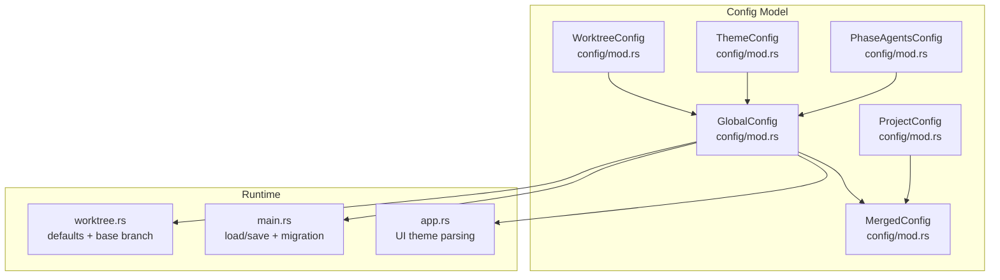
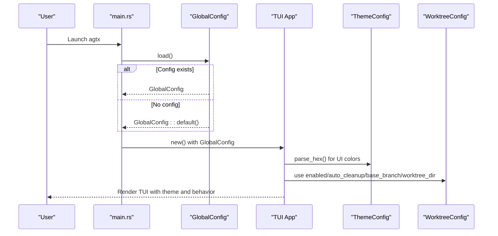
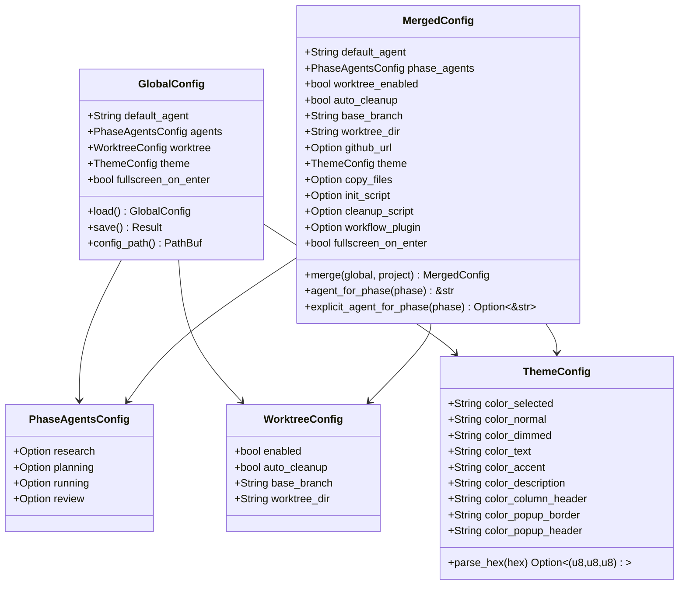
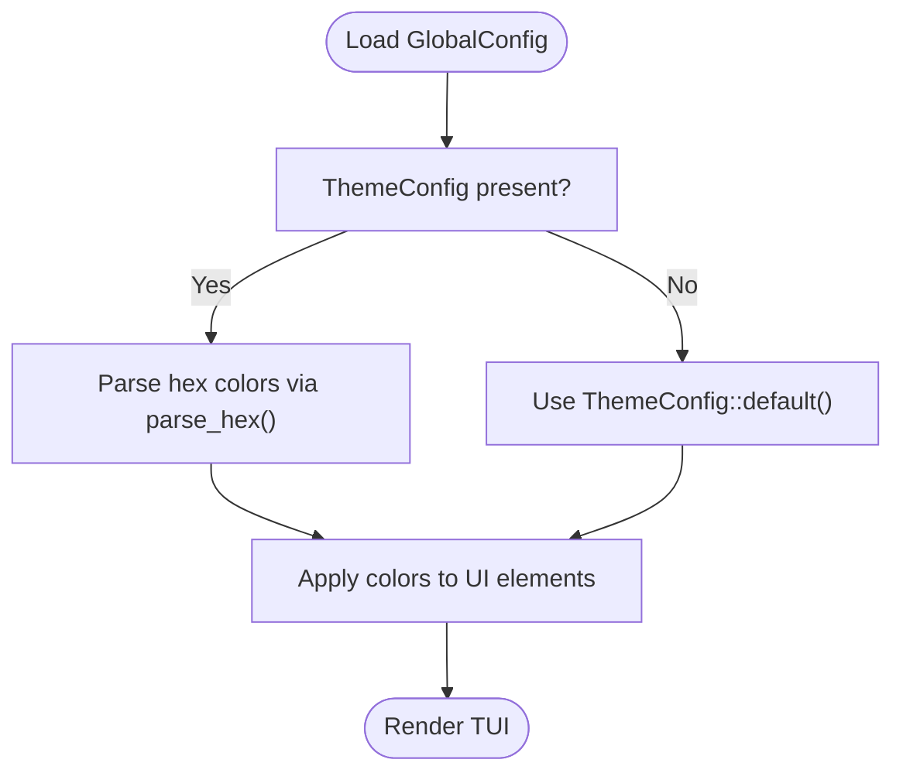
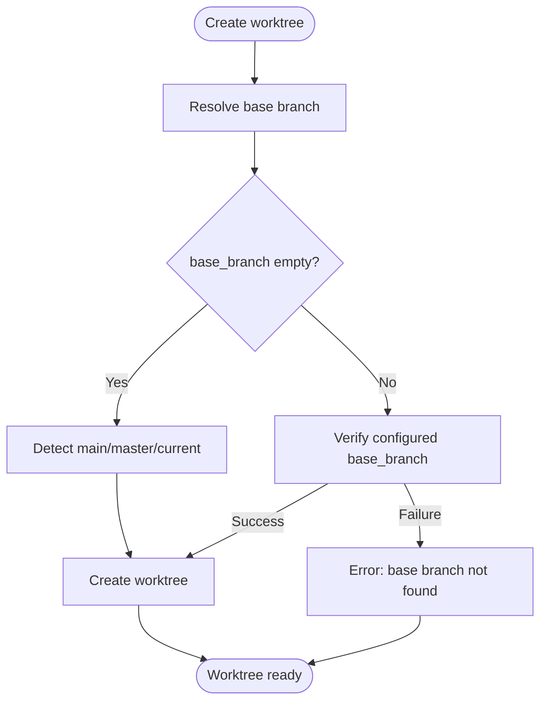
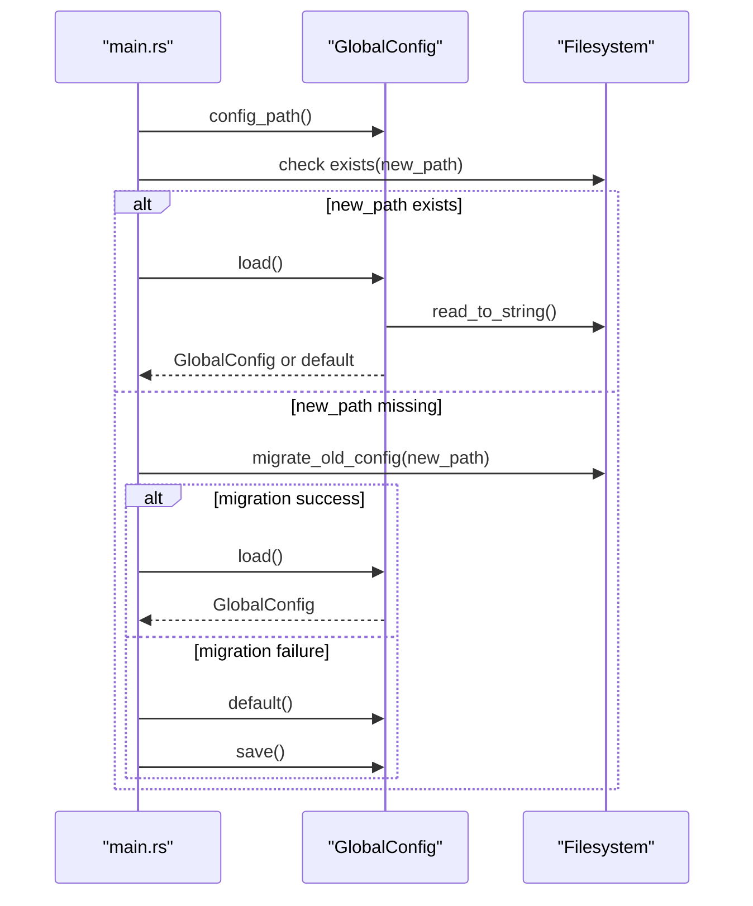
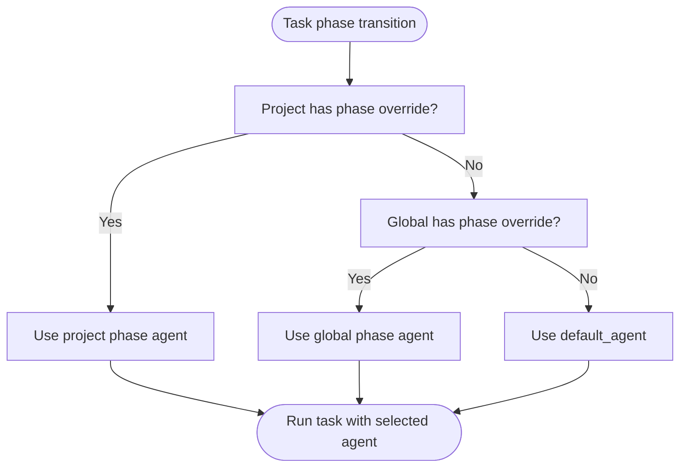
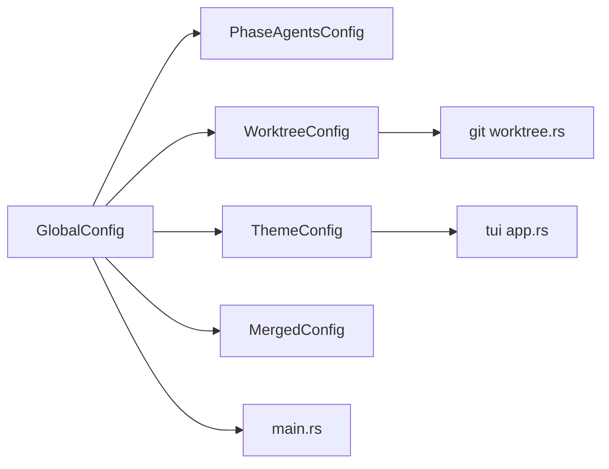

# Global Configuration

<cite>
**Referenced Files in This Document**
- [src/config/mod.rs](file://src/config/mod.rs)
- [src/main.rs](file://src/main.rs)
- [src/tui/app.rs](file://src/tui/app.rs)
- [src/git/worktree.rs](file://src/git/worktree.rs)
- [tests/config_tests.rs](file://tests/config_tests.rs)
- [README.md](file://README.md)
</cite>

## Table of Contents
1. [Introduction](#introduction)
2. [Project Structure](#project-structure)
3. [Core Components](#core-components)
4. [Architecture Overview](#architecture-overview)
5. [Detailed Component Analysis](#detailed-component-analysis)
6. [Dependency Analysis](#dependency-analysis)
7. [Performance Considerations](#performance-considerations)
8. [Troubleshooting Guide](#troubleshooting-guide)
9. [Conclusion](#conclusion)
10. [Appendices](#appendices)

## Introduction
This document explains the agtx global configuration system that stores user-level settings in ~/.config/agtx/config.toml. It covers the GlobalConfig structure, default_agent selection, per-phase agent overrides, worktree configuration, theme customization, and tmux fullscreen behavior. It also documents configuration loading, default value resolution, migration procedures, validation, and practical examples for typical use cases.

## Project Structure
The global configuration is defined and consumed across several modules:
- Configuration model and serialization in src/config/mod.rs
- First-run migration and saving/loading in src/main.rs
- UI theme parsing and usage in src/tui/app.rs
- Worktree defaults and base branch resolution in src/git/worktree.rs
- Tests validating behavior in tests/config_tests.rs
- Documentation and examples in README.md

**Diagram sources**
- [src/config/mod.rs:1-595](file://src/config/mod.rs#L1-L595)
- [src/main.rs:1-228](file://src/main.rs#L1-L228)
- [src/tui/app.rs:1-9052](file://src/tui/app.rs#L1-L9052)
- [src/git/worktree.rs:1-345](file://src/git/worktree.rs#L1-L345)

**Section sources**
- [src/config/mod.rs:1-595](file://src/config/mod.rs#L1-L595)
- [src/main.rs:1-228](file://src/main.rs#L1-L228)
- [src/tui/app.rs:1-9052](file://src/tui/app.rs#L1-L9052)
- [src/git/worktree.rs:1-345](file://src/git/worktree.rs#L1-L345)

## Core Components
- GlobalConfig: Root configuration object with default_agent, per-phase agent overrides, worktree settings, theme, and fullscreen_on_enter.
- PhaseAgentsConfig: Optional per-phase agent overrides for research, planning, running, and review.
- WorktreeConfig: Controls worktree creation, cleanup, base branch, and worktree_dir.
- ThemeConfig: Hex color customization for UI elements.
- MergedConfig: Merges global and project configs with precedence rules.

Key defaults and behaviors:
- default_agent defaults to a specific agent name.
- WorktreeConfig defaults enabled=true, auto_cleanup=true, empty base_branch (auto-detect).
- ThemeConfig defaults are valid hex colors.
- fullscreen_on_enter defaults to false.

**Section sources**
- [src/config/mod.rs:6-27](file://src/config/mod.rs#L6-L27)
- [src/config/mod.rs:151-158](file://src/config/mod.rs#L151-L158)
- [src/config/mod.rs:160-178](file://src/config/mod.rs#L160-L178)
- [src/config/mod.rs:41-79](file://src/config/mod.rs#L41-L79)
- [src/config/mod.rs:29-39](file://src/config/mod.rs#L29-L39)
- [src/config/mod.rs:180-189](file://src/config/mod.rs#L180-L189)
- [src/config/mod.rs:81-95](file://src/config/mod.rs#L81-L95)
- [src/config/mod.rs:195-197](file://src/config/mod.rs#L195-L197)
- [src/config/mod.rs:355-408](file://src/config/mod.rs#L355-L408)

## Architecture Overview
The global configuration is loaded at startup, merged with project configuration, and used throughout the application for UI theming, agent selection, and worktree behavior.

**Diagram sources**
- [src/main.rs:63-96](file://src/main.rs#L63-L96)
- [src/config/mod.rs:230-242](file://src/config/mod.rs#L230-L242)
- [src/tui/app.rs:34-39](file://src/tui/app.rs#L34-L39)
- [src/config/mod.rs:160-178](file://src/config/mod.rs#L160-L178)

## Detailed Component Analysis

### GlobalConfig and MergedConfig
- GlobalConfig aggregates default_agent, PhaseAgentsConfig, WorktreeConfig, ThemeConfig, and fullscreen_on_enter.
- MergedConfig merges global and project configs with project overrides taking precedence for applicable fields.

**Diagram sources**
- [src/config/mod.rs:6-27](file://src/config/mod.rs#L6-L27)
- [src/config/mod.rs:151-158](file://src/config/mod.rs#L151-L158)
- [src/config/mod.rs:160-178](file://src/config/mod.rs#L160-L178)
- [src/config/mod.rs:41-79](file://src/config/mod.rs#L41-L79)
- [src/config/mod.rs:337-408](file://src/config/mod.rs#L337-L408)

**Section sources**
- [src/config/mod.rs:6-27](file://src/config/mod.rs#L6-L27)
- [src/config/mod.rs:151-158](file://src/config/mod.rs#L151-L158)
- [src/config/mod.rs:160-178](file://src/config/mod.rs#L160-L178)
- [src/config/mod.rs:41-79](file://src/config/mod.rs#L41-L79)
- [src/config/mod.rs:29-39](file://src/config/mod.rs#L29-L39)
- [src/config/mod.rs:180-189](file://src/config/mod.rs#L180-L189)
- [src/config/mod.rs:81-95](file://src/config/mod.rs#L81-L95)
- [src/config/mod.rs:195-197](file://src/config/mod.rs#L195-L197)
- [src/config/mod.rs:355-408](file://src/config/mod.rs#L355-L408)

### Theme Configuration and UI Rendering
- ThemeConfig defines hex color fields for UI elements.
- parse_hex converts hex strings to RGB tuples for rendering.
- The TUI uses ThemeConfig::parse_hex to convert hex to ratatui Color.

**Diagram sources**
- [src/config/mod.rs:41-79](file://src/config/mod.rs#L41-L79)
- [src/config/mod.rs:133-144](file://src/config/mod.rs#L133-L144)
- [src/tui/app.rs:34-39](file://src/tui/app.rs#L34-L39)

**Section sources**
- [src/config/mod.rs:41-79](file://src/config/mod.rs#L41-L79)
- [src/config/mod.rs:133-144](file://src/config/mod.rs#L133-L144)
- [src/tui/app.rs:34-39](file://src/tui/app.rs#L34-L39)
- [tests/config_tests.rs:8-31](file://tests/config_tests.rs#L8-L31)

### Worktree Configuration and Base Branch Resolution
- WorktreeConfig controls worktree creation, cleanup, base branch, and directory.
- DEFAULT_WORKTREE_DIR is used when worktree_dir is not specified.
- Base branch resolution prefers configured base_branch, otherwise detects main/master or current branch.

**Diagram sources**
- [src/git/worktree.rs:67-84](file://src/git/worktree.rs#L67-L84)
- [src/git/worktree.rs:242-273](file://src/git/worktree.rs#L242-L273)
- [src/config/mod.rs:191-193](file://src/config/mod.rs#L191-L193)

**Section sources**
- [src/git/worktree.rs:67-84](file://src/git/worktree.rs#L67-L84)
- [src/git/worktree.rs:242-273](file://src/git/worktree.rs#L242-L273)
- [src/config/mod.rs:191-193](file://src/config/mod.rs#L191-L193)
- [src/config/mod.rs:180-189](file://src/config/mod.rs#L180-L189)

### First-run Migration and Configuration Loading
- On startup, main.rs determines whether to migrate old config, prompt for agent selection, or save defaults.
- GlobalConfig::load reads ~/.config/agtx/config.toml; if missing, it uses defaults.
- GlobalConfig::save writes the pretty-printed TOML to disk.

**Diagram sources**
- [src/main.rs:63-96](file://src/main.rs#L63-L96)
- [src/main.rs:98-119](file://src/main.rs#L98-L119)
- [src/config/mod.rs:230-256](file://src/config/mod.rs#L230-L256)

**Section sources**
- [src/main.rs:63-96](file://src/main.rs#L63-L96)
- [src/main.rs:98-119](file://src/main.rs#L98-L119)
- [src/config/mod.rs:230-256](file://src/config/mod.rs#L230-L256)

### Agent Selection and Per-Phase Overrides
- default_agent selects the default agent for new tasks.
- PhaseAgentsConfig allows overriding agents per phase (research, planning, running, review).
- MergedConfig resolves agent_for_phase with project overrides taking precedence.

**Diagram sources**
- [src/config/mod.rs:355-408](file://src/config/mod.rs#L355-L408)
- [tests/config_tests.rs:212-296](file://tests/config_tests.rs#L212-L296)

**Section sources**
- [src/config/mod.rs:355-408](file://src/config/mod.rs#L355-L408)
- [tests/config_tests.rs:212-296](file://tests/config_tests.rs#L212-L296)

### Practical Configuration Examples
- Team-wide agent preferences: Set default_agent and [agents] in ~/.config/agtx/config.toml.
- Theme customization for different terminals: Adjust ThemeConfig hex colors to match terminal palette.
- Worktree management: Configure worktree.enabled, auto_cleanup, base_branch, and worktree_dir.

Examples are documented in README.md with TOML snippets for worktree, project, and per-phase agent configuration.

**Section sources**
- [README.md:261-328](file://README.md#L261-L328)
- [README.md:283-303](file://README.md#L283-L303)
- [README.md:308-328](file://README.md#L308-L328)

## Dependency Analysis
- GlobalConfig depends on serde for serialization and directories for data_dir.
- ThemeConfig.parse_hex is used by TUI rendering.
- WorktreeConfig interacts with git worktree creation and base branch detection.
- MergedConfig composes GlobalConfig and ProjectConfig with precedence rules.

**Diagram sources**
- [src/config/mod.rs:6-27](file://src/config/mod.rs#L6-L27)
- [src/config/mod.rs:151-158](file://src/config/mod.rs#L151-L158)
- [src/config/mod.rs:160-178](file://src/config/mod.rs#L160-L178)
- [src/config/mod.rs:41-79](file://src/config/mod.rs#L41-L79)
- [src/config/mod.rs:337-408](file://src/config/mod.rs#L337-L408)
- [src/git/worktree.rs:1-345](file://src/git/worktree.rs#L1-L345)
- [src/tui/app.rs:1-9052](file://src/tui/app.rs#L1-L9052)
- [src/main.rs:1-228](file://src/main.rs#L1-L228)

**Section sources**
- [src/config/mod.rs:6-27](file://src/config/mod.rs#L6-L27)
- [src/config/mod.rs:151-158](file://src/config/mod.rs#L151-L158)
- [src/config/mod.rs:160-178](file://src/config/mod.rs#L160-L178)
- [src/config/mod.rs:41-79](file://src/config/mod.rs#L41-L79)
- [src/config/mod.rs:337-408](file://src/config/mod.rs#L337-L408)
- [src/git/worktree.rs:1-345](file://src/git/worktree.rs#L1-L345)
- [src/tui/app.rs:1-9052](file://src/tui/app.rs#L1-L9052)
- [src/main.rs:1-228](file://src/main.rs#L1-L228)

## Performance Considerations
- Configuration loading is infrequent and occurs at startup; overhead is negligible.
- Theme parsing is used during rendering; hex parsing is fast and cached via ratatui Color conversion.
- Worktree operations depend on git; ensure base_branch is configured to avoid unnecessary branch detection.

[No sources needed since this section provides general guidance]

## Troubleshooting Guide
Common issues and resolutions:
- Invalid hex color in ThemeConfig: Ensure all hex values are six-digit strings (with or without leading #). parse_hex validates length and characters.
- Base branch not found: If base_branch is set but does not exist, worktree creation fails. Either correct the base_branch or leave it empty to auto-detect.
- Missing config file: On first run, the app migrates old config if present, otherwise saves defaults or prompts for agent selection.
- Fullscreen behavior: fullscreen_on_enter toggles whether the task popup automatically enters fullscreen mode; adjust in GlobalConfig.

Validation and tests:
- ThemeConfig::parse_hex returns None for invalid inputs and Some for valid hex.
- MergedConfig respects project overrides for agent selection and worktree_dir.
- FirstRunAction logic prioritizes existing config, then migration, then defaults or prompts.

**Section sources**
- [src/config/mod.rs:133-144](file://src/config/mod.rs#L133-L144)
- [src/git/worktree.rs:67-84](file://src/git/worktree.rs#L67-L84)
- [src/main.rs:63-96](file://src/main.rs#L63-L96)
- [tests/config_tests.rs:8-31](file://tests/config_tests.rs#L8-L31)
- [tests/config_tests.rs:103-156](file://tests/config_tests.rs#L103-L156)
- [tests/config_tests.rs:158-208](file://tests/config_tests.rs#L158-L208)

## Conclusion
The agtx global configuration system provides a robust, extensible foundation for user-level settings. It supports per-phase agent overrides, worktree management, theme customization, and tmux fullscreen behavior. The design emphasizes defaults, precedence rules, and clear migration paths, enabling teams to standardize workflows while accommodating individual preferences.

[No sources needed since this section summarizes without analyzing specific files]

## Appendices

### Configuration Fields Reference
- default_agent: String; default agent for new tasks.
- agents: PhaseAgentsConfig; per-phase agent overrides.
- worktree.enabled: bool; enable/disable worktree usage.
- worktree.auto_cleanup: bool; auto-remove worktrees after completion.
- worktree.base_branch: String; base branch for worktrees (empty = auto-detect).
- worktree.worktree_dir: String; directory relative to project root for worktrees.
- theme: ThemeConfig; hex colors for UI elements.
- fullscreen_on_enter: bool; tmux fullscreen behavior for task popups.

**Section sources**
- [src/config/mod.rs:6-27](file://src/config/mod.rs#L6-L27)
- [src/config/mod.rs:151-158](file://src/config/mod.rs#L151-L158)
- [src/config/mod.rs:160-178](file://src/config/mod.rs#L160-L178)
- [src/config/mod.rs:41-79](file://src/config/mod.rs#L41-L79)
- [src/config/mod.rs:29-39](file://src/config/mod.rs#L29-L39)
- [src/config/mod.rs:180-189](file://src/config/mod.rs#L180-L189)
- [src/config/mod.rs:81-95](file://src/config/mod.rs#L81-L95)
- [src/config/mod.rs:195-197](file://src/config/mod.rs#L195-L197)