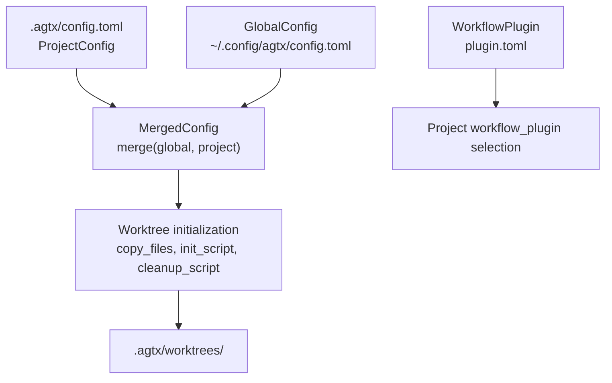
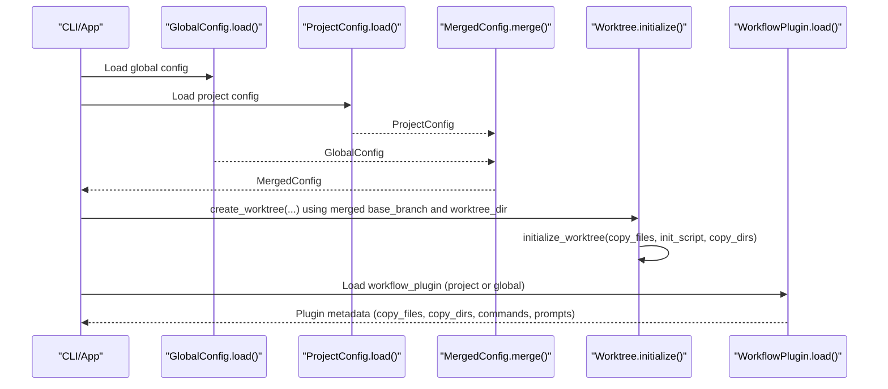
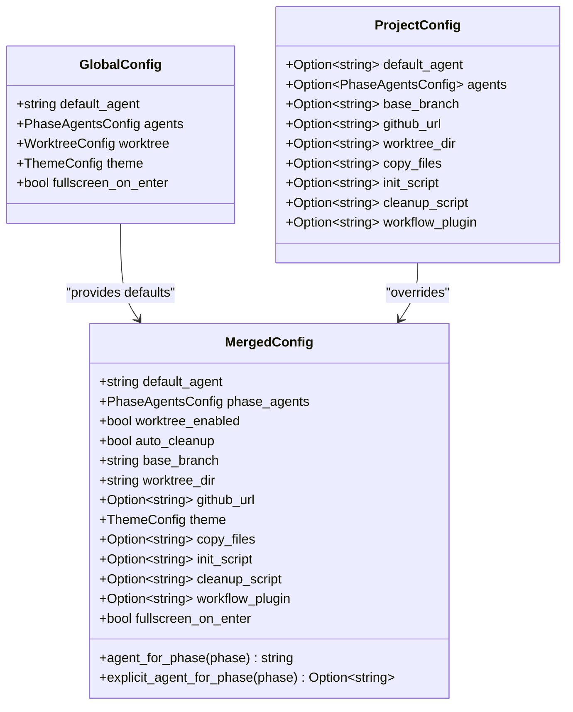
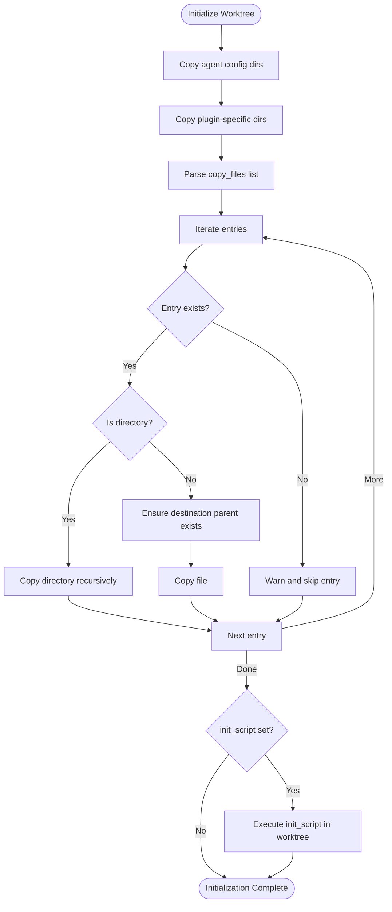
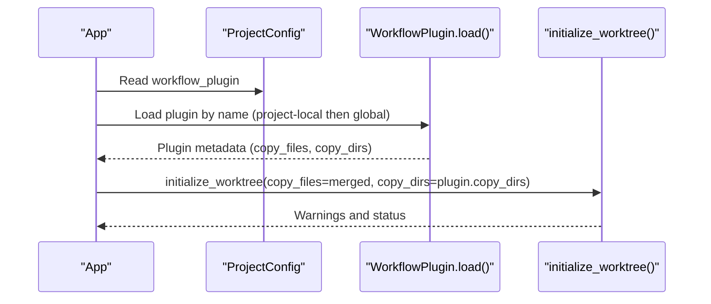
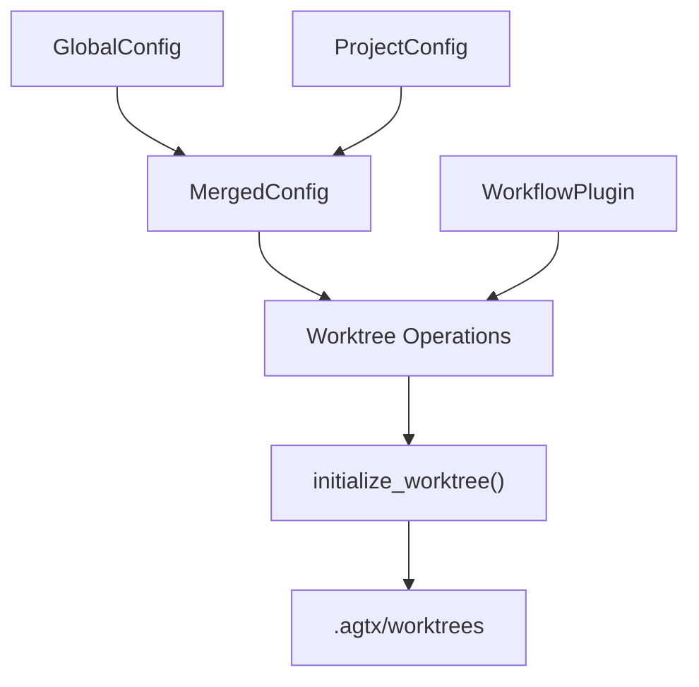

# Project Configuration

<cite>
**Referenced Files in This Document**
- [config/mod.rs](file://src/config/mod.rs)
- [git/worktree.rs](file://src/git/worktree.rs)
- [git/operations.rs](file://src/git/operations.rs)
- [plugins/gsd/plugin.toml](file://plugins/gsd/plugin.toml)
- [plugins/spec-kit/plugin.toml](file://plugins/spec-kit/plugin.toml)
- [plugins/openspec/plugin.toml](file://plugins/openspec/plugin.toml)
- [mcp/server.rs](file://src/mcp/server.rs)
- [tui/app.rs](file://src/tui/app.rs)
- [tests/config_tests.rs](file://tests/config_tests.rs)
- [tests/git_tests.rs](file://tests/git_tests.rs)
</cite>

## Table of Contents
1. [Introduction](#introduction)
2. [Project Structure](#project-structure)
3. [Core Components](#core-components)
4. [Architecture Overview](#architecture-overview)
5. [Detailed Component Analysis](#detailed-component-analysis)
6. [Dependency Analysis](#dependency-analysis)
7. [Performance Considerations](#performance-considerations)
8. [Troubleshooting Guide](#troubleshooting-guide)
9. [Conclusion](#conclusion)

## Introduction
This document explains how to configure agtx on a per-project basis using .agtx/config.toml. It covers the ProjectConfig structure, default_agent overrides, per-phase agent assignments, base_branch customization, GitHub URL integration, worktree_dir specification, and file synchronization via copy_files. It also documents advanced settings such as init_script and cleanup_script execution hooks, workflow_plugin selection, and how project settings merge with global defaults. Practical examples demonstrate team-specific agent assignments, custom workflow plugins, automated initialization scripts, and project-specific worktree management. Finally, it details configuration precedence, inheritance behavior, and troubleshooting steps for conflicts between project and global settings.

## Project Structure
Project configuration is stored under the .agtx directory at the root of each repository. The primary file is .agtx/config.toml, which defines project-scoped preferences that override global defaults when present.

**Diagram sources**
- [config/mod.rs:276-303](file://src/config/mod.rs#L276-L303)
- [config/mod.rs:355-388](file://src/config/mod.rs#L355-L388)
- [git/worktree.rs:129-223](file://src/git/worktree.rs#L129-L223)

**Section sources**
- [config/mod.rs:276-303](file://src/config/mod.rs#L276-L303)

## Core Components
- ProjectConfig: Defines project-level overrides and options for agent selection, worktrees, GitHub integration, and workflow plugin selection.
- MergedConfig: Produces effective runtime configuration by combining GlobalConfig and ProjectConfig with well-defined precedence rules.
- Worktree initialization pipeline: Copies agent config directories, plugin-specific directories, and user-specified files; runs init_script; and supports cleanup_script.

Key fields in ProjectConfig:
- default_agent: Overrides the global default agent for this project.
- agents: Per-phase agent overrides (research, planning, running, review).
- base_branch: Overrides the base branch used to create worktrees.
- github_url: Optional GitHub repository URL for this project.
- worktree_dir: Directory (relative to project root) where worktrees are created.
- copy_files: Comma-separated list of files/directories to copy into worktrees.
- init_script: Shell command to run inside the worktree after creation and file copying.
- cleanup_script: Shell command to run inside the worktree before removal.
- workflow_plugin: Name of the workflow plugin to use for this project.

Precedence rules (highest to lowest):
- Project-level values take precedence for fields that support overrides.
- Global defaults apply when project values are absent.
- Per-phase agent overrides are resolved first from project, then from global.
- Fields not overridden remain at global defaults.

**Section sources**
- [config/mod.rs:200-228](file://src/config/mod.rs#L200-L228)
- [config/mod.rs:355-388](file://src/config/mod.rs#L355-L388)
- [config/mod.rs:151-158](file://src/config/mod.rs#L151-L158)

## Architecture Overview
The configuration system merges global and project settings at runtime to determine effective behavior. The following sequence illustrates how configuration influences worktree creation and plugin selection.

**Diagram sources**
- [config/mod.rs:230-274](file://src/config/mod.rs#L230-L274)
- [config/mod.rs:276-303](file://src/config/mod.rs#L276-L303)
- [config/mod.rs:355-388](file://src/config/mod.rs#L355-L388)
- [git/worktree.rs:129-223](file://src/git/worktree.rs#L129-L223)
- [config/mod.rs:545-594](file://src/config/mod.rs#L545-L594)

## Detailed Component Analysis

### ProjectConfig Structure and Precedence
ProjectConfig encapsulates project-level preferences. When a field is not set in the project config, the global default applies. Per-phase agent overrides are resolved using project overrides first, then global overrides, with a fallback to the project’s default_agent or the global default_agent.

**Diagram sources**
- [config/mod.rs:6-39](file://src/config/mod.rs#L6-L39)
- [config/mod.rs:200-228](file://src/config/mod.rs#L200-L228)
- [config/mod.rs:338-408](file://src/config/mod.rs#L338-L408)

**Section sources**
- [config/mod.rs:200-228](file://src/config/mod.rs#L200-L228)
- [config/mod.rs:355-388](file://src/config/mod.rs#L355-L388)
- [config/mod.rs:390-408](file://src/config/mod.rs#L390-L408)

### Worktree Initialization Pipeline
Worktree initialization copies essential directories and files into the isolated worktree, then optionally runs an init script. It also respects plugin-provided copy directives.

**Diagram sources**
- [git/worktree.rs:129-223](file://src/git/worktree.rs#L129-L223)

**Section sources**
- [git/worktree.rs:129-223](file://src/git/worktree.rs#L129-L223)

### Workflow Plugin Selection and Synchronization
Projects can specify a workflow_plugin to tailor commands, prompts, and artifact handling. Plugins may define their own copy_files and copy_dirs, which are merged with project-level copy_files during worktree initialization.

**Diagram sources**
- [config/mod.rs:545-594](file://src/config/mod.rs#L545-L594)
- [git/worktree.rs:129-223](file://src/git/worktree.rs#L129-L223)
- [plugins/gsd/plugin.toml:1-34](file://plugins/gsd/plugin.toml#L1-L34)
- [plugins/spec-kit/plugin.toml:1-21](file://plugins/spec-kit/plugin.toml#L1-L21)
- [plugins/openspec/plugin.toml:1-21](file://plugins/openspec/plugin.toml#L1-L21)

**Section sources**
- [config/mod.rs:545-594](file://src/config/mod.rs#L545-L594)
- [git/worktree.rs:129-223](file://src/git/worktree.rs#L129-L223)

### Practical Examples

- Team-specific agent assignments
  - Set default_agent and per-phase agents in ProjectConfig to enforce team norms.
  - Example: Assign a specialized agent for running while keeping research and planning with the default.

- Custom workflow plugin selection
  - Choose a workflow_plugin (e.g., "gsd", "spec-kit", "openspec") to align project processes.
  - Plugins define supported_agents, commands, prompts, and copy_back behavior.

- Automated initialization scripts
  - Use init_script to bootstrap worktrees (e.g., installing dependencies, setting environment variables).
  - cleanup_script can prepare cleanup before removing worktrees.

- Project-specific worktree management
  - Customize base_branch to point to a protected or feature branch.
  - Adjust worktree_dir to organize worktrees under a project-specific subdirectory.

**Section sources**
- [config/mod.rs:200-228](file://src/config/mod.rs#L200-L228)
- [config/mod.rs:355-388](file://src/config/mod.rs#L355-L388)
- [git/worktree.rs:129-223](file://src/git/worktree.rs#L129-L223)
- [plugins/gsd/plugin.toml:1-34](file://plugins/gsd/plugin.toml#L1-L34)
- [plugins/spec-kit/plugin.toml:1-21](file://plugins/spec-kit/plugin.toml#L1-L21)
- [plugins/openspec/plugin.toml:1-21](file://plugins/openspec/plugin.toml#L1-L21)

## Dependency Analysis
The configuration system integrates with worktree management and plugin loading. The following diagram shows how components depend on each other.

**Diagram sources**
- [config/mod.rs:230-274](file://src/config/mod.rs#L230-L274)
- [config/mod.rs:276-303](file://src/config/mod.rs#L276-L303)
- [config/mod.rs:355-388](file://src/config/mod.rs#L355-L388)
- [git/worktree.rs:129-223](file://src/git/worktree.rs#L129-L223)
- [config/mod.rs:545-594](file://src/config/mod.rs#L545-L594)

**Section sources**
- [config/mod.rs:230-274](file://src/config/mod.rs#L230-L274)
- [config/mod.rs:276-303](file://src/config/mod.rs#L276-L303)
- [config/mod.rs:355-388](file://src/config/mod.rs#L355-L388)
- [git/worktree.rs:129-223](file://src/git/worktree.rs#L129-L223)
- [config/mod.rs:545-594](file://src/config/mod.rs#L545-L594)

## Performance Considerations
- copy_files parsing and copying: Comma-separated lists are processed linearly; avoid overly large lists to minimize initialization overhead.
- Directory recursion: Recursive directory copying can be expensive for large subtrees; prefer targeted copy_files entries.
- init_script execution: Keep init_script lightweight; long-running scripts delay worktree readiness.
- Plugin copy_dirs: Limit plugin-provided directories to only what is necessary for the current workflow.

## Troubleshooting Guide
Common issues and resolutions:
- Project config not applied
  - Ensure .agtx/config.toml exists in the repository root and is valid TOML.
  - Confirm that the project path is correctly resolved by the application.

- Per-phase agent not taking effect
  - Verify agents section in ProjectConfig and that the phase name matches supported keys.
  - Remember that per-phase overrides fall back to default_agent when unset.

- base_branch not recognized
  - The configured base_branch must exist in the repository; otherwise, initialization fails.
  - If empty, the system auto-detects main/master or falls back to the current branch.

- copy_files entries missing in worktree
  - Entries that do not exist in the project root are skipped with warnings.
  - Ensure paths are relative to the project root and properly escaped if needed.

- workflow_plugin not found
  - Plugins are searched first in project-local .agtx/plugins/<name>, then globally under ~/.config/agtx/plugins/<name>.
  - Confirm plugin.toml exists and is valid.

- init_script or cleanup_script failures
  - Scripts are executed in the worktree directory; ensure they are executable and handle non-zero exits gracefully.
  - Inspect captured stderr for diagnostics.

**Section sources**
- [config/mod.rs:276-303](file://src/config/mod.rs#L276-L303)
- [config/mod.rs:355-388](file://src/config/mod.rs#L355-L388)
- [git/worktree.rs:129-223](file://src/git/worktree.rs#L129-L223)
- [config/mod.rs:545-594](file://src/config/mod.rs#L545-L594)
- [tests/git_tests.rs:318-356](file://tests/git_tests.rs#L318-L356)

## Conclusion
Project-specific configuration in agtx is powerful and flexible. By leveraging ProjectConfig, teams can tailor agent assignments, workflow plugins, worktree behavior, and initialization procedures to match project needs. Merging with global defaults ensures sensible fallbacks while allowing precise control at the repository level. Use the troubleshooting guidance to diagnose and resolve common configuration conflicts, and adopt the performance tips to keep worktree initialization efficient.