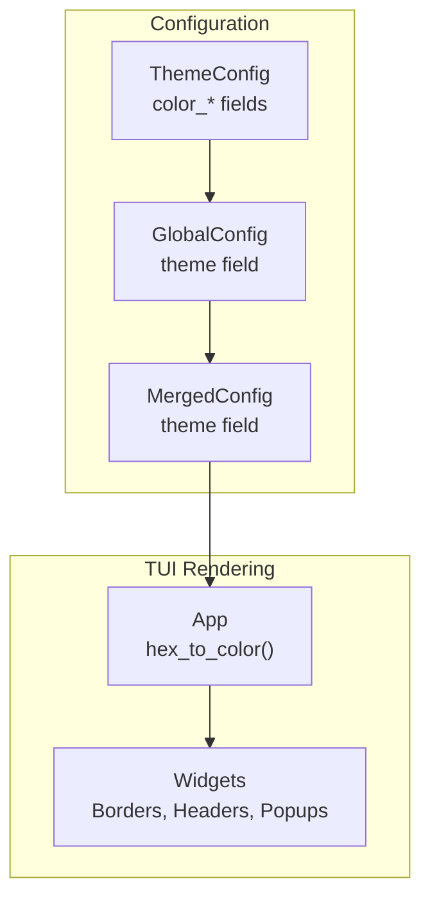
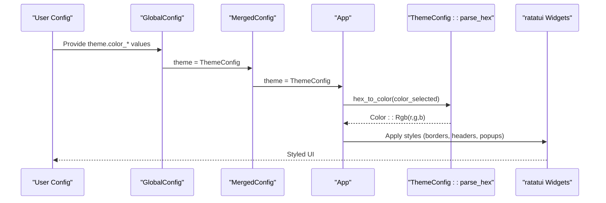
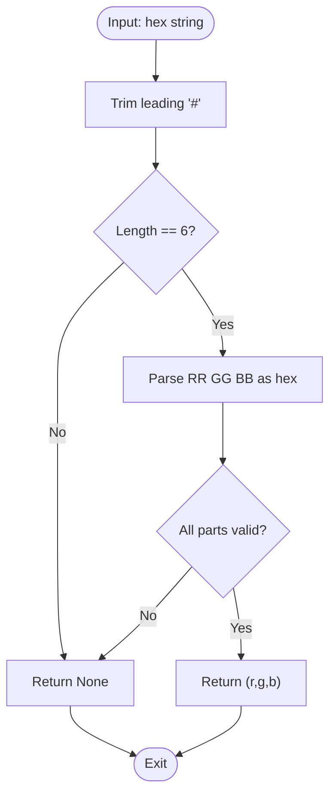
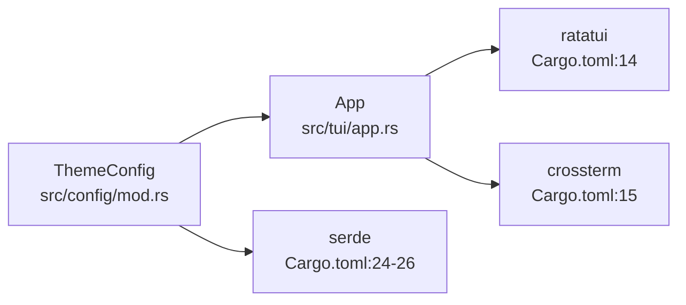

# Theme and Appearance

<cite>
**Referenced Files in This Document**
- [config/mod.rs](file://src/config/mod.rs)
- [app.rs](file://src/tui/app.rs)
- [board.rs](file://src/tui/board.rs)
- [config_tests.rs](file://tests/config_tests.rs)
- [Cargo.toml](file://Cargo.toml)
</cite>

## Table of Contents
1. [Introduction](#introduction)
2. [Project Structure](#project-structure)
3. [Core Components](#core-components)
4. [Architecture Overview](#architecture-overview)
5. [Detailed Component Analysis](#detailed-component-analysis)
6. [Dependency Analysis](#dependency-analysis)
7. [Performance Considerations](#performance-considerations)
8. [Troubleshooting Guide](#troubleshooting-guide)
9. [Conclusion](#conclusion)

## Introduction
This document explains how to customize the visual appearance of agtx through its theme system. It focuses on the ThemeConfig structure, color specifications for UI elements, color parsing functionality, default values, and terminal compatibility considerations. It also provides practical examples for different terminal environments, accessibility guidance, team-wide standardization approaches, validation rules, and troubleshooting tips for cross-emulator display issues.

## Project Structure
The theme system is implemented in the configuration module and consumed by the TUI application. Key locations:
- Theme configuration definition and defaults: [config/mod.rs](file://src/config/mod.rs)
- Color parsing and usage in the TUI: [app.rs](file://src/tui/app.rs)
- Board state (visual layout context): [board.rs](file://src/tui/board.rs)
- Tests validating color parsing and defaults: [config_tests.rs](file://tests/config_tests.rs)
- Dependencies for TUI rendering: [Cargo.toml](file://Cargo.toml)

**Diagram sources**
- [config/mod.rs:41-79](file://src/config/mod.rs#L41-L79)
- [config/mod.rs:338-353](file://src/config/mod.rs#L338-L353)
- [app.rs:34-39](file://src/tui/app.rs#L34-L39)

**Section sources**
- [config/mod.rs:1-595](file://src/config/mod.rs#L1-L595)
- [app.rs:1-9052](file://src/tui/app.rs#L1-L9052)
- [board.rs:1-99](file://src/tui/board.rs#L1-L99)
- [Cargo.toml:12-16](file://Cargo.toml#L12-L16)

## Core Components
ThemeConfig defines nine color fields used to style the TUI:
- color_selected: border for selected elements
- color_normal: border for normal/unselected elements
- color_dimmed: inactive elements
- color_text: titles
- color_accent: highlights
- color_description: task descriptions
- color_column_header: unselected column headers
- color_popup_border: popup borders
- color_popup_header: popup header backgrounds

Each field stores a hex color string. The structure provides:
- Default values for all colors
- A parser to convert hex strings to RGB tuples
- Integration with the TUI rendering pipeline

Key implementation points:
- Field definitions and defaults: [config/mod.rs:41-79](file://src/config/mod.rs#L41-L79), [config/mod.rs:81-131](file://src/config/mod.rs#L81-L131)
- Hex parsing function: [config/mod.rs:133-145](file://src/config/mod.rs#L133-L145)
- TUI usage via hex_to_color(): [app.rs:34-39](file://src/tui/app.rs#L34-L39)

**Section sources**
- [config/mod.rs:41-145](file://src/config/mod.rs#L41-L145)
- [app.rs:34-39](file://src/tui/app.rs#L34-L39)

## Architecture Overview
The theme system integrates configuration, parsing, and rendering:

**Diagram sources**
- [config/mod.rs:20-22](file://src/config/mod.rs#L20-L22)
- [config/mod.rs:338-353](file://src/config/mod.rs#L338-L353)
- [app.rs:34-39](file://src/tui/app.rs#L34-L39)
- [config/mod.rs:133-145](file://src/config/mod.rs#L133-L145)

## Detailed Component Analysis

### ThemeConfig Structure and Defaults
ThemeConfig encapsulates all visual color preferences. Each field is a String containing a hex color. Defaults are provided for all nine fields, ensuring the application renders consistently even without user configuration.

Field definitions and defaults:
- color_selected: default yellow-like tone
- color_normal: default cyan-like tone
- color_dimmed: default dark gray
- color_text: default light rose
- color_accent: default cyan-like tone
- color_description: default muted rose
- color_column_header: default light blue-gray
- color_popup_border: default light cyan
- color_popup_header: default light cyan

These defaults are defined in the Default implementation and individual default_* functions.

Validation and parsing:
- Hex parsing validates length and characters, returning an RGB tuple
- Invalid hex strings fall back to white in the TUI conversion function

Integration:
- ThemeConfig is embedded in GlobalConfig and then merged into MergedConfig for runtime usage
- The TUI converts hex strings to ratatui Color::Rgb via hex_to_color()

**Section sources**
- [config/mod.rs:41-79](file://src/config/mod.rs#L41-L79)
- [config/mod.rs:81-131](file://src/config/mod.rs#L81-L131)
- [config/mod.rs:133-145](file://src/config/mod.rs#L133-L145)
- [config/mod.rs:20-22](file://src/config/mod.rs#L20-L22)
- [config/mod.rs:338-353](file://src/config/mod.rs#L338-L353)
- [app.rs:34-39](file://src/tui/app.rs#L34-L39)

### Color Parsing and Conversion
The parsing pipeline ensures robust color handling:
- ThemeConfig::parse_hex validates hex strings and produces RGB tuples
- hex_to_color converts parsed RGB to ratatui Color::Rgb, falling back to white for invalid inputs
- The TUI applies these colors to borders, headers, popups, and accents

**Diagram sources**
- [config/mod.rs:133-145](file://src/config/mod.rs#L133-L145)

**Section sources**
- [config/mod.rs:133-145](file://src/config/mod.rs#L133-L145)
- [app.rs:34-39](file://src/tui/app.rs#L34-L39)

### TUI Usage of Theme Colors
The TUI applies theme colors across several UI elements:
- Footer item highlight background uses a specific accent color
- General borders and headers use color_selected and color_normal
- Column headers use color_column_header when not selected
- Popup borders and headers use color_popup_border and color_popup_header
- Titles and descriptions use color_text and color_description

The helper function hex_to_color centralizes color conversion, ensuring consistent fallback behavior.

**Section sources**
- [app.rs:203-244](file://src/tui/app.rs#L203-L244)
- [app.rs:34-39](file://src/tui/app.rs#L34-L39)

### Practical Theme Customization Examples
Below are practical examples for common terminal environments. Replace the placeholder hex values with your preferred colors. Ensure each value is a six-digit lowercase hex string (e.g., "#rrggbb").

- Dark terminal with light text:
  - color_selected: "#ffd700"
  - color_normal: "#00bfff"
  - color_dimmed: "#696969"
  - color_text: "#ffffff"
  - color_accent: "#00ffff"
  - color_description: "#d3d3d3"
  - color_column_header: "#a9a9a9"
  - color_popup_border: "#00ced1"
  - color_popup_header: "#87ceeb"

- Light terminal with dark text:
  - color_selected: "#8b4513"
  - color_normal: "#20b2aa"
  - color_dimmed: "#a9a9a9"
  - color_text: "#000000"
  - color_accent: "#008b8b"
  - color_description: "#696969"
  - color_column_header: "#c0c0c0"
  - color_popup_border: "#40e0d0"
  - color_popup_header: "#5f9ea0"

- High contrast monochrome:
  - color_selected: "#000000"
  - color_normal: "#ffffff"
  - color_dimmed: "#cccccc"
  - color_text: "#000000"
  - color_accent: "#000000"
  - color_description: "#666666"
  - color_column_header: "#ffffff"
  - color_popup_border: "#000000"
  - color_popup_header: "#ffffff"

Notes:
- Use lowercase hex digits for consistency
- Avoid extremely bright or washed-out colors that reduce readability
- Test across different terminals to confirm visibility

### Accessibility Considerations
- Contrast ratio: Ensure sufficient contrast between text and backgrounds. For example, pair dark text with light backgrounds and vice versa.
- Colorblind-friendly palettes: Prefer colors that remain distinguishable under protanopia, deuteranopia, and tritanopia simulations.
- Avoid red/green discrimination issues: Use hues that differ in saturation or brightness rather than relying solely on hue differences.
- Respect user preferences: Allow users to adjust colors according to their visual needs.

### Team-Wide Theme Standardization
- Centralized configuration: Store a shared theme configuration in your project’s repository to ensure uniformity across team members.
- Documentation: Provide a style guide specifying acceptable color ranges and contrast requirements.
- Validation: Add automated checks to enforce hex format and validate color combinations.
- Onboarding: Include theme customization steps in developer setup instructions.

### Color Validation and Format Requirements
- Format: Six-digit lowercase hex string (e.g., "rrggbb" or "#rrggbb")
- Validation rules:
  - Length must be exactly six characters after removing a leading '#'
  - Each pair must be valid hexadecimal digits
  - Empty strings and invalid lengths return None
- Default values are validated to ensure correctness.

Tests demonstrate:
- Valid hex parsing with and without leading '#'
- Invalid inputs (too short, too long, non-hex characters, empty)
- Default theme values pass validation

**Section sources**
- [config_tests.rs:8-30](file://tests/config_tests.rs#L8-L30)
- [config_tests.rs:32-46](file://tests/config_tests.rs#L32-L46)
- [config/mod.rs:133-145](file://src/config/mod.rs#L133-L145)

## Dependency Analysis
The theme system relies on:
- ratatui for rendering styled UI elements
- crossterm for terminal interaction
- serde for configuration serialization/deserialization

**Diagram sources**
- [Cargo.toml:12-26](file://Cargo.toml#L12-L26)
- [config/mod.rs:41-79](file://src/config/mod.rs#L41-L79)
- [app.rs:10](file://src/tui/app.rs#L10)

**Section sources**
- [Cargo.toml:12-26](file://Cargo.toml#L12-L26)
- [config/mod.rs:41-79](file://src/config/mod.rs#L41-L79)
- [app.rs:10](file://src/tui/app.rs#L10)

## Performance Considerations
- Parsing cost: Hex parsing occurs when converting strings to colors. Since this happens infrequently (during initialization and rendering), the overhead is negligible.
- Rendering cost: Applying colors to widgets is handled efficiently by ratatui. Keep theme updates minimal to avoid unnecessary redraws.

## Troubleshooting Guide
Common issues and resolutions:
- Colors not applying:
  - Verify hex format is six lowercase digits (e.g., "rrggbb")
  - Ensure no extra spaces or uppercase letters
  - Confirm the color is not empty
- Unexpected white fallback:
  - Invalid hex strings fall back to white; check logs or validation
  - Reformat the hex string to meet requirements
- Terminal emulator differences:
  - Some terminals emulate ANSI differently; test with your emulator
  - If a color appears incorrect, adjust the hex value to a more compatible shade
- Popup or header colors:
  - Confirm color_popup_border and color_popup_header are set appropriately
  - Ensure color_popup_header contrasts well with popup content

Validation references:
- Hex parsing tests: [config_tests.rs:8-30](file://tests/config_tests.rs#L8-L30)
- Default theme validation: [config_tests.rs:32-46](file://tests/config_tests.rs#L32-L46)

**Section sources**
- [config_tests.rs:8-30](file://tests/config_tests.rs#L8-L30)
- [config_tests.rs:32-46](file://tests/config_tests.rs#L32-L46)

## Conclusion
The ThemeConfig system provides a flexible and robust way to customize agtx’s visual appearance. By adhering to strict hex format requirements, validating inputs, and considering terminal compatibility and accessibility, teams can achieve consistent, readable, and visually appealing UIs across diverse environments. Use the provided examples and validation guidelines to implement reliable theme configurations.