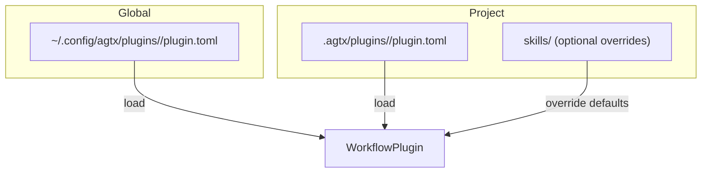
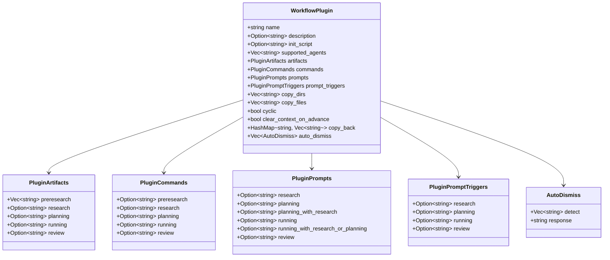
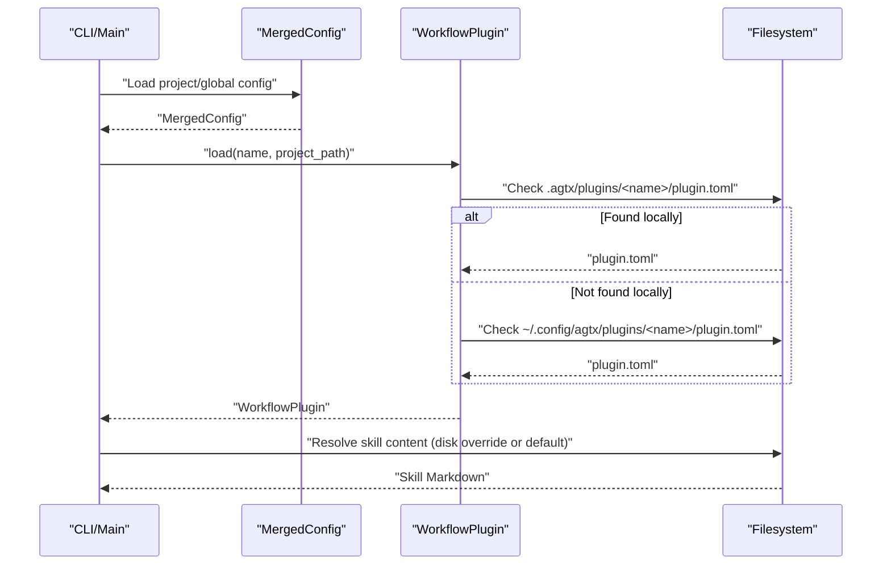
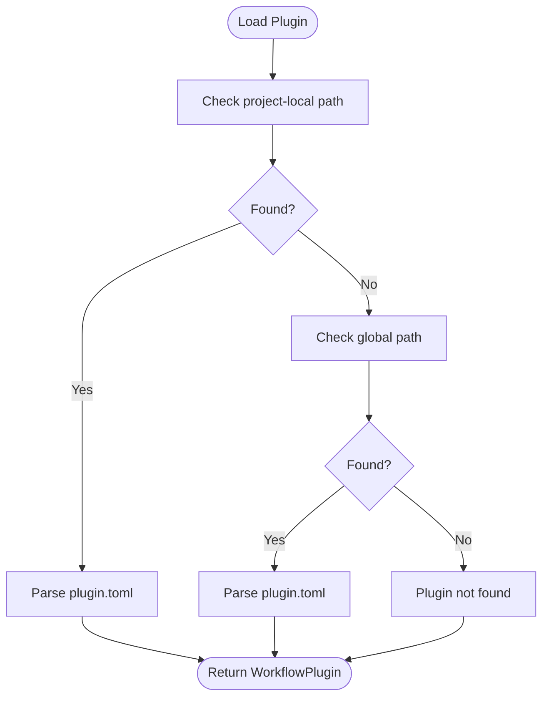
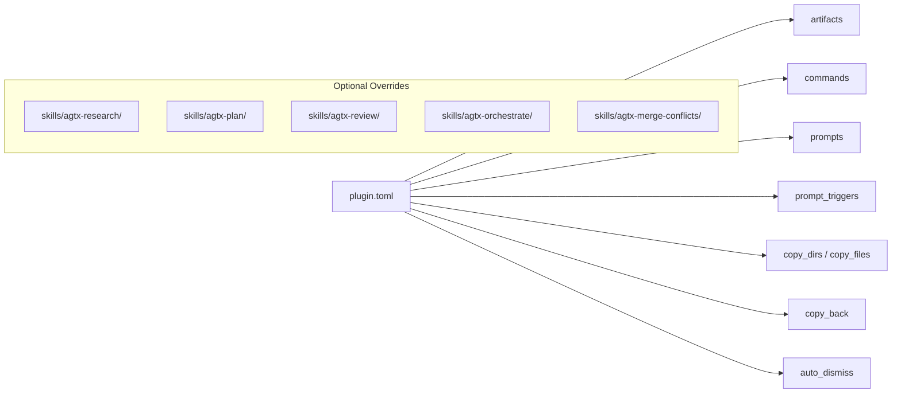
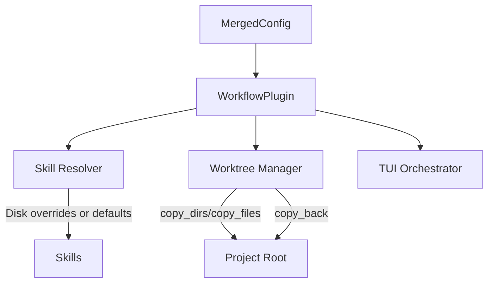

# Workflow Plugin Configuration

<cite>
**Referenced Files in This Document**
- [plugin.toml](file://plugins/agtx/plugin.toml)
- [plugin.toml](file://plugins/agent-skills/plugin.toml)
- [plugin.toml](file://plugins/agtx-terse/plugin.toml)
- [plugin.toml](file://plugins/bmad/plugin.toml)
- [plugin.toml](file://plugins/gsd/plugin.toml)
- [plugin.toml](file://plugins/openspec/plugin.toml)
- [mod.rs](file://src/config/mod.rs)
- [app_tests.rs](file://src/tui/app_tests.rs)
- [main.rs](file://src/main.rs)
- [plan.md](file://plugins/agtx/skills/plan.md)
- [research.md](file://plugins/agtx/skills/research.md)
- [review.md](file://plugins/agtx/skills/review.md)
- [orchestrate.md](file://plugins/agtx/skills/orchestrate.md)
- [merge-conflicts.md](file://plugins/agtx/skills/merge-conflicts.md)
</cite>

## Table of Contents
1. [Introduction](#introduction)
2. [Project Structure](#project-structure)
3. [Core Components](#core-components)
4. [Architecture Overview](#architecture-overview)
5. [Detailed Component Analysis](#detailed-component-analysis)
6. [Dependency Analysis](#dependency-analysis)
7. [Performance Considerations](#performance-considerations)
8. [Troubleshooting Guide](#troubleshooting-guide)
9. [Conclusion](#conclusion)
10. [Appendices](#appendices)

## Introduction
This document explains how to configure and customize agtx workflow plugins. It focuses on the WorkflowPlugin structure, plugin loading from project-local and global locations, directory layout, skill file organization, and advanced features such as copy_dirs and copy_files for worktree synchronization, cyclic workflow support, clear_context_on_advance, copy_back mechanisms, and auto_dismiss rules. Practical examples demonstrate different development methodologies, and guidance is provided for custom plugin development, versioning, artifact management, and integration with the broader agtx ecosystem.

## Project Structure
Plugins are organized under:
- Project-local plugins: .agtx/plugins/<plugin-name>/
- Global plugins: ~/.config/agtx/plugins/<plugin-name>/

Each plugin directory contains:
- plugin.toml: plugin metadata and configuration
- skills/: optional skill Markdown files overriding built-in skills

**Diagram sources**
- [mod.rs:545-594](file://src/config/mod.rs#L545-L594)

**Section sources**
- [mod.rs:545-594](file://src/config/mod.rs#L545-L594)

## Core Components
The WorkflowPlugin configuration is defined in Rust and serialized from plugin.toml. Key fields include:
- name and description
- supported_agents: agent whitelist
- artifacts: artifact paths per phase
- commands: per-phase slash commands
- prompts: per-phase task prompts
- prompt_triggers: text to await before sending prompts
- copy_dirs and copy_files: worktree sync from project root
- cyclic: enable Review → Planning transitions
- clear_context_on_advance: send agent-specific clear command before phase
- copy_back: copy files/dirs back to project after phase completion
- auto_dismiss: rules to auto-dismiss interactive prompts

**Diagram sources**
- [mod.rs:410-510](file://src/config/mod.rs#L410-L510)

**Section sources**
- [mod.rs:410-510](file://src/config/mod.rs#L410-L510)

## Architecture Overview
Plugin loading follows a deterministic order: project-local first, then global. Skill overrides are resolved from disk when present, otherwise default to built-in skills. Worktree synchronization uses copy_dirs and copy_files merged with project-level settings.

**Diagram sources**
- [mod.rs:545-594](file://src/config/mod.rs#L545-L594)
- [app_tests.rs:9536-9556](file://src/tui/app_tests.rs#L9536-L9556)

## Detailed Component Analysis

### WorkflowPlugin Structure and Fields
- name and description: human-readable identity and purpose
- supported_agents: restrict plugin to specific agents; empty means all agents supported
- artifacts: define artifact paths per phase; supports glob patterns and arrays
- commands: per-phase slash commands; preresearch is used when no prior artifacts exist
- prompts: per-phase task prompts; can include {task} placeholder
- prompt_triggers: polling text to await before sending prompts
- copy_dirs and copy_files: synchronize project files into worktrees; merged with project-level copy_files
- cyclic: allow Review → Planning transitions for iterative workflows
- clear_context_on_advance: send agent-specific clear command before phase transitions
- copy_back: copy files/dirs from worktree back to project after a phase completes
- auto_dismiss: detect patterns and send keystrokes to dismiss prompts automatically

**Section sources**
- [mod.rs:410-510](file://src/config/mod.rs#L410-L510)

### Plugin Loading Mechanisms
- Project-local: .agtx/plugins/<name>/plugin.toml
- Global: ~/.config/agtx/plugins/<name>/plugin.toml
- Priority: project-local overrides global
- Disk sync: bundled plugins can be written to .agtx/plugins/<name>/plugin.toml for local overrides

**Diagram sources**
- [mod.rs:545-594](file://src/config/mod.rs#L545-L594)

**Section sources**
- [mod.rs:545-594](file://src/config/mod.rs#L545-L594)
- [app_tests.rs:9536-9556](file://src/tui/app_tests.rs#L9536-L9556)

### Plugin Directory Structure and Skill Organization
- plugin.toml defines configuration
- Optional skills/ directory can override built-in skills
- Built-in skills include research, plan, review, orchestrate, merge-conflicts

**Diagram sources**
- [mod.rs:410-510](file://src/config/mod.rs#L410-L510)
- [research.md:1-45](file://plugins/agtx/skills/research.md#L1-L45)
- [plan.md:1-43](file://plugins/agtx/skills/plan.md#L1-L43)
- [review.md:1-36](file://plugins/agtx/skills/review.md#L1-L36)
- [orchestrate.md:1-200](file://plugins/agtx/skills/orchestrate.md#L1-L200)
- [merge-conflicts.md:1-53](file://plugins/agtx/skills/merge-conflicts.md#L1-L53)

**Section sources**
- [mod.rs:410-510](file://src/config/mod.rs#L410-L510)
- [research.md:1-45](file://plugins/agtx/skills/research.md#L1-L45)
- [plan.md:1-43](file://plugins/agtx/skills/plan.md#L1-L43)
- [review.md:1-36](file://plugins/agtx/skills/review.md#L1-L36)
- [orchestrate.md:1-200](file://plugins/agtx/skills/orchestrate.md#L1-L200)
- [merge-conflicts.md:1-53](file://plugins/agtx/skills/merge-conflicts.md#L1-L53)

### Advanced Plugin Features

#### Worktree Synchronization: copy_dirs and copy_files
- copy_dirs: directories to mirror from project root into worktrees
- copy_files: individual files to mirror; merged with project-level copy_files
- Used during worktree setup to ensure the isolated environment has required assets

**Section sources**
- [mod.rs:428-434](file://src/config/mod.rs#L428-L434)

#### Cyclic Workflow Support: cyclic
- Enables Review → Planning transitions for iterative development
- Useful for continuous improvement and multi-pass refinement

**Section sources**
- [mod.rs:435-437](file://src/config/mod.rs#L435-L437)

#### Clear Context on Advance: clear_context_on_advance
- Sends an agent-specific “clear context” command before phase transitions
- Currently honored for Claude Code (/clear); others fall through to normal send

**Section sources**
- [mod.rs:438-442](file://src/config/mod.rs#L438-L442)

#### Artifact Retrieval: copy_back
- Copies files or directories from worktree back to project root after a phase completes
- Indexed by phase name (e.g., research, planning, running, review)

**Section sources**
- [mod.rs:443-446](file://src/config/mod.rs#L443-L446)

#### Interactive Prompt Automation: auto_dismiss
- Detects patterns in tmux pane content and sends keystrokes automatically
- Uses AND logic across all detect patterns; response is newline-separated keystrokes

**Section sources**
- [mod.rs:447-462](file://src/config/mod.rs#L447-L462)

### Practical Examples of Plugin Configuration

#### Example 1: agtx (built-in)
- Purpose: Full lifecycle with research, plan, execute, review
- Artifacts: .agtx/research.md, .agtx/plan.md, .agtx/execute.md, .agtx/review.md
- Commands: /agtx:research, /agtx:plan, /agtx:execute, /agtx:review
- Behavior: clear_context_on_advance enabled

**Section sources**
- [plugin.toml:1-16](file://plugins/agtx/plugin.toml#L1-L16)

#### Example 2: agent-skills
- Purpose: Production-grade engineering skills across spec-to-ship lifecycle
- Commands: /spec, /plan, /build, /review
- Prompts: {task} placeholders for research and planning
- Init script: installs marketplace plugin locally

**Section sources**
- [plugin.toml:1-19](file://plugins/agent-skills/plugin.toml#L1-L19)

#### Example 3: agtx-terse
- Purpose: Token-efficient workflow with minimal tokens
- Artifacts and commands mirror agtx; clear_context_on_advance enabled

**Section sources**
- [plugin.toml:1-16](file://plugins/agtx-terse/plugin.toml#L1-L16)

#### Example 4: gsd (Get Shit Done)
- Purpose: Spec-driven development with structured phases
- Agents: restricted to ["claude", "codex", "gemini", "opencode"]
- Cyclic: enabled
- Pre-research: preresearch artifacts prepared from .planning/*
- Prompt triggers: waits for “What do you want to build?” before research
- Auto-dismiss: preselects “Skip mapping” option
- Copy back: returns .planning assets after preresearch

**Section sources**
- [plugin.toml:1-34](file://plugins/gsd/plugin.toml#L1-L34)

#### Example 5: bmad
- Purpose: AI-driven agile with structured phases
- Init script: installs bmad-method
- Copy dirs: _bmad, _bmad-output
- Artifacts: PRD.md, *.md implementation artifacts
- Copy back: returns _bmad-output after planning and running

**Section sources**
- [plugin.toml:1-22](file://plugins/bmad/plugin.toml#L1-L22)

#### Example 6: openspec
- Purpose: Lightweight AI-guided specification
- Copy dirs: openspec (contains change specs)
- Commands: /opsx:propose, /opsx:apply, /opsx:verify
- Copy back: returns openspec after planning

**Section sources**
- [plugin.toml:1-21](file://plugins/openspec/plugin.toml#L1-L21)

### Custom Plugin Development Guidelines
- Create a plugin directory under .agtx/plugins/<your-plugin>/ or ~/.config/agtx/plugins/<your-plugin>/
- Add plugin.toml with name, description, and desired fields (commands, prompts, artifacts, copy_back, auto_dismiss, etc.)
- Optionally add skills/<skill-name>/SKILL.md to override built-in skills
- To ensure bundeled plugins are available locally, the application writes them to .agtx/plugins/<name>/plugin.toml when configured

**Section sources**
- [mod.rs:545-594](file://src/config/mod.rs#L545-L594)
- [app_tests.rs:9536-9556](file://src/tui/app_tests.rs#L9536-L9556)

### Integration with the Agtx Ecosystem
- Plugins integrate with the TUI and tmux panes to orchestrate tasks across phases
- Built-in skills provide canonical behavior for research, planning, review, orchestration, and conflict resolution
- Worktree configuration supports isolation and synchronization across phases

**Section sources**
- [main.rs:1-228](file://src/main.rs#L1-L228)
- [research.md:1-45](file://plugins/agtx/skills/research.md#L1-L45)
- [plan.md:1-43](file://plugins/agtx/skills/plan.md#L1-L43)
- [review.md:1-36](file://plugins/agtx/skills/review.md#L1-L36)
- [orchestrate.md:1-200](file://plugins/agtx/skills/orchestrate.md#L1-L200)
- [merge-conflicts.md:1-53](file://plugins/agtx/skills/merge-conflicts.md#L1-L53)

## Dependency Analysis
The WorkflowPlugin configuration is consumed by:
- Configuration loader (project/global merge)
- Plugin loader (project-local then global)
- Skill resolver (disk overrides or defaults)
- Worktree manager (copy_dirs, copy_files, copy_back)
- TUI orchestrator (phase transitions, prompt triggers, auto_dismiss)

**Diagram sources**
- [mod.rs:337-408](file://src/config/mod.rs#L337-L408)
- [mod.rs:545-594](file://src/config/mod.rs#L545-L594)

**Section sources**
- [mod.rs:337-408](file://src/config/mod.rs#L337-L408)
- [mod.rs:545-594](file://src/config/mod.rs#L545-L594)

## Performance Considerations
- Minimize copy_dirs and copy_files to reduce worktree setup time
- Use glob patterns judiciously in artifacts to avoid scanning large directories
- Prefer clear_context_on_advance only when the target agent benefits from it
- Limit auto_dismiss patterns to highly specific, stable prompts to avoid false positives

## Troubleshooting Guide
Common issues and resolutions:
- Plugin not found
  - Ensure plugin.toml exists under .agtx/plugins/<name>/ or ~/.config/agtx/plugins/<name>/
  - Confirm plugin name matches the configured workflow_plugin
- Skill overrides not applied
  - Verify skills/<skill-name>/SKILL.md exists under the plugin directory
  - Confirm the plugin is loaded from disk (not bundled) if expecting overrides
- Worktree synchronization problems
  - Check copy_dirs and copy_files paths; ensure they are relative to project root
  - Confirm project-level copy_files is not conflicting with plugin-level copy_files
- Cyclic transitions not working
  - Set cyclic = true in plugin.toml
  - Ensure Review → Planning transitions are valid per plugin rules
- Auto-dismiss not triggering
  - Ensure all detect patterns are present in pane content
  - Verify response contains newline-separated keystrokes
- Agent compatibility
  - Set supported_agents to restrict plugin to compatible agents
  - Empty supported_agents allows all agents

**Section sources**
- [mod.rs:545-594](file://src/config/mod.rs#L545-L594)
- [mod.rs:410-510](file://src/config/mod.rs#L410-L510)

## Conclusion
Workflow plugins in agtx provide a flexible, extensible mechanism to define lifecycle phases, commands, prompts, artifacts, and advanced behaviors such as worktree synchronization, cyclic workflows, context clearing, artifact retrieval, and interactive prompt automation. By understanding the WorkflowPlugin structure, plugin loading order, and directory layout, developers can tailor workflows to diverse development methodologies while maintaining compatibility with the broader agtx ecosystem.

## Appendices

### Appendix A: Field Reference
- name: string
- description: string (optional)
- init_script: string (optional)
- supported_agents: array of strings (optional)
- artifacts: object with preresearch[], research, planning, running, review (optional)
- commands: object with preresearch, research, planning, running, review (optional)
- prompts: object with research, planning, planning_with_research, running, running_with_research_or_planning, review (optional)
- prompt_triggers: object with research, planning, running, review (optional)
- copy_dirs: array of strings (optional)
- copy_files: array of strings (optional)
- cyclic: boolean (optional)
- clear_context_on_advance: boolean (optional)
- copy_back: map of phase -> array of strings (optional)
- auto_dismiss: array of { detect: [string], response: string } (optional)

**Section sources**
- [mod.rs:410-510](file://src/config/mod.rs#L410-L510)