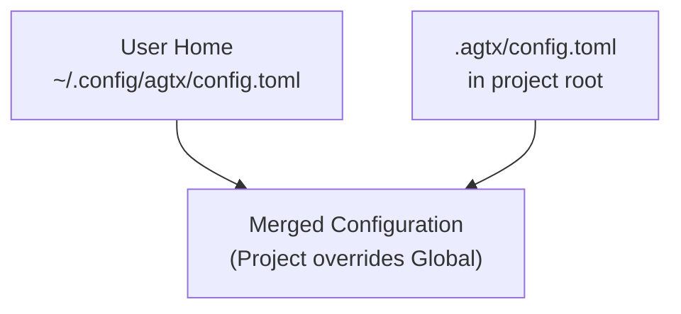
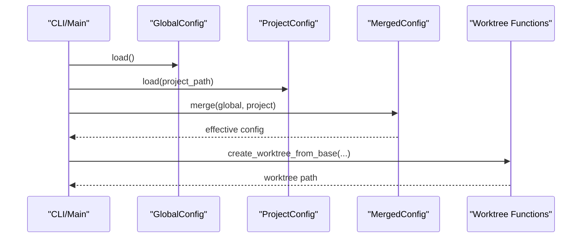
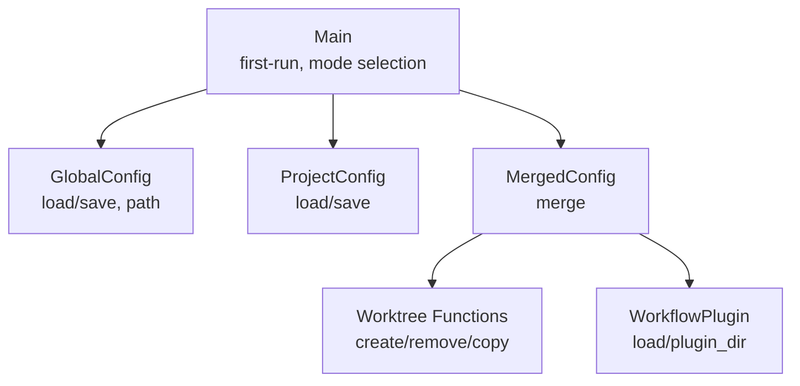

# Configuration Reference

<cite>
**Referenced Files in This Document**
- [src/config/mod.rs](file://src/config/mod.rs)
- [src/git/worktree.rs](file://src/git/worktree.rs)
- [src/main.rs](file://src/main.rs)
- [tests/config_tests.rs](file://tests/config_tests.rs)
- [README.md](file://README.md)
- [plugins/gsd/plugin.toml](file://plugins/gsd/plugin.toml)
- [plugins/spec-kit/plugin.toml](file://plugins/spec-kit/plugin.toml)
</cite>

## Table of Contents
1. [Introduction](#introduction)
2. [Project Structure](#project-structure)
3. [Core Components](#core-components)
4. [Architecture Overview](#architecture-overview)
5. [Detailed Component Analysis](#detailed-component-analysis)
6. [Dependency Analysis](#dependency-analysis)
7. [Performance Considerations](#performance-considerations)
8. [Troubleshooting Guide](#troubleshooting-guide)
9. [Conclusion](#conclusion)
10. [Appendices](#appendices)

## Introduction
This document provides a comprehensive configuration reference for AGTX’s configuration system, covering both global and project-level settings. It explains configuration file locations, available options, precedence rules, and practical examples for common scenarios such as multi-environment setups, custom worktree locations, and agent-specific optimizations. It also documents configuration validation, error handling, and best practices for organizing configuration files across multiple projects.

## Project Structure
AGTX maintains two primary configuration layers:
- Global configuration: Stored under the user’s home directory at ~/.config/agtx/config.toml
- Project-level configuration: Stored under the project root at .agtx/config.toml

The global configuration defines defaults for agents, worktrees, theming, and UI behavior. The project-level configuration overrides or augments global settings for a specific repository.

**Diagram sources**
- [src/config/mod.rs:232-274](file://src/config/mod.rs#L232-L274)
- [src/config/mod.rs:278-303](file://src/config/mod.rs#L278-L303)
- [src/config/mod.rs:357-388](file://src/config/mod.rs#L357-L388)

**Section sources**
- [src/config/mod.rs:5-39](file://src/config/mod.rs#L5-L39)
- [src/config/mod.rs:199-228](file://src/config/mod.rs#L199-L228)
- [src/config/mod.rs:232-303](file://src/config/mod.rs#L232-L303)
- [README.md:261-328](file://README.md#L261-L328)

## Core Components
This section summarizes the configuration data models and their roles.

- GlobalConfig
  - Holds global defaults for default_agent, per-phase agent overrides, worktree settings, theme, and UI behavior.
  - Includes methods to load/save the global config and compute the config file path.

- ProjectConfig
  - Holds project-level overrides for default_agent, per-phase agent overrides, base_branch, GitHub URL, worktree_dir, copy_files, init_script, cleanup_script, and workflow_plugin.

- MergedConfig
  - Produces the effective configuration by merging GlobalConfig and ProjectConfig with explicit precedence rules.

- WorktreeConfig
  - Defines worktree behavior such as enabling/disabling worktrees, auto cleanup, base_branch, and worktree_dir.

- PhaseAgentsConfig
  - Allows overriding the default_agent for specific workflow phases: research, planning, running, review.

- ThemeConfig
  - Controls UI colors and defaults for the TUI.

- WorkflowPlugin
  - Defines plugin metadata and behavior (commands, prompts, artifacts, copy_back, etc.), including project-level copy_files and copy_dirs that augment worktree initialization.

**Section sources**
- [src/config/mod.rs:6-39](file://src/config/mod.rs#L6-L39)
- [src/config/mod.rs:151-158](file://src/config/mod.rs#L151-L158)
- [src/config/mod.rs:160-189](file://src/config/mod.rs#L160-L189)
- [src/config/mod.rs:199-228](file://src/config/mod.rs#L199-L228)
- [src/config/mod.rs:338-408](file://src/config/mod.rs#L338-L408)
- [src/config/mod.rs:410-594](file://src/config/mod.rs#L410-L594)

## Architecture Overview
The configuration system follows a layered approach:
- Global defaults are loaded from ~/.config/agtx/config.toml
- Project-level overrides are loaded from .agtx/config.toml
- MergedConfig resolves precedence and provides the effective configuration for runtime behavior
- Worktree creation and initialization use merged settings for base_branch, worktree_dir, and scripts

**Diagram sources**
- [src/main.rs:64-96](file://src/main.rs#L64-L96)
- [src/config/mod.rs:232-303](file://src/config/mod.rs#L232-L303)
- [src/config/mod.rs:357-388](file://src/config/mod.rs#L357-L388)
- [src/git/worktree.rs:14-65](file://src/git/worktree.rs#L14-L65)

## Detailed Component Analysis

### Global Configuration
- Location: ~/.config/agtx/config.toml
- Key options:
  - default_agent: default agent used when no phase-specific override is set
  - agents: per-phase agent overrides (research, planning, running, review)
  - worktree.enabled: enable/disable git worktrees
  - worktree.auto_cleanup: auto cleanup worktrees after merge/reject
  - worktree.base_branch: base branch for creating worktrees (empty means auto-detect)
  - worktree.worktree_dir: directory (relative to project root) where worktrees are created
  - theme: color settings for the TUI
  - fullscreen_on_enter: whether to auto-fullscreen-attach to tmux on task popup

- Behavior:
  - If the global config file does not exist, defaults are applied.
  - On first run, the application may prompt for agent selection and save defaults.

**Section sources**
- [src/config/mod.rs:5-39](file://src/config/mod.rs#L5-L39)
- [src/config/mod.rs:160-189](file://src/config/mod.rs#L160-L189)
- [src/config/mod.rs:232-274](file://src/config/mod.rs#L232-L274)
- [src/main.rs:75-89](file://src/main.rs#L75-L89)

### Project-Level Configuration
- Location: .agtx/config.toml in the project root
- Key options:
  - default_agent: override default_agent for this project
  - agents: per-phase agent overrides for this project
  - base_branch: override base branch for this project
  - github_url: optional GitHub URL for this project
  - worktree_dir: override worktree directory for this project
  - copy_files: comma-separated list of files/directories to copy into worktrees
  - init_script: shell command to run inside the worktree after creation and file copying
  - cleanup_script: shell command to run inside the worktree before removal
  - workflow_plugin: plugin name to use for this project

- Behavior:
  - If the project config file does not exist, defaults are applied.
  - Project-level settings override global settings when present.

**Section sources**
- [src/config/mod.rs:199-228](file://src/config/mod.rs#L199-L228)
- [src/config/mod.rs:278-303](file://src/config/mod.rs#L278-L303)
- [README.md:283-307](file://README.md#L283-L307)

### Per-Phase Agent Configuration
- Purpose: Assign different agents to specific workflow phases (research, planning, running, review)
- Precedence:
  - Project-level agents override global agents
  - If a phase is not set at project level, the global agent for that phase applies
  - If neither project nor global sets a phase, the default_agent is used

- Mapping:
  - "planning_with_research" maps to the planning agent
  - "running_with_research_or_planning" maps to the running agent

**Section sources**
- [src/config/mod.rs:151-158](file://src/config/mod.rs#L151-L158)
- [src/config/mod.rs:357-408](file://src/config/mod.rs#L357-L408)
- [tests/config_tests.rs:212-296](file://tests/config_tests.rs#L212-L296)

### Worktree Configuration and Initialization
- Worktree base_branch:
  - If empty, AGTX auto-detects main, then master, then falls back to the current branch
  - If set, AGTX verifies the branch exists; otherwise, it reports an error
- Worktree directory:
  - Defaults to .agtx/worktrees if not set
  - Can be overridden globally or per project
- Worktree initialization:
  - Copies agent config directories (.claude, .gemini, .codex, .github/agents, .config/opencode)
  - Copies plugin-specific directories (copy_dirs) and user-specified files (copy_files)
  - Runs init_script if provided
  - Reports warnings for missing files or failing scripts without failing the operation

**Section sources**
- [src/git/worktree.rs:5-6](file://src/git/worktree.rs#L5-L6)
- [src/git/worktree.rs:67-84](file://src/git/worktree.rs#L67-L84)
- [src/git/worktree.rs:129-223](file://src/git/worktree.rs#L129-L223)
- [src/config/mod.rs:160-189](file://src/config/mod.rs#L160-L189)
- [src/config/mod.rs:357-388](file://src/config/mod.rs#L357-L388)

### Workflow Plugin Integration
- Plugins can define:
  - supported_agents: restrict agents for the plugin
  - copy_dirs and copy_files: directories and files to copy into worktrees
  - commands and prompts: per-phase commands and prompts
  - copy_back: artifacts to copy back to the project root after completion
- Project-level copy_files merges with plugin-level copy_files during worktree setup.

**Section sources**
- [src/config/mod.rs:410-594](file://src/config/mod.rs#L410-L594)
- [plugins/gsd/plugin.toml:1-34](file://plugins/gsd/plugin.toml#L1-L34)
- [plugins/spec-kit/plugin.toml:1-21](file://plugins/spec-kit/plugin.toml#L1-L21)

## Dependency Analysis
The configuration system interacts with the TUI, git worktree utilities, and plugin loading. The following diagram shows the key dependencies:

**Diagram sources**
- [src/config/mod.rs:232-303](file://src/config/mod.rs#L232-L303)
- [src/config/mod.rs:357-388](file://src/config/mod.rs#L357-L388)
- [src/git/worktree.rs:14-65](file://src/git/worktree.rs#L14-L65)
- [src/config/mod.rs:546-593](file://src/config/mod.rs#L546-L593)
- [src/main.rs:64-96](file://src/main.rs#L64-L96)

**Section sources**
- [src/config/mod.rs:232-303](file://src/config/mod.rs#L232-L303)
- [src/config/mod.rs:357-388](file://src/config/mod.rs#L357-L388)
- [src/git/worktree.rs:14-65](file://src/git/worktree.rs#L14-L65)
- [src/config/mod.rs:546-593](file://src/config/mod.rs#L546-L593)
- [src/main.rs:64-96](file://src/main.rs#L64-L96)

## Performance Considerations
- Worktree creation and initialization involve filesystem operations and process spawning. Keeping copy_files minimal reduces overhead.
- Using project-level copy_files and copy_dirs strategically avoids unnecessary copying.
- Disabling worktrees (worktree.enabled = false) eliminates git worktree overhead but limits isolation.

[No sources needed since this section provides general guidance]

## Troubleshooting Guide
Common configuration issues and resolutions:

- Global config file not found
  - Behavior: Defaults are applied; first-run logic may prompt for agent selection and save defaults.
  - Resolution: Ensure ~/.config/agtx/config.toml exists or let the application create it.

- Project config file not found
  - Behavior: Defaults are applied for project-level settings.
  - Resolution: Create .agtx/config.toml in the project root if overrides are needed.

- Invalid base_branch
  - Behavior: If the configured base_branch does not exist, worktree creation fails with an error indicating the branch was not found.
  - Resolution: Set base_branch to an existing branch or leave empty to auto-detect.

- Worktree directory permissions
  - Behavior: If the worktree directory cannot be created or accessed, worktree creation fails.
  - Resolution: Ensure the directory exists and is writable; adjust worktree_dir if necessary.

- Scripts failing in worktrees
  - Behavior: init_script and cleanup_script failures produce warnings but do not block worktree creation.
  - Resolution: Verify script paths and permissions; ensure the scripts are executable.

- Agent compatibility with plugins
  - Behavior: Plugins declare supported_agents; attempting unsupported agents may lead to degraded functionality.
  - Resolution: Use supported agents or configure a compatible plugin.

**Section sources**
- [src/main.rs:75-89](file://src/main.rs#L75-L89)
- [src/config/mod.rs:278-303](file://src/config/mod.rs#L278-L303)
- [src/git/worktree.rs:67-84](file://src/git/worktree.rs#L67-L84)
- [src/git/worktree.rs:129-223](file://src/git/worktree.rs#L129-L223)
- [src/config/mod.rs:546-593](file://src/config/mod.rs#L546-L593)

## Conclusion
AGTX’s configuration system provides a flexible, layered approach to managing global and project-level settings. Global defaults establish sensible behavior, while project-level overrides tailor the environment to specific repositories. The per-phase agent configuration enables optimized agent assignments across workflow phases. Proper use of copy_files, init_script, and cleanup_script enhances worktree isolation and reproducibility. Following the precedence rules and best practices outlined here will help maintain consistent and reliable configurations across multiple projects.

[No sources needed since this section summarizes without analyzing specific files]

## Appendices

### Configuration Precedence Rules
- default_agent: project-level default_agent overrides global default_agent
- agents: project-level per-phase overrides take precedence over global per-phase overrides; unset phases fall back to default_agent
- base_branch: project-level base_branch overrides global base_branch
- worktree_dir: project-level worktree_dir overrides global worktree_dir
- other fields: project-level values override global values where applicable

**Section sources**
- [src/config/mod.rs:357-388](file://src/config/mod.rs#L357-L388)
- [tests/config_tests.rs:104-156](file://tests/config_tests.rs#L104-L156)

### Practical Examples

- Multi-environment setups
  - Use project-level base_branch to point worktrees to a development branch.
  - Use project-level copy_files to include environment-specific files (e.g., .env, .env.local).
  - Use project-level init_script to install environment dependencies.

- Custom worktree locations
  - Set worktree_dir at the global or project level to relocate worktrees outside the default .agtx/worktrees.

- Agent-specific optimizations
  - Configure agents.research, agents.planning, agents.running, agents.review to assign optimal agents per phase.
  - Use project-level default_agent to standardize the fallback agent across phases.

**Section sources**
- [README.md:283-307](file://README.md#L283-L307)
- [src/config/mod.rs:151-158](file://src/config/mod.rs#L151-L158)
- [src/config/mod.rs:357-408](file://src/config/mod.rs#L357-L408)

### Validation and Error Handling
- Global config parsing: Errors occur if the file is malformed; defaults are applied when the file is absent.
- Project config parsing: Errors occur if the file is malformed; defaults are applied when the file is absent.
- Worktree base_branch verification: Failure to verify the configured branch results in an error.
- Worktree initialization: Non-fatal warnings are produced for missing files or failing scripts; the operation continues.

**Section sources**
- [src/config/mod.rs:232-242](file://src/config/mod.rs#L232-L242)
- [src/config/mod.rs:278-288](file://src/config/mod.rs#L278-L288)
- [src/git/worktree.rs:67-84](file://src/git/worktree.rs#L67-L84)
- [src/git/worktree.rs:129-223](file://src/git/worktree.rs#L129-L223)