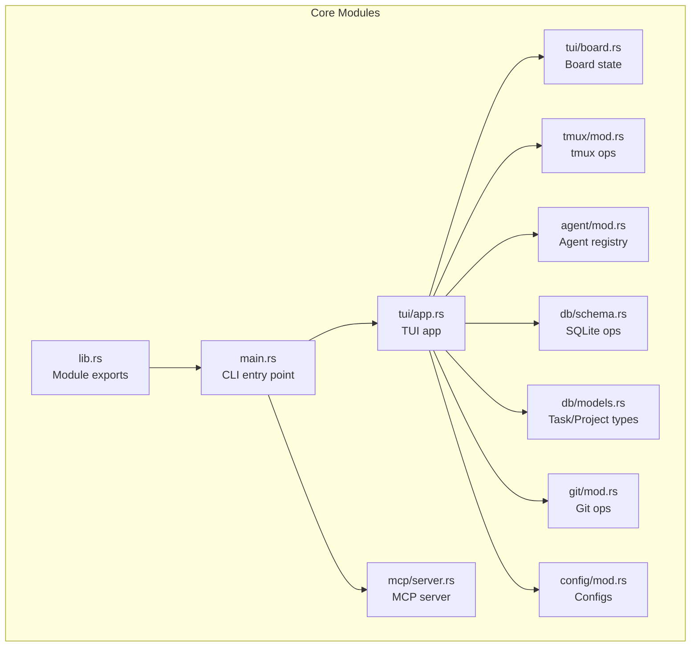
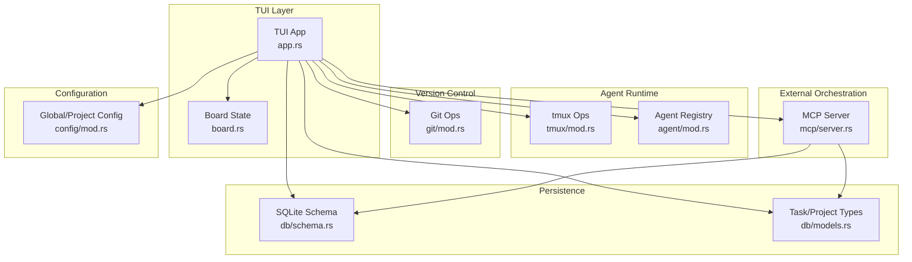
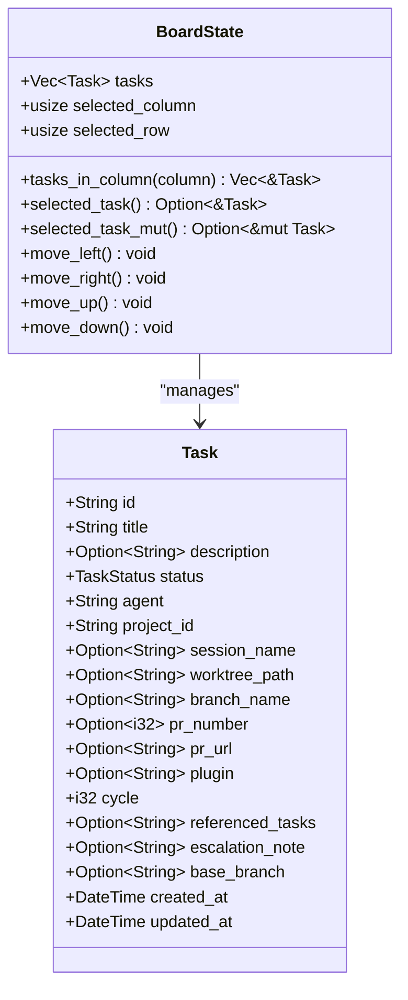
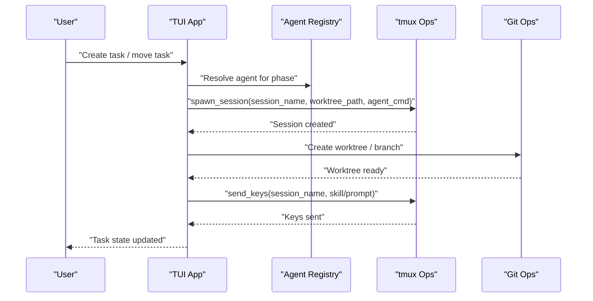
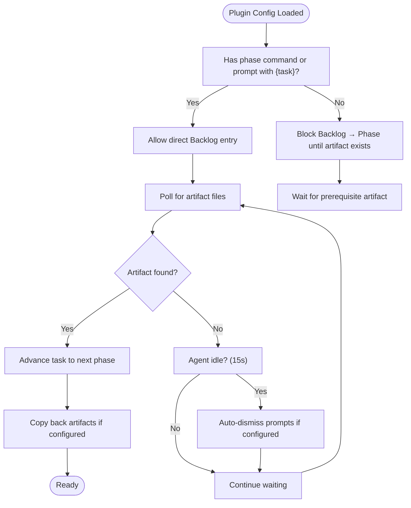
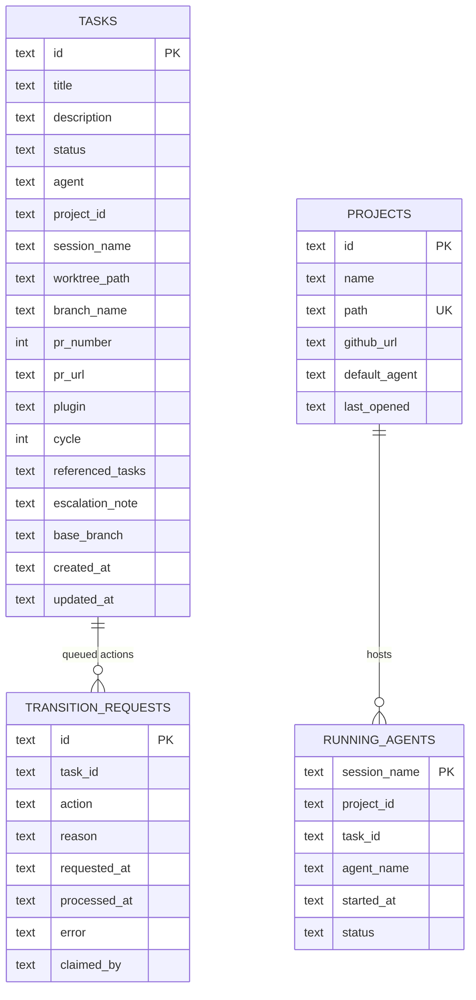
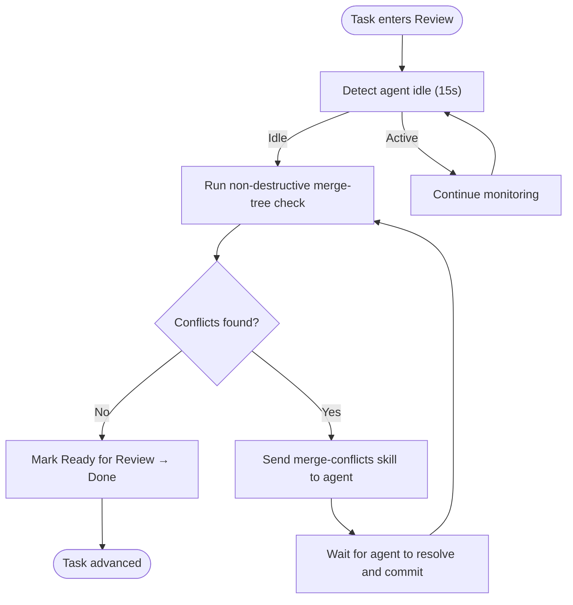
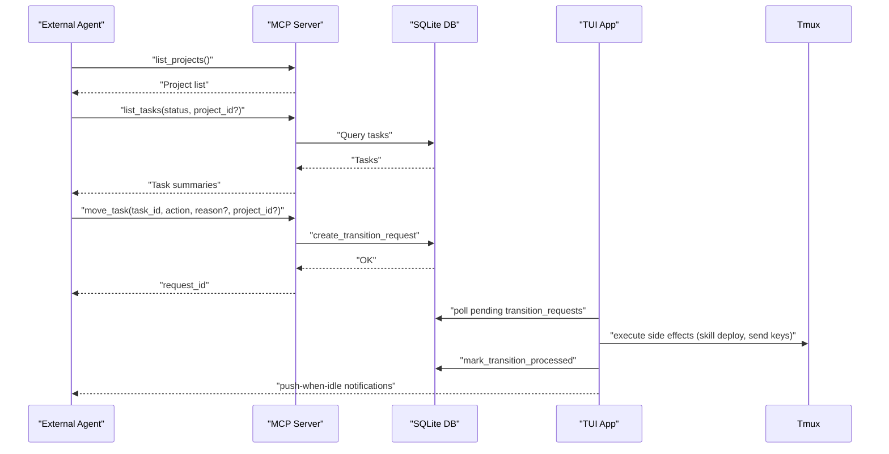
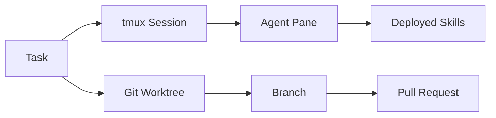
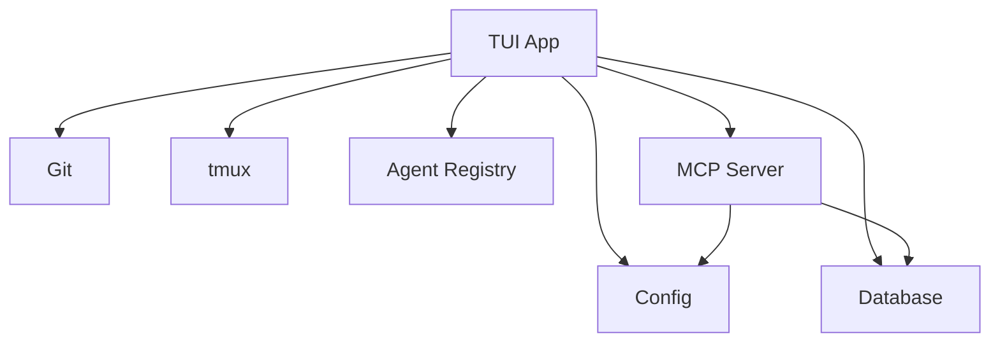

# Core Concepts

<cite>
**Referenced Files in This Document**
- [lib.rs](file://src/lib.rs)
- [main.rs](file://src/main.rs)
- [app.rs](file://src/tui/app.rs)
- [board.rs](file://src/tui/board.rs)
- [mod.rs](file://src/tmux/mod.rs)
- [mod.rs](file://src/agent/mod.rs)
- [mod.rs](file://src/db/mod.rs)
- [models.rs](file://src/db/models.rs)
- [schema.rs](file://src/db/schema.rs)
- [mod.rs](file://src/git/mod.rs)
- [mod.rs](file://src/mcp/mod.rs)
- [server.rs](file://src/mcp/server.rs)
- [mod.rs](file://src/config/mod.rs)
- [plugin.toml](file://plugins/agtx/plugin.toml)
- [plugin.toml](file://plugins/gsd/plugin.toml)
- [plugin.toml](file://plugins/spec-kit/plugin.toml)
- [README.md](file://README.md)
- [AGENTS.md](file://AGENTS.md)
</cite>

## Table of Contents
1. [Introduction](#introduction)
2. [Project Structure](#project-structure)
3. [Core Components](#core-components)
4. [Architecture Overview](#architecture-overview)
5. [Detailed Component Analysis](#detailed-component-analysis)
6. [Dependency Analysis](#dependency-analysis)
7. [Performance Considerations](#performance-considerations)
8. [Troubleshooting Guide](#troubleshooting-guide)
9. [Conclusion](#conclusion)

## Introduction
This document explains the core architecture and workflow principles of agtx. It focuses on:
- The terminal user interface (TUI) built with Ratatui and the 5-column kanban board layout
- Agent orchestration across tmux sessions and Git worktrees
- The workflow plugin system and how different development methodologies integrate
- Database architecture for task persistence and state management
- Git integration concepts including worktree management and merge conflict resolution
- The MCP (Model Context Protocol) server architecture for external orchestration
- Visual diagrams illustrating data flow and user interactions
- The relationship among tmux sessions, worktrees, and agent lifecycle management

## Project Structure
Agtx is organized into cohesive modules that encapsulate UI, orchestration, persistence, Git, tmux, and configuration. The top-level module exports define the public API surface, while the main entry point routes to either the MCP server or the TUI.

**Diagram sources**
- [lib.rs:1-24](file://src/lib.rs#L1-L24)
- [main.rs:1-96](file://src/main.rs#L1-L96)
- [app.rs:744-760](file://src/tui/app.rs#L744-L760)
- [board.rs:1-99](file://src/tui/board.rs#L1-L99)
- [mod.rs:1-189](file://src/tmux/mod.rs#L1-L189)
- [mod.rs:1-171](file://src/agent/mod.rs#L1-L171)
- [schema.rs:1-656](file://src/db/schema.rs#L1-L656)
- [models.rs:1-245](file://src/db/models.rs#L1-L245)
- [mod.rs:1-142](file://src/git/mod.rs#L1-L142)
- [server.rs:1-1264](file://src/mcp/server.rs#L1-L1264)
- [mod.rs:1-595](file://src/config/mod.rs#L1-L595)

**Section sources**
- [lib.rs:1-24](file://src/lib.rs#L1-L24)
- [main.rs:1-96](file://src/main.rs#L1-L96)
- [AGENTS.md:16-31](file://AGENTS.md#L16-L31)

## Core Components
- TUI and Board: The TUI renders a 5-column kanban board (Backlog, Planning, Running, Review, Done) and manages user interactions, popups, and state. The board state tracks tasks and selection.
- Agent Orchestration: Agents are detected and spawned into tmux sessions. Each task gets a persistent session and worktree, enabling parallel execution and resumable workflows.
- Database: SQLite-backed storage for tasks, projects, transition requests, and notifications. Provides project-scoped and global databases.
- Git Integration: Worktree creation, branch operations, and non-destructive merge conflict checks.
- MCP Server: Exposes board tools over stdio for external orchestration and skills.
- Configuration: Global and project-level configuration for agents, worktrees, plugins, and UI themes.

**Section sources**
- [board.rs:1-99](file://src/tui/board.rs#L1-L99)
- [app.rs:448-560](file://src/tui/app.rs#L448-L560)
- [mod.rs:1-171](file://src/agent/mod.rs#L1-L171)
- [schema.rs:97-208](file://src/db/schema.rs#L97-L208)
- [models.rs:58-133](file://src/db/models.rs#L58-L133)
- [mod.rs:1-142](file://src/git/mod.rs#L1-L142)
- [server.rs:16-24](file://src/mcp/server.rs#L16-L24)
- [mod.rs:1-595](file://src/config/mod.rs#L1-L595)

## Architecture Overview
The system centers around the TUI, which orchestrates agent sessions in tmux, manages Git worktrees, and persists state in SQLite. The MCP server exposes the board to external agents for orchestration and skills.

**Diagram sources**
- [app.rs:744-760](file://src/tui/app.rs#L744-L760)
- [board.rs:1-99](file://src/tui/board.rs#L1-L99)
- [mod.rs:1-189](file://src/tmux/mod.rs#L1-L189)
- [mod.rs:1-171](file://src/agent/mod.rs#L1-L171)
- [schema.rs:97-208](file://src/db/schema.rs#L97-L208)
- [models.rs:58-133](file://src/db/models.rs#L58-L133)
- [mod.rs:1-142](file://src/git/mod.rs#L1-L142)
- [server.rs:1-1264](file://src/mcp/server.rs#L1-L1264)
- [mod.rs:1-595](file://src/config/mod.rs#L1-L595)

## Detailed Component Analysis

### TUI and Kanban Board Layout
The TUI uses Ratatui to render a 5-column kanban board representing task statuses:
- Backlog
- Planning
- Running
- Review
- Done

BoardState encapsulates task lists per column, selection, and movement logic. The TUI integrates with the board to reflect task transitions and user actions.

**Diagram sources**
- [board.rs:3-99](file://src/tui/board.rs#L3-L99)
- [models.rs:58-133](file://src/db/models.rs#L58-L133)

**Section sources**
- [board.rs:1-99](file://src/tui/board.rs#L1-L99)
- [models.rs:58-133](file://src/db/models.rs#L58-L133)

### Agent Orchestration Model
Agtx detects available agents and spawns them into tmux sessions. Each task is associated with a tmux session and a Git worktree. The system supports resuming sessions and switching agents per phase.

**Diagram sources**
- [mod.rs:1-171](file://src/agent/mod.rs#L1-L171)
- [mod.rs:14-48](file://src/tmux/mod.rs#L14-L48)
- [mod.rs:1-142](file://src/git/mod.rs#L1-L142)
- [app.rs:448-560](file://src/tui/app.rs#L448-L560)

**Section sources**
- [mod.rs:1-171](file://src/agent/mod.rs#L1-L171)
- [mod.rs:14-48](file://src/tmux/mod.rs#L14-L48)
- [mod.rs:1-142](file://src/git/mod.rs#L1-L142)
- [app.rs:448-560](file://src/tui/app.rs#L448-L560)

### Workflow Plugin System
Plugins define commands, prompts, artifacts, and gating rules per phase. They control how tasks advance, what artifacts indicate completion, and how worktrees are synchronized.

**Diagram sources**
- [mod.rs:410-595](file://src/config/mod.rs#L410-L595)
- [plugin.toml:1-16](file://plugins/agtx/plugin.toml#L1-L16)
- [plugin.toml:1-34](file://plugins/gsd/plugin.toml#L1-L34)
- [plugin.toml:1-21](file://plugins/spec-kit/plugin.toml#L1-L21)

**Section sources**
- [mod.rs:410-595](file://src/config/mod.rs#L410-L595)
- [plugin.toml:1-16](file://plugins/agtx/plugin.toml#L1-L16)
- [plugin.toml:1-34](file://plugins/gsd/plugin.toml#L1-L34)
- [plugin.toml:1-21](file://plugins/spec-kit/plugin.toml#L1-L21)

### Database Architecture for Task Persistence and State Management
Agtx uses SQLite for:
- Project-scoped task storage
- Global project indexing
- Transition request queue for MCP-driven actions
- Notifications for orchestrator push-style updates

**Diagram sources**
- [schema.rs:97-208](file://src/db/schema.rs#L97-L208)
- [schema.rs:478-554](file://src/db/schema.rs#L478-L554)
- [models.rs:58-133](file://src/db/models.rs#L58-L133)
- [models.rs:135-157](file://src/db/models.rs#L135-L157)
- [models.rs:159-184](file://src/db/models.rs#L159-L184)
- [models.rs:186-213](file://src/db/models.rs#L186-L213)

**Section sources**
- [schema.rs:97-208](file://src/db/schema.rs#L97-L208)
- [schema.rs:478-554](file://src/db/schema.rs#L478-L554)
- [models.rs:58-133](file://src/db/models.rs#L58-L133)
- [models.rs:135-157](file://src/db/models.rs#L135-L157)
- [models.rs:159-184](file://src/db/models.rs#L159-L184)
- [models.rs:186-213](file://src/db/models.rs#L186-L213)

### Git Integration: Worktrees, Branches, and Merge Conflicts
Agtx manages Git worktrees per task and performs non-destructive merge conflict checks using virtual merges. It also supports branch operations and diff reporting.

**Diagram sources**
- [mod.rs:89-128](file://src/git/mod.rs#L89-L128)
- [app.rs:522-532](file://src/tui/app.rs#L522-L532)

**Section sources**
- [mod.rs:89-128](file://src/git/mod.rs#L89-L128)
- [app.rs:522-532](file://src/tui/app.rs#L522-L532)

### MCP Server Architecture for External Orchestration
The MCP server exposes tools for listing projects/tasks, queuing transitions, checking conflicts, and interacting with agent panes. It supports both global and project-scoped modes.

**Diagram sources**
- [server.rs:521-755](file://src/mcp/server.rs#L521-L755)
- [schema.rs:478-554](file://src/db/schema.rs#L478-L554)
- [app.rs:545-560](file://src/tui/app.rs#L545-L560)

**Section sources**
- [server.rs:521-755](file://src/mcp/server.rs#L521-L755)
- [schema.rs:478-554](file://src/db/schema.rs#L478-L554)
- [app.rs:545-560](file://src/tui/app.rs#L545-L560)

### Relationship Between tmux Sessions, Worktrees, and Agent Lifecycle
Each task lifecycle is anchored by a tmux session and a Git worktree. The TUI manages session attachment, pane content monitoring, and agent skill deployment. Worktrees isolate task contexts, while tmux preserves agent state.

**Diagram sources**
- [mod.rs:14-48](file://src/tmux/mod.rs#L14-L48)
- [models.rs:119-133](file://src/db/models.rs#L119-L133)
- [app.rs:448-560](file://src/tui/app.rs#L448-L560)

**Section sources**
- [mod.rs:14-48](file://src/tmux/mod.rs#L14-L48)
- [models.rs:119-133](file://src/db/models.rs#L119-L133)
- [app.rs:448-560](file://src/tui/app.rs#L448-L560)

## Dependency Analysis
The TUI depends on configuration, database, Git, tmux, agent registry, and MCP server. The MCP server depends on the database and configuration to resolve project paths and compute allowed actions.

**Diagram sources**
- [app.rs:20-28](file://src/tui/app.rs#L20-L28)
- [server.rs:13-14](file://src/mcp/server.rs#L13-L14)
- [mod.rs:1-595](file://src/config/mod.rs#L1-L595)
- [schema.rs:1-656](file://src/db/schema.rs#L1-L656)
- [mod.rs:1-142](file://src/git/mod.rs#L1-L142)
- [mod.rs:1-189](file://src/tmux/mod.rs#L1-L189)
- [mod.rs:1-171](file://src/agent/mod.rs#L1-L171)
- [mod.rs:1-1264](file://src/mcp/server.rs#L1-L1264)

**Section sources**
- [app.rs:20-28](file://src/tui/app.rs#L20-L28)
- [server.rs:13-14](file://src/mcp/server.rs#L13-L14)

## Performance Considerations
- Background session refresh: The TUI polls tmux pane content and phase status asynchronously to avoid blocking the UI.
- Non-destructive conflict checks: Using virtual merges prevents unnecessary worktree modifications.
- SQLite indexing: Indexes on task status and project IDs optimize frequent queries.
- Minimal redraws: Footer and UI updates are scoped to reduce rendering overhead.

[No sources needed since this section provides general guidance]

## Troubleshooting Guide
Common issues and remedies:
- tmux server not running: Ensure the dedicated server is available and sessions are created under the correct socket.
- Missing worktrees: Verify worktree directory configuration and permissions.
- MCP tools failing: Confirm project path resolution and that the global index contains the project.
- Idle tasks: Use pane inspection and auto-dismiss rules to unstick agents.

**Section sources**
- [mod.rs:50-84](file://src/tmux/mod.rs#L50-L84)
- [mod.rs:144-166](file://src/tmux/mod.rs#L144-L166)
- [server.rs:409-444](file://src/mcp/server.rs#L409-L444)
- [schema.rs:511-524](file://src/db/schema.rs#L511-L524)

## Conclusion
Agtx combines a powerful TUI, tmux-based agent orchestration, Git worktrees, and a flexible plugin system to deliver a spec-driven, multi-agent development workflow. The MCP server enables external orchestration and seamless integration with coding agents. The SQLite-backed persistence and Git-centric operations provide robust state management and isolation across tasks.