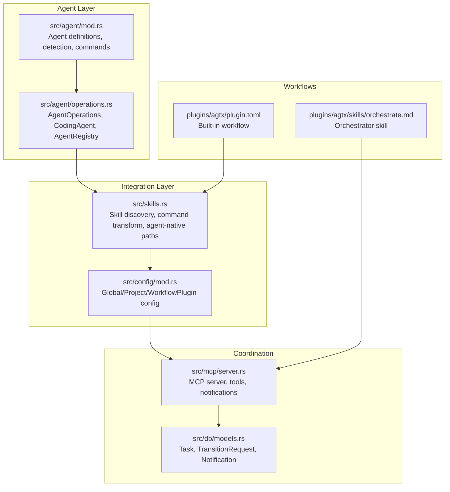
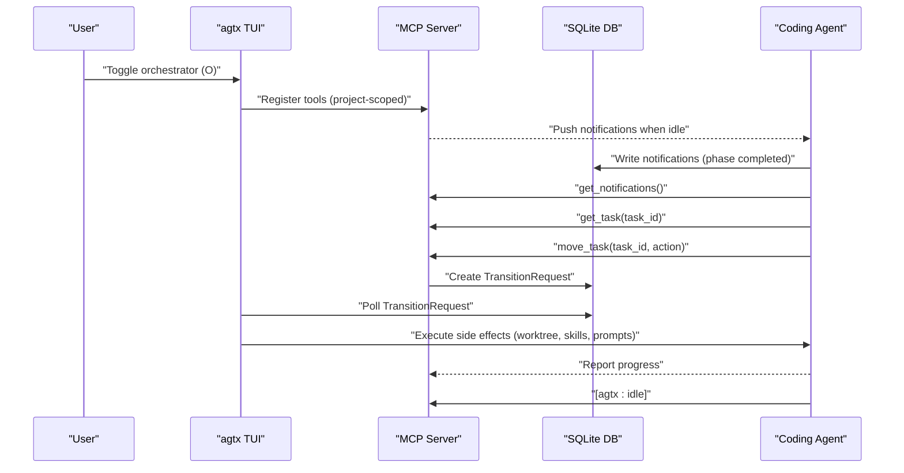
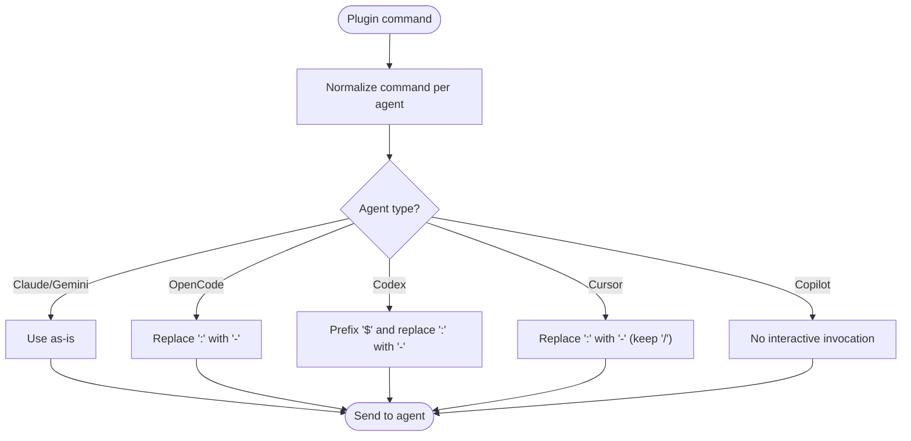
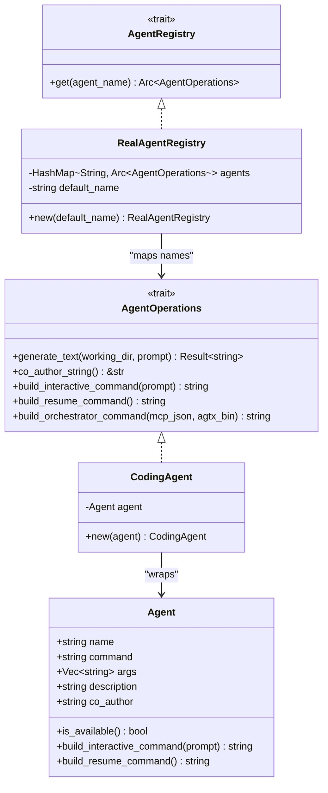
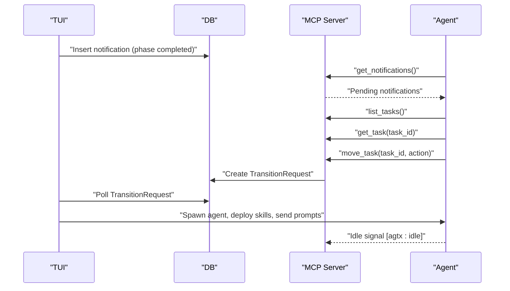
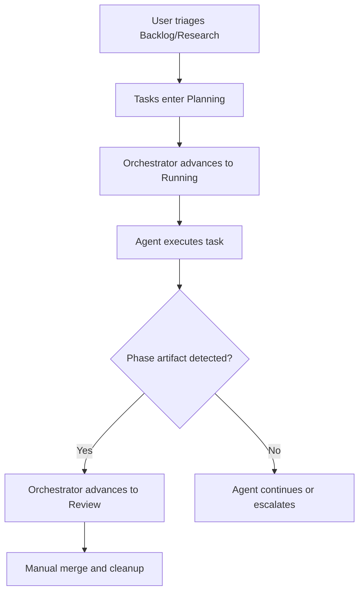
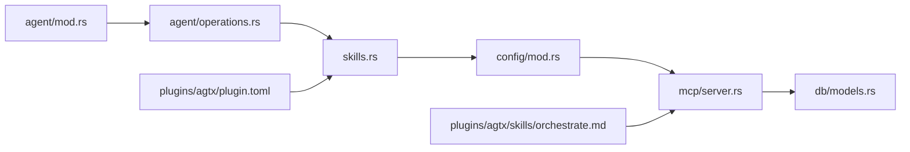

# Agent Orchestration Principles

<cite>
**Referenced Files in This Document**
- [src/agent/mod.rs](file://src/agent/mod.rs)
- [src/agent/operations.rs](file://src/agent/operations.rs)
- [src/skills.rs](file://src/skills.rs)
- [src/mcp/server.rs](file://src/mcp/server.rs)
- [src/config/mod.rs](file://src/config/mod.rs)
- [src/db/models.rs](file://src/db/models.rs)
- [plugins/agtx/plugin.toml](file://plugins/agtx/plugin.toml)
- [plugins/agtx/skills/orchestrate.md](file://plugins/agtx/skills/orchestrate.md)
- [CLAUDE.md](file://CLAUDE.md)
- [AGENTS.md](file://AGENTS.md)
- [tests/agent_tests.rs](file://tests/agent_tests.rs)
</cite>

## Table of Contents
1. [Introduction](#introduction)
2. [Project Structure](#project-structure)
3. [Core Components](#core-components)
4. [Architecture Overview](#architecture-overview)
5. [Detailed Component Analysis](#detailed-component-analysis)
6. [Dependency Analysis](#dependency-analysis)
7. [Performance Considerations](#performance-considerations)
8. [Troubleshooting Guide](#troubleshooting-guide)
9. [Conclusion](#conclusion)
10. [Appendices](#appendices)

## Introduction
This document explains how agtx orchestrates multiple AI agents in parallel on the same task. It covers the orchestrator agent concept, the agent integration layer, command transformation, agent selection and capability detection, communication patterns, concurrency management, and practical workflows. It also provides guidance on agent-specific configurations, authentication requirements, and performance considerations.

## Project Structure
Agtx organizes agent orchestration around:
- Agent definitions and detection
- Agent operations abstraction
- MCP server for cross-agent communication
- Plugin-driven workflows and skill deployment
- Configuration for per-phase agent selection and fallbacks

**Diagram sources**
- [src/agent/mod.rs:1-171](file://src/agent/mod.rs#L1-L171)
- [src/agent/operations.rs:1-163](file://src/agent/operations.rs#L1-L163)
- [src/skills.rs:1-409](file://src/skills.rs#L1-L409)
- [src/config/mod.rs:1-595](file://src/config/mod.rs#L1-L595)
- [src/mcp/server.rs:1-1264](file://src/mcp/server.rs#L1-L1264)
- [src/db/models.rs:1-245](file://src/db/models.rs#L1-L245)
- [plugins/agtx/plugin.toml:1-16](file://plugins/agtx/plugin.toml#L1-L16)
- [plugins/agtx/skills/orchestrate.md:1-200](file://plugins/agtx/skills/orchestrate.md#L1-L200)

**Section sources**
- [AGENTS.md:1-61](file://AGENTS.md#L1-L61)
- [CLAUDE.md:191-226](file://CLAUDE.md#L191-L226)

## Core Components
- Agent definitions and detection: Known agents, availability checks, and per-agent command builders.
- Agent operations abstraction: A unified interface for generating text, building commands, and orchestrator registration.
- Agent registry: Per-phase agent selection with fallback to a default agent.
- Command transformation: Canonical plugin commands normalized per agent.
- MCP server: Tools for listing tasks, moving tasks, reading panes, sending messages, and conflict checks.
- Configuration: Global and project-level defaults, per-phase agent overrides, and workflow plugins.
- Notifications and transitions: Database-backed queues for orchestrator notifications and transition requests.

**Section sources**
- [src/agent/mod.rs:10-171](file://src/agent/mod.rs#L10-L171)
- [src/agent/operations.rs:16-163](file://src/agent/operations.rs#L16-L163)
- [src/skills.rs:83-115](file://src/skills.rs#L83-L115)
- [src/mcp/server.rs:521-1264](file://src/mcp/server.rs#L521-L1264)
- [src/config/mod.rs:410-595](file://src/config/mod.rs#L410-L595)
- [src/db/models.rs:159-219](file://src/db/models.rs#L159-L219)

## Architecture Overview
Agtx uses a terminal-native kanban board to coordinate multiple coding agents in parallel. Each task has its own git worktree, tmux window, and agent session. An orchestrator agent (Claude Code) can autonomously manage tasks by listening to notifications and invoking MCP tools to advance tasks through Planning and Running phases.

**Diagram sources**
- [CLAUDE.md:191-226](file://CLAUDE.md#L191-L226)
- [src/mcp/server.rs:521-1264](file://src/mcp/server.rs#L521-L1264)
- [src/db/models.rs:159-219](file://src/db/models.rs#L159-L219)

## Detailed Component Analysis

### Agent Integration Layer
The integration layer abstracts differences between agents (Claude, Codex, Gemini, Copilot, Cursor, OpenCode) by:
- Providing agent-native skill directories and filenames
- Transforming canonical plugin commands to agent-specific formats
- Converting skill content to agent-specific formats (e.g., Gemini TOML)
- Scanning agent-native skills for interactive invocation

Key responsibilities:
- Skill discovery and enumeration per agent
- Command normalization across agents
- Frontmatter stripping and content conversion

**Diagram sources**
- [src/skills.rs:83-115](file://src/skills.rs#L83-L115)

**Section sources**
- [src/skills.rs:31-81](file://src/skills.rs#L31-L81)
- [src/skills.rs:128-139](file://src/skills.rs#L128-L139)
- [src/skills.rs:259-409](file://src/skills.rs#L259-L409)

### Command Transformation Process
- Canonical commands are stored in plugin TOML in a universal format.
- The transformer maps canonical commands to agent-specific syntax.
- For example:
  - Claude/Gemini: unchanged
  - OpenCode: colon → hyphen
  - Codex: slash → dollar, colon → hyphen
  - Cursor: colon → hyphen (slash retained)
  - Copilot: no interactive command transform

This ensures consistent operation regardless of agent.

**Section sources**
- [src/skills.rs:83-115](file://src/skills.rs#L83-L115)
- [tests/agent_tests.rs:188-220](file://tests/agent_tests.rs#L188-L220)

### Agent Selection, Capability Detection, and Fallbacks
- Known agents are defined with names, commands, and co-author strings.
- Availability detection checks if the agent command exists on the system.
- Per-phase agent selection uses merged configuration:
  - Project-level overrides
  - Global defaults
  - Fallback to default agent when unknown or unavailable
- Workflow plugins can restrict supported agents.

**Diagram sources**
- [src/agent/mod.rs:10-171](file://src/agent/mod.rs#L10-L171)
- [src/agent/operations.rs:16-163](file://src/agent/operations.rs#L16-L163)

**Section sources**
- [src/agent/mod.rs:124-171](file://src/agent/mod.rs#L124-L171)
- [src/agent/operations.rs:110-163](file://src/agent/operations.rs#L110-L163)
- [src/config/mod.rs:390-408](file://src/config/mod.rs#L390-L408)

### Agent Communication Patterns and Concurrent Operations
- Push-based notifications: The TUI writes notifications to the database; the orchestrator agent consumes them when idle.
- Pull-based MCP tools: The orchestrator queries tasks, validates allowed actions, and queues transitions.
- Side-effect execution: The TUI processes transition requests and performs worktree creation, agent spawning, skill deployment, and prompt sending.
- Concurrency: Multiple tasks can be active concurrently; the orchestrator advances tasks it manages without inspecting outputs.

**Diagram sources**
- [CLAUDE.md:205-226](file://CLAUDE.md#L205-L226)
- [src/mcp/server.rs:521-1264](file://src/mcp/server.rs#L521-L1264)
- [src/db/models.rs:159-219](file://src/db/models.rs#L159-L219)

**Section sources**
- [CLAUDE.md:191-226](file://CLAUDE.md#L191-L226)
- [src/mcp/server.rs:521-1264](file://src/mcp/server.rs#L521-L1264)
- [src/db/models.rs:159-219](file://src/db/models.rs#L159-L219)

### Practical Examples: Multi-Agent Workflows and Coordination Strategies
- Parallel planning and execution: Different agents can operate on separate tasks simultaneously, each with its own worktree and tmux window.
- Orchestrator-driven advancement: The orchestrator advances tasks from Planning to Running and from Running to Review, minimizing manual intervention.
- Conflict-aware review: The system detects merge conflicts and can trigger a merge-conflicts skill to assist agents.
- Escalation handling: When agents ask domain questions or become stuck, the orchestrator escalates to the user with a concise reason.

**Diagram sources**
- [plugins/agtx/skills/orchestrate.md:43-90](file://plugins/agtx/skills/orchestrate.md#L43-L90)
- [plugins/agtx/plugin.toml:5-16](file://plugins/agtx/plugin.toml#L5-L16)

**Section sources**
- [plugins/agtx/skills/orchestrate.md:1-200](file://plugins/agtx/skills/orchestrate.md#L1-L200)
- [plugins/agtx/plugin.toml:1-16](file://plugins/agtx/plugin.toml#L1-L16)

### Conflict Resolution and Error Handling
- Stuck tasks: The orchestrator reads pane content and responds with appropriate keystrokes or escalates to the user.
- Domain questions: Escalate to the user with a concise reason; do not answer on their behalf.
- Looping errors: Nudge the agent once; if a second idle notification arrives, escalate.

**Section sources**
- [plugins/agtx/skills/orchestrate.md:91-200](file://plugins/agtx/skills/orchestrate.md#L91-L200)

### Agent-Specific Configurations and Authentication
- Agent flags: Each agent has specific flags for interactive and non-interactive modes.
- Resume commands: Agents can resume previous sessions.
- MCP registration: The orchestrator registers tools per-session and cleans up on exit.
- Configuration: Global and project-level defaults, per-phase agent overrides, and workflow plugin restrictions.

**Section sources**
- [src/agent/mod.rs:31-77](file://src/agent/mod.rs#L31-L77)
- [src/agent/operations.rs:92-107](file://src/agent/operations.rs#L92-L107)
- [src/config/mod.rs:410-595](file://src/config/mod.rs#L410-L595)
- [CLAUDE.md:191-226](file://CLAUDE.md#L191-L226)

## Dependency Analysis
The following diagram shows key dependencies among orchestration components:

**Diagram sources**
- [src/agent/mod.rs:1-171](file://src/agent/mod.rs#L1-L171)
- [src/agent/operations.rs:1-163](file://src/agent/operations.rs#L1-L163)
- [src/skills.rs:1-409](file://src/skills.rs#L1-L409)
- [src/config/mod.rs:1-595](file://src/config/mod.rs#L1-L595)
- [src/mcp/server.rs:1-1264](file://src/mcp/server.rs#L1-L1264)
- [src/db/models.rs:1-245](file://src/db/models.rs#L1-L245)
- [plugins/agtx/plugin.toml:1-16](file://plugins/agtx/plugin.toml#L1-L16)
- [plugins/agtx/skills/orchestrate.md:1-200](file://plugins/agtx/skills/orchestrate.md#L1-L200)

**Section sources**
- [src/agent/mod.rs:1-171](file://src/agent/mod.rs#L1-L171)
- [src/agent/operations.rs:1-163](file://src/agent/operations.rs#L1-L163)
- [src/skills.rs:1-409](file://src/skills.rs#L1-L409)
- [src/config/mod.rs:1-595](file://src/config/mod.rs#L1-L595)
- [src/mcp/server.rs:1-1264](file://src/mcp/server.rs#L1-L1264)
- [src/db/models.rs:1-245](file://src/db/models.rs#L1-L245)
- [plugins/agtx/plugin.toml:1-16](file://plugins/agtx/plugin.toml#L1-L16)
- [plugins/agtx/skills/orchestrate.md:1-200](file://plugins/agtx/skills/orchestrate.md#L1-L200)

## Performance Considerations
- Asynchronous background operations: PR description generation, PR creation, and phase status polling run in background threads.
- Non-blocking UI updates: Channels deliver results to the main thread without blocking.
- Efficient notifications: Only “phase completed” notifications are sent to reduce overhead.
- Minimal agent-side processing: The orchestrator advances tasks without inspecting outputs, reducing latency.

[No sources needed since this section provides general guidance]

## Troubleshooting Guide
Common issues and resolutions:
- Agent not available: Ensure the agent command is installed and on PATH; availability is checked during detection.
- Incorrect command flags: Verify agent-specific flags for interactive and non-interactive modes.
- MCP registration failures: The orchestrator pre-removes stale registrations and cleans up on exit; ensure proper scope and permissions.
- Stuck agents: Use MCP tools to read pane content and send targeted keystrokes; escalate if unresolved.
- Merge conflicts: The system detects conflicts and can trigger a merge-conflicts skill to assist.

**Section sources**
- [src/agent/mod.rs:31-77](file://src/agent/mod.rs#L31-L77)
- [src/agent/operations.rs:92-107](file://src/agent/operations.rs#L92-L107)
- [src/mcp/server.rs:834-974](file://src/mcp/server.rs#L834-L974)
- [src/db/models.rs:214-219](file://src/db/models.rs#L214-L219)

## Conclusion
Agtx’s agent orchestration combines a robust integration layer, a flexible configuration system, and an MCP-based coordination protocol to enable multiple AI agents to work in parallel on the same task. The orchestrator agent streamlines task advancement, while the agent integration layer ensures consistent command handling across diverse agents. With clear communication patterns, concurrency management, and practical conflict-resolution strategies, agtx provides a scalable foundation for multi-agent workflows.

[No sources needed since this section summarizes without analyzing specific files]

## Appendices

### Choosing Agents by Task Type
- Planning and research: Prefer agents with strong reasoning and documentation synthesis.
- Execution and coding: Prefer agents with strong code generation and tool usage.
- Review and quality: Prefer agents capable of focused review and testing guidance.

Guidance:
- Use per-phase agent overrides to select optimal agents for each stage.
- Restrict supported agents in workflow plugins to ensure compatibility.

**Section sources**
- [src/config/mod.rs:390-408](file://src/config/mod.rs#L390-L408)
- [src/config/mod.rs:539-543](file://src/config/mod.rs#L539-L543)

### Optimizing Agent Collaboration
- Keep orchestrator idle signals: Ensure orchestrators output the idle marker to maintain responsive notifications.
- Leverage auto-dismiss rules: Configure auto-dismiss patterns to minimize manual intervention.
- Monitor conflicts proactively: Use conflict checks to prevent wasted cycles on blocked branches.

**Section sources**
- [plugins/agtx/skills/orchestrate.md:73-77](file://plugins/agtx/skills/orchestrate.md#L73-L77)
- [src/config/mod.rs:453-462](file://src/config/mod.rs#L453-L462)
- [src/mcp/server.rs:757-832](file://src/mcp/server.rs#L757-L832)