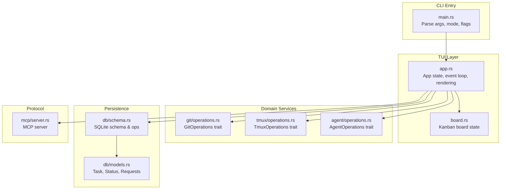
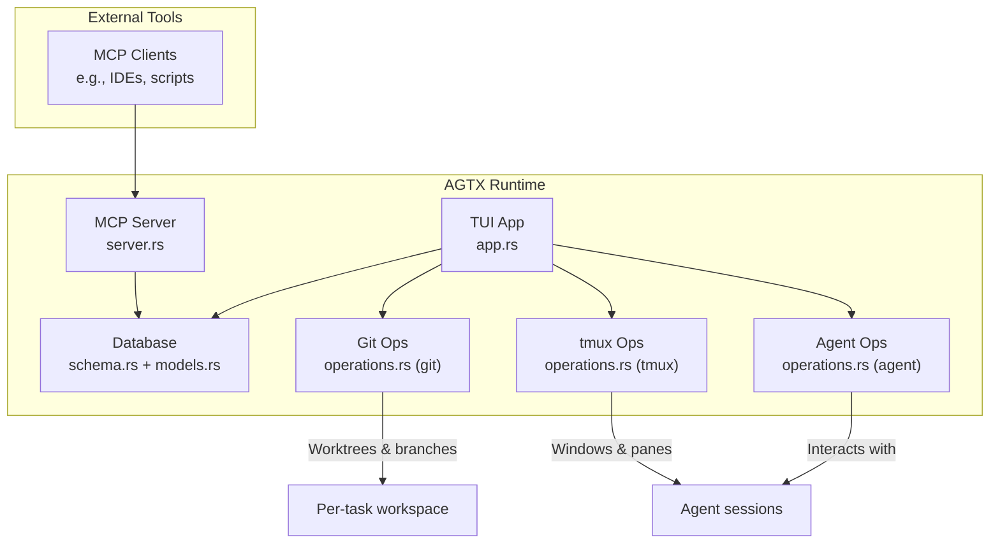
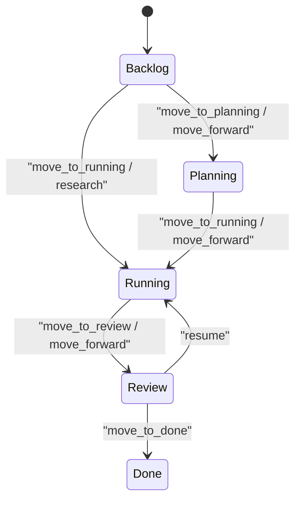
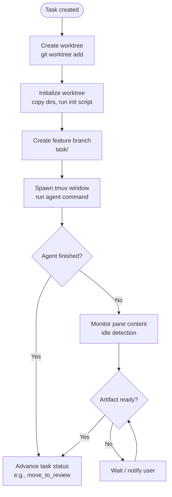
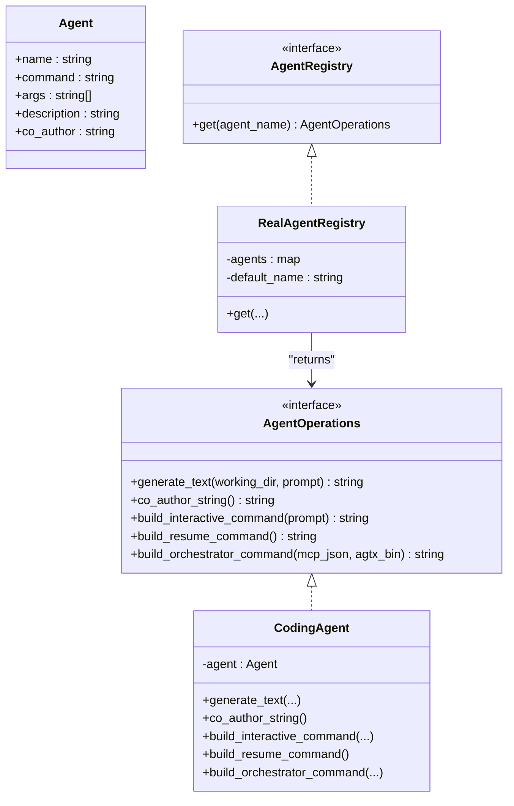
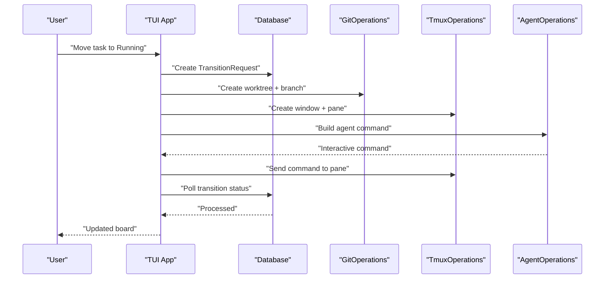
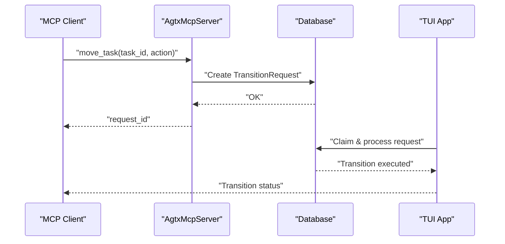
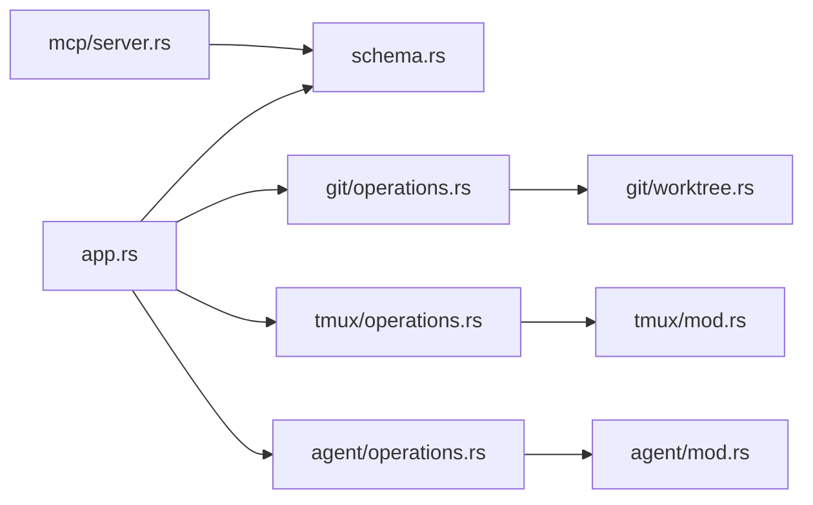

# Core Concepts

<cite>
**Referenced Files in This Document**
- [lib.rs](file://src/lib.rs)
- [main.rs](file://src/main.rs)
- [app.rs](file://src/tui/app.rs)
- [board.rs](file://src/tui/board.rs)
- [models.rs](file://src/db/models.rs)
- [schema.rs](file://src/db/schema.rs)
- [worktree.rs](file://src/git/worktree.rs)
- [operations.rs (git)](file://src/git/operations.rs)
- [mod.rs (git)](file://src/git/mod.rs)
- [mod.rs (tmux)](file://src/tmux/mod.rs)
- [operations.rs (tmux)](file://src/tmux/operations.rs)
- [mod.rs (agent)](file://src/agent/mod.rs)
- [operations.rs (agent)](file://src/agent/operations.rs)
- [mod.rs (mcp)](file://src/mcp/mod.rs)
- [server.rs](file://src/mcp/server.rs)
</cite>

## Table of Contents
1. [Introduction](#introduction)
2. [Project Structure](#project-structure)
3. [Core Components](#core-components)
4. [Architecture Overview](#architecture-overview)
5. [Detailed Component Analysis](#detailed-component-analysis)
6. [Dependency Analysis](#dependency-analysis)
7. [Performance Considerations](#performance-considerations)
8. [Troubleshooting Guide](#troubleshooting-guide)
9. [Conclusion](#conclusion)

## Introduction
This document explains the fundamental architecture and design principles underlying AGTX. It focuses on:
- The kanban board concept with five phases and how tasks move through Backlog → Planning → Running → Review → Done.
- The worktree concept and how it isolates agent sessions, including per-task git worktrees and tmux windows.
- The agent orchestration model that allows multiple AI agents to collaborate in parallel on the same task.
- The TUI architecture that coordinates database state, Git operations, tmux sessions, and agent communications.
- The Model Context Protocol (MCP) integration that enables external tool integration and orchestration.
- Practical examples showing how these concepts work together in real workflows.
- How components relate and interact to deliver a seamless agent management experience.

## Project Structure
AGTX is organized around a modular architecture with clear separation of concerns:
- TUI (Terminal User Interface) manages the kanban board, user input, and orchestrates state transitions.
- Database stores task state, transition requests, and notifications.
- Git integrates with worktrees and branches to isolate task workspaces.
- tmux manages isolated agent sessions and panes.
- Agent subsystems encapsulate interactions with external AI agents.
- MCP server exposes a protocol for external tools to drive AGTX programmatically.

**Diagram sources**
- [main.rs:16-96](file://src/main.rs#L16-L96)
- [app.rs:501-708](file://src/tui/app.rs#L501-L708)
- [board.rs:1-99](file://src/tui/board.rs#L1-L99)
- [schema.rs:97-180](file://src/db/schema.rs#L97-L180)
- [models.rs:5-56](file://src/db/models.rs#L5-L56)
- [operations.rs (git):1-75](file://src/git/operations.rs#L1-L75)
- [operations.rs (tmux):1-59](file://src/tmux/operations.rs#L1-L59)
- [operations.rs (agent):1-42](file://src/agent/operations.rs#L1-L42)
- [server.rs:395-519](file://src/mcp/server.rs#L395-L519)

**Section sources**
- [lib.rs:1-24](file://src/lib.rs#L1-L24)
- [main.rs:16-96](file://src/main.rs#L16-L96)
- [app.rs:501-708](file://src/tui/app.rs#L501-L708)
- [board.rs:1-99](file://src/tui/board.rs#L1-L99)
- [schema.rs:97-180](file://src/db/schema.rs#L97-L180)
- [models.rs:5-56](file://src/db/models.rs#L5-L56)
- [operations.rs (git):1-75](file://src/git/operations.rs#L1-L75)
- [operations.rs (tmux):1-59](file://src/tmux/operations.rs#L1-L59)
- [operations.rs (agent):1-42](file://src/agent/operations.rs#L1-L42)
- [server.rs:395-519](file://src/mcp/server.rs#L395-L519)

## Core Components
- Kanban board and task lifecycle: Tasks progress through five statuses with explicit transitions and gating rules.
- Worktree isolation: Each task gets a dedicated git worktree and branch, ensuring clean, isolated workspaces.
- tmux orchestration: Each task runs in its own tmux window/session, enabling parallel agent sessions.
- Agent registry: Pluggable agent support with per-agent commands and optional MCP orchestration.
- MCP server: A protocol endpoint for external tools to list tasks, queue transitions, and inspect state.
- Database: Centralized state for tasks, transition requests, and notifications.

**Section sources**
- [models.rs:5-56](file://src/db/models.rs#L5-L56)
- [models.rs:58-133](file://src/db/models.rs#L58-L133)
- [worktree.rs:1-345](file://src/git/worktree.rs#L1-L345)
- [mod.rs (tmux):11-189](file://src/tmux/mod.rs#L11-L189)
- [operations.rs (agent):110-163](file://src/agent/operations.rs#L110-L163)
- [server.rs:521-755](file://src/mcp/server.rs#L521-L755)
- [schema.rs:97-180](file://src/db/schema.rs#L97-L180)

## Architecture Overview
The AGTX architecture coordinates a TUI, database, Git, tmux, and agents. External tools can drive AGTX via MCP.

**Diagram sources**
- [app.rs:501-708](file://src/tui/app.rs#L501-L708)
- [schema.rs:97-180](file://src/db/schema.rs#L97-L180)
- [operations.rs (git):1-75](file://src/git/operations.rs#L1-L75)
- [operations.rs (tmux):1-59](file://src/tmux/operations.rs#L1-L59)
- [operations.rs (agent):110-163](file://src/agent/operations.rs#L110-L163)
- [server.rs:395-519](file://src/mcp/server.rs#L395-L519)

## Detailed Component Analysis

### Kanban Board and Task Lifecycle
- Five-phase workflow: Backlog → Planning → Running → Review → Done.
- Transitions are validated against status rules and dependency satisfaction.
- The board state tracks selected task and column, enabling keyboard navigation and actions.

**Diagram sources**
- [models.rs:5-56](file://src/db/models.rs#L5-L56)
- [board.rs:20-51](file://src/tui/board.rs#L20-L51)

**Section sources**
- [models.rs:5-56](file://src/db/models.rs#L5-L56)
- [board.rs:1-99](file://src/tui/board.rs#L1-L99)

### Worktree Isolation and tmux Sessions
- Each task gets a dedicated git worktree and branch under a controlled directory.
- Worktree initialization copies agent configuration directories and optional files/scripts.
- tmux windows are created per task with a safe session naming scheme; panes run agent commands.
- Recovery logic detects missing tmux windows and restores agent sessions.

**Diagram sources**
- [worktree.rs:8-65](file://src/git/worktree.rs#L8-L65)
- [worktree.rs:129-223](file://src/git/worktree.rs#L129-L223)
- [mod.rs (tmux):14-48](file://src/tmux/mod.rs#L14-L48)
- [operations.rs (tmux):64-110](file://src/tmux/operations.rs#L64-L110)
- [app.rs:654-687](file://src/tui/app.rs#L654-L687)

**Section sources**
- [worktree.rs:1-345](file://src/git/worktree.rs#L1-L345)
- [mod.rs (tmux):11-189](file://src/tmux/mod.rs#L11-L189)
- [operations.rs (tmux):1-59](file://src/tmux/operations.rs#L1-L59)
- [app.rs:654-687](file://src/tui/app.rs#L654-L687)

### Agent Orchestration Model
- Multiple agents can participate in a task’s lifecycle; the orchestrator coordinates transitions and notifications.
- Agents are pluggable; the registry resolves agent implementations and supports per-agent commands.
- Some agents can act as orchestrators by registering MCP endpoints during interactive runs.

**Diagram sources**
- [mod.rs (agent):10-77](file://src/agent/mod.rs#L10-L77)
- [operations.rs (agent):16-108](file://src/agent/operations.rs#L16-L108)
- [operations.rs (agent):110-163](file://src/agent/operations.rs#L110-L163)

**Section sources**
- [mod.rs (agent):10-77](file://src/agent/mod.rs#L10-L77)
- [operations.rs (agent):16-108](file://src/agent/operations.rs#L16-L108)
- [operations.rs (agent):110-163](file://src/agent/operations.rs#L110-L163)

### TUI Coordination and State Management
- The TUI maintains AppState, coordinating database queries, Git operations, tmux windows, and agent communications.
- It polls background tasks, handles user input, and drives state transitions.
- It recovers lost tmux windows and ensures orchestrator readiness.

**Diagram sources**
- [app.rs:501-708](file://src/tui/app.rs#L501-L708)
- [schema.rs:478-554](file://src/db/schema.rs#L478-L554)
- [operations.rs (git):80-91](file://src/git/operations.rs#L80-L91)
- [operations.rs (tmux):64-110](file://src/tmux/operations.rs#L64-L110)
- [operations.rs (agent):84-90](file://src/agent/operations.rs#L84-L90)

**Section sources**
- [app.rs:501-708](file://src/tui/app.rs#L501-L708)
- [schema.rs:478-554](file://src/db/schema.rs#L478-L554)
- [operations.rs (git):80-91](file://src/git/operations.rs#L80-L91)
- [operations.rs (tmux):64-110](file://src/tmux/operations.rs#L64-L110)
- [operations.rs (agent):84-90](file://src/agent/operations.rs#L84-L90)

### MCP Integration and External Tooling
- MCP server exposes tools to list projects/tasks, queue transitions, check conflicts, and read/send pane content.
- Transition requests are persisted and processed by the TUI, enabling asynchronous orchestration.
- Notifications can be consumed by the orchestrator agent via MCP.

**Diagram sources**
- [server.rs:521-755](file://src/mcp/server.rs#L521-L755)
- [schema.rs:478-554](file://src/db/schema.rs#L478-L554)
- [app.rs:501-708](file://src/tui/app.rs#L501-L708)

**Section sources**
- [mod.rs (mcp):1-5](file://src/mcp/mod.rs#L1-L5)
- [server.rs:521-755](file://src/mcp/server.rs#L521-L755)
- [schema.rs:478-554](file://src/db/schema.rs#L478-L554)

## Dependency Analysis
- Loose coupling via traits: GitOperations, TmuxOperations, AgentOperations allow swapping implementations and testing.
- Centralized state via Database with explicit migrations and indexes.
- Explicit dependency chains: TUI depends on traits, which depend on OS tooling (git, tmux).
- MCP decouples external clients from internal state machines.

**Diagram sources**
- [app.rs:501-708](file://src/tui/app.rs#L501-L708)
- [schema.rs:97-180](file://src/db/schema.rs#L97-L180)
- [operations.rs (git):1-75](file://src/git/operations.rs#L1-L75)
- [operations.rs (tmux):1-59](file://src/tmux/operations.rs#L1-L59)
- [operations.rs (agent):110-163](file://src/agent/operations.rs#L110-L163)
- [server.rs:395-519](file://src/mcp/server.rs#L395-L519)

**Section sources**
- [app.rs:501-708](file://src/tui/app.rs#L501-L708)
- [schema.rs:97-180](file://src/db/schema.rs#L97-L180)
- [operations.rs (git):1-75](file://src/git/operations.rs#L1-L75)
- [operations.rs (tmux):1-59](file://src/tmux/operations.rs#L1-L59)
- [operations.rs (agent):110-163](file://src/agent/operations.rs#L110-L163)
- [server.rs:395-519](file://src/mcp/server.rs#L395-L519)

## Performance Considerations
- Background refresh threads poll tmux pane content and phase status to avoid blocking the UI.
- Caching of phase status and content hashes reduces repeated expensive checks.
- Database operations are batched where appropriate (e.g., transaction for bulk inserts).
- Worktree initialization avoids fatal failures by collecting warnings and continuing.

[No sources needed since this section provides general guidance]

## Troubleshooting Guide
- Missing tmux server: Ensure the AGENT_SERVER constant session name is used when invoking tmux commands.
- Worktree creation failures: Confirm base branch resolution and that the worktree directory exists and is writable.
- Transition stuck: Check the transition request queue and whether it was claimed or processed.
- Agent not responding: Verify tmux window exists and pane command; use orchestrator readiness flag to gate notifications.

**Section sources**
- [mod.rs (tmux):11-189](file://src/tmux/mod.rs#L11-L189)
- [worktree.rs:67-84](file://src/git/worktree.rs#L67-L84)
- [schema.rs:511-554](file://src/db/schema.rs#L511-L554)
- [app.rs:689-705](file://src/tui/app.rs#L689-L705)

## Conclusion
AGTX combines a kanban-driven workflow with strong isolation (worktrees and tmux), flexible agent orchestration, and a protocol for external tooling (MCP). The TUI coordinates database state, Git, tmux, and agents to provide a seamless developer experience. Understanding these core concepts helps you configure workflows, integrate external tools, and troubleshoot issues effectively.