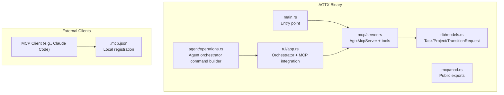
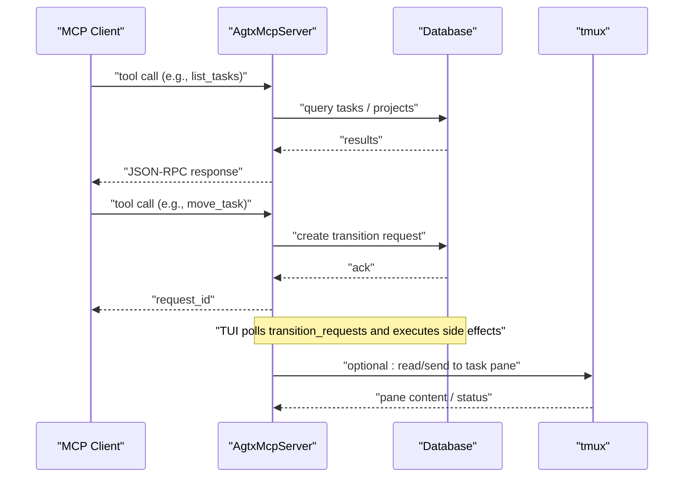
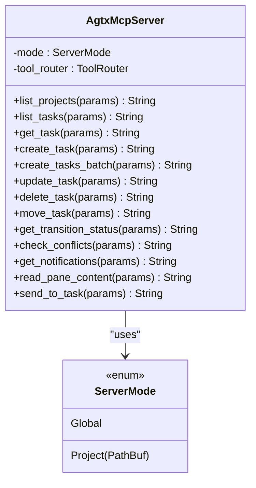
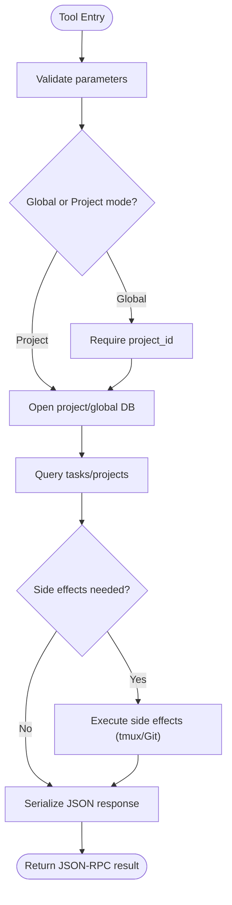
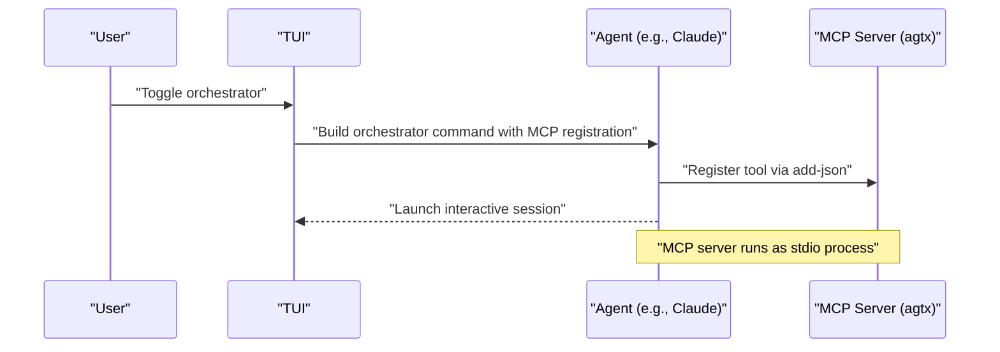
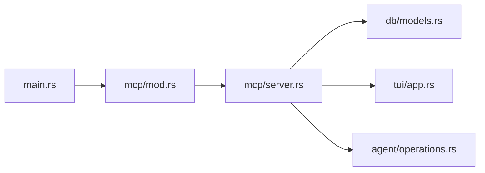

# MCP Integration

<cite>
**Referenced Files in This Document**
- [README.md](file://README.md)
- [.mcp.json](file://.mcp.json)
- [src/mcp/mod.rs](file://src/mcp/mod.rs)
- [src/mcp/server.rs](file://src/mcp/server.rs)
- [src/main.rs](file://src/main.rs)
- [src/agent/operations.rs](file://src/agent/operations.rs)
- [src/tui/app.rs](file://src/tui/app.rs)
- [src/db/models.rs](file://src/db/models.rs)
- [tests/mcp_tests.rs](file://tests/mcp_tests.rs)
</cite>

## Table of Contents
1. [Introduction](#introduction)
2. [Project Structure](#project-structure)
3. [Core Components](#core-components)
4. [Architecture Overview](#architecture-overview)
5. [Detailed Component Analysis](#detailed-component-analysis)
6. [Dependency Analysis](#dependency-analysis)
7. [Performance Considerations](#performance-considerations)
8. [Troubleshooting Guide](#troubleshooting-guide)
9. [Conclusion](#conclusion)
10. [Appendices](#appendices)

## Introduction
This document explains the Model Context Protocol (MCP) integration in AGTX. It covers the MCP fundamentals, the AGTX MCP server implementation, client-side integration, protocol messages, error handling, common use cases, security considerations, performance tips, and troubleshooting guidance. The goal is to help developers and operators configure, deploy, and operate AGTX’s MCP server to enable external tools and agents to automate tasks, integrate third-party services, and orchestrate workflows through JSON-RPC over stdio.

## Project Structure
AGTX exposes an MCP server that runs as a standalone process and communicates with clients via stdio. The server is implemented in Rust and integrates with AGTX’s task lifecycle, database, and tmux orchestration.

**Diagram sources**
- [src/main.rs:30-46](file://src/main.rs#L30-L46)
- [src/mcp/mod.rs:1-5](file://src/mcp/mod.rs#L1-L5)
- [src/mcp/server.rs:1245-1263](file://src/mcp/server.rs#L1245-L1263)
- [src/db/models.rs:58-184](file://src/db/models.rs#L58-L184)
- [src/tui/app.rs:5972-6000](file://src/tui/app.rs#L5972-L6000)
- [src/agent/operations.rs:92-107](file://src/agent/operations.rs#L92-L107)

**Section sources**
- [src/main.rs:30-46](file://src/main.rs#L30-L46)
- [src/mcp/mod.rs:1-5](file://src/mcp/mod.rs#L1-L5)
- [src/mcp/server.rs:1245-1263](file://src/mcp/server.rs#L1245-L1263)
- [src/db/models.rs:58-184](file://src/db/models.rs#L58-L184)
- [src/tui/app.rs:5972-6000](file://src/tui/app.rs#L5972-L6000)
- [src/agent/operations.rs:92-107](file://src/agent/operations.rs#L92-L107)

## Core Components
- MCP Server entrypoint and mode selection
  - The binary supports a dedicated mode to start the MCP server, validating the project path and delegating to the MCP serve function.
- AgtxMcpServer
  - Implements the MCP server with a tool router exposing task/project management and operational tools.
  - Supports two modes:
    - Project mode: binds to a single project directory.
    - Global mode: serves all projects indexed in the global database and requires project_id for CRUD tools.
- Tools
  - Project discovery: list_projects
  - Task lifecycle: list_tasks, get_task, create_task, create_tasks_batch, update_task, delete_task
  - Transitions: move_task, get_transition_status
  - Observability: check_conflicts, get_notifications, read_pane_content, send_to_task
- TUI and Agent Orchestration
  - The TUI spawns an orchestrator agent window and registers the MCP server locally.
  - Agents supporting MCP can register and interact with the AGTX server.

**Section sources**
- [src/main.rs:30-46](file://src/main.rs#L30-L46)
- [src/mcp/server.rs:16-24](file://src/mcp/server.rs#L16-L24)
- [src/mcp/server.rs:521-1216](file://src/mcp/server.rs#L521-L1216)
- [src/tui/app.rs:5972-6000](file://src/tui/app.rs#L5972-L6000)
- [src/agent/operations.rs:92-107](file://src/agent/operations.rs#L92-L107)

## Architecture Overview
The MCP server is a thin JSON-RPC over stdio bridge between external clients and AGTX’s internal systems. Clients call tools exposed by the server, which validates parameters, queries the database, and performs side effects (e.g., tmux commands, Git operations). The TUI coordinates transition requests and orchestrates agent sessions.

**Diagram sources**
- [src/mcp/server.rs:548-588](file://src/mcp/server.rs#L548-L588)
- [src/mcp/server.rs:658-721](file://src/mcp/server.rs#L658-L721)
- [src/tui/app.rs:5649-5680](file://src/tui/app.rs#L5649-L5680)

## Detailed Component Analysis

### MCP Server Implementation
- Mode selection
  - Project mode: Validates a git project directory and opens the project database.
  - Global mode: Validates the global database and requires project_id for tools that operate on tasks.
- Tool routing
  - Tools are declared with #[tool(...)] and mapped via #[tool_router].
  - Each tool validates parameters, resolves project context, accesses the database, and returns JSON-serialized results.
- Capabilities and metadata
  - The server advertises tool capabilities and provides contextual instructions depending on mode.

**Diagram sources**
- [src/mcp/server.rs:16-24](file://src/mcp/server.rs#L16-L24)
- [src/mcp/server.rs:395-407](file://src/mcp/server.rs#L395-L407)
- [src/mcp/server.rs:521-1216](file://src/mcp/server.rs#L521-L1216)

**Section sources**
- [src/mcp/server.rs:16-24](file://src/mcp/server.rs#L16-L24)
- [src/mcp/server.rs:395-407](file://src/mcp/server.rs#L395-L407)
- [src/mcp/server.rs:521-1216](file://src/mcp/server.rs#L521-L1216)

### Task Lifecycle Tools
- list_projects: Lists all projects indexed in the global database.
- list_tasks / get_task: Retrieve tasks with filtering by status and detailed info including allowed_actions computed from plugin rules and dependency satisfaction.
- create_task / create_tasks_batch: Create tasks with optional dependencies and base branch; batch tool enforces index-based dependency rules and atomic insertion.
- update_task / delete_task: Modify or remove backlog tasks with guards against invalid statuses.
- move_task / get_transition_status: Queue state transitions and poll completion; TUI executes side effects (worktree creation, agent spawning, tmux commands).

**Diagram sources**
- [src/mcp/server.rs:548-588](file://src/mcp/server.rs#L548-L588)
- [src/mcp/server.rs:658-721](file://src/mcp/server.rs#L658-L721)
- [src/mcp/server.rs:1023-1106](file://src/mcp/server.rs#L1023-L1106)

**Section sources**
- [src/mcp/server.rs:523-588](file://src/mcp/server.rs#L523-L588)
- [src/mcp/server.rs:590-653](file://src/mcp/server.rs#L590-L653)
- [src/mcp/server.rs:655-755](file://src/mcp/server.rs#L655-L755)
- [src/mcp/server.rs:757-832](file://src/mcp/server.rs#L757-L832)
- [src/mcp/server.rs:834-858](file://src/mcp/server.rs#L834-L858)
- [src/mcp/server.rs:860-910](file://src/mcp/server.rs#L860-L910)
- [src/mcp/server.rs:912-974](file://src/mcp/server.rs#L912-L974)
- [src/mcp/server.rs:976-1018](file://src/mcp/server.rs#L976-L1018)
- [src/mcp/server.rs:1020-1106](file://src/mcp/server.rs#L1020-L1106)
- [src/mcp/server.rs:1108-1215](file://src/mcp/server.rs#L1108-L1215)

### Client-Side Integration
- Local registration
  - A local .mcp.json file defines the AGTX MCP server as an stdio tool named “agtx”.
- Agent orchestration
  - The TUI builds an orchestrator command that registers the AGTX MCP server with the agent (e.g., Claude) and launches the agent interactively.
  - The orchestrator command includes cleanup steps to remove stale registrations before adding the new one.

**Diagram sources**
- [src/tui/app.rs:5972-6000](file://src/tui/app.rs#L5972-L6000)
- [src/agent/operations.rs:92-107](file://src/agent/operations.rs#L92-L107)
- [.mcp.json:1-8](file://.mcp.json#L1-L8)

**Section sources**
- [.mcp.json:1-8](file://.mcp.json#L1-L8)
- [src/tui/app.rs:5972-6000](file://src/tui/app.rs#L5972-L6000)
- [src/agent/operations.rs:92-107](file://src/agent/operations.rs#L92-L107)

### Protocol Specification and Message Formats
- Transport
  - JSON-RPC over stdio. The server uses the stdio transport abstraction.
- Server capabilities
  - Tools are enabled; the server advertises capabilities accordingly.
- Tool invocation
  - Clients call tools by name with JSON parameters. The server validates parameters and returns JSON responses.
- Error handling
  - Validation errors are returned as formatted strings.
  - Database and IO errors are captured and returned as error messages.
  - Transition requests are persisted and can be polled for completion; errors are recorded in the transition record.

**Section sources**
- [src/mcp/server.rs:1218-1242](file://src/mcp/server.rs#L1218-L1242)
- [src/mcp/server.rs:548-588](file://src/mcp/server.rs#L548-L588)
- [src/mcp/server.rs:658-721](file://src/mcp/server.rs#L658-L721)

### Common MCP Use Cases
- External tool automation
  - Automate task creation, updates, and transitions from CI/CD pipelines or IDE integrations.
- Custom skill deployment
  - Expose AGTX-specific skills (e.g., merge conflict resolution) as MCP tools for agents to invoke.
- Third-party service integration
  - Bridge external services (e.g., GitHub PRs, diffs) into AGTX workflows via tools that query and mutate task state.

[No sources needed since this section provides general guidance]

### Practical Examples
- MCP server configuration
  - Local registration: see .mcp.json for an example stdio tool definition.
  - Global vs project mode: choose project mode when targeting a single repository; choose global mode when managing multiple repositories.
- Client implementation
  - Use an agent that supports MCP (e.g., Claude) to register and call AGTX tools.
  - The TUI demonstrates building an orchestrator command that registers the MCP server and launches the agent.
- Integration patterns
  - Use list_projects to discover project IDs, then call tools with project_id.
  - Queue transitions with move_task and poll get_transition_status until completion.

**Section sources**
- [.mcp.json:1-8](file://.mcp.json#L1-L8)
- [src/mcp/server.rs:1245-1263](file://src/mcp/server.rs#L1245-L1263)
- [src/tui/app.rs:5972-6000](file://src/tui/app.rs#L5972-L6000)

### Security Considerations
- Transport isolation
  - The stdio transport runs within the user’s environment; ensure only trusted clients access the AGTX process.
- Authentication
  - No built-in authentication is enforced by the MCP server; rely on local process isolation and agent scopes.
- Permissions
  - The server may execute tmux and Git operations; restrict access to the AGTX binary and tmux server appropriately.
- Cleanup
  - The orchestrator command removes stale MCP registrations before adding new ones to avoid conflicts.

**Section sources**
- [src/agent/operations.rs:92-107](file://src/agent/operations.rs#L92-L107)

### Performance Optimization
- Minimize repeated queries
  - Use list_projects once and cache project IDs; reuse them across tool calls.
- Batch operations
  - Prefer create_tasks_batch for related tasks to reduce overhead and enforce dependencies atomically.
- Transition polling
  - Poll get_transition_status periodically and avoid frequent synchronous waits.
- Pane reads
  - Limit lines requested from tmux panes to reduce IO overhead.

**Section sources**
- [src/mcp/server.rs:1020-1106](file://src/mcp/server.rs#L1020-L1106)
- [src/mcp/server.rs:860-910](file://src/mcp/server.rs#L860-L910)

## Dependency Analysis
- Binary entrypoint
  - main.rs detects the “mcp-serve” mode and invokes the MCP serve function with optional project path.
- MCP module
  - mcp/mod.rs re-exports serve and ServerMode for public consumption.
- Server internals
  - server.rs depends on:
    - rmcp transport and tool router
    - AGTX config and database abstractions
    - tmux and Git operations for side effects
- TUI and agent orchestration
  - tui/app.rs constructs the MCP registration payload and orchestrator command.
  - agent/operations.rs builds agent-specific commands for MCP registration.

**Diagram sources**
- [src/main.rs:30-46](file://src/main.rs#L30-L46)
- [src/mcp/mod.rs:1-5](file://src/mcp/mod.rs#L1-L5)
- [src/mcp/server.rs:1245-1263](file://src/mcp/server.rs#L1245-L1263)
- [src/db/models.rs:58-184](file://src/db/models.rs#L58-L184)
- [src/tui/app.rs:5972-6000](file://src/tui/app.rs#L5972-L6000)
- [src/agent/operations.rs:92-107](file://src/agent/operations.rs#L92-L107)

**Section sources**
- [src/main.rs:30-46](file://src/main.rs#L30-L46)
- [src/mcp/mod.rs:1-5](file://src/mcp/mod.rs#L1-L5)
- [src/mcp/server.rs:1245-1263](file://src/mcp/server.rs#L1245-L1263)
- [src/db/models.rs:58-184](file://src/db/models.rs#L58-L184)
- [src/tui/app.rs:5972-6000](file://src/tui/app.rs#L5972-L6000)
- [src/agent/operations.rs:92-107](file://src/agent/operations.rs#L92-L107)

## Performance Considerations
- Database access
  - Batch operations (create_tasks_batch) reduce transaction overhead and ensure consistency.
- Side effects
  - tmux and Git operations can be expensive; limit frequency and scope of reads/writes.
- Transition scheduling
  - The TUI polls transition requests; tune polling intervals to balance responsiveness and load.

[No sources needed since this section provides general guidance]

## Troubleshooting Guide
- MCP server fails to start
  - Ensure the path is a git repository when using project mode.
  - Verify the project/global database can be opened.
- Tools requiring project_id fail
  - In global mode, call list_projects first to obtain project IDs, then pass project_id to tools.
- Transition not completing
  - Use get_transition_status to check if the request is pending, completed, or errored.
  - Inspect the transition record for error details.
- Conflicts and pane reads
  - Use check_conflicts to verify merge conflicts; use read_pane_content to inspect agent output.
- Agent registration issues
  - The orchestrator command removes stale registrations before adding new ones; ensure the agent supports MCP and the local scope is correct.

**Section sources**
- [src/main.rs:36-44](file://src/main.rs#L36-L44)
- [src/mcp/server.rs:413-429](file://src/mcp/server.rs#L413-L429)
- [src/mcp/server.rs:726-755](file://src/mcp/server.rs#L726-L755)
- [src/mcp/server.rs:800-832](file://src/mcp/server.rs#L800-L832)
- [src/mcp/server.rs:860-910](file://src/mcp/server.rs#L860-L910)
- [src/agent/operations.rs:92-107](file://src/agent/operations.rs#L92-L107)

## Conclusion
AGTX’s MCP integration provides a robust, extensible bridge between external tools and the AGTX task lifecycle. By leveraging JSON-RPC over stdio, AGTX exposes powerful tools for project and task management, transition orchestration, and observability. With proper configuration, security hardening, and performance tuning, teams can automate workflows, integrate third-party services, and deploy custom skills through a standardized protocol.

[No sources needed since this section summarizes without analyzing specific files]

## Appendices

### Appendix A: Example MCP Tool Calls
- Discover projects: list_projects
- List tasks in a project: list_tasks with optional status filter
- Get task details: get_task including allowed_actions and blocking dependencies
- Create a task: create_task with optional plugin and referenced_tasks
- Create tasks in batch: create_tasks_batch with index-based dependencies
- Update a backlog task: update_task with optional fields
- Delete a backlog task: delete_task
- Move a task: move_task with action and optional reason
- Check transition status: get_transition_status
- Check conflicts: check_conflicts for a task or all Review tasks
- Get notifications: get_notifications
- Read pane content: read_pane_content
- Send to task: send_to_task

**Section sources**
- [src/mcp/server.rs:523-588](file://src/mcp/server.rs#L523-L588)
- [src/mcp/server.rs:590-653](file://src/mcp/server.rs#L590-L653)
- [src/mcp/server.rs:655-755](file://src/mcp/server.rs#L655-L755)
- [src/mcp/server.rs:757-832](file://src/mcp/server.rs#L757-L832)
- [src/mcp/server.rs:834-858](file://src/mcp/server.rs#L834-L858)
- [src/mcp/server.rs:860-910](file://src/mcp/server.rs#L860-L910)
- [src/mcp/server.rs:912-974](file://src/mcp/server.rs#L912-L974)
- [src/mcp/server.rs:976-1018](file://src/mcp/server.rs#L976-L1018)
- [src/mcp/server.rs:1020-1106](file://src/mcp/server.rs#L1020-L1106)
- [src/mcp/server.rs:1108-1215](file://src/mcp/server.rs#L1108-L1215)

### Appendix B: Task Status and Allowed Actions
- TaskStatus enum and transitions
- Allowed actions computed per task status and plugin rules
- Dependency gating for forward transitions from Backlog

**Section sources**
- [src/db/models.rs:58-56](file://src/db/models.rs#L58-L56)
- [src/mcp/server.rs:474-518](file://src/mcp/server.rs#L474-L518)

### Appendix C: Test Coverage Highlights
- Transition request lifecycle and cleanup
- Task CRUD operations and dependency handling
- Notification consumption and peek semantics
- Batch creation rollback behavior

**Section sources**
- [tests/mcp_tests.rs:5-150](file://tests/mcp_tests.rs#L5-L150)
- [tests/mcp_tests.rs:152-356](file://tests/mcp_tests.rs#L152-L356)
- [tests/mcp_tests.rs:357-472](file://tests/mcp_tests.rs#L357-L472)