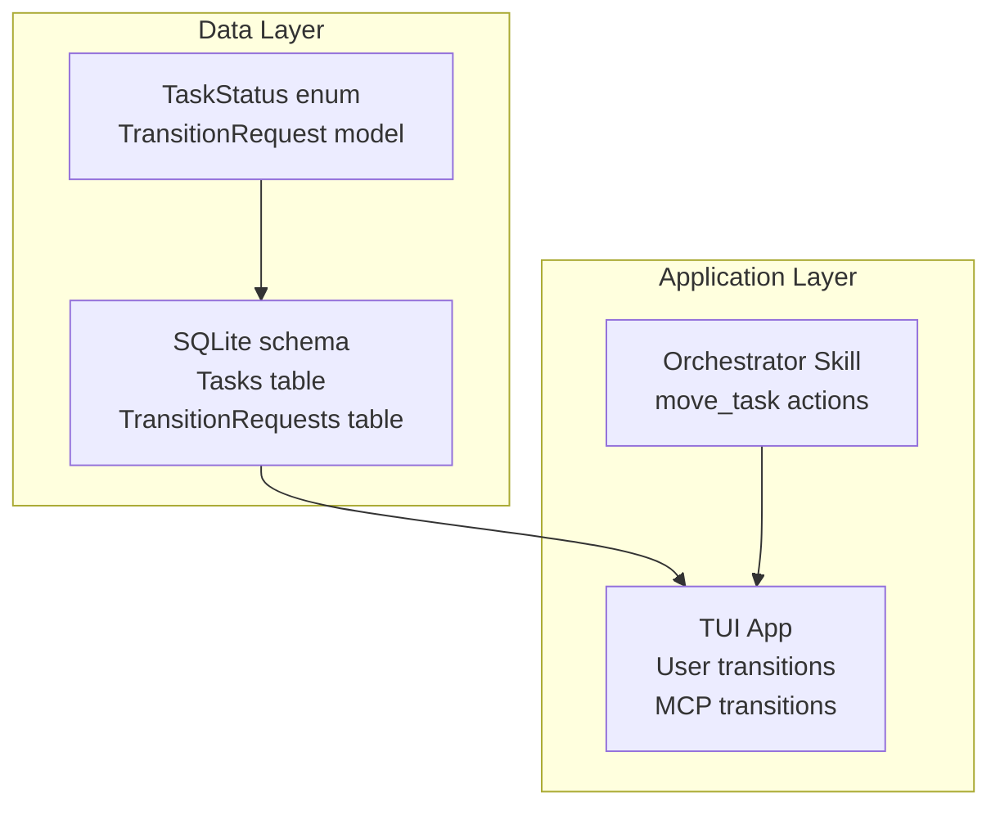
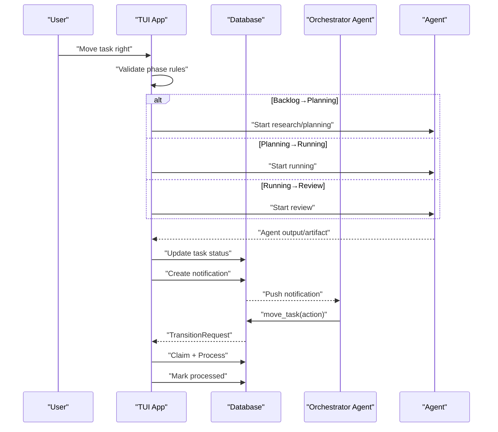
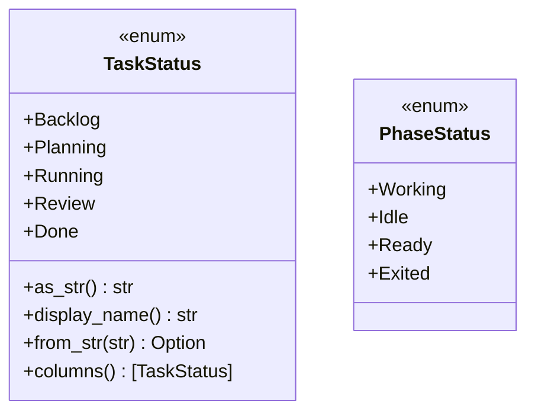
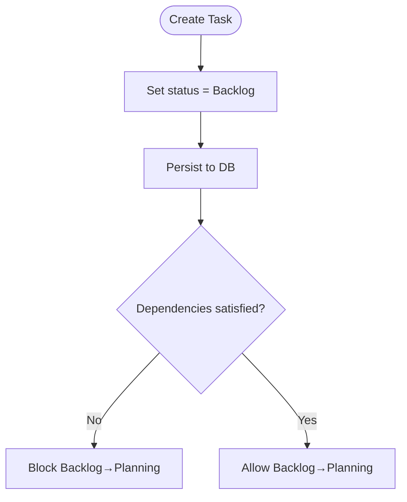
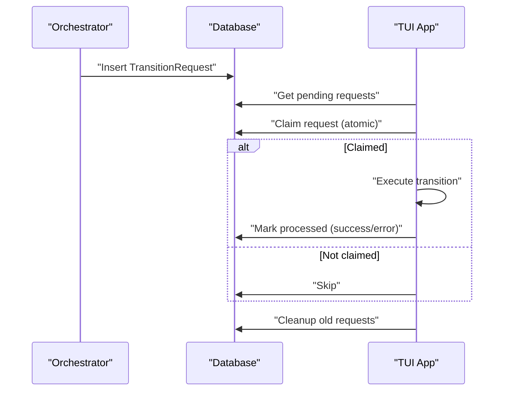
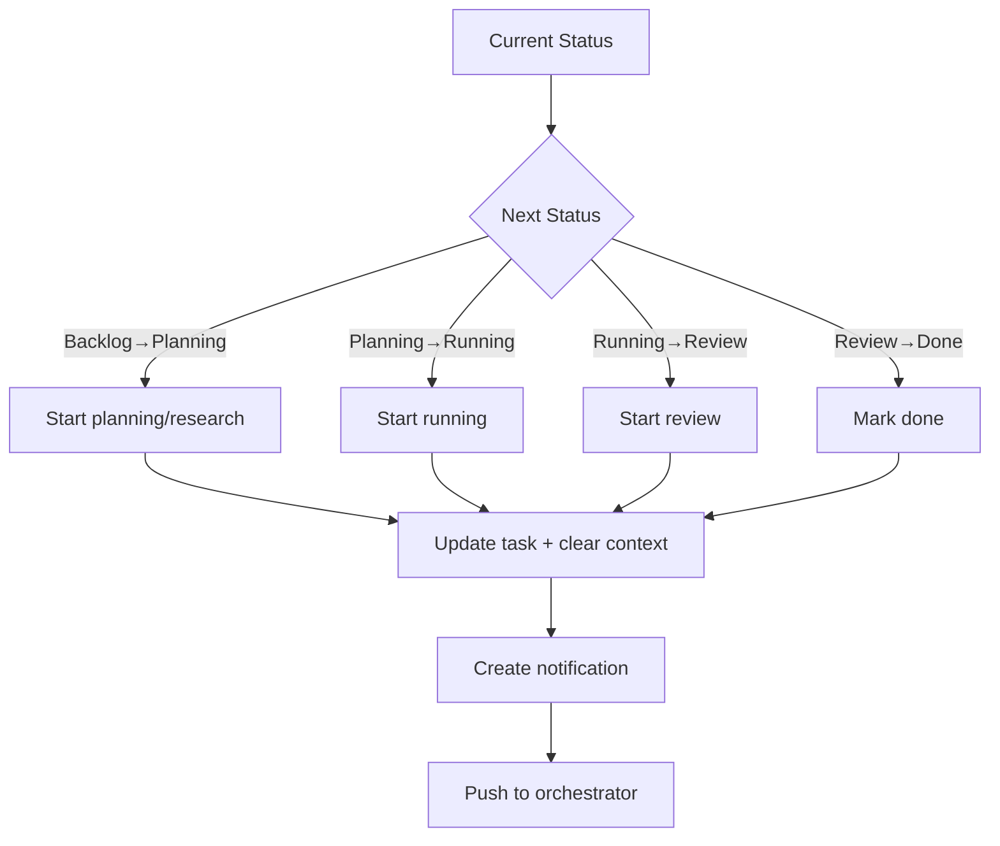
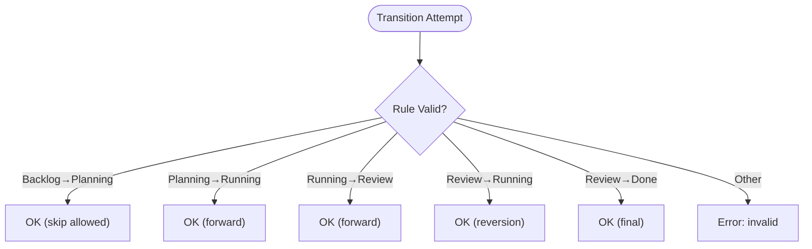
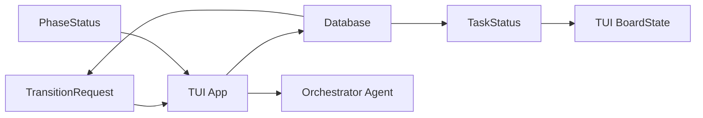

# Task Lifecycle and Phases

<cite>
**Referenced Files in This Document**
- [models.rs](file://src/db/models.rs)
- [schema.rs](file://src/db/schema.rs)
- [app.rs](file://src/tui/app.rs)
- [board.rs](file://src/tui/board.rs)
- [orchestrate.md](file://plugins/agtx/skills/orchestrate.md)
- [db_tests.rs](file://tests/db_tests.rs)
- [mcp_tests.rs](file://tests/mcp_tests.rs)
</cite>

## Table of Contents
1. [Introduction](#introduction)
2. [Project Structure](#project-structure)
3. [Core Components](#core-components)
4. [Architecture Overview](#architecture-overview)
5. [Detailed Component Analysis](#detailed-component-analysis)
6. [Dependency Analysis](#dependency-analysis)
7. [Performance Considerations](#performance-considerations)
8. [Troubleshooting Guide](#troubleshooting-guide)
9. [Conclusion](#conclusion)

## Introduction
This document explains the five-phase kanban board task lifecycle: Backlog, Planning, Running, Review, and Done. It covers how tasks transition between phases using the TransitionRequest mechanism, how the database tracks state changes, the TaskStatus and PhaseStatus enums, task creation defaults and validation, lifecycle events that trigger UI updates and downstream operations, practical examples of typical task progression, and edge cases such as reversion, phase skipping, and concurrent modifications.

## Project Structure
The task lifecycle spans several modules:
- Data model definitions and enums
- Database schema and operations
- TUI application logic for user-driven transitions and MCP-driven transitions
- Orchestrator skill documentation describing lifecycle expectations
- Tests validating transition claims, cleanup, and pending requests

**Diagram sources**
- [models.rs:5-56](file://src/db/models.rs#L5-L56)
- [schema.rs:97-180](file://src/db/schema.rs#L97-L180)
- [app.rs:5345-5502](file://src/tui/app.rs#L5345-L5502)
- [orchestrate.md:43-55](file://plugins/agtx/skills/orchestrate.md#L43-L55)

**Section sources**
- [models.rs:5-56](file://src/db/models.rs#L5-L56)
- [schema.rs:97-180](file://src/db/schema.rs#L97-L180)
- [app.rs:5345-5502](file://src/tui/app.rs#L5345-L5502)
- [orchestrate.md:43-55](file://plugins/agtx/skills/orchestrate.md#L43-L55)

## Core Components
- TaskStatus: Enumerates the five board phases with string conversion and display helpers.
- Task: Persistent entity with default status set to Backlog upon creation.
- TransitionRequest: Queued state change requests executed by the TUI with full side effects.
- PhaseStatus: Runtime-only status indicating agent activity and readiness for advancement.
- Database: Stores tasks and transition requests, enforces constraints, and supports lifecycle queries.

Key behaviors:
- Task creation sets status to Backlog and timestamps.
- Forward transitions follow Backlog → Planning → Running → Review → Done.
- Backlog-to-Planning is blocked until dependencies are in Review/Done.
- Planning-to-Running and Running-to-Review require artifacts; completion triggers notifications.
- MCP-driven transitions are queued and executed atomically with claim-and-process semantics.

**Section sources**
- [models.rs:5-56](file://src/db/models.rs#L5-L56)
- [models.rs:58-133](file://src/db/models.rs#L58-L133)
- [models.rs:159-184](file://src/db/models.rs#L159-L184)
- [models.rs:233-245](file://src/db/models.rs#L233-L245)
- [schema.rs:212-351](file://src/db/schema.rs#L212-L351)
- [schema.rs:499-554](file://src/db/schema.rs#L499-L554)

## Architecture Overview
The lifecycle integrates user actions, orchestrator automation, and database persistence:

**Diagram sources**
- [app.rs:4276-4334](file://src/tui/app.rs#L4276-L4334)
- [app.rs:5389-5502](file://src/tui/app.rs#L5389-L5502)
- [schema.rs:511-554](file://src/db/schema.rs#L511-L554)
- [orchestrate.md:30-41](file://plugins/agtx/skills/orchestrate.md#L30-L41)

## Detailed Component Analysis

### TaskStatus and PhaseStatus
- TaskStatus defines the five board phases with string conversions and display names. Columns are ordered for the kanban board.
- PhaseStatus is runtime-only and indicates agent activity: Working, Idle, Ready, Exited. Ready triggers advancement; Idle triggers user notifications.

**Diagram sources**
- [models.rs:5-56](file://src/db/models.rs#L5-L56)
- [models.rs:233-245](file://src/db/models.rs#L233-L245)

**Section sources**
- [models.rs:5-56](file://src/db/models.rs#L5-L56)
- [models.rs:233-245](file://src/db/models.rs#L233-L245)

### Task Creation and Initial Validation
- Tasks are created with default status Backlog and current timestamps.
- Backlog-to-Planning is blocked if dependencies (referenced_tasks) are not satisfied (must be Review or Done).
- Planning-to-Running may require prior research/planning artifacts depending on plugin acceptance rules.

**Diagram sources**
- [models.rs:81-109](file://src/db/models.rs#L81-L109)
- [schema.rs:212-240](file://src/db/schema.rs#L212-L240)
- [schema.rs:387-400](file://src/db/schema.rs#L387-L400)
- [app.rs:4284-4293](file://src/tui/app.rs#L4284-L4293)

**Section sources**
- [models.rs:81-109](file://src/db/models.rs#L81-L109)
- [schema.rs:212-240](file://src/db/schema.rs#L212-L240)
- [schema.rs:387-400](file://src/db/schema.rs#L387-L400)
- [app.rs:4284-4293](file://src/tui/app.rs#L4284-L4293)

### TransitionRequest Mechanism and Database Tracking
- TransitionRequest records desired state changes with action, reason, timestamps, and optional error.
- Pending requests are polled and atomically claimed by a single instance using a read-modify-write pattern.
- After execution, the request is marked processed with success or error.
- Cleanup removes stale or old processed requests.

**Diagram sources**
- [models.rs:159-184](file://src/db/models.rs#L159-L184)
- [schema.rs:511-554](file://src/db/schema.rs#L511-L554)
- [app.rs:5345-5387](file://src/tui/app.rs#L5345-L5387)
- [mcp_tests.rs:43-77](file://tests/mcp_tests.rs#L43-L77)
- [db_tests.rs:312-337](file://tests/db_tests.rs#L312-L337)

**Section sources**
- [models.rs:159-184](file://src/db/models.rs#L159-L184)
- [schema.rs:511-554](file://src/db/schema.rs#L511-L554)
- [app.rs:5345-5387](file://src/tui/app.rs#L5345-L5387)
- [mcp_tests.rs:43-77](file://tests/mcp_tests.rs#L43-L77)
- [db_tests.rs:312-337](file://tests/db_tests.rs#L312-L337)

### Forward Transitions and UI Updates
- Forward movement follows Backlog → Planning → Running → Review → Done.
- The TUI validates preconditions (dependencies, artifacts, plugin acceptance) and updates the board state.
- Notifications are created when a phase completes, pushing updates to the orchestrator agent.

**Diagram sources**
- [app.rs:4276-4334](file://src/tui/app.rs#L4276-L4334)
- [app.rs:6242-6271](file://src/tui/app.rs#L6242-L6271)
- [orchestrate.md:30-41](file://plugins/agtx/skills/orchestrate.md#L30-L41)

**Section sources**
- [app.rs:4276-4334](file://src/tui/app.rs#L4276-L4334)
- [app.rs:6242-6271](file://src/tui/app.rs#L6242-L6271)
- [orchestrate.md:30-41](file://plugins/agtx/skills/orchestrate.md#L30-L41)

### Reversion, Phase Skipping, and Concurrent Modifications
- Allowed reversion: Review → Running (manual resume) and Backlog → Planning (direct move).
- Phase skipping is disallowed; transitions must follow the canonical order.
- Concurrent modifications are prevented by atomic claim-and-process semantics on TransitionRequest and by UI checks for phase completeness.

**Diagram sources**
- [app.rs:5296-5341](file://src/tui/app.rs#L5296-L5341)
- [app.rs:5412-5499](file://src/tui/app.rs#L5412-L5499)
- [schema.rs:534-543](file://src/db/schema.rs#L534-L543)

**Section sources**
- [app.rs:5296-5341](file://src/tui/app.rs#L5296-L5341)
- [app.rs:5412-5499](file://src/tui/app.rs#L5412-L5499)
- [schema.rs:534-543](file://src/db/schema.rs#L534-L543)

### Practical Examples: Typical Task Progression
- Example A: Research then planning → running → review → done
  - Start in Backlog; ensure dependencies are satisfied; move to Planning; start research if needed; move to Running; start review; move to Done.
- Example B: Directly to running
  - If plugin accepts the task in Running without prior research, move from Backlog to Running directly (subject to artifact availability).
- Example C: Resume after review
  - Move Review → Running to continue work, then proceed to Review again.

These behaviors are enforced by validation rules and UI/agent transitions.

**Section sources**
- [app.rs:4375-4403](file://src/tui/app.rs#L4375-L4403)
- [app.rs:5161-5208](file://src/tui/app.rs#L5161-L5208)
- [orchestrate.md:43-55](file://plugins/agtx/skills/orchestrate.md#L43-L55)

### Task State Queries and Phase Transitions (Code Paths)
- Task creation and updates: [create_task:212-240](file://src/db/schema.rs#L212-L240), [update_task:276-317](file://src/db/schema.rs#L276-L317)
- Task retrieval and filtering: [get_task:353-359](file://src/db/schema.rs#L353-L359), [get_tasks_by_status:361-372](file://src/db/schema.rs#L361-L372)
- Dependencies satisfaction: [deps_satisfied:387-400](file://src/db/schema.rs#L387-L400)
- TransitionRequest lifecycle: [get_pending_transition_requests:511-524](file://src/db/schema.rs#L511-L524), [claim_transition_request:534-543](file://src/db/schema.rs#L534-L543), [mark_transition_processed:526-532](file://src/db/schema.rs#L526-L532), [cleanup_old_transition_requests:545-554](file://src/db/schema.rs#L545-L554)
- TUI forward transition execution: [execute_forward_transition:5504-5543](file://src/tui/app.rs#L5504-L5543)
- MCP transition execution: [execute_transition_request:5389-5502](file://src/tui/app.rs#L5389-L5502)
- Board state and selection: [BoardState:4-92](file://src/tui/board.rs#L4-L92)

**Section sources**
- [schema.rs:212-351](file://src/db/schema.rs#L212-L351)
- [schema.rs:511-554](file://src/db/schema.rs#L511-L554)
- [app.rs:5504-5543](file://src/tui/app.rs#L5504-L5543)
- [app.rs:5389-5502](file://src/tui/app.rs#L5389-L5502)
- [board.rs:4-92](file://src/tui/board.rs#L4-L92)

## Dependency Analysis
- TaskStatus drives UI rendering and forward transitions.
- TransitionRequest couples orchestrator actions to TUI execution with atomic claim semantics.
- Database enforces referential integrity for tasks and transition requests.
- PhaseStatus influences UI feedback and orchestrator notifications.

**Diagram sources**
- [models.rs:5-56](file://src/db/models.rs#L5-L56)
- [models.rs:159-184](file://src/db/models.rs#L159-L184)
- [board.rs:4-92](file://src/tui/board.rs#L4-L92)
- [schema.rs:511-554](file://src/db/schema.rs#L511-L554)
- [app.rs:5345-5502](file://src/tui/app.rs#L5345-L5502)

**Section sources**
- [models.rs:5-56](file://src/db/models.rs#L5-L56)
- [models.rs:159-184](file://src/db/models.rs#L159-L184)
- [board.rs:4-92](file://src/tui/board.rs#L4-L92)
- [schema.rs:511-554](file://src/db/schema.rs#L511-L554)
- [app.rs:5345-5502](file://src/tui/app.rs#L5345-L5502)

## Performance Considerations
- Atomic claim-and-process minimizes contention and avoids duplicate processing.
- Cleanup of old transition requests prevents table bloat.
- Phase status caching reduces repeated computation of agent readiness.
- Batch task creation is supported for bulk operations.

## Troubleshooting Guide
Common issues and resolutions:
- Dependencies not satisfied: Cannot move from Backlog to Planning until referenced tasks are in Review/Done.
- Phase incomplete: If a phase lacks an artifact while the agent is still running, a confirmation popup may block premature advancement.
- Unknown action: MCP move_task actions must match supported actions; otherwise, errors are recorded in the TransitionRequest.
- Claim conflicts: Only one instance can claim a pending TransitionRequest; others skip it.
- Cleanup: Old processed requests are periodically removed; verify timestamps if requests appear stuck.

**Section sources**
- [app.rs:4284-4293](file://src/tui/app.rs#L4284-L4293)
- [app.rs:4336-4337](file://src/tui/app.rs#L4336-L4337)
- [app.rs:5496-5499](file://src/tui/app.rs#L5496-L5499)
- [schema.rs:534-543](file://src/db/schema.rs#L534-L543)
- [schema.rs:545-554](file://src/db/schema.rs#L545-L554)
- [mcp_tests.rs:438-471](file://tests/mcp_tests.rs#L438-L471)
- [db_tests.rs:339-377](file://tests/db_tests.rs#L339-L377)

## Conclusion
The task lifecycle is a controlled, deterministic pipeline governed by TaskStatus, validated by database constraints, and executed through TransitionRequest. The TUI enforces rules for dependencies, artifacts, and plugin acceptance, while the orchestrator automates forward transitions and receives notifications when phases complete. Edge cases are handled with atomic claims, explicit validations, and reversion capabilities, ensuring robust operation under concurrent usage.