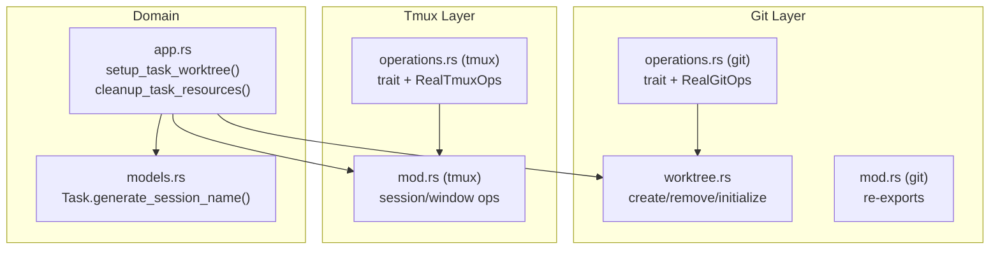
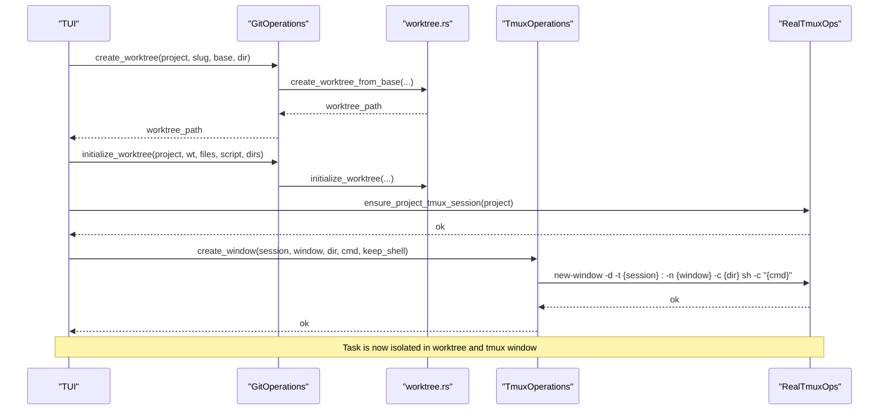
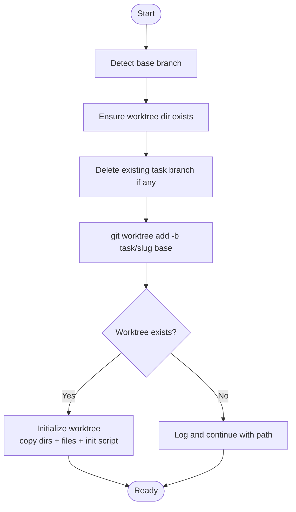
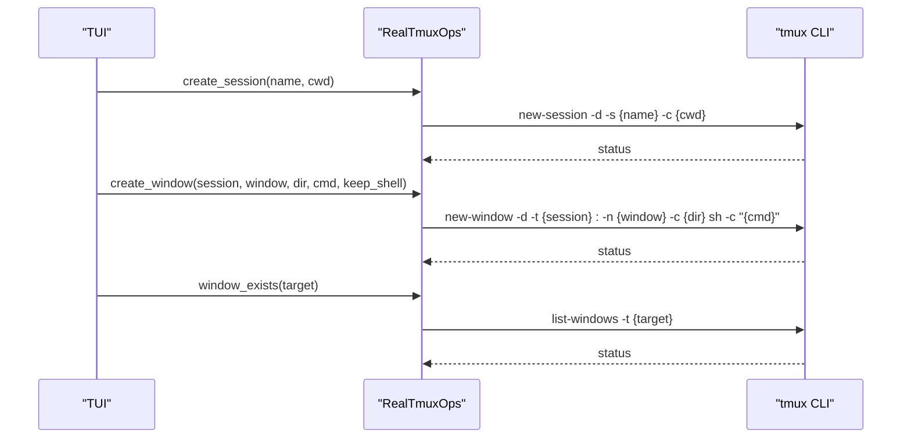
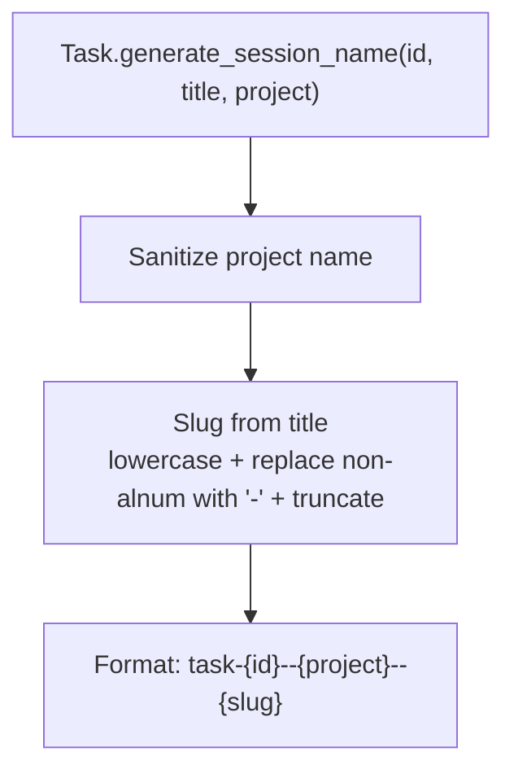
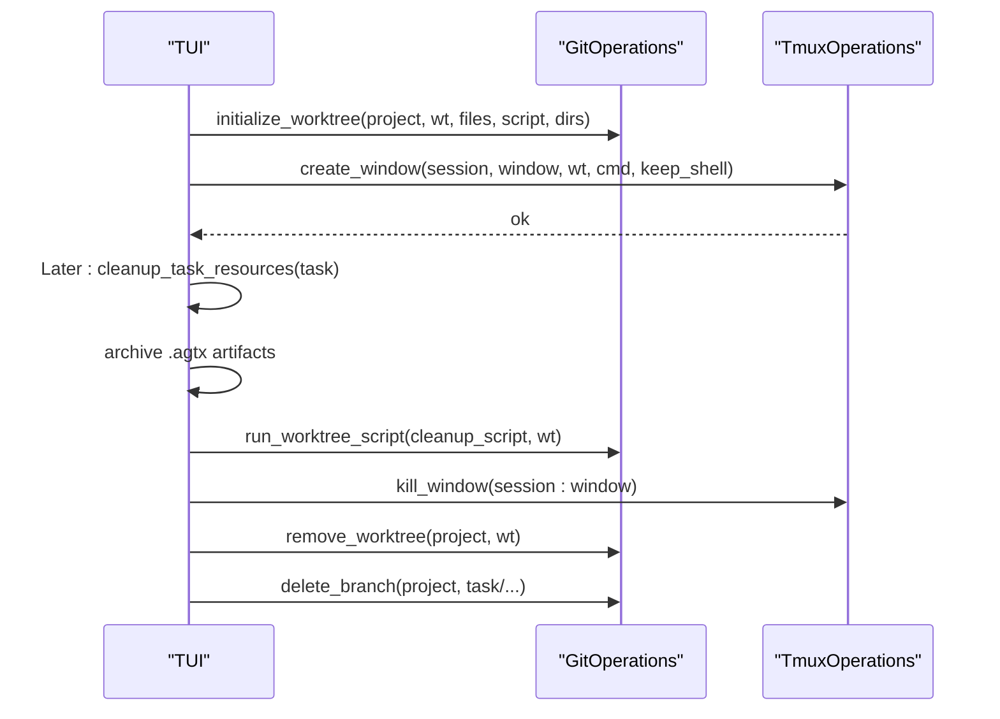
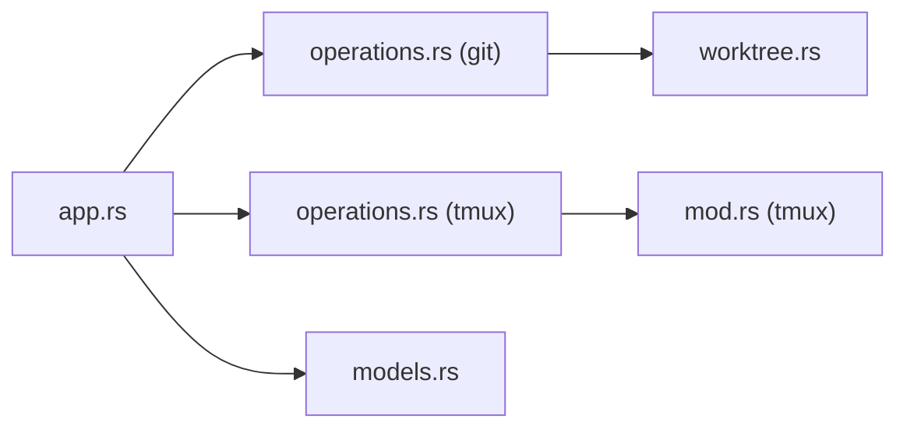

# Worktree and Session Management

<cite>
**Referenced Files in This Document**
- [worktree.rs](file://src/git/worktree.rs)
- [operations.rs (git)](file://src/git/operations.rs)
- [mod.rs (git)](file://src/git/mod.rs)
- [operations.rs (tmux)](file://src/tmux/operations.rs)
- [mod.rs (tmux)](file://src/tmux/mod.rs)
- [app.rs](file://src/tui/app.rs)
- [models.rs](file://src/db/models.rs)
- [app_tests.rs](file://tests/git_tests.rs)
</cite>

## Table of Contents
1. [Introduction](#introduction)
2. [Project Structure](#project-structure)
3. [Core Components](#core-components)
4. [Architecture Overview](#architecture-overview)
5. [Detailed Component Analysis](#detailed-component-analysis)
6. [Dependency Analysis](#dependency-analysis)
7. [Performance Considerations](#performance-considerations)
8. [Troubleshooting Guide](#troubleshooting-guide)
9. [Conclusion](#conclusion)

## Introduction
This document explains how the system manages isolated development environments for agent tasks using git worktrees and tmux windows. Each task gets its own dedicated worktree and tmux window, ensuring complete isolation between concurrent operations. The design prevents conflicts by keeping each task’s working directory, branch, and interactive session separate, while providing robust lifecycle management for creation, activation, and cleanup.

## Project Structure
The worktree and session management spans several modules:
- Git worktree creation, initialization, and cleanup
- Tmux session and window management
- Task model and naming conventions
- TUI orchestration for setup and teardown

**Diagram sources**
- [worktree.rs:1-345](file://src/git/worktree.rs#L1-L345)
- [operations.rs (git):1-276](file://src/git/operations.rs#L1-L276)
- [mod.rs (git):1-142](file://src/git/mod.rs#L1-L142)
- [operations.rs (tmux):1-249](file://src/tmux/operations.rs#L1-L249)
- [mod.rs (tmux):1-189](file://src/tmux/mod.rs#L1-L189)
- [app.rs:6969-7142](file://src/tui/app.rs#L6969-L7142)
- [models.rs:119-132](file://src/db/models.rs#L119-L132)

**Section sources**
- [worktree.rs:1-345](file://src/git/worktree.rs#L1-L345)
- [operations.rs (git):1-276](file://src/git/operations.rs#L1-L276)
- [mod.rs (git):1-142](file://src/git/mod.rs#L1-L142)
- [operations.rs (tmux):1-249](file://src/tmux/operations.rs#L1-L249)
- [mod.rs (tmux):1-189](file://src/tmux/mod.rs#L1-L189)
- [app.rs:6969-7142](file://src/tui/app.rs#L6969-L7142)
- [models.rs:119-132](file://src/db/models.rs#L119-L132)

## Core Components
- Git worktree management:
  - Creation from a base branch with automatic cleanup of partial attempts
  - Initialization by copying agent configuration directories and optional user files/scripts
  - Existence checks and removal with force-prune fallback
- Tmux session/window management:
  - Detached session creation and window creation bound to a project-specific server
  - Window existence checks, pane capture, sending keys, and killing windows
  - Session name sanitization and parsing helpers
- Task model and naming:
  - Session naming convention: task-{id}--{project}--{slug}
  - Slug generation from task title with safe truncation
- TUI orchestration:
  - Setup: create worktree, initialize, deploy skills, copy references, create tmux window
  - Cleanup: archive artifacts, run cleanup script, kill window, remove worktree, delete branch

**Section sources**
- [worktree.rs:8-65](file://src/git/worktree.rs#L8-L65)
- [worktree.rs:125-223](file://src/git/worktree.rs#L125-L223)
- [worktree.rs:275-297](file://src/git/worktree.rs#L275-L297)
- [operations.rs (git):11-75](file://src/git/operations.rs#L11-L75)
- [operations.rs (git):77-276](file://src/git/operations.rs#L77-L276)
- [operations.rs (tmux):9-59](file://src/tmux/operations.rs#L9-L59)
- [operations.rs (tmux):61-249](file://src/tmux/operations.rs#L61-L249)
- [mod.rs (tmux):11-189](file://src/tmux/mod.rs#L11-L189)
- [models.rs:119-132](file://src/db/models.rs#L119-L132)
- [app.rs:6969-7142](file://src/tui/app.rs#L6969-L7142)
- [app.rs:6937-6958](file://src/tui/app.rs#L6937-L6958)

## Architecture Overview
The system coordinates git worktrees and tmux windows to isolate each task. The TUI orchestrates the lifecycle, delegating to Git and Tmux modules for low-level operations.

**Diagram sources**
- [app.rs:6969-7142](file://src/tui/app.rs#L6969-L7142)
- [operations.rs (git):80-91](file://src/git/operations.rs#L80-L91)
- [worktree.rs:14-65](file://src/git/worktree.rs#L14-L65)
- [operations.rs (tmux):64-110](file://src/tmux/operations.rs#L64-L110)
- [mod.rs (tmux):11-48](file://src/tmux/mod.rs#L11-L48)

## Detailed Component Analysis

### Worktree Lifecycle
- Creation:
  - Detects base branch (main/master fallback, then current branch)
  - Ensures parent worktree directory exists
  - Removes any existing branch with the same task prefix
  - Creates a new branch named task/{slug} and adds a worktree at .agtx/worktrees/{slug}
  - On failure, logs and continues with best-effort path resolution
- Initialization:
  - Copies agent config directories (.claude, .gemini, .codex, .github/agents, .config/opencode)
  - Optionally copies user-specified files/directories
  - Runs an optional init script in the worktree environment
- Existence and Removal:
  - Checks if a worktree exists for a task
  - Removes a worktree with force; falls back to pruning if remove fails

**Diagram sources**
- [worktree.rs:8-65](file://src/git/worktree.rs#L8-L65)
- [worktree.rs:125-223](file://src/git/worktree.rs#L125-L223)

**Section sources**
- [worktree.rs:8-65](file://src/git/worktree.rs#L8-L65)
- [worktree.rs:125-223](file://src/git/worktree.rs#L125-L223)
- [worktree.rs:275-297](file://src/git/worktree.rs#L275-L297)
- [operations.rs (git):80-103](file://src/git/operations.rs#L80-L103)

### Tmux Session and Window Management
- Server and sessions:
  - Uses a dedicated tmux server named "agtx"
  - Creates detached sessions and windows under a project-scoped namespace
- Windows:
  - Creates windows with a working directory set to the worktree path
  - Can keep a shell on exit for task panes or close windows cleanly for orchestrator panes
- Utilities:
  - Safe session name generation from project names
  - Parsing of session names to extract task/project identifiers
  - Pane capture and key sending for interactive control

**Diagram sources**
- [operations.rs (tmux):64-110](file://src/tmux/operations.rs#L64-L110)
- [operations.rs (tmux):120-126](file://src/tmux/operations.rs#L120-L126)
- [mod.rs (tmux):14-189](file://src/tmux/mod.rs#L14-L189)

**Section sources**
- [operations.rs (tmux):9-59](file://src/tmux/operations.rs#L9-L59)
- [operations.rs (tmux):61-249](file://src/tmux/operations.rs#L61-L249)
- [mod.rs (tmux):11-189](file://src/tmux/mod.rs#L11-L189)

### Task Naming Conventions and Path Management
- Session naming:
  - Format: task-{id}--{project}--{slug}
  - Project name is sanitized to be tmux-safe
  - Slug is derived from the task title, lowercased, with non-alphanumeric characters replaced by hyphens and truncated to a reasonable length
- Worktree path:
  - Default location: .agtx/worktrees/{slug}
  - Path composition helpers support custom directories
- Branch naming:
  - Each task branch is named task/{slug}

**Diagram sources**
- [models.rs:119-132](file://src/db/models.rs#L119-L132)

**Section sources**
- [models.rs:119-132](file://src/db/models.rs#L119-L132)
- [worktree.rs:299-317](file://src/git/worktree.rs#L299-L317)

### Session Management Lifecycle
- Setup:
  - Create worktree and initialize
  - Ensure project tmux session exists
  - Create tmux window with agent command
  - Store session_name, worktree_path, branch_name on the task
- Recovery:
  - If a worktree exists but the tmux window is missing, recreate the window pointing to the existing worktree
- Cleanup:
  - Archive artifacts from .agtx
  - Run cleanup script in worktree
  - Kill tmux window
  - Remove worktree (force)
  - Optionally delete the task branch

**Diagram sources**
- [app.rs:6969-7142](file://src/tui/app.rs#L6969-L7142)
- [app.rs:6937-6958](file://src/tui/app.rs#L6937-L6958)
- [worktree.rs:125-223](file://src/git/worktree.rs#L125-L223)
- [operations.rs (git):93-109](file://src/git/operations.rs#L93-L109)

**Section sources**
- [app.rs:6969-7142](file://src/tui/app.rs#L6969-L7142)
- [app.rs:6937-6958](file://src/tui/app.rs#L6937-L6958)
- [worktree.rs:125-223](file://src/git/worktree.rs#L125-L223)
- [operations.rs (git):93-109](file://src/git/operations.rs#L93-L109)

### Practical Examples

- New task creation:
  - The TUI calls setup_task_worktree with a unique slug derived from the task id and title
  - It ensures the project tmux session exists, then creates a window in that session
  - The window’s working directory is the worktree path, and the agent runs inside it
  - The task record is updated with session_name, worktree_path, and branch_name

- Session isolation benefits:
  - Each task has its own worktree directory and branch
  - Each task has its own tmux window/session under the project namespace
  - Concurrent tasks do not interfere with each other’s files, branches, or interactive sessions

- Proper cleanup:
  - Artifacts are archived from the worktree
  - A cleanup script is executed inside the worktree
  - The tmux window is killed, the worktree is removed, and the task branch is deleted

**Section sources**
- [app.rs:6969-7142](file://src/tui/app.rs#L6969-L7142)
- [models.rs:119-132](file://src/db/models.rs#L119-L132)
- [app.rs:6937-6958](file://src/tui/app.rs#L6937-L6958)

## Dependency Analysis
- Git layer depends on:
  - Standard library process execution for git commands
  - Path utilities for directory management
- Tmux layer depends on:
  - Standard library process execution for tmux commands
  - Trait abstraction enabling testable mocks
- TUI orchestrates both layers and maintains task state

**Diagram sources**
- [app.rs:6969-7142](file://src/tui/app.rs#L6969-L7142)
- [operations.rs (git):1-276](file://src/git/operations.rs#L1-L276)
- [operations.rs (tmux):1-249](file://src/tmux/operations.rs#L1-L249)
- [worktree.rs:1-345](file://src/git/worktree.rs#L1-L345)
- [models.rs:1-245](file://src/db/models.rs#L1-L245)

**Section sources**
- [app.rs:6969-7142](file://src/tui/app.rs#L6969-L7142)
- [operations.rs (git):1-276](file://src/git/operations.rs#L1-L276)
- [operations.rs (tmux):1-249](file://src/tmux/operations.rs#L1-L249)
- [worktree.rs:1-345](file://src/git/worktree.rs#L1-L345)
- [models.rs:1-245](file://src/db/models.rs#L1-L245)

## Performance Considerations
- Worktree creation overhead:
  - Creating a worktree involves git operations; batching tasks or reusing worktrees where appropriate can reduce overhead
- Tmux window creation:
  - Creating windows is lightweight; avoid unnecessary recreation by checking window existence first
- Initialization cost:
  - Copying directories and running scripts adds time; cache or reuse where feasible

## Troubleshooting Guide

Common issues and resolutions:
- Worktree conflicts:
  - Symptom: worktree creation fails due to existing branch or path
  - Resolution: ensure the task branch is deleted before creation; the system proactively removes existing task branches; verify base branch validity
- Orphaned sessions:
  - Symptom: tmux window exists but process exited
  - Resolution: the TUI detects missing windows and updates task phase accordingly; use recovery routines to recreate windows from existing worktrees
- Cleanup failures:
  - Symptom: worktree removal fails or leaves dangling references
  - Resolution: force removal and prune; the cleanup routine runs a cleanup script before removal and deletes the task branch afterward

Diagnostic tips:
- Verify base branch availability before creating worktrees
- Confirm tmux server "agtx" is running and project sessions exist
- Check worktree path and branch naming conventions
- Use session parsing helpers to extract task/project identifiers when diagnosing issues

**Section sources**
- [worktree.rs:67-84](file://src/git/worktree.rs#L67-L84)
- [worktree.rs:275-297](file://src/git/worktree.rs#L275-L297)
- [operations.rs (tmux):120-126](file://src/tmux/operations.rs#L120-L126)
- [app.rs:6423-6429](file://src/tui/app.rs#L6423-L6429)
- [app_tests.rs:287-322](file://tests/git_tests.rs#L287-L322)

## Conclusion
By combining git worktrees and tmux windows, the system achieves strong isolation for concurrent agent tasks. The TUI coordinates setup, recovery, and cleanup, while Git and Tmux modules handle the underlying operations. Adhering to naming conventions and cleanup procedures ensures predictable behavior and easy troubleshooting.