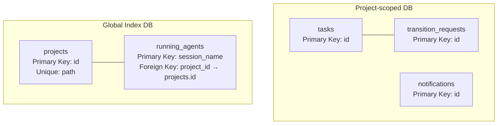
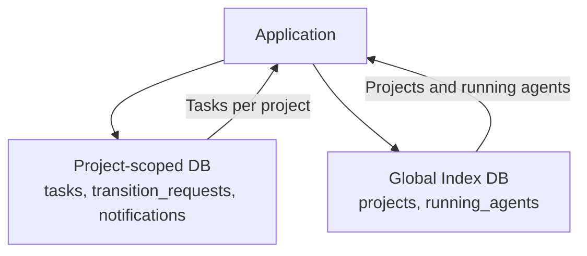
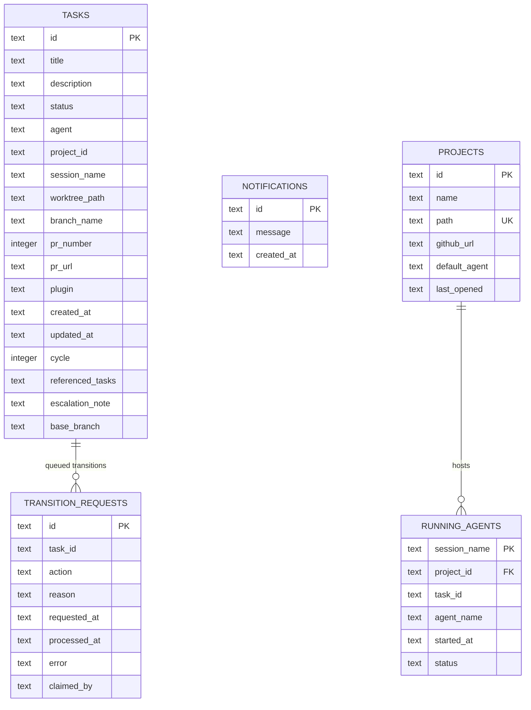
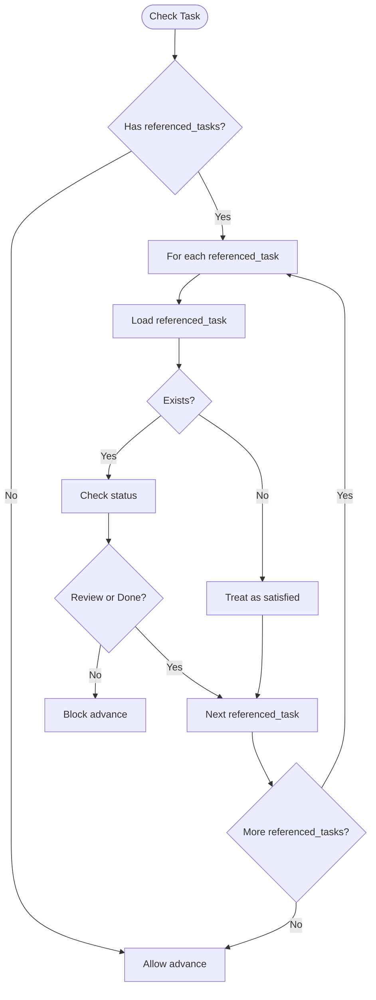
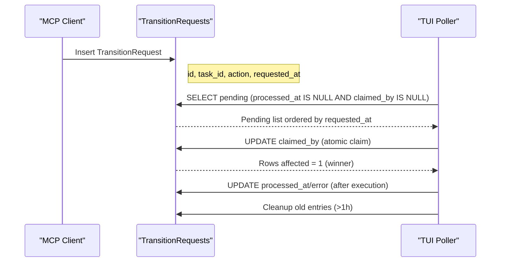
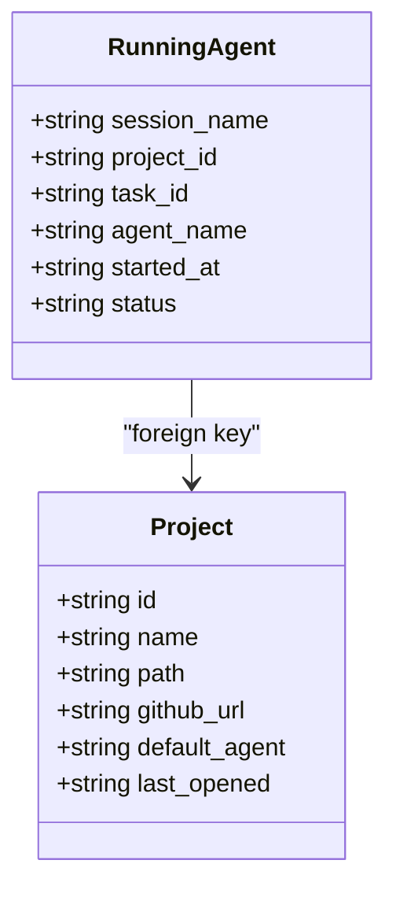
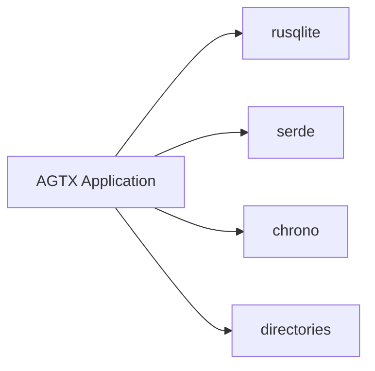

# Database Schema

<cite>
**Referenced Files in This Document**
- [schema.rs](file://src/db/schema.rs)
- [models.rs](file://src/db/models.rs)
- [mod.rs](file://src/db/mod.rs)
- [Cargo.toml](file://Cargo.toml)
- [README.md](file://README.md)
- [config/mod.rs](file://src/config/mod.rs)
- [main.rs](file://src/main.rs)
- [db_tests.rs](file://tests/db_tests.rs)
</cite>

## Table of Contents
1. [Introduction](#introduction)
2. [Project Structure](#project-structure)
3. [Core Components](#core-components)
4. [Architecture Overview](#architecture-overview)
5. [Detailed Component Analysis](#detailed-component-analysis)
6. [Dependency Analysis](#dependency-analysis)
7. [Performance Considerations](#performance-considerations)
8. [Troubleshooting Guide](#troubleshooting-guide)
9. [Conclusion](#conclusion)
10. [Appendices](#appendices)

## Introduction
This document describes the database schema and data model for AGTX’s task and project tracking system built on SQLite. It focuses on the core entities Task, Project, TransitionRequest, and RunningAgent, detailing their relationships, fields, constraints, indexes, and operational semantics. It also covers data access patterns, caching strategies, performance characteristics for the embedded SQLite implementation, data lifecycle, migration paths, and security considerations.

## Project Structure
AGTX organizes database logic under the db module with two primary concerns:
- Project-scoped database: stores tasks and transition requests for a specific project.
- Global index database: stores project metadata and running agent sessions.

**Diagram sources**
- [schema.rs:97-208](file://src/db/schema.rs#L97-L208)

**Section sources**
- [schema.rs:13-67](file://src/db/schema.rs#L13-L67)
- [schema.rs:97-208](file://src/db/schema.rs#L97-L208)

## Core Components
This section documents the four core entities and their fields, constraints, and relationships.

### Task
- Purpose: Represents a single task in the kanban board with lifecycle and execution metadata.
- Primary key: id (TEXT)
- Fields:
  - id: TEXT (primary key)
  - title: TEXT NOT NULL
  - description: TEXT (nullable)
  - status: TEXT NOT NULL DEFAULT 'backlog'
  - agent: TEXT NOT NULL
  - project_id: TEXT NOT NULL
  - session_name: TEXT (nullable)
  - worktree_path: TEXT (nullable)
  - branch_name: TEXT (nullable)
  - pr_number: INTEGER (nullable)
  - pr_url: TEXT (nullable)
  - plugin: TEXT (nullable)
  - created_at: TEXT NOT NULL (RFC 3339)
  - updated_at: TEXT NOT NULL (RFC 3339)
  - cycle: INTEGER NOT NULL DEFAULT 1
  - referenced_tasks: TEXT (nullable)
  - escalation_note: TEXT (nullable)
  - base_branch: TEXT (nullable)
- Constraints and indexes:
  - Primary key: id
  - Indexes: status, project_id
- Notes:
  - Status is stored as a string representation of TaskStatus enum.
  - created_at and updated_at are stored as RFC 3339 timestamps.

**Section sources**
- [schema.rs:100-119](file://src/db/schema.rs#L100-L119)
- [schema.rs:122-147](file://src/db/schema.rs#L122-L147)
- [schema.rs:117-118](file://src/db/schema.rs#L117-L118)
- [models.rs:58-79](file://src/db/models.rs#L58-L79)
- [models.rs:5-56](file://src/db/models.rs#L5-L56)

### Project
- Purpose: Tracks projects known to AGTX with metadata and default agent configuration.
- Primary key: id (TEXT)
- Unique constraint: path (TEXT, UNIQUE)
- Fields:
  - id: TEXT (primary key)
  - name: TEXT NOT NULL
  - path: TEXT NOT NULL UNIQUE
  - github_url: TEXT (nullable)
  - default_agent: TEXT (nullable)
  - last_opened: TEXT NOT NULL (RFC 3339)
- Notes:
  - last_opened is updated on upsert operations.

**Section sources**
- [schema.rs:185-192](file://src/db/schema.rs#L185-L192)
- [models.rs:135-157](file://src/db/models.rs#L135-L157)

### TransitionRequest
- Purpose: Queued request for a task state transition, used by the MCP server and polled by the TUI.
- Primary key: id (TEXT)
- Fields:
  - id: TEXT (primary key)
  - task_id: TEXT NOT NULL
  - action: TEXT NOT NULL
  - reason: TEXT (nullable)
  - requested_at: TEXT NOT NULL (RFC 3339)
  - processed_at: TEXT (nullable)
  - error: TEXT (nullable)
  - claimed_by: TEXT (nullable)
- Notes:
  - claimed_by enables atomic claim semantics to prevent duplicate processing.
  - Cleanup removes old entries older than 1 hour.

**Section sources**
- [schema.rs:152-166](file://src/db/schema.rs#L152-L166)
- [schema.rs:169-177](file://src/db/schema.rs#L169-L177)
- [models.rs:159-184](file://src/db/models.rs#L159-L184)

### RunningAgent
- Purpose: Tracks currently running agent sessions associated with a project and task.
- Primary key: session_name (TEXT)
- Foreign key: project_id → projects.id
- Fields:
  - session_name: TEXT (primary key)
  - project_id: TEXT NOT NULL
  - task_id: TEXT NOT NULL
  - agent_name: TEXT NOT NULL
  - started_at: TEXT NOT NULL (RFC 3339)
  - status: TEXT NOT NULL
- Indexes:
  - idx_running_project: project_id

**Section sources**
- [schema.rs:194-205](file://src/db/schema.rs#L194-L205)
- [models.rs:186-212](file://src/db/models.rs#L186-L212)

### Notification
- Purpose: Pull-based notifications for the orchestrator agent.
- Primary key: id (TEXT)
- Fields:
  - id: TEXT (primary key)
  - message: TEXT NOT NULL
  - created_at: TEXT NOT NULL (RFC 3339)
- Notes:
  - Peek without consuming; consume via RETURNING to atomically remove.

**Section sources**
- [schema.rs:161-165](file://src/db/schema.rs#L161-L165)
- [schema.rs:598-654](file://src/db/schema.rs#L598-L654)
- [models.rs:214-231](file://src/db/models.rs#L214-L231)

## Architecture Overview
AGTX uses a dual-database architecture:
- Project-scoped SQLite database per project path (hashed to a stable filename).
- Global index SQLite database storing project metadata and running agent sessions.

**Diagram sources**
- [schema.rs:13-67](file://src/db/schema.rs#L13-L67)
- [schema.rs:97-208](file://src/db/schema.rs#L97-L208)

**Section sources**
- [schema.rs:13-67](file://src/db/schema.rs#L13-L67)
- [schema.rs:97-208](file://src/db/schema.rs#L97-L208)

## Detailed Component Analysis

### Data Model Relationships

**Diagram sources**
- [schema.rs:100-166](file://src/db/schema.rs#L100-L166)
- [schema.rs:185-205](file://src/db/schema.rs#L185-L205)

**Section sources**
- [schema.rs:100-166](file://src/db/schema.rs#L100-L166)
- [schema.rs:185-205](file://src/db/schema.rs#L185-L205)

### Task State Transitions and Dependencies
- Task status transitions are governed by plugin configuration and the orchestrator agent.
- Dependencies are modeled via referenced_tasks (comma-separated task IDs). A task can only advance when all referenced tasks are in Review or Done.
- The system enforces dependency satisfaction at runtime.

**Diagram sources**
- [schema.rs:387-400](file://src/db/schema.rs#L387-L400)

**Section sources**
- [schema.rs:387-400](file://src/db/schema.rs#L387-L400)

### MCP Transition Request Queue
The TransitionRequest table implements a reliable queue with atomic claim semantics and cleanup.

**Diagram sources**
- [schema.rs:478-574](file://src/db/schema.rs#L478-L574)

**Section sources**
- [schema.rs:478-574](file://src/db/schema.rs#L478-L574)

### Running Agent Tracking
RunningAgent records active agent sessions and links them to projects and tasks.

**Diagram sources**
- [schema.rs:194-205](file://src/db/schema.rs#L194-L205)
- [models.rs:186-212](file://src/db/models.rs#L186-L212)
- [models.rs:135-157](file://src/db/models.rs#L135-L157)

**Section sources**
- [schema.rs:194-205](file://src/db/schema.rs#L194-L205)
- [models.rs:186-212](file://src/db/models.rs#L186-L212)

### Sample Data Patterns
- Typical Task lifecycle:
  - Created in Backlog with default status and timestamps.
  - Advanced through Planning, Running, Review; finally moved to Done by user.
- Typical TransitionRequest:
  - Enqueued with action (e.g., move_forward, escalate_to_user).
  - Claimed by a single processor; marked processed with optional error.
- Typical RunningAgent:
  - Created when a task enters Planning or Running; removed on completion.

**Section sources**
- [models.rs:58-79](file://src/db/models.rs#L58-L79)
- [models.rs:159-184](file://src/db/models.rs#L159-L184)
- [models.rs:186-212](file://src/db/models.rs#L186-L212)

## Dependency Analysis
- Database library: rusqlite with bundled feature for portability.
- Serialization: serde for Task, Project, TransitionRequest, RunningAgent, Notification.
- Time handling: chrono for UTC timestamps.
- OS-specific paths: directories crate for platform-appropriate config directories.

**Diagram sources**
- [Cargo.toml:20-34](file://Cargo.toml#L20-L34)

**Section sources**
- [Cargo.toml:20-34](file://Cargo.toml#L20-L34)

## Performance Considerations
- Embedded SQLite:
  - Single writer, multiple readers; transactions batch inserts for tasks.
  - Indexes on status and project_id optimize filtering and grouping.
- Concurrency:
  - Atomic claim via UPDATE with WHERE clause prevents race conditions.
  - In-memory databases for tests isolate state and improve speed.
- Cleanup:
  - TransitionRequests cleaned up after 1 hour to prevent unbounded growth.
- Time storage:
  - RFC 3339 strings enable cross-platform compatibility and timezone-awareness.

**Section sources**
- [schema.rs:242-274](file://src/db/schema.rs#L242-L274)
- [schema.rs:535-543](file://src/db/schema.rs#L535-L543)
- [schema.rs:545-554](file://src/db/schema.rs#L545-L554)
- [db_tests.rs:380-422](file://tests/db_tests.rs#L380-L422)

## Troubleshooting Guide
- Database path resolution:
  - Project-scoped DB path is derived from a hash of the project path and stored under the config directory.
  - Global DB path is index.db under the config directory.
- Migration and schema evolution:
  - ALTER TABLE statements add new columns with defaults to existing rows.
  - ON CONFLICT path UPDATE ensures project metadata stays current.
- Common issues:
  - Missing indexes: ensure status and project_id indexes exist for performance.
  - Cleanup not running: verify cleanup_old_transition_requests is invoked periodically.
  - Timezone drift: timestamps are stored as RFC 3339; parsing errors are handled gracefully.

**Section sources**
- [schema.rs:13-67](file://src/db/schema.rs#L13-L67)
- [schema.rs:122-147](file://src/db/schema.rs#L122-L147)
- [schema.rs:404-424](file://src/db/schema.rs#L404-L424)

## Conclusion
AGTX’s database schema is designed for simplicity and reliability in an embedded SQLite environment. The dual-database architecture cleanly separates project data from global indexing, while the TransitionRequest queue and RunningAgent tracking provide robust operational semantics for task lifecycle management. Migrations are additive, and cleanup routines prevent long-term accumulation of stale data.

## Appendices

### Database Locations and Configuration
- Project-scoped database:
  - Location: config directory under projects/<hash>.db
  - Determined by hashing the project path string.
- Global index database:
  - Location: config directory index.db
- Config directory:
  - Cross-platform via directories crate; typically ~/.config/agtx/ on Linux/macOS.

**Section sources**
- [schema.rs:13-67](file://src/db/schema.rs#L13-L67)
- [config/mod.rs:268-273](file://src/config/mod.rs#L268-L273)

### Data Access Patterns
- Task CRUD:
  - Create/update/delete via prepared statements with parameter binding.
  - Query by status and project_id using indexes.
- Project CRUD:
  - Upsert by path with ON CONFLICT to update metadata.
- Transition Requests:
  - Atomic claim via UPDATE with WHERE; cleanup removes stale entries.
- Notifications:
  - Peek without consuming; consume via RETURNING to atomically delete.

**Section sources**
- [schema.rs:212-317](file://src/db/schema.rs#L212-L317)
- [schema.rs:404-476](file://src/db/schema.rs#L404-L476)
- [schema.rs:480-574](file://src/db/schema.rs#L480-L574)
- [schema.rs:598-654](file://src/db/schema.rs#L598-L654)

### Data Lifecycle
- Task lifecycle:
  - Backlog → Research → Planning → Running → Review → Done (user merges).
- Transition lifecycle:
  - Enqueue → Claim → Execute → Mark processed → Cleanup.
- Running agent lifecycle:
  - Created on task enter Planning/Running; removed on completion.

**Section sources**
- [README.md:566-572](file://README.md#L566-L572)
- [schema.rs:480-574](file://src/db/schema.rs#L480-L574)
- [schema.rs:194-205](file://src/db/schema.rs#L194-L205)

### Security and Backup
- Security:
  - Databases are local files; no network exposure.
  - Consider filesystem permissions on the config directory.
- Backup:
  - Back up the config directory (~/.config/agtx/) which contains index.db and project databases.
  - For disaster recovery, restore the entire config directory.

**Section sources**
- [README.md:566-572](file://README.md#L566-L572)

### Version Management and Migration Strategy
- Schema evolution:
  - Add new columns with defaults using ALTER TABLE.
  - Use ON CONFLICT clauses for idempotent upserts.
- Migration path:
  - On first use, initialize project and global schemas.
  - Future schema changes are additive; existing rows retain defaults.

**Section sources**
- [schema.rs:97-180](file://src/db/schema.rs#L97-L180)
- [schema.rs:182-208](file://src/db/schema.rs#L182-L208)