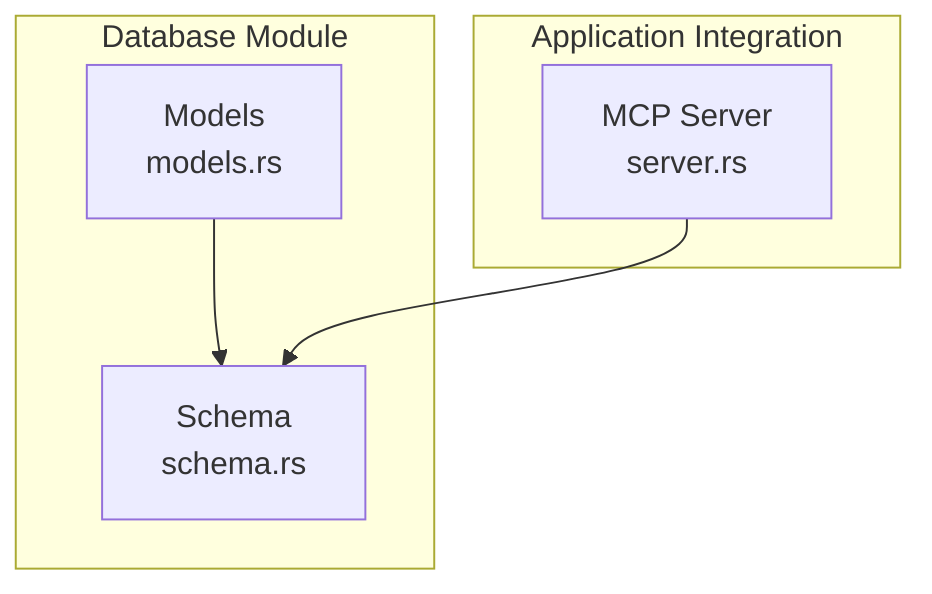
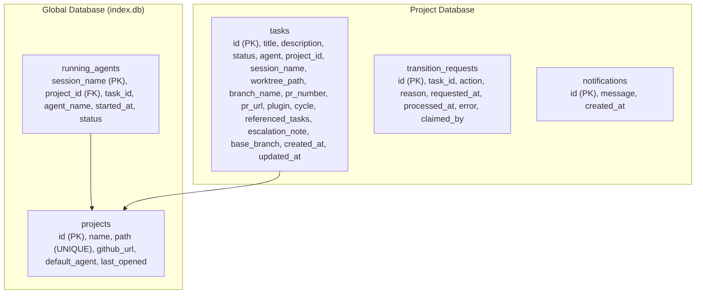
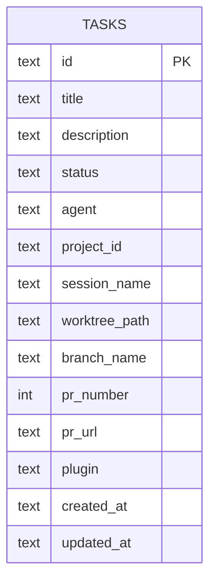
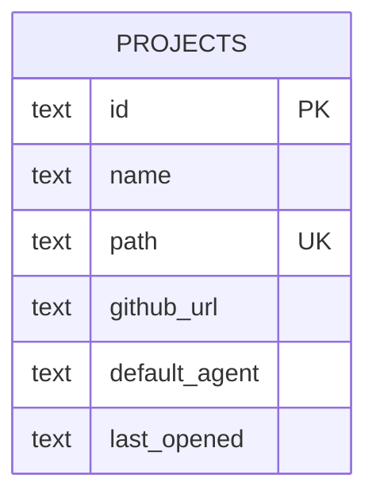
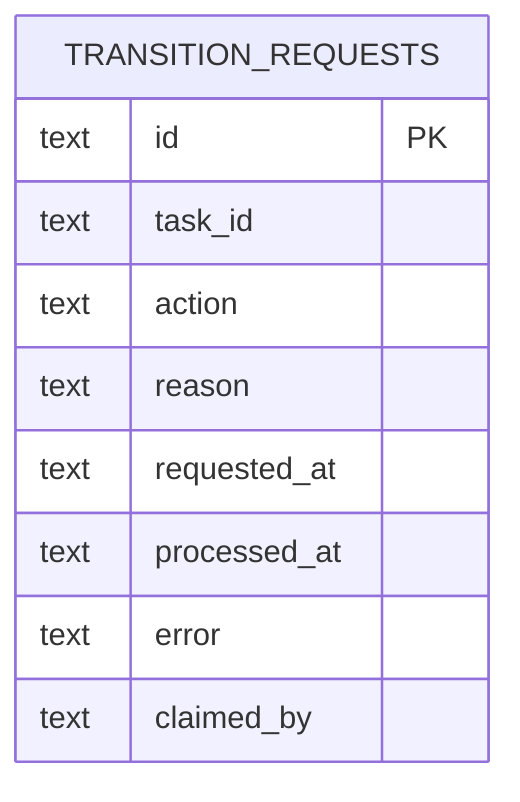
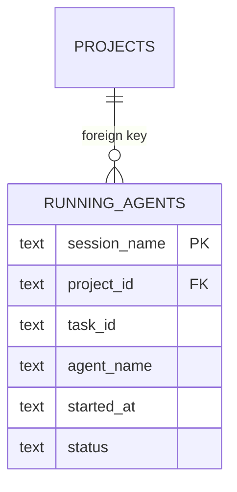
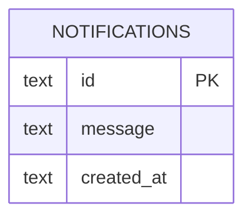
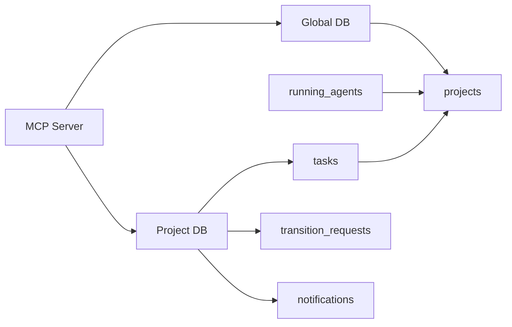

# Database Schema

<cite>
**Referenced Files in This Document**
- [schema.rs](file://src/db/schema.rs)
- [models.rs](file://src/db/models.rs)
- [server.rs](file://src/mcp/server.rs)
- [db_tests.rs](file://tests/db_tests.rs)
</cite>

## Table of Contents
1. [Introduction](#introduction)
2. [Project Structure](#project-structure)
3. [Core Components](#core-components)
4. [Architecture Overview](#architecture-overview)
5. [Detailed Component Analysis](#detailed-component-analysis)
6. [Dependency Analysis](#dependency-analysis)
7. [Performance Considerations](#performance-considerations)
8. [Troubleshooting Guide](#troubleshooting-guide)
9. [Conclusion](#conclusion)
10. [Appendices](#appendices)

## Introduction
This document describes the agtx database schema and persistence architecture focused on task management and related workflows. It documents entity relationships among tasks, projects, transition requests, running agents, and notifications, including primary and foreign keys, field definitions, data types, constraints, validation rules, and business logic embedded in the schema. It also covers data access patterns, indexing strategies, concurrency considerations, lifecycle management, migration paths, backup and recovery, integrity verification, and administration guidance.

## Project Structure
The database layer is implemented in a dedicated module with two main files:
- Models define the domain entities and enums used by the schema.
- Schema defines the SQLite DDL, migrations, indexes, and CRUD operations.

**Diagram sources**
- [schema.rs:1-656](file://src/db/schema.rs#L1-L656)
- [models.rs:1-245](file://src/db/models.rs#L1-L245)
- [server.rs:410-609](file://src/mcp/server.rs#L410-L609)

**Section sources**
- [schema.rs:1-656](file://src/db/schema.rs#L1-L656)
- [models.rs:1-245](file://src/db/models.rs#L1-L245)

## Core Components
This section outlines the core entities and their roles in the persistence layer.

- Task: Kanban item with status, agent assignment, project linkage, optional PR metadata, and workflow metadata.
- Project: Indexed project metadata stored in the global database.
- TransitionRequest: MCP-triggered command queue for state transitions with claim/processing semantics.
- RunningAgent: Runtime record of active agent sessions linked to a project.
- Notification: Pull-based event queue for orchestrator consumption.

**Section sources**
- [models.rs:58-133](file://src/db/models.rs#L58-L133)
- [models.rs:135-157](file://src/db/models.rs#L135-L157)
- [models.rs:159-184](file://src/db/models.rs#L159-L184)
- [models.rs:186-231](file://src/db/models.rs#L186-L231)

## Architecture Overview
The system uses separate SQLite databases:
- Project-scoped database: stores tasks, transition requests, and notifications for a specific project.
- Global index database: stores projects and running agents, enabling cross-project operations.

**Diagram sources**
- [schema.rs:183-208](file://src/db/schema.rs#L183-L208)
- [schema.rs:97-180](file://src/db/schema.rs#L97-L180)

## Detailed Component Analysis

### Tasks
- Purpose: Track work items across a kanban-like workflow.
- Primary key: id (text).
- Notable fields:
  - status: text with enumerated values persisted as strings.
  - project_id: links to projects.id.
  - cycle: integer default 1.
  - referenced_tasks: comma-separated task IDs indicating dependencies.
  - escalation_note, base_branch: optional metadata.
  - timestamps: created_at, updated_at stored as text in RFC 3339 format.
- Constraints and defaults:
  - status defaults to "backlog".
  - cycle defaults to 1.
  - created_at/updated_at required on insert/update.
- Business logic:
  - Dependency satisfaction check evaluates referenced_tasks against Review/Done statuses.
- Indexes:
  - idx_tasks_status on status.
  - idx_tasks_project on project_id.

**Diagram sources**
- [schema.rs:100-119](file://src/db/schema.rs#L100-L119)

**Section sources**
- [schema.rs:100-148](file://src/db/schema.rs#L100-L148)
- [schema.rs:353-400](file://src/db/schema.rs#L353-L400)
- [models.rs:58-133](file://src/db/models.rs#L58-L133)

### Projects
- Purpose: Central registry of projects with metadata.
- Primary key: id (text).
- Unique constraint: path (text).
- Notable fields:
  - name, path, github_url, default_agent, last_opened.
  - last_opened stored as text in RFC 3339 format.
- Upsert behavior:
  - Insert or update on conflict by path.

**Diagram sources**
- [schema.rs:185-192](file://src/db/schema.rs#L185-L192)

**Section sources**
- [schema.rs:182-208](file://src/db/schema.rs#L182-L208)
- [models.rs:135-157](file://src/db/models.rs#L135-L157)

### Transition Requests
- Purpose: MCP-triggered command queue for task state transitions.
- Primary key: id (text).
- Notable fields:
  - task_id (text), action (text), reason (optional text), requested_at, processed_at (optional), error (optional), claimed_by (optional).
- Concurrency semantics:
  - Atomic claim via UPDATE with WHERE unclaimed/unsolved predicate.
  - Pending selection excludes claimed and processed entries.
- Cleanup policy:
  - Old records removed after a time threshold.

**Diagram sources**
- [schema.rs:152-167](file://src/db/schema.rs#L152-L167)

**Section sources**
- [schema.rs:478-554](file://src/db/schema.rs#L478-L554)
- [models.rs:159-184](file://src/db/models.rs#L159-L184)

### Running Agents
- Purpose: Track active agent sessions and their association to projects.
- Primary key: session_name (text).
- Foreign key: project_id references projects.id.
- Notable fields:
  - task_id, agent_name, started_at, status (enumerated as text).
- Index:
  - idx_running_project on project_id.

**Diagram sources**
- [schema.rs:194-205](file://src/db/schema.rs#L194-L205)

**Section sources**
- [schema.rs:182-208](file://src/db/schema.rs#L182-L208)
- [models.rs:186-231](file://src/db/models.rs#L186-L231)

### Notifications
- Purpose: Pull-based event queue for orchestrator consumption.
- Primary key: id (text).
- Notable fields:
  - message (text), created_at (text RFC 3339).
- Access pattern:
  - Peek without consuming.
  - Atomic fetch-and-delete via RETURNING.

**Diagram sources**
- [schema.rs:161-165](file://src/db/schema.rs#L161-L165)

**Section sources**
- [schema.rs:596-654](file://src/db/schema.rs#L596-L654)
- [models.rs:214-231](file://src/db/models.rs#L214-L231)

### Data Validation Rules and Business Logic Embedded in Schema
- Enumerated status values are persisted as lowercase strings with explicit conversion helpers.
- Dependency satisfaction:
  - A task’s referenced_tasks are considered satisfied if all referenced tasks exist and are in Review or Done; missing references are treated as satisfied.
- Transition request lifecycle:
  - Pending = unprocessed AND unclaimed.
  - Claiming is atomic; only one claim succeeds.
  - Cleanup removes stale or resolved requests older than a threshold.
- Timestamp handling:
  - All DateTime<Utc> values are serialized to RFC 3339 strings for storage.

**Section sources**
- [models.rs:5-56](file://src/db/models.rs#L5-L56)
- [schema.rs:387-400](file://src/db/schema.rs#L387-L400)
- [schema.rs:511-554](file://src/db/schema.rs#L511-L554)

### Sample Data Structures for Common Use Cases
- Task creation and retrieval:
  - Create a task with default backlog status and required identifiers.
  - Retrieve by ID or list by status.
- Project indexing:
  - Upsert project by path; list all projects ordered by last opened.
- Transition request queue:
  - Enqueue a request with optional reason.
  - Claim a pending request atomically; mark processed with optional error.
- Notifications:
  - Create notifications; peek or consume in FIFO order.

**Section sources**
- [schema.rs:212-385](file://src/db/schema.rs#L212-L385)
- [schema.rs:404-476](file://src/db/schema.rs#L404-L476)
- [schema.rs:480-554](file://src/db/schema.rs#L480-L554)
- [schema.rs:598-654](file://src/db/schema.rs#L598-L654)

## Dependency Analysis
The schema enforces referential integrity between tasks and projects, and between running agents and projects. The MCP server resolves project paths and coordinates database access for global and project scopes.

**Diagram sources**
- [schema.rs:183-208](file://src/db/schema.rs#L183-L208)
- [schema.rs:97-180](file://src/db/schema.rs#L97-L180)
- [server.rs:410-444](file://src/mcp/server.rs#L410-L444)

**Section sources**
- [schema.rs:183-208](file://src/db/schema.rs#L183-L208)
- [server.rs:410-444](file://src/mcp/server.rs#L410-L444)

## Performance Considerations
- Indexes:
  - tasks.status and tasks.project_id support filtering and grouping by status and project.
  - running_agents.project_id supports fast lookup by project.
- Batch operations:
  - Tasks can be inserted in a transaction for improved throughput during bulk loads.
- Concurrency:
  - Transition request claiming uses a single UPDATE with WHERE conditions to avoid race conditions.
  - Notification consumption uses RETURNING to atomically dequeue rows.
- Time-based cleanup:
  - Transition requests are periodically cleaned up to prevent unbounded growth.

**Section sources**
- [schema.rs:117-118](file://src/db/schema.rs#L117-L118)
- [schema.rs:242-274](file://src/db/schema.rs#L242-L274)
- [schema.rs:535-543](file://src/db/schema.rs#L535-L543)
- [schema.rs:631-654](file://src/db/schema.rs#L631-L654)
- [schema.rs:545-554](file://src/db/schema.rs#L545-L554)

## Troubleshooting Guide
Common issues and remedies:
- Missing or stale transition requests:
  - Use cleanup to remove old processed or claimed requests beyond the threshold.
- Duplicate or conflicting project entries:
  - Upsert by path ensures idempotent updates; verify path normalization.
- Dependency deadlock or blocked tasks:
  - Confirm referenced_tasks IDs exist and statuses are Review/Done; missing references are treated as satisfied.
- Notification duplication:
  - Use consume_notifications to atomically drain; avoid manual DELETE/SELECT patterns.
- Session name collisions:
  - Task session names are generated with a stable prefix and sanitized slug; ensure uniqueness by project and title.

Operational checks:
- Verify indexes exist for status and project filters.
- Confirm RFC 3339 timestamps are properly parsed on read.
- Validate enum conversions for status and agent status.

**Section sources**
- [schema.rs:545-554](file://src/db/schema.rs#L545-L554)
- [schema.rs:404-425](file://src/db/schema.rs#L404-L425)
- [schema.rs:387-400](file://src/db/schema.rs#L387-L400)
- [schema.rs:631-654](file://src/db/schema.rs#L631-L654)
- [models.rs:119-133](file://src/db/models.rs#L119-L133)

## Conclusion
The agtx database schema provides a compact, SQLite-backed persistence layer tailored for task-centric workflows. It separates concerns between a global index and project-scoped stores, enforces referential integrity, and embeds operational safeguards for concurrency and lifecycle management. The design balances simplicity with robustness, enabling reliable task tracking, state transitions, and agent session management.

## Appendices

### Data Lifecycle Management
- Task retirement:
  - Move tasks to Done; rely on cleanup policies for old transition requests.
- Cleanup procedures:
  - Periodic cleanup of transition_requests older than a defined threshold.
- Storage optimization:
  - Keep notifications small and consume promptly.
  - Use batch inserts for initial loads.

**Section sources**
- [schema.rs:545-554](file://src/db/schema.rs#L545-L554)
- [schema.rs:598-654](file://src/db/schema.rs#L598-L654)

### Data Migration Paths
- Column additions:
  - New columns are added via ALTER TABLE with defaults; existing rows receive default values.
- Enumerated fields:
  - Status values are persisted as strings; conversion helpers maintain compatibility.
- Unique constraints:
  - Projects.path is unique; upsert handles conflicts.

**Section sources**
- [schema.rs:122-147](file://src/db/schema.rs#L122-L147)
- [schema.rs:169-177](file://src/db/schema.rs#L169-L177)
- [schema.rs](file://src/db/schema.rs#L188)

### Backup and Recovery Procedures
- Backup:
  - Copy the global index database and project databases from the configuration directory.
- Recovery:
  - Restore copied files and restart the application; ensure paths resolve correctly.
- Integrity verification:
  - Run tests that exercise CRUD and concurrency paths to validate correctness.

**Section sources**
- [db_tests.rs:140-203](file://tests/db_tests.rs#L140-L203)
- [db_tests.rs:310-422](file://tests/db_tests.rs#L310-L422)

### Database Administration Guidance
- Monitoring:
  - Observe pending transition requests and notification queues.
- Maintenance:
  - Schedule cleanup runs to prune old transition requests.
- Troubleshooting:
  - Use get_task/get_tasks_by_status to inspect task states.
  - Use get_project_by_id/get_all_projects for project health.

**Section sources**
- [schema.rs:353-385](file://src/db/schema.rs#L353-L385)
- [schema.rs:427-476](file://src/db/schema.rs#L427-L476)
- [schema.rs:511-524](file://src/db/schema.rs#L511-L524)