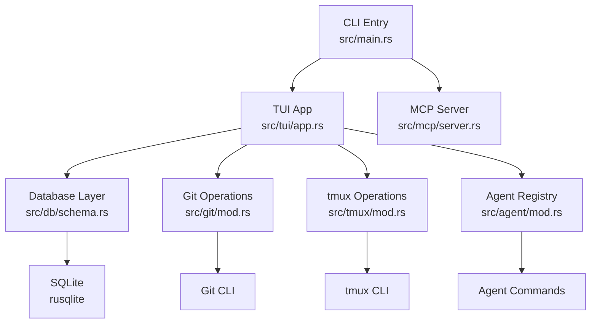
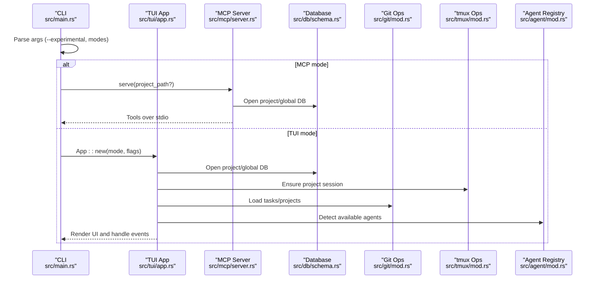
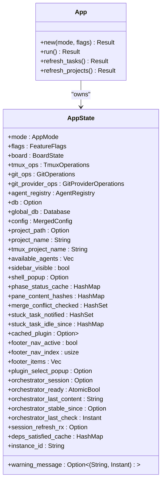
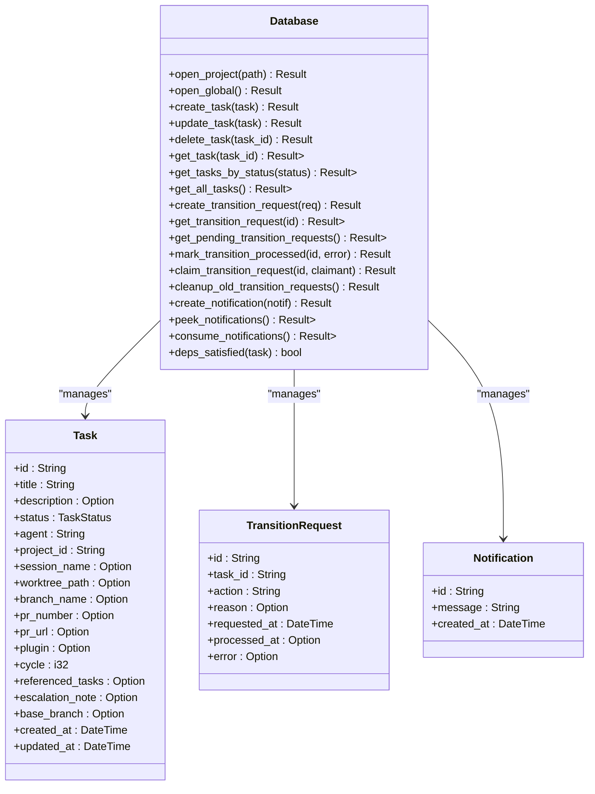
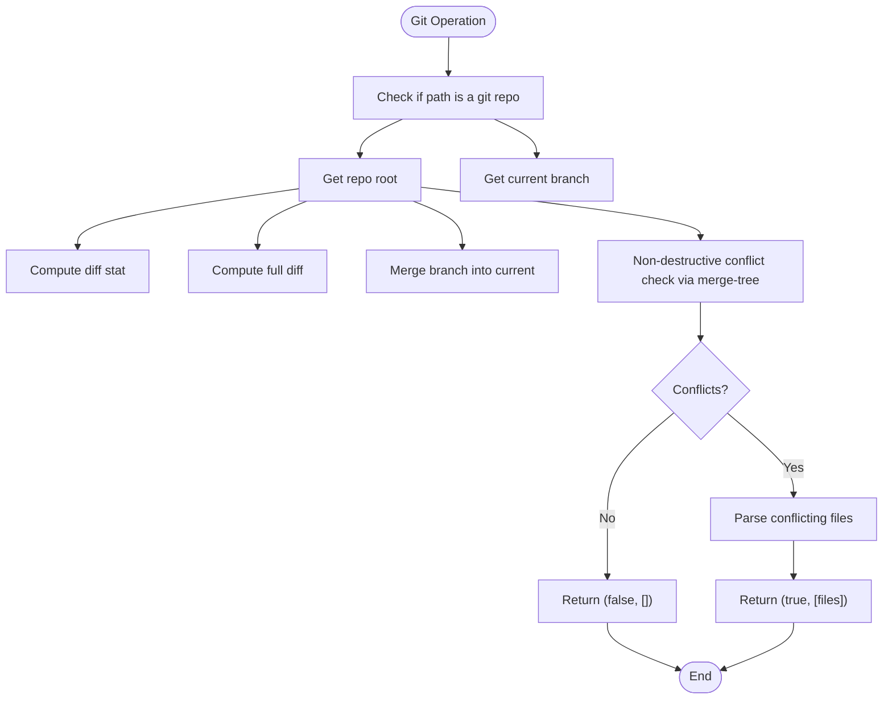
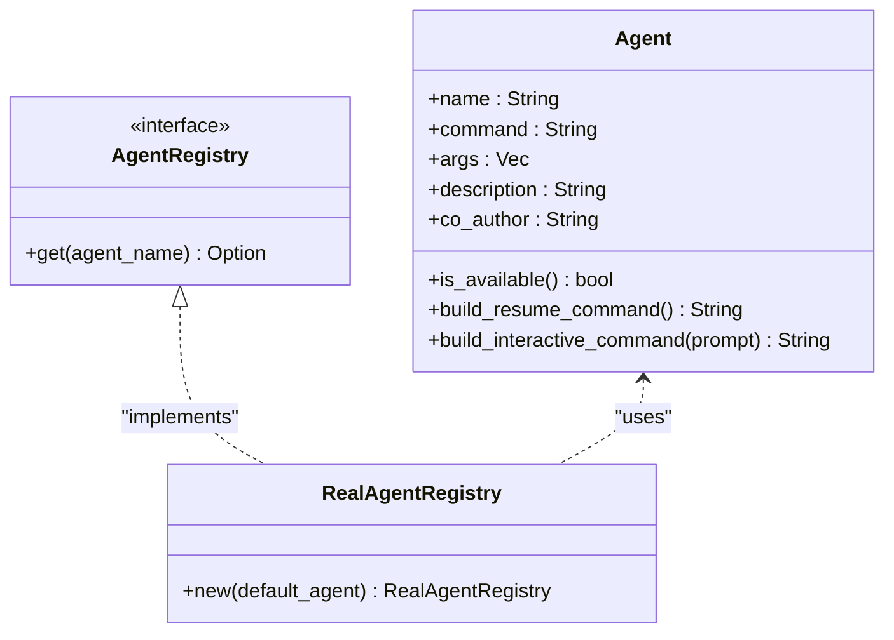
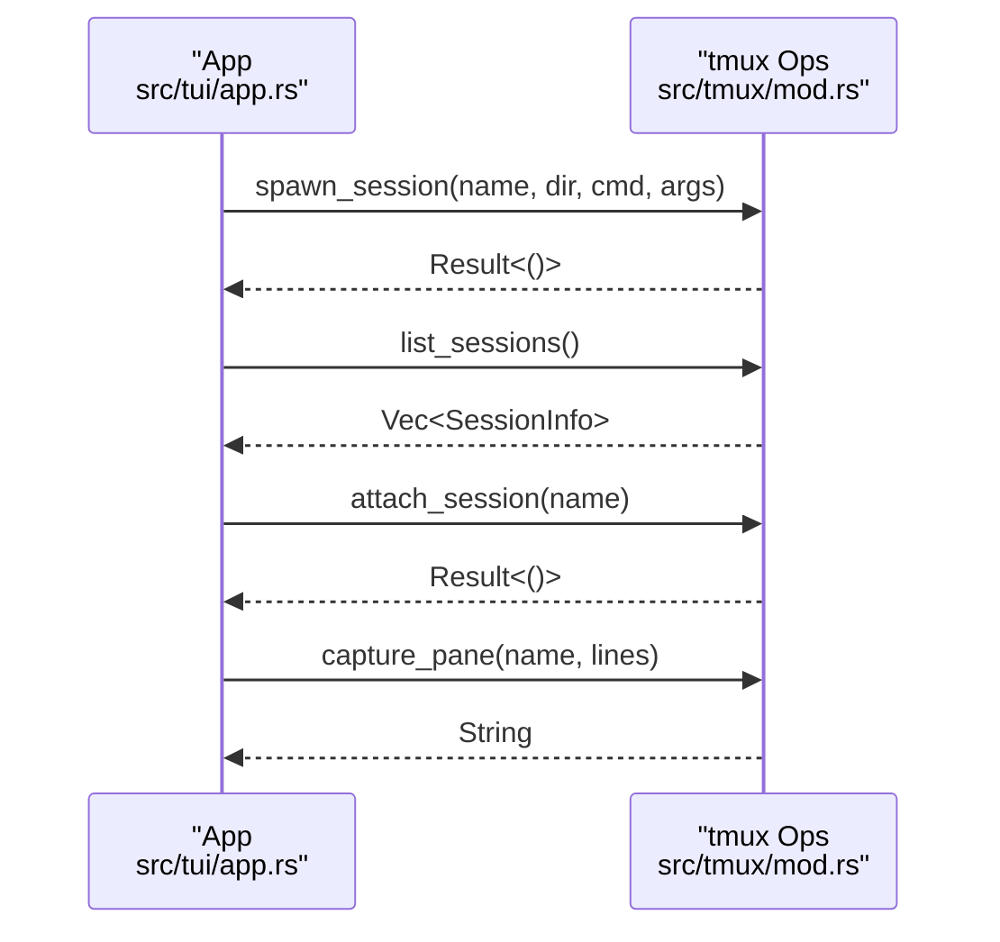
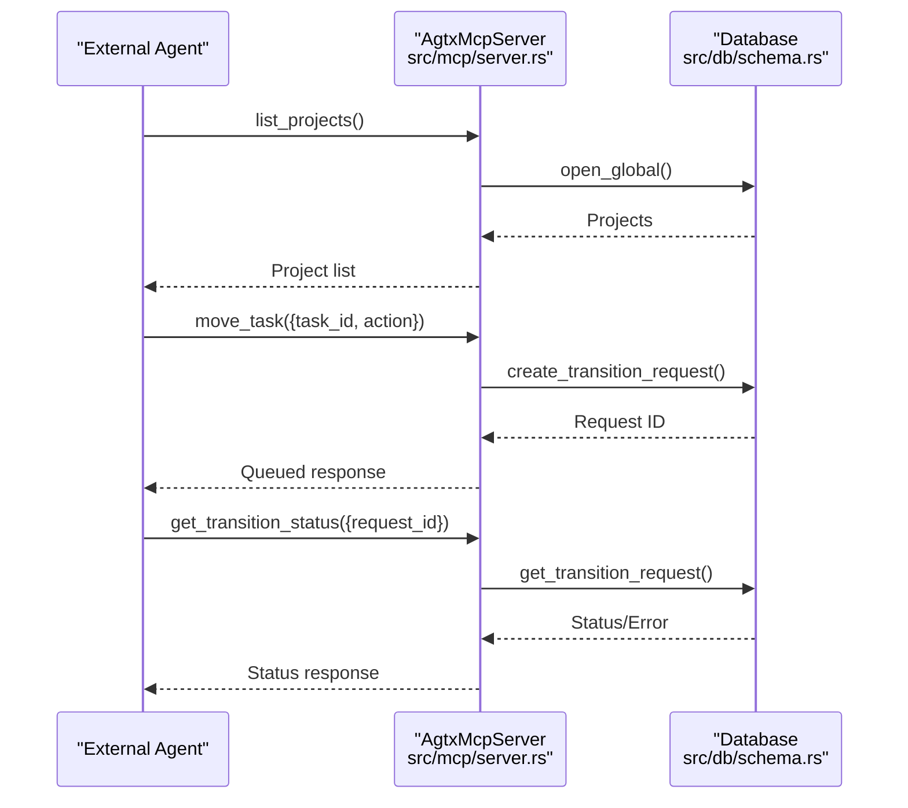
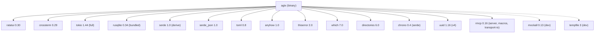

# Development Guide

<cite>
**Referenced Files in This Document**
- [Cargo.toml](file://Cargo.toml)
- [README.md](file://README.md)
- [CONTRIBUTING.md](file://CONTRIBUTING.md)
- [src/lib.rs](file://src/lib.rs)
- [src/main.rs](file://src/main.rs)
- [src/tui/mod.rs](file://src/tui/mod.rs)
- [src/tui/app.rs](file://src/tui/app.rs)
- [src/db/mod.rs](file://src/db/mod.rs)
- [src/db/models.rs](file://src/db/models.rs)
- [src/db/schema.rs](file://src/db/schema.rs)
- [src/git/mod.rs](file://src/git/mod.rs)
- [src/agent/mod.rs](file://src/agent/mod.rs)
- [src/mcp/mod.rs](file://src/mcp/mod.rs)
- [src/mcp/server.rs](file://src/mcp/server.rs)
- [src/tmux/mod.rs](file://src/tmux/mod.rs)
</cite>

## Table of Contents
1. [Introduction](#introduction)
2. [Project Structure](#project-structure)
3. [Core Components](#core-components)
4. [Architecture Overview](#architecture-overview)
5. [Detailed Component Analysis](#detailed-component-analysis)
6. [Dependency Analysis](#dependency-analysis)
7. [Performance Considerations](#performance-considerations)
8. [Testing Strategies](#testing-strategies)
9. [Contribution Workflow](#contribution-workflow)
10. [Development Best Practices](#development-best-practices)
11. [Debugging and Profiling](#debugging-and-profiling)
12. [Troubleshooting Guide](#troubleshooting-guide)
13. [Conclusion](#conclusion)

## Introduction
This development guide provides a comprehensive overview of the AGTX codebase, focusing on setting up a development environment, understanding the architecture, contributing features, and maintaining quality. AGTX is a terminal-native kanban board for managing coding agents, integrating TUI, Git, tmux, SQLite, and an MCP server for orchestrator capabilities.

## Project Structure
AGTX follows a modular Rust layout with clear separation of concerns:
- src/lib.rs: Library entry point exposing modules for agent, config, db, git, mcp, skills, tmux, and tui.
- src/main.rs: CLI entry point parsing arguments, determining mode (dashboard/project), and launching the TUI or MCP server.
- src/tui/: TUI application with rendering, input handling, and state management.
- src/db/: SQLite-backed persistence for tasks, projects, transition requests, and notifications.
- src/git/: Git operations for worktrees, branches, diffs, merges, and conflict detection.
- src/agent/: Agent detection, spawning, and command construction for supported coding agents.
- src/mcp/: MCP server implementation exposing board tools over stdio.
- src/tmux/: tmux session management for agent windows.
- tests/: Unit and integration tests, including mock-based testing with the test-mocks feature.

**Diagram sources**
- [src/main.rs:16-96](file://src/main.rs#L16-L96)
- [src/tui/app.rs:539-750](file://src/tui/app.rs#L539-L750)
- [src/db/schema.rs:8-68](file://src/db/schema.rs#L8-L68)
- [src/git/mod.rs:18-142](file://src/git/mod.rs#L18-L142)
- [src/tmux/mod.rs:11-189](file://src/tmux/mod.rs#L11-L189)
- [src/agent/mod.rs:80-130](file://src/agent/mod.rs#L80-L130)
- [src/mcp/server.rs:395-444](file://src/mcp/server.rs#L395-L444)

**Section sources**
- [src/lib.rs:1-24](file://src/lib.rs#L1-L24)
- [src/main.rs:16-96](file://src/main.rs#L16-L96)
- [src/tui/mod.rs:1-8](file://src/tui/mod.rs#L1-L8)
- [src/db/mod.rs:1-6](file://src/db/mod.rs#L1-L6)
- [src/git/mod.rs:1-142](file://src/git/mod.rs#L1-L142)
- [src/agent/mod.rs:1-171](file://src/agent/mod.rs#L1-L171)
- [src/mcp/mod.rs:1-5](file://src/mcp/mod.rs#L1-L5)
- [src/tmux/mod.rs:1-189](file://src/tmux/mod.rs#L1-L189)

## Core Components
- TUI Application: Manages board state, rendering, input handling, and orchestrates side effects (tmux, git, agent operations). See [src/tui/app.rs](file://src/tui/app.rs).
- Database Layer: SQLite-backed storage for tasks, projects, transition requests, and notifications. See [src/db/schema.rs](file://src/db/schema.rs).
- Git Operations: Worktree management, branch operations, diffs, merges, and non-destructive conflict checks. See [src/git/mod.rs](file://src/git/mod.rs).
- Agent Integration: Detection, command building, and registry for supported agents. See [src/agent/mod.rs](file://src/agent/mod.rs).
- tmux Management: Session lifecycle, pane capture, and agent attachment. See [src/tmux/mod.rs](file://src/tmux/mod.rs).
- MCP Server: JSON-RPC tools for listing projects/tasks, moving tasks, conflict checks, and notifications. See [src/mcp/server.rs](file://src/mcp/server.rs).

**Section sources**
- [src/tui/app.rs:539-750](file://src/tui/app.rs#L539-L750)
- [src/db/schema.rs:97-208](file://src/db/schema.rs#L97-L208)
- [src/git/mod.rs:18-142](file://src/git/mod.rs#L18-L142)
- [src/agent/mod.rs:80-130](file://src/agent/mod.rs#L80-L130)
- [src/tmux/mod.rs:11-189](file://src/tmux/mod.rs#L11-L189)
- [src/mcp/server.rs:395-520](file://src/mcp/server.rs#L395-L520)

## Architecture Overview
AGTX integrates a TUI for user interaction with a SQLite database for persistence, Git for worktrees and branches, tmux for agent sessions, and an MCP server for external orchestration. The CLI determines mode and launches either the TUI or MCP server.

**Diagram sources**
- [src/main.rs:16-96](file://src/main.rs#L16-L96)
- [src/mcp/server.rs:395-444](file://src/mcp/server.rs#L395-L444)
- [src/tui/app.rs:544-750](file://src/tui/app.rs#L544-L750)
- [src/db/schema.rs:12-68](file://src/db/schema.rs#L12-L68)
- [src/git/mod.rs:18-50](file://src/git/mod.rs#L18-L50)
- [src/tmux/mod.rs:11-48](file://src/tmux/mod.rs#L11-L48)
- [src/agent/mod.rs:124-130](file://src/agent/mod.rs#L124-L130)

## Detailed Component Analysis

### TUI Application
The TUI application encapsulates state, rendering, and event handling. It initializes terminal backends, loads configurations, sets up tmux sessions, and coordinates database operations and agent interactions.

**Diagram sources**
- [src/tui/app.rs:539-750](file://src/tui/app.rs#L539-L750)
- [src/tui/app.rs:243-355](file://src/tui/app.rs#L243-L355)

**Section sources**
- [src/tui/app.rs:539-750](file://src/tui/app.rs#L539-L750)
- [src/tui/app.rs:243-355](file://src/tui/app.rs#L243-L355)

### Database Layer
The database layer manages project and global schemas, task CRUD, transition requests, and notifications. It supports migrations and maintains referential integrity.

**Diagram sources**
- [src/db/schema.rs:8-68](file://src/db/schema.rs#L8-L68)
- [src/db/schema.rs:212-400](file://src/db/schema.rs#L212-L400)
- [src/db/schema.rs:480-554](file://src/db/schema.rs#L480-L554)
- [src/db/schema.rs:598-654](file://src/db/schema.rs#L598-L654)
- [src/db/models.rs:58-133](file://src/db/models.rs#L58-L133)
- [src/db/models.rs:159-184](file://src/db/models.rs#L159-L184)
- [src/db/models.rs:214-231](file://src/db/models.rs#L214-L231)

**Section sources**
- [src/db/schema.rs:97-208](file://src/db/schema.rs#L97-L208)
- [src/db/schema.rs:212-400](file://src/db/schema.rs#L212-L400)
- [src/db/schema.rs:480-554](file://src/db/schema.rs#L480-L554)
- [src/db/schema.rs:598-654](file://src/db/schema.rs#L598-L654)
- [src/db/models.rs:58-133](file://src/db/models.rs#L58-L133)
- [src/db/models.rs:159-184](file://src/db/models.rs#L159-L184)
- [src/db/models.rs:214-231](file://src/db/models.rs#L214-L231)

### Git Operations
Git operations provide repository checks, branch detection, diff computation, merges, and non-destructive conflict checks using merge-tree.

**Diagram sources**
- [src/git/mod.rs:18-142](file://src/git/mod.rs#L18-L142)

**Section sources**
- [src/git/mod.rs:18-142](file://src/git/mod.rs#L18-L142)

### Agent Integration
Agent integration detects available agents, builds interactive commands, and resumes sessions. Supported agents include Claude, Codex, Copilot, Gemini, OpenCode, and Cursor.

**Diagram sources**
- [src/agent/mod.rs:10-77](file://src/agent/mod.rs#L10-L77)
- [src/agent/mod.rs:124-130](file://src/agent/mod.rs#L124-L130)

**Section sources**
- [src/agent/mod.rs:10-77](file://src/agent/mod.rs#L10-L77)
- [src/agent/mod.rs:80-130](file://src/agent/mod.rs#L80-L130)

### tmux Management
tmux management handles session creation, listing, attaching, and pane capture. It sanitizes session names and provides safe session naming.

**Diagram sources**
- [src/tmux/mod.rs:15-131](file://src/tmux/mod.rs#L15-L131)
- [src/tui/app.rs:696-729](file://src/tui/app.rs#L696-L729)

**Section sources**
- [src/tmux/mod.rs:15-131](file://src/tmux/mod.rs#L15-L131)
- [src/tui/app.rs:696-729](file://src/tui/app.rs#L696-L729)

### MCP Server Implementation
The MCP server exposes tools for listing projects/tasks, moving tasks, conflict checks, and notifications. It supports both global and project-scoped modes.

**Diagram sources**
- [src/mcp/server.rs:521-755](file://src/mcp/server.rs#L521-L755)
- [src/db/schema.rs:480-554](file://src/db/schema.rs#L480-L554)

**Section sources**
- [src/mcp/server.rs:521-755](file://src/mcp/server.rs#L521-L755)
- [src/db/schema.rs:480-554](file://src/db/schema.rs#L480-L554)

## Dependency Analysis
AGTX uses a curated set of dependencies for TUI, async runtime, database, serialization, utilities, and MCP server. The Cargo manifest defines features for mock-based testing.

**Diagram sources**
- [Cargo.toml:12-50](file://Cargo.toml#L12-L50)

**Section sources**
- [Cargo.toml:12-50](file://Cargo.toml#L12-L50)

## Performance Considerations
- Asynchronous I/O: Tokio enables efficient concurrent operations for tmux, Git, and MCP interactions.
- Database indexing: SQLite indexes on task status and project ID optimize queries.
- Background refresh: Non-blocking phase status polling reduces UI latency.
- Minimal allocations: String interning and caching (phase status, pane content hashes) reduce overhead.
- Efficient conflict checks: Non-destructive merge-tree checks avoid expensive merges.

[No sources needed since this section provides general guidance]

## Testing Strategies
AGTX employs a hybrid testing approach:
- Unit tests: Pure function tests without mocks.
- Mock-based tests: Feature flag test-mocks enables mock traits for tmux, Git, and agent operations.
- Integration tests: End-to-end scenarios using temporary databases and controlled environments.

Recommended commands:
- Run all tests with mocks: cargo test --features test-mocks
- Run specific tests: cargo test --features test-mocks <test_name>

**Section sources**
- [CONTRIBUTING.md:94-104](file://CONTRIBUTING.md#L94-L104)
- [Cargo.toml:39-50](file://Cargo.toml#L39-L50)

## Contribution Workflow
Follow these steps to contribute:
1. Fork the repository and create a feature branch.
2. Implement changes with clear commit messages.
3. Run tests locally with cargo test --features test-mocks.
4. Open a pull request against main with a concise description and references to related issues.

Additional guidelines:
- Add tests for new functionality.
- Keep UI state in AppState and drawing functions static.
- Use anyhow::Result with .context() for error messages.

**Section sources**
- [CONTRIBUTING.md:63-70](file://CONTRIBUTING.md#L63-L70)
- [CONTRIBUTING.md:106-111](file://CONTRIBUTING.md#L106-L111)

## Development Best Practices
- Rust Programming:
  - Use anyhow::Result for error handling with contextual messages.
  - Prefer immutable data structures and functional patterns where appropriate.
  - Leverage serde for serialization and maintain backward compatibility in schemas.
- TUI Development with Ratatui:
  - Centralize UI state in AppState; keep render functions pure.
  - Use TestBackend for unit tests via the test-mocks feature.
- Asynchronous Programming with Tokio:
  - Offload blocking operations (tmux, Git) to blocking threads or async-friendly wrappers.
  - Use channels for background work and status updates.
- Database Design with SQLite:
  - Apply migrations for schema evolution.
  - Index frequently queried columns (status, project_id).
  - Use transactions for batch operations.

**Section sources**
- [CONTRIBUTING.md:106-111](file://CONTRIBUTING.md#L106-L111)
- [src/tui/app.rs:94-209](file://src/tui/app.rs#L94-L209)
- [src/db/schema.rs:97-180](file://src/db/schema.rs#L97-L180)

## Debugging and Profiling
- Logging: Use debug prints and structured logs for state transitions and errors.
- Interactive debugging: Utilize println! statements and breakpoints during development.
- Profiling: Profile CPU and memory usage using standard Rust profilers; focus on hot paths like tmux captures and Git operations.
- Database inspection: Query SQLite tables directly to verify state consistency.

[No sources needed since this section provides general guidance]

## Troubleshooting Guide
Common issues and resolutions:
- tmux server not running: Ensure tmux is installed and the AGENT_SERVER is available. Use list_sessions to verify.
- Git repository detection failures: Confirm the working directory is a valid git repository and main branch detection succeeds.
- MCP server registration: Verify project_id resolution and database connectivity in global mode.
- TUI rendering anomalies: Switch to TestBackend for unit tests and validate render logic independently.

**Section sources**
- [src/tmux/mod.rs:51-95](file://src/tmux/mod.rs#L51-L95)
- [src/git/mod.rs:18-50](file://src/git/mod.rs#L18-L50)
- [src/mcp/server.rs:413-429](file://src/mcp/server.rs#L413-L429)
- [src/tui/app.rs:94-209](file://src/tui/app.rs#L94-L209)

## Conclusion
This guide outlined the AGTX development environment, architecture, and contribution practices. By following the modular structure, leveraging Tokio for async operations, maintaining SQLite schemas with migrations, and employing robust testing strategies, contributors can extend AGTX effectively while preserving reliability and performance.