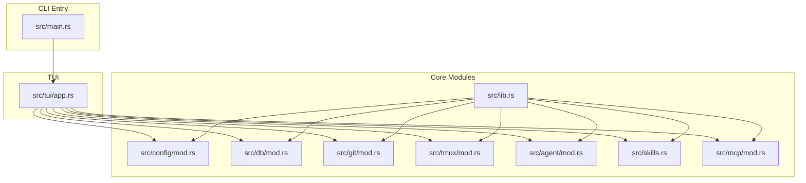
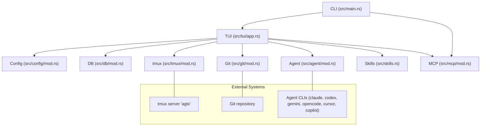
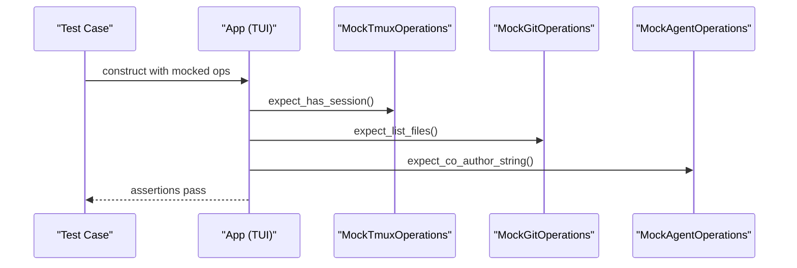
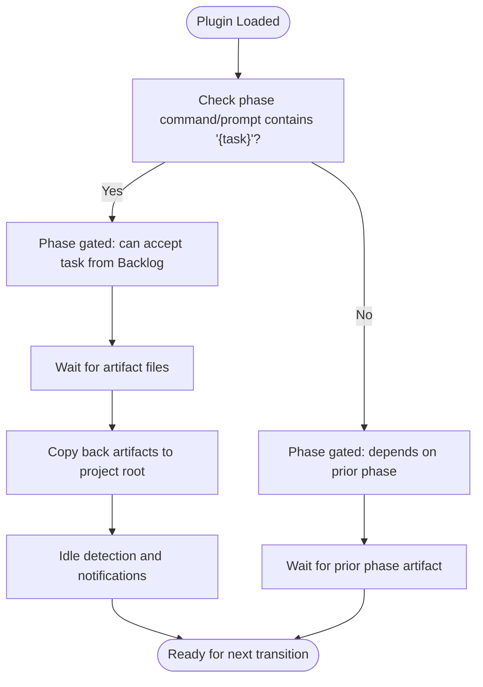
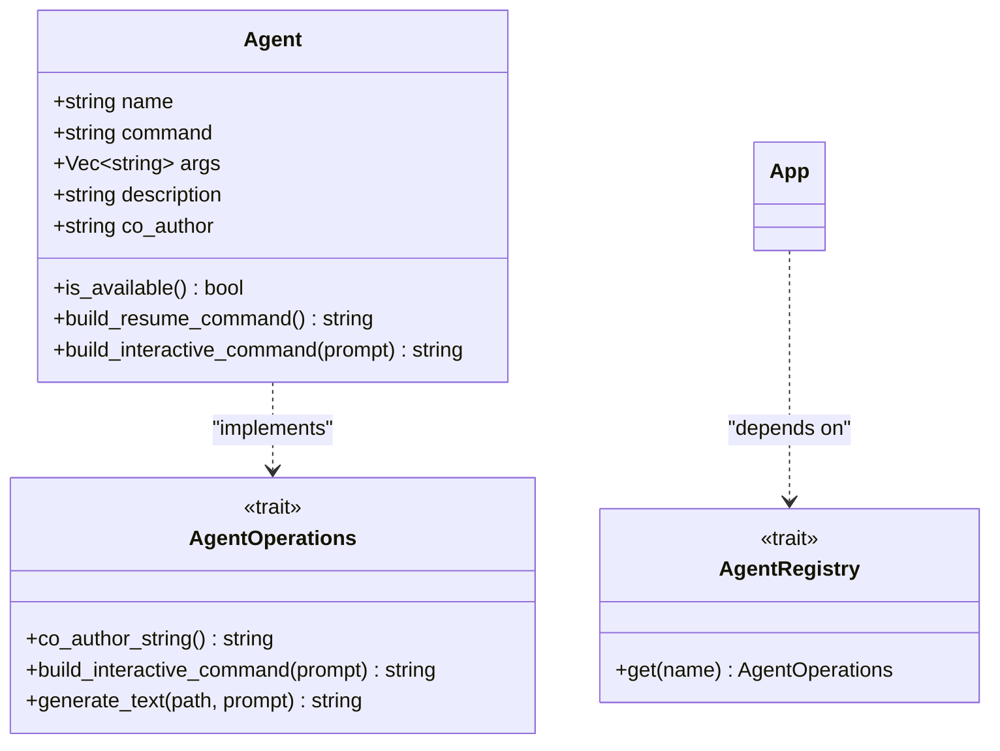
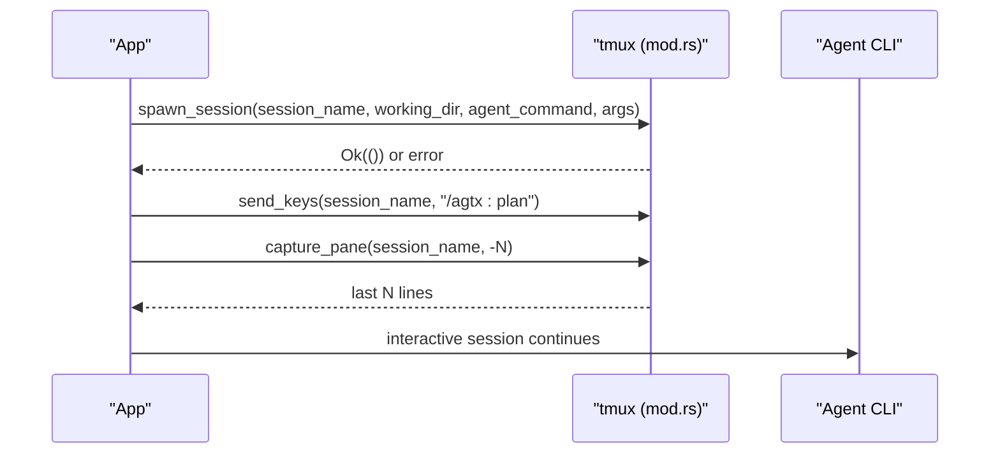
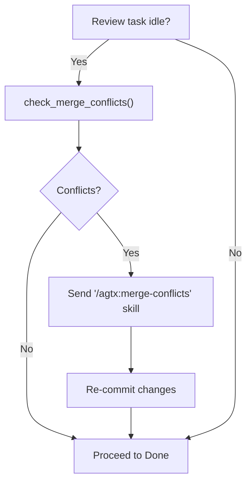
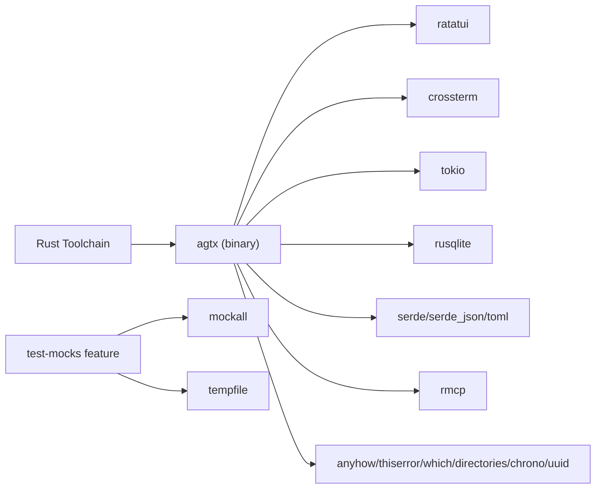

# Development and Contributing

<cite>
**Referenced Files in This Document**
- [CONTRIBUTING.md](file://CONTRIBUTING.md)
- [README.md](file://README.md)
- [Cargo.toml](file://Cargo.toml)
- [install.sh](file://install.sh)
- [src/lib.rs](file://src/lib.rs)
- [src/main.rs](file://src/main.rs)
- [src/tui/app.rs](file://src/tui/app.rs)
- [src/agent/mod.rs](file://src/agent/mod.rs)
- [src/skills.rs](file://src/skills.rs)
- [src/tmux/mod.rs](file://src/tmux/mod.rs)
- [src/git/mod.rs](file://src/git/mod.rs)
- [src/db/mod.rs](file://src/db/mod.rs)
- [src/config/mod.rs](file://src/config/mod.rs)
- [src/mcp/mod.rs](file://src/mcp/mod.rs)
- [tests/mock_infrastructure_tests.rs](file://tests/mock_infrastructure_tests.rs)
</cite>

## Table of Contents
1. [Introduction](#introduction)
2. [Project Structure](#project-structure)
3. [Core Components](#core-components)
4. [Architecture Overview](#architecture-overview)
5. [Detailed Component Analysis](#detailed-component-analysis)
6. [Dependency Analysis](#dependency-analysis)
7. [Performance Considerations](#performance-considerations)
8. [Troubleshooting Guide](#troubleshooting-guide)
9. [Conclusion](#conclusion)
10. [Appendices](#appendices)

## Introduction
This document provides a comprehensive guide for developers and contributors to set up a development environment, understand the architecture and conventions, and follow contribution processes for the project. It focuses on:
- Development environment prerequisites and setup
- Code organization, architectural patterns, and conventions
- Contribution workflow, including issue reporting, feature proposals, pull requests, and code review
- Plugin development lifecycle and agent integration patterns
- Testing infrastructure and requirements
- Release process, versioning, and deployment procedures
- Governance, maintainer responsibilities, and community engagement

## Project Structure
The project is a Rust application with a terminal UI (TUI), agent orchestration, tmux integration, Git worktrees, MCP server, and configuration management. Key areas:
- src/: Core modules for agent, config, database, git, MCP, skills, tmux, and TUI
- plugins/: Built-in and community plugins with TOML descriptors and optional skill files
- tests/: Unit and integration tests, including mock infrastructure tests
- Cargo.toml: Dependencies, features, and dev-dependencies
- install.sh: Installer script for distribution

**Diagram sources**
- [src/main.rs:1-228](file://src/main.rs#L1-L228)
- [src/lib.rs:1-24](file://src/lib.rs#L1-L24)
- [src/tui/app.rs:1-800](file://src/tui/app.rs#L1-L800)
- [src/config/mod.rs:1-595](file://src/config/mod.rs#L1-L595)
- [src/db/mod.rs:1-6](file://src/db/mod.rs#L1-L6)
- [src/git/mod.rs:1-142](file://src/git/mod.rs#L1-L142)
- [src/tmux/mod.rs:1-189](file://src/tmux/mod.rs#L1-L189)
- [src/agent/mod.rs:1-171](file://src/agent/mod.rs#L1-L171)
- [src/skills.rs:1-409](file://src/skills.rs#L1-L409)
- [src/mcp/mod.rs:1-5](file://src/mcp/mod.rs#L1-L5)

**Section sources**
- [src/lib.rs:1-24](file://src/lib.rs#L1-L24)
- [src/main.rs:1-228](file://src/main.rs#L1-L228)
- [README.md:506-547](file://README.md#L506-L547)

## Core Components
- CLI entrypoint and modes: The main module parses flags, determines mode (dashboard or project), and initializes the TUI. It also handles first-run configuration and MCP server mode.
- TUI application: The TUI orchestrates state, rendering, input handling, and integrates with tmux, Git, agent registries, and database.
- Agent integration: Defines known agents, detects availability, builds interactive commands, and maps plugin commands to agent-native formats.
- Skills and plugins: Provides built-in skills, transforms plugin commands per agent, and loads bundled plugins.
- tmux integration: Manages a dedicated tmux server for agent sessions, spawns sessions, attaches, captures panes, and sanitizes session names.
- Git integration: Validates repositories, resolves roots, branch names, diffs, merges, and non-destructive conflict checks.
- Configuration: Global and project-level configuration with merging logic, theme support, and plugin selection.
- MCP server: Exposes tools over stdio for orchestrator and skills integration.

**Section sources**
- [src/main.rs:16-96](file://src/main.rs#L16-L96)
- [src/tui/app.rs:744-759](file://src/tui/app.rs#L744-L759)
- [src/agent/mod.rs:10-171](file://src/agent/mod.rs#L10-L171)
- [src/skills.rs:12-194](file://src/skills.rs#L12-L194)
- [src/tmux/mod.rs:11-189](file://src/tmux/mod.rs#L11-L189)
- [src/git/mod.rs:18-142](file://src/git/mod.rs#L18-L142)
- [src/config/mod.rs:230-408](file://src/config/mod.rs#L230-L408)
- [src/mcp/mod.rs:1-5](file://src/mcp/mod.rs#L1-L5)

## Architecture Overview
The system centers around a TUI that drives agent sessions in tmux, coordinates Git worktrees, and applies plugin-defined workflows. The MCP server exposes board tools to agents and orchestrators.

**Diagram sources**
- [src/tui/app.rs:744-759](file://src/tui/app.rs#L744-L759)
- [src/main.rs:16-96](file://src/main.rs#L16-L96)
- [src/tmux/mod.rs:11-189](file://src/tmux/mod.rs#L11-L189)
- [src/git/mod.rs:18-142](file://src/git/mod.rs#L18-L142)
- [src/agent/mod.rs:10-171](file://src/agent/mod.rs#L10-L171)
- [src/skills.rs:12-194](file://src/skills.rs#L12-L194)
- [src/config/mod.rs:230-408](file://src/config/mod.rs#L230-L408)
- [src/mcp/mod.rs:1-5](file://src/mcp/mod.rs#L1-L5)

## Detailed Component Analysis

### Development Environment Setup
- Prerequisites
  - Rust 1.70+ via rustup
  - tmux (runtime dependency for agent sessions)
  - git (runtime dependency for worktrees)
  - gh CLI (optional, for PR operations)
- Local setup
  - Clone repository, build with cargo build, run tests with cargo test --features test-mocks
  - Run locally in any git repository or build a release binary and place it on PATH
- Installer script
  - install.sh detects OS/architecture, fetches latest release, installs binary, and checks dependencies

**Section sources**
- [CONTRIBUTING.md:9-34](file://CONTRIBUTING.md#L9-L34)
- [README.md:100-104](file://README.md#L100-L104)
- [install.sh:1-176](file://install.sh#L1-L176)

### Code Organization and Architectural Patterns
- Layered modules
  - src/lib.rs re-exports modules and defines shared types (AppMode, FeatureFlags)
  - src/main.rs orchestrates CLI parsing, mode selection, and TUI initialization
  - src/tui/app.rs encapsulates UI state, rendering, and event handling
  - Domain modules (agent, config, db, git, mcp, skills, tmux) isolate concerns
- Dependency injection and testability
  - Traits (AgentOperations, GitOperations, GitProviderOperations, TmuxOperations) enable injecting mocks behind the test-mocks feature flag
  - App::with_ops demonstrates constructor injection for testability
- Feature flags
  - test-mocks feature enables mockall and TestBackend for unit tests
- Conventions
  - anyhow::Result with .context() for error handling
  - UI state centralized in AppState; drawing functions remain pure/static
  - Add tests for new functionality

**Section sources**
- [src/lib.rs:10-24](file://src/lib.rs#L10-L24)
- [src/main.rs:16-96](file://src/main.rs#L16-L96)
- [src/tui/app.rs:744-759](file://src/tui/app.rs#L744-L759)
- [Cargo.toml:39-50](file://Cargo.toml#L39-L50)
- [CONTRIBUTING.md:106-112](file://CONTRIBUTING.md#L106-L112)

### Testing Infrastructure
- Mock traits and feature flag
  - Tests use mockall-generated mocks behind the test-mocks feature
  - Mocks are injected via Arc<dyn Trait> to simulate real operations
- Example test coverage
  - Mock infrastructure tests verify expectations and thread-safe Arc wrapping
  - Git operations, tmux session management, and agent operations are covered
- Running tests
  - cargo test --features test-mocks for full suite
  - Specific tests via cargo test --features test-mocks <test_name>

**Diagram sources**
- [tests/mock_infrastructure_tests.rs:19-63](file://tests/mock_infrastructure_tests.rs#L19-L63)
- [tests/mock_infrastructure_tests.rs:96-146](file://tests/mock_infrastructure_tests.rs#L96-L146)
- [tests/mock_infrastructure_tests.rs:148-175](file://tests/mock_infrastructure_tests.rs#L148-L175)

**Section sources**
- [tests/mock_infrastructure_tests.rs:1-220](file://tests/mock_infrastructure_tests.rs#L1-L220)
- [CONTRIBUTING.md:94-104](file://CONTRIBUTING.md#L94-L104)

### Plugin Development Lifecycle
- Plugin definition
  - Place plugin.toml in .agtx/plugins/<name>/plugin.toml (project-local) or ~/.config/agtx/plugins/<name>/plugin.toml (global)
  - Minimal to full reference available in the README, including commands, prompts, artifacts, copy_back, auto_dismiss, and cyclic workflows
- Agent compatibility
  - Commands are written in canonical format and transformed per agent (e.g., Claude/Gemini vs. Codex vs. OpenCode)
- Skill deployment
  - Built-in skills are embedded at compile time; plugins can supply custom skills under skills/ directory
- Phase gating and transitions
  - Plugins gate phases based on presence of {task} in commands/prompts and artifact detection
  - Cyclic workflows enable Review → Planning transitions with phase counters

**Diagram sources**
- [src/config/mod.rs:512-543](file://src/config/mod.rs#L512-L543)
- [src/skills.rs:83-115](file://src/skills.rs#L83-L115)
- [README.md:370-504](file://README.md#L370-L504)

**Section sources**
- [README.md:329-504](file://README.md#L329-L504)
- [src/skills.rs:31-115](file://src/skills.rs#L31-L115)
- [src/config/mod.rs:410-595](file://src/config/mod.rs#L410-L595)

### Agent Integration Patterns
- Known agents and detection
  - known_agents() enumerates supported agents; detect_available_agents() filters by availability
- Interactive command building
  - build_interactive_command() constructs agent-specific commands with optional initial prompts
- Command transformation
  - transform_plugin_command() maps canonical commands (/namespace:command) to agent-native forms
- Native skill directories
  - agent_native_skill_dir() and scan_agent_skills() discover agent-native skills

**Diagram sources**
- [src/agent/mod.rs:10-171](file://src/agent/mod.rs#L10-L171)
- [src/tui/app.rs:744-759](file://src/tui/app.rs#L744-L759)

**Section sources**
- [src/agent/mod.rs:10-171](file://src/agent/mod.rs#L10-L171)
- [src/skills.rs:31-115](file://src/skills.rs#L31-L115)
- [src/tui/app.rs:744-759](file://src/tui/app.rs#L744-L759)

### tmux Configuration and Operations
- Dedicated server and naming
  - All sessions run on tmux server "agtx"
  - Session names sanitized via safe_session_name()
- Operations
  - spawn_session(), list_sessions(), session_exists(), capture_pane(), send_keys(), attach_session(), kill_session()
- TUI integration
  - App manages per-task windows and persistent agent sessions

**Diagram sources**
- [src/tmux/mod.rs:14-189](file://src/tmux/mod.rs#L14-L189)
- [src/tui/app.rs:744-759](file://src/tui/app.rs#L744-L759)

**Section sources**
- [src/tmux/mod.rs:11-189](file://src/tmux/mod.rs#L11-L189)
- [README.md:549-564](file://README.md#L549-L564)

### Git Worktrees and Conflict Resolution
- Validation and metadata
  - is_git_repo(), repo_root(), current_branch(), diff_stat(), diff_full(), merge_branch()
- Non-destructive conflict detection
  - check_merge_conflicts() uses git merge-tree to detect conflicts without modifying working trees
- TUI automation
  - On idle Review tasks, the system can trigger merge-conflicts skill and re-commit

**Diagram sources**
- [src/git/mod.rs:89-128](file://src/git/mod.rs#L89-L128)
- [src/skills.rs:8-10](file://src/skills.rs#L8-L10)

**Section sources**
- [src/git/mod.rs:18-142](file://src/git/mod.rs#L18-L142)
- [README.md:164-164](file://README.md#L164-L164)

### Configuration Management
- Global and project configs
  - GlobalConfig (stored in ~/.config/agtx/config.toml) and ProjectConfig (in .agtx/config.toml)
  - MergedConfig combines global and project settings with explicit phase overrides
- First-run logic
  - determine_first_run_action() decides whether to prompt for agent selection, migrate old config, or save defaults

**Section sources**
- [src/config/mod.rs:230-408](file://src/config/mod.rs#L230-L408)
- [src/main.rs:63-89](file://src/main.rs#L63-L89)

### MCP Server and Orchestrator Integration
- MCP server modes
  - Global mode: agtx mcp-serve (works across projects)
  - Project-scoped mode: agtx mcp-serve <path> (bound to one project)
- Tools exposed
  - list_projects, list_tasks, get_task, create_task, update_task, delete_task, move_task, get_transition_status, check_conflicts, get_notifications, read_pane_content, send_to_task
- Orchestrator agent
  - Pushes notifications when tasks become idle; advances phases based on allowed_actions; escalates to user when stuck

**Section sources**
- [README.md:573-646](file://README.md#L573-L646)
- [src/mcp/mod.rs:1-5](file://src/mcp/mod.rs#L1-L5)

## Dependency Analysis
- External dependencies
  - TUI: ratatui, crossterm
  - Async runtime: tokio
  - Database: rusqlite (bundled)
  - Serialization: serde, serde_json, toml
  - Utilities: anyhow, thiserror, which, directories, chrono, uuid
  - MCP server: rmcp (server, macros, transport-io)
- Optional dev/test dependencies
  - mockall, tempfile for tests and mock infrastructure
- Feature flags
  - test-mocks enables mockall for trait mocking

**Diagram sources**
- [Cargo.toml:12-50](file://Cargo.toml#L12-L50)

**Section sources**
- [Cargo.toml:12-50](file://Cargo.toml#L12-L50)

## Performance Considerations
- Asynchronous operations
  - Tokio runtime powers async I/O for tmux, Git, and MCP interactions
- Efficient UI rendering
  - Ratatui backend abstraction and redraw strategies minimize terminal writes
- Non-destructive conflict checks
  - git merge-tree avoids expensive rebase or reset operations
- Test isolation
  - Mocks reduce I/O overhead in unit tests

[No sources needed since this section provides general guidance]

## Troubleshooting Guide
- Missing dependencies
  - Ensure tmux, git, and gh are installed; the installer script checks and reports missing tools
- tmux server issues
  - Use tmux -L agtx list-sessions and attach to debug agent sessions
- Permission errors
  - Verify agent CLIs are installed and executable; check agent availability via detect_available_agents()
- Test failures
  - Run cargo test --features test-mocks and inspect mock expectations in tests/mock_infrastructure_tests.rs

**Section sources**
- [install.sh:145-171](file://install.sh#L145-L171)
- [README.md:555-564](file://README.md#L555-L564)
- [src/agent/mod.rs:124-130](file://src/agent/mod.rs#L124-L130)
- [tests/mock_infrastructure_tests.rs:19-63](file://tests/mock_infrastructure_tests.rs#L19-L63)

## Conclusion
This guide outlined the development environment setup, architectural patterns, testing infrastructure, plugin lifecycle, agent integration, and contribution processes. By following the conventions and using the provided testing and installer utilities, contributors can efficiently develop features, plugins, and integrations while maintaining code quality and reliability.

[No sources needed since this section summarizes without analyzing specific files]

## Appendices

### Contribution Process
- Bug reports
  - Open an issue with expected vs. actual behavior, reproduction steps, OS, terminal emulator, and agent CLI versions
- Plugin contributions
  - Place plugin.toml in plugins/<name>/plugin.toml or .agtx/plugins/<name>/plugin.toml; refer to the README’s plugin reference
- Agent additions
  - Update known_agents(), build_interactive_command(), agent_native_skill_dir(), and transform_plugin_command() as documented
- Code changes
  - Fork, branch, implement, run cargo test --features test-mocks, and open a PR against main

**Section sources**
- [CONTRIBUTING.md:38-70](file://CONTRIBUTING.md#L38-L70)
- [README.md:647-674](file://README.md#L647-L674)

### Release Process and Versioning
- Versioning
  - Version is defined in Cargo.toml; releases are published via GitHub Releases
- Installer
  - install.sh fetches the latest release and installs the binary to ~/.local/bin
- CI/CD
  - GitHub Actions workflows drive continuous integration and release automation

**Section sources**
- [Cargo.toml:1-10](file://Cargo.toml#L1-L10)
- [install.sh:55-87](file://install.sh#L55-L87)
- [README.md:17-18](file://README.md#L17-L18)

### Community Engagement and Governance
- Good first issues
  - Explore issues labeled “good first issue” for beginner-friendly tasks
- Licensing
  - Contributions are licensed under Apache License 2.0

**Section sources**
- [CONTRIBUTING.md:5](file://CONTRIBUTING.md#L5)
- [CONTRIBUTING.md:113-116](file://CONTRIBUTING.md#L113-L116)