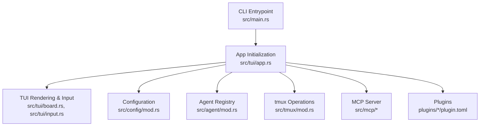
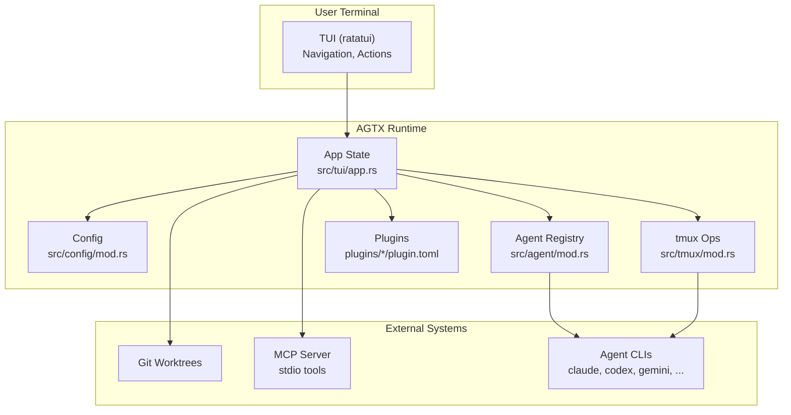
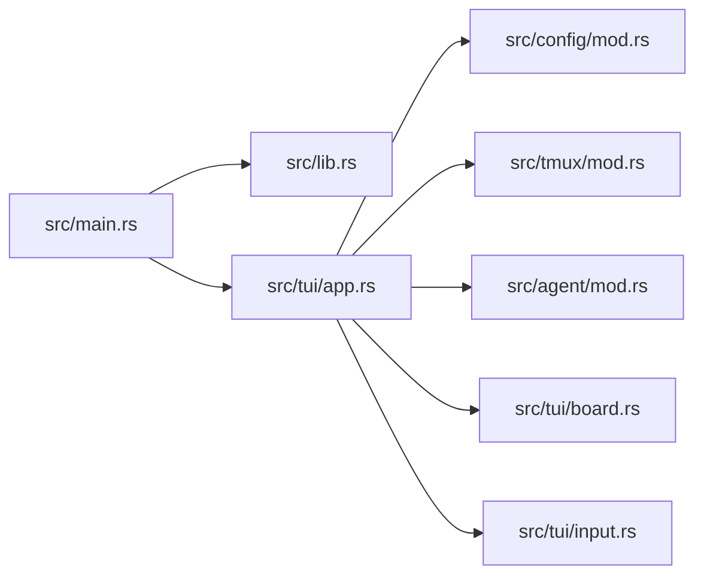

# Getting Started

<cite>
**Referenced Files in This Document**
- [README.md](file://README.md)
- [install.sh](file://install.sh)
- [Cargo.toml](file://Cargo.toml)
- [src/main.rs](file://src/main.rs)
- [src/lib.rs](file://src/lib.rs)
- [src/tui/app.rs](file://src/tui/app.rs)
- [src/tui/board.rs](file://src/tui/board.rs)
- [src/tui/input.rs](file://src/tui/input.rs)
- [src/config/mod.rs](file://src/config/mod.rs)
- [src/tmux/mod.rs](file://src/tmux/mod.rs)
- [src/agent/mod.rs](file://src/agent/mod.rs)
- [plugins/void/plugin.toml](file://plugins/void/plugin.toml)
- [plugins/agtx/plugin.toml](file://plugins/agtx/plugin.toml)
</cite>

## Table of Contents
1. [Introduction](#introduction)
2. [Project Structure](#project-structure)
3. [Core Components](#core-components)
4. [Architecture Overview](#architecture-overview)
5. [Detailed Component Analysis](#detailed-component-analysis)
6. [Dependency Analysis](#dependency-analysis)
7. [Performance Considerations](#performance-considerations)
8. [Troubleshooting Guide](#troubleshooting-guide)
9. [Conclusion](#conclusion)
10. [Appendices](#appendices)

## Introduction
AGTX is a terminal-native kanban board for managing coding agents. It orchestrates tasks across phases (Backlog, Planning, Running, Review, Done) using tmux sessions and git worktrees. Users can operate in guided modes (standard board) or opt into experimental orchestration where an AI agent advances tasks automatically. The system integrates with multiple agent CLIs and exposes an MCP server for skills like brainstorming and sweeping.

## Project Structure
At a high level, AGTX consists of:
- CLI entrypoint and mode routing
- TUI for navigation and task management
- Configuration system for global and project settings
- Agent integration and detection
- tmux operations for persistent agent sessions
- MCP server for external agent integrations
- Plugins defining workflow phases and artifacts

**Diagram sources**
- [src/main.rs:16-96](file://src/main.rs#L16-L96)
- [src/tui/app.rs:506-708](file://src/tui/app.rs#L506-L708)
- [src/config/mod.rs:230-303](file://src/config/mod.rs#L230-L303)
- [src/agent/mod.rs:124-130](file://src/agent/mod.rs#L124-L130)
- [src/tmux/mod.rs:11-48](file://src/tmux/mod.rs#L11-L48)

**Section sources**
- [src/main.rs:16-96](file://src/main.rs#L16-L96)
- [src/lib.rs:12-23](file://src/lib.rs#L12-L23)

## Core Components
- CLI and Modes
  - Determines mode from arguments: project, dashboard, or MCP server.
  - Supports an experimental flag for orchestrator features.
- TUI
  - Renders columns and tasks, handles keyboard navigation and actions.
  - Provides popups for diffs, PR creation, and task search.
- Configuration
  - Global config under ~/.config/agtx/config.toml.
  - Project config under .agtx/config.toml.
  - Merges global and project settings.
- Agents
  - Detects available agent CLIs and builds resume/interactive commands.
- tmux
  - Manages a dedicated server for agent sessions and windows.
- Plugins
  - Define commands, prompts, artifacts, and phase gating.

**Section sources**
- [src/main.rs:30-59](file://src/main.rs#L30-L59)
- [src/tui/app.rs:506-708](file://src/tui/app.rs#L506-L708)
- [src/config/mod.rs:230-408](file://src/config/mod.rs#L230-L408)
- [src/agent/mod.rs:124-130](file://src/agent/mod.rs#L124-L130)
- [src/tmux/mod.rs:11-48](file://src/tmux/mod.rs#L11-L48)
- [plugins/agtx/plugin.toml:1-16](file://plugins/agtx/plugin.toml#L1-L16)

## Architecture Overview
AGTX runs a TUI that coordinates tasks across phases. Each task runs in its own tmux window with a dedicated agent. Plugins define commands and prompts per phase, artifacts mark completion, and git worktrees isolate changes. The MCP server exposes board tools to external agents.

**Diagram sources**
- [src/tui/app.rs:506-708](file://src/tui/app.rs#L506-L708)
- [src/config/mod.rs:355-408](file://src/config/mod.rs#L355-L408)
- [src/tmux/mod.rs:11-48](file://src/tmux/mod.rs#L11-L48)
- [src/agent/mod.rs:124-130](file://src/agent/mod.rs#L124-L130)
- [plugins/agtx/plugin.toml:1-16](file://plugins/agtx/plugin.toml#L1-L16)

## Detailed Component Analysis

### Installation Methods
- Curl script installation
  - Downloads the latest prebuilt binary for your OS/architecture and installs it to ~/.local/bin.
  - Checks dependencies (tmux, git) and optionally available agent/gh tools.
- Manual compilation from source
  - Requires Rust toolchain; builds a release binary and copies it to a directory in PATH.
- Package manager options
  - The repository does not include package manager recipes; use the curl script or compile from source.

Step-by-step:
1. Install dependencies: tmux, git.
2. Install AGTX via curl script or cargo build --release.
3. Verify installation by running agtx in a git repository.

Notes:
- The installer checks PATH and suggests adding ~/.local/bin if missing.
- Optional: install gh for PR operations; optional agent CLIs for integration.

**Section sources**
- [README.md:73-98](file://README.md#L73-L98)
- [install.sh:62-173](file://install.sh#L62-L173)
- [Cargo.toml:12-34](file://Cargo.toml#L12-L34)

### System Requirements
- Required
  - tmux: agent sessions run in a dedicated tmux server.
  - git: worktrees and repository operations.
- Optional
  - gh: GitHub CLI for PR operations.
  - Agent CLIs: claude, codex, gemini, opencode, cursor, copilot for integration.

Verification:
- The installer prints dependency status and warnings for missing optional tools.

**Section sources**
- [README.md:100-104](file://README.md#L100-L104)
- [install.sh:145-171](file://install.sh#L145-L171)

### First-Time Setup and Initial Configuration
- First-run behavior
  - If no config exists and no database is found, the app prompts you to select a default agent.
  - Existing users with a database get defaults saved silently.
  - Old config locations are migrated automatically.
- Global configuration
  - Stored at ~/.config/agtx/config.toml.
  - Includes default_agent, per-phase agent overrides, worktree settings, theme, and fullscreen preference.
- Project configuration
  - Stored at .agtx/config.toml in the project root.
  - Overrides global settings for that project (base_branch, worktree_dir, copy_files, init_script, cleanup_script, workflow_plugin).

Practical steps:
1. Run agtx in a git repository to initialize project data.
2. On first launch, choose your default agent if prompted.
3. Optionally edit ~/.config/agtx/config.toml and .agtx/config.toml to customize behavior.

**Section sources**
- [src/main.rs:63-89](file://src/main.rs#L63-L89)
- [src/config/mod.rs:230-303](file://src/config/mod.rs#L230-L303)
- [src/config/mod.rs:355-408](file://src/config/mod.rs#L355-L408)
- [README.md:261-303](file://README.md#L261-L303)

### Running AGTX in Different Modes

#### Standard Kanban Board
- Launch in a project directory to open the board for that project.
- Navigate columns (Backlog, Planning, Running, Review, Done) and tasks.
- Use keyboard shortcuts to create, move, and inspect tasks.

Example commands:
- agtx (in a git repo)
- agtx -g (dashboard mode across projects)

**Section sources**
- [README.md:73-89](file://README.md#L73-L89)
- [src/main.rs:47-58](file://src/main.rs#L47-L58)

#### Dashboard Mode (Multiple Projects)
- Opens a multi-project view to manage sessions across repositories.
- Useful for switching between tasks in different repos.

Example command:
- agtx -g

**Section sources**
- [README.md:83-85](file://README.md#L83-L85)
- [src/main.rs:47](file://src/main.rs#L47)

#### Experimental Orchestrator Mode
- Press O in the TUI to toggle the orchestrator agent.
- The orchestrator advances tasks automatically as phases complete.
- Requires the experimental flag; integrates with the MCP server.

Example command:
- agtx --experimental (then press O)

**Section sources**
- [README.md:604-621](file://README.md#L604-L621)
- [README.md:638-646](file://README.md#L638-L646)
- [src/lib.rs:18-23](file://src/lib.rs#L18-L23)

### Basic Workflow: From Task Creation to Completion
- Create a task
  - Press o to start the wizard; enter title, select plugin, and write a description with inline references.
- Advance phases
  - Move tasks forward (Planning → Running → Review) using keyboard shortcuts.
  - Review can move back to Running if needed.
- Inspect and interact
  - Press Enter to open a task popup showing agent output.
  - Use Ctrl+f to fullscreen attach to the agent’s tmux window.
- Complete and merge
  - When ready, move to Done and optionally create a PR if configured.

Keyboard shortcuts overview:
- h/l or ←/→: move between columns
- j/k or ↑/↓: move between tasks
- o: create new task
- R: enter research mode
- ↩: open task (view agent session)
- Ctrl+f: fullscreen attach to task’s tmux session
- m: move task forward in workflow
- r: resume task (Review → Running) / move back (Running → Planning)
- p: next phase (Review → Planning, cyclic plugins only)
- d: show git diff
- x: delete task
- /: search tasks
- P: select spec-driven workflow plugin
- O: toggle orchestrator agent
- e: toggle project sidebar
- q: quit

**Section sources**
- [README.md:105-141](file://README.md#L105-L141)
- [README.md:156-164](file://README.md#L156-L164)
- [src/tui/board.rs:52-91](file://src/tui/board.rs#L52-L91)
- [src/tui/input.rs:2-12](file://src/tui/input.rs#L2-L12)

### Practical Examples

#### Example 1: Standard Kanban Board
- Initialize a project and run AGTX:
  - cd your-project && agtx
- Create a task:
  - Press o, enter a title, pick a plugin, write a description.
- Move a task:
  - Select the task and press m to advance.

**Section sources**
- [README.md:73-81](file://README.md#L73-L81)
- [README.md:105-141](file://README.md#L105-L141)

#### Example 2: Dashboard Mode
- Manage multiple projects:
  - agtx -g
- Switch between projects using the sidebar.

**Section sources**
- [README.md:83-85](file://README.md#L83-L85)
- [src/main.rs:47](file://src/main.rs#L47)

#### Example 3: Experimental Orchestrator Mode
- Enable orchestrator:
  - agtx --experimental
  - Press O in the TUI to toggle.
- Observe automatic advancement as phases complete.

**Section sources**
- [README.md:604-621](file://README.md#L604-L621)
- [src/lib.rs:18-23](file://src/lib.rs#L18-L23)

### Tmux and Session Management
- AGTX runs a dedicated tmux server named “agtx”.
- Each project has its own tmux session; each task has its own window.
- You can list, attach, or kill sessions using tmux -L agtx.

Common commands:
- List sessions: tmux -L agtx list-sessions
- List windows: tmux -L agtx list-windows -a
- Attach to server: tmux -L agtx attach

**Section sources**
- [README.md:549-564](file://README.md#L549-L564)
- [src/tmux/mod.rs:51-84](file://src/tmux/mod.rs#L51-L84)

### Plugins and Workflow Phases
- Plugins define commands, prompts, and artifacts per phase.
- Example plugins:
  - void: plain agent session without prompting.
  - agtx: built-in workflow with research, plan, execute, review artifacts.

Key plugin fields:
- commands: slash commands per phase.
- prompts: task content sent after commands.
- artifacts: files indicating phase completion.

**Section sources**
- [plugins/void/plugin.toml:1-4](file://plugins/void/plugin.toml#L1-L4)
- [plugins/agtx/plugin.toml:1-16](file://plugins/agtx/plugin.toml#L1-L16)
- [src/config/mod.rs:410-451](file://src/config/mod.rs#L410-L451)

## Dependency Analysis
- CLI parsing and mode routing
  - Determines project/dashboard/MCP modes and experimental flag.
- TUI initialization
  - Loads global/project config, detects agents, sets up tmux sessions, and initializes state.
- Configuration merging
  - Merges global and project settings; applies defaults and overrides.
- Agent integration
  - Detects available agent CLIs and constructs commands for resume/interactive sessions.
- tmux operations
  - Spawns, lists, captures panes, attaches, and kills sessions on the “agtx” server.

**Diagram sources**
- [src/main.rs:16-96](file://src/main.rs#L16-L96)
- [src/lib.rs:12-23](file://src/lib.rs#L12-L23)
- [src/tui/app.rs:506-708](file://src/tui/app.rs#L506-L708)
- [src/config/mod.rs:355-408](file://src/config/mod.rs#L355-L408)
- [src/tmux/mod.rs:11-48](file://src/tmux/mod.rs#L11-L48)
- [src/agent/mod.rs:124-130](file://src/agent/mod.rs#L124-L130)
- [src/tui/board.rs:11-91](file://src/tui/board.rs#L11-L91)
- [src/tui/input.rs:2-12](file://src/tui/input.rs#L2-L12)

**Section sources**
- [src/main.rs:16-96](file://src/main.rs#L16-L96)
- [src/tui/app.rs:506-708](file://src/tui/app.rs#L506-L708)
- [src/config/mod.rs:355-408](file://src/config/mod.rs#L355-L408)
- [src/agent/mod.rs:124-130](file://src/agent/mod.rs#L124-L130)
- [src/tmux/mod.rs:11-48](file://src/tmux/mod.rs#L11-L48)

## Performance Considerations
- tmux server overhead: Each task spawns a tmux window; keep sessions organized.
- Plugin artifact polling: Completion detection relies on file presence; ensure artifact paths are accurate.
- Agent switching: Frequent agent changes can introduce latency; consolidate agent usage per phase when possible.
- Large diffs: Use the diff popup to inspect changes efficiently rather than scanning raw tmux output.

## Troubleshooting Guide
- Installation issues
  - Missing dependencies: Ensure tmux and git are installed and in PATH.
  - PATH not containing ~/.local/bin: The installer warns and prints export instructions.
  - Unsupported OS/architecture: The installer checks uname and exits with an error if unsupported.
- First-run agent selection
  - If no agents are detected, install an agent CLI (claude, codex, gemini, etc.) and rerun.
- tmux server/session problems
  - If sessions are missing after a restart, the app attempts to recover tasks by recreating sessions.
  - Use tmux -L agtx list-sessions to verify the server is running.
- MCP server and orchestrator
  - Ensure the MCP server is reachable; the orchestrator registers itself when toggled.
  - If stuck tasks occur, the orchestrator reads pane content and nudges or escalates as needed.

**Section sources**
- [install.sh:76-103](file://install.sh#L76-L103)
- [install.sh:145-171](file://install.sh#L145-L171)
- [src/main.rs:63-89](file://src/main.rs#L63-L89)
- [src/tmux/mod.rs:51-84](file://src/tmux/mod.rs#L51-L84)
- [README.md:638-646](file://README.md#L638-L646)

## Conclusion
You now have the essentials to install AGTX, configure it for your environment, and begin using it in standard or dashboard modes. Start with the standard board, create tasks, and move them through phases. Explore the experimental orchestrator later to automate task advancement. Use the provided troubleshooting tips to resolve common setup issues.

## Appendices

### Quick Reference: Commands and Shortcuts
- Install
  - curl -fsSL https://raw.githubusercontent.com/fynnfluegge/agtx/main/install.sh | bash
  - cargo build --release
- Run
  - agtx (project mode)
  - agtx -g (dashboard)
  - agtx --experimental (experimental orchestrator)
- Keyboard shortcuts
  - h/l, j/k, o, R, ↩, Ctrl+f, m, r, p, d, x, /, P, O, e, q

**Section sources**
- [README.md:73-98](file://README.md#L73-L98)
- [README.md:105-129](file://README.md#L105-L129)