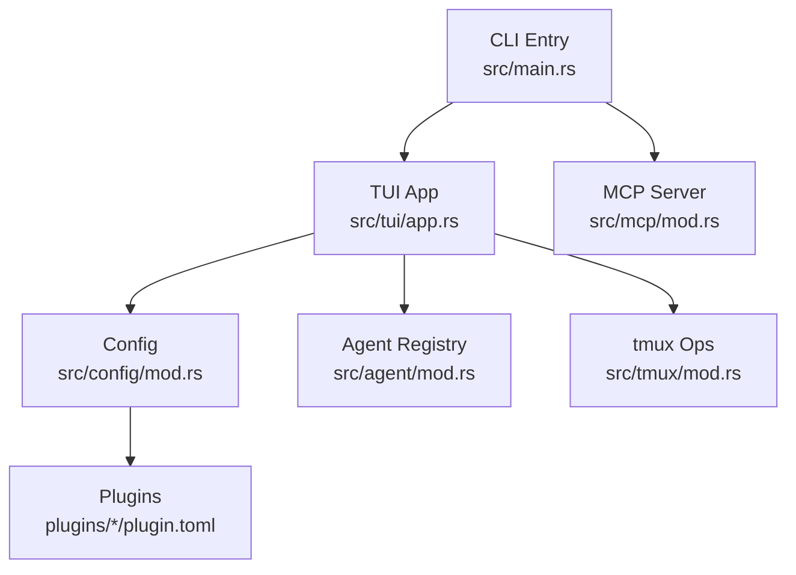
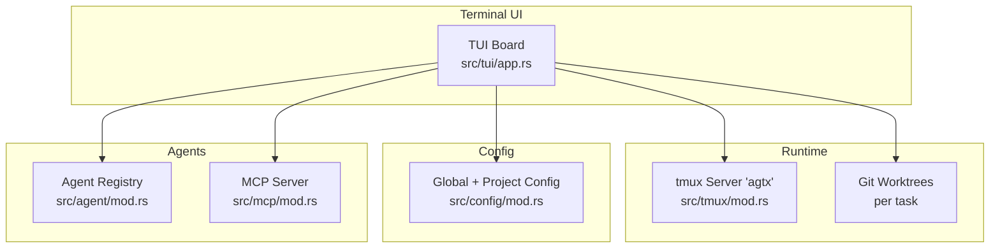
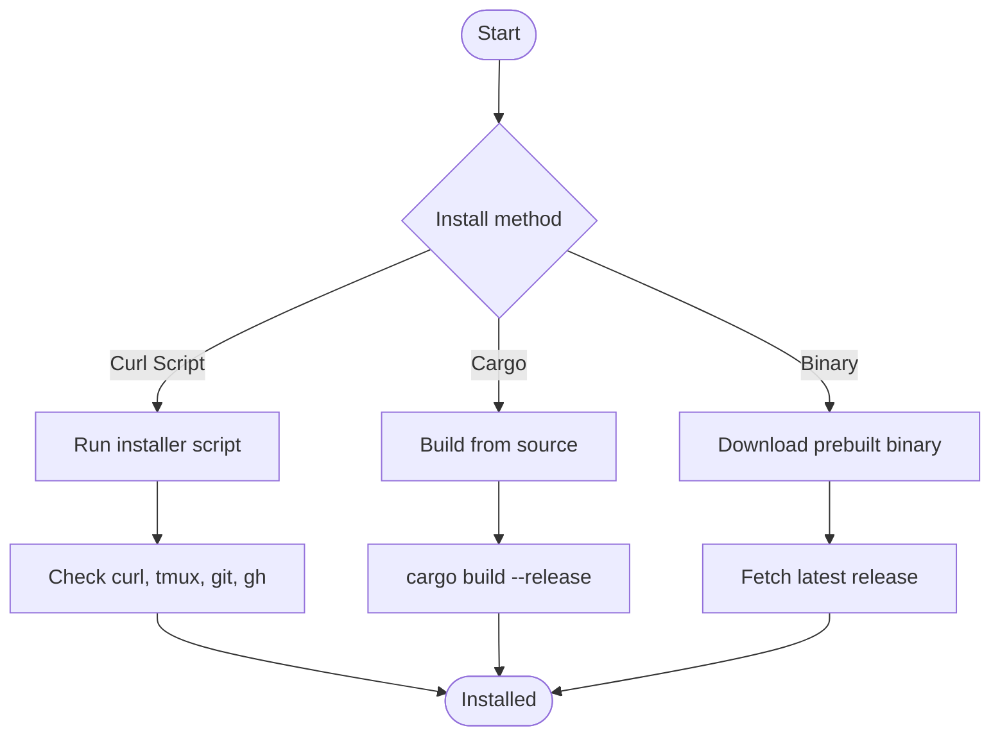
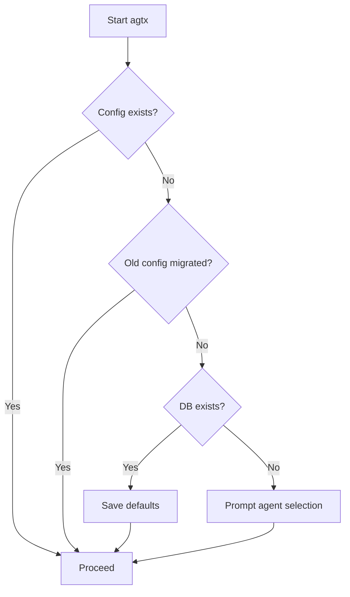
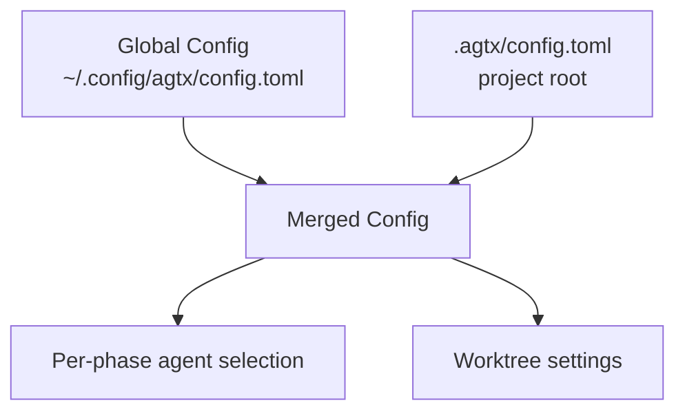
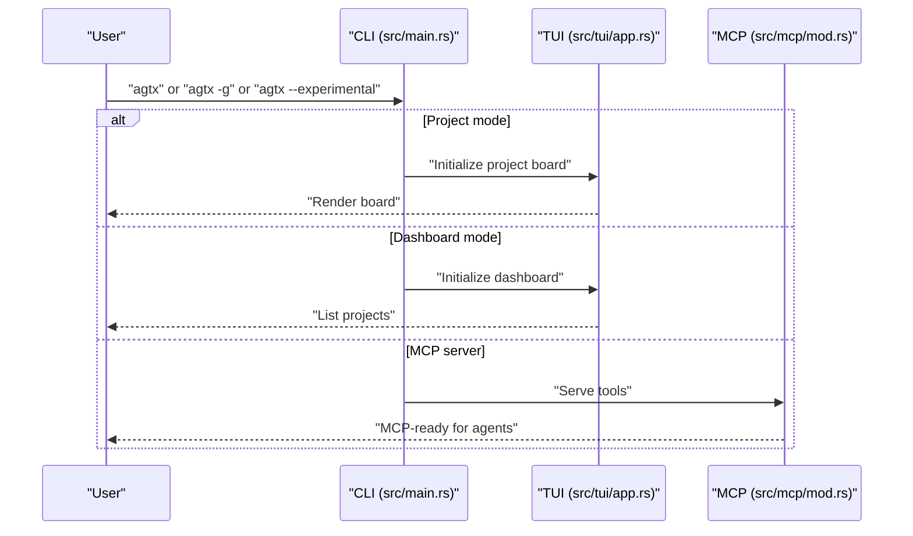
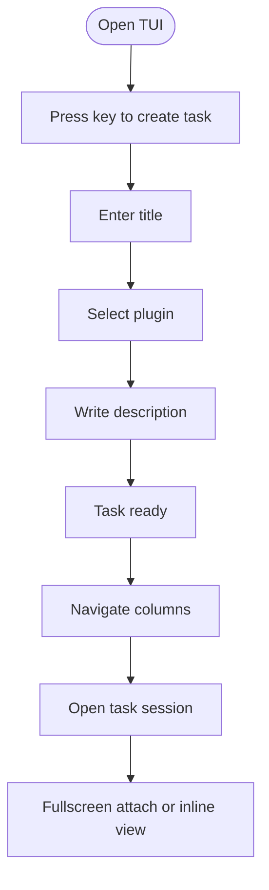
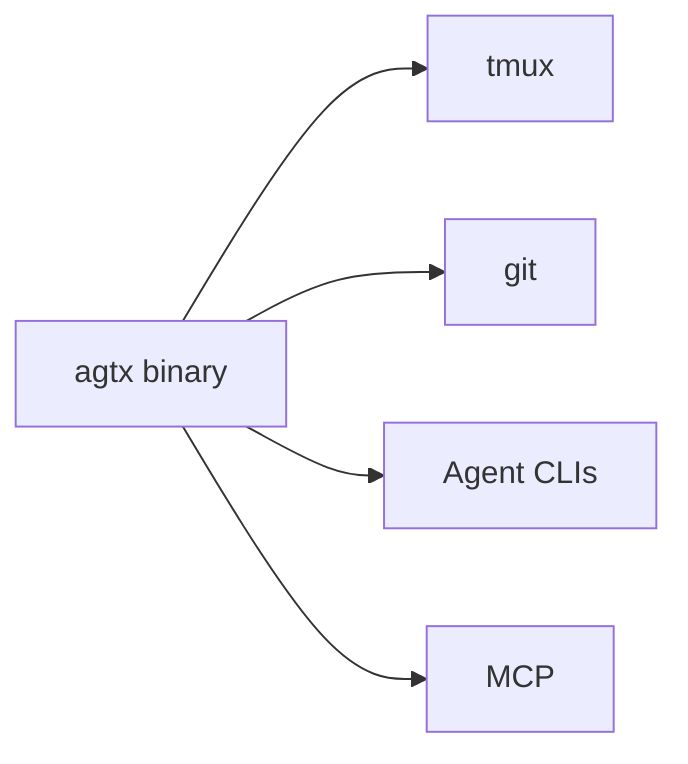

# Getting Started

<cite>
**Referenced Files in This Document**
- [README.md](file://README.md)
- [install.sh](file://install.sh)
- [Cargo.toml](file://Cargo.toml)
- [src/main.rs](file://src/main.rs)
- [src/config/mod.rs](file://src/config/mod.rs)
- [src/agent/mod.rs](file://src/agent/mod.rs)
- [src/tmux/mod.rs](file://src/tmux/mod.rs)
- [src/tui/app.rs](file://src/tui/app.rs)
- [src/mcp/mod.rs](file://src/mcp/mod.rs)
- [plugins/agtx/plugin.toml](file://plugins/agtx/plugin.toml)
- [plugins/void/plugin.toml](file://plugins/void/plugin.toml)
- [AGENTS.md](file://AGENTS.md)
</cite>

## Table of Contents
1. [Introduction](#introduction)
2. [Project Structure](#project-structure)
3. [Core Components](#core-components)
4. [Architecture Overview](#architecture-overview)
5. [Detailed Component Analysis](#detailed-component-analysis)
6. [Dependency Analysis](#dependency-analysis)
7. [Performance Considerations](#performance-considerations)
8. [Troubleshooting Guide](#troubleshooting-guide)
9. [Conclusion](#conclusion)
10. [Appendices](#appendices)

## Introduction
agtx is a terminal-native kanban board that orchestrates multiple AI coding agents in parallel. It runs each task in its own git worktree and tmux window, enabling autonomous workflows driven by plugins and optionally by an experimental orchestrator agent. This guide helps you install quickly, configure your first run, and start building tasks right away.

## Project Structure
At a high level, agtx consists of:
- CLI entrypoint and mode routing
- TUI for the kanban board and keyboard shortcuts
- Configuration for global and per-project settings
- Agent detection and session management via tmux
- MCP server for integrating with external agents
- Plugins that define workflow phases and skills

**Diagram sources**
- [src/main.rs:16-96](file://src/main.rs#L16-L96)
- [src/tui/app.rs:1-200](file://src/tui/app.rs#L1-200)
- [src/config/mod.rs:1-595](file://src/config/mod.rs#L1-L595)
- [src/agent/mod.rs:1-171](file://src/agent/mod.rs#L1-L171)
- [src/tmux/mod.rs:1-189](file://src/tmux/mod.rs#L1-L189)
- [src/mcp/mod.rs:1-5](file://src/mcp/mod.rs#L1-L5)
- [plugins/agtx/plugin.toml:1-16](file://plugins/agtx/plugin.toml#L1-L16)
- [plugins/void/plugin.toml:1-4](file://plugins/void/plugin.toml#L1-L4)

**Section sources**
- [README.md:506-547](file://README.md#L506-L547)
- [AGENTS.md:16-31](file://AGENTS.md#L16-L31)

## Core Components
- CLI and modes: project mode, dashboard mode, MCP server mode, and orchestrator mode
- TUI board with keyboard shortcuts for navigation, task creation, and transitions
- Configuration system for global defaults and per-project overrides
- Agent detection and tmux-backed session management
- MCP server exposing board tools to external agents

**Section sources**
- [README.md:73-89](file://README.md#L73-L89)
- [src/main.rs:30-59](file://src/main.rs#L30-L59)
- [src/tui/app.rs:65-199](file://src/tui/app.rs#L65-L199)
- [src/config/mod.rs:229-303](file://src/config/mod.rs#L229-L303)
- [src/agent/mod.rs:124-130](file://src/agent/mod.rs#L124-L130)
- [src/tmux/mod.rs:11-48](file://src/tmux/mod.rs#L11-L48)
- [src/mcp/mod.rs:1-5](file://src/mcp/mod.rs#L1-L5)

## Architecture Overview
agtx runs a dedicated tmux server for agent sessions, each task in its own worktree and window. The TUI coordinates transitions and integrates with plugins and MCP-enabled agents.

**Diagram sources**
- [src/tui/app.rs:1-200](file://src/tui/app.rs#L1-L200)
- [src/tmux/mod.rs:11-48](file://src/tmux/mod.rs#L11-L48)
- [src/config/mod.rs:229-303](file://src/config/mod.rs#L229-L303)
- [src/agent/mod.rs:124-130](file://src/agent/mod.rs#L124-L130)
- [src/mcp/mod.rs:1-5](file://src/mcp/mod.rs#L1-L5)

## Detailed Component Analysis

### Installation Methods
Choose one of the following installation approaches:

- Curl script installation
  - Downloads the latest binary release and installs to a local bin directory
  - Verifies tmux, git, and optional tools presence
  - Adds helpful hints if PATH is not set

- Cargo build from source
  - Builds a release binary and copies it to a local bin directory
  - Requires Rust toolchain and cargo

- Binary releases
  - Prebuilt binaries are published on GitHub Releases
  - Installer fetches the latest version and extracts the appropriate archive

**Diagram sources**
- [install.sh:62-173](file://install.sh#L62-L173)
- [README.md:75-98](file://README.md#L75-L98)
- [Cargo.toml:12-34](file://Cargo.toml#L12-L34)

**Section sources**
- [install.sh:62-173](file://install.sh#L62-L173)
- [README.md:73-98](file://README.md#L73-L98)
- [Cargo.toml:12-34](file://Cargo.toml#L12-L34)

### Prerequisites
- Required
  - tmux: agent sessions run in a dedicated tmux server
  - git: worktrees and repository operations
- Optional
  - gh: GitHub CLI for pull request operations
  - Agent CLIs: Claude, Codex, Gemini, Copilot, OpenCode, Cursor

Tip: The installer checks for tmux, git, gh, and agent CLIs and prints status.

**Section sources**
- [README.md:100-104](file://README.md#L100-L104)
- [install.sh:145-171](file://install.sh#L145-L171)

### First-Time Setup
On first run, agtx detects whether you are a new or existing user and offers a guided setup:

- If no configuration exists and no database is found, it prompts you to select a default agent
- If migrating from an older config location, it migrates automatically
- If you already have a database but no config, it saves defaults silently

**Diagram sources**
- [src/main.rs:63-89](file://src/main.rs#L63-L89)
- [src/config/mod.rs:305-335](file://src/config/mod.rs#L305-L335)

**Section sources**
- [src/main.rs:63-89](file://src/main.rs#L63-L89)
- [src/config/mod.rs:305-335](file://src/config/mod.rs#L305-L335)

### Configuration Files
- Global configuration
  - Location: user config directory
  - Includes default agent, per-phase agent overrides, worktree settings, theme, and UI preferences
- Project configuration
  - Location: project’s hidden directory
  - Overrides global defaults for base branch, worktree directory, and scripts

**Diagram sources**
- [src/config/mod.rs:229-303](file://src/config/mod.rs#L229-L303)
- [src/config/mod.rs:355-408](file://src/config/mod.rs#L355-L408)

**Section sources**
- [src/config/mod.rs:229-303](file://src/config/mod.rs#L229-L303)
- [src/config/mod.rs:355-408](file://src/config/mod.rs#L355-L408)

### Supported AI Coding Agents
agtx integrates with several agent CLIs. During first-run setup, it detects available agents and lets you choose a default. The agent registry enumerates known agents and checks availability.

Supported agents include Claude, Codex, Copilot, Gemini, OpenCode, and Cursor.

**Section sources**
- [src/agent/mod.rs:80-130](file://src/agent/mod.rs#L80-L130)
- [README.md:348-367](file://README.md#L348-L367)

### Running Modes
- Project mode
  - Opens the kanban board for the current git repository
- Dashboard mode
  - Manages multiple projects from a single TUI
- MCP server mode
  - Exposes board tools to agents via the Model Context Protocol
- Orchestrator mode
  - Experimental mode where an AI agent drives the board autonomously

**Diagram sources**
- [src/main.rs:30-59](file://src/main.rs#L30-L59)
- [src/mcp/mod.rs:1-5](file://src/mcp/mod.rs#L1-L5)

**Section sources**
- [src/main.rs:30-59](file://src/main.rs#L30-L59)
- [README.md:73-89](file://README.md#L73-L89)

### Basic Usage Patterns
- Task creation
  - Press the key to create a new task; the wizard guides you through title, plugin, and description
- Column navigation
  - Use directional keys to move between columns and tasks
- Agent session management
  - Open a task to view the agent session in-place or fullscreen attach to the tmux window
  - Resume sessions across restarts using agent-specific resume commands

**Diagram sources**
- [README.md:107-164](file://README.md#L107-L164)
- [src/tui/app.rs:65-199](file://src/tui/app.rs#L65-L199)

**Section sources**
- [README.md:107-164](file://README.md#L107-L164)
- [src/tui/app.rs:65-199](file://src/tui/app.rs#L65-L199)

### Practical Examples
- Default project mode
  - Run in any git repository to open the project board
- Dashboard mode
  - Manage multiple projects from a single interface
- Orchestrator mode
  - Enable the experimental orchestrator and let it advance tasks automatically

**Section sources**
- [README.md:73-89](file://README.md#L73-L89)

### Keyboard Shortcuts (Quick Reference)
- Navigation: move between columns and tasks
- Task actions: create, open, delete, diff
- Workflow: move forward, resume, toggle cyclic phase
- MCP and orchestrator: toggle orchestrator mode
- UI: toggle sidebar, fullscreen attach, quit

**Section sources**
- [README.md:107-129](file://README.md#L107-L129)
- [src/tui/app.rs:65-199](file://src/tui/app.rs#L65-L199)

## Dependency Analysis
agtx relies on a small set of core dependencies and integrates with external tools:

- tmux: session management for agent terminals
- git: worktree creation and conflict checks
- Agent CLIs: Claude, Codex, Gemini, Copilot, OpenCode, Cursor
- MCP protocol: communication with external agents

**Diagram sources**
- [src/tmux/mod.rs:11-48](file://src/tmux/mod.rs#L11-L48)
- [src/agent/mod.rs:124-130](file://src/agent/mod.rs#L124-L130)
- [src/mcp/mod.rs:1-5](file://src/mcp/mod.rs#L1-L5)

**Section sources**
- [src/tmux/mod.rs:11-48](file://src/tmux/mod.rs#L11-L48)
- [src/agent/mod.rs:124-130](file://src/agent/mod.rs#L124-L130)
- [src/mcp/mod.rs:1-5](file://src/mcp/mod.rs#L1-L5)

## Performance Considerations
- Each task runs in its own worktree and tmux window; keep the number of concurrent tasks aligned with your machine resources
- Plugins with artifact polling and copy-back features can influence perceived responsiveness; choose plugins suited to your workflow
- Use the “fullscreen attach” shortcut to reduce TUI overhead when focusing on a single task

[No sources needed since this section provides general guidance]

## Troubleshooting Guide
Common setup issues and resolutions:

- tmux not installed or not found
  - Install tmux and ensure it is available on PATH
  - The installer checks for tmux and reports status
- Missing agent CLIs
  - Install desired agent CLIs (e.g., Claude, Codex, Gemini)
  - On first run, agtx detects available agents and lets you pick a default
- MCP server not reachable
  - Confirm the MCP server is running and registered with your agent
  - Use the MCP server mode to expose board tools
- Conflicts during review
  - agtx can detect merge conflicts and guide resolution via a built-in skill

**Section sources**
- [install.sh:145-171](file://install.sh#L145-L171)
- [src/agent/mod.rs:124-130](file://src/agent/mod.rs#L124-L130)
- [src/mcp/mod.rs:1-5](file://src/mcp/mod.rs#L1-L5)
- [plugins/agtx/plugin.toml:1-16](file://plugins/agtx/plugin.toml#L1-L16)

## Conclusion
You are now ready to install agtx, configure your default agent, and start managing tasks across multiple AI coding agents in parallel. Use the TUI to navigate columns, create tasks, and manage sessions, and explore plugins and MCP integrations to tailor the workflow to your needs.

[No sources needed since this section summarizes without analyzing specific files]

## Appendices

### Quick Reference: Commands and Shortcuts
- Install
  - Curl script installation
  - Cargo build from source
  - Binary releases
- Run
  - Project mode
  - Dashboard mode
  - MCP server mode
  - Orchestrator mode
- Shortcuts
  - Navigation, task actions, workflow transitions, MCP toggles, UI controls

**Section sources**
- [README.md:73-129](file://README.md#L73-L129)
- [install.sh:62-173](file://install.sh#L62-L173)
- [src/main.rs:30-59](file://src/main.rs#L30-L59)