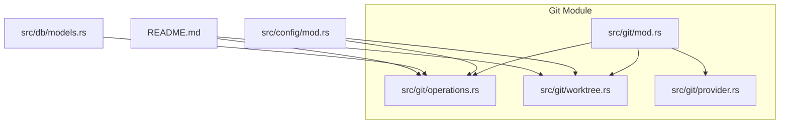
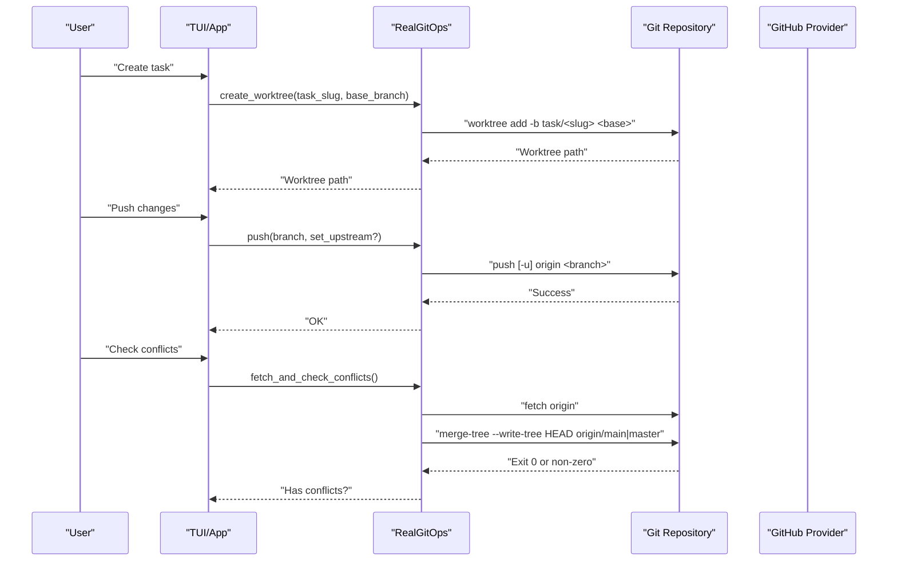
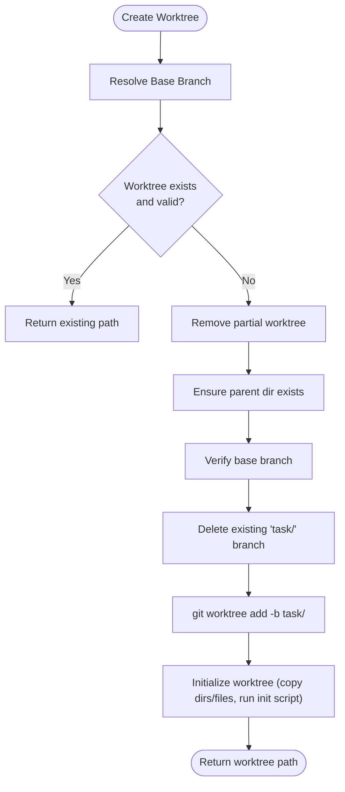
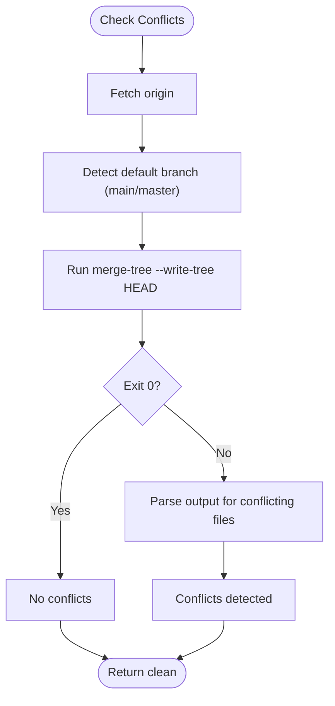
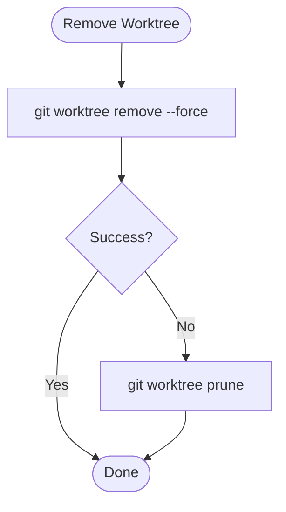
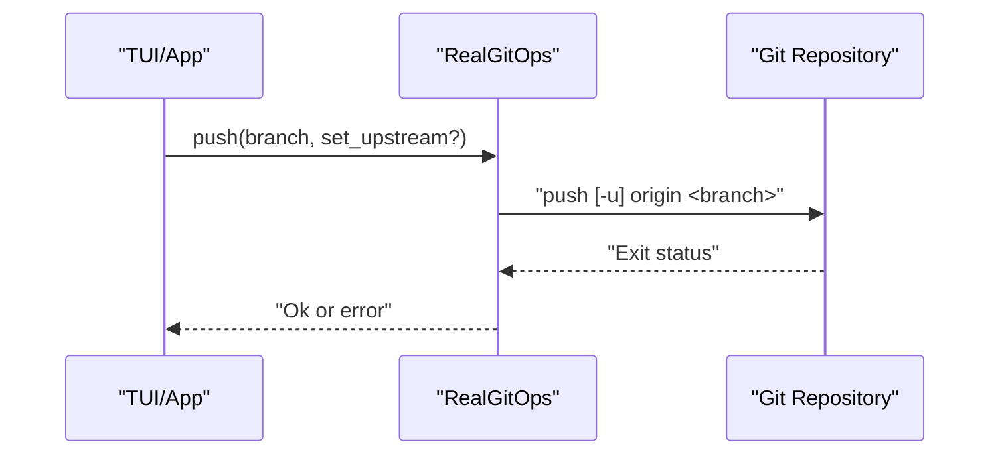
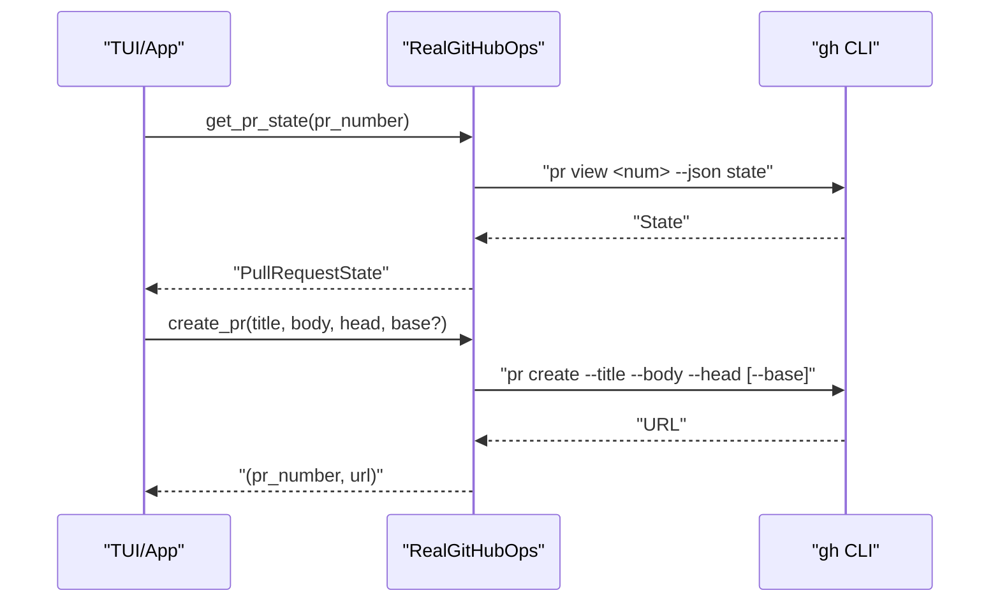
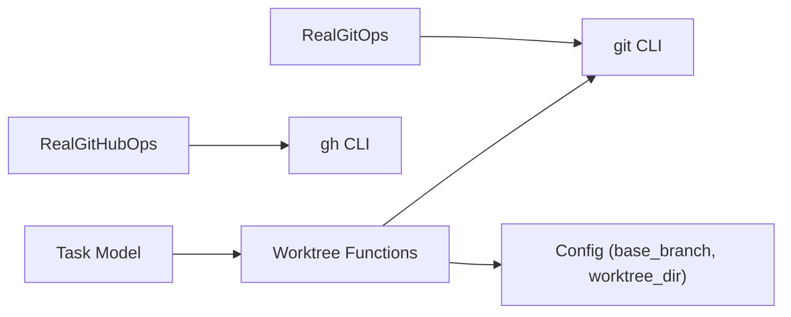

# Branch Operations

<cite>
**Referenced Files in This Document**
- [src/git/mod.rs](file://src/git/mod.rs)
- [src/git/operations.rs](file://src/git/operations.rs)
- [src/git/worktree.rs](file://src/git/worktree.rs)
- [src/git/provider.rs](file://src/git/provider.rs)
- [src/config/mod.rs](file://src/config/mod.rs)
- [src/db/models.rs](file://src/db/models.rs)
- [README.md](file://README.md)
- [tests/git_tests.rs](file://tests/git_tests.rs)
</cite>

## Table of Contents
1. [Introduction](#introduction)
2. [Project Structure](#project-structure)
3. [Core Components](#core-components)
4. [Architecture Overview](#architecture-overview)
5. [Detailed Component Analysis](#detailed-component-analysis)
6. [Dependency Analysis](#dependency-analysis)
7. [Performance Considerations](#performance-considerations)
8. [Troubleshooting Guide](#troubleshooting-guide)
9. [Conclusion](#conclusion)
10. [Appendices](#appendices)

## Introduction
This document explains how AGTX integrates with Git to manage branches and worktrees for task isolation. It covers branch naming conventions, creation and deletion of feature branches, conflict detection using non-destructive virtual merges, and how configuration options influence base branch selection and upstream behavior. Practical workflows demonstrate creating feature branches, checking for merge conflicts, and pushing branches to remote repositories.

## Project Structure
AGTX’s branch and worktree logic is primarily implemented under the git module, with supporting configuration and database models that track worktree and branch metadata.

**Diagram sources**
- [src/git/mod.rs:1-142](file://src/git/mod.rs#L1-L142)
- [src/git/operations.rs:1-276](file://src/git/operations.rs#L1-L276)
- [src/git/worktree.rs:1-345](file://src/git/worktree.rs#L1-L345)
- [src/git/provider.rs:1-110](file://src/git/provider.rs#L1-L110)
- [src/config/mod.rs:160-198](file://src/config/mod.rs#L160-L198)
- [src/db/models.rs:58-79](file://src/db/models.rs#L58-L79)
- [README.md:261-307](file://README.md#L261-L307)

**Section sources**
- [src/git/mod.rs:1-142](file://src/git/mod.rs#L1-L142)
- [src/git/operations.rs:1-276](file://src/git/operations.rs#L1-L276)
- [src/git/worktree.rs:1-345](file://src/git/worktree.rs#L1-L345)
- [src/git/provider.rs:1-110](file://src/git/provider.rs#L1-L110)
- [src/config/mod.rs:160-198](file://src/config/mod.rs#L160-L198)
- [src/db/models.rs:58-79](file://src/db/models.rs#L58-L79)
- [README.md:261-307](file://README.md#L261-L307)

## Core Components
- Git operations abstraction and real implementation:
  - Trait defines operations like create/remove worktree, diff, commit, push, conflict checks, and file listing.
  - Real implementation wraps git CLI commands for each operation.
- Worktree management:
  - Creates isolated worktrees per task from a chosen base branch.
  - Enforces branch naming convention for feature branches.
  - Handles initialization and cleanup scripts.
- Conflict detection:
  - Uses non-destructive virtual merge to detect conflicts without touching the working tree.
- Provider operations:
  - Pull request state and creation via GitHub CLI wrapper.
- Configuration:
  - Global and project-level settings control base branch, worktree directory, and automation behavior.
- Database models:
  - Track worktree path, branch name, and PR metadata for each task.

**Section sources**
- [src/git/operations.rs:9-75](file://src/git/operations.rs#L9-L75)
- [src/git/operations.rs:77-276](file://src/git/operations.rs#L77-L276)
- [src/git/worktree.rs:8-65](file://src/git/worktree.rs#L8-L65)
- [src/git/mod.rs:89-128](file://src/git/mod.rs#L89-L128)
- [src/git/provider.rs:21-38](file://src/git/provider.rs#L21-L38)
- [src/config/mod.rs:160-198](file://src/config/mod.rs#L160-L198)
- [src/db/models.rs:58-79](file://src/db/models.rs#L58-L79)

## Architecture Overview
The branch and worktree subsystem orchestrates task isolation and safe collaboration:

**Diagram sources**
- [src/git/operations.rs:80-99](file://src/git/operations.rs#L80-L99)
- [src/git/operations.rs:191-209](file://src/git/operations.rs#L191-L209)
- [src/git/operations.rs:211-243](file://src/git/operations.rs#L211-L243)
- [src/git/mod.rs:89-128](file://src/git/mod.rs#L89-L128)
- [src/git/provider.rs:43-109](file://src/git/provider.rs#L43-L109)

## Detailed Component Analysis

### Worktree Creation and Branch Naming
- Base branch selection:
  - If empty, auto-detects main, then master, then current branch.
  - Otherwise verifies the configured branch exists.
- Feature branch naming:
  - Branch name follows the pattern task/<slug>.
- Worktree creation:
  - Ensures parent directory exists.
  - Removes any partial worktree.
  - Creates worktree with a new branch from the resolved base branch.
- Initialization:
  - Copies agent config directories and optional files/dirs.
  - Runs optional init script inside the worktree.

**Diagram sources**
- [src/git/worktree.rs:14-65](file://src/git/worktree.rs#L14-L65)
- [src/git/worktree.rs:129-223](file://src/git/worktree.rs#L129-L223)

**Section sources**
- [src/git/worktree.rs:8-65](file://src/git/worktree.rs#L8-L65)
- [src/git/worktree.rs:129-223](file://src/git/worktree.rs#L129-L223)
- [src/config/mod.rs:160-198](file://src/config/mod.rs#L160-L198)

### Conflict Detection Using Virtual Merge
- Non-destructive merge check:
  - Uses git merge-tree --write-tree to compute a merge without modifying the working tree.
  - Parses structured output to extract conflicting files.
- Integration:
  - RealGitOps fetches origin and detects default branch (main or master) before invoking merge-tree.
  - Returns a boolean indicating whether conflicts exist.

**Diagram sources**
- [src/git/operations.rs:211-243](file://src/git/operations.rs#L211-L243)
- [src/git/mod.rs:89-128](file://src/git/mod.rs#L89-L128)

**Section sources**
- [src/git/operations.rs:211-243](file://src/git/operations.rs#L211-L243)
- [src/git/mod.rs:89-128](file://src/git/mod.rs#L89-L128)
- [tests/git_tests.rs:472-562](file://tests/git_tests.rs#L472-L562)

### Branch Deletion and Safe Cleanup
- Deletion:
  - Supports safe (-d) and forced (-D) deletion modes.
- Worktree removal:
  - Removes worktree and prunes stale entries if removal fails.
- Task cleanup:
  - Database tracks worktree path and branch name; cleanup can leverage these to remove stale branches and worktrees.

**Diagram sources**
- [src/git/worktree.rs:275-297](file://src/git/worktree.rs#L275-L297)

**Section sources**
- [src/git/mod.rs:130-141](file://src/git/mod.rs#L130-L141)
- [src/git/worktree.rs:275-297](file://src/git/worktree.rs#L275-L297)
- [src/db/models.rs:58-79](file://src/db/models.rs#L58-L79)

### Pushing Branches and Upstream Tracking
- Push:
  - Supports optional upstream tracking flag.
  - Returns an error if push fails.
- Upstream behavior:
  - When set_upstream is true, uses -u to configure upstream tracking for the branch.

**Diagram sources**
- [src/git/operations.rs:191-209](file://src/git/operations.rs#L191-L209)

**Section sources**
- [src/git/operations.rs:191-209](file://src/git/operations.rs#L191-L209)

### Pull Request Management
- State retrieval:
  - Queries GitHub CLI for PR state (Open, Merged, Closed, Unknown).
- Creation:
  - Creates PR targeting a specific base branch (supports stacked PRs).
  - Parses PR number from URL output.

**Diagram sources**
- [src/git/provider.rs:43-109](file://src/git/provider.rs#L43-L109)

**Section sources**
- [src/git/provider.rs:21-38](file://src/git/provider.rs#L21-L38)
- [src/git/provider.rs:43-109](file://src/git/provider.rs#L43-L109)

## Dependency Analysis
- Cohesion:
  - Git operations are encapsulated behind a trait, enabling testability and separation of concerns.
- Coupling:
  - RealGitOps depends on git CLI; RealGitHubOps depends on gh CLI.
  - Worktree creation depends on configuration for base branch and worktree directory.
- External dependencies:
  - Git CLI for all repository operations.
  - GitHub CLI for PR operations.

**Diagram sources**
- [src/git/operations.rs:77-276](file://src/git/operations.rs#L77-L276)
- [src/git/worktree.rs:1-345](file://src/git/worktree.rs#L1-L345)
- [src/config/mod.rs:160-198](file://src/config/mod.rs#L160-L198)
- [src/db/models.rs:58-79](file://src/db/models.rs#L58-L79)

**Section sources**
- [src/git/operations.rs:77-276](file://src/git/operations.rs#L77-L276)
- [src/git/worktree.rs:1-345](file://src/git/worktree.rs#L1-L345)
- [src/config/mod.rs:160-198](file://src/config/mod.rs#L160-L198)
- [src/db/models.rs:58-79](file://src/db/models.rs#L58-L79)

## Performance Considerations
- Virtual merge checks avoid costly working tree writes and reduce risk of accidental modifications.
- Worktree creation and cleanup are lightweight operations; ensure base branch verification avoids unnecessary retries.
- Use batch operations where possible (e.g., fetching once before conflict checks).

## Troubleshooting Guide
- Base branch not found:
  - Ensure base_branch is a valid ref or leave empty to auto-detect main/master.
- Worktree creation fails:
  - Verify git worktree add succeeds; check for existing partial worktrees and remove them.
- Conflict detection returns unexpected results:
  - Confirm the default branch name (main or master) and that origin is reachable.
- Push fails:
  - Check remote connectivity and credentials; ensure branch name is correct.

**Section sources**
- [src/git/worktree.rs:67-84](file://src/git/worktree.rs#L67-L84)
- [src/git/operations.rs:211-243](file://src/git/operations.rs#L211-L243)
- [src/git/operations.rs:191-209](file://src/git/operations.rs#L191-L209)

## Conclusion
AGTX’s branch and worktree system provides robust, task-isolated development workflows with non-destructive conflict detection, configurable base branch selection, and seamless integration with GitHub PRs. By following the documented naming conventions and operational patterns, teams can maintain clean branch hierarchies and automate safe collaboration.

## Appendices

### Practical Workflows

- Create a feature branch for a task
  - Steps:
    - Resolve base branch (auto-detect or configured).
    - Create worktree with branch name task/<slug>.
    - Initialize worktree (copy files and run init script).
  - References:
    - [src/git/worktree.rs:14-65](file://src/git/worktree.rs#L14-L65)
    - [src/git/worktree.rs:129-223](file://src/git/worktree.rs#L129-L223)

- Check for merge conflicts before pushing
  - Steps:
    - Fetch origin.
    - Detect default branch (main or master).
    - Run virtual merge check using merge-tree.
  - References:
    - [src/git/operations.rs:211-243](file://src/git/operations.rs#L211-L243)
    - [src/git/mod.rs:89-128](file://src/git/mod.rs#L89-L128)

- Push a branch to remote with optional upstream tracking
  - Steps:
    - Stage and commit changes.
    - Push with optional -u flag.
  - References:
    - [src/git/operations.rs:175-189](file://src/git/operations.rs#L175-L189)
    - [src/git/operations.rs:191-209](file://src/git/operations.rs#L191-L209)

- Delete a completed feature branch
  - Steps:
    - Delete branch locally (safe or forced).
    - Remove worktree and prune if needed.
  - References:
    - [src/git/mod.rs:130-141](file://src/git/mod.rs#L130-L141)
    - [src/git/worktree.rs:275-297](file://src/git/worktree.rs#L275-L297)

### Configuration Options
- Base branch selection
  - Global and project-level base_branch controls the source branch for new worktrees.
- Worktree directory
  - Configure worktree_dir to control where task worktrees are created.
- Automation
  - Global auto_cleanup controls whether worktrees are removed after merge/reject.

**Section sources**
- [src/config/mod.rs:160-198](file://src/config/mod.rs#L160-L198)
- [README.md:261-307](file://README.md#L261-L307)