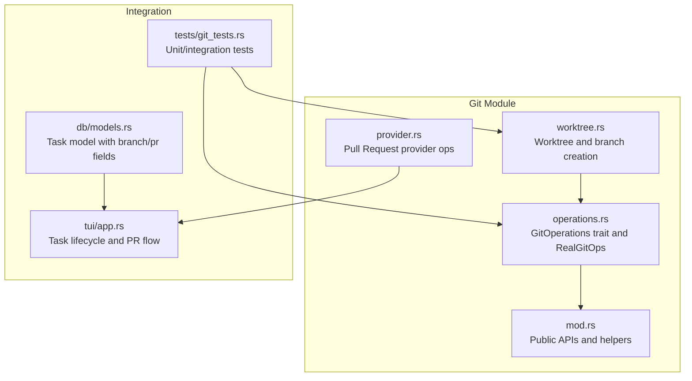
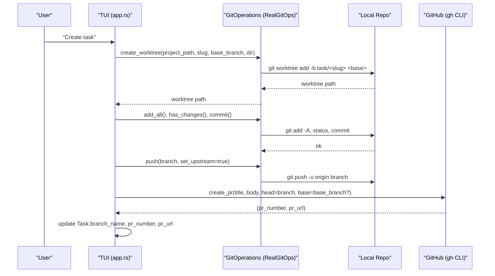
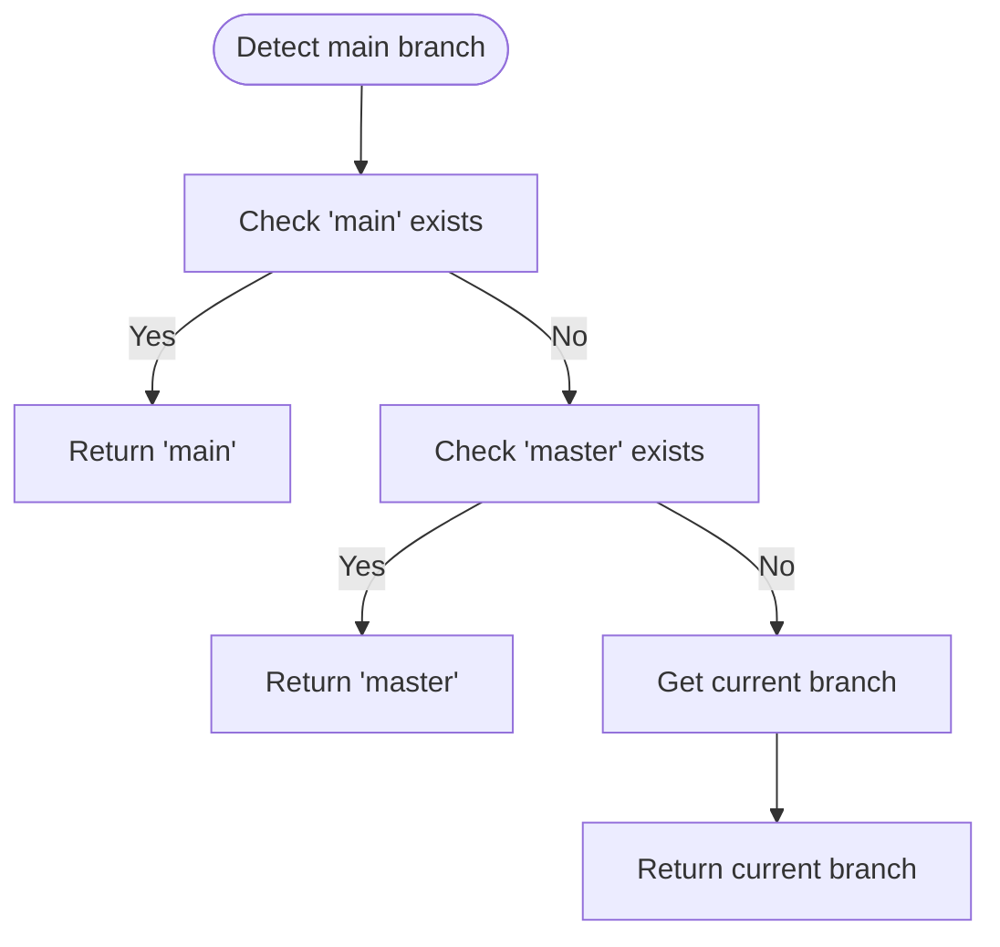
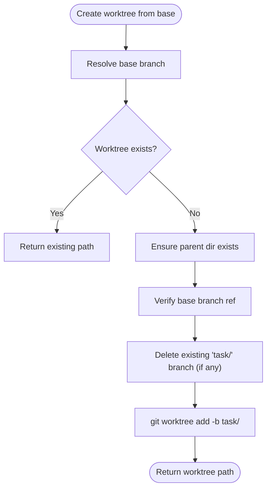
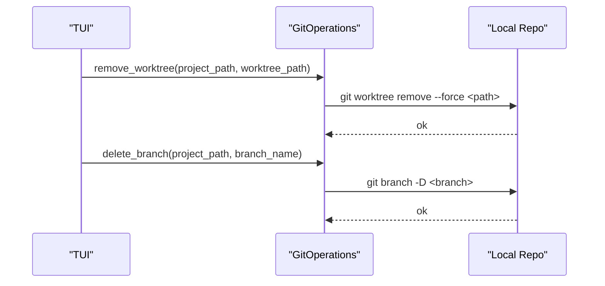
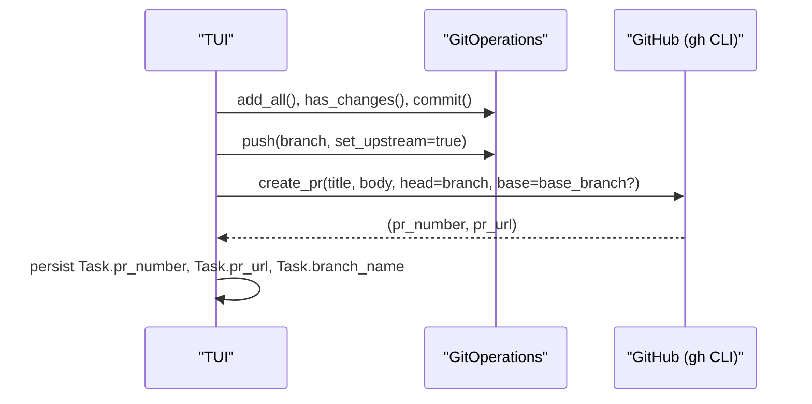
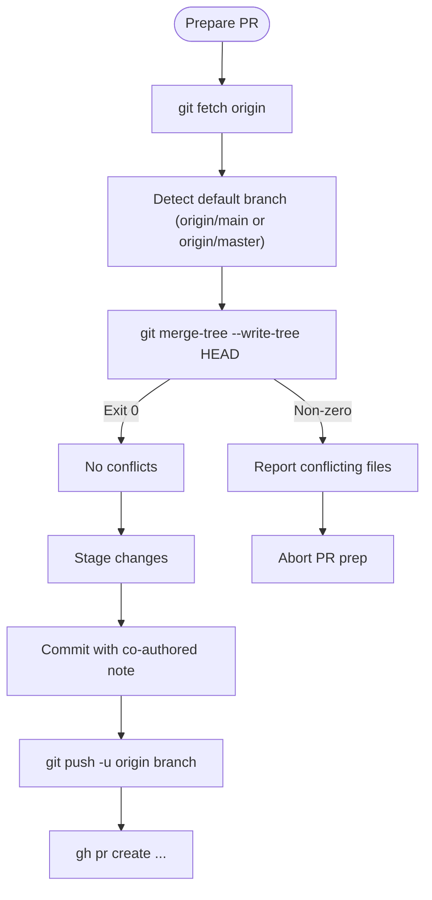
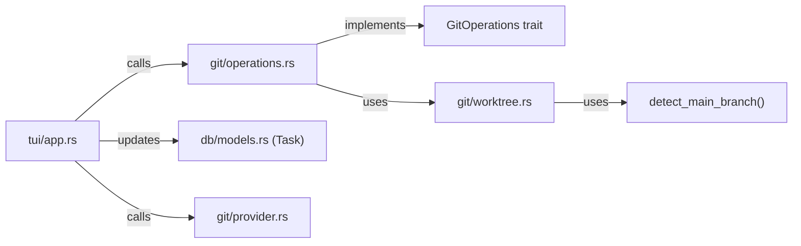

# Branch Operations

<cite>
**Referenced Files in This Document**
- [mod.rs](file://src/git/mod.rs)
- [operations.rs](file://src/git/operations.rs)
- [provider.rs](file://src/git/provider.rs)
- [worktree.rs](file://src/git/worktree.rs)
- [models.rs](file://src/db/models.rs)
- [app.rs](file://src/tui/app.rs)
- [git_tests.rs](file://tests/git_tests.rs)
</cite>

## Table of Contents
1. [Introduction](#introduction)
2. [Project Structure](#project-structure)
3. [Core Components](#core-components)
4. [Architecture Overview](#architecture-overview)
5. [Detailed Component Analysis](#detailed-component-analysis)
6. [Dependency Analysis](#dependency-analysis)
7. [Performance Considerations](#performance-considerations)
8. [Troubleshooting Guide](#troubleshooting-guide)
9. [Conclusion](#conclusion)

## Introduction
This document explains branch management operations within the Git integration of the project. It covers how the system detects the base branch, creates and manages worktrees and branches, prepares branches for pull requests, and cleans up resources. It also provides lifecycle examples, best practices for naming and hierarchy, and strategies for performance and troubleshooting.

## Project Structure
The branch and worktree management logic is primarily implemented under the git module, with supporting integration points in the TUI and database models.

**Diagram sources**
- [worktree.rs:1-345](file://src/git/worktree.rs#L1-L345)
- [operations.rs:1-276](file://src/git/operations.rs#L1-L276)
- [mod.rs:1-142](file://src/git/mod.rs#L1-L142)
- [provider.rs:1-110](file://src/git/provider.rs#L1-L110)
- [app.rs:3000-7450](file://src/tui/app.rs#L3000-L7450)
- [models.rs:58-133](file://src/db/models.rs#L58-L133)
- [git_tests.rs:1-570](file://tests/git_tests.rs#L1-L570)

**Section sources**
- [worktree.rs:1-345](file://src/git/worktree.rs#L1-L345)
- [operations.rs:1-276](file://src/git/operations.rs#L1-L276)
- [mod.rs:1-142](file://src/git/mod.rs#L1-L142)
- [provider.rs:1-110](file://src/git/provider.rs#L1-L110)
- [app.rs:3000-7450](file://src/tui/app.rs#L3000-L7450)
- [models.rs:58-133](file://src/db/models.rs#L58-L133)
- [git_tests.rs:1-570](file://tests/git_tests.rs#L1-L570)

## Core Components
- Worktree and branch creation: Creates a new branch from a resolved base branch and sets up a dedicated worktree directory.
- Base branch detection: Detects the repository’s main branch (main or master) with fallback to the current branch.
- Git operations abstraction: Provides a trait for Git operations and a real implementation that shells out to git.
- Pull request provider integration: GitHub PR creation and state queries via the gh CLI.
- Task model: Stores branch name, PR number, PR URL, and base branch for lifecycle tracking.

Key responsibilities:
- Deterministic branch naming convention: task/<slug>.
- Idempotent worktree creation and cleanup.
- Conflict checks prior to PR submission.
- Optional stacked PR support via base_branch targeting.

**Section sources**
- [worktree.rs:8-84](file://src/git/worktree.rs#L8-L84)
- [worktree.rs:241-273](file://src/git/worktree.rs#L241-L273)
- [operations.rs:11-75](file://src/git/operations.rs#L11-L75)
- [operations.rs:80-276](file://src/git/operations.rs#L80-L276)
- [provider.rs:23-38](file://src/git/provider.rs#L23-L38)
- [models.rs:58-133](file://src/db/models.rs#L58-L133)

## Architecture Overview
The branch lifecycle spans initialization, worktree creation, local commits, pushing, and PR creation. The TUI coordinates these steps and persists metadata in the Task model.

**Diagram sources**
- [operations.rs:80-209](file://src/git/operations.rs#L80-L209)
- [worktree.rs:14-65](file://src/git/worktree.rs#L14-L65)
- [app.rs:7403-7432](file://src/tui/app.rs#L7403-L7432)
- [provider.rs:66-108](file://src/git/provider.rs#L66-L108)

## Detailed Component Analysis

### Base Branch Detection
The system detects the repository’s main branch by checking for main first, then master, and finally falling back to the current branch. This ensures compatibility across repositories using different default branch names.

**Diagram sources**
- [worktree.rs:241-273](file://src/git/worktree.rs#L241-L273)

**Section sources**
- [worktree.rs:241-273](file://src/git/worktree.rs#L241-L273)

### Branch Creation Workflow
Branch creation follows a deterministic pattern:
- Resolve base branch: either the provided base or the detected main branch.
- Enforce naming: branch name is task/<slug>.
- Idempotency: if a worktree already exists, it is reused; if a conflicting branch exists, it is force-deleted before recreation.
- Worktree creation: a new worktree is added from the base branch at the configured directory.

**Diagram sources**
- [worktree.rs:14-65](file://src/git/worktree.rs#L14-L65)

**Section sources**
- [worktree.rs:14-65](file://src/git/worktree.rs#L14-L65)

### Naming Conventions and Metadata Association
- Branch naming: task/<slug> is enforced during worktree creation.
- Metadata persistence: Task model stores branch_name, pr_number, pr_url, and base_branch to track lifecycle state.

Best practices:
- Keep slugs concise and descriptive; avoid special characters to prevent issues across platforms.
- Use base_branch for stacked PRs to target a specific parent branch.
- Store PR metadata in the Task model to simplify cleanup and auditing.

**Section sources**
- [worktree.rs:42-44](file://src/git/worktree.rs#L42-L44)
- [models.rs:58-133](file://src/db/models.rs#L58-L133)

### Switching and Cleanup Procedures
- Switching: The system operates within a worktree per task; switching is implicit to the worktree path. There is no explicit branch switching API in the referenced code.
- Cleanup: Worktrees can be removed with force to handle uncommitted changes. Branches can be deleted via the GitOperations trait. The TUI coordinates cleanup of tmux sessions, worktrees, and branches.

**Diagram sources**
- [operations.rs:93-111](file://src/git/operations.rs#L93-L111)
- [worktree.rs:275-297](file://src/git/worktree.rs#L275-L297)

**Section sources**
- [operations.rs:93-111](file://src/git/operations.rs#L93-L111)
- [worktree.rs:275-297](file://src/git/worktree.rs#L275-L297)

### Force Deletion Capabilities
- Branch deletion uses -D (force) to remove branches regardless of merge status.
- Worktree removal uses --force to remove even with uncommitted changes.

**Section sources**
- [operations.rs:105-111](file://src/git/operations.rs#L105-L111)
- [worktree.rs:279-285](file://src/git/worktree.rs#L279-L285)

### Pull Request Integration
- PR creation: The provider interface supports creating PRs with optional base_branch targeting for stacked PRs.
- PR state: The provider interface supports retrieving PR state (open, merged, closed, unknown).
- Submission preparation: The TUI stages changes, commits with co-authored metadata, pushes the branch, and then creates the PR.

**Diagram sources**
- [app.rs:7403-7432](file://src/tui/app.rs#L7403-L7432)
- [provider.rs:66-108](file://src/git/provider.rs#L66-L108)

**Section sources**
- [provider.rs:23-38](file://src/git/provider.rs#L23-L38)
- [provider.rs:66-108](file://src/git/provider.rs#L66-L108)
- [app.rs:7403-7432](file://src/tui/app.rs#L7403-L7432)

### Conflict Checking and PR Preparation
- Conflict detection: Uses git merge-tree to determine if a feature branch cleanly merges into the target branch without modifying the working tree.
- PR preparation: Commits staged changes with co-authored metadata and pushes the branch before creating the PR.

**Diagram sources**
- [operations.rs:211-243](file://src/git/operations.rs#L211-L243)
- [app.rs:7403-7432](file://src/tui/app.rs#L7403-L7432)

**Section sources**
- [operations.rs:211-243](file://src/git/operations.rs#L211-L243)
- [app.rs:7403-7432](file://src/tui/app.rs#L7403-L7432)

### Examples of Lifecycle Management
- New task lifecycle: Create worktree from main or a specified base branch → initialize worktree → perform edits → stage/commit → push → create PR.
- Stacked PRs: Set base_branch to point to another task’s branch to create a dependent PR.
- Cleanup: Remove worktree (force), delete branch, and optionally remove tmux session.

These behaviors are exercised by unit and integration tests.

**Section sources**
- [git_tests.rs:137-154](file://tests/git_tests.rs#L137-L154)
- [git_tests.rs:271-297](file://tests/git_tests.rs#L271-L297)
- [git_tests.rs:300-312](file://tests/git_tests.rs#L300-L312)
- [app.rs:3048-3068](file://src/tui/app.rs#L3048-L3068)

## Dependency Analysis
The following diagram shows how components depend on each other for branch operations.

**Diagram sources**
- [app.rs:3000-7450](file://src/tui/app.rs#L3000-L7450)
- [operations.rs:1-276](file://src/git/operations.rs#L1-L276)
- [worktree.rs:1-345](file://src/git/worktree.rs#L1-L345)
- [models.rs:58-133](file://src/db/models.rs#L58-L133)
- [provider.rs:1-110](file://src/git/provider.rs#L1-L110)

**Section sources**
- [app.rs:3000-7450](file://src/tui/app.rs#L3000-L7450)
- [operations.rs:1-276](file://src/git/operations.rs#L1-L276)
- [worktree.rs:1-345](file://src/git/worktree.rs#L1-L345)
- [models.rs:58-133](file://src/db/models.rs#L58-L133)
- [provider.rs:1-110](file://src/git/provider.rs#L1-L110)

## Performance Considerations
- Prefer worktrees for parallel tasks to avoid repeated checkout overhead.
- Use conflict detection before pushing to reduce wasted network operations.
- Limit the number of open PRs and stale branches; prune old worktrees and branches regularly.
- For repositories with many branches, consider caching base branch detection results and avoiding redundant git rev-parse calls.

## Troubleshooting Guide
Common issues and resolutions:
- Worktree creation fails: Verify the base branch exists; ensure the worktree directory is writable; check for permission errors.
- Branch deletion fails: Confirm the branch name matches task/<slug>; use force deletion if needed.
- PR creation fails: Ensure the gh CLI is installed and authenticated; verify the head branch is pushed; confirm base_branch is valid if using stacked PRs.
- Uncommitted changes during cleanup: Worktree removal uses force; ensure cleanup scripts are idempotent.
- Non-standard default branch: The system falls back to master or current branch; verify repository defaults.

Validation and examples are covered by unit and integration tests.

**Section sources**
- [git_tests.rs:108-154](file://tests/git_tests.rs#L108-L154)
- [git_tests.rs:171-227](file://tests/git_tests.rs#L171-L227)
- [git_tests.rs:230-250](file://tests/git_tests.rs#L230-L250)
- [git_tests.rs:271-312](file://tests/git_tests.rs#L271-L312)
- [worktree.rs:275-297](file://src/git/worktree.rs#L275-L297)

## Conclusion
The Git integration provides a robust, idempotent workflow for branch and worktree management, with clear naming conventions and PR preparation. By leveraging base branch detection, conflict checks, and provider integration, teams can maintain clean hierarchies and efficient collaboration. Follow the best practices and use the lifecycle examples to streamline development and reduce friction in branch-heavy workflows.