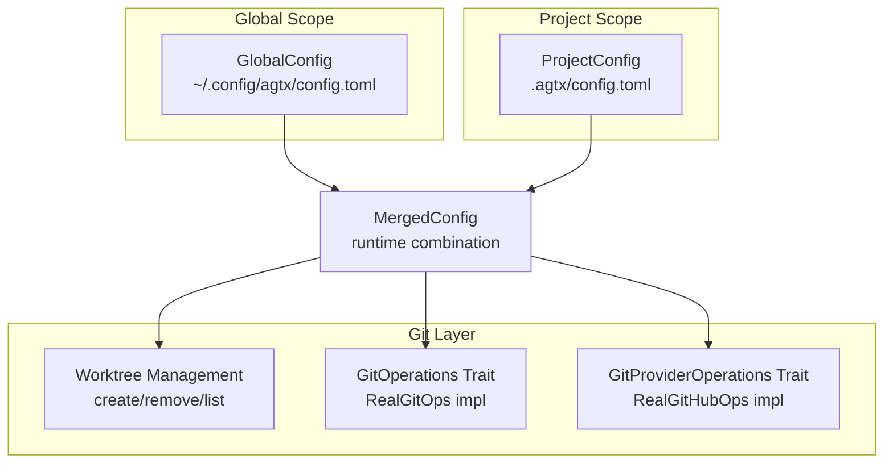
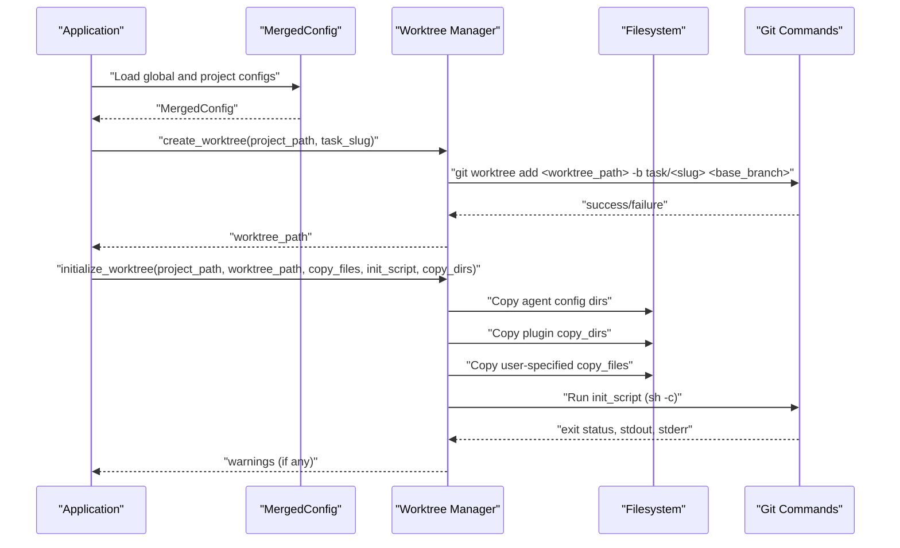
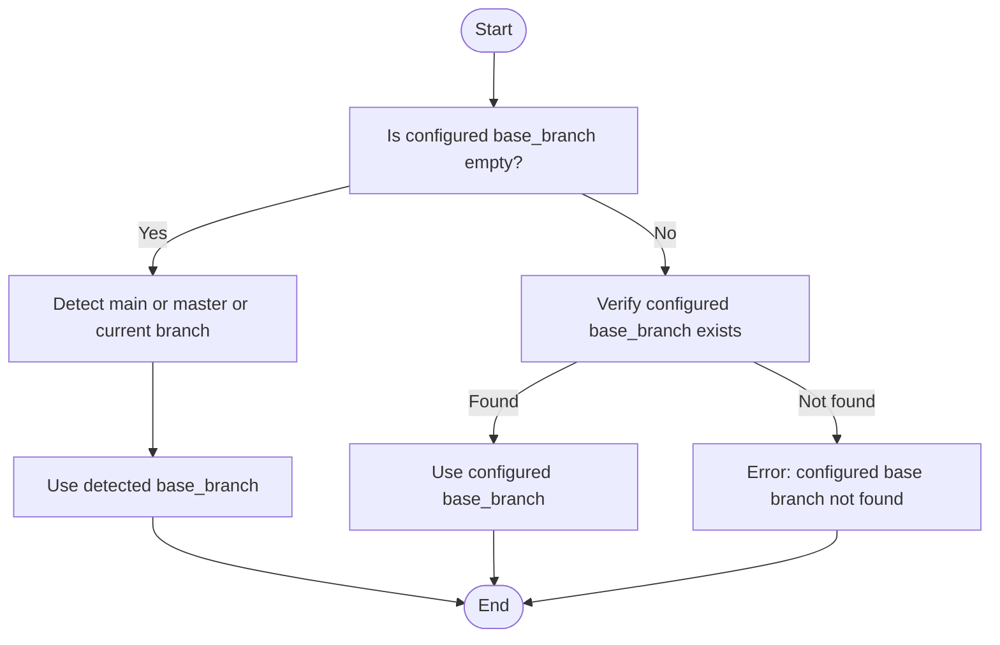
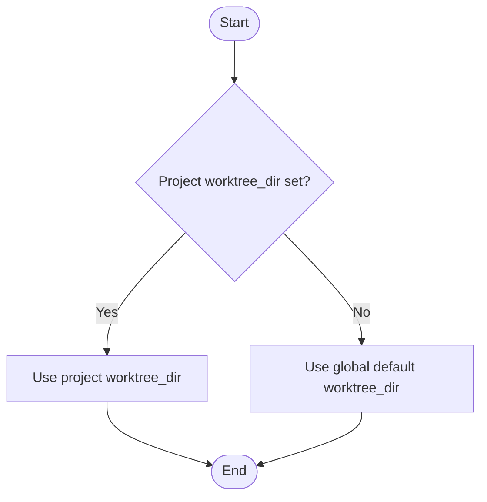
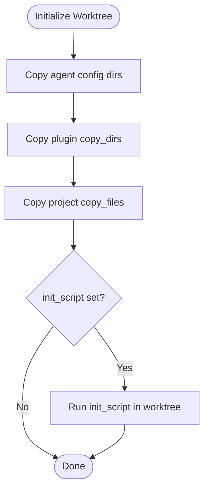
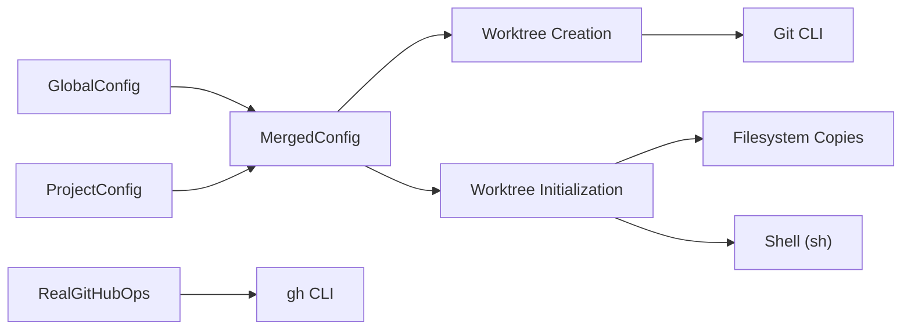

# Configuration and Customization

<cite>
**Referenced Files in This Document**
- [README.md](file://README.md)
- [src/config/mod.rs](file://src/config/mod.rs)
- [src/git/mod.rs](file://src/git/mod.rs)
- [src/git/worktree.rs](file://src/git/worktree.rs)
- [src/git/operations.rs](file://src/git/operations.rs)
- [src/git/provider.rs](file://src/git/provider.rs)
- [src/main.rs](file://src/main.rs)
- [tests/config_tests.rs](file://tests/config_tests.rs)
- [tests/git_tests.rs](file://tests/git_tests.rs)
- [plugins/gsd/plugin.toml](file://plugins/gsd/plugin.toml)
- [plugins/spec-kit/plugin.toml](file://plugins/spec-kit/plugin.toml)
- [plugins/agtx/plugin.toml](file://plugins/agtx/plugin.toml)
</cite>

## Table of Contents
1. [Introduction](#introduction)
2. [Project Structure](#project-structure)
3. [Core Components](#core-components)
4. [Architecture Overview](#architecture-overview)
5. [Detailed Component Analysis](#detailed-component-analysis)
6. [Dependency Analysis](#dependency-analysis)
7. [Performance Considerations](#performance-considerations)
8. [Troubleshooting Guide](#troubleshooting-guide)
9. [Conclusion](#conclusion)
10. [Appendices](#appendices)

## Introduction
This document explains how to configure and customize Git-related behavior in AGTX, focusing on worktree creation, base branch selection, worktree directory customization, and file copying during worktree initialization. It also covers how configuration is merged from global and project scopes, how to leverage plugin-provided configuration (init scripts, copy directories, and copy files), and how to optimize Git operations for large repositories. Practical examples and troubleshooting guidance are included to help you tailor AGTX to different development environments.

## Project Structure
AGTX organizes configuration in two primary locations:
- Global configuration: stored under the user’s config directory as a TOML file
- Project-specific configuration: stored under the project’s hidden directory as a TOML file

The configuration system merges global and project settings, with project-level overrides taking precedence where applicable. Git operations are encapsulated behind traits to support testing and to centralize Git command invocations.

**Diagram sources**
- [src/config/mod.rs:230-408](file://src/config/mod.rs#L230-L408)
- [src/git/worktree.rs:8-65](file://src/git/worktree.rs#L8-L65)
- [src/git/operations.rs:11-75](file://src/git/operations.rs#L11-L75)
- [src/git/provider.rs:22-38](file://src/git/provider.rs#L22-L38)

**Section sources**
- [src/config/mod.rs:230-408](file://src/config/mod.rs#L230-L408)
- [README.md:261-328](file://README.md#L261-L328)

## Core Components
- GlobalConfig: Defines global defaults (including worktree settings) and provides load/save helpers.
- ProjectConfig: Holds project-level overrides and optional per-phase agent configuration.
- MergedConfig: Produces runtime configuration by combining global and project settings, with project overrides applied.
- WorktreeConfig: Encapsulates worktree behavior such as enabling/disabling worktrees, auto-cleanup, base branch, and worktree directory.
- GitOperations: Abstraction for Git actions (worktree creation/removal, diffs, commits, pushes, conflict checks).
- RealGitOps: Concrete implementation that invokes Git commands.
- GitProviderOperations: Abstraction for provider operations (e.g., GitHub PR state and creation).
- RealGitHubOps: Concrete implementation using the gh CLI.

Key configuration keys for Git customization:
- Global worktree base branch and directory
- Project-level base branch and directory
- Files to copy into worktrees
- Init script to run inside worktrees
- Cleanup script to run before removing worktrees
- Plugin-provided init scripts, copy directories, and copy files

**Section sources**
- [src/config/mod.rs:6-197](file://src/config/mod.rs#L6-L197)
- [src/config/mod.rs:200-303](file://src/config/mod.rs#L200-L303)
- [src/config/mod.rs:338-408](file://src/config/mod.rs#L338-L408)
- [src/git/operations.rs:11-75](file://src/git/operations.rs#L11-L75)
- [src/git/provider.rs:22-38](file://src/git/provider.rs#L22-L38)

## Architecture Overview
The configuration system determines how worktrees are created and initialized. The process is:

1. Load GlobalConfig and ProjectConfig
2. Merge into MergedConfig
3. Use MergedConfig to:
   - Determine base branch for worktree creation
   - Determine worktree directory
   - Decide whether to copy files and run init scripts
4. Create worktree and initialize it with configured files/scripts
5. Optionally run cleanup scripts before removal

**Diagram sources**
- [src/config/mod.rs:356-388](file://src/config/mod.rs#L356-L388)
- [src/git/worktree.rs:9-65](file://src/git/worktree.rs#L9-L65)
- [src/git/worktree.rs:129-223](file://src/git/worktree.rs#L129-L223)
- [src/git/operations.rs:80-91](file://src/git/operations.rs#L80-L91)

## Detailed Component Analysis

### Worktree Base Branch Selection
- Detection order: main, master, then current branch
- Override via configuration:
  - Global: worktree.base_branch
  - Project: base_branch
- Behavior:
  - If configured base branch is empty, detection is used
  - If configured base branch is provided, it is validated; invalid names cause an error

**Diagram sources**
- [src/git/worktree.rs:67-84](file://src/git/worktree.rs#L67-L84)
- [src/git/worktree.rs:242-273](file://src/git/worktree.rs#L242-L273)

**Section sources**
- [src/git/worktree.rs:67-84](file://src/git/worktree.rs#L67-L84)
- [src/git/worktree.rs:242-273](file://src/git/worktree.rs#L242-L273)
- [src/config/mod.rs:171-177](file://src/config/mod.rs#L171-L177)
- [src/config/mod.rs:208-209](file://src/config/mod.rs#L208-L209)

### Worktree Directory Customization
- Global default: a constant path under the project root
- Project-level override: worktree_dir
- Resolution:
  - If project-level worktree_dir is set, use it
  - Else use global default

**Diagram sources**
- [src/config/mod.rs:175-177](file://src/config/mod.rs#L175-L177)
- [src/config/mod.rs:376-379](file://src/config/mod.rs#L376-L379)
- [src/git/worktree.rs:300-307](file://src/git/worktree.rs#L300-L307)

**Section sources**
- [src/config/mod.rs:175-177](file://src/config/mod.rs#L175-L177)
- [src/config/mod.rs:376-379](file://src/config/mod.rs#L376-L379)
- [src/git/worktree.rs:300-307](file://src/git/worktree.rs#L300-L307)

### File Copying Options During Worktree Initialization
AGTX copies files and directories into each worktree during initialization. The sources and order are:
1. Agent config directories (always copied)
2. Plugin-provided copy_dirs
3. Project-provided copy_files

**Diagram sources**
- [src/git/worktree.rs:129-223](file://src/git/worktree.rs#L129-L223)
- [src/config/mod.rs:429-434](file://src/config/mod.rs#L429-L434)
- [src/config/mod.rs:217-218](file://src/config/mod.rs#L217-L218)

**Section sources**
- [src/git/worktree.rs:129-223](file://src/git/worktree.rs#L129-L223)
- [src/config/mod.rs:429-434](file://src/config/mod.rs#L429-L434)
- [src/config/mod.rs:217-218](file://src/config/mod.rs#L217-L218)

### Environment Variables and Project-Specific Settings
- Environment variables:
  - HOME is used to locate the global config directory
- Project-specific settings:
  - Stored in .agtx/config.toml
  - Keys include base_branch, worktree_dir, copy_files, init_script, cleanup_script
- Global settings:
  - Stored in ~/.config/agtx/config.toml
  - Keys include default_agent, agents, worktree, theme, fullscreen_on_enter

**Section sources**
- [src/config/mod.rs:260-266](file://src/config/mod.rs#L260-L266)
- [src/config/mod.rs:276-303](file://src/config/mod.rs#L276-L303)
- [src/config/mod.rs:6-39](file://src/config/mod.rs#L6-L39)

### Advanced Customization Options
- Init scripts for worktree setup:
  - Project-level init_script runs after copying files
  - Plugin-level init_script runs before agent phases
- Copy directories configuration:
  - Project-level copy_files and plugin-level copy_files are merged
  - Plugin-level copy_dirs are always copied
- Custom Git command paths:
  - Git commands are invoked via the system shell; no custom path override is exposed in code
- GitHub CLI integration:
  - Provider operations rely on the gh CLI; ensure it is installed and configured

**Section sources**
- [src/git/worktree.rs:204-220](file://src/git/worktree.rs#L204-L220)
- [src/config/mod.rs:415-416](file://src/config/mod.rs#L415-L416)
- [src/config/mod.rs:429-434](file://src/config/mod.rs#L429-L434)
- [src/git/provider.rs:43-109](file://src/git/provider.rs#L43-L109)

### Practical Configuration Scenarios

- Setting up worktrees for different project types
  - Web project: copy environment files and lockfiles
  - Data science project: copy notebooks and config files
  - Backend service: copy Docker and CI files
  - Example keys: base_branch, worktree_dir, copy_files, init_script

- Configuring Git hooks
  - Hooks are not configured by AGTX; use your repository’s hook mechanisms outside of AGTX-managed worktrees

- Optimizing Git performance for large repositories
  - Keep worktrees isolated to reduce index contention
  - Use shallow clones or sparse-checkout strategies at the project level
  - Prefer incremental operations (diff, list files) provided by AGTX rather than external tools

- Typical configuration setups
  - Global defaults for worktree behavior and agent selection
  - Project overrides for base branch and worktree directory
  - Plugin-specific copy_files and copy_dirs for framework requirements

**Section sources**
- [README.md:261-328](file://README.md#L261-L328)
- [src/config/mod.rs:160-197](file://src/config/mod.rs#L160-L197)
- [src/config/mod.rs:200-228](file://src/config/mod.rs#L200-L228)

## Dependency Analysis
- Configuration dependencies:
  - MergedConfig depends on GlobalConfig and ProjectConfig
  - Worktree creation depends on resolved base_branch and worktree_dir
  - Worktree initialization depends on copy_files and init_script
- Git operation dependencies:
  - RealGitOps depends on git CLI availability
  - RealGitHubOps depends on gh CLI availability
- Plugin dependencies:
  - Plugins can provide init_script, copy_dirs, and copy_files
  - Plugin loading resolves local-first, then global paths

**Diagram sources**
- [src/config/mod.rs:356-388](file://src/config/mod.rs#L356-L388)
- [src/git/worktree.rs:9-65](file://src/git/worktree.rs#L9-L65)
- [src/git/worktree.rs:129-223](file://src/git/worktree.rs#L129-L223)
- [src/git/operations.rs:80-91](file://src/git/operations.rs#L80-L91)
- [src/git/provider.rs:43-109](file://src/git/provider.rs#L43-L109)

**Section sources**
- [src/config/mod.rs:356-388](file://src/config/mod.rs#L356-L388)
- [src/git/worktree.rs:9-65](file://src/git/worktree.rs#L9-L65)
- [src/git/worktree.rs:129-223](file://src/git/worktree.rs#L129-L223)
- [src/git/operations.rs:80-91](file://src/git/operations.rs#L80-L91)
- [src/git/provider.rs:43-109](file://src/git/provider.rs#L43-L109)

## Performance Considerations
- Worktree isolation reduces concurrent Git operations overhead
- Use project-level copy_files to minimize unnecessary file transfers
- Prefer plugin-provided copy_dirs for framework assets to avoid redundant manual configuration
- Avoid running heavy init scripts; keep them fast and idempotent

## Troubleshooting Guide
Common issues and resolutions:
- Base branch not found
  - Symptom: error indicating configured base branch not found
  - Resolution: set a valid branch name or leave empty to auto-detect
- Worktree creation fails
  - Symptom: failure when adding worktree
  - Resolution: ensure the project has an initial commit and the base branch exists
- Init script failures
  - Symptom: warnings indicating init_script exited non-zero
  - Resolution: verify script permissions and dependencies; test script outside AGTX
- Copy files not found
  - Symptom: warnings about missing entries in copy_files
  - Resolution: correct paths or remove non-existent entries
- Removing worktrees with uncommitted changes
  - Symptom: removal attempts may fail without force
  - Resolution: AGTX removes with force; if it fails, prune is attempted automatically

Validation and tests:
- Unit tests demonstrate merging behavior, default values, and error conditions
- Integration tests validate worktree creation, initialization, and removal

**Section sources**
- [src/git/worktree.rs:67-84](file://src/git/worktree.rs#L67-L84)
- [src/git/worktree.rs:129-223](file://src/git/worktree.rs#L129-L223)
- [src/git/worktree.rs:276-297](file://src/git/worktree.rs#L276-L297)
- [tests/config_tests.rs:85-156](file://tests/config_tests.rs#L85-L156)
- [tests/git_tests.rs:287-477](file://tests/git_tests.rs#L287-L477)

## Conclusion
AGTX provides a flexible configuration system to tailor Git worktree behavior to your workflow. By combining global defaults with project-level overrides and plugin-provided settings, you can control base branch selection, worktree directories, and initialization procedures. Use the provided keys to copy essential files and run init scripts, and rely on the built-in Git operations for safe, repeatable worktree management.

## Appendices

### Configuration Keys Reference
- Global
  - default_agent
  - agents
  - worktree.enabled
  - worktree.auto_cleanup
  - worktree.base_branch
  - worktree.worktree_dir
  - theme
  - fullscreen_on_enter
- Project
  - default_agent
  - agents
  - base_branch
  - github_url
  - worktree_dir
  - copy_files
  - init_script
  - cleanup_script
  - workflow_plugin

**Section sources**
- [src/config/mod.rs:6-197](file://src/config/mod.rs#L6-L197)
- [src/config/mod.rs:200-228](file://src/config/mod.rs#L200-L228)

### Plugin Configuration Highlights
- GSD plugin
  - init_script
  - copy_files
  - copy_back
- Spec-Kit plugin
  - copy_dirs
- AGTX plugin
  - artifacts and commands

**Section sources**
- [plugins/gsd/plugin.toml:1-34](file://plugins/gsd/plugin.toml#L1-L34)
- [plugins/spec-kit/plugin.toml:1-21](file://plugins/spec-kit/plugin.toml#L1-L21)
- [plugins/agtx/plugin.toml:1-16](file://plugins/agtx/plugin.toml#L1-L16)